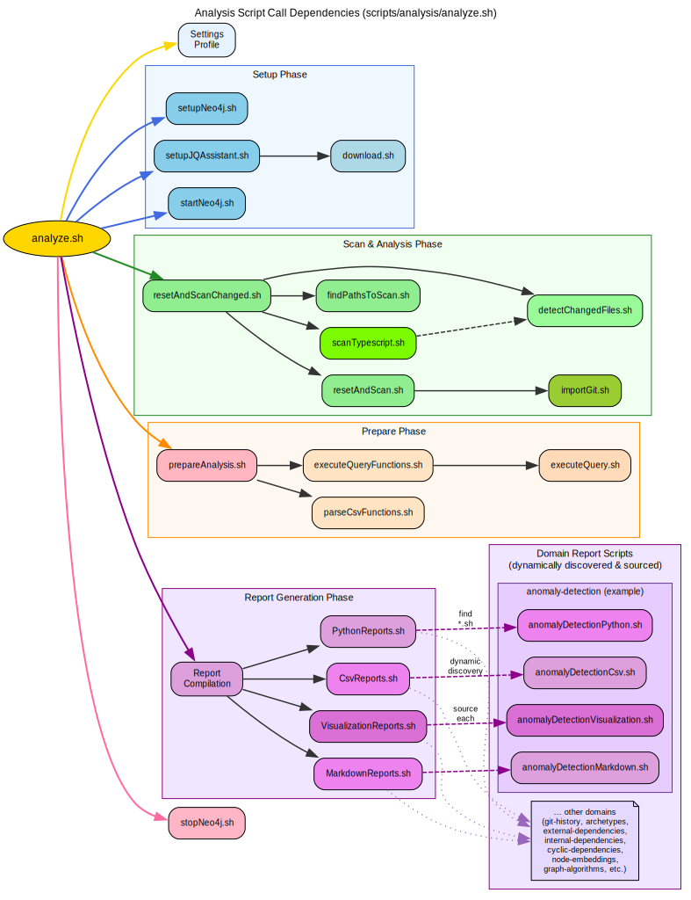

# Code Graph Analysis Pipeline


This repository provides an automated code graph analysis pipeline built on [jQAssistant](https://jqassistant.github.io/jqassistant/current) and [Neo4j](https://neo4j.com). It supports Java and experimental TypeScript analysis, capturing both the structure and evolution of your code base.

Ever wondered which libraries matter most, how your modules build on each other, which parts have few contributors, which files change together, or where structural anomalies emerge?

This project helps uncover such patterns through graph-based analysis, visualization, and machine learning — offering hundreds of expert-level reports for deep code insights.

Curious? Explore the examples at [code-graph-analysis-examples](https://github.com/JohT/code-graph-analysis-examples) and get started with [GETTING_STARTED.md](./GETTING_STARTED.md) :rocket:

---

## :sparkles: Features

- Analyze static code structure as a graph
- Supports Java Code Analysis
- Supports Typescript Code Analysis (experimental)
- Fully automated [pipeline for Java](./.github/workflows/internal-java-code-analysis.yml) from tool installation to report generation
- Fully automated [pipeline for Typescript](./.github/workflows/internal-typescript-code-analysis.yml) from tool installation to report generation
- Fully automated [local run](./GETTING_STARTED.md)
- Easily integrable into your [continuous integration pipeline](./INTEGRATION.md)
- More than 200 CSV reports for dependencies, metrics, cycles, annotations, algorithms and many more
- Python generated charts for dependencies, metrics, visibility and many more
- Markdown summary reports for anomalies, archetypes, git history and many more
- Anomaly detection powered by unsupervised machine learning and explainable AI
- Graph structure visualization
- Automated reference document generation
- Runtime and library independent automation using [shell scripts](./SCRIPTS.md)
- Tested on MacOS (zsh), Linux (bash) and Windows (Git Bash)
- Comprehensive list of [Cypher queries](./CYPHER.md)
- Example analysis for [AxonFramework](https://github.com/AxonFramework/AxonFramework)
- Example analysis for [react-router](https://github.com/remix-run/react-router)

### :newspaper: News

- May 2026: Version 4.0.0 introduces **independently-runnable analysis domains**. Select specific domains via `--domain` or exclude with `--exclude-domain`. No more monolithic execution. See [MIGRATION.md](./MIGRATION.md) for details.
- November 2025: Removed deprecated (since version 2.x) "graph-visualization" node package
- November 2025: Treemap charts for anomalies and archetypes
- October 2025: Graph visualizations for anomaly archetypes
- October 2025: Anomaly archetypes with markdown summary
- August 2025: Association rule mining for co-changing files in git history
- August 2025: Anomaly detection powered by unsupervised machine learning and explainable AI
- May 2025: Migrated to [Neo4j 2025.x](https://neo4j.com/docs/upgrade-migration-guide/current/version-2025/upgrade) and Java 21.

## :compass: Domains

The repository is organized first by problem space. Most functionality lives in self-contained domains under [domains](./domains/), each bundling the scripts, Cypher queries, templates, and exploratory notebooks for one analysis area.

The report types `Csv`, `Python`, `Markdown`, and `Visualization` are secondary execution modes selected via `--report`. They cut across domains, while `--domain` narrows a run to one domain. Not every domain implements every report type.

If you think in architecture terms: domains are the vertical slices, report types are the cross-cutting execution modes.

**By default**, three compute-intensive domains are **deactivated** to reduce analysis time: `anomaly-detection`, `node-embeddings`, and `graph-algorithms`. Activate them individually via `--domain` or include them with `--exclude-domain ""` to run all domains.

### Analysis Domains

| Domain | Description | Java Example | TypeScript Example | Notebooks | Example Chart |
|--------|-------------|--------------|--------------------|-----------|---------------|
| [Anomaly Detection](./domains/anomaly-detection/README.md) | Machine-learning-supported structural anomaly detection | [AxonFramework](https://github.com/JohT/code-graph-analysis-examples/blob/main/analysis-results/AxonFramework/latest/anomaly-detection/anomaly_detection_report.md) | [react-router](https://github.com/JohT/code-graph-analysis-examples/blob/main/analysis-results/react-router/latest/anomaly-detection/anomaly_detection_report.md) | [Explore](./domains/anomaly-detection/explore/AnomalyDetectionExploration.ipynb) | [Anomalies](https://github.com/JohT/code-graph-analysis-examples/blob/main/analysis-results/AxonFramework/latest/anomaly-detection/Java_Type/Anomalies.svg) |
| [Archetypes](./domains/archetypes/README.md) | Structural roles: authority, bottleneck, and hub | [AxonFramework](https://github.com/JohT/code-graph-analysis-examples/blob/main/analysis-results/AxonFramework/latest/archetypes/archetypes_report.md) | [react-router](https://github.com/JohT/code-graph-analysis-examples/blob/main/analysis-results/react-router/latest/archetypes/archetypes_report.md) | — | [Treemap](https://github.com/JohT/code-graph-analysis-examples/blob/main/analysis-results/AxonFramework/latest/archetypes/JavaTreemap1ArchetypesOverviewPerDirectory.svg) |
| [Cyclic Dependencies](./domains/cyclic-dependencies/README.md) | Cycle analysis for Java artifacts, packages, and TypeScript modules | [AxonFramework](https://github.com/JohT/code-graph-analysis-examples/blob/main/analysis-results/AxonFramework/latest/cyclic-dependencies/cyclic_dependencies_report.md) | [react-router](https://github.com/JohT/code-graph-analysis-examples/blob/main/analysis-results/react-router/latest/cyclic-dependencies/cyclic_dependencies_report.md) | [Java](./domains/cyclic-dependencies/explore/CyclicDependenciesJavaExploration.ipynb) , [TypeScript](./domains/cyclic-dependencies/explore/CyclicDependenciesTypescriptExploration.ipynb) | [Cycle Graph](https://github.com/JohT/code-graph-analysis-examples/blob/main/analysis-results/AxonFramework/latest/cyclic-dependencies/Java_Package/Graph_Visualizations/JavaPackageCyclicDependencies1.svg) |
| [External Dependencies](./domains/external-dependencies/README.md) | Usage of external libraries, packages, modules, and namespaces | [AxonFramework](https://github.com/JohT/code-graph-analysis-examples/blob/main/analysis-results/AxonFramework/latest/external-dependencies/external_dependencies_report.md) | [react-router](https://github.com/JohT/code-graph-analysis-examples/blob/main/analysis-results/react-router/latest/external-dependencies/external_dependencies_report.md) | [Java](./domains/external-dependencies/explore/ExternalDependenciesJava.ipynb) , [TypeScript](./domains/external-dependencies/explore/ExternalDependenciesTypescript.ipynb) | [Most Spread Packages](https://github.com/JohT/code-graph-analysis-examples/blob/main/analysis-results/AxonFramework/latest/external-dependencies/Java_Most_spread_packages_by_packages_above_threshold.svg) |
| [Git History](./domains/git-history/README.md) | Change frequency, co-change patterns, authorship, and repository evolution | [AxonFramework](https://github.com/JohT/code-graph-analysis-examples/blob/main/analysis-results/AxonFramework/latest/git-history/git_history_report.md) | [react-router](https://github.com/JohT/code-graph-analysis-examples/blob/main/analysis-results/react-router/latest/git-history/git_history_report.md) | [General](./domains/git-history/explore/GitHistoryGeneralExploration.ipynb) , [Correlation](./domains/git-history/explore/GitHistoryCorrelationExploration.ipynb) | [Co-Changing Files](https://github.com/JohT/code-graph-analysis-examples/blob/main/analysis-results/AxonFramework/latest/git-history/CoChangingFiles.svg) |
| [Graph Algorithms](./domains/graph-algorithms/README.md) | Centrality, communities, similarity, and other Graph Data Science results | [AxonFramework](https://github.com/JohT/code-graph-analysis-examples/blob/main/analysis-results/AxonFramework/latest/graph-algorithms/graph_algorithms_report.md) | [react-router](https://github.com/JohT/code-graph-analysis-examples/blob/main/analysis-results/react-router/latest/graph-algorithms/graph_algorithms_report.md) | — | — |
| [Internal Dependencies](./domains/internal-dependencies/README.md) | Internal structure, path finding, topological order, OOD metrics, visibility metrics, and word clouds | [AxonFramework](https://github.com/JohT/code-graph-analysis-examples/blob/main/analysis-results/AxonFramework/latest/internal-dependencies/internal_dependencies_report.md) | [react-router](https://github.com/JohT/code-graph-analysis-examples/blob/main/analysis-results/react-router/latest/internal-dependencies/internal_dependencies_report.md) | [Java](./domains/internal-dependencies/explore/InternalDependenciesJava.ipynb) , [TypeScript](./domains/internal-dependencies/explore/InternalDependenciesTypescript.ipynb) | [Code Wordcloud](https://github.com/JohT/code-graph-analysis-examples/blob/main/analysis-results/AxonFramework/latest/internal-dependencies/CodeNamesWordcloud.svg) |
| [Java](./domains/java/README.md) | Java code quality, method metrics, annotations, and artifact dependency analysis | [AxonFramework](https://github.com/JohT/code-graph-analysis-examples/blob/main/analysis-results/AxonFramework/latest/java/java_report.md) | — | [Method Metrics](./domains/java/explore/MethodMetricsJavaExploration.ipynb) | [Artifact Dependencies](https://github.com/JohT/code-graph-analysis-examples/blob/main/analysis-results/AxonFramework/latest/java/ArtifactDependencies_OutgoingTop20_Bar.svg) |
| [Node Embeddings](./domains/node-embeddings/README.md) | Graph embeddings and 2D projections for structural exploration | [AxonFramework](https://github.com/JohT/code-graph-analysis-examples/blob/main/analysis-results/AxonFramework/latest/node-embeddings/node_embeddings_report.md) | [react-router](https://github.com/JohT/code-graph-analysis-examples/blob/main/analysis-results/react-router/latest/node-embeddings/node_embeddings_report.md) | [Java](./domains/node-embeddings/explore/NodeEmbeddingsJavaExploration.ipynb) , [TypeScript](./domains/node-embeddings/explore/NodeEmbeddingsTypescriptExploration.ipynb) | [Package Embeddings 2D](https://github.com/JohT/code-graph-analysis-examples/blob/main/analysis-results/AxonFramework/latest/node-embeddings/Package_Embeddings_FastRP_UMAP2D_Scatter.svg) |
| [Overview](./domains/overview/README.md) | High-level project structure, composition, counts, and complexity distributions | [AxonFramework](https://github.com/JohT/code-graph-analysis-examples/blob/main/analysis-results/AxonFramework/latest/overview/overview_report.md) | [react-router](https://github.com/JohT/code-graph-analysis-examples/blob/main/analysis-results/react-router/latest/overview/overview_report.md) | [Java](./domains/overview/explore/OverviewJavaExploration.ipynb) , [TypeScript](./domains/overview/explore/OverviewTypescriptExploration.ipynb) | [Packages Per Artifact](https://github.com/JohT/code-graph-analysis-examples/blob/main/analysis-results/AxonFramework/latest/overview/Overview_Java_Packages_Per_Artifact.svg) |

### Support Domain

- [Neo4j Management](./domains/neo4j-management/README.md) - Neo4j setup, configuration, start, stop, and memory profile management. Usually used indirectly through [analyze.sh](./scripts/analysis/analyze.sh).

### :notebook: Example Reports

Here is a curated overview of report examples and exploratory notebooks from [code-graph-analysis-examples](https://github.com/JohT/code-graph-analysis-examples). These examples are grouped by user-facing output, not by domain.

- [External Dependencies](https://github.com/JohT/code-graph-analysis-examples/blob/main/analysis-results/AxonFramework/latest/external-dependencies/external_dependencies_report.md) contains detailed information about external library usage ([Notebook](./domains/external-dependencies/explore/ExternalDependenciesJava.ipynb)).
- [Git History](https://github.com/JohT/code-graph-analysis-examples/blob/main/analysis-results/AxonFramework/latest/git-history/git_history_report.md) contains information about the git history of the analyzed code ([Notebook](./domains/git-history/explore/GitHistoryGeneralExploration.ipynb)).
- [Internal Dependencies](https://github.com/JohT/code-graph-analysis-examples/blob/main/analysis-results/AxonFramework/latest/internal-dependencies/internal_dependencies_report.md) is based on [Analyze java package metrics in a graph database](https://joht.github.io/johtizen/data/2023/04/21/java-package-metrics-analysis.html) ([Notebook](./domains/internal-dependencies/explore/InternalDependenciesJava.ipynb)).
- [Cyclic Dependencies](https://github.com/JohT/code-graph-analysis-examples/blob/main/analysis-results/AxonFramework/latest/cyclic-dependencies/cyclic_dependencies_report.md) contains information about cyclic dependencies in the analyzed code ([Notebook](./domains/cyclic-dependencies/explore/CyclicDependenciesJavaExploration.ipynb)).
- [Java Method Metrics](https://github.com/JohT/code-graph-analysis-examples/blob/main/analysis-results/AxonFramework/latest/java/java_report.md#3-method-metrics) shows how the effective number of lines of code and the cyclomatic complexity are distributed across the methods in the code ([Notebook](./domains/java/explore/MethodMetricsJavaExploration.ipynb)).
- [Node Embeddings](https://github.com/JohT/code-graph-analysis-examples/blob/main/analysis-results/AxonFramework/latest/node-embeddings/node_embeddings_report.md) shows how to generate node embeddings and to further reduce their dimensionality to be able to visualize them in a 2D plot ([Notebook](./domains/node-embeddings/explore/NodeEmbeddingsJavaExploration.ipynb)).
- [Object Oriented Design Quality Metrics](https://github.com/JohT/code-graph-analysis-examples/blob/main/analysis-results/AxonFramework/latest/internal-dependencies/internal_dependencies_report.md#8-object-oriented-design-metrics) is based on [OO Design Quality Metrics by Robert Martin](https://api.semanticscholar.org/CorpusID:18246616) ([Notebook](./domains/internal-dependencies/explore/ObjectOrientedDesignMetricsJava.ipynb)).
- [Overview](https://github.com/JohT/code-graph-analysis-examples/blob/main/analysis-results/AxonFramework/latest/overview/overview_report.md) contains overall statistics and details about methods and their complexity. ([Notebook](./domains/overview/explore/OverviewJavaExploration.ipynb)).
- [Visibility Metrics](https://github.com/JohT/code-graph-analysis-examples/blob/main/analysis-results/AxonFramework/latest/internal-dependencies/internal_dependencies_report.md#9-visibility-metrics) ([Notebook](./domains/internal-dependencies/explore/VisibilityMetricsJava.ipynb)).
- [Wordcloud](https://github.com/JohT/code-graph-analysis-examples/blob/main/analysis-results/AxonFramework/latest/internal-dependencies/internal_dependencies_report.md#10-code-vocabulary) contains a visual representation of package and class names ([Notebook](./domains/internal-dependencies/explore/Wordcloud.ipynb)).
- [Java Archetypes Treemap](https://github.com/JohT/code-graph-analysis-examples/blob/main/analysis-results/AxonFramework/latest/archetypes/archetypes_report.md#13-overview-charts) ([Python Script](./domains/anomaly-detection/treemapVisualizations.py))

### :blue_book: Graph Data Science Examples

These examples show selected outputs powered by Neo4j's [Graph Data Science Library](https://neo4j.com/product/graph-data-science) across several domains. For a complete list, see the [CSV Cypher Query Report Reference](#page_with_curl-csv-cypher-query-report-reference).

- [Centrality with Page Rank](https://github.com/JohT/code-graph-analysis-examples/blob/main/analysis-results/AxonFramework/latest/graph-algorithms/Java_Package/centrality/Package_Centrality_Page_Rank.csv) ([Source Script](./domains/graph-algorithms/centralityCsv.sh))
- [Community Detection with Leiden](https://github.com/JohT/code-graph-analysis-examples/blob/main/analysis-results/AxonFramework/latest/graph-algorithms/Java_Package/communities/Package_communityLeidenId_Community__Metrics.csv) ([Source Script](./domains/graph-algorithms/communityCsv.sh))
- [Node Embeddings with HashGNN](https://github.com/JohT/code-graph-analysis-examples/blob/main/analysis-results/AxonFramework/latest/node-embeddings/Package_Embeddings_HashGNN.csv) ([Source Script](./domains/node-embeddings/nodeEmbeddingsCsv.sh))
- [Path Finding with all pairs shortest path](https://github.com/JohT/code-graph-analysis-examples/blob/main/analysis-results/AxonFramework/latest/internal-dependencies/Java_Package/Package_all_pairs_shortest_paths_distribution_per_project.csv) ([Source Script](./domains/internal-dependencies/internalDependenciesCsv.sh))
- [Similarity with Jaccard](https://github.com/JohT/code-graph-analysis-examples/blob/main/analysis-results/AxonFramework/latest/graph-algorithms/Java_Package/similarity/Package_Similarity.csv) ([Source Script](./domains/graph-algorithms/similarityCsv.sh))
- [Topology Sort](https://github.com/JohT/code-graph-analysis-examples/blob/main/analysis-results/AxonFramework/latest/internal-dependencies/Java_Package/Package_Topological_Sort.csv) ([Source Script](./domains/internal-dependencies/internalDependenciesCsv.sh))

### :art: Graph Visualization Examples

Here are some fully automated graph visualizations utilizing [GraphViz](https://graphviz.org) from [code-graph-analysis-examples](https://github.com/JohT/code-graph-analysis-examples):

- [Java Artifact Build Levels](https://github.com/JohT/code-graph-analysis-examples/blob/main/analysis-results/AxonFramework/latest/internal-dependencies/Java_Artifact/Graph_Visualizations/JavaArtifactBuildLevels.svg) ([Query](./domains/internal-dependencies/queries/internal-dependencies/Java_Artifact_build_levels_for_graphviz.cypher), [Source Script](./scripts/visualization/visualizeQueryResults.sh))
- [Java Artifact Longest Path Contributors](https://github.com/JohT/code-graph-analysis-examples/blob/main/analysis-results/AxonFramework/latest/internal-dependencies/Java_Artifact/Graph_Visualizations/JavaArtifactLongestPaths.svg) ([Query](./domains/internal-dependencies/queries/path-finding/Path_Finding_6_Longest_paths_contributors_for_graphviz.cypher), [Source Script](./scripts/visualization/visualizeQueryResults.sh))
- [Java Package Top #1 Authority Archetype and contributing packages](https://github.com/JohT/code-graph-analysis-examples/blob/main/analysis-results/AxonFramework/latest/archetypes/Java_Package/GraphVisualizations/TopAuthority1.svg) ([Query](./domains/archetypes/labels/ArchetypeAuthority.cypher), [Source Script](./domains/archetypes/graphs/archetypesGraphs.sh))

## :book: Blog Articles

- [Analyze java dependencies with jQAssistant](https://joht.github.io/johtizen/data/2021/02/21/java-jar-dependency-analysis.html)
- [Analyze java package metrics in a graph database (Part 2)](https://joht.github.io/johtizen/data/2023/04/21/java-package-metrics-analysis.html)

## :mega: Talks

- [Unleashing the Power of Graphs in Java Code Structure Analysis](https://github.com/JohT/code-graph-analysis-examples/blob/main/talks/2023-12-14-Engineering_Kiosk_Alps_Meetup-Code_Structure_Graph_Analysis.pdf) - Engineering Kiosk Alps Meetup, December 2023
- [How anomalous is your code?](https://github.com/JohT/code-graph-analysis-examples/blob/main/talks/2026-02-25_AI_Meetup_Austria_How_Anomalous_Is_Your_Code.pdf) - AI Meetup Austria, February 2026

## :hammer_and_wrench: Prerequisites

Run [scripts/checkCompatibility.sh](./scripts/checkCompatibility.sh) to check if all required dependencies are installed and available in your environment.

- Java 21 is [required since Neo4j 2025.01](https://neo4j.com/docs/operations-manual/current/installation/requirements/#deployment-requirements-java). See also [Changes from Neo4j 5 to 2025.x](https://neo4j.com/docs/upgrade-migration-guide/current/version-2025/upgrade).
- Java 17 is [required for Neo4j 5](https://neo4j.com/docs/operations-manual/current/installation/requirements/#deployment-requirements-java).
- On Windows it is recommended to use the git bash provided by [git for windows](https://github.com/git-guides/install-git#install-git-on-windows).
- [jq](https://github.com/jqlang/jq) the "lightweight and flexible command-line JSON processor" needs to be installed. Latest releases: https://github.com/jqlang/jq/releases/latest. Check using `jq --version`.
- Set environment variable `NEO4J_INITIAL_PASSWORD` to a password of your choice. For example:

  ```shell
  export NEO4J_INITIAL_PASSWORD=neo4j_password_of_my_choice
  ```

  To run Jupyter notebooks, create an `.env` file in the folder from where you open the notebook containing for example: `NEO4J_INITIAL_PASSWORD=neo4j_password_of_my_choice`

### Additional Prerequisites for Python

- Python is required for Python reports.
- [uv](https://docs.astral.sh/uv/) is the primary Python package manager (default). Install from [https://docs.astral.sh/uv/getting-started/installation/](https://docs.astral.sh/uv/getting-started/installation/).
- [Conda](https://docs.conda.io) is a supported optional path. Use for example [Miniconda](https://docs.conda.io/projects/miniconda/en/latest) or [Anaconda](https://www.anaconda.com/download) (Recommended for Windows). Set `PYTHON_PACKAGE_MANAGER=conda` to activate.
- For Conda on Windows, add this line to your `~/.bashrc`: `/c/ProgramData/Anaconda3/etc/profile.d/conda.sh`. Run `conda init` in Git Bash as administrator.

### Additional Prerequisites for analyzing Typescript

- Please follow the description on how to create a json file with the static code information
of your Typescript project here: https://github.com/jqassistant-plugin/jqassistant-typescript-plugin  
This could be as simple as running the following command in your Typescript project:

  ```shell
  npx --yes @jqassistant/ts-lce
  ```

- The cloned repository or source project needs to be copied into the directory called `source` within the analysis workspace, so that it will also be picked up during scan by [resetAndScan.sh](./scripts/resetAndScan.sh) and optional [importGit.sh](./domains/git-history/import/importGit.sh).

## :rocket: Getting Started

See [GETTING_STARTED.md](./GETTING_STARTED.md) on how to get started on your local machine.

## :rocket: Integration

See [INTEGRATION.md](./INTEGRATION.md) on how to integrate code analysis in your continuous integration pipeline.
Currently (2025), only GitHub Actions are supported.

## :gear: How the Pipeline Works

 [Source: analysis_process_graph.gv](./scripts/analysis/analysis_process_graph.gv)

The analysis script [analyze.sh](./scripts/analysis/analyze.sh) orchestrates 5 phases: **Setup** (Neo4j/jQAssistant), **Scan & Analysis** (code scanning), **Prepare** (graph enrichment), **Report Generation** (domain-specific reports), and **Cleanup**. See [COMMANDS.md](./COMMANDS.md) for CLI options and detailed flow.

## :building_construction: Pipeline and Tools

The [Code Structure Analysis Pipeline](./.github/workflows/internal-java-code-analysis.yml) utilizes [GitHub Actions](https://docs.github.com/de/actions) to automate the whole analysis process:

- Use [GitHub Actions](https://docs.github.com/de/actions) Linux Runner
- [Checkout GIT Repository](https://github.com/actions/checkout)
- [Setup Java](https://github.com/actions/setup-java)
- [Setup uv](https://github.com/astral-sh/setup-uv) — Primary Python package manager
- [Setup Python with Conda](https://github.com/conda-incubator/setup-miniconda) package manager [Mambaforge](https://github.com/conda-forge/miniforge#mambaforge) — Optional alternative
- Download artifacts and optionally source code that contain the code to be analyzed [scripts/downloader](./scripts/downloader)
- Setup [Neo4j](https://neo4j.com) Graph Database ([analysis.sh](./scripts/analysis/analyze.sh))
- Setup [jQAssistant](https://jqassistant.github.io/jqassistant/current) for Java and [Typescript](https://github.com/jqassistant-plugin/jqassistant-typescript-plugin) analysis ([analysis.sh](./scripts/analysis/analyze.sh))
- Start [Neo4j](https://neo4j.com) Graph Database ([analysis.sh](./scripts/analysis/analyze.sh))
- Generate CSV Reports [scripts/reports](./scripts/reports) using the command line JSON parser [jq](https://jqlang.github.io/jq)
- Uses [Neo4j Graph Data Science](https://neo4j.com/product/graph-data-science) for community detection, centrality, similarity, node embeddings and topological sort ([analysis.sh](./scripts/analysis/analyze.sh))
- Generate Python and Markdown reports using these libraries specified in the [conda-environment.yml](./conda-environment.yml):
  - [Python](https://www.python.org)
  - [matplotlib](https://matplotlib.org)
  - [numpy](https://numpy.org)
  - [pandas](https://pandas.pydata.org)
  - [pip](https://pip.pypa.io/en/stable)
  - [plotly](https://plotly.com/python)
  - [monotonic](https://github.com/atdt/monotonic)
  - [Neo4j Python Driver](https://neo4j.com/docs/api/python-driver)
  - [openTSNE](https://github.com/pavlin-policar/openTSNE)
  - [wordcloud](https://github.com/amueller/word_cloud)
  - [umap](https://umap-learn.readthedocs.io)
  - [scikit-learn](https://scikit-learn.org)
  - [optuna](https://optuna.org)
  - [SHAP](https://github.com/shap/shap)
- [HPCC-Systems (High Performance Computing Cluster) Web-Assembly (JavaScript)](https://github.com/hpcc-systems/hpcc-js-wasm) containing a wrapper for GraphViz to visualize graph structures.
- [GraphViz](https://gitlab.com/graphviz/graphviz) for CLI Graph Visualization
- [Check links in markdown documentation (GitHub workflow)](./.github/workflows/internal-check-links-in-documentation.yml) uses [markdown-link-check](https://github.com/tcort/markdown-link-check).

**Big shout-out** 📣 to all the creators and contributors of these great libraries 👍. Projects like this wouldn't be possible without them. Feel free to [create an issue](https://github.com/JohT/code-graph-analysis-pipeline/issues/new/choose) if something is missing or wrong in the list.

## :runner: Command Reference

[COMMANDS.md](./COMMANDS.md) contains further details on commands and how to do a manual setup.

## :page_with_curl: CSV Cypher Query Report Reference

[CSV_REPORTS.md](https://github.com/JohT/code-graph-analysis-examples/blob/main/analysis-results/CSV_REPORTS.md) lists all CSV Cypher query result reports inside the [results](https://github.com/JohT/code-graph-analysis-examples/blob/main/analysis-results) directory. It can be generated as described in [Generate CSV Report Reference](./COMMANDS.md#generate-csv-cypher-query-report-reference).

## :camera: Image Reference

[IMAGES.md](https://github.com/JohT/code-graph-analysis-examples/blob/main/analysis-results/IMAGES.md) lists all PNG images inside the [results](https://github.com/JohT/code-graph-analysis-examples/blob/main/analysis-results) directory. It can be generated as described in [Generate Image Reference](./COMMANDS.md#generate-image-reference).

## :gear: Script Reference

[SCRIPTS.md](./SCRIPTS.md) lists all shell scripts of this repository including their first comment line as a description. It can be generated as described in [Generate Script Reference](./COMMANDS.md#generate-script-reference).

## :mag: Cypher Query Reference

[CYPHER.md](./CYPHER.md) lists all Cypher queries of this repository including their first comment line as a description. It can be generated as described in [Generate Cypher Reference](./COMMANDS.md#generate-cypher-reference).
> [Cypher](https://neo4j.com/docs/getting-started/cypher-intro) is Neo4j’s graph query language that lets you retrieve data from the graph.

## :globe_with_meridians: Environment Variable Reference

[ENVIRONMENT_VARIABLES.md](./ENVIRONMENT_VARIABLES.md) contains all environment variables that are supported by the scripts including default values and description. It can be generated as described in [Generate Environment Variable Reference](./COMMANDS.md#generate-environment-variable-reference).

## :closed_book: Change Log

[CHANGELOG.md](./CHANGELOG.md) contains all changes of this repository.

## :thinking: Questions & Answers

- How can i run an analysis locally?  
  👉 Check the [prerequisites](#hammer_and_wrench-prerequisites).
  👉 See [Start an analysis](./COMMANDS.md#start-an-analysis) in the [Commands Reference](./COMMANDS.md).
  👉 To get started from scratch see [GETTING_STARTED.md](./GETTING_STARTED.md).

- How can i explore the Graph manually?
  👉 After analysis [start Neo4j](./COMMANDS.md#start-neo4j-graph-database) and open the Neo4j Web UI (`http://localhost:7474/browser`).

- How can i add a CSV report to the pipeline?  
  👉 Put your new cypher query into the [cypher](./cypher) directory or a suitable (new) sub directory.  
  👉 Create a new CSV report script in a domain directory under [domains](./domains/) or in [scripts/reports](./scripts/reports/). Take for example [overviewCsv.sh](./domains/overview/overviewCsv.sh) as a reference.  
  👉 The script will automatically be included because of the directory and its name ending with "Csv.sh".

- How can i analyze a different code basis automatically?  
  👉 Create a new download script like the ones in the [scripts/downloader](./scripts/downloader/) directory. Take for example [downloadAxonFramework.sh](./scripts/downloader/downloadAxonFramework.sh) as a reference for Java projects and [downloadReactRouter.sh](./scripts/downloader/downloadReactRouter.sh) as a reference for Typescript projects.
  👉 After downloading, run [analyze.sh](./scripts/analysis/analyze.sh). You can find these steps also in the [pipeline](./.github/workflows/internal-java-code-analysis.yml) as a reference.

- How can i trigger a full re-scan of all artifacts?  
  👉 Delete the file `artifactsChangeDetectionHash.txt` in the `artifacts` directory.
  👉 Delete the file `typescriptFileChangeDetectionHashFile.txt` in the `source` directory to additionally re-scan Typescript projects.

- How can I disable git log data import?  
  👉 Set environment variable `IMPORT_GIT_LOG_DATA_IF_SOURCE_IS_PRESENT` to `none`. Example:  

  ```shell
  export IMPORT_GIT_LOG_DATA_IF_SOURCE_IS_PRESENT="none"
  ```

  👉 Alternatively prepend your command with `IMPORT_GIT_LOG_DATA_IF_SOURCE_IS_PRESENT="none"`:  
  
  ```shell
  IMPORT_GIT_LOG_DATA_IF_SOURCE_IS_PRESENT="none" ./../../scripts/analysis/analyze.sh
  ```

  👉 An in-between option would be to only import monthly aggregated changes using `IMPORT_GIT_LOG_DATA_IF_SOURCE_IS_PRESENT="aggregated"`:  
  
  ```shell
  IMPORT_GIT_LOG_DATA_IF_SOURCE_IS_PRESENT="aggregated" ./../../scripts/analysis/analyze.sh
  ```

- What changed in version 4 regarding report generation?  
  👉 Jupyter notebook execution, PDF generation (`ENABLE_JUPYTER_NOTEBOOK_PDF_GENERATION`) and `--report Jupyter` have been removed.  
  👉 Use `--report All` to generate every report (recommended). `--report Markdown` produces Markdown summaries but is not always a drop-in replacement for the removed Jupyter pipeline on a fresh workspace: some Markdown summaries depend on prior CSV or Python outputs (for example, [domains/overview/summary/overviewSummary.sh](domains/overview/summary/overviewSummary.sh#L11) and [domains/external-dependencies/summary/externalDependenciesSummary.sh](domains/external-dependencies/summary/externalDependenciesSummary.sh#L9)). To get complete Markdown reports on a fresh workspace either run `--report Csv` or `--report Python` for the affected domains first, or use `--report All`.  
  👉 The 25 `explore/*.ipynb` notebooks in `domains/*/explore/` remain available for interactive exploration but are no longer executed automatically.  
  👉 `nbconvert` is no longer required for automatic report generation and can be uninstalled. If you still want to open the `explore/*.ipynb` notebooks interactively you may still keep (or install) `jupyter` separately.

- How can I increase the heap memory when scanning large Typescript projects?  
  👉 Use the environment variable TYPESCRIPT_SCAN_HEAP_MEMORY in megabyte (default = 4096):

  ```shell
  TYPESCRIPT_SCAN_HEAP_MEMORY=16384 ./../../scripts/analysis/analyze.sh
  ```

- How can I continue on errors when scanning Typescript projects instead of cancelling the whole analysis?  
  👉 Use the profile `Neo4j-latest-continue-on-scan-errors` (default = `Neo4j-latest`):

  ```shell
  ./../../scripts/analysis/analyze.sh --profile Neo4j-latest-continue-on-scan-errors
  ```

- How can I reduce the memory (RAM) consumption?  
  👉 Use the profile `Neo4j-latest-low-memory` (default = `Neo4j-latest`):

  ```shell
  ./../../scripts/analysis/analyze.sh --profile Neo4j-latest-low-memory
  ```

- How can I increase the memory (RAM) consumption?  
  👉 Use the profile `Neo4j-latest-high-memory` (default = `Neo4j-latest`):

  ```shell
  ./../../scripts/analysis/analyze.sh --profile Neo4j-latest-high-memory
  ```

- How can i increase the memory (RAM) consumption afterwards, when the setup is already done?  
  👉 Simply run `useNeo4jHighMemoryProfile.sh` in your analysis working directory, or:

  ```shell
  ./../../domains/neo4j-management/useNeo4jHighMemoryProfile.sh
  ```

## 🕸 Web References

- [code-graph-analysis-examples](https://github.com/JohT/code-graph-analysis-examples)
- [Bite-Sized Neo4j for Data Scientists](https://neo4j.com/video/bite-sized-neo4j-for-data-scientists)
- [The Story behind Russian Twitter Trolls](https://neo4j.com/blog/story-behind-russian-twitter-trolls)
- [Graphs for Data Science and Machine Learning](https://de.slideshare.net/neo4j/graphs-for-data-science-and-machine-learning)
- [Modularity](https://www.cs.cmu.edu/~ckingsf/bioinfo-lectures/modularity.pdf)
- [Graph Data Science Centrality Algorithms](https://neo4j.com/docs/graph-data-science/2.5/algorithms/centrality)
- [Graph Data Science Community Detection Algorithms](https://neo4j.com/docs/graph-data-science/2.5/algorithms/community)
- [Graph Data Science Community Similarity Algorithms](https://neo4j.com/docs/graph-data-science/2.5/algorithms/similarity)
- [Graph Data Science Community Topological Sort Algorithm](https://neo4j.com/docs/graph-data-science/2.5/algorithms/dag/topological-sort)
- [Node embeddings for Beginners](https://towardsdatascience.com/node-embeddings-for-beginners-554ab1625d98)
