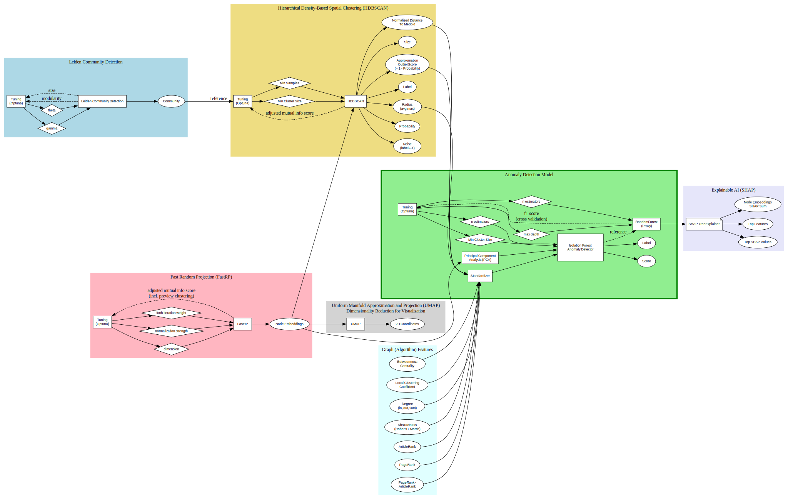

# Anomaly Detection Domain

This directory contains the implementation and resources related to the Anomaly Detection domain within the Code Graph Analysis Pipeline project.

## Entry Points

The following scripts serve as entry points for various anomaly detection tasks and reports. They will be invoked by [AllReports.sh](./../../scripts/reports/compilations/AllReports.sh) an its sub-scripts dynamically by their names.

- [anomalyDetectionCsv.sh](./anomalyDetectionCsv.sh): Entry point for CSV reports based solely on Graph queries.
- [anomalyDetectionPython.sh](./anomalyDetectionPython.sh): Entry point for Python-based anomaly detection tasks and reports.
- [anomalyDetectionVisualization.sh](./anomalyDetectionVisualization.sh): Entry point for Graph visualization reports.
- [anomalyDetectionMarkdown.sh](./anomalyDetectionMarkdown.sh): Entry point for generating the Markdown summary report.

## Folder Structure

- [documentation](./documentation): Contains documentation including architecture diagrams.
- [explore](./explore/): Jupyter notebooks for interactive, exploratory anomaly detection analysis.
- [features](./features/): Cypher queries to extract features and run graph algorithms relevant for anomaly detection.
- [graphs](./graphs/): Cypher queries and GraphViz templates for Graph visualizations related to anomaly detection.
- [labels](./labels/): Cypher queries label nodes that represent specific archetypes.
- [queries](./queries/): Cypher queries to identify anomalies based on various (deterministic/explainable) criteria.
- [reset](./reset/): Cypher queries to reset the graph database state related to anomaly detection.
- [summary](./summary/): Markdown templates and resources for generating the summary report.

## Pipeline Architecture Overview

