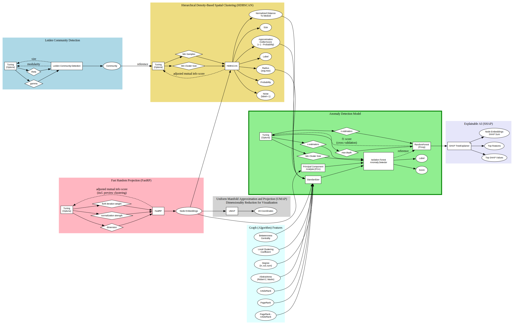

# Anomaly Detection Domain

This directory contains the implementation and resources related to the Anomaly Detection domain within the Code Graph Analysis Pipeline project.

The Anomaly Detection domain uses machine learning (Graph Neural Networks + XGBoost) to detect structural anomalies. It identifies **Bridge** nodes (structural vulnerability points) and **Outlier** nodes (structurally unusual code units).

**Note:** Structural archetypes like Authority, Bottleneck, and Hub are managed by the separate [archetypes domain](../archetypes/). This domain focuses exclusively on ML-detected anomalies.

## Entry Points

The following scripts serve as entry points for various anomaly detection tasks and reports. They will be invoked by [AllReports.sh](./../../scripts/reports/compilations/AllReports.sh) an its sub-scripts dynamically by their names.

- [anomalyDetectionCsv.sh](./anomalyDetectionCsv.sh): Entry point for CSV reports based solely on Graph queries.
- [anomalyDetectionPython.sh](./anomalyDetectionPython.sh): Entry point for Python-based anomaly detection tasks and reports.
- [anomalyDetectionVisualization.sh](./anomalyDetectionVisualization.sh): Entry point for Graph visualization reports.
- [anomalyDetectionMarkdown.sh](./anomalyDetectionMarkdown.sh): Entry point for generating the Markdown summary report.

## Folder Structure

- [documentation](./documentation): Contains documentation including architecture diagrams.
- [explore](./explore/): Jupyter notebooks for interactive, exploratory anomaly detection analysis.
- [features](./features/): Cypher queries to extract features and run graph algorithms relevant for anomaly detection.
- [graphs](./graphs/): Cypher queries and GraphViz templates for Graph visualizations (Bridge/Outlier tree maps).
- [labels](./labels/): Cypher queries to label nodes as Bridge (structural vulnerability) or Outlier (structural anomaly).
- [queries](./queries/): Cypher queries to identify structural patterns (not anomalies).
- [reset](./reset/): Cypher queries to reset the graph database state related to anomaly detection.
- [summary](./summary/): Markdown templates and resources for generating the summary report.

## Relationship to `archetypes` Domain

- **Anomaly Detection** owns: Bridge and Outlier (ML-detected anomalies)
- **Archetypes Domain** owns: Authority, Bottleneck, Hub (structural patterns)

For structural insights at different code levels (Package, Type, Module), run both domains via:
```
analyze.sh --domain archetypes,anomaly-detection
```

## Pipeline Architecture Overview

