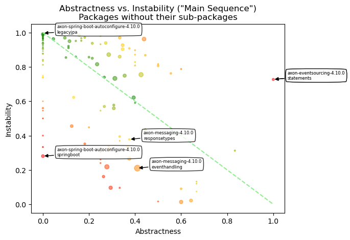
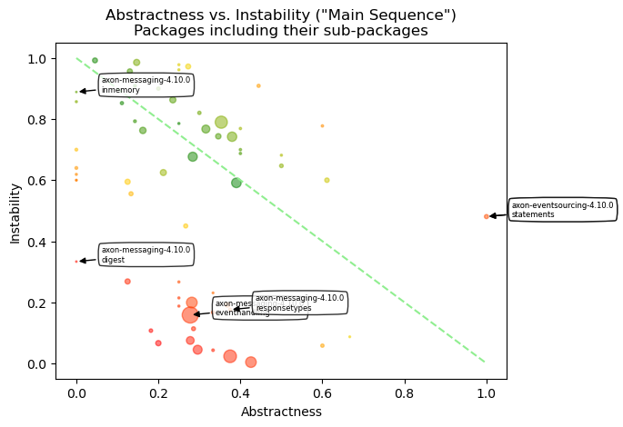

# Object Oriented Design Quality Metrics
   

### References
- [Analyze java package metrics in a graph database](https://joht.github.io/johtizen/data/2023/04/21/java-package-metrics-analysis.html)
- [Calculate metrics](https://101.jqassistant.org/calculate-metrics/index.html)
- [jqassistant](https://jqassistant.org)
- [notebook walks through examples for integrating various packages with Neo4j](https://nicolewhite.github.io/neo4j-jupyter/hello-world.html)
- [OO Design Quality Metrics](https://api.semanticscholar.org/CorpusID:18246616)
- [A Validation of Martin's Metric](https://www.researchgate.net/publication/31598248_A_Validation_of_Martin's_Metric)
- [Neo4j Python Driver](https://neo4j.com/docs/api/python-driver/current)

## Incoming Dependencies

Incoming dependencies are also denoted as "Fan-in", "Afferent Coupling" or "in-degree".
These are the ones that use the listed package. 
   
If these packages get changed, the incoming dependencies might be affected by the change. The more incoming dependencies, the harder it gets to change the code without the need to adapt the dependent code (“rigid code”). Even worse, it might affect the behavior of the dependent code in an unwanted way (“fragile code”).

Since Java Packages are organized hierarchically, incoming dependencies can be count for every package in isolation or by including all of its sub-packages. The latter one is done without top level packages like for example "org" or "org.company" by assuring that only packages are considered that have other packages or types in the same hierarchy level ("siblings").

#### Table 1a
- Show the top 20 Java Packages with the most incoming dependencies
- Set the "incomingDependencies" properties on Package nodes.

<table border="1" class="dataframe">
  <thead>
    <tr style="text-align: right;">
      <th></th>
      <th>artifactName</th>
      <th>fullQualifiedPackageName</th>
      <th>packageName</th>
      <th>incomingDependencies</th>
      <th>incomingDependenciesWeight</th>
      <th>incomingDependentTypes</th>
      <th>incomingDependentInterfaces</th>
      <th>incomingDependentPackages</th>
      <th>incomingDependentArtifacts</th>
    </tr>
  </thead>
  <tbody>
    <tr>
      <th>0</th>
      <td>axon-messaging-4.10.0</td>
      <td>org.axonframework.messaging</td>
      <td>messaging</td>
      <td>9924</td>
      <td>29253</td>
      <td>363</td>
      <td>68</td>
      <td>61</td>
      <td>8</td>
    </tr>
    <tr>
      <th>1</th>
      <td>axon-messaging-4.10.0</td>
      <td>org.axonframework.eventhandling</td>
      <td>eventhandling</td>
      <td>5871</td>
      <td>25317</td>
      <td>329</td>
      <td>57</td>
      <td>52</td>
      <td>6</td>
    </tr>
    <tr>
      <th>2</th>
      <td>axon-messaging-4.10.0</td>
      <td>org.axonframework.commandhandling</td>
      <td>commandhandling</td>
      <td>1903</td>
      <td>6289</td>
      <td>137</td>
      <td>20</td>
      <td>21</td>
      <td>7</td>
    </tr>
    <tr>
      <th>3</th>
      <td>axon-messaging-4.10.0</td>
      <td>org.axonframework.serialization</td>
      <td>serialization</td>
      <td>1655</td>
      <td>6748</td>
      <td>175</td>
      <td>16</td>
      <td>40</td>
      <td>5</td>
    </tr>
    <tr>
      <th>4</th>
      <td>axon-messaging-4.10.0</td>
      <td>org.axonframework.messaging.annotation</td>
      <td>annotation</td>
      <td>1079</td>
      <td>4042</td>
      <td>154</td>
      <td>19</td>
      <td>26</td>
      <td>6</td>
    </tr>
    <tr>
      <th>5</th>
      <td>axon-messaging-4.10.0</td>
      <td>org.axonframework.common</td>
      <td>common</td>
      <td>1043</td>
      <td>2446</td>
      <td>367</td>
      <td>15</td>
      <td>86</td>
      <td>8</td>
    </tr>
    <tr>
      <th>6</th>
      <td>axon-messaging-4.10.0</td>
      <td>org.axonframework.tracing</td>
      <td>tracing</td>
      <td>635</td>
      <td>2923</td>
      <td>109</td>
      <td>13</td>
      <td>24</td>
      <td>6</td>
    </tr>
    <tr>
      <th>7</th>
      <td>axon-messaging-4.10.0</td>
      <td>org.axonframework.queryhandling</td>
      <td>queryhandling</td>
      <td>415</td>
      <td>1698</td>
      <td>80</td>
      <td>13</td>
      <td>13</td>
      <td>3</td>
    </tr>
    <tr>
      <th>8</th>
      <td>axon-configuration-4.10.0</td>
      <td>org.axonframework.config</td>
      <td>config</td>
      <td>384</td>
      <td>3033</td>
      <td>62</td>
      <td>13</td>
      <td>9</td>
      <td>2</td>
    </tr>
    <tr>
      <th>9</th>
      <td>axon-messaging-4.10.0</td>
      <td>org.axonframework.common.transaction</td>
      <td>transaction</td>
      <td>368</td>
      <td>1103</td>
      <td>89</td>
      <td>5</td>
      <td>32</td>
      <td>5</td>
    </tr>
    <tr>
      <th>10</th>
      <td>axon-modelling-4.10.0</td>
      <td>org.axonframework.modelling.command</td>
      <td>command</td>
      <td>273</td>
      <td>938</td>
      <td>81</td>
      <td>8</td>
      <td>12</td>
      <td>6</td>
    </tr>
    <tr>
      <th>11</th>
      <td>axon-modelling-4.10.0</td>
      <td>org.axonframework.modelling.saga</td>
      <td>saga</td>
      <td>263</td>
      <td>1142</td>
      <td>62</td>
      <td>12</td>
      <td>11</td>
      <td>3</td>
    </tr>
    <tr>
      <th>12</th>
      <td>axon-messaging-4.10.0</td>
      <td>org.axonframework.messaging.unitofwork</td>
      <td>unitofwork</td>
      <td>259</td>
      <td>1085</td>
      <td>83</td>
      <td>5</td>
      <td>37</td>
      <td>6</td>
    </tr>
    <tr>
      <th>13</th>
      <td>axon-messaging-4.10.0</td>
      <td>org.axonframework.deadline</td>
      <td>deadline</td>
      <td>247</td>
      <td>1243</td>
      <td>45</td>
      <td>9</td>
      <td>13</td>
      <td>4</td>
    </tr>
    <tr>
      <th>14</th>
      <td>axon-eventsourcing-4.10.0</td>
      <td>org.axonframework.eventsourcing.eventstore.jdbc</td>
      <td>jdbc</td>
      <td>235</td>
      <td>1288</td>
      <td>27</td>
      <td>14</td>
      <td>3</td>
      <td>1</td>
    </tr>
    <tr>
      <th>15</th>
      <td>axon-eventsourcing-4.10.0</td>
      <td>org.axonframework.eventsourcing.eventstore</td>
      <td>eventstore</td>
      <td>205</td>
      <td>816</td>
      <td>70</td>
      <td>5</td>
      <td>14</td>
      <td>5</td>
    </tr>
    <tr>
      <th>16</th>
      <td>axon-messaging-4.10.0</td>
      <td>org.axonframework.messaging.deadletter</td>
      <td>deadletter</td>
      <td>205</td>
      <td>1150</td>
      <td>39</td>
      <td>8</td>
      <td>9</td>
      <td>2</td>
    </tr>
    <tr>
      <th>17</th>
      <td>axon-messaging-4.10.0</td>
      <td>org.axonframework.monitoring</td>
      <td>monitoring</td>
      <td>199</td>
      <td>531</td>
      <td>41</td>
      <td>6</td>
      <td>11</td>
      <td>4</td>
    </tr>
    <tr>
      <th>18</th>
      <td>axon-eventsourcing-4.10.0</td>
      <td>org.axonframework.eventsourcing</td>
      <td>eventsourcing</td>
      <td>148</td>
      <td>580</td>
      <td>47</td>
      <td>5</td>
      <td>7</td>
      <td>5</td>
    </tr>
    <tr>
      <th>19</th>
      <td>axon-server-connector-4.10.0</td>
      <td>org.axonframework.axonserver.connector</td>
      <td>connector</td>
      <td>117</td>
      <td>571</td>
      <td>55</td>
      <td>2</td>
      <td>13</td>
      <td>1</td>
    </tr>
  </tbody>
</table>

#### Table 1b
- Show the top 20 Java Packages including their sub-packages with the most incoming dependencies
- Set the property "incomingDependenciesIncludingSubpackages" on Package nodes.

<table border="1" class="dataframe">
  <thead>
    <tr style="text-align: right;">
      <th></th>
      <th>artifactName</th>
      <th>fullQualifiedPackageName</th>
      <th>packageName</th>
      <th>incomingDependencies</th>
      <th>incomingDependenciesWeight</th>
      <th>incomingDependentTypes</th>
      <th>incomingDependentInterfaces</th>
      <th>incomingDependentPackages</th>
      <th>incomingDependentArtifacts</th>
    </tr>
  </thead>
  <tbody>
    <tr>
      <th>0</th>
      <td>axon-messaging-4.10.0</td>
      <td>org.axonframework.messaging</td>
      <td>messaging</td>
      <td>8873</td>
      <td>28110</td>
      <td>372</td>
      <td>83</td>
      <td>62</td>
      <td>8</td>
    </tr>
    <tr>
      <th>1</th>
      <td>axon-messaging-4.10.0</td>
      <td>org.axonframework.eventhandling</td>
      <td>eventhandling</td>
      <td>3663</td>
      <td>13842</td>
      <td>173</td>
      <td>62</td>
      <td>33</td>
      <td>6</td>
    </tr>
    <tr>
      <th>2</th>
      <td>axon-messaging-4.10.0</td>
      <td>org.axonframework.serialization</td>
      <td>serialization</td>
      <td>1500</td>
      <td>6108</td>
      <td>131</td>
      <td>17</td>
      <td>35</td>
      <td>5</td>
    </tr>
    <tr>
      <th>3</th>
      <td>axon-messaging-4.10.0</td>
      <td>org.axonframework.common</td>
      <td>common</td>
      <td>1458</td>
      <td>4039</td>
      <td>405</td>
      <td>22</td>
      <td>82</td>
      <td>8</td>
    </tr>
    <tr>
      <th>4</th>
      <td>axon-messaging-4.10.0</td>
      <td>org.axonframework.commandhandling</td>
      <td>commandhandling</td>
      <td>1015</td>
      <td>3962</td>
      <td>70</td>
      <td>20</td>
      <td>16</td>
      <td>7</td>
    </tr>
    <tr>
      <th>5</th>
      <td>axon-messaging-4.10.0</td>
      <td>org.axonframework.messaging.annotation</td>
      <td>annotation</td>
      <td>960</td>
      <td>3695</td>
      <td>109</td>
      <td>19</td>
      <td>25</td>
      <td>6</td>
    </tr>
    <tr>
      <th>6</th>
      <td>axon-messaging-4.10.0</td>
      <td>org.axonframework.tracing</td>
      <td>tracing</td>
      <td>565</td>
      <td>2627</td>
      <td>85</td>
      <td>13</td>
      <td>21</td>
      <td>5</td>
    </tr>
    <tr>
      <th>7</th>
      <td>axon-messaging-4.10.0</td>
      <td>org.axonframework.common.transaction</td>
      <td>transaction</td>
      <td>362</td>
      <td>1089</td>
      <td>86</td>
      <td>5</td>
      <td>31</td>
      <td>5</td>
    </tr>
    <tr>
      <th>8</th>
      <td>axon-configuration-4.10.0</td>
      <td>org.axonframework.config</td>
      <td>config</td>
      <td>265</td>
      <td>1808</td>
      <td>26</td>
      <td>13</td>
      <td>8</td>
      <td>1</td>
    </tr>
    <tr>
      <th>9</th>
      <td>axon-messaging-4.10.0</td>
      <td>org.axonframework.queryhandling</td>
      <td>queryhandling</td>
      <td>252</td>
      <td>1005</td>
      <td>33</td>
      <td>12</td>
      <td>10</td>
      <td>3</td>
    </tr>
    <tr>
      <th>10</th>
      <td>axon-messaging-4.10.0</td>
      <td>org.axonframework.messaging.unitofwork</td>
      <td>unitofwork</td>
      <td>222</td>
      <td>868</td>
      <td>72</td>
      <td>5</td>
      <td>36</td>
      <td>6</td>
    </tr>
    <tr>
      <th>11</th>
      <td>axon-messaging-4.10.0</td>
      <td>org.axonframework.monitoring</td>
      <td>monitoring</td>
      <td>189</td>
      <td>501</td>
      <td>36</td>
      <td>6</td>
      <td>10</td>
      <td>4</td>
    </tr>
    <tr>
      <th>12</th>
      <td>axon-eventsourcing-4.10.0</td>
      <td>org.axonframework.eventsourcing</td>
      <td>eventsourcing</td>
      <td>173</td>
      <td>645</td>
      <td>28</td>
      <td>21</td>
      <td>7</td>
      <td>4</td>
    </tr>
    <tr>
      <th>13</th>
      <td>axon-messaging-4.10.0</td>
      <td>org.axonframework.messaging.deadletter</td>
      <td>deadletter</td>
      <td>173</td>
      <td>1018</td>
      <td>24</td>
      <td>8</td>
      <td>8</td>
      <td>2</td>
    </tr>
    <tr>
      <th>14</th>
      <td>axon-modelling-4.10.0</td>
      <td>org.axonframework.modelling.command</td>
      <td>command</td>
      <td>163</td>
      <td>537</td>
      <td>39</td>
      <td>8</td>
      <td>9</td>
      <td>5</td>
    </tr>
    <tr>
      <th>15</th>
      <td>axon-eventsourcing-4.10.0</td>
      <td>org.axonframework.eventsourcing.eventstore</td>
      <td>eventstore</td>
      <td>144</td>
      <td>464</td>
      <td>35</td>
      <td>19</td>
      <td>9</td>
      <td>5</td>
    </tr>
    <tr>
      <th>16</th>
      <td>axon-messaging-4.10.0</td>
      <td>org.axonframework.deadline</td>
      <td>deadline</td>
      <td>128</td>
      <td>764</td>
      <td>22</td>
      <td>9</td>
      <td>9</td>
      <td>4</td>
    </tr>
    <tr>
      <th>17</th>
      <td>axon-modelling-4.10.0</td>
      <td>org.axonframework.modelling.saga</td>
      <td>saga</td>
      <td>97</td>
      <td>277</td>
      <td>23</td>
      <td>12</td>
      <td>5</td>
      <td>2</td>
    </tr>
    <tr>
      <th>18</th>
      <td>axon-messaging-4.10.0</td>
      <td>org.axonframework.lifecycle</td>
      <td>lifecycle</td>
      <td>95</td>
      <td>262</td>
      <td>27</td>
      <td>3</td>
      <td>20</td>
      <td>4</td>
    </tr>
    <tr>
      <th>19</th>
      <td>axon-messaging-4.10.0</td>
      <td>org.axonframework.messaging.responsetypes</td>
      <td>responsetypes</td>
      <td>90</td>
      <td>372</td>
      <td>20</td>
      <td>4</td>
      <td>5</td>
      <td>1</td>
    </tr>
  </tbody>
</table>

## Outgoing Dependencies

Outgoing dependencies are also denoted as "Fan-out", "Efferent Coupling" or "out-degree".
These are the ones that are used by the listed package. 

Code from other packages and libraries you’re depending on (outgoing) might change over time. The more outgoing changes, the more likely and frequently code changes are needed. This involves time and effort which can be reduced by automation of tests and version updates. Automated tests are crucial to reveal updates, that change the behavior of the code unexpectedly (“fragile code”). As soon as more effort is required, keeping up becomes difficult (“rigid code”). Not being able to use a newer version might not only restrict features, it can get problematic if there are security issues. This might force you to take “fast but ugly” solutions into account which further increases technical dept.

Since Java Packages are organized hierarchically, outgoing dependencies can be count for every package in isolation or by including all of its sub-packages. The latter one is done without top level packages like for example "org" or "org.company" by assuring that only packages are considered that have other packages or types in the same hierarchy level ("siblings").

#### Table 2a

- Show the top 20 Java Packages with the most outgoing dependencies
- Set the "outgoingDependencies" properties on Package nodes.

<table border="1" class="dataframe">
  <thead>
    <tr style="text-align: right;">
      <th></th>
      <th>artifactName</th>
      <th>fullQualifiedPackageName</th>
      <th>packageName</th>
      <th>outgoingDependencies</th>
      <th>outgoingDependenciesWeight</th>
      <th>outgoingDependentTypes</th>
      <th>outgoingDependentInterfaces</th>
      <th>outgoingDependentPackages</th>
      <th>outgoingDependentArtifacts</th>
    </tr>
  </thead>
  <tbody>
    <tr>
      <th>0</th>
      <td>axon-configuration-4.10.0</td>
      <td>org.axonframework.config</td>
      <td>config</td>
      <td>9870</td>
      <td>37642</td>
      <td>241</td>
      <td>92</td>
      <td>46</td>
      <td>4</td>
    </tr>
    <tr>
      <th>1</th>
      <td>axon-spring-boot-autoconfigure-4.10.0</td>
      <td>org.axonframework.springboot.autoconfig</td>
      <td>autoconfig</td>
      <td>5721</td>
      <td>20298</td>
      <td>236</td>
      <td>68</td>
      <td>57</td>
      <td>6</td>
    </tr>
    <tr>
      <th>2</th>
      <td>axon-test-4.10.0</td>
      <td>org.axonframework.test.aggregate</td>
      <td>aggregate</td>
      <td>2210</td>
      <td>7997</td>
      <td>92</td>
      <td>34</td>
      <td>16</td>
      <td>3</td>
    </tr>
    <tr>
      <th>3</th>
      <td>axon-server-connector-4.10.0</td>
      <td>org.axonframework.axonserver.connector.query</td>
      <td>query</td>
      <td>1569</td>
      <td>6983</td>
      <td>91</td>
      <td>31</td>
      <td>13</td>
      <td>1</td>
    </tr>
    <tr>
      <th>4</th>
      <td>axon-messaging-4.10.0</td>
      <td>org.axonframework.eventhandling</td>
      <td>eventhandling</td>
      <td>1563</td>
      <td>6457</td>
      <td>160</td>
      <td>57</td>
      <td>16</td>
      <td>0</td>
    </tr>
    <tr>
      <th>5</th>
      <td>axon-disruptor-4.10.0</td>
      <td>org.axonframework.disruptor.commandhandling</td>
      <td>commandhandling</td>
      <td>1453</td>
      <td>5180</td>
      <td>84</td>
      <td>30</td>
      <td>14</td>
      <td>3</td>
    </tr>
    <tr>
      <th>6</th>
      <td>axon-test-4.10.0</td>
      <td>org.axonframework.test.saga</td>
      <td>saga</td>
      <td>1419</td>
      <td>4096</td>
      <td>81</td>
      <td>26</td>
      <td>17</td>
      <td>2</td>
    </tr>
    <tr>
      <th>7</th>
      <td>axon-eventsourcing-4.10.0</td>
      <td>org.axonframework.eventsourcing.eventstore.jdbc</td>
      <td>jdbc</td>
      <td>1340</td>
      <td>6712</td>
      <td>51</td>
      <td>27</td>
      <td>11</td>
      <td>2</td>
    </tr>
    <tr>
      <th>8</th>
      <td>axon-server-connector-4.10.0</td>
      <td>org.axonframework.axonserver.connector.event.axon</td>
      <td>axon</td>
      <td>1144</td>
      <td>4119</td>
      <td>96</td>
      <td>35</td>
      <td>24</td>
      <td>3</td>
    </tr>
    <tr>
      <th>9</th>
      <td>axon-messaging-4.10.0</td>
      <td>org.axonframework.queryhandling</td>
      <td>queryhandling</td>
      <td>1141</td>
      <td>5254</td>
      <td>86</td>
      <td>30</td>
      <td>11</td>
      <td>0</td>
    </tr>
    <tr>
      <th>10</th>
      <td>axon-eventsourcing-4.10.0</td>
      <td>org.axonframework.eventsourcing</td>
      <td>eventsourcing</td>
      <td>1009</td>
      <td>3348</td>
      <td>95</td>
      <td>33</td>
      <td>16</td>
      <td>2</td>
    </tr>
    <tr>
      <th>11</th>
      <td>axon-messaging-4.10.0</td>
      <td>org.axonframework.eventhandling.pooled</td>
      <td>pooled</td>
      <td>962</td>
      <td>4431</td>
      <td>57</td>
      <td>25</td>
      <td>12</td>
      <td>0</td>
    </tr>
    <tr>
      <th>12</th>
      <td>axon-server-connector-4.10.0</td>
      <td>org.axonframework.axonserver.connector.command</td>
      <td>command</td>
      <td>932</td>
      <td>3060</td>
      <td>62</td>
      <td>23</td>
      <td>11</td>
      <td>1</td>
    </tr>
    <tr>
      <th>13</th>
      <td>axon-modelling-4.10.0</td>
      <td>org.axonframework.modelling.command</td>
      <td>command</td>
      <td>842</td>
      <td>3161</td>
      <td>94</td>
      <td>34</td>
      <td>15</td>
      <td>1</td>
    </tr>
    <tr>
      <th>14</th>
      <td>axon-modelling-4.10.0</td>
      <td>org.axonframework.modelling.command.inspection</td>
      <td>inspection</td>
      <td>781</td>
      <td>3026</td>
      <td>73</td>
      <td>28</td>
      <td>10</td>
      <td>1</td>
    </tr>
    <tr>
      <th>15</th>
      <td>axon-messaging-4.10.0</td>
      <td>org.axonframework.commandhandling.distributed</td>
      <td>distributed</td>
      <td>738</td>
      <td>2227</td>
      <td>74</td>
      <td>27</td>
      <td>12</td>
      <td>0</td>
    </tr>
    <tr>
      <th>16</th>
      <td>axon-server-connector-4.10.0</td>
      <td>org.axonframework.axonserver.connector</td>
      <td>connector</td>
      <td>719</td>
      <td>3660</td>
      <td>81</td>
      <td>25</td>
      <td>19</td>
      <td>4</td>
    </tr>
    <tr>
      <th>17</th>
      <td>axon-messaging-4.10.0</td>
      <td>org.axonframework.commandhandling</td>
      <td>commandhandling</td>
      <td>691</td>
      <td>1832</td>
      <td>74</td>
      <td>30</td>
      <td>9</td>
      <td>0</td>
    </tr>
    <tr>
      <th>18</th>
      <td>axon-eventsourcing-4.10.0</td>
      <td>org.axonframework.eventsourcing.eventstore</td>
      <td>eventstore</td>
      <td>613</td>
      <td>1981</td>
      <td>65</td>
      <td>26</td>
      <td>16</td>
      <td>2</td>
    </tr>
    <tr>
      <th>19</th>
      <td>axon-messaging-4.10.0</td>
      <td>org.axonframework.eventhandling.deadletter.jdbc</td>
      <td>jdbc</td>
      <td>560</td>
      <td>3512</td>
      <td>49</td>
      <td>20</td>
      <td>8</td>
      <td>0</td>
    </tr>
  </tbody>
</table>

#### Table 2b

- Show the top 20 Java Packages including their sub-packages with the most outgoing dependencies
- Set the property "outgoingDependenciesIncludingSubpackages" on Package nodes.

<table border="1" class="dataframe">
  <thead>
    <tr style="text-align: right;">
      <th></th>
      <th>artifactName</th>
      <th>fullQualifiedPackageName</th>
      <th>packageName</th>
      <th>outgoingDependencies</th>
      <th>outgoingDependenciesWeight</th>
      <th>outgoingDependentTypes</th>
      <th>outgoingDependentInterfaces</th>
      <th>outgoingDependentPackages</th>
      <th>outgoingDependentArtifacts</th>
    </tr>
  </thead>
  <tbody>
    <tr>
      <th>0</th>
      <td>axon-configuration-4.10.0</td>
      <td>org.axonframework.config</td>
      <td>config</td>
      <td>595</td>
      <td>1831</td>
      <td>201</td>
      <td>13</td>
      <td>45</td>
      <td>3</td>
    </tr>
    <tr>
      <th>1</th>
      <td>axon-messaging-4.10.0</td>
      <td>org.axonframework.eventhandling</td>
      <td>eventhandling</td>
      <td>585</td>
      <td>2116</td>
      <td>106</td>
      <td>51</td>
      <td>20</td>
      <td>0</td>
    </tr>
    <tr>
      <th>2</th>
      <td>axon-server-connector-4.10.0</td>
      <td>org.axonframework.axonserver.connector</td>
      <td>connector</td>
      <td>413</td>
      <td>1504</td>
      <td>149</td>
      <td>3</td>
      <td>30</td>
      <td>3</td>
    </tr>
    <tr>
      <th>3</th>
      <td>axon-eventsourcing-4.10.0</td>
      <td>org.axonframework.eventsourcing</td>
      <td>eventsourcing</td>
      <td>380</td>
      <td>1319</td>
      <td>95</td>
      <td>10</td>
      <td>22</td>
      <td>1</td>
    </tr>
    <tr>
      <th>4</th>
      <td>axon-spring-boot-autoconfigure-4.10.0</td>
      <td>org.axonframework.springboot.autoconfig</td>
      <td>autoconfig</td>
      <td>354</td>
      <td>1139</td>
      <td>227</td>
      <td>0</td>
      <td>62</td>
      <td>6</td>
    </tr>
    <tr>
      <th>5</th>
      <td>axon-spring-boot-autoconfigure-4.10.0</td>
      <td>org.axonframework.springboot</td>
      <td>springboot</td>
      <td>316</td>
      <td>969</td>
      <td>202</td>
      <td>0</td>
      <td>58</td>
      <td>7</td>
    </tr>
    <tr>
      <th>6</th>
      <td>axon-test-4.10.0</td>
      <td>org.axonframework.test</td>
      <td>test</td>
      <td>273</td>
      <td>793</td>
      <td>99</td>
      <td>4</td>
      <td>17</td>
      <td>2</td>
    </tr>
    <tr>
      <th>7</th>
      <td>axon-eventsourcing-4.10.0</td>
      <td>org.axonframework.eventsourcing.eventstore</td>
      <td>eventstore</td>
      <td>245</td>
      <td>914</td>
      <td>58</td>
      <td>6</td>
      <td>19</td>
      <td>2</td>
    </tr>
    <tr>
      <th>8</th>
      <td>axon-modelling-4.10.0</td>
      <td>org.axonframework.modelling.command</td>
      <td>command</td>
      <td>230</td>
      <td>759</td>
      <td>63</td>
      <td>9</td>
      <td>14</td>
      <td>0</td>
    </tr>
    <tr>
      <th>9</th>
      <td>axon-messaging-4.10.0</td>
      <td>org.axonframework.eventhandling.deadletter</td>
      <td>deadletter</td>
      <td>207</td>
      <td>993</td>
      <td>57</td>
      <td>4</td>
      <td>10</td>
      <td>0</td>
    </tr>
    <tr>
      <th>10</th>
      <td>axon-messaging-4.10.0</td>
      <td>org.axonframework.commandhandling</td>
      <td>commandhandling</td>
      <td>196</td>
      <td>485</td>
      <td>67</td>
      <td>21</td>
      <td>13</td>
      <td>0</td>
    </tr>
    <tr>
      <th>11</th>
      <td>axon-messaging-4.10.0</td>
      <td>org.axonframework.deadline</td>
      <td>deadline</td>
      <td>190</td>
      <td>608</td>
      <td>48</td>
      <td>9</td>
      <td>11</td>
      <td>0</td>
    </tr>
    <tr>
      <th>12</th>
      <td>axon-messaging-4.10.0</td>
      <td>org.axonframework.messaging</td>
      <td>messaging</td>
      <td>188</td>
      <td>493</td>
      <td>27</td>
      <td>56</td>
      <td>8</td>
      <td>0</td>
    </tr>
    <tr>
      <th>13</th>
      <td>axon-server-connector-4.10.0</td>
      <td>org.axonframework.axonserver.connector.query</td>
      <td>query</td>
      <td>180</td>
      <td>697</td>
      <td>72</td>
      <td>0</td>
      <td>12</td>
      <td>1</td>
    </tr>
    <tr>
      <th>14</th>
      <td>axon-messaging-4.10.0</td>
      <td>org.axonframework.queryhandling</td>
      <td>queryhandling</td>
      <td>177</td>
      <td>614</td>
      <td>51</td>
      <td>13</td>
      <td>9</td>
      <td>0</td>
    </tr>
    <tr>
      <th>15</th>
      <td>axon-server-connector-4.10.0</td>
      <td>org.axonframework.axonserver.connector.event</td>
      <td>event</td>
      <td>165</td>
      <td>542</td>
      <td>72</td>
      <td>2</td>
      <td>22</td>
      <td>3</td>
    </tr>
    <tr>
      <th>16</th>
      <td>axon-server-connector-4.10.0</td>
      <td>org.axonframework.axonserver.connector.event.axon</td>
      <td>axon</td>
      <td>165</td>
      <td>549</td>
      <td>73</td>
      <td>2</td>
      <td>23</td>
      <td>3</td>
    </tr>
    <tr>
      <th>17</th>
      <td>axon-modelling-4.10.0</td>
      <td>org.axonframework.modelling.saga</td>
      <td>saga</td>
      <td>155</td>
      <td>474</td>
      <td>58</td>
      <td>9</td>
      <td>15</td>
      <td>0</td>
    </tr>
    <tr>
      <th>18</th>
      <td>axon-test-4.10.0</td>
      <td>org.axonframework.test.aggregate</td>
      <td>aggregate</td>
      <td>149</td>
      <td>550</td>
      <td>74</td>
      <td>1</td>
      <td>15</td>
      <td>3</td>
    </tr>
    <tr>
      <th>19</th>
      <td>axon-disruptor-4.10.0</td>
      <td>org.axonframework.disruptor.commandhandling</td>
      <td>commandhandling</td>
      <td>130</td>
      <td>436</td>
      <td>62</td>
      <td>0</td>
      <td>13</td>
      <td>2</td>
    </tr>
  </tbody>
</table>

## Instability

$$ Instability = \frac{Outgoing\:Dependencies}{Outgoing\:Dependencies + Incoming\:Dependencies} $$

*Instability* is expressed as the ratio of the number of outgoing dependencies of a module (i.e., the number of packages that depend on it) to the total number of dependencies (i.e., the sum of incoming and outgoing dependencies).

Small values near zero indicate low *Instability*. With no outgoing but some incoming dependencies the Instability is zero which is denoted as maximally stable. Such code units are more rigid and difficult to change without impacting other parts of the system. If they are changed less because of that, they are considered stable.

Conversely, high values approaching one indicate high *Instability*. With some outgoing dependencies but no incoming ones the *Instability* is denoted as maximally unstable. Such code units are easier to change without affecting other modules, making them more flexible and less prone to cascading changes throughout the system. If they are changed more often because of that, they are considered unstable.

Since Java Packages are organized hierarchically, *Instability* can be calculated for every package in isolation or by including all of its sub-packages. 

#### Table 3a

- Show the top 20 Java Packages with the lowest *Instability*
- Set the property "instability" on Package nodes. 

<table border="1" class="dataframe">
  <thead>
    <tr style="text-align: right;">
      <th></th>
      <th>artifactName</th>
      <th>fullQualifiedPackageName</th>
      <th>packageName</th>
      <th>instability</th>
      <th>instabilityTypes</th>
      <th>instabilityInterfaces</th>
      <th>instabilityPackages</th>
      <th>instabilityArtifacts</th>
      <th>p.outgoingDependencies</th>
      <th>p.incomingDependencies</th>
      <th>p.outgoingDependentTypes</th>
      <th>p.incomingDependentTypes</th>
      <th>p.outgoingDependentInterfaces</th>
      <th>p.incomingDependentInterfaces</th>
      <th>p.outgoingDependentPackages</th>
      <th>p.incomingDependentPackages</th>
      <th>p.outgoingDependentArtifacts</th>
      <th>p.incomingDependentArtifacts</th>
    </tr>
  </thead>
  <tbody>
    <tr>
      <th>0</th>
      <td>axon-messaging-4.10.0</td>
      <td>org.axonframework.messaging</td>
      <td>messaging</td>
      <td>0.013225</td>
      <td>0.087940</td>
      <td>0.180723</td>
      <td>0.089552</td>
      <td>0.0</td>
      <td>133</td>
      <td>9924</td>
      <td>35</td>
      <td>363</td>
      <td>15</td>
      <td>68</td>
      <td>6</td>
      <td>61</td>
      <td>0</td>
      <td>8</td>
    </tr>
    <tr>
      <th>1</th>
      <td>axon-messaging-4.10.0</td>
      <td>org.axonframework.common.transaction</td>
      <td>transaction</td>
      <td>0.016043</td>
      <td>0.043011</td>
      <td>0.000000</td>
      <td>0.030303</td>
      <td>0.0</td>
      <td>6</td>
      <td>368</td>
      <td>4</td>
      <td>89</td>
      <td>0</td>
      <td>5</td>
      <td>1</td>
      <td>32</td>
      <td>0</td>
      <td>5</td>
    </tr>
    <tr>
      <th>2</th>
      <td>axon-messaging-4.10.0</td>
      <td>org.axonframework.common</td>
      <td>common</td>
      <td>0.021576</td>
      <td>0.039267</td>
      <td>0.000000</td>
      <td>0.011494</td>
      <td>0.0</td>
      <td>23</td>
      <td>1043</td>
      <td>15</td>
      <td>367</td>
      <td>0</td>
      <td>15</td>
      <td>1</td>
      <td>86</td>
      <td>0</td>
      <td>8</td>
    </tr>
    <tr>
      <th>3</th>
      <td>axon-messaging-4.10.0</td>
      <td>org.axonframework.eventhandling.scheduling</td>
      <td>scheduling</td>
      <td>0.074074</td>
      <td>0.111111</td>
      <td>0.000000</td>
      <td>0.181818</td>
      <td>0.0</td>
      <td>2</td>
      <td>25</td>
      <td>2</td>
      <td>16</td>
      <td>0</td>
      <td>2</td>
      <td>2</td>
      <td>9</td>
      <td>0</td>
      <td>4</td>
    </tr>
    <tr>
      <th>4</th>
      <td>axon-messaging-4.10.0</td>
      <td>org.axonframework.lifecycle</td>
      <td>lifecycle</td>
      <td>0.090090</td>
      <td>0.184211</td>
      <td>0.000000</td>
      <td>0.125000</td>
      <td>0.0</td>
      <td>10</td>
      <td>101</td>
      <td>7</td>
      <td>31</td>
      <td>0</td>
      <td>3</td>
      <td>3</td>
      <td>21</td>
      <td>0</td>
      <td>4</td>
    </tr>
    <tr>
      <th>5</th>
      <td>axon-messaging-4.10.0</td>
      <td>org.axonframework.monitoring</td>
      <td>monitoring</td>
      <td>0.095455</td>
      <td>0.145833</td>
      <td>0.333333</td>
      <td>0.214286</td>
      <td>0.0</td>
      <td>21</td>
      <td>199</td>
      <td>7</td>
      <td>41</td>
      <td>3</td>
      <td>6</td>
      <td>3</td>
      <td>11</td>
      <td>0</td>
      <td>4</td>
    </tr>
    <tr>
      <th>6</th>
      <td>axon-messaging-4.10.0</td>
      <td>org.axonframework.serialization</td>
      <td>serialization</td>
      <td>0.096122</td>
      <td>0.208145</td>
      <td>0.304348</td>
      <td>0.183673</td>
      <td>0.0</td>
      <td>176</td>
      <td>1655</td>
      <td>46</td>
      <td>175</td>
      <td>7</td>
      <td>16</td>
      <td>9</td>
      <td>40</td>
      <td>0</td>
      <td>5</td>
    </tr>
    <tr>
      <th>7</th>
      <td>axon-messaging-4.10.0</td>
      <td>org.axonframework.common.annotation</td>
      <td>annotation</td>
      <td>0.120000</td>
      <td>0.120000</td>
      <td>0.000000</td>
      <td>0.166667</td>
      <td>0.0</td>
      <td>3</td>
      <td>22</td>
      <td>3</td>
      <td>22</td>
      <td>0</td>
      <td>0</td>
      <td>2</td>
      <td>10</td>
      <td>0</td>
      <td>2</td>
    </tr>
    <tr>
      <th>8</th>
      <td>axon-messaging-4.10.0</td>
      <td>org.axonframework.common.stream</td>
      <td>stream</td>
      <td>0.131579</td>
      <td>0.150000</td>
      <td>0.000000</td>
      <td>0.111111</td>
      <td>0.0</td>
      <td>5</td>
      <td>33</td>
      <td>3</td>
      <td>17</td>
      <td>0</td>
      <td>2</td>
      <td>1</td>
      <td>8</td>
      <td>0</td>
      <td>3</td>
    </tr>
    <tr>
      <th>9</th>
      <td>axon-messaging-4.10.0</td>
      <td>org.axonframework.tracing</td>
      <td>tracing</td>
      <td>0.161162</td>
      <td>0.198529</td>
      <td>0.480000</td>
      <td>0.272727</td>
      <td>0.0</td>
      <td>122</td>
      <td>635</td>
      <td>27</td>
      <td>109</td>
      <td>12</td>
      <td>13</td>
      <td>9</td>
      <td>24</td>
      <td>0</td>
      <td>6</td>
    </tr>
    <tr>
      <th>10</th>
      <td>axon-messaging-4.10.0</td>
      <td>org.axonframework.eventhandling</td>
      <td>eventhandling</td>
      <td>0.210250</td>
      <td>0.327198</td>
      <td>0.500000</td>
      <td>0.235294</td>
      <td>0.0</td>
      <td>1563</td>
      <td>5871</td>
      <td>160</td>
      <td>329</td>
      <td>57</td>
      <td>57</td>
      <td>16</td>
      <td>52</td>
      <td>0</td>
      <td>6</td>
    </tr>
    <tr>
      <th>11</th>
      <td>axon-messaging-4.10.0</td>
      <td>org.axonframework.messaging.annotation</td>
      <td>annotation</td>
      <td>0.218116</td>
      <td>0.303167</td>
      <td>0.406250</td>
      <td>0.212121</td>
      <td>0.0</td>
      <td>301</td>
      <td>1079</td>
      <td>67</td>
      <td>154</td>
      <td>13</td>
      <td>19</td>
      <td>7</td>
      <td>26</td>
      <td>0</td>
      <td>6</td>
    </tr>
    <tr>
      <th>12</th>
      <td>axon-messaging-4.10.0</td>
      <td>org.axonframework.common.jpa</td>
      <td>jpa</td>
      <td>0.240000</td>
      <td>0.217391</td>
      <td>1.000000</td>
      <td>0.250000</td>
      <td>0.0</td>
      <td>6</td>
      <td>19</td>
      <td>5</td>
      <td>18</td>
      <td>2</td>
      <td>0</td>
      <td>3</td>
      <td>9</td>
      <td>0</td>
      <td>4</td>
    </tr>
    <tr>
      <th>13</th>
      <td>axon-messaging-4.10.0</td>
      <td>org.axonframework.common.legacyjpa</td>
      <td>legacyjpa</td>
      <td>0.260870</td>
      <td>0.238095</td>
      <td>1.000000</td>
      <td>0.272727</td>
      <td>0.0</td>
      <td>6</td>
      <td>17</td>
      <td>5</td>
      <td>16</td>
      <td>2</td>
      <td>0</td>
      <td>3</td>
      <td>8</td>
      <td>0</td>
      <td>3</td>
    </tr>
    <tr>
      <th>14</th>
      <td>axon-messaging-4.10.0</td>
      <td>org.axonframework.commandhandling</td>
      <td>commandhandling</td>
      <td>0.266384</td>
      <td>0.350711</td>
      <td>0.600000</td>
      <td>0.300000</td>
      <td>0.0</td>
      <td>691</td>
      <td>1903</td>
      <td>74</td>
      <td>137</td>
      <td>30</td>
      <td>20</td>
      <td>9</td>
      <td>21</td>
      <td>0</td>
      <td>7</td>
    </tr>
    <tr>
      <th>15</th>
      <td>axon-spring-boot-autoconfigure-4.10.0</td>
      <td>org.axonframework.springboot</td>
      <td>springboot</td>
      <td>0.280488</td>
      <td>0.463415</td>
      <td>0.000000</td>
      <td>0.333333</td>
      <td>1.0</td>
      <td>23</td>
      <td>59</td>
      <td>19</td>
      <td>22</td>
      <td>0</td>
      <td>0</td>
      <td>2</td>
      <td>4</td>
      <td>1</td>
      <td>0</td>
    </tr>
    <tr>
      <th>16</th>
      <td>axon-messaging-4.10.0</td>
      <td>org.axonframework.messaging.correlation</td>
      <td>correlation</td>
      <td>0.304348</td>
      <td>0.200000</td>
      <td>0.400000</td>
      <td>0.285714</td>
      <td>0.0</td>
      <td>14</td>
      <td>32</td>
      <td>3</td>
      <td>12</td>
      <td>2</td>
      <td>3</td>
      <td>2</td>
      <td>5</td>
      <td>0</td>
      <td>2</td>
    </tr>
    <tr>
      <th>17</th>
      <td>axon-messaging-4.10.0</td>
      <td>org.axonframework.serialization.upcasting</td>
      <td>upcasting</td>
      <td>0.312500</td>
      <td>0.083333</td>
      <td>0.000000</td>
      <td>0.333333</td>
      <td>0.0</td>
      <td>5</td>
      <td>11</td>
      <td>1</td>
      <td>11</td>
      <td>0</td>
      <td>1</td>
      <td>1</td>
      <td>2</td>
      <td>0</td>
      <td>0</td>
    </tr>
    <tr>
      <th>18</th>
      <td>axon-messaging-4.10.0</td>
      <td>org.axonframework.messaging.unitofwork</td>
      <td>unitofwork</td>
      <td>0.321990</td>
      <td>0.194175</td>
      <td>0.583333</td>
      <td>0.119048</td>
      <td>0.0</td>
      <td>123</td>
      <td>259</td>
      <td>20</td>
      <td>83</td>
      <td>7</td>
      <td>5</td>
      <td>5</td>
      <td>37</td>
      <td>0</td>
      <td>6</td>
    </tr>
    <tr>
      <th>19</th>
      <td>axon-messaging-4.10.0</td>
      <td>org.axonframework.messaging.deadletter</td>
      <td>deadletter</td>
      <td>0.332248</td>
      <td>0.370968</td>
      <td>0.500000</td>
      <td>0.357143</td>
      <td>0.0</td>
      <td>102</td>
      <td>205</td>
      <td>23</td>
      <td>39</td>
      <td>8</td>
      <td>8</td>
      <td>5</td>
      <td>9</td>
      <td>0</td>
      <td>2</td>
    </tr>
  </tbody>
</table>

#### Table 3b

- Show the top 20 Java Packages including their sub-packages with the lowest *Instability*
- Set the property "instabilityIncludingSubpackages" on Package nodes. 

<table border="1" class="dataframe">
  <thead>
    <tr style="text-align: right;">
      <th></th>
      <th>artifactName</th>
      <th>fullQualifiedPackageName</th>
      <th>packageName</th>
      <th>instability</th>
      <th>instabilityTypes</th>
      <th>instabilityInterfaces</th>
      <th>instabilityPackages</th>
      <th>instabilityArtifacts</th>
      <th>p.outgoingDependenciesIncludingSubpackages</th>
      <th>p.incomingDependenciesIncludingSubpackages</th>
      <th>p.outgoingDependentTypesIncludingSubpackages</th>
      <th>p.incomingDependentTypesIncludingSubpackages</th>
      <th>p.outgoingDependentInterfacesIncludingSubpackages</th>
      <th>p.incomingDependentInterfacesIncludingSubpackages</th>
      <th>p.outgoingDependentPackagesIncludingSubpackages</th>
      <th>p.incomingDependentPackagesIncludingSubpackages</th>
      <th>p.outgoingDependentArtifactsIncludingSubpackages</th>
      <th>p.incomingDependentArtifactsIncludingSubpackages</th>
    </tr>
  </thead>
  <tbody>
    <tr>
      <th>0</th>
      <td>axon-messaging-4.10.0</td>
      <td>org.axonframework.common</td>
      <td>common</td>
      <td>0.003418</td>
      <td>0.012195</td>
      <td>0.000000</td>
      <td>0.023810</td>
      <td>0.0</td>
      <td>5</td>
      <td>1458</td>
      <td>5</td>
      <td>405</td>
      <td>0</td>
      <td>22</td>
      <td>2</td>
      <td>82</td>
      <td>0</td>
      <td>8</td>
    </tr>
    <tr>
      <th>1</th>
      <td>axon-messaging-4.10.0</td>
      <td>org.axonframework.messaging</td>
      <td>messaging</td>
      <td>0.020748</td>
      <td>0.067669</td>
      <td>0.402878</td>
      <td>0.114286</td>
      <td>0.0</td>
      <td>188</td>
      <td>8873</td>
      <td>27</td>
      <td>372</td>
      <td>56</td>
      <td>83</td>
      <td>8</td>
      <td>62</td>
      <td>0</td>
      <td>8</td>
    </tr>
    <tr>
      <th>2</th>
      <td>axon-messaging-4.10.0</td>
      <td>org.axonframework.serialization</td>
      <td>serialization</td>
      <td>0.032258</td>
      <td>0.154839</td>
      <td>0.190476</td>
      <td>0.186047</td>
      <td>0.0</td>
      <td>50</td>
      <td>1500</td>
      <td>24</td>
      <td>131</td>
      <td>4</td>
      <td>17</td>
      <td>8</td>
      <td>35</td>
      <td>0</td>
      <td>5</td>
    </tr>
    <tr>
      <th>3</th>
      <td>axon-messaging-4.10.0</td>
      <td>org.axonframework.lifecycle</td>
      <td>lifecycle</td>
      <td>0.040404</td>
      <td>0.068966</td>
      <td>0.000000</td>
      <td>0.090909</td>
      <td>0.0</td>
      <td>4</td>
      <td>95</td>
      <td>2</td>
      <td>27</td>
      <td>0</td>
      <td>3</td>
      <td>2</td>
      <td>20</td>
      <td>0</td>
      <td>4</td>
    </tr>
    <tr>
      <th>4</th>
      <td>axon-messaging-4.10.0</td>
      <td>org.axonframework.monitoring</td>
      <td>monitoring</td>
      <td>0.040609</td>
      <td>0.052632</td>
      <td>0.454545</td>
      <td>0.166667</td>
      <td>0.0</td>
      <td>8</td>
      <td>189</td>
      <td>2</td>
      <td>36</td>
      <td>5</td>
      <td>6</td>
      <td>2</td>
      <td>10</td>
      <td>0</td>
      <td>4</td>
    </tr>
    <tr>
      <th>5</th>
      <td>axon-messaging-4.10.0</td>
      <td>org.axonframework.tracing</td>
      <td>tracing</td>
      <td>0.055184</td>
      <td>0.141414</td>
      <td>0.187500</td>
      <td>0.275862</td>
      <td>0.0</td>
      <td>33</td>
      <td>565</td>
      <td>14</td>
      <td>85</td>
      <td>3</td>
      <td>13</td>
      <td>8</td>
      <td>21</td>
      <td>0</td>
      <td>5</td>
    </tr>
    <tr>
      <th>6</th>
      <td>axon-messaging-4.10.0</td>
      <td>org.axonframework.messaging.annotation</td>
      <td>annotation</td>
      <td>0.073359</td>
      <td>0.155039</td>
      <td>0.424242</td>
      <td>0.193548</td>
      <td>0.0</td>
      <td>76</td>
      <td>960</td>
      <td>20</td>
      <td>109</td>
      <td>14</td>
      <td>19</td>
      <td>6</td>
      <td>25</td>
      <td>0</td>
      <td>6</td>
    </tr>
    <tr>
      <th>7</th>
      <td>axon-messaging-4.10.0</td>
      <td>org.axonframework.common.annotation</td>
      <td>annotation</td>
      <td>0.086957</td>
      <td>0.086957</td>
      <td>0.000000</td>
      <td>0.100000</td>
      <td>0.0</td>
      <td>2</td>
      <td>21</td>
      <td>2</td>
      <td>21</td>
      <td>0</td>
      <td>0</td>
      <td>1</td>
      <td>9</td>
      <td>0</td>
      <td>2</td>
    </tr>
    <tr>
      <th>8</th>
      <td>axon-messaging-4.10.0</td>
      <td>org.axonframework.common.lock</td>
      <td>lock</td>
      <td>0.107143</td>
      <td>0.142857</td>
      <td>0.000000</td>
      <td>0.142857</td>
      <td>0.0</td>
      <td>3</td>
      <td>25</td>
      <td>2</td>
      <td>12</td>
      <td>0</td>
      <td>2</td>
      <td>1</td>
      <td>6</td>
      <td>0</td>
      <td>3</td>
    </tr>
    <tr>
      <th>9</th>
      <td>axon-messaging-4.10.0</td>
      <td>org.axonframework.messaging.unitofwork</td>
      <td>unitofwork</td>
      <td>0.112000</td>
      <td>0.100000</td>
      <td>0.375000</td>
      <td>0.100000</td>
      <td>0.0</td>
      <td>28</td>
      <td>222</td>
      <td>8</td>
      <td>72</td>
      <td>3</td>
      <td>5</td>
      <td>4</td>
      <td>36</td>
      <td>0</td>
      <td>6</td>
    </tr>
    <tr>
      <th>10</th>
      <td>axon-messaging-4.10.0</td>
      <td>org.axonframework.messaging.responsetypes</td>
      <td>responsetypes</td>
      <td>0.126214</td>
      <td>0.333333</td>
      <td>0.000000</td>
      <td>0.500000</td>
      <td>0.0</td>
      <td>13</td>
      <td>90</td>
      <td>10</td>
      <td>20</td>
      <td>0</td>
      <td>4</td>
      <td>5</td>
      <td>5</td>
      <td>0</td>
      <td>1</td>
    </tr>
    <tr>
      <th>11</th>
      <td>axon-messaging-4.10.0</td>
      <td>org.axonframework.eventhandling</td>
      <td>eventhandling</td>
      <td>0.137712</td>
      <td>0.379928</td>
      <td>0.451327</td>
      <td>0.377358</td>
      <td>0.0</td>
      <td>585</td>
      <td>3663</td>
      <td>106</td>
      <td>173</td>
      <td>51</td>
      <td>62</td>
      <td>20</td>
      <td>33</td>
      <td>0</td>
      <td>6</td>
    </tr>
    <tr>
      <th>12</th>
      <td>axon-messaging-4.10.0</td>
      <td>org.axonframework.common.jdbc</td>
      <td>jdbc</td>
      <td>0.150943</td>
      <td>0.212121</td>
      <td>0.000000</td>
      <td>0.266667</td>
      <td>0.0</td>
      <td>8</td>
      <td>45</td>
      <td>7</td>
      <td>26</td>
      <td>0</td>
      <td>0</td>
      <td>4</td>
      <td>11</td>
      <td>0</td>
      <td>5</td>
    </tr>
    <tr>
      <th>13</th>
      <td>axon-messaging-4.10.0</td>
      <td>org.axonframework.common.jpa</td>
      <td>jpa</td>
      <td>0.157895</td>
      <td>0.117647</td>
      <td>0.000000</td>
      <td>0.200000</td>
      <td>0.0</td>
      <td>3</td>
      <td>16</td>
      <td>2</td>
      <td>15</td>
      <td>0</td>
      <td>0</td>
      <td>2</td>
      <td>8</td>
      <td>0</td>
      <td>4</td>
    </tr>
    <tr>
      <th>14</th>
      <td>axon-messaging-4.10.0</td>
      <td>org.axonframework.commandhandling</td>
      <td>commandhandling</td>
      <td>0.161850</td>
      <td>0.489051</td>
      <td>0.512195</td>
      <td>0.448276</td>
      <td>0.0</td>
      <td>196</td>
      <td>1015</td>
      <td>67</td>
      <td>70</td>
      <td>21</td>
      <td>20</td>
      <td>13</td>
      <td>16</td>
      <td>0</td>
      <td>7</td>
    </tr>
    <tr>
      <th>15</th>
      <td>axon-messaging-4.10.0</td>
      <td>org.axonframework.common.property</td>
      <td>property</td>
      <td>0.166667</td>
      <td>0.250000</td>
      <td>0.000000</td>
      <td>0.200000</td>
      <td>0.0</td>
      <td>2</td>
      <td>10</td>
      <td>2</td>
      <td>6</td>
      <td>0</td>
      <td>0</td>
      <td>1</td>
      <td>4</td>
      <td>0</td>
      <td>1</td>
    </tr>
    <tr>
      <th>16</th>
      <td>axon-messaging-4.10.0</td>
      <td>org.axonframework.common.legacyjpa</td>
      <td>legacyjpa</td>
      <td>0.176471</td>
      <td>0.133333</td>
      <td>0.000000</td>
      <td>0.222222</td>
      <td>0.0</td>
      <td>3</td>
      <td>14</td>
      <td>2</td>
      <td>13</td>
      <td>0</td>
      <td>0</td>
      <td>2</td>
      <td>7</td>
      <td>0</td>
      <td>3</td>
    </tr>
    <tr>
      <th>17</th>
      <td>axon-messaging-4.10.0</td>
      <td>org.axonframework.messaging.deadletter</td>
      <td>deadletter</td>
      <td>0.183962</td>
      <td>0.272727</td>
      <td>0.466667</td>
      <td>0.333333</td>
      <td>0.0</td>
      <td>39</td>
      <td>173</td>
      <td>9</td>
      <td>24</td>
      <td>7</td>
      <td>8</td>
      <td>4</td>
      <td>8</td>
      <td>0</td>
      <td>2</td>
    </tr>
    <tr>
      <th>18</th>
      <td>axon-eventsourcing-4.10.0</td>
      <td>org.axonframework.eventsourcing.snapshotting</td>
      <td>snapshotting</td>
      <td>0.187500</td>
      <td>0.250000</td>
      <td>0.500000</td>
      <td>0.333333</td>
      <td>0.0</td>
      <td>6</td>
      <td>26</td>
      <td>4</td>
      <td>12</td>
      <td>2</td>
      <td>2</td>
      <td>3</td>
      <td>6</td>
      <td>0</td>
      <td>2</td>
    </tr>
    <tr>
      <th>19</th>
      <td>axon-server-connector-4.10.0</td>
      <td>org.axonframework.axonserver.connector.event.util</td>
      <td>util</td>
      <td>0.200000</td>
      <td>0.200000</td>
      <td>0.000000</td>
      <td>0.250000</td>
      <td>0.0</td>
      <td>1</td>
      <td>4</td>
      <td>1</td>
      <td>4</td>
      <td>0</td>
      <td>0</td>
      <td>1</td>
      <td>3</td>
      <td>0</td>
      <td>0</td>
    </tr>
  </tbody>
</table>

## Abstractness

$$ Abstractness = \frac{abstract\:classes\:in\:category}{total\:number\:of\:classes\:in\:category} $$

Package *Abstractness* is expressed as the ratio of the number of abstract classes and interfaces to the total number of classes of a package.

Zero *Abstractness* means that there are no abstract types or interfaces in the package. On the other hand, a value of one means that there are only abstract types.

Since Java Packages are organized hierarchically, *Abstractness* can be calculated for every package in isolation or by including all of its sub-packages. 

#### Table 4a

- Show the top 30 packages with the lowest *Abstractness*
- Set the property "abstractness" on Package nodes. 

<table border="1" class="dataframe">
  <thead>
    <tr style="text-align: right;">
      <th></th>
      <th>artifactName</th>
      <th>fullQualifiedPackageName</th>
      <th>packageName</th>
      <th>abstractness</th>
      <th>numberAbstractTypes</th>
      <th>numberTypes</th>
    </tr>
  </thead>
  <tbody>
    <tr>
      <th>0</th>
      <td>axon-spring-boot-autoconfigure-4.10.0</td>
      <td>org.axonframework.springboot.autoconfig</td>
      <td>autoconfig</td>
      <td>0.0</td>
      <td>0</td>
      <td>29</td>
    </tr>
    <tr>
      <th>1</th>
      <td>axon-spring-boot-autoconfigure-4.10.0</td>
      <td>org.axonframework.springboot</td>
      <td>springboot</td>
      <td>0.0</td>
      <td>0</td>
      <td>25</td>
    </tr>
    <tr>
      <th>2</th>
      <td>axon-eventsourcing-4.10.0</td>
      <td>org.axonframework.eventsourcing.eventstore.leg...</td>
      <td>legacyjpa</td>
      <td>0.0</td>
      <td>0</td>
      <td>10</td>
    </tr>
    <tr>
      <th>3</th>
      <td>axon-messaging-4.10.0</td>
      <td>org.axonframework.commandhandling.distributed....</td>
      <td>commandfilter</td>
      <td>0.0</td>
      <td>0</td>
      <td>7</td>
    </tr>
    <tr>
      <th>4</th>
      <td>axon-messaging-4.10.0</td>
      <td>org.axonframework.deadline.dbscheduler</td>
      <td>dbscheduler</td>
      <td>0.0</td>
      <td>0</td>
      <td>7</td>
    </tr>
    <tr>
      <th>5</th>
      <td>axon-messaging-4.10.0</td>
      <td>org.axonframework.eventhandling.scheduling.dbs...</td>
      <td>dbscheduler</td>
      <td>0.0</td>
      <td>0</td>
      <td>7</td>
    </tr>
    <tr>
      <th>6</th>
      <td>axon-messaging-4.10.0</td>
      <td>org.axonframework.serialization.json</td>
      <td>json</td>
      <td>0.0</td>
      <td>0</td>
      <td>7</td>
    </tr>
    <tr>
      <th>7</th>
      <td>axon-messaging-4.10.0</td>
      <td>org.axonframework.serialization.xml</td>
      <td>xml</td>
      <td>0.0</td>
      <td>0</td>
      <td>7</td>
    </tr>
    <tr>
      <th>8</th>
      <td>axon-server-connector-4.10.0</td>
      <td>org.axonframework.axonserver.connector.query.s...</td>
      <td>subscription</td>
      <td>0.0</td>
      <td>0</td>
      <td>6</td>
    </tr>
    <tr>
      <th>9</th>
      <td>axon-messaging-4.10.0</td>
      <td>org.axonframework.tracing.attributes</td>
      <td>attributes</td>
      <td>0.0</td>
      <td>0</td>
      <td>6</td>
    </tr>
    <tr>
      <th>10</th>
      <td>axon-tracing-opentelemetry-4.10.0</td>
      <td>org.axonframework.tracing.opentelemetry</td>
      <td>opentelemetry</td>
      <td>0.0</td>
      <td>0</td>
      <td>5</td>
    </tr>
    <tr>
      <th>11</th>
      <td>axon-messaging-4.10.0</td>
      <td>org.axonframework.eventhandling.deadletter</td>
      <td>deadletter</td>
      <td>0.0</td>
      <td>0</td>
      <td>5</td>
    </tr>
    <tr>
      <th>12</th>
      <td>axon-messaging-4.10.0</td>
      <td>org.axonframework.serialization.converters</td>
      <td>converters</td>
      <td>0.0</td>
      <td>0</td>
      <td>5</td>
    </tr>
    <tr>
      <th>13</th>
      <td>axon-test-4.10.0</td>
      <td>org.axonframework.test.server</td>
      <td>server</td>
      <td>0.0</td>
      <td>0</td>
      <td>4</td>
    </tr>
    <tr>
      <th>14</th>
      <td>axon-messaging-4.10.0</td>
      <td>org.axonframework.commandhandling.callbacks</td>
      <td>callbacks</td>
      <td>0.0</td>
      <td>0</td>
      <td>4</td>
    </tr>
    <tr>
      <th>15</th>
      <td>axon-messaging-4.10.0</td>
      <td>org.axonframework.deadline.quartz</td>
      <td>quartz</td>
      <td>0.0</td>
      <td>0</td>
      <td>4</td>
    </tr>
    <tr>
      <th>16</th>
      <td>axon-messaging-4.10.0</td>
      <td>org.axonframework.eventhandling.scheduling.java</td>
      <td>java</td>
      <td>0.0</td>
      <td>0</td>
      <td>4</td>
    </tr>
    <tr>
      <th>17</th>
      <td>axon-messaging-4.10.0</td>
      <td>org.axonframework.eventhandling.tokenstore.jpa</td>
      <td>jpa</td>
      <td>0.0</td>
      <td>0</td>
      <td>4</td>
    </tr>
    <tr>
      <th>18</th>
      <td>axon-server-connector-4.10.0</td>
      <td>org.axonframework.axonserver.connector.processor</td>
      <td>processor</td>
      <td>0.0</td>
      <td>0</td>
      <td>3</td>
    </tr>
    <tr>
      <th>19</th>
      <td>axon-server-connector-4.10.0</td>
      <td>org.axonframework.axonserver.connector.event.util</td>
      <td>util</td>
      <td>0.0</td>
      <td>0</td>
      <td>3</td>
    </tr>
    <tr>
      <th>20</th>
      <td>axon-modelling-4.10.0</td>
      <td>org.axonframework.modelling.saga.repository.le...</td>
      <td>legacyjpa</td>
      <td>0.0</td>
      <td>0</td>
      <td>3</td>
    </tr>
    <tr>
      <th>21</th>
      <td>axon-messaging-4.10.0</td>
      <td>org.axonframework.eventhandling.scheduling.job...</td>
      <td>jobrunr</td>
      <td>0.0</td>
      <td>0</td>
      <td>3</td>
    </tr>
    <tr>
      <th>22</th>
      <td>axon-messaging-4.10.0</td>
      <td>org.axonframework.util</td>
      <td>util</td>
      <td>0.0</td>
      <td>0</td>
      <td>3</td>
    </tr>
    <tr>
      <th>23</th>
      <td>axon-server-connector-4.10.0</td>
      <td>org.axonframework.axonserver.connector.heartbe...</td>
      <td>checker</td>
      <td>0.0</td>
      <td>0</td>
      <td>2</td>
    </tr>
    <tr>
      <th>24</th>
      <td>axon-modelling-4.10.0</td>
      <td>org.axonframework.modelling.command.legacyjpa</td>
      <td>legacyjpa</td>
      <td>0.0</td>
      <td>0</td>
      <td>2</td>
    </tr>
    <tr>
      <th>25</th>
      <td>axon-modelling-4.10.0</td>
      <td>org.axonframework.modelling.saga.repository.in...</td>
      <td>inmemory</td>
      <td>0.0</td>
      <td>0</td>
      <td>2</td>
    </tr>
    <tr>
      <th>26</th>
      <td>axon-eventsourcing-4.10.0</td>
      <td>org.axonframework.eventsourcing.eventstore.inm...</td>
      <td>inmemory</td>
      <td>0.0</td>
      <td>0</td>
      <td>2</td>
    </tr>
    <tr>
      <th>27</th>
      <td>axon-messaging-4.10.0</td>
      <td>org.axonframework.eventhandling.tokenstore.inm...</td>
      <td>inmemory</td>
      <td>0.0</td>
      <td>0</td>
      <td>2</td>
    </tr>
    <tr>
      <th>28</th>
      <td>axon-messaging-4.10.0</td>
      <td>org.axonframework.eventhandling.tokenstore.leg...</td>
      <td>legacyjpa</td>
      <td>0.0</td>
      <td>0</td>
      <td>2</td>
    </tr>
    <tr>
      <th>29</th>
      <td>axon-messaging-4.10.0</td>
      <td>org.axonframework.messaging.interceptors.legac...</td>
      <td>legacyvalidation</td>
      <td>0.0</td>
      <td>0</td>
      <td>2</td>
    </tr>
  </tbody>
</table>

#### Table 4b

- Show the top 30 packages with the highest *Abstractness* and number of Java Types

<table border="1" class="dataframe">
  <thead>
    <tr style="text-align: right;">
      <th></th>
      <th>artifactName</th>
      <th>fullQualifiedPackageName</th>
      <th>packageName</th>
      <th>abstractness</th>
      <th>numberAbstractTypes</th>
      <th>numberTypes</th>
    </tr>
  </thead>
  <tbody>
    <tr>
      <th>137</th>
      <td>axon-eventsourcing-4.10.0</td>
      <td>org.axonframework.eventsourcing.eventstore.jdb...</td>
      <td>statements</td>
      <td>1.000000</td>
      <td>15</td>
      <td>15</td>
    </tr>
    <tr>
      <th>138</th>
      <td>axon-spring-boot-autoconfigure-4.10.0</td>
      <td>org.axonframework.actuator</td>
      <td>actuator</td>
      <td>1.000000</td>
      <td>1</td>
      <td>1</td>
    </tr>
    <tr>
      <th>136</th>
      <td>axon-messaging-4.10.0</td>
      <td>org.axonframework.serialization.upcasting</td>
      <td>upcasting</td>
      <td>0.833333</td>
      <td>5</td>
      <td>6</td>
    </tr>
    <tr>
      <th>133</th>
      <td>axon-messaging-4.10.0</td>
      <td>org.axonframework.common.annotation</td>
      <td>annotation</td>
      <td>0.666667</td>
      <td>2</td>
      <td>3</td>
    </tr>
    <tr>
      <th>134</th>
      <td>axon-messaging-4.10.0</td>
      <td>org.axonframework.common.stream</td>
      <td>stream</td>
      <td>0.666667</td>
      <td>2</td>
      <td>3</td>
    </tr>
    <tr>
      <th>135</th>
      <td>axon-messaging-4.10.0</td>
      <td>org.axonframework.eventhandling.scheduling</td>
      <td>scheduling</td>
      <td>0.666667</td>
      <td>2</td>
      <td>3</td>
    </tr>
    <tr>
      <th>132</th>
      <td>axon-messaging-4.10.0</td>
      <td>org.axonframework.common</td>
      <td>common</td>
      <td>0.642857</td>
      <td>18</td>
      <td>28</td>
    </tr>
    <tr>
      <th>129</th>
      <td>axon-messaging-4.10.0</td>
      <td>org.axonframework.messaging</td>
      <td>messaging</td>
      <td>0.600000</td>
      <td>21</td>
      <td>35</td>
    </tr>
    <tr>
      <th>130</th>
      <td>axon-messaging-4.10.0</td>
      <td>org.axonframework.lifecycle</td>
      <td>lifecycle</td>
      <td>0.600000</td>
      <td>6</td>
      <td>10</td>
    </tr>
    <tr>
      <th>131</th>
      <td>axon-messaging-4.10.0</td>
      <td>org.axonframework.eventhandling.gateway</td>
      <td>gateway</td>
      <td>0.600000</td>
      <td>3</td>
      <td>5</td>
    </tr>
    <tr>
      <th>128</th>
      <td>axon-spring-boot-autoconfigure-4.10.0</td>
      <td>org.axonframework.springboot.util</td>
      <td>util</td>
      <td>0.555556</td>
      <td>5</td>
      <td>9</td>
    </tr>
    <tr>
      <th>125</th>
      <td>axon-messaging-4.10.0</td>
      <td>org.axonframework.serialization.upcasting.event</td>
      <td>event</td>
      <td>0.500000</td>
      <td>6</td>
      <td>12</td>
    </tr>
    <tr>
      <th>126</th>
      <td>axon-modelling-4.10.0</td>
      <td>org.axonframework.modelling.saga.metamodel</td>
      <td>metamodel</td>
      <td>0.500000</td>
      <td>2</td>
      <td>4</td>
    </tr>
    <tr>
      <th>127</th>
      <td>axon-messaging-4.10.0</td>
      <td>org.axonframework.common.transaction</td>
      <td>transaction</td>
      <td>0.500000</td>
      <td>2</td>
      <td>4</td>
    </tr>
    <tr>
      <th>123</th>
      <td>axon-messaging-4.10.0</td>
      <td>org.axonframework.common.jdbc</td>
      <td>jdbc</td>
      <td>0.444444</td>
      <td>8</td>
      <td>18</td>
    </tr>
    <tr>
      <th>124</th>
      <td>axon-eventsourcing-4.10.0</td>
      <td>org.axonframework.eventsourcing.conflictresolu...</td>
      <td>conflictresolution</td>
      <td>0.444444</td>
      <td>4</td>
      <td>9</td>
    </tr>
    <tr>
      <th>122</th>
      <td>axon-configuration-4.10.0</td>
      <td>org.axonframework.config</td>
      <td>config</td>
      <td>0.439024</td>
      <td>18</td>
      <td>41</td>
    </tr>
    <tr>
      <th>121</th>
      <td>axon-modelling-4.10.0</td>
      <td>org.axonframework.modelling.command</td>
      <td>command</td>
      <td>0.425926</td>
      <td>23</td>
      <td>54</td>
    </tr>
    <tr>
      <th>120</th>
      <td>axon-messaging-4.10.0</td>
      <td>org.axonframework.eventhandling</td>
      <td>eventhandling</td>
      <td>0.410000</td>
      <td>41</td>
      <td>100</td>
    </tr>
    <tr>
      <th>115</th>
      <td>axon-server-connector-4.10.0</td>
      <td>org.axonframework.axonserver.connector.heartbeat</td>
      <td>heartbeat</td>
      <td>0.400000</td>
      <td>2</td>
      <td>5</td>
    </tr>
    <tr>
      <th>116</th>
      <td>axon-test-4.10.0</td>
      <td>org.axonframework.test.utils</td>
      <td>utils</td>
      <td>0.400000</td>
      <td>2</td>
      <td>5</td>
    </tr>
    <tr>
      <th>117</th>
      <td>axon-test-4.10.0</td>
      <td>org.axonframework.test.eventscheduler</td>
      <td>eventscheduler</td>
      <td>0.400000</td>
      <td>2</td>
      <td>5</td>
    </tr>
    <tr>
      <th>118</th>
      <td>axon-messaging-4.10.0</td>
      <td>org.axonframework.deadline.annotation</td>
      <td>annotation</td>
      <td>0.400000</td>
      <td>2</td>
      <td>5</td>
    </tr>
    <tr>
      <th>119</th>
      <td>axon-messaging-4.10.0</td>
      <td>org.axonframework.queryhandling.registration</td>
      <td>registration</td>
      <td>0.400000</td>
      <td>2</td>
      <td>5</td>
    </tr>
    <tr>
      <th>114</th>
      <td>axon-modelling-4.10.0</td>
      <td>org.axonframework.modelling.saga</td>
      <td>saga</td>
      <td>0.393939</td>
      <td>13</td>
      <td>33</td>
    </tr>
    <tr>
      <th>111</th>
      <td>axon-messaging-4.10.0</td>
      <td>org.axonframework.commandhandling</td>
      <td>commandhandling</td>
      <td>0.375000</td>
      <td>12</td>
      <td>32</td>
    </tr>
    <tr>
      <th>112</th>
      <td>axon-messaging-4.10.0</td>
      <td>org.axonframework.messaging.interceptors</td>
      <td>interceptors</td>
      <td>0.375000</td>
      <td>3</td>
      <td>8</td>
    </tr>
    <tr>
      <th>113</th>
      <td>axon-messaging-4.10.0</td>
      <td>org.axonframework.messaging.responsetypes</td>
      <td>responsetypes</td>
      <td>0.375000</td>
      <td>3</td>
      <td>8</td>
    </tr>
    <tr>
      <th>110</th>
      <td>axon-messaging-4.10.0</td>
      <td>org.axonframework.messaging.deadletter</td>
      <td>deadletter</td>
      <td>0.368421</td>
      <td>7</td>
      <td>19</td>
    </tr>
    <tr>
      <th>109</th>
      <td>axon-eventsourcing-4.10.0</td>
      <td>org.axonframework.eventsourcing.eventstore</td>
      <td>eventstore</td>
      <td>0.354839</td>
      <td>11</td>
      <td>31</td>
    </tr>
  </tbody>
</table>

#### Table 4c

- Show the top 30 packages including their sub-packages with the highest package depth and lowest *Abstractness*
- Set the property "abstractnessIncludingSubpackages" on Package nodes. 

<table border="1" class="dataframe">
  <thead>
    <tr style="text-align: right;">
      <th></th>
      <th>artifactName</th>
      <th>fullQualifiedPackageName</th>
      <th>packageName</th>
      <th>abstractness</th>
      <th>numberAbstractTypes</th>
      <th>numberTypes</th>
      <th>maxSubpackageDepth</th>
    </tr>
  </thead>
  <tbody>
    <tr>
      <th>0</th>
      <td>axon-spring-boot-autoconfigure-4.10.0</td>
      <td>org.axonframework.springboot.autoconfig</td>
      <td>autoconfig</td>
      <td>0.0</td>
      <td>0</td>
      <td>31</td>
      <td>1</td>
    </tr>
    <tr>
      <th>1</th>
      <td>axon-server-connector-4.10.0</td>
      <td>org.axonframework.axonserver.connector.heartbe...</td>
      <td>connection</td>
      <td>0.0</td>
      <td>0</td>
      <td>2</td>
      <td>1</td>
    </tr>
    <tr>
      <th>2</th>
      <td>axon-eventsourcing-4.10.0</td>
      <td>org.axonframework.eventsourcing.eventstore.leg...</td>
      <td>legacyjpa</td>
      <td>0.0</td>
      <td>0</td>
      <td>10</td>
      <td>0</td>
    </tr>
    <tr>
      <th>3</th>
      <td>axon-messaging-4.10.0</td>
      <td>org.axonframework.commandhandling.distributed....</td>
      <td>commandfilter</td>
      <td>0.0</td>
      <td>0</td>
      <td>7</td>
      <td>0</td>
    </tr>
    <tr>
      <th>4</th>
      <td>axon-messaging-4.10.0</td>
      <td>org.axonframework.deadline.dbscheduler</td>
      <td>dbscheduler</td>
      <td>0.0</td>
      <td>0</td>
      <td>7</td>
      <td>0</td>
    </tr>
    <tr>
      <th>5</th>
      <td>axon-messaging-4.10.0</td>
      <td>org.axonframework.eventhandling.scheduling.dbs...</td>
      <td>dbscheduler</td>
      <td>0.0</td>
      <td>0</td>
      <td>7</td>
      <td>0</td>
    </tr>
    <tr>
      <th>6</th>
      <td>axon-messaging-4.10.0</td>
      <td>org.axonframework.serialization.json</td>
      <td>json</td>
      <td>0.0</td>
      <td>0</td>
      <td>7</td>
      <td>0</td>
    </tr>
    <tr>
      <th>7</th>
      <td>axon-messaging-4.10.0</td>
      <td>org.axonframework.serialization.xml</td>
      <td>xml</td>
      <td>0.0</td>
      <td>0</td>
      <td>7</td>
      <td>0</td>
    </tr>
    <tr>
      <th>8</th>
      <td>axon-server-connector-4.10.0</td>
      <td>org.axonframework.axonserver.connector.query.s...</td>
      <td>subscription</td>
      <td>0.0</td>
      <td>0</td>
      <td>6</td>
      <td>0</td>
    </tr>
    <tr>
      <th>9</th>
      <td>axon-messaging-4.10.0</td>
      <td>org.axonframework.tracing.attributes</td>
      <td>attributes</td>
      <td>0.0</td>
      <td>0</td>
      <td>6</td>
      <td>0</td>
    </tr>
    <tr>
      <th>10</th>
      <td>axon-tracing-opentelemetry-4.10.0</td>
      <td>org.axonframework.tracing.opentelemetry</td>
      <td>opentelemetry</td>
      <td>0.0</td>
      <td>0</td>
      <td>5</td>
      <td>0</td>
    </tr>
    <tr>
      <th>11</th>
      <td>axon-messaging-4.10.0</td>
      <td>org.axonframework.serialization.converters</td>
      <td>converters</td>
      <td>0.0</td>
      <td>0</td>
      <td>5</td>
      <td>0</td>
    </tr>
    <tr>
      <th>12</th>
      <td>axon-test-4.10.0</td>
      <td>org.axonframework.test.server</td>
      <td>server</td>
      <td>0.0</td>
      <td>0</td>
      <td>4</td>
      <td>0</td>
    </tr>
    <tr>
      <th>13</th>
      <td>axon-messaging-4.10.0</td>
      <td>org.axonframework.commandhandling.callbacks</td>
      <td>callbacks</td>
      <td>0.0</td>
      <td>0</td>
      <td>4</td>
      <td>0</td>
    </tr>
    <tr>
      <th>14</th>
      <td>axon-messaging-4.10.0</td>
      <td>org.axonframework.deadline.quartz</td>
      <td>quartz</td>
      <td>0.0</td>
      <td>0</td>
      <td>4</td>
      <td>0</td>
    </tr>
    <tr>
      <th>15</th>
      <td>axon-messaging-4.10.0</td>
      <td>org.axonframework.eventhandling.scheduling.java</td>
      <td>java</td>
      <td>0.0</td>
      <td>0</td>
      <td>4</td>
      <td>0</td>
    </tr>
    <tr>
      <th>16</th>
      <td>axon-messaging-4.10.0</td>
      <td>org.axonframework.eventhandling.tokenstore.jpa</td>
      <td>jpa</td>
      <td>0.0</td>
      <td>0</td>
      <td>4</td>
      <td>0</td>
    </tr>
    <tr>
      <th>17</th>
      <td>axon-server-connector-4.10.0</td>
      <td>org.axonframework.axonserver.connector.processor</td>
      <td>processor</td>
      <td>0.0</td>
      <td>0</td>
      <td>3</td>
      <td>0</td>
    </tr>
    <tr>
      <th>18</th>
      <td>axon-server-connector-4.10.0</td>
      <td>org.axonframework.axonserver.connector.event.util</td>
      <td>util</td>
      <td>0.0</td>
      <td>0</td>
      <td>3</td>
      <td>0</td>
    </tr>
    <tr>
      <th>19</th>
      <td>axon-modelling-4.10.0</td>
      <td>org.axonframework.modelling.saga.repository.le...</td>
      <td>legacyjpa</td>
      <td>0.0</td>
      <td>0</td>
      <td>3</td>
      <td>0</td>
    </tr>
    <tr>
      <th>20</th>
      <td>axon-messaging-4.10.0</td>
      <td>org.axonframework.eventhandling.scheduling.job...</td>
      <td>jobrunr</td>
      <td>0.0</td>
      <td>0</td>
      <td>3</td>
      <td>0</td>
    </tr>
    <tr>
      <th>21</th>
      <td>axon-messaging-4.10.0</td>
      <td>org.axonframework.util</td>
      <td>util</td>
      <td>0.0</td>
      <td>0</td>
      <td>3</td>
      <td>0</td>
    </tr>
    <tr>
      <th>22</th>
      <td>axon-server-connector-4.10.0</td>
      <td>org.axonframework.axonserver.connector.heartbe...</td>
      <td>checker</td>
      <td>0.0</td>
      <td>0</td>
      <td>2</td>
      <td>0</td>
    </tr>
    <tr>
      <th>23</th>
      <td>axon-modelling-4.10.0</td>
      <td>org.axonframework.modelling.command.legacyjpa</td>
      <td>legacyjpa</td>
      <td>0.0</td>
      <td>0</td>
      <td>2</td>
      <td>0</td>
    </tr>
    <tr>
      <th>24</th>
      <td>axon-modelling-4.10.0</td>
      <td>org.axonframework.modelling.saga.repository.in...</td>
      <td>inmemory</td>
      <td>0.0</td>
      <td>0</td>
      <td>2</td>
      <td>0</td>
    </tr>
    <tr>
      <th>25</th>
      <td>axon-eventsourcing-4.10.0</td>
      <td>org.axonframework.eventsourcing.eventstore.inm...</td>
      <td>inmemory</td>
      <td>0.0</td>
      <td>0</td>
      <td>2</td>
      <td>0</td>
    </tr>
    <tr>
      <th>26</th>
      <td>axon-messaging-4.10.0</td>
      <td>org.axonframework.eventhandling.tokenstore.inm...</td>
      <td>inmemory</td>
      <td>0.0</td>
      <td>0</td>
      <td>2</td>
      <td>0</td>
    </tr>
    <tr>
      <th>27</th>
      <td>axon-messaging-4.10.0</td>
      <td>org.axonframework.eventhandling.tokenstore.leg...</td>
      <td>legacyjpa</td>
      <td>0.0</td>
      <td>0</td>
      <td>2</td>
      <td>0</td>
    </tr>
    <tr>
      <th>28</th>
      <td>axon-messaging-4.10.0</td>
      <td>org.axonframework.messaging.interceptors.legac...</td>
      <td>legacyvalidation</td>
      <td>0.0</td>
      <td>0</td>
      <td>2</td>
      <td>0</td>
    </tr>
    <tr>
      <th>29</th>
      <td>axon-spring-boot-autoconfigure-4.10.0</td>
      <td>org.axonframework.actuator.axonserver</td>
      <td>axonserver</td>
      <td>0.0</td>
      <td>0</td>
      <td>2</td>
      <td>0</td>
    </tr>
  </tbody>
</table>

#### Table 4d

- Show the top 30 packages including their sub-packages with the highest package depth and highest *Abstractness*

<table border="1" class="dataframe">
  <thead>
    <tr style="text-align: right;">
      <th></th>
      <th>artifactName</th>
      <th>fullQualifiedPackageName</th>
      <th>packageName</th>
      <th>abstractness</th>
      <th>numberAbstractTypes</th>
      <th>numberTypes</th>
      <th>maxSubpackageDepth</th>
    </tr>
  </thead>
  <tbody>
    <tr>
      <th>116</th>
      <td>axon-eventsourcing-4.10.0</td>
      <td>org.axonframework.eventsourcing.eventstore.jdb...</td>
      <td>statements</td>
      <td>1.000000</td>
      <td>15</td>
      <td>15</td>
      <td>0</td>
    </tr>
    <tr>
      <th>114</th>
      <td>axon-messaging-4.10.0</td>
      <td>org.axonframework.common.annotation</td>
      <td>annotation</td>
      <td>0.666667</td>
      <td>2</td>
      <td>3</td>
      <td>0</td>
    </tr>
    <tr>
      <th>115</th>
      <td>axon-messaging-4.10.0</td>
      <td>org.axonframework.common.stream</td>
      <td>stream</td>
      <td>0.666667</td>
      <td>2</td>
      <td>3</td>
      <td>0</td>
    </tr>
    <tr>
      <th>113</th>
      <td>axon-eventsourcing-4.10.0</td>
      <td>org.axonframework.eventsourcing.eventstore.jdbc</td>
      <td>jdbc</td>
      <td>0.620690</td>
      <td>18</td>
      <td>29</td>
      <td>1</td>
    </tr>
    <tr>
      <th>112</th>
      <td>axon-messaging-4.10.0</td>
      <td>org.axonframework.serialization.upcasting</td>
      <td>upcasting</td>
      <td>0.611111</td>
      <td>11</td>
      <td>18</td>
      <td>1</td>
    </tr>
    <tr>
      <th>110</th>
      <td>axon-messaging-4.10.0</td>
      <td>org.axonframework.lifecycle</td>
      <td>lifecycle</td>
      <td>0.600000</td>
      <td>6</td>
      <td>10</td>
      <td>0</td>
    </tr>
    <tr>
      <th>111</th>
      <td>axon-messaging-4.10.0</td>
      <td>org.axonframework.eventhandling.gateway</td>
      <td>gateway</td>
      <td>0.600000</td>
      <td>3</td>
      <td>5</td>
      <td>0</td>
    </tr>
    <tr>
      <th>107</th>
      <td>axon-messaging-4.10.0</td>
      <td>org.axonframework.serialization.upcasting.event</td>
      <td>event</td>
      <td>0.500000</td>
      <td>6</td>
      <td>12</td>
      <td>0</td>
    </tr>
    <tr>
      <th>108</th>
      <td>axon-modelling-4.10.0</td>
      <td>org.axonframework.modelling.saga.metamodel</td>
      <td>metamodel</td>
      <td>0.500000</td>
      <td>2</td>
      <td>4</td>
      <td>0</td>
    </tr>
    <tr>
      <th>109</th>
      <td>axon-messaging-4.10.0</td>
      <td>org.axonframework.common.transaction</td>
      <td>transaction</td>
      <td>0.500000</td>
      <td>2</td>
      <td>4</td>
      <td>0</td>
    </tr>
    <tr>
      <th>106</th>
      <td>axon-spring-boot-autoconfigure-4.10.0</td>
      <td>org.axonframework.springboot.util</td>
      <td>util</td>
      <td>0.454545</td>
      <td>5</td>
      <td>11</td>
      <td>1</td>
    </tr>
    <tr>
      <th>104</th>
      <td>axon-messaging-4.10.0</td>
      <td>org.axonframework.common.jdbc</td>
      <td>jdbc</td>
      <td>0.444444</td>
      <td>8</td>
      <td>18</td>
      <td>0</td>
    </tr>
    <tr>
      <th>105</th>
      <td>axon-eventsourcing-4.10.0</td>
      <td>org.axonframework.eventsourcing.conflictresolu...</td>
      <td>conflictresolution</td>
      <td>0.444444</td>
      <td>4</td>
      <td>9</td>
      <td>0</td>
    </tr>
    <tr>
      <th>103</th>
      <td>axon-configuration-4.10.0</td>
      <td>org.axonframework.config</td>
      <td>config</td>
      <td>0.439024</td>
      <td>18</td>
      <td>41</td>
      <td>0</td>
    </tr>
    <tr>
      <th>102</th>
      <td>axon-messaging-4.10.0</td>
      <td>org.axonframework.common</td>
      <td>common</td>
      <td>0.425743</td>
      <td>43</td>
      <td>101</td>
      <td>1</td>
    </tr>
    <tr>
      <th>98</th>
      <td>axon-test-4.10.0</td>
      <td>org.axonframework.test.utils</td>
      <td>utils</td>
      <td>0.400000</td>
      <td>2</td>
      <td>5</td>
      <td>0</td>
    </tr>
    <tr>
      <th>99</th>
      <td>axon-test-4.10.0</td>
      <td>org.axonframework.test.eventscheduler</td>
      <td>eventscheduler</td>
      <td>0.400000</td>
      <td>2</td>
      <td>5</td>
      <td>0</td>
    </tr>
    <tr>
      <th>100</th>
      <td>axon-messaging-4.10.0</td>
      <td>org.axonframework.deadline.annotation</td>
      <td>annotation</td>
      <td>0.400000</td>
      <td>2</td>
      <td>5</td>
      <td>0</td>
    </tr>
    <tr>
      <th>101</th>
      <td>axon-messaging-4.10.0</td>
      <td>org.axonframework.queryhandling.registration</td>
      <td>registration</td>
      <td>0.400000</td>
      <td>2</td>
      <td>5</td>
      <td>0</td>
    </tr>
    <tr>
      <th>97</th>
      <td>axon-modelling-4.10.0</td>
      <td>org.axonframework.modelling.command</td>
      <td>command</td>
      <td>0.390244</td>
      <td>32</td>
      <td>82</td>
      <td>1</td>
    </tr>
    <tr>
      <th>96</th>
      <td>axon-eventsourcing-4.10.0</td>
      <td>org.axonframework.eventsourcing.eventstore</td>
      <td>eventstore</td>
      <td>0.379747</td>
      <td>30</td>
      <td>79</td>
      <td>2</td>
    </tr>
    <tr>
      <th>94</th>
      <td>axon-messaging-4.10.0</td>
      <td>org.axonframework.messaging</td>
      <td>messaging</td>
      <td>0.375000</td>
      <td>54</td>
      <td>144</td>
      <td>2</td>
    </tr>
    <tr>
      <th>95</th>
      <td>axon-messaging-4.10.0</td>
      <td>org.axonframework.messaging.responsetypes</td>
      <td>responsetypes</td>
      <td>0.375000</td>
      <td>3</td>
      <td>8</td>
      <td>0</td>
    </tr>
    <tr>
      <th>93</th>
      <td>axon-messaging-4.10.0</td>
      <td>org.axonframework.messaging.deadletter</td>
      <td>deadletter</td>
      <td>0.368421</td>
      <td>7</td>
      <td>19</td>
      <td>0</td>
    </tr>
    <tr>
      <th>92</th>
      <td>axon-eventsourcing-4.10.0</td>
      <td>org.axonframework.eventsourcing</td>
      <td>eventsourcing</td>
      <td>0.353383</td>
      <td>47</td>
      <td>133</td>
      <td>3</td>
    </tr>
    <tr>
      <th>91</th>
      <td>axon-modelling-4.10.0</td>
      <td>org.axonframework.modelling.command.inspection</td>
      <td>inspection</td>
      <td>0.346154</td>
      <td>9</td>
      <td>26</td>
      <td>0</td>
    </tr>
    <tr>
      <th>86</th>
      <td>axon-spring-boot-autoconfigure-4.10.0</td>
      <td>org.axonframework.actuator</td>
      <td>actuator</td>
      <td>0.333333</td>
      <td>1</td>
      <td>3</td>
      <td>1</td>
    </tr>
    <tr>
      <th>87</th>
      <td>axon-test-4.10.0</td>
      <td>org.axonframework.test.saga</td>
      <td>saga</td>
      <td>0.333333</td>
      <td>7</td>
      <td>21</td>
      <td>0</td>
    </tr>
    <tr>
      <th>88</th>
      <td>axon-messaging-4.10.0</td>
      <td>org.axonframework.common.property</td>
      <td>property</td>
      <td>0.333333</td>
      <td>3</td>
      <td>9</td>
      <td>0</td>
    </tr>
    <tr>
      <th>89</th>
      <td>axon-messaging-4.10.0</td>
      <td>org.axonframework.monitoring</td>
      <td>monitoring</td>
      <td>0.333333</td>
      <td>2</td>
      <td>6</td>
      <td>0</td>
    </tr>
  </tbody>
</table>

## Distance from the main sequence

The *main sequence* is a imaginary line that represents a good compromise between *Abstractness* and *Instability*. A high distance to this line may indicate problems. For example is very *stable* (rigid) code with low abstractness hard to change.

Read more details on that in [OO Design Quality Metrics](https://api.semanticscholar.org/CorpusID:18246616) and [Calculate metrics](https://101.jqassistant.org/calculate-metrics/index.html).

#### Table 5a

- Show the top 30 packages with the highest distance from the "main sequence"

<table border="1" class="dataframe">
  <thead>
    <tr style="text-align: right;">
      <th></th>
      <th>artifactName</th>
      <th>fullQualifiedName</th>
      <th>name</th>
      <th>distance</th>
      <th>abstractness</th>
      <th>instability</th>
      <th>elementsCount</th>
    </tr>
  </thead>
  <tbody>
    <tr>
      <th>0</th>
      <td>axon-messaging-4.10.0</td>
      <td>org.axonframework.serialization.converters</td>
      <td>converters</td>
      <td>NaN</td>
      <td>0.0</td>
      <td>NaN</td>
      <td>5</td>
    </tr>
    <tr>
      <th>1</th>
      <td>axon-server-connector-4.10.0</td>
      <td>org.axonframework.axonserver.connector.heartbe...</td>
      <td>source</td>
      <td>NaN</td>
      <td>0.0</td>
      <td>NaN</td>
      <td>1</td>
    </tr>
    <tr>
      <th>2</th>
      <td>axon-messaging-4.10.0</td>
      <td>org.axonframework.common.io</td>
      <td>io</td>
      <td>NaN</td>
      <td>0.0</td>
      <td>NaN</td>
      <td>1</td>
    </tr>
    <tr>
      <th>3</th>
      <td>axon-messaging-4.10.0</td>
      <td>org.axonframework.eventhandling.interceptors</td>
      <td>interceptors</td>
      <td>NaN</td>
      <td>0.0</td>
      <td>NaN</td>
      <td>1</td>
    </tr>
    <tr>
      <th>4</th>
      <td>axon-spring-boot-autoconfigure-4.10.0</td>
      <td>org.axonframework.actuator</td>
      <td>actuator</td>
      <td>NaN</td>
      <td>1.0</td>
      <td>NaN</td>
      <td>1</td>
    </tr>
    <tr>
      <th>5</th>
      <td>axon-server-connector-4.10.0</td>
      <td>org</td>
      <td>org</td>
      <td>NaN</td>
      <td>0.0</td>
      <td>NaN</td>
      <td>0</td>
    </tr>
    <tr>
      <th>6</th>
      <td>axon-server-connector-4.10.0</td>
      <td>org.axonframework</td>
      <td>axonframework</td>
      <td>NaN</td>
      <td>0.0</td>
      <td>NaN</td>
      <td>0</td>
    </tr>
    <tr>
      <th>7</th>
      <td>axon-server-connector-4.10.0</td>
      <td>org.axonframework.axonserver</td>
      <td>axonserver</td>
      <td>NaN</td>
      <td>0.0</td>
      <td>NaN</td>
      <td>0</td>
    </tr>
    <tr>
      <th>8</th>
      <td>axon-server-connector-4.10.0</td>
      <td>org.axonframework.axonserver.connector.heartbe...</td>
      <td>connection</td>
      <td>NaN</td>
      <td>0.0</td>
      <td>NaN</td>
      <td>0</td>
    </tr>
    <tr>
      <th>9</th>
      <td>axon-server-connector-4.10.0</td>
      <td>org.axonframework.axonserver.connector.event</td>
      <td>event</td>
      <td>NaN</td>
      <td>0.0</td>
      <td>NaN</td>
      <td>0</td>
    </tr>
    <tr>
      <th>10</th>
      <td>axon-modelling-4.10.0</td>
      <td>org</td>
      <td>org</td>
      <td>NaN</td>
      <td>0.0</td>
      <td>NaN</td>
      <td>0</td>
    </tr>
    <tr>
      <th>11</th>
      <td>axon-modelling-4.10.0</td>
      <td>org.axonframework</td>
      <td>axonframework</td>
      <td>NaN</td>
      <td>0.0</td>
      <td>NaN</td>
      <td>0</td>
    </tr>
    <tr>
      <th>12</th>
      <td>axon-modelling-4.10.0</td>
      <td>org.axonframework.modelling</td>
      <td>modelling</td>
      <td>NaN</td>
      <td>0.0</td>
      <td>NaN</td>
      <td>0</td>
    </tr>
    <tr>
      <th>13</th>
      <td>axon-tracing-opentelemetry-4.10.0</td>
      <td>org</td>
      <td>org</td>
      <td>NaN</td>
      <td>0.0</td>
      <td>NaN</td>
      <td>0</td>
    </tr>
    <tr>
      <th>14</th>
      <td>axon-tracing-opentelemetry-4.10.0</td>
      <td>org.axonframework</td>
      <td>axonframework</td>
      <td>NaN</td>
      <td>0.0</td>
      <td>NaN</td>
      <td>0</td>
    </tr>
    <tr>
      <th>15</th>
      <td>axon-tracing-opentelemetry-4.10.0</td>
      <td>org.axonframework.tracing</td>
      <td>tracing</td>
      <td>NaN</td>
      <td>0.0</td>
      <td>NaN</td>
      <td>0</td>
    </tr>
    <tr>
      <th>16</th>
      <td>axon-eventsourcing-4.10.0</td>
      <td>org</td>
      <td>org</td>
      <td>NaN</td>
      <td>0.0</td>
      <td>NaN</td>
      <td>0</td>
    </tr>
    <tr>
      <th>17</th>
      <td>axon-eventsourcing-4.10.0</td>
      <td>org.axonframework</td>
      <td>axonframework</td>
      <td>NaN</td>
      <td>0.0</td>
      <td>NaN</td>
      <td>0</td>
    </tr>
    <tr>
      <th>18</th>
      <td>axon-test-4.10.0</td>
      <td>org</td>
      <td>org</td>
      <td>NaN</td>
      <td>0.0</td>
      <td>NaN</td>
      <td>0</td>
    </tr>
    <tr>
      <th>19</th>
      <td>axon-test-4.10.0</td>
      <td>org.axonframework</td>
      <td>axonframework</td>
      <td>NaN</td>
      <td>0.0</td>
      <td>NaN</td>
      <td>0</td>
    </tr>
    <tr>
      <th>20</th>
      <td>axon-messaging-4.10.0</td>
      <td>org</td>
      <td>org</td>
      <td>NaN</td>
      <td>0.0</td>
      <td>NaN</td>
      <td>0</td>
    </tr>
    <tr>
      <th>21</th>
      <td>axon-messaging-4.10.0</td>
      <td>org.axonframework</td>
      <td>axonframework</td>
      <td>NaN</td>
      <td>0.0</td>
      <td>NaN</td>
      <td>0</td>
    </tr>
    <tr>
      <th>22</th>
      <td>axon-configuration-4.10.0</td>
      <td>org</td>
      <td>org</td>
      <td>NaN</td>
      <td>0.0</td>
      <td>NaN</td>
      <td>0</td>
    </tr>
    <tr>
      <th>23</th>
      <td>axon-configuration-4.10.0</td>
      <td>org.axonframework</td>
      <td>axonframework</td>
      <td>NaN</td>
      <td>0.0</td>
      <td>NaN</td>
      <td>0</td>
    </tr>
    <tr>
      <th>24</th>
      <td>axon-spring-boot-autoconfigure-4.10.0</td>
      <td>org</td>
      <td>org</td>
      <td>NaN</td>
      <td>0.0</td>
      <td>NaN</td>
      <td>0</td>
    </tr>
    <tr>
      <th>25</th>
      <td>axon-spring-boot-autoconfigure-4.10.0</td>
      <td>org.axonframework</td>
      <td>axonframework</td>
      <td>NaN</td>
      <td>0.0</td>
      <td>NaN</td>
      <td>0</td>
    </tr>
    <tr>
      <th>26</th>
      <td>axon-spring-boot-autoconfigure-4.10.0</td>
      <td>org.axonframework.springboot.service</td>
      <td>service</td>
      <td>NaN</td>
      <td>0.0</td>
      <td>NaN</td>
      <td>0</td>
    </tr>
    <tr>
      <th>27</th>
      <td>axon-disruptor-4.10.0</td>
      <td>org</td>
      <td>org</td>
      <td>NaN</td>
      <td>0.0</td>
      <td>NaN</td>
      <td>0</td>
    </tr>
    <tr>
      <th>28</th>
      <td>axon-disruptor-4.10.0</td>
      <td>org.axonframework</td>
      <td>axonframework</td>
      <td>NaN</td>
      <td>0.0</td>
      <td>NaN</td>
      <td>0</td>
    </tr>
    <tr>
      <th>29</th>
      <td>axon-disruptor-4.10.0</td>
      <td>org.axonframework.disruptor</td>
      <td>disruptor</td>
      <td>NaN</td>
      <td>0.0</td>
      <td>NaN</td>
      <td>0</td>
    </tr>
  </tbody>
</table>

#### Table 5b

- Show the top 30 packages including their sub-packages with the highest distance from the "main sequence"

<table border="1" class="dataframe">
  <thead>
    <tr style="text-align: right;">
      <th></th>
      <th>artifactName</th>
      <th>fullQualifiedName</th>
      <th>name</th>
      <th>distance</th>
      <th>abstractness</th>
      <th>instability</th>
      <th>elementsCount</th>
    </tr>
  </thead>
  <tbody>
    <tr>
      <th>0</th>
      <td>axon-server-connector-4.10.0</td>
      <td>org.axonframework.axonserver.connector.event.util</td>
      <td>util</td>
      <td>0.800000</td>
      <td>0.000000</td>
      <td>0.200000</td>
      <td>3</td>
    </tr>
    <tr>
      <th>1</th>
      <td>axon-messaging-4.10.0</td>
      <td>org.axonframework.tracing</td>
      <td>tracing</td>
      <td>0.744816</td>
      <td>0.200000</td>
      <td>0.055184</td>
      <td>25</td>
    </tr>
    <tr>
      <th>2</th>
      <td>axon-messaging-4.10.0</td>
      <td>org.axonframework.common.lock</td>
      <td>lock</td>
      <td>0.711039</td>
      <td>0.181818</td>
      <td>0.107143</td>
      <td>11</td>
    </tr>
    <tr>
      <th>3</th>
      <td>axon-messaging-4.10.0</td>
      <td>org.axonframework.serialization</td>
      <td>serialization</td>
      <td>0.671967</td>
      <td>0.295775</td>
      <td>0.032258</td>
      <td>71</td>
    </tr>
    <tr>
      <th>4</th>
      <td>axon-test-4.10.0</td>
      <td>org.axonframework.test.server</td>
      <td>server</td>
      <td>0.666667</td>
      <td>0.000000</td>
      <td>0.333333</td>
      <td>4</td>
    </tr>
    <tr>
      <th>5</th>
      <td>axon-messaging-4.10.0</td>
      <td>org.axonframework.common.digest</td>
      <td>digest</td>
      <td>0.666667</td>
      <td>0.000000</td>
      <td>0.333333</td>
      <td>1</td>
    </tr>
    <tr>
      <th>6</th>
      <td>axon-messaging-4.10.0</td>
      <td>org.axonframework.messaging.annotation</td>
      <td>annotation</td>
      <td>0.648863</td>
      <td>0.277778</td>
      <td>0.073359</td>
      <td>54</td>
    </tr>
    <tr>
      <th>7</th>
      <td>axon-messaging-4.10.0</td>
      <td>org.axonframework.monitoring</td>
      <td>monitoring</td>
      <td>0.626058</td>
      <td>0.333333</td>
      <td>0.040609</td>
      <td>6</td>
    </tr>
    <tr>
      <th>8</th>
      <td>axon-test-4.10.0</td>
      <td>org.axonframework.test.matchers</td>
      <td>matchers</td>
      <td>0.606707</td>
      <td>0.125000</td>
      <td>0.268293</td>
      <td>24</td>
    </tr>
    <tr>
      <th>9</th>
      <td>axon-messaging-4.10.0</td>
      <td>org.axonframework.messaging</td>
      <td>messaging</td>
      <td>0.604252</td>
      <td>0.375000</td>
      <td>0.020748</td>
      <td>144</td>
    </tr>
    <tr>
      <th>10</th>
      <td>axon-messaging-4.10.0</td>
      <td>org.axonframework.messaging.unitofwork</td>
      <td>unitofwork</td>
      <td>0.602286</td>
      <td>0.285714</td>
      <td>0.112000</td>
      <td>14</td>
    </tr>
    <tr>
      <th>11</th>
      <td>axon-messaging-4.10.0</td>
      <td>org.axonframework.common.jpa</td>
      <td>jpa</td>
      <td>0.592105</td>
      <td>0.250000</td>
      <td>0.157895</td>
      <td>4</td>
    </tr>
    <tr>
      <th>12</th>
      <td>axon-messaging-4.10.0</td>
      <td>org.axonframework.eventhandling</td>
      <td>eventhandling</td>
      <td>0.584510</td>
      <td>0.277778</td>
      <td>0.137712</td>
      <td>234</td>
    </tr>
    <tr>
      <th>13</th>
      <td>axon-messaging-4.10.0</td>
      <td>org.axonframework.common.legacyjpa</td>
      <td>legacyjpa</td>
      <td>0.573529</td>
      <td>0.250000</td>
      <td>0.176471</td>
      <td>4</td>
    </tr>
    <tr>
      <th>14</th>
      <td>axon-messaging-4.10.0</td>
      <td>org.axonframework.common</td>
      <td>common</td>
      <td>0.570840</td>
      <td>0.425743</td>
      <td>0.003418</td>
      <td>101</td>
    </tr>
    <tr>
      <th>15</th>
      <td>axon-messaging-4.10.0</td>
      <td>org.axonframework.commandhandling</td>
      <td>commandhandling</td>
      <td>0.556597</td>
      <td>0.281553</td>
      <td>0.161850</td>
      <td>103</td>
    </tr>
    <tr>
      <th>16</th>
      <td>axon-messaging-4.10.0</td>
      <td>org.axonframework.messaging.correlation</td>
      <td>correlation</td>
      <td>0.533784</td>
      <td>0.250000</td>
      <td>0.216216</td>
      <td>4</td>
    </tr>
    <tr>
      <th>17</th>
      <td>axon-messaging-4.10.0</td>
      <td>org.axonframework.common.property</td>
      <td>property</td>
      <td>0.500000</td>
      <td>0.333333</td>
      <td>0.166667</td>
      <td>9</td>
    </tr>
    <tr>
      <th>18</th>
      <td>axon-spring-boot-autoconfigure-4.10.0</td>
      <td>org.axonframework.springboot.util.legacyjpa</td>
      <td>legacyjpa</td>
      <td>0.500000</td>
      <td>0.000000</td>
      <td>0.500000</td>
      <td>1</td>
    </tr>
    <tr>
      <th>19</th>
      <td>axon-spring-boot-autoconfigure-4.10.0</td>
      <td>org.axonframework.springboot.util.jpa</td>
      <td>jpa</td>
      <td>0.500000</td>
      <td>0.000000</td>
      <td>0.500000</td>
      <td>1</td>
    </tr>
    <tr>
      <th>20</th>
      <td>axon-messaging-4.10.0</td>
      <td>org.axonframework.messaging.responsetypes</td>
      <td>responsetypes</td>
      <td>0.498786</td>
      <td>0.375000</td>
      <td>0.126214</td>
      <td>8</td>
    </tr>
    <tr>
      <th>21</th>
      <td>axon-eventsourcing-4.10.0</td>
      <td>org.axonframework.eventsourcing.eventstore.jdb...</td>
      <td>statements</td>
      <td>0.480769</td>
      <td>1.000000</td>
      <td>0.480769</td>
      <td>15</td>
    </tr>
    <tr>
      <th>22</th>
      <td>axon-eventsourcing-4.10.0</td>
      <td>org.axonframework.eventsourcing.snapshotting</td>
      <td>snapshotting</td>
      <td>0.479167</td>
      <td>0.333333</td>
      <td>0.187500</td>
      <td>3</td>
    </tr>
    <tr>
      <th>23</th>
      <td>axon-messaging-4.10.0</td>
      <td>org.axonframework.serialization.xml</td>
      <td>xml</td>
      <td>0.466667</td>
      <td>0.000000</td>
      <td>0.533333</td>
      <td>7</td>
    </tr>
    <tr>
      <th>24</th>
      <td>axon-messaging-4.10.0</td>
      <td>org.axonframework.util</td>
      <td>util</td>
      <td>0.454545</td>
      <td>0.000000</td>
      <td>0.545455</td>
      <td>3</td>
    </tr>
    <tr>
      <th>25</th>
      <td>axon-messaging-4.10.0</td>
      <td>org.axonframework.messaging.deadletter</td>
      <td>deadletter</td>
      <td>0.447617</td>
      <td>0.368421</td>
      <td>0.183962</td>
      <td>19</td>
    </tr>
    <tr>
      <th>26</th>
      <td>axon-messaging-4.10.0</td>
      <td>org.axonframework.commandhandling.callbacks</td>
      <td>callbacks</td>
      <td>0.409091</td>
      <td>0.000000</td>
      <td>0.590909</td>
      <td>4</td>
    </tr>
    <tr>
      <th>27</th>
      <td>axon-messaging-4.10.0</td>
      <td>org.axonframework.common.jdbc</td>
      <td>jdbc</td>
      <td>0.404612</td>
      <td>0.444444</td>
      <td>0.150943</td>
      <td>18</td>
    </tr>
    <tr>
      <th>28</th>
      <td>axon-modelling-4.10.0</td>
      <td>org.axonframework.modelling.saga.repository.in...</td>
      <td>inmemory</td>
      <td>0.400000</td>
      <td>0.000000</td>
      <td>0.600000</td>
      <td>2</td>
    </tr>
    <tr>
      <th>29</th>
      <td>axon-spring-boot-autoconfigure-4.10.0</td>
      <td>org.axonframework.actuator.axonserver</td>
      <td>axonserver</td>
      <td>0.400000</td>
      <td>0.000000</td>
      <td>0.600000</td>
      <td>2</td>
    </tr>
  </tbody>
</table>

### *Abstractness* vs. *Instability* Plot with "Main Sequence" line as reference

- Plot *Abstractness* vs. *Instability* of all packages
- Draw the "main sequence" as dashed green diagonal line 
- Scale the packages by the number of types they contain
- Color the packages by their distance to the "main sequence" (blue=near, red=far)

#### Figure 5a - Packages without their sub-packages

    

    

#### Figure 5b - Packages including their sub-packages

    

    

