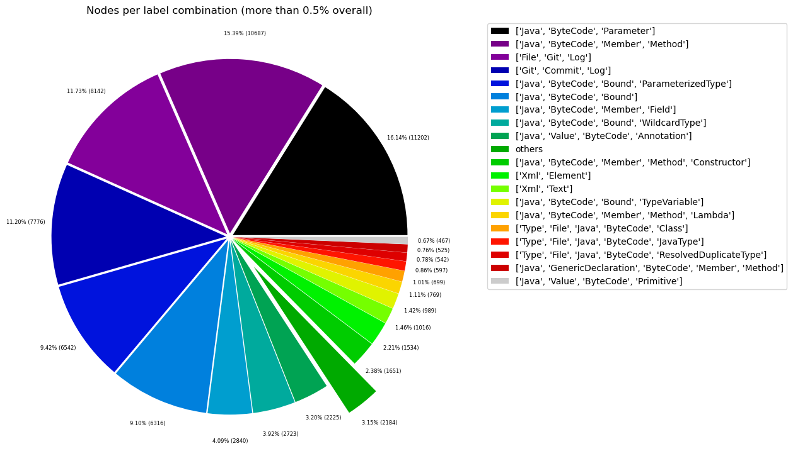
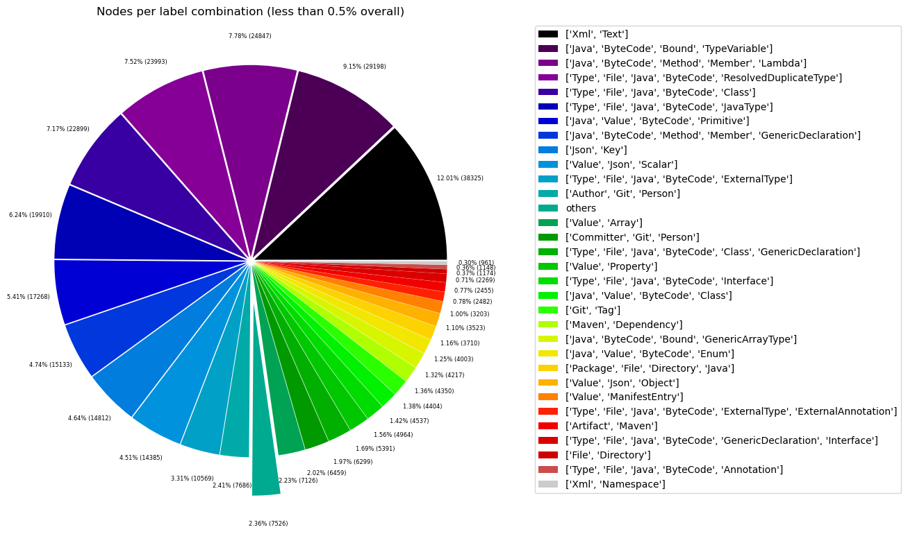
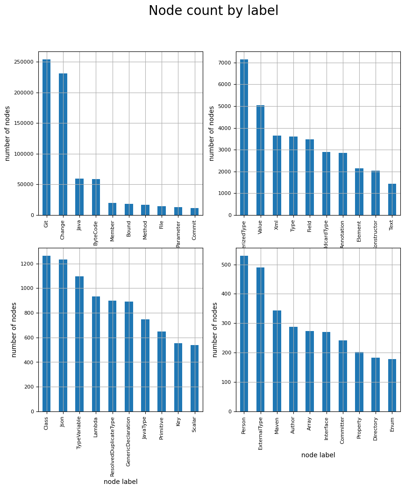
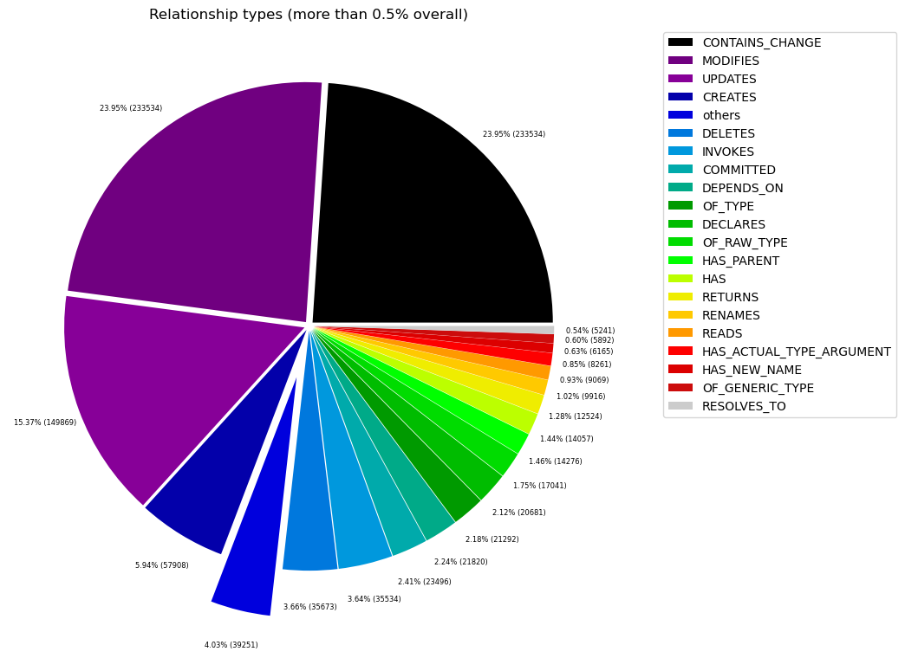
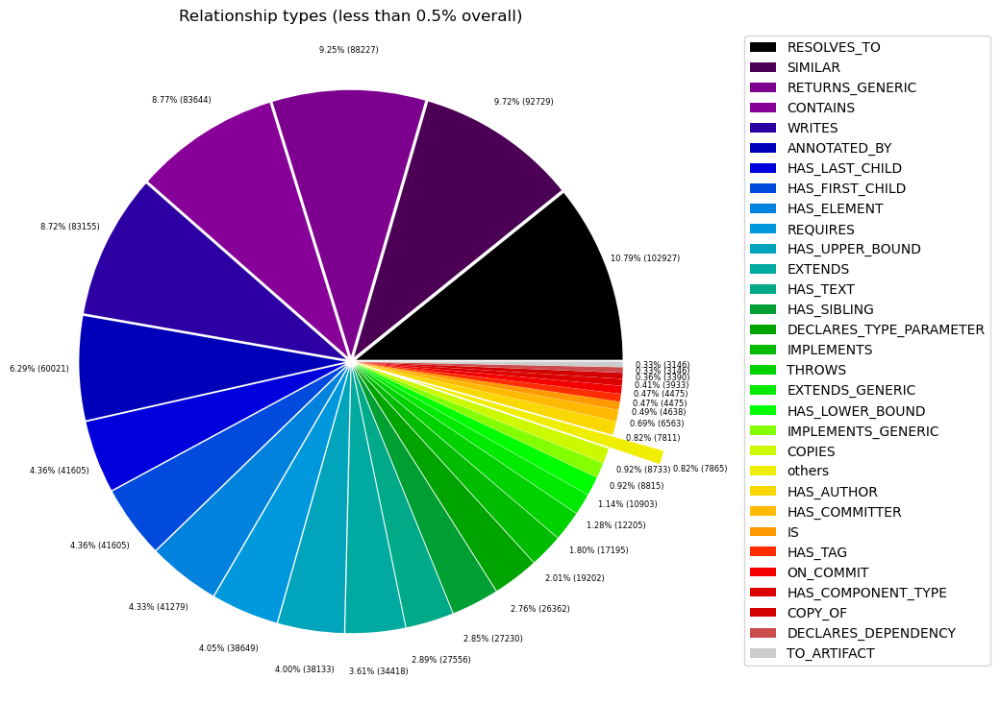

# Overview in General
   

This file contains a general overview of the data in the graph including node labels and relationships types.

### References
- [jqassistant](https://jqassistant.org)
- [Neo4j Python Driver](https://neo4j.com/docs/api/python-driver/current)

## Node Labels

### Table 1a - Highest node count by label combination

Lists the 30 label combinations with the highest number of nodes. The labels with the lowest node count are listed in table 1b.
The total list would sum up to the total number of labels (100%).

The whole table can be found in the CSV report `Node_label_combination_count`.

    Total number of nodes: 319383

<table border="1" class="dataframe">
  <thead>
    <tr style="text-align: right;">
      <th></th>
      <th>nodeLabels</th>
      <th>nodesWithThatLabels</th>
      <th>nodesWithThatLabelsPercent</th>
    </tr>
  </thead>
  <tbody>
    <tr>
      <th>0</th>
      <td>[Git, Change]</td>
      <td>231375</td>
      <td>72.444369</td>
    </tr>
    <tr>
      <th>1</th>
      <td>[Java, ByteCode, Method, Member]</td>
      <td>13187</td>
      <td>4.128899</td>
    </tr>
    <tr>
      <th>2</th>
      <td>[Java, ByteCode, Parameter]</td>
      <td>12968</td>
      <td>4.060329</td>
    </tr>
    <tr>
      <th>3</th>
      <td>[Git, Commit]</td>
      <td>11686</td>
      <td>3.658930</td>
    </tr>
    <tr>
      <th>4</th>
      <td>[File, Git]</td>
      <td>10578</td>
      <td>3.312011</td>
    </tr>
    <tr>
      <th>5</th>
      <td>[Java, ByteCode, Bound, ParameterizedType]</td>
      <td>7154</td>
      <td>2.239944</td>
    </tr>
    <tr>
      <th>6</th>
      <td>[Java, ByteCode, Bound]</td>
      <td>7094</td>
      <td>2.221158</td>
    </tr>
    <tr>
      <th>7</th>
      <td>[Java, ByteCode, Member, Field]</td>
      <td>3483</td>
      <td>1.090540</td>
    </tr>
    <tr>
      <th>8</th>
      <td>[Java, ByteCode, Bound, WildcardType]</td>
      <td>2902</td>
      <td>0.908627</td>
    </tr>
    <tr>
      <th>9</th>
      <td>[Java, Value, ByteCode, Annotation]</td>
      <td>2813</td>
      <td>0.880761</td>
    </tr>
    <tr>
      <th>10</th>
      <td>[Xml, Element]</td>
      <td>2144</td>
      <td>0.671294</td>
    </tr>
    <tr>
      <th>11</th>
      <td>[Java, ByteCode, Constructor, Method, Member]</td>
      <td>2036</td>
      <td>0.637479</td>
    </tr>
    <tr>
      <th>12</th>
      <td>[Xml, Text]</td>
      <td>1436</td>
      <td>0.449617</td>
    </tr>
    <tr>
      <th>13</th>
      <td>[Java, ByteCode, Bound, TypeVariable]</td>
      <td>1094</td>
      <td>0.342535</td>
    </tr>
    <tr>
      <th>14</th>
      <td>[Java, ByteCode, Method, Member, Lambda]</td>
      <td>931</td>
      <td>0.291500</td>
    </tr>
    <tr>
      <th>15</th>
      <td>[Type, File, Java, ByteCode, ResolvedDuplicate...</td>
      <td>899</td>
      <td>0.281480</td>
    </tr>
    <tr>
      <th>16</th>
      <td>[Type, File, Java, ByteCode, Class]</td>
      <td>858</td>
      <td>0.268643</td>
    </tr>
    <tr>
      <th>17</th>
      <td>[Type, File, Java, ByteCode, JavaType]</td>
      <td>746</td>
      <td>0.233575</td>
    </tr>
    <tr>
      <th>18</th>
      <td>[Java, Value, ByteCode, Primitive]</td>
      <td>647</td>
      <td>0.202578</td>
    </tr>
    <tr>
      <th>19</th>
      <td>[Java, ByteCode, Method, Member, GenericDeclar...</td>
      <td>567</td>
      <td>0.177530</td>
    </tr>
    <tr>
      <th>20</th>
      <td>[Json, Key]</td>
      <td>555</td>
      <td>0.173773</td>
    </tr>
    <tr>
      <th>21</th>
      <td>[Value, Json, Scalar]</td>
      <td>539</td>
      <td>0.168763</td>
    </tr>
    <tr>
      <th>22</th>
      <td>[Type, File, Java, ByteCode, ExternalType]</td>
      <td>396</td>
      <td>0.123989</td>
    </tr>
    <tr>
      <th>23</th>
      <td>[Author, Git, Person]</td>
      <td>289</td>
      <td>0.090487</td>
    </tr>
    <tr>
      <th>24</th>
      <td>[Value, Array]</td>
      <td>267</td>
      <td>0.083599</td>
    </tr>
    <tr>
      <th>25</th>
      <td>[Committer, Git, Person]</td>
      <td>243</td>
      <td>0.076084</td>
    </tr>
    <tr>
      <th>26</th>
      <td>[Type, File, Java, ByteCode, Class, GenericDec...</td>
      <td>236</td>
      <td>0.073892</td>
    </tr>
    <tr>
      <th>27</th>
      <td>[Value, Property]</td>
      <td>202</td>
      <td>0.063247</td>
    </tr>
    <tr>
      <th>28</th>
      <td>[Type, File, Java, ByteCode, Interface]</td>
      <td>186</td>
      <td>0.058237</td>
    </tr>
    <tr>
      <th>29</th>
      <td>[Java, Value, ByteCode, Class]</td>
      <td>170</td>
      <td>0.053228</td>
    </tr>
  </tbody>
</table>

### Chart 1a - Highest node count by label combination

Values under 0.5% will be grouped into "others" to get a cleaner plot. The group "others" is then broken down in Chart 1b.

    <Figure size 640x480 with 0 Axes>

    

    

### Table 1b - Lowest node count by label combination

Lists the 30 label combinations with the lowest number of nodes until they reach 0.5% of the total node count, which are shown above.

<table border="1" class="dataframe">
  <thead>
    <tr style="text-align: right;">
      <th></th>
      <th>nodeLabels</th>
      <th>nodesWithThatLabels</th>
      <th>nodesWithThatLabelsPercent</th>
    </tr>
  </thead>
  <tbody>
    <tr>
      <th>0</th>
      <td>[Analyze, Task, jQAssistant]</td>
      <td>1</td>
      <td>0.000313</td>
    </tr>
    <tr>
      <th>1</th>
      <td>[File, TS, Scan]</td>
      <td>1</td>
      <td>0.000313</td>
    </tr>
    <tr>
      <th>2</th>
      <td>[File, Json]</td>
      <td>2</td>
      <td>0.000626</td>
    </tr>
    <tr>
      <th>3</th>
      <td>[File]</td>
      <td>3</td>
      <td>0.000939</td>
    </tr>
    <tr>
      <th>4</th>
      <td>[Java, ByteCode, Constructor, Method, Member, ...</td>
      <td>4</td>
      <td>0.001252</td>
    </tr>
    <tr>
      <th>5</th>
      <td>[Maven, Exclusion]</td>
      <td>5</td>
      <td>0.001566</td>
    </tr>
    <tr>
      <th>6</th>
      <td>[Value, Array, Json]</td>
      <td>6</td>
      <td>0.001879</td>
    </tr>
    <tr>
      <th>7</th>
      <td>[File, Maven, Xml, Pom, Document]</td>
      <td>9</td>
      <td>0.002818</td>
    </tr>
    <tr>
      <th>8</th>
      <td>[Type, File, Java, ByteCode, Void]</td>
      <td>9</td>
      <td>0.002818</td>
    </tr>
    <tr>
      <th>9</th>
      <td>[Java, ManifestSection]</td>
      <td>9</td>
      <td>0.002818</td>
    </tr>
    <tr>
      <th>10</th>
      <td>[File, Java, Manifest]</td>
      <td>9</td>
      <td>0.002818</td>
    </tr>
    <tr>
      <th>11</th>
      <td>[Artifact, File, Jar, Archive, Zip, Java]</td>
      <td>9</td>
      <td>0.002818</td>
    </tr>
    <tr>
      <th>12</th>
      <td>[File, Java, ServiceLoader]</td>
      <td>10</td>
      <td>0.003131</td>
    </tr>
    <tr>
      <th>13</th>
      <td>[File, Java, Properties]</td>
      <td>12</td>
      <td>0.003757</td>
    </tr>
    <tr>
      <th>14</th>
      <td>[Maven, ExecutionGoal]</td>
      <td>16</td>
      <td>0.005010</td>
    </tr>
    <tr>
      <th>15</th>
      <td>[Maven, PluginExecution]</td>
      <td>16</td>
      <td>0.005010</td>
    </tr>
    <tr>
      <th>16</th>
      <td>[Xml, Attribute]</td>
      <td>18</td>
      <td>0.005636</td>
    </tr>
    <tr>
      <th>17</th>
      <td>[jQAssistant, Rule, Concept]</td>
      <td>19</td>
      <td>0.005949</td>
    </tr>
    <tr>
      <th>18</th>
      <td>[Maven, Plugin]</td>
      <td>21</td>
      <td>0.006575</td>
    </tr>
    <tr>
      <th>19</th>
      <td>[Maven, Configuration]</td>
      <td>21</td>
      <td>0.006575</td>
    </tr>
    <tr>
      <th>20</th>
      <td>[Git, Branch]</td>
      <td>25</td>
      <td>0.007828</td>
    </tr>
    <tr>
      <th>21</th>
      <td>[Type, File, Java, ByteCode, Enum]</td>
      <td>28</td>
      <td>0.008767</td>
    </tr>
    <tr>
      <th>22</th>
      <td>[Type, File, Java, ByteCode, PrimitiveType]</td>
      <td>29</td>
      <td>0.009080</td>
    </tr>
    <tr>
      <th>23</th>
      <td>[Xml, Namespace]</td>
      <td>36</td>
      <td>0.011272</td>
    </tr>
    <tr>
      <th>24</th>
      <td>[Type, File, Java, ByteCode, Annotation]</td>
      <td>43</td>
      <td>0.013463</td>
    </tr>
    <tr>
      <th>25</th>
      <td>[File, Directory]</td>
      <td>44</td>
      <td>0.013777</td>
    </tr>
    <tr>
      <th>26</th>
      <td>[Type, File, Java, ByteCode, GenericDeclaratio...</td>
      <td>85</td>
      <td>0.026614</td>
    </tr>
    <tr>
      <th>27</th>
      <td>[Artifact, Maven]</td>
      <td>92</td>
      <td>0.028806</td>
    </tr>
    <tr>
      <th>28</th>
      <td>[Type, File, Java, ByteCode, ExternalType, Ext...</td>
      <td>93</td>
      <td>0.029119</td>
    </tr>
    <tr>
      <th>29</th>
      <td>[Value, ManifestEntry]</td>
      <td>120</td>
      <td>0.037572</td>
    </tr>
  </tbody>
</table>

### Chart 1b - Lowest node count by label combination

Shows the lowest (less than 0.5% overall) node count label combinations. Therefore, this plot breaks down the "others" slice of the pie chart above. Values under 0.01% will be grouped into "others" to get a cleaner plot.

    <Figure size 640x480 with 0 Axes>

    

    

### Table 1c - Highest node count by single label

Lists the 40 labels with the highest number of nodes.
Doesn't sum up to the total number of nodes or 100% because one node can have multiple labels.
Helps to identify commonly used labels.

<table border="1" class="dataframe">
  <thead>
    <tr style="text-align: right;">
      <th></th>
      <th>nodeLabel</th>
      <th>nodesWithThatLabel</th>
      <th>nodesWithThatLabelPercent</th>
    </tr>
  </thead>
  <tbody>
    <tr>
      <th>0</th>
      <td>Git</td>
      <td>254361</td>
      <td>79.641371</td>
    </tr>
    <tr>
      <th>1</th>
      <td>Change</td>
      <td>231375</td>
      <td>72.444369</td>
    </tr>
    <tr>
      <th>2</th>
      <td>Java</td>
      <td>59154</td>
      <td>18.521336</td>
    </tr>
    <tr>
      <th>3</th>
      <td>ByteCode</td>
      <td>58966</td>
      <td>18.462473</td>
    </tr>
    <tr>
      <th>4</th>
      <td>Member</td>
      <td>20208</td>
      <td>6.327200</td>
    </tr>
    <tr>
      <th>5</th>
      <td>Bound</td>
      <td>18402</td>
      <td>5.761734</td>
    </tr>
    <tr>
      <th>6</th>
      <td>Method</td>
      <td>16725</td>
      <td>5.236659</td>
    </tr>
    <tr>
      <th>7</th>
      <td>File</td>
      <td>14424</td>
      <td>4.516208</td>
    </tr>
    <tr>
      <th>8</th>
      <td>Parameter</td>
      <td>12968</td>
      <td>4.060329</td>
    </tr>
    <tr>
      <th>9</th>
      <td>Commit</td>
      <td>11686</td>
      <td>3.658930</td>
    </tr>
    <tr>
      <th>10</th>
      <td>ParameterizedType</td>
      <td>7154</td>
      <td>2.239944</td>
    </tr>
    <tr>
      <th>11</th>
      <td>Value</td>
      <td>5046</td>
      <td>1.579921</td>
    </tr>
    <tr>
      <th>12</th>
      <td>Xml</td>
      <td>3643</td>
      <td>1.140637</td>
    </tr>
    <tr>
      <th>13</th>
      <td>Type</td>
      <td>3608</td>
      <td>1.129678</td>
    </tr>
    <tr>
      <th>14</th>
      <td>Field</td>
      <td>3483</td>
      <td>1.090540</td>
    </tr>
    <tr>
      <th>15</th>
      <td>WildcardType</td>
      <td>2902</td>
      <td>0.908627</td>
    </tr>
    <tr>
      <th>16</th>
      <td>Annotation</td>
      <td>2856</td>
      <td>0.894224</td>
    </tr>
    <tr>
      <th>17</th>
      <td>Element</td>
      <td>2144</td>
      <td>0.671294</td>
    </tr>
    <tr>
      <th>18</th>
      <td>Constructor</td>
      <td>2040</td>
      <td>0.638732</td>
    </tr>
    <tr>
      <th>19</th>
      <td>Text</td>
      <td>1436</td>
      <td>0.449617</td>
    </tr>
    <tr>
      <th>20</th>
      <td>Class</td>
      <td>1264</td>
      <td>0.395763</td>
    </tr>
    <tr>
      <th>21</th>
      <td>Json</td>
      <td>1234</td>
      <td>0.386370</td>
    </tr>
    <tr>
      <th>22</th>
      <td>TypeVariable</td>
      <td>1094</td>
      <td>0.342535</td>
    </tr>
    <tr>
      <th>23</th>
      <td>Lambda</td>
      <td>931</td>
      <td>0.291500</td>
    </tr>
    <tr>
      <th>24</th>
      <td>ResolvedDuplicateType</td>
      <td>899</td>
      <td>0.281480</td>
    </tr>
    <tr>
      <th>25</th>
      <td>GenericDeclaration</td>
      <td>892</td>
      <td>0.279289</td>
    </tr>
    <tr>
      <th>26</th>
      <td>JavaType</td>
      <td>746</td>
      <td>0.233575</td>
    </tr>
    <tr>
      <th>27</th>
      <td>Primitive</td>
      <td>647</td>
      <td>0.202578</td>
    </tr>
    <tr>
      <th>28</th>
      <td>Key</td>
      <td>555</td>
      <td>0.173773</td>
    </tr>
    <tr>
      <th>29</th>
      <td>Scalar</td>
      <td>539</td>
      <td>0.168763</td>
    </tr>
    <tr>
      <th>30</th>
      <td>Person</td>
      <td>532</td>
      <td>0.166571</td>
    </tr>
    <tr>
      <th>31</th>
      <td>ExternalType</td>
      <td>489</td>
      <td>0.153108</td>
    </tr>
    <tr>
      <th>32</th>
      <td>Maven</td>
      <td>343</td>
      <td>0.107395</td>
    </tr>
    <tr>
      <th>33</th>
      <td>Author</td>
      <td>289</td>
      <td>0.090487</td>
    </tr>
    <tr>
      <th>34</th>
      <td>Array</td>
      <td>273</td>
      <td>0.085477</td>
    </tr>
    <tr>
      <th>35</th>
      <td>Interface</td>
      <td>271</td>
      <td>0.084851</td>
    </tr>
    <tr>
      <th>36</th>
      <td>Committer</td>
      <td>243</td>
      <td>0.076084</td>
    </tr>
    <tr>
      <th>37</th>
      <td>Property</td>
      <td>202</td>
      <td>0.063247</td>
    </tr>
    <tr>
      <th>38</th>
      <td>Directory</td>
      <td>183</td>
      <td>0.057298</td>
    </tr>
    <tr>
      <th>39</th>
      <td>Enum</td>
      <td>178</td>
      <td>0.055732</td>
    </tr>
  </tbody>
</table>

### Chart 1c - Highest node count by label

Shows the 40 labels with the highest number of nodes.

    <Figure size 640x480 with 0 Axes>

    

    

## Relationship Types

### Table 2a - Highest relationship count by type

Lists the 30 relationship types with the highest number of occurrences.
The whole table can be found in the CSV report `Relationship_type_count`.

    Total number of relationships: 968041

<table border="1" class="dataframe">
  <thead>
    <tr style="text-align: right;">
      <th></th>
      <th>relationshipType</th>
      <th>nodesWithThatRelationshipType</th>
      <th>nodesWithThatRelationshipTypePercent</th>
    </tr>
  </thead>
  <tbody>
    <tr>
      <th>0</th>
      <td>CONTAINS_CHANGE</td>
      <td>231375</td>
      <td>23.901364</td>
    </tr>
    <tr>
      <th>1</th>
      <td>MODIFIES</td>
      <td>231375</td>
      <td>23.901364</td>
    </tr>
    <tr>
      <th>2</th>
      <td>UPDATES</td>
      <td>148248</td>
      <td>15.314227</td>
    </tr>
    <tr>
      <th>3</th>
      <td>CREATES</td>
      <td>57638</td>
      <td>5.954087</td>
    </tr>
    <tr>
      <th>4</th>
      <td>INVOKES</td>
      <td>35759</td>
      <td>3.693955</td>
    </tr>
    <tr>
      <th>5</th>
      <td>DELETES</td>
      <td>35351</td>
      <td>3.651808</td>
    </tr>
    <tr>
      <th>6</th>
      <td>COMMITTED</td>
      <td>23372</td>
      <td>2.414361</td>
    </tr>
    <tr>
      <th>7</th>
      <td>DEPENDS_ON</td>
      <td>21459</td>
      <td>2.216745</td>
    </tr>
    <tr>
      <th>8</th>
      <td>OF_TYPE</td>
      <td>21292</td>
      <td>2.199494</td>
    </tr>
    <tr>
      <th>9</th>
      <td>DECLARES</td>
      <td>20647</td>
      <td>2.132864</td>
    </tr>
    <tr>
      <th>10</th>
      <td>OF_RAW_TYPE</td>
      <td>17041</td>
      <td>1.760359</td>
    </tr>
    <tr>
      <th>11</th>
      <td>HAS_PARENT</td>
      <td>14206</td>
      <td>1.467500</td>
    </tr>
    <tr>
      <th>12</th>
      <td>HAS</td>
      <td>14057</td>
      <td>1.452108</td>
    </tr>
    <tr>
      <th>13</th>
      <td>RETURNS</td>
      <td>12524</td>
      <td>1.293747</td>
    </tr>
    <tr>
      <th>14</th>
      <td>RENAMES</td>
      <td>9862</td>
      <td>1.018759</td>
    </tr>
    <tr>
      <th>15</th>
      <td>READS</td>
      <td>9068</td>
      <td>0.936737</td>
    </tr>
    <tr>
      <th>16</th>
      <td>HAS_ACTUAL_TYPE_ARGUMENT</td>
      <td>8261</td>
      <td>0.853373</td>
    </tr>
    <tr>
      <th>17</th>
      <td>HAS_NEW_NAME</td>
      <td>6163</td>
      <td>0.636647</td>
    </tr>
    <tr>
      <th>18</th>
      <td>OF_GENERIC_TYPE</td>
      <td>5892</td>
      <td>0.608652</td>
    </tr>
    <tr>
      <th>19</th>
      <td>RESOLVES_TO</td>
      <td>5241</td>
      <td>0.541403</td>
    </tr>
    <tr>
      <th>20</th>
      <td>SIMILAR</td>
      <td>3915</td>
      <td>0.404425</td>
    </tr>
    <tr>
      <th>21</th>
      <td>CONTAINS</td>
      <td>3797</td>
      <td>0.392235</td>
    </tr>
    <tr>
      <th>22</th>
      <td>WRITES</td>
      <td>3796</td>
      <td>0.392132</td>
    </tr>
    <tr>
      <th>23</th>
      <td>RETURNS_GENERIC</td>
      <td>3538</td>
      <td>0.365480</td>
    </tr>
    <tr>
      <th>24</th>
      <td>ANNOTATED_BY</td>
      <td>2801</td>
      <td>0.289347</td>
    </tr>
    <tr>
      <th>25</th>
      <td>REQUIRES</td>
      <td>2172</td>
      <td>0.224371</td>
    </tr>
    <tr>
      <th>26</th>
      <td>HAS_FIRST_CHILD</td>
      <td>2144</td>
      <td>0.221478</td>
    </tr>
    <tr>
      <th>27</th>
      <td>HAS_LAST_CHILD</td>
      <td>2144</td>
      <td>0.221478</td>
    </tr>
    <tr>
      <th>28</th>
      <td>HAS_ELEMENT</td>
      <td>2126</td>
      <td>0.219619</td>
    </tr>
    <tr>
      <th>29</th>
      <td>HAS_UPPER_BOUND</td>
      <td>1519</td>
      <td>0.156915</td>
    </tr>
  </tbody>
</table>

### Chart 2a - Highest relationship count by type

Values under 0.5% will be grouped into "others" to get a cleaner plot. The group "others" is then broken down in the second chart.

    <Figure size 640x480 with 0 Axes>

    

    

### Table 2b - Lowest relationship count by type

Lists the 30 relationships type with the lowest number of occurrences up to 0.5% of the total node count. This is essentially breaking down the "others" slice from the chart above.

<table border="1" class="dataframe">
  <thead>
    <tr style="text-align: right;">
      <th></th>
      <th>relationshipType</th>
      <th>nodesWithThatRelationshipType</th>
      <th>nodesWithThatRelationshipTypePercent</th>
    </tr>
  </thead>
  <tbody>
    <tr>
      <th>0</th>
      <td>HAS_PROPERTY</td>
      <td>1</td>
      <td>0.000103</td>
    </tr>
    <tr>
      <th>1</th>
      <td>THROWS_GENERIC</td>
      <td>5</td>
      <td>0.000517</td>
    </tr>
    <tr>
      <th>2</th>
      <td>EXCLUDES</td>
      <td>5</td>
      <td>0.000517</td>
    </tr>
    <tr>
      <th>3</th>
      <td>DESCRIBES</td>
      <td>9</td>
      <td>0.000930</td>
    </tr>
    <tr>
      <th>4</th>
      <td>HAS_ROOT_ELEMENT</td>
      <td>11</td>
      <td>0.001136</td>
    </tr>
    <tr>
      <th>5</th>
      <td>HAS_GOAL</td>
      <td>16</td>
      <td>0.001653</td>
    </tr>
    <tr>
      <th>6</th>
      <td>HAS_EXECUTION</td>
      <td>16</td>
      <td>0.001653</td>
    </tr>
    <tr>
      <th>7</th>
      <td>OF_NAMESPACE</td>
      <td>18</td>
      <td>0.001859</td>
    </tr>
    <tr>
      <th>8</th>
      <td>HAS_ATTRIBUTE</td>
      <td>18</td>
      <td>0.001859</td>
    </tr>
    <tr>
      <th>9</th>
      <td>INCLUDES_CONCEPT</td>
      <td>19</td>
      <td>0.001963</td>
    </tr>
    <tr>
      <th>10</th>
      <td>USES_PLUGIN</td>
      <td>21</td>
      <td>0.002169</td>
    </tr>
    <tr>
      <th>11</th>
      <td>REQUIRES_TYPE_PARAMETER</td>
      <td>21</td>
      <td>0.002169</td>
    </tr>
    <tr>
      <th>12</th>
      <td>IS_ARTIFACT</td>
      <td>21</td>
      <td>0.002169</td>
    </tr>
    <tr>
      <th>13</th>
      <td>HAS_CONFIGURATION</td>
      <td>21</td>
      <td>0.002169</td>
    </tr>
    <tr>
      <th>14</th>
      <td>HAS_HEAD</td>
      <td>25</td>
      <td>0.002583</td>
    </tr>
    <tr>
      <th>15</th>
      <td>REQUIRES_CONCEPT</td>
      <td>28</td>
      <td>0.002892</td>
    </tr>
    <tr>
      <th>16</th>
      <td>DECLARES_NAMESPACE</td>
      <td>36</td>
      <td>0.003719</td>
    </tr>
    <tr>
      <th>17</th>
      <td>HAS_DEFAULT</td>
      <td>36</td>
      <td>0.003719</td>
    </tr>
    <tr>
      <th>18</th>
      <td>CONTAINS_VALUE</td>
      <td>120</td>
      <td>0.012396</td>
    </tr>
    <tr>
      <th>19</th>
      <td>COPY_OF</td>
      <td>125</td>
      <td>0.012913</td>
    </tr>
    <tr>
      <th>20</th>
      <td>HAS_COMPONENT_TYPE</td>
      <td>158</td>
      <td>0.016322</td>
    </tr>
    <tr>
      <th>21</th>
      <td>TO_ARTIFACT</td>
      <td>163</td>
      <td>0.016838</td>
    </tr>
    <tr>
      <th>22</th>
      <td>DECLARES_DEPENDENCY</td>
      <td>163</td>
      <td>0.016838</td>
    </tr>
    <tr>
      <th>23</th>
      <td>ON_COMMIT</td>
      <td>165</td>
      <td>0.017045</td>
    </tr>
    <tr>
      <th>24</th>
      <td>COPIES</td>
      <td>322</td>
      <td>0.033263</td>
    </tr>
    <tr>
      <th>25</th>
      <td>IMPLEMENTS_GENERIC</td>
      <td>371</td>
      <td>0.038325</td>
    </tr>
    <tr>
      <th>26</th>
      <td>IS</td>
      <td>375</td>
      <td>0.038738</td>
    </tr>
    <tr>
      <th>27</th>
      <td>HAS_LOWER_BOUND</td>
      <td>433</td>
      <td>0.044730</td>
    </tr>
    <tr>
      <th>28</th>
      <td>EXTENDS_GENERIC</td>
      <td>506</td>
      <td>0.052271</td>
    </tr>
    <tr>
      <th>29</th>
      <td>HAS_VALUE</td>
      <td>555</td>
      <td>0.057332</td>
    </tr>
  </tbody>
</table>

### Chart 2b - Lowest relationship count by type

Shows the lowest (less than 0.5% overall) relationship types. This plot breaks down the "others" slice of the pie chart above. Values under 0.01% will be grouped into "others" to get a cleaner plot.

    <Figure size 640x480 with 0 Axes>

    

    

## Node labels with their relationships

### Table 3a - Highest relationship count by node labels and relationship type

Lists the 30 node labels and their relationship types with the highest number of occurrences.

<table border="1" class="dataframe">
  <thead>
    <tr style="text-align: right;">
      <th></th>
      <th>sourceLabels</th>
      <th>relationType</th>
      <th>targetLabels</th>
      <th>numberOfRelationships</th>
      <th>numberOfNodesWithSameLabelsAsSource</th>
      <th>numberOfNodesWithSameLabelsAsTarget</th>
      <th>densityInPercent</th>
    </tr>
  </thead>
  <tbody>
    <tr>
      <th>0</th>
      <td>[Git, Commit]</td>
      <td>CONTAINS_CHANGE</td>
      <td>[Git, Change]</td>
      <td>231375</td>
      <td>11686</td>
      <td>231375</td>
      <td>0.008557</td>
    </tr>
    <tr>
      <th>1</th>
      <td>[Git, Change]</td>
      <td>MODIFIES</td>
      <td>[File, Git]</td>
      <td>231375</td>
      <td>231375</td>
      <td>10578</td>
      <td>0.009454</td>
    </tr>
    <tr>
      <th>2</th>
      <td>[Git, Change]</td>
      <td>UPDATES</td>
      <td>[File, Git]</td>
      <td>148248</td>
      <td>231375</td>
      <td>10578</td>
      <td>0.006057</td>
    </tr>
    <tr>
      <th>3</th>
      <td>[Git, Change]</td>
      <td>CREATES</td>
      <td>[File, Git]</td>
      <td>57638</td>
      <td>231375</td>
      <td>10578</td>
      <td>0.002355</td>
    </tr>
    <tr>
      <th>4</th>
      <td>[Git, Change]</td>
      <td>DELETES</td>
      <td>[File, Git]</td>
      <td>35351</td>
      <td>231375</td>
      <td>10578</td>
      <td>0.001444</td>
    </tr>
    <tr>
      <th>5</th>
      <td>[Java, ByteCode, Method, Member]</td>
      <td>INVOKES</td>
      <td>[Java, ByteCode, Method, Member]</td>
      <td>21885</td>
      <td>13071</td>
      <td>13071</td>
      <td>0.012809</td>
    </tr>
    <tr>
      <th>6</th>
      <td>[Git, Commit]</td>
      <td>HAS_PARENT</td>
      <td>[Git, Commit]</td>
      <td>14197</td>
      <td>11686</td>
      <td>11686</td>
      <td>0.010396</td>
    </tr>
    <tr>
      <th>7</th>
      <td>[Author, Git, Person]</td>
      <td>COMMITTED</td>
      <td>[Git, Commit]</td>
      <td>11686</td>
      <td>289</td>
      <td>11686</td>
      <td>0.346021</td>
    </tr>
    <tr>
      <th>8</th>
      <td>[Committer, Git, Person]</td>
      <td>COMMITTED</td>
      <td>[Git, Commit]</td>
      <td>11686</td>
      <td>243</td>
      <td>11686</td>
      <td>0.411523</td>
    </tr>
    <tr>
      <th>9</th>
      <td>[Git, Change]</td>
      <td>RENAMES</td>
      <td>[File, Git]</td>
      <td>9862</td>
      <td>231375</td>
      <td>10578</td>
      <td>0.000403</td>
    </tr>
    <tr>
      <th>10</th>
      <td>[Java, ByteCode, Method, Member]</td>
      <td>HAS</td>
      <td>[Java, ByteCode, Parameter]</td>
      <td>8290</td>
      <td>13071</td>
      <td>12968</td>
      <td>0.004891</td>
    </tr>
    <tr>
      <th>11</th>
      <td>[Java, ByteCode, Method, Member]</td>
      <td>READS</td>
      <td>[Java, ByteCode, Member, Field]</td>
      <td>8125</td>
      <td>13071</td>
      <td>3483</td>
      <td>0.017847</td>
    </tr>
    <tr>
      <th>12</th>
      <td>[Java, ByteCode, Parameter]</td>
      <td>OF_TYPE</td>
      <td>[Type, File, Java, ByteCode, JavaType]</td>
      <td>6335</td>
      <td>12968</td>
      <td>746</td>
      <td>0.065484</td>
    </tr>
    <tr>
      <th>13</th>
      <td>[File, Git]</td>
      <td>HAS_NEW_NAME</td>
      <td>[File, Git]</td>
      <td>6163</td>
      <td>10578</td>
      <td>10578</td>
      <td>0.005508</td>
    </tr>
    <tr>
      <th>14</th>
      <td>[Java, ByteCode, Bound]</td>
      <td>OF_RAW_TYPE</td>
      <td>[Type, File, Java, ByteCode, JavaType]</td>
      <td>3554</td>
      <td>7094</td>
      <td>746</td>
      <td>0.067156</td>
    </tr>
    <tr>
      <th>15</th>
      <td>[Java, ByteCode, Bound, ParameterizedType]</td>
      <td>OF_RAW_TYPE</td>
      <td>[Type, File, Java, ByteCode, JavaType]</td>
      <td>3034</td>
      <td>7154</td>
      <td>746</td>
      <td>0.056850</td>
    </tr>
    <tr>
      <th>16</th>
      <td>[Java, ByteCode, Bound, ParameterizedType]</td>
      <td>HAS_ACTUAL_TYPE_ARGUMENT</td>
      <td>[Java, ByteCode, Bound, WildcardType]</td>
      <td>2902</td>
      <td>7154</td>
      <td>2902</td>
      <td>0.013978</td>
    </tr>
    <tr>
      <th>17</th>
      <td>[Java, ByteCode, Parameter]</td>
      <td>OF_GENERIC_TYPE</td>
      <td>[Java, ByteCode, Bound, ParameterizedType]</td>
      <td>2650</td>
      <td>12968</td>
      <td>7154</td>
      <td>0.002856</td>
    </tr>
    <tr>
      <th>18</th>
      <td>[Java, ByteCode, Bound, ParameterizedType]</td>
      <td>HAS_ACTUAL_TYPE_ARGUMENT</td>
      <td>[Java, ByteCode, Bound, TypeVariable]</td>
      <td>2453</td>
      <td>7154</td>
      <td>1094</td>
      <td>0.031342</td>
    </tr>
    <tr>
      <th>19</th>
      <td>[Java, ByteCode, Constructor, Method, Member]</td>
      <td>WRITES</td>
      <td>[Java, ByteCode, Member, Field]</td>
      <td>2423</td>
      <td>2036</td>
      <td>3483</td>
      <td>0.034168</td>
    </tr>
    <tr>
      <th>20</th>
      <td>[Java, Value, ByteCode, Annotation]</td>
      <td>OF_TYPE</td>
      <td>[Type, File, Java, ByteCode, ExternalType, Ext...</td>
      <td>2336</td>
      <td>2813</td>
      <td>93</td>
      <td>0.892936</td>
    </tr>
    <tr>
      <th>21</th>
      <td>[Xml, Element]</td>
      <td>HAS_ELEMENT</td>
      <td>[Xml, Element]</td>
      <td>2126</td>
      <td>2144</td>
      <td>2144</td>
      <td>0.046250</td>
    </tr>
    <tr>
      <th>22</th>
      <td>[Java, ByteCode, Constructor, Method, Member]</td>
      <td>INVOKES</td>
      <td>[Java, ByteCode, Constructor, Method, Member]</td>
      <td>2106</td>
      <td>2036</td>
      <td>2036</td>
      <td>0.050805</td>
    </tr>
    <tr>
      <th>23</th>
      <td>[Java, ByteCode, Method, Member]</td>
      <td>RETURNS</td>
      <td>[Type, File, Java, ByteCode, JavaType]</td>
      <td>2088</td>
      <td>13071</td>
      <td>746</td>
      <td>0.021413</td>
    </tr>
    <tr>
      <th>24</th>
      <td>[Java, ByteCode, Method, Member]</td>
      <td>INVOKES</td>
      <td>[Java, ByteCode, Constructor, Method, Member]</td>
      <td>2034</td>
      <td>13071</td>
      <td>2036</td>
      <td>0.007643</td>
    </tr>
    <tr>
      <th>25</th>
      <td>[Java, ByteCode, Constructor, Method, Member]</td>
      <td>HAS</td>
      <td>[Java, ByteCode, Parameter]</td>
      <td>2021</td>
      <td>2036</td>
      <td>12968</td>
      <td>0.007654</td>
    </tr>
    <tr>
      <th>26</th>
      <td>[Java, ByteCode, Parameter]</td>
      <td>OF_GENERIC_TYPE</td>
      <td>[Java, ByteCode, Bound]</td>
      <td>2020</td>
      <td>12968</td>
      <td>7094</td>
      <td>0.002196</td>
    </tr>
    <tr>
      <th>27</th>
      <td>[Java, ByteCode, Method, Member, Lambda]</td>
      <td>INVOKES</td>
      <td>[Java, ByteCode, Method, Member]</td>
      <td>1866</td>
      <td>931</td>
      <td>13071</td>
      <td>0.015334</td>
    </tr>
    <tr>
      <th>28</th>
      <td>[Java, ByteCode, Bound, ParameterizedType]</td>
      <td>HAS_ACTUAL_TYPE_ARGUMENT</td>
      <td>[Java, ByteCode, Bound]</td>
      <td>1792</td>
      <td>7154</td>
      <td>7094</td>
      <td>0.003531</td>
    </tr>
    <tr>
      <th>29</th>
      <td>[Java, ByteCode, Constructor, Method, Member]</td>
      <td>INVOKES</td>
      <td>[Java, ByteCode, Method, Member]</td>
      <td>1790</td>
      <td>2036</td>
      <td>13071</td>
      <td>0.006726</td>
    </tr>
  </tbody>
</table>

## Graph Density

    total_number_of_nodes (vertices): 319383
    total_number_of_relationships (edges): 968041
    -> total directed graph density: 9.49011596867834e-06
    -> total directed graph density in percent: 0.0009490115968678341

