# Path Finding for Java

This notebook demonstrates different ways on how path finding algorithms can be utilized for code analysis. 

Path algorithms in Graphs are famous for e.g. finding the fastest way from one place to another. How can these be applied to static code analysis and how can the results be interpreted?

One promising algorithm is [All Pairs Shortest Path](https://neo4j.com/docs/graph-data-science/current/algorithms/all-pairs-shortest-path). It shows dependencies from a different perspective and provides an overview on how directly or indirectly dependencies are connected to each other. The longest shortest path has an additional meaning: It is also known as the [**Graph Diameter**](https://mathworld.wolfram.com/GraphDiameter.html) and is very useful as a metric for the complexity of the Graph (or Subgraphs). The same applies to the longest path (for directed acyclic graphs) that can uncover long dependency chains.

 

### References
- [jqassistant](https://jqassistant.org)
- [Neo4j Python Driver](https://neo4j.com/docs/api/python-driver/current)
- [All Pairs Shortest Path](https://neo4j.com/docs/graph-data-science/current/algorithms/all-pairs-shortest-path)
- [Longest Path for DAG (neo4j)](https://neo4j.com/docs/graph-data-science/current/algorithms/dag/longest-path)
- [Graph Diameter](https://mathworld.wolfram.com/GraphDiameter.html)

## What GPT-4 has to say about it

### All pairs shortest path

Interpreting the results of the "all pairs shortest path" algorithm on a graph of statically analyzed code modules and their dependencies involves understanding the structure and implications of the paths between nodes (modules) in the graph. Here are some specific steps and insights to consider:

1. **Graph Structure**: Each node represents a code module, and edges indicate dependencies. A directed edge from module A to module B implies that A depends on B.

2. **Shortest Paths**: The results will give you the shortest path lengths between all pairs of modules. This helps identify:
  - **Direct Dependencies**: A length of 1 indicates a direct dependency.
  - **Transitive Dependencies**: A length greater than 1 shows indirect dependencies. For example, if the path from A to C is 2, it could mean A → B → C, indicating A indirectly depends on C via B.

3. **Module Isolation**: If a module has very long paths to others, it might be more isolated. This could signal potential issues in the code structure, suggesting that module might be overly complex or decoupled from the rest of the system.

4. **Critical Paths**: Identify the shortest paths that connect key modules (e.g., core functionalities). These paths can highlight the most crucial dependencies that, if modified, might have extensive impacts on the system.

5. **Cycle Detection**: If any pairs have paths that loop back to themselves with a length not equal to 0, it indicates a cycle. Cycles can complicate dependency management, potentially leading to recursive dependencies, which can be problematic in terms of maintainability.

6. **Refactoring Opportunities**: By examining the lengths of paths, you might identify modules that could benefit from refactoring to decrease dependency complexity. For example, a module that has dependencies on many others (with longer path lengths) might be a candidate for breaking into smaller, more manageable components.

7. **Performance Considerations**: In large systems, long paths could impact performance. If certain modules are far from frequently accessed modules, consider whether they can be optimized for speed.

8. **Visual Representation**: Creating a visual representation of the graph with the shortest paths highlighted can be immensely helpful. Tools like Graphviz or D3.js can illustrate these relationships clearly, aiding in your analysis.

By focusing on these aspects, you can glean actionable insights from the results of the all pairs shortest path algorithm in the context of your statically analyzed code modules and their dependencies.

### Graph diameter (shortest longest path)

The longest shortest path in a dependency graph (often referred to in graph theory as the "diameter" of the graph) represents the maximum distance (in terms of the number of edges or dependencies) between any two nodes (modules) in the graph. Here’s how you can interpret this metric in the context of statically analyzed code modules and their dependencies:

1. **Network Complexity**: The longest shortest path indicates the overall complexity of the network of dependencies. A longer path suggests a more complicated interrelationship among modules. For example, a longest shortest path of 6 could indicate that there is at least one pair of modules in your system that rely on a chain of 6 other modules to communicate or function together.

2. **Potential Bottlenecks**: If the longest shortest path is significant, it may suggest potential bottlenecks in your architecture. For instance, if a core module at the beginning of a long path is slow or error-prone, it could affect numerous other modules dependent on it, resulting in systemic performance issues.

3. **Critical Communication Points**: The endpoints of the longest shortest path can be seen as critical communication points within your codebase. Understanding these connections can help identify which modules should be prioritized for testing and monitoring, especially during changes.

4. **Isolation and Coupling**: A long longest shortest path might indicate that some modules are isolated and far removed from others, which can suggest low cohesion. This can be a sign that the architecture might benefit from refactoring to reduce unnecessary dependencies or to improve modularity.

5. **Refactoring Opportunities**: If the longest shortest path is disproportionately long, it may highlight areas in the codebase where modules are too tightly coupled. This situation presents an opportunity for refactoring to create more independent modules or components that can interact with fewer dependencies.

6. **Impact of Changes**: Modules that lie along or are endpoints of the longest shortest paths are likely to have a significant impact on the overall system. Changes to them should be approached with caution and accompanied by rigorous testing.

7. **Cycle Detection**: In some cases, a long shortest path can indicate the presence of cycles in the graph. If there are paths that seem to loop back on themselves, it suggests potential design flaws that could lead to recursion or infinite loops, complicating maintenance.

8. **Architectural Decisions**: The longest shortest path can inform architectural decisions by providing insights into which dependencies might need to be revised or eliminated. For instance, if certain modules are consistently part of the longest path, it could justify investing resources in redesigning their interactions.

In summary, interpreting the longest shortest path provides a comprehensive view of the interdependencies among modules in your system, focusing on complexity, potential bottlenecks, and opportunities for improvement in architecture and design.

### Longest path

1. **Complex Dependencies**: Longest paths indicate modules that have extensive dependencies before reaching another module. For instance, if you find a path like A → B → C → D with a length of 4, it highlights a complex chain of dependencies. This can suggest that changes in module A might have far-reaching implications across the system.

2. **Potential Bottlenecks**: Modules located at the beginning of long paths could be performance bottlenecks. If a frequently used module is several layers deep in dependencies (e.g., A → B → C), it may slow down the entire system. Optimizing or refactoring these modules could improve performance.

3. **Maintenance Challenges**: Long paths may indicate parts of the code that are difficult to maintain or understand. For example, if module A requires multiple intermediary modules (B, C, D) for its functionality, developers may struggle to trace how changes propagate, leading to potential bugs.

4. **Risk of Change**: A module with a long dependency path can be more risky to modify. If A has dependencies on several modules down the line (e.g., A → B → C → D → E), any changes to A could inadvertently affect E, which might be critical or sensitive. This insight can help prioritize testing and reviews around such modules.

5. **Decoupling Opportunities**: Identifying the longest paths can highlight areas where you might want to break up dependencies. If there’s a long chain that could be simplified (e.g., by creating intermediary modules or interfaces), it may lead to a more modular and maintainable architecture.

6. **Redundancy**: Long paths may also reveal redundancy in dependencies. For instance, if multiple modules depend on a series of others (A → B → C → D and A → B → E), it could indicate unnecessary coupling that can be streamlined.

7. **System Understanding**: Long paths can help map out the architecture of your codebase. Understanding which modules are pivotal in long chains can provide insights into the overall design and help inform architectural decisions.

8. **Documentation & Knowledge Transfer**: If certain modules consistently appear in the longest paths, they may require better documentation. Ensuring that their roles and the reasons for their lengthy dependencies are well understood can facilitate knowledge transfer among team members.

By focusing on the longest paths in your dependency graph, you can uncover areas requiring attention for optimization, maintenance, and improved system architecture.

## 1. Java Packages

## 1.1 All pairs shortest path

Use "[All Pairs Shortest Path](https://neo4j.com/docs/graph-data-science/current/algorithms/all-pairs-shortest-path)" algorithm to get the shortest path distance between all pairs of dependent Java packages. It shows how many Packages have a direct dependency (distance 1), how many are reachable with one dependency in between (distance 2), and so on...

### 1.1.1 Create a projection of all Java package dependencies

Creates a in-memory projection of "Java:Package" nodes and their "DEPENDS_ON" relationships as a preparation to run the Graph algorithms. The weight property is not used for now (September 2024) but may be needed for other algorithms/variants some time.

#### Projected Graph statistics for Java package dependencies

    Projection data available: True

<table border="1" class="dataframe">
  <thead>
    <tr style="text-align: right;">
      <th></th>
      <th>nodeCount</th>
      <th>relationshipCount</th>
      <th>density</th>
      <th>sizeInBytes</th>
      <th>degreeDistribution.min</th>
      <th>degreeDistribution.mean</th>
      <th>degreeDistribution.max</th>
      <th>degreeDistribution.p50</th>
      <th>degreeDistribution.p75</th>
      <th>degreeDistribution.p90</th>
      <th>degreeDistribution.p95</th>
      <th>degreeDistribution.p99</th>
      <th>degreeDistribution.p999</th>
    </tr>
  </thead>
  <tbody>
    <tr>
      <th>0</th>
      <td>114</td>
      <td>745</td>
      <td>0.057833</td>
      <td>2990462</td>
      <td>0</td>
      <td>6.535088</td>
      <td>56</td>
      <td>5</td>
      <td>8</td>
      <td>14</td>
      <td>16</td>
      <td>45</td>
      <td>56</td>
    </tr>
  </tbody>
</table>

### 1.1.2 All pairs shortest path in total

First, we'll have a look at the overall/total result of the all pairs shortest path algorithm for all dependencies.

#### All pairs shortest path in total - Longest shortest path (Graph Diameter)

    The diameter (longest shortest path) of the projected package dependencies Graph is: 5

#### All pairs shortest path in total - Path count per length - Table

<table border="1" class="dataframe">
  <thead>
    <tr style="text-align: right;">
      <th></th>
      <th>index</th>
      <th>distance</th>
      <th>distanceTotalPairCount</th>
      <th>distanceTotalSourceCount</th>
      <th>distanceTotalTargetCount</th>
    </tr>
  </thead>
  <tbody>
    <tr>
      <th>0</th>
      <td>0</td>
      <td>1</td>
      <td>745</td>
      <td>108</td>
      <td>101</td>
    </tr>
    <tr>
      <th>1</th>
      <td>1</td>
      <td>2</td>
      <td>1550</td>
      <td>99</td>
      <td>86</td>
    </tr>
    <tr>
      <th>2</th>
      <td>4</td>
      <td>3</td>
      <td>1081</td>
      <td>94</td>
      <td>60</td>
    </tr>
    <tr>
      <th>3</th>
      <td>5</td>
      <td>4</td>
      <td>198</td>
      <td>59</td>
      <td>21</td>
    </tr>
    <tr>
      <th>4</th>
      <td>18</td>
      <td>5</td>
      <td>7</td>
      <td>3</td>
      <td>5</td>
    </tr>
  </tbody>
</table>

#### All pairs shortest path in total - Path count per length - Bar chart

    
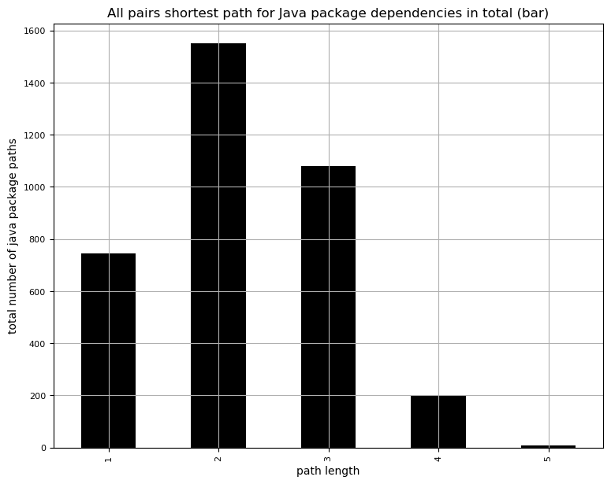
    

#### All pairs shortest path in total - Path count per length - Pie chart

    <Figure size 640x480 with 0 Axes>

    
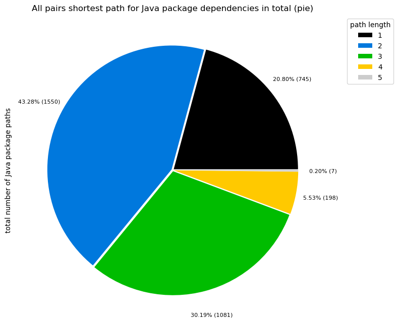
    

### 1.1.3 All pairs shortest path in detail

The following table shows the first 10 rows with all details of the query above. It contains the results of the "all pairs shortest path" algorithm including the artifact the source node belong to and if the target node is the same or not. The main intuition here is to show how the data is structured. It provides the basis for tables and charts shown in following sections below, that filter and group the data accordingly.

<table border="1" class="dataframe">
  <thead>
    <tr style="text-align: right;">
      <th></th>
      <th>sourceProject</th>
      <th>isDifferentTargetProject</th>
      <th>distance</th>
      <th>distanceTotalPairCount</th>
      <th>distanceTotalSourceCount</th>
      <th>distanceTotalTargetCount</th>
      <th>pairCount</th>
      <th>sourceNodeCount</th>
      <th>targetNodeCount</th>
      <th>examples</th>
    </tr>
  </thead>
  <tbody>
    <tr>
      <th>0</th>
      <td>axon-configuration-4.10.0</td>
      <td>True</td>
      <td>1</td>
      <td>745</td>
      <td>108</td>
      <td>101</td>
      <td>45</td>
      <td>1</td>
      <td>45</td>
      <td>[/org/axonframework/config -&gt;/org/axonframework/modelling/command, /org/axonframework/config -&gt;/org/axonframework/modelling/command/inspection, /org/axonframework/config -&gt;/org/axonframework/modelling/saga, /org/axonframework/config -&gt;/org/axonframework/modelling/saga/repository]</td>
    </tr>
    <tr>
      <th>1</th>
      <td>axon-configuration-4.10.0</td>
      <td>True</td>
      <td>2</td>
      <td>1550</td>
      <td>99</td>
      <td>86</td>
      <td>10</td>
      <td>1</td>
      <td>10</td>
      <td>[/org/axonframework/config -&gt;/org/axonframework/modelling/saga/metamodel, /org/axonframework/config -&gt;/org/axonframework/eventsourcing/conflictresolution, /org/axonframework/config -&gt;/org/axonframework/commandhandling/callbacks, /org/axonframework/config -&gt;/org/axonframework/common/io]</td>
    </tr>
    <tr>
      <th>2</th>
      <td>axon-disruptor-4.10.0</td>
      <td>True</td>
      <td>1</td>
      <td>745</td>
      <td>108</td>
      <td>101</td>
      <td>13</td>
      <td>1</td>
      <td>13</td>
      <td>[/org/axonframework/disruptor/commandhandling -&gt;/org/axonframework/modelling/command, /org/axonframework/disruptor/commandhandling -&gt;/org/axonframework/modelling/command/inspection, /org/axonframework/disruptor/commandhandling -&gt;/org/axonframework/eventsourcing, /org/axonframework/disruptor/comm...</td>
    </tr>
    <tr>
      <th>3</th>
      <td>axon-disruptor-4.10.0</td>
      <td>True</td>
      <td>2</td>
      <td>1550</td>
      <td>99</td>
      <td>86</td>
      <td>18</td>
      <td>1</td>
      <td>18</td>
      <td>[/org/axonframework/disruptor/commandhandling -&gt;/org/axonframework/eventsourcing/conflictresolution, /org/axonframework/disruptor/commandhandling -&gt;/org/axonframework/eventsourcing/snapshotting, /org/axonframework/disruptor/commandhandling -&gt;/org/axonframework/common/annotation, /org/axonframewo...</td>
    </tr>
    <tr>
      <th>4</th>
      <td>axon-disruptor-4.10.0</td>
      <td>True</td>
      <td>3</td>
      <td>1081</td>
      <td>94</td>
      <td>60</td>
      <td>6</td>
      <td>1</td>
      <td>6</td>
      <td>[/org/axonframework/disruptor/commandhandling -&gt;/org/axonframework/eventhandling/async, /org/axonframework/disruptor/commandhandling -&gt;/org/axonframework/eventhandling/replay, /org/axonframework/disruptor/commandhandling -&gt;/org/axonframework/eventhandling/tokenstore, /org/axonframework/disruptor...</td>
    </tr>
    <tr>
      <th>5</th>
      <td>axon-disruptor-4.10.0</td>
      <td>True</td>
      <td>4</td>
      <td>198</td>
      <td>59</td>
      <td>21</td>
      <td>2</td>
      <td>1</td>
      <td>2</td>
      <td>[/org/axonframework/disruptor/commandhandling -&gt;/org/axonframework/messaging/responsetypes, /org/axonframework/disruptor/commandhandling -&gt;/org/axonframework/queryhandling/registration]</td>
    </tr>
    <tr>
      <th>6</th>
      <td>axon-eventsourcing-4.10.0</td>
      <td>False</td>
      <td>1</td>
      <td>745</td>
      <td>108</td>
      <td>101</td>
      <td>15</td>
      <td>8</td>
      <td>7</td>
      <td>[/org/axonframework/eventsourcing/eventstore -&gt;/org/axonframework/eventsourcing, /org/axonframework/eventsourcing -&gt;/org/axonframework/eventsourcing/conflictresolution, /org/axonframework/eventsourcing -&gt;/org/axonframework/eventsourcing/eventstore, /org/axonframework/eventsourcing/conflictresolu...</td>
    </tr>
    <tr>
      <th>7</th>
      <td>axon-eventsourcing-4.10.0</td>
      <td>False</td>
      <td>2</td>
      <td>1550</td>
      <td>99</td>
      <td>86</td>
      <td>11</td>
      <td>8</td>
      <td>4</td>
      <td>[/org/axonframework/eventsourcing/conflictresolution -&gt;/org/axonframework/eventsourcing, /org/axonframework/eventsourcing/eventstore/inmemory -&gt;/org/axonframework/eventsourcing, /org/axonframework/eventsourcing/eventstore/jdbc -&gt;/org/axonframework/eventsourcing, /org/axonframework/eventsourcing/...</td>
    </tr>
    <tr>
      <th>8</th>
      <td>axon-eventsourcing-4.10.0</td>
      <td>False</td>
      <td>3</td>
      <td>1081</td>
      <td>94</td>
      <td>60</td>
      <td>5</td>
      <td>5</td>
      <td>2</td>
      <td>[/org/axonframework/eventsourcing/eventstore/jdbc/statements -&gt;/org/axonframework/eventsourcing, /org/axonframework/eventsourcing/eventstore/inmemory -&gt;/org/axonframework/eventsourcing/conflictresolution, /org/axonframework/eventsourcing/eventstore/jdbc -&gt;/org/axonframework/eventsourcing/conflic...</td>
    </tr>
    <tr>
      <th>9</th>
      <td>axon-eventsourcing-4.10.0</td>
      <td>False</td>
      <td>4</td>
      <td>198</td>
      <td>59</td>
      <td>21</td>
      <td>1</td>
      <td>1</td>
      <td>1</td>
      <td>[/org/axonframework/eventsourcing/eventstore/jdbc/statements -&gt;/org/axonframework/eventsourcing/conflictresolution]</td>
    </tr>
  </tbody>
</table>

### 1.1.4 All pairs shortest path for each artifact

In this section we'll focus only on pairs of nodes that both belong to the same artifact, filtering out every line that has `isDifferentTargetProject==False`. The first ten rows are shown in a table followed by charts that show the distribution of shortest path distances across different artifacts in stacked bar charts (absolute and normalized).

**Note:** It is possible that a (shortest) path could have nodes in between that belong to different artifacts. Therefore, the data of each artifact isn't perfectly isolated. However, it shows how the dependencies interact across artifacts "in real life" while still providing a decent isolation of each artifact.

<table border="1" class="dataframe">
  <thead>
    <tr style="text-align: right;">
      <th></th>
      <th>sourceProject</th>
      <th>isDifferentTargetProject</th>
      <th>distance</th>
      <th>distanceTotalPairCount</th>
      <th>distanceTotalSourceCount</th>
      <th>distanceTotalTargetCount</th>
      <th>pairCount</th>
      <th>sourceNodeCount</th>
      <th>targetNodeCount</th>
      <th>examples</th>
    </tr>
  </thead>
  <tbody>
    <tr>
      <th>6</th>
      <td>axon-eventsourcing-4.10.0</td>
      <td>False</td>
      <td>1</td>
      <td>745</td>
      <td>108</td>
      <td>101</td>
      <td>15</td>
      <td>8</td>
      <td>7</td>
      <td>[/org/axonframework/eventsourcing/eventstore -&gt;/org/axonframework/eventsourcing, /org/axonframework/eventsourcing -&gt;/org/axonframework/eventsourcing/conflictresolution, /org/axonframework/eventsourcing -&gt;/org/axonframework/eventsourcing/eventstore, /org/axonframework/eventsourcing/conflictresolu...</td>
    </tr>
    <tr>
      <th>7</th>
      <td>axon-eventsourcing-4.10.0</td>
      <td>False</td>
      <td>2</td>
      <td>1550</td>
      <td>99</td>
      <td>86</td>
      <td>11</td>
      <td>8</td>
      <td>4</td>
      <td>[/org/axonframework/eventsourcing/conflictresolution -&gt;/org/axonframework/eventsourcing, /org/axonframework/eventsourcing/eventstore/inmemory -&gt;/org/axonframework/eventsourcing, /org/axonframework/eventsourcing/eventstore/jdbc -&gt;/org/axonframework/eventsourcing, /org/axonframework/eventsourcing/...</td>
    </tr>
    <tr>
      <th>8</th>
      <td>axon-eventsourcing-4.10.0</td>
      <td>False</td>
      <td>3</td>
      <td>1081</td>
      <td>94</td>
      <td>60</td>
      <td>5</td>
      <td>5</td>
      <td>2</td>
      <td>[/org/axonframework/eventsourcing/eventstore/jdbc/statements -&gt;/org/axonframework/eventsourcing, /org/axonframework/eventsourcing/eventstore/inmemory -&gt;/org/axonframework/eventsourcing/conflictresolution, /org/axonframework/eventsourcing/eventstore/jdbc -&gt;/org/axonframework/eventsourcing/conflic...</td>
    </tr>
    <tr>
      <th>9</th>
      <td>axon-eventsourcing-4.10.0</td>
      <td>False</td>
      <td>4</td>
      <td>198</td>
      <td>59</td>
      <td>21</td>
      <td>1</td>
      <td>1</td>
      <td>1</td>
      <td>[/org/axonframework/eventsourcing/eventstore/jdbc/statements -&gt;/org/axonframework/eventsourcing/conflictresolution]</td>
    </tr>
    <tr>
      <th>14</th>
      <td>axon-messaging-4.10.0</td>
      <td>False</td>
      <td>1</td>
      <td>745</td>
      <td>108</td>
      <td>101</td>
      <td>300</td>
      <td>59</td>
      <td>41</td>
      <td>[/org/axonframework/serialization -&gt;/org/axonframework/commandhandling, /org/axonframework/tracing -&gt;/org/axonframework/commandhandling, /org/axonframework/tracing/attributes -&gt;/org/axonframework/commandhandling, /org/axonframework/util -&gt;/org/axonframework/commandhandling]</td>
    </tr>
    <tr>
      <th>15</th>
      <td>axon-messaging-4.10.0</td>
      <td>False</td>
      <td>2</td>
      <td>1550</td>
      <td>99</td>
      <td>86</td>
      <td>563</td>
      <td>51</td>
      <td>30</td>
      <td>[/org/axonframework/eventhandling/deadletter/jdbc -&gt;/org/axonframework/commandhandling, /org/axonframework/eventhandling/deadletter/jpa -&gt;/org/axonframework/commandhandling, /org/axonframework/eventhandling/deadletter/legacyjpa -&gt;/org/axonframework/commandhandling, /org/axonframework/eventhandli...</td>
    </tr>
    <tr>
      <th>16</th>
      <td>axon-messaging-4.10.0</td>
      <td>False</td>
      <td>3</td>
      <td>1081</td>
      <td>94</td>
      <td>60</td>
      <td>450</td>
      <td>51</td>
      <td>26</td>
      <td>[/org/axonframework/eventhandling/gateway -&gt;/org/axonframework/commandhandling, /org/axonframework/eventhandling/interceptors -&gt;/org/axonframework/commandhandling, /org/axonframework/eventhandling/replay -&gt;/org/axonframework/commandhandling, /org/axonframework/eventhandling/scheduling/java -&gt;/or...</td>
    </tr>
    <tr>
      <th>17</th>
      <td>axon-messaging-4.10.0</td>
      <td>False</td>
      <td>4</td>
      <td>198</td>
      <td>59</td>
      <td>21</td>
      <td>125</td>
      <td>32</td>
      <td>18</td>
      <td>[/org/axonframework/lifecycle -&gt;/org/axonframework/commandhandling, /org/axonframework/eventhandling/gateway -&gt;/org/axonframework/commandhandling/callbacks, /org/axonframework/eventhandling/interceptors -&gt;/org/axonframework/commandhandling/callbacks, /org/axonframework/eventhandling/replay -&gt;/or...</td>
    </tr>
    <tr>
      <th>18</th>
      <td>axon-messaging-4.10.0</td>
      <td>False</td>
      <td>5</td>
      <td>7</td>
      <td>3</td>
      <td>5</td>
      <td>7</td>
      <td>3</td>
      <td>5</td>
      <td>[/org/axonframework/lifecycle -&gt;/org/axonframework/commandhandling/callbacks, /org/axonframework/lifecycle -&gt;/org/axonframework/messaging/responsetypes, /org/axonframework/lifecycle -&gt;/org/axonframework/queryhandling/registration, /org/axonframework/commandhandling/callbacks -&gt;/org/axonframework...</td>
    </tr>
    <tr>
      <th>19</th>
      <td>axon-modelling-4.10.0</td>
      <td>False</td>
      <td>1</td>
      <td>745</td>
      <td>108</td>
      <td>101</td>
      <td>18</td>
      <td>10</td>
      <td>6</td>
      <td>[/org/axonframework/modelling/command/inspection -&gt;/org/axonframework/modelling/command, /org/axonframework/modelling/command/legacyjpa -&gt;/org/axonframework/modelling/command, /org/axonframework/modelling/command -&gt;/org/axonframework/modelling/command/inspection, /org/axonframework/modelling/com...</td>
    </tr>
  </tbody>
</table>

#### All pairs shortest path for each artifact - Longest shortest path (Diameter) for each artifact

Shows the top 20 artifacts with the longest shortest path (=Graph Diameter).

    sourceProject
    axon-messaging-4.10.0                    5
    axon-eventsourcing-4.10.0                4
    axon-server-connector-4.10.0             3
    axon-spring-boot-autoconfigure-4.10.0    3
    axon-modelling-4.10.0                    2
    axon-test-4.10.0                         1
    Name: distance, dtype: int64

    
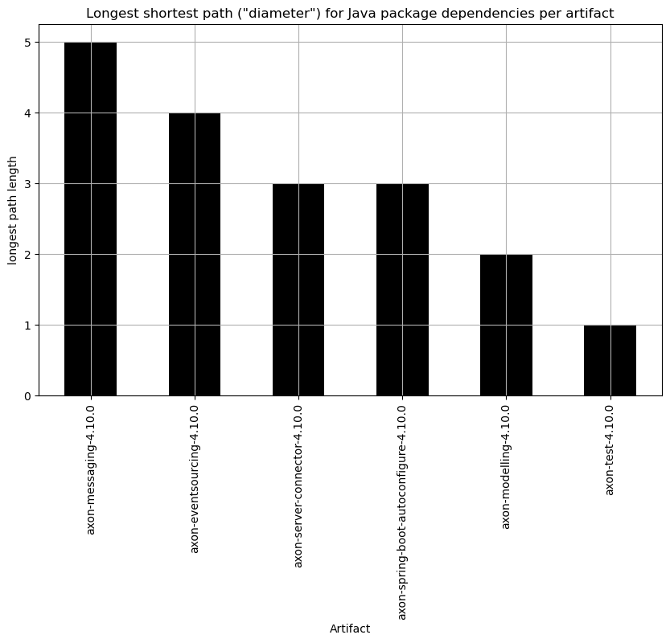
    

#### All pairs shortest path for each artifact - Bar chart (absolute)

    <Figure size 640x480 with 0 Axes>

    
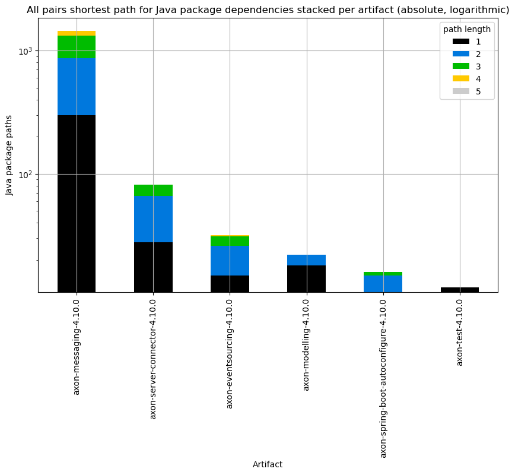
    

#### All pairs shortest path for each artifact - Bar chart (normalized)

Shows the top 50 artifacts with the highest number of dependency paths stacked by their length.

<table border="1" class="dataframe">
  <thead>
    <tr style="text-align: right;">
      <th>distance</th>
      <th>1</th>
      <th>2</th>
      <th>3</th>
      <th>4</th>
      <th>5</th>
    </tr>
    <tr>
      <th>sourceProject</th>
      <th></th>
      <th></th>
      <th></th>
      <th></th>
      <th></th>
    </tr>
  </thead>
  <tbody>
    <tr>
      <th>axon-messaging-4.10.0</th>
      <td>20.761246</td>
      <td>38.961938</td>
      <td>31.141869</td>
      <td>8.650519</td>
      <td>0.484429</td>
    </tr>
    <tr>
      <th>axon-server-connector-4.10.0</th>
      <td>34.146341</td>
      <td>46.341463</td>
      <td>19.512195</td>
      <td>0.000000</td>
      <td>0.000000</td>
    </tr>
    <tr>
      <th>axon-eventsourcing-4.10.0</th>
      <td>46.875000</td>
      <td>34.375000</td>
      <td>15.625000</td>
      <td>3.125000</td>
      <td>0.000000</td>
    </tr>
    <tr>
      <th>axon-modelling-4.10.0</th>
      <td>81.818182</td>
      <td>18.181818</td>
      <td>0.000000</td>
      <td>0.000000</td>
      <td>0.000000</td>
    </tr>
    <tr>
      <th>axon-spring-boot-autoconfigure-4.10.0</th>
      <td>68.750000</td>
      <td>25.000000</td>
      <td>6.250000</td>
      <td>0.000000</td>
      <td>0.000000</td>
    </tr>
    <tr>
      <th>axon-test-4.10.0</th>
      <td>100.000000</td>
      <td>0.000000</td>
      <td>0.000000</td>
      <td>0.000000</td>
      <td>0.000000</td>
    </tr>
  </tbody>
</table>

    <Figure size 640x480 with 0 Axes>

    
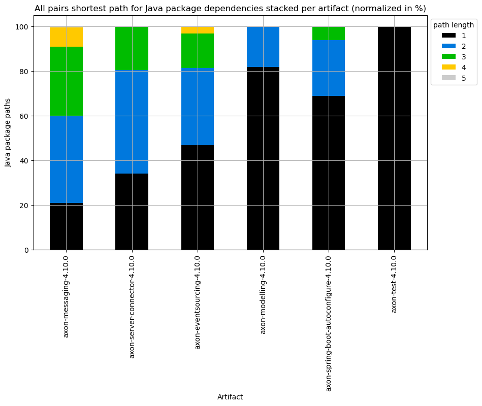
    

## 1.2 Longest path

Use [Longest Path](https://neo4j.com/docs/graph-data-science/current/algorithms/dag/longest-path) algorithm to get the longest paths between Java packages. It is typically higher than the longest shortest path (diameter) and helps together with it to get a good overview of the complexity.

**Note:** This algorithm requires a Directed Acyclic Graph (DAG) and will lead to inaccurate results when the Graph contains cycles.

### 1.2.1 Longest path in total

First, we'll have a look at the overall/total result of the longest path algorithm for all dependencies.

#### Longest path in total - Max longest path

    The max. longest path of the projected package dependencies is: 4

#### Longest path in total - Paths per length - Table

<table border="1" class="dataframe">
  <thead>
    <tr style="text-align: right;">
      <th></th>
      <th>index</th>
      <th>distance</th>
      <th>distanceTotalPairCount</th>
      <th>distanceTotalSourceCount</th>
      <th>distanceTotalTargetCount</th>
    </tr>
  </thead>
  <tbody>
    <tr>
      <th>0</th>
      <td>0</td>
      <td>1</td>
      <td>13</td>
      <td>5</td>
      <td>13</td>
    </tr>
    <tr>
      <th>1</th>
      <td>2</td>
      <td>2</td>
      <td>39</td>
      <td>3</td>
      <td>39</td>
    </tr>
    <tr>
      <th>2</th>
      <td>5</td>
      <td>3</td>
      <td>18</td>
      <td>2</td>
      <td>18</td>
    </tr>
    <tr>
      <th>3</th>
      <td>9</td>
      <td>4</td>
      <td>11</td>
      <td>2</td>
      <td>11</td>
    </tr>
  </tbody>
</table>

#### Longest path in total - Path count per length - Bar chart

    
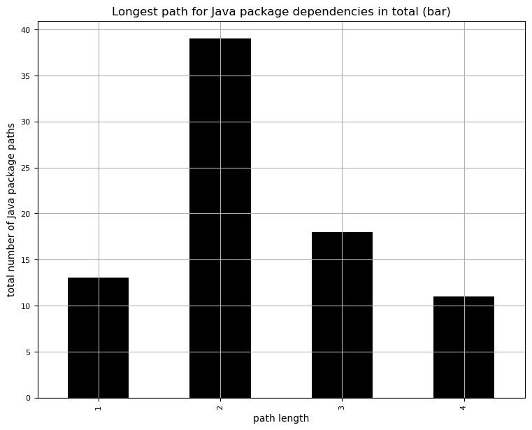
    

#### Longest path in total - Path count per length - Pie chart

    <Figure size 640x480 with 0 Axes>

    
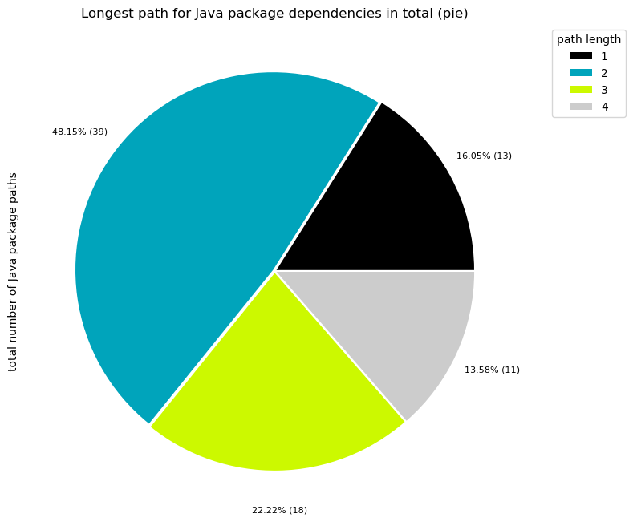
    

### 1.2.2 Longest path in detail

The following table shows the first 10 rows with all details of the query above. It contains the results of the "longest path" algorithm including the artifact the source node belongs to and if the target node is in the same artifact or not. The main intuition is to show how the data is structured. It provides the basis for tables and charts shown in following sections below, that filter and group the data accordingly.

<table border="1" class="dataframe">
  <thead>
    <tr style="text-align: right;">
      <th></th>
      <th>sourceProject</th>
      <th>isDifferentTargetProject</th>
      <th>distance</th>
      <th>distanceTotalPairCount</th>
      <th>distanceTotalSourceCount</th>
      <th>distanceTotalTargetCount</th>
      <th>pairCount</th>
      <th>sourceNodeCount</th>
      <th>targetNodeCount</th>
      <th>examples</th>
    </tr>
  </thead>
  <tbody>
    <tr>
      <th>0</th>
      <td>axon-modelling-4.10.0</td>
      <td>True</td>
      <td>1</td>
      <td>13</td>
      <td>5</td>
      <td>13</td>
      <td>1</td>
      <td>1</td>
      <td>1</td>
      <td>[/org/axonframework/modelling/command/legacyjpa -&gt;/org/axonframework/common/lock]</td>
    </tr>
    <tr>
      <th>1</th>
      <td>axon-server-connector-4.10.0</td>
      <td>False</td>
      <td>1</td>
      <td>13</td>
      <td>5</td>
      <td>13</td>
      <td>1</td>
      <td>1</td>
      <td>1</td>
      <td>[/org/axonframework/axonserver/connector/heartbeat/source -&gt;/org/axonframework/axonserver/connector/heartbeat]</td>
    </tr>
    <tr>
      <th>2</th>
      <td>axon-server-connector-4.10.0</td>
      <td>False</td>
      <td>2</td>
      <td>39</td>
      <td>3</td>
      <td>39</td>
      <td>1</td>
      <td>1</td>
      <td>1</td>
      <td>[/org/axonframework/axonserver/connector/heartbeat/source -&gt;/org/axonframework/axonserver/connector/util]</td>
    </tr>
    <tr>
      <th>3</th>
      <td>axon-spring-boot-autoconfigure-4.10.0</td>
      <td>False</td>
      <td>1</td>
      <td>13</td>
      <td>5</td>
      <td>13</td>
      <td>2</td>
      <td>1</td>
      <td>2</td>
      <td>[/org/axonframework/springboot/autoconfig/legacyjpa -&gt;/org/axonframework/springboot/util/legacyjpa, /org/axonframework/springboot/autoconfig/legacyjpa -&gt;/org/axonframework/springboot/autoconfig]</td>
    </tr>
    <tr>
      <th>4</th>
      <td>axon-spring-boot-autoconfigure-4.10.0</td>
      <td>False</td>
      <td>2</td>
      <td>39</td>
      <td>3</td>
      <td>39</td>
      <td>4</td>
      <td>1</td>
      <td>4</td>
      <td>[/org/axonframework/springboot/autoconfig/legacyjpa -&gt;/org/axonframework/actuator/axonserver, /org/axonframework/springboot/autoconfig/legacyjpa -&gt;/org/axonframework/springboot/util, /org/axonframework/springboot/autoconfig/legacyjpa -&gt;/org/axonframework/springboot/util/jpa, /org/axonframework/s...</td>
    </tr>
    <tr>
      <th>5</th>
      <td>axon-spring-boot-autoconfigure-4.10.0</td>
      <td>False</td>
      <td>3</td>
      <td>18</td>
      <td>2</td>
      <td>18</td>
      <td>2</td>
      <td>1</td>
      <td>2</td>
      <td>[/org/axonframework/springboot/autoconfig/legacyjpa -&gt;/org/axonframework/actuator, /org/axonframework/springboot/autoconfig/legacyjpa -&gt;/org/axonframework/springboot]</td>
    </tr>
    <tr>
      <th>6</th>
      <td>axon-spring-boot-autoconfigure-4.10.0</td>
      <td>True</td>
      <td>1</td>
      <td>13</td>
      <td>5</td>
      <td>13</td>
      <td>4</td>
      <td>1</td>
      <td>4</td>
      <td>[/org/axonframework/springboot/autoconfig/legacyjpa -&gt;/org/axonframework/modelling/saga/repository/legacyjpa, /org/axonframework/springboot/autoconfig/legacyjpa -&gt;/org/axonframework/eventsourcing/eventstore/legacyjpa, /org/axonframework/springboot/autoconfig/legacyjpa -&gt;/org/axonframework/eventh...</td>
    </tr>
    <tr>
      <th>7</th>
      <td>axon-spring-boot-autoconfigure-4.10.0</td>
      <td>True</td>
      <td>2</td>
      <td>39</td>
      <td>3</td>
      <td>39</td>
      <td>33</td>
      <td>1</td>
      <td>33</td>
      <td>[/org/axonframework/springboot/autoconfig/legacyjpa -&gt;/org/axonframework/axonserver/connector/query, /org/axonframework/springboot/autoconfig/legacyjpa -&gt;/org/axonframework/axonserver/connector/command, /org/axonframework/springboot/autoconfig/legacyjpa -&gt;/org/axonframework/axonserver/connector/...</td>
    </tr>
    <tr>
      <th>8</th>
      <td>axon-spring-boot-autoconfigure-4.10.0</td>
      <td>True</td>
      <td>3</td>
      <td>18</td>
      <td>2</td>
      <td>18</td>
      <td>14</td>
      <td>1</td>
      <td>14</td>
      <td>[/org/axonframework/springboot/autoconfig/legacyjpa -&gt;/org/axonframework/axonserver/connector, /org/axonframework/springboot/autoconfig/legacyjpa -&gt;/org/axonframework/modelling/saga, /org/axonframework/springboot/autoconfig/legacyjpa -&gt;/org/axonframework/modelling/saga/repository, /org/axonframe...</td>
    </tr>
    <tr>
      <th>9</th>
      <td>axon-spring-boot-autoconfigure-4.10.0</td>
      <td>True</td>
      <td>4</td>
      <td>11</td>
      <td>2</td>
      <td>11</td>
      <td>8</td>
      <td>1</td>
      <td>8</td>
      <td>[/org/axonframework/springboot/autoconfig/legacyjpa -&gt;/org/axonframework/common/digest, /org/axonframework/springboot/autoconfig/legacyjpa -&gt;/org/axonframework/common/transaction, /org/axonframework/springboot/autoconfig/legacyjpa -&gt;/org/axonframework/deadline, /org/axonframework/springboot/auto...</td>
    </tr>
  </tbody>
</table>

### 1.2.3 Longest path for each artifact

In this section we'll focus only on pairs of nodes that both belong to the same artifact, filtering out every line that has `isDifferentTargetProject==False`. The first ten rows are shown in a table followed by charts that show the distribution of longest path distances across different artifacts in stacked bar charts (absolute and normalized).

**Note:** It is possible that a (longest) path could have nodes in between that belong to different artifacts. Therefore, the data of each artifact isn't perfectly isolated. However, it shows how the dependencies interact across artifacts "in real life" while still providing a decent isolation of each artifact.

<table border="1" class="dataframe">
  <thead>
    <tr style="text-align: right;">
      <th></th>
      <th>sourceProject</th>
      <th>isDifferentTargetProject</th>
      <th>distance</th>
      <th>distanceTotalPairCount</th>
      <th>distanceTotalSourceCount</th>
      <th>distanceTotalTargetCount</th>
      <th>pairCount</th>
      <th>sourceNodeCount</th>
      <th>targetNodeCount</th>
      <th>examples</th>
    </tr>
  </thead>
  <tbody>
    <tr>
      <th>1</th>
      <td>axon-server-connector-4.10.0</td>
      <td>False</td>
      <td>1</td>
      <td>13</td>
      <td>5</td>
      <td>13</td>
      <td>1</td>
      <td>1</td>
      <td>1</td>
      <td>[/org/axonframework/axonserver/connector/heartbeat/source -&gt;/org/axonframework/axonserver/connector/heartbeat]</td>
    </tr>
    <tr>
      <th>2</th>
      <td>axon-server-connector-4.10.0</td>
      <td>False</td>
      <td>2</td>
      <td>39</td>
      <td>3</td>
      <td>39</td>
      <td>1</td>
      <td>1</td>
      <td>1</td>
      <td>[/org/axonframework/axonserver/connector/heartbeat/source -&gt;/org/axonframework/axonserver/connector/util]</td>
    </tr>
    <tr>
      <th>3</th>
      <td>axon-spring-boot-autoconfigure-4.10.0</td>
      <td>False</td>
      <td>1</td>
      <td>13</td>
      <td>5</td>
      <td>13</td>
      <td>2</td>
      <td>1</td>
      <td>2</td>
      <td>[/org/axonframework/springboot/autoconfig/legacyjpa -&gt;/org/axonframework/springboot/util/legacyjpa, /org/axonframework/springboot/autoconfig/legacyjpa -&gt;/org/axonframework/springboot/autoconfig]</td>
    </tr>
    <tr>
      <th>4</th>
      <td>axon-spring-boot-autoconfigure-4.10.0</td>
      <td>False</td>
      <td>2</td>
      <td>39</td>
      <td>3</td>
      <td>39</td>
      <td>4</td>
      <td>1</td>
      <td>4</td>
      <td>[/org/axonframework/springboot/autoconfig/legacyjpa -&gt;/org/axonframework/actuator/axonserver, /org/axonframework/springboot/autoconfig/legacyjpa -&gt;/org/axonframework/springboot/util, /org/axonframework/springboot/autoconfig/legacyjpa -&gt;/org/axonframework/springboot/util/jpa, /org/axonframework/s...</td>
    </tr>
    <tr>
      <th>5</th>
      <td>axon-spring-boot-autoconfigure-4.10.0</td>
      <td>False</td>
      <td>3</td>
      <td>18</td>
      <td>2</td>
      <td>18</td>
      <td>2</td>
      <td>1</td>
      <td>2</td>
      <td>[/org/axonframework/springboot/autoconfig/legacyjpa -&gt;/org/axonframework/actuator, /org/axonframework/springboot/autoconfig/legacyjpa -&gt;/org/axonframework/springboot]</td>
    </tr>
    <tr>
      <th>10</th>
      <td>axon-test-4.10.0</td>
      <td>False</td>
      <td>1</td>
      <td>13</td>
      <td>5</td>
      <td>13</td>
      <td>3</td>
      <td>2</td>
      <td>3</td>
      <td>[/org/axonframework/test/saga -&gt;/org/axonframework/test/utils, /org/axonframework/test/aggregate -&gt;/org/axonframework/test/deadline, /org/axonframework/test/saga -&gt;/org/axonframework/test/eventscheduler]</td>
    </tr>
    <tr>
      <th>11</th>
      <td>axon-test-4.10.0</td>
      <td>False</td>
      <td>2</td>
      <td>39</td>
      <td>3</td>
      <td>39</td>
      <td>1</td>
      <td>1</td>
      <td>1</td>
      <td>[/org/axonframework/test/aggregate -&gt;/org/axonframework/test/matchers]</td>
    </tr>
    <tr>
      <th>12</th>
      <td>axon-test-4.10.0</td>
      <td>False</td>
      <td>3</td>
      <td>18</td>
      <td>2</td>
      <td>18</td>
      <td>1</td>
      <td>1</td>
      <td>1</td>
      <td>[/org/axonframework/test/aggregate -&gt;/org/axonframework/test]</td>
    </tr>
  </tbody>
</table>

#### Longest path for each artifact - Max. longest path for each artifact

Shows the top 20 artifacts with their max. longest path.

    sourceProject
    axon-spring-boot-autoconfigure-4.10.0    3
    axon-test-4.10.0                         3
    axon-server-connector-4.10.0             2
    Name: distance, dtype: int64

    
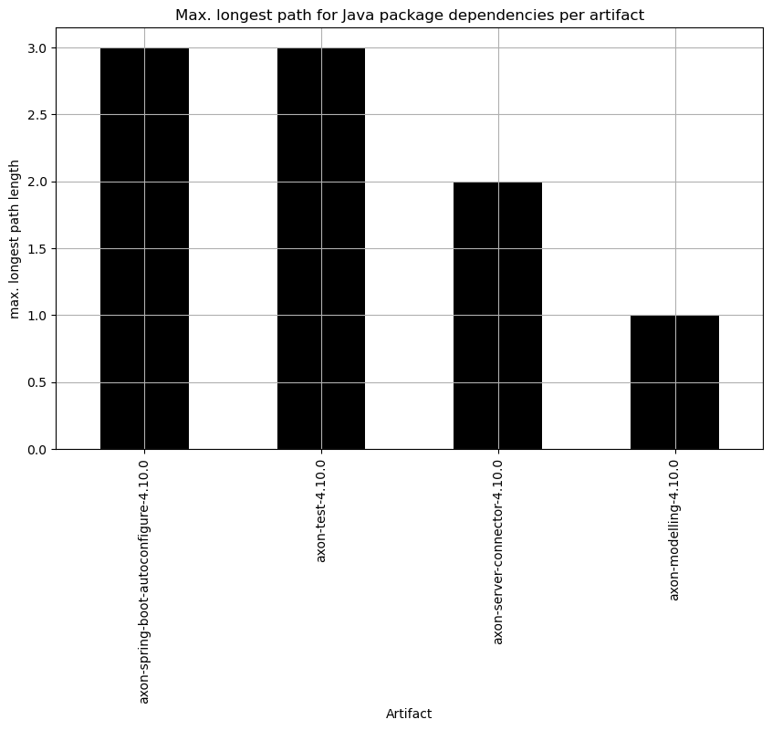
    

#### Longest path for each artifact - Bar chart (absolute)

    <Figure size 640x480 with 0 Axes>

    
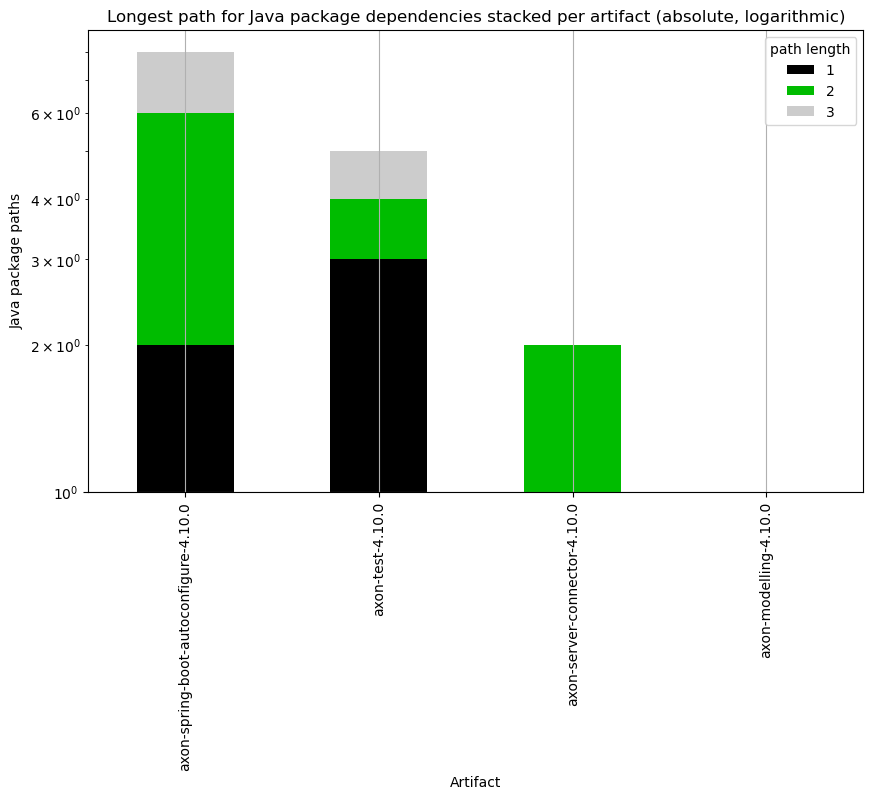
    

#### Longest path for each artifact - Bar chart (normalized)

Shows the top 50 artifacts with the highest number of dependency paths stacked by their length.

<table border="1" class="dataframe">
  <thead>
    <tr style="text-align: right;">
      <th>distance</th>
      <th>1</th>
      <th>2</th>
      <th>3</th>
    </tr>
    <tr>
      <th>sourceProject</th>
      <th></th>
      <th></th>
      <th></th>
    </tr>
  </thead>
  <tbody>
    <tr>
      <th>axon-spring-boot-autoconfigure-4.10.0</th>
      <td>25.0</td>
      <td>50.0</td>
      <td>25.0</td>
    </tr>
    <tr>
      <th>axon-test-4.10.0</th>
      <td>60.0</td>
      <td>20.0</td>
      <td>20.0</td>
    </tr>
    <tr>
      <th>axon-server-connector-4.10.0</th>
      <td>50.0</td>
      <td>50.0</td>
      <td>0.0</td>
    </tr>
  </tbody>
</table>

    <Figure size 640x480 with 0 Axes>

    
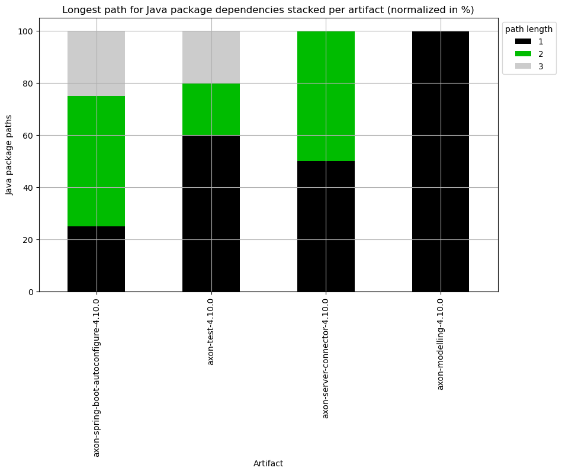
    

## 2. Java Artifacts

## 2.1 All pairs shortest path

Use [All Pairs Shortest Path](https://neo4j.com/docs/graph-data-science/current/algorithms/all-pairs-shortest-path) algorithm to get the shortest path distance between all pairs of dependent Java artifacts. It shows how many artifacts have a direct dependency (distance 1), how many are reachable with one dependency in between (distance 2), and so on...

### 2.1.1 Create a projection of all Java artifacts dependencies

Creates a in-memory projection of "Java:Artifact" nodes and their "DEPENDS_ON" relationships as a preparation to run the Graph algorithms. The weight property is not used for now (September 2024) but may be needed for other algorithms/variants some time.

#### Projected Graph statistics for Java Artifact dependencies

<table border="1" class="dataframe">
  <thead>
    <tr style="text-align: right;">
      <th></th>
      <th>nodeCount</th>
      <th>relationshipCount</th>
      <th>density</th>
      <th>sizeInBytes</th>
      <th>degreeDistribution.min</th>
      <th>degreeDistribution.mean</th>
      <th>degreeDistribution.max</th>
      <th>degreeDistribution.p50</th>
      <th>degreeDistribution.p75</th>
      <th>degreeDistribution.p90</th>
      <th>degreeDistribution.p95</th>
      <th>degreeDistribution.p99</th>
      <th>degreeDistribution.p999</th>
    </tr>
  </thead>
  <tbody>
    <tr>
      <th>0</th>
      <td>9</td>
      <td>25</td>
      <td>0.347222</td>
      <td>2725768</td>
      <td>0</td>
      <td>2.777778</td>
      <td>7</td>
      <td>3</td>
      <td>4</td>
      <td>7</td>
      <td>7</td>
      <td>7</td>
      <td>7</td>
    </tr>
  </tbody>
</table>

### 2.1.2 All pairs shortest path in total

First, we'll have a look at the overall/total result of the all pairs shortest path algorithm for all dependencies.

<table border="1" class="dataframe">
  <thead>
    <tr style="text-align: right;">
      <th></th>
      <th>index</th>
      <th>distance</th>
      <th>distanceTotalPairCount</th>
      <th>distanceTotalSourceCount</th>
      <th>distanceTotalTargetCount</th>
    </tr>
  </thead>
  <tbody>
    <tr>
      <th>0</th>
      <td>0</td>
      <td>1</td>
      <td>25</td>
      <td>8</td>
      <td>8</td>
    </tr>
    <tr>
      <th>1</th>
      <td>1</td>
      <td>2</td>
      <td>2</td>
      <td>2</td>
      <td>1</td>
    </tr>
  </tbody>
</table>

#### All pairs shortest path in total - Longest shortest path (Diameter)

    The diameter (longest shortest path) of the projected artifact dependencies Graph is: 2

#### All pairs shortest path in total - Path count per length - Bar chart

    
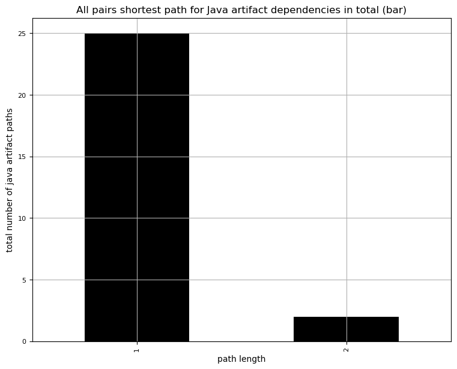
    

#### All pairs shortest path in total - Path count per length - Bar chart

    <Figure size 640x480 with 0 Axes>

    
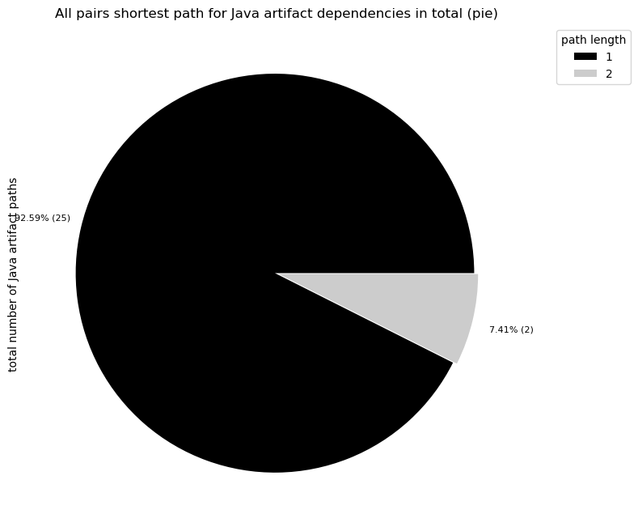
    

## 2.2 Longest path

Use [Longest Path](https://neo4j.com/docs/graph-data-science/current/algorithms/dag/longest-path) algorithm to get the longest paths between Java artifacts. This is especially interesting because an artifact can only be built when the artifacts it depends on are built (and published). The longest path shows in this case the total/max. number of build levels that are needed in case everything needs to be rebuild ("worst case"). Its also an interesting metric for complexity. It is typically higher than the longest shortest path (diameter) and helps together with it to get a good overview of the complexity.

**Note:** This algorithm requires a Directed Acyclic Graph (DAG) and might lead to inaccurate results when the Graph contains cycles.

### 2.2.1 Longest path in total

First, we'll have a look at the overall/total result of the longest path algorithm for all dependencies.

#### Longest path in total - Max longest path

    The max. longest path of the projected artifact dependencies is: 6

#### Longest path in total - Path count per length - Table

<table border="1" class="dataframe">
  <thead>
    <tr style="text-align: right;">
      <th></th>
      <th>index</th>
      <th>distance</th>
      <th>distanceTotalPairCount</th>
      <th>distanceTotalSourceCount</th>
      <th>distanceTotalTargetCount</th>
    </tr>
  </thead>
  <tbody>
    <tr>
      <th>0</th>
      <td>0</td>
      <td>1</td>
      <td>3</td>
      <td>1</td>
      <td>3</td>
    </tr>
    <tr>
      <th>1</th>
      <td>1</td>
      <td>2</td>
      <td>1</td>
      <td>1</td>
      <td>1</td>
    </tr>
    <tr>
      <th>2</th>
      <td>2</td>
      <td>3</td>
      <td>1</td>
      <td>1</td>
      <td>1</td>
    </tr>
    <tr>
      <th>3</th>
      <td>3</td>
      <td>4</td>
      <td>1</td>
      <td>1</td>
      <td>1</td>
    </tr>
    <tr>
      <th>4</th>
      <td>4</td>
      <td>5</td>
      <td>1</td>
      <td>1</td>
      <td>1</td>
    </tr>
    <tr>
      <th>5</th>
      <td>5</td>
      <td>6</td>
      <td>1</td>
      <td>1</td>
      <td>1</td>
    </tr>
  </tbody>
</table>

#### Longest path in total - Path count per length - Bar chart

    
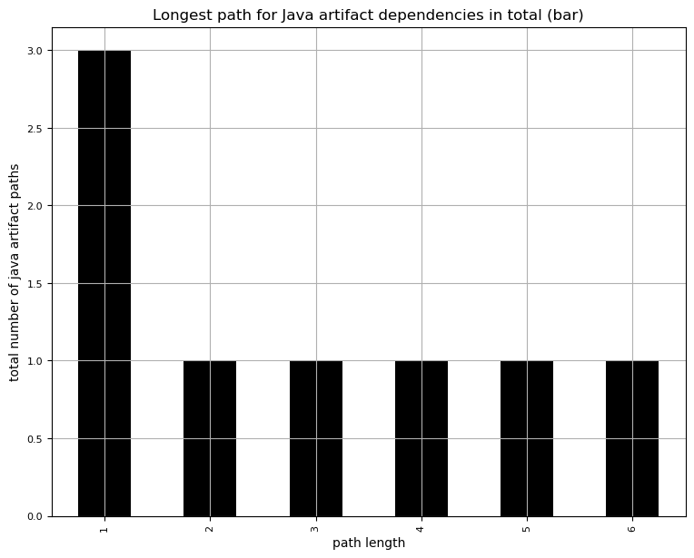
    

#### Longest path in total - Path count per length - Pie chart

    <Figure size 640x480 with 0 Axes>

    
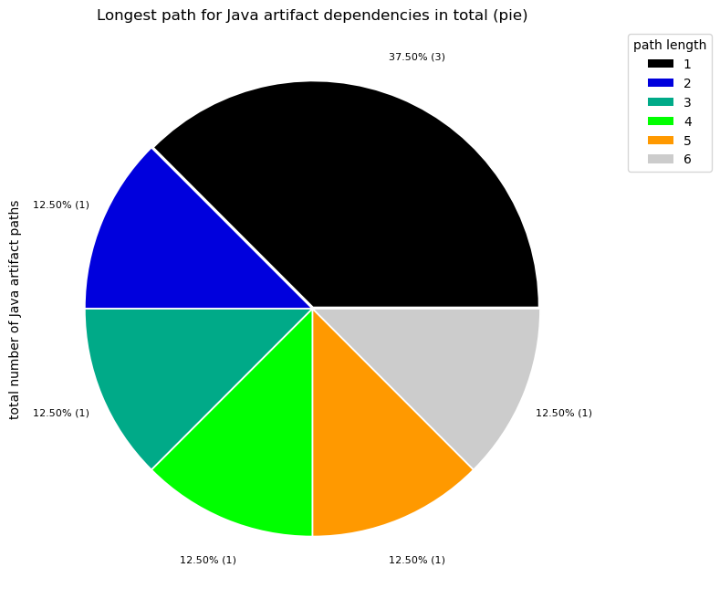
    

## 3. Summary

### 3.1 Java packages summary

<table border="1" class="dataframe">
  <thead>
    <tr style="text-align: right;">
      <th></th>
      <th>count</th>
      <th>degree density</th>
      <th>degree median</th>
      <th>degree max</th>
      <th>longest shortest path (diameter)</th>
      <th>max. longest path</th>
    </tr>
  </thead>
  <tbody>
    <tr>
      <th>0</th>
      <td>114</td>
      <td>0.057833</td>
      <td>5</td>
      <td>56</td>
      <td>5</td>
      <td>4</td>
    </tr>
  </tbody>
</table>

### 3.2 Java artifacts summary

<table border="1" class="dataframe">
  <thead>
    <tr style="text-align: right;">
      <th></th>
      <th>count</th>
      <th>degree density</th>
      <th>degree median</th>
      <th>degree max</th>
      <th>longest shortest path (diameter)</th>
      <th>max. longest path</th>
    </tr>
  </thead>
  <tbody>
    <tr>
      <th>0</th>
      <td>9</td>
      <td>0.347222</td>
      <td>3</td>
      <td>7</td>
      <td>2</td>
      <td>6</td>
    </tr>
  </tbody>
</table>

