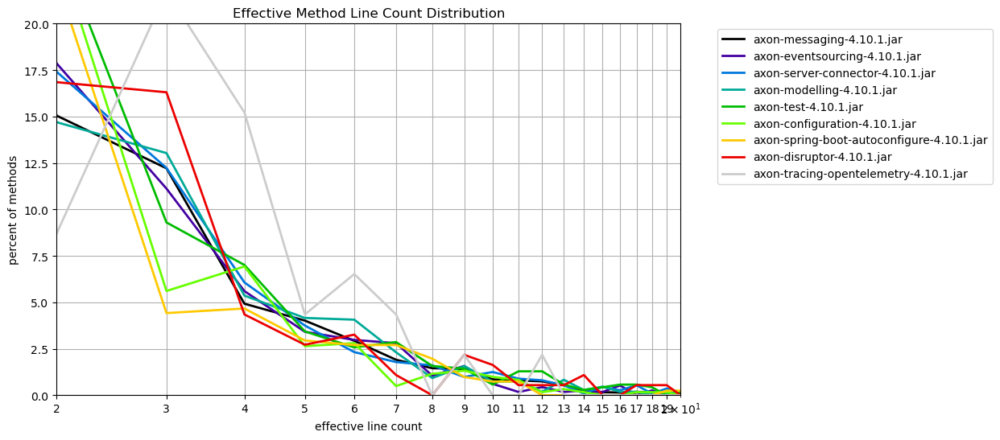
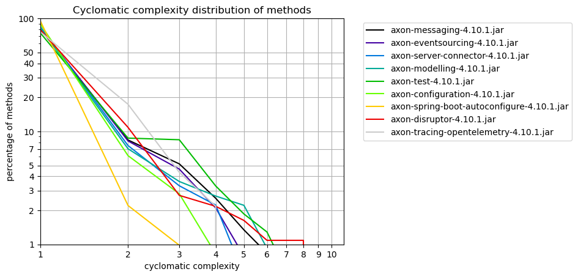

# Method Metrics
   

### References
- [jqassistant](https://jqassistant.org)
- [Neo4j Python Driver](https://neo4j.com/docs/api/python-driver/current)

## Effective Method Line Count

### Table 1a - Effective method line count distribution

This table shows the distribution of the effective method line count per artifact.
For each artifact the number of methods with effective line count = 1,2,3,... is shown to get an overview of how line counts are distributed over methods.

Only the 15 artifacts with the highest method count and their effective method line count distribution (limited by 40)is shown here. The whole table can be found in the CSV report `Effective_Method_Line_Count_Distribution`.

Have a look below to find out which packages and methods have the highest effective lines of code.

<table border="1" class="dataframe">
  <thead>
    <tr style="text-align: right;">
      <th>artifactName</th>
      <th>axon-messaging-4.10.1.jar</th>
      <th>axon-eventsourcing-4.10.1.jar</th>
      <th>axon-server-connector-4.10.1.jar</th>
      <th>axon-modelling-4.10.1.jar</th>
      <th>axon-test-4.10.1.jar</th>
      <th>axon-configuration-4.10.1.jar</th>
      <th>axon-spring-boot-autoconfigure-4.10.1.jar</th>
      <th>axon-disruptor-4.10.1.jar</th>
      <th>axon-tracing-opentelemetry-4.10.1.jar</th>
    </tr>
    <tr>
      <th>effectiveLineCount</th>
      <th></th>
      <th></th>
      <th></th>
      <th></th>
      <th></th>
      <th></th>
      <th></th>
      <th></th>
      <th></th>
    </tr>
  </thead>
  <tbody>
    <tr>
      <th>1</th>
      <td>2830</td>
      <td>573</td>
      <td>533</td>
      <td>535</td>
      <td>280</td>
      <td>310</td>
      <td>222</td>
      <td>84</td>
      <td>16</td>
    </tr>
    <tr>
      <th>2</th>
      <td>828</td>
      <td>204</td>
      <td>195</td>
      <td>159</td>
      <td>171</td>
      <td>146</td>
      <td>91</td>
      <td>31</td>
      <td>4</td>
    </tr>
    <tr>
      <th>3</th>
      <td>672</td>
      <td>127</td>
      <td>137</td>
      <td>141</td>
      <td>65</td>
      <td>34</td>
      <td>18</td>
      <td>30</td>
      <td>10</td>
    </tr>
    <tr>
      <th>4</th>
      <td>271</td>
      <td>64</td>
      <td>68</td>
      <td>58</td>
      <td>49</td>
      <td>42</td>
      <td>19</td>
      <td>8</td>
      <td>7</td>
    </tr>
    <tr>
      <th>5</th>
      <td>221</td>
      <td>39</td>
      <td>42</td>
      <td>45</td>
      <td>24</td>
      <td>16</td>
      <td>12</td>
      <td>5</td>
      <td>2</td>
    </tr>
    <tr>
      <th>6</th>
      <td>161</td>
      <td>34</td>
      <td>26</td>
      <td>44</td>
      <td>18</td>
      <td>17</td>
      <td>11</td>
      <td>6</td>
      <td>3</td>
    </tr>
    <tr>
      <th>7</th>
      <td>105</td>
      <td>32</td>
      <td>20</td>
      <td>25</td>
      <td>20</td>
      <td>3</td>
      <td>11</td>
      <td>2</td>
      <td>2</td>
    </tr>
    <tr>
      <th>8</th>
      <td>80</td>
      <td>12</td>
      <td>18</td>
      <td>10</td>
      <td>11</td>
      <td>7</td>
      <td>8</td>
      <td>0</td>
      <td>0</td>
    </tr>
    <tr>
      <th>9</th>
      <td>78</td>
      <td>18</td>
      <td>11</td>
      <td>17</td>
      <td>10</td>
      <td>8</td>
      <td>4</td>
      <td>4</td>
      <td>1</td>
    </tr>
    <tr>
      <th>10</th>
      <td>47</td>
      <td>7</td>
      <td>14</td>
      <td>8</td>
      <td>4</td>
      <td>6</td>
      <td>3</td>
      <td>3</td>
      <td>0</td>
    </tr>
    <tr>
      <th>11</th>
      <td>44</td>
      <td>2</td>
      <td>10</td>
      <td>8</td>
      <td>9</td>
      <td>5</td>
      <td>3</td>
      <td>1</td>
      <td>0</td>
    </tr>
    <tr>
      <th>12</th>
      <td>41</td>
      <td>5</td>
      <td>9</td>
      <td>2</td>
      <td>9</td>
      <td>1</td>
      <td>0</td>
      <td>1</td>
      <td>1</td>
    </tr>
    <tr>
      <th>13</th>
      <td>30</td>
      <td>2</td>
      <td>6</td>
      <td>9</td>
      <td>4</td>
      <td>2</td>
      <td>0</td>
      <td>1</td>
      <td>0</td>
    </tr>
    <tr>
      <th>14</th>
      <td>12</td>
      <td>3</td>
      <td>1</td>
      <td>3</td>
      <td>2</td>
      <td>1</td>
      <td>0</td>
      <td>2</td>
      <td>0</td>
    </tr>
    <tr>
      <th>15</th>
      <td>9</td>
      <td>2</td>
      <td>5</td>
      <td>5</td>
      <td>3</td>
      <td>0</td>
      <td>0</td>
      <td>0</td>
      <td>0</td>
    </tr>
    <tr>
      <th>16</th>
      <td>8</td>
      <td>6</td>
      <td>3</td>
      <td>2</td>
      <td>4</td>
      <td>0</td>
      <td>0</td>
      <td>0</td>
      <td>0</td>
    </tr>
    <tr>
      <th>17</th>
      <td>10</td>
      <td>0</td>
      <td>6</td>
      <td>2</td>
      <td>4</td>
      <td>1</td>
      <td>0</td>
      <td>1</td>
      <td>0</td>
    </tr>
    <tr>
      <th>18</th>
      <td>9</td>
      <td>3</td>
      <td>1</td>
      <td>0</td>
      <td>3</td>
      <td>1</td>
      <td>0</td>
      <td>1</td>
      <td>0</td>
    </tr>
    <tr>
      <th>19</th>
      <td>6</td>
      <td>0</td>
      <td>4</td>
      <td>1</td>
      <td>0</td>
      <td>1</td>
      <td>1</td>
      <td>1</td>
      <td>0</td>
    </tr>
    <tr>
      <th>20</th>
      <td>5</td>
      <td>2</td>
      <td>2</td>
      <td>2</td>
      <td>1</td>
      <td>0</td>
      <td>1</td>
      <td>0</td>
      <td>0</td>
    </tr>
    <tr>
      <th>21</th>
      <td>6</td>
      <td>2</td>
      <td>1</td>
      <td>1</td>
      <td>1</td>
      <td>1</td>
      <td>0</td>
      <td>0</td>
      <td>0</td>
    </tr>
    <tr>
      <th>22</th>
      <td>3</td>
      <td>1</td>
      <td>0</td>
      <td>2</td>
      <td>1</td>
      <td>0</td>
      <td>1</td>
      <td>1</td>
      <td>0</td>
    </tr>
    <tr>
      <th>23</th>
      <td>5</td>
      <td>2</td>
      <td>0</td>
      <td>0</td>
      <td>1</td>
      <td>1</td>
      <td>1</td>
      <td>0</td>
      <td>0</td>
    </tr>
    <tr>
      <th>24</th>
      <td>3</td>
      <td>1</td>
      <td>3</td>
      <td>1</td>
      <td>1</td>
      <td>0</td>
      <td>0</td>
      <td>1</td>
      <td>0</td>
    </tr>
    <tr>
      <th>25</th>
      <td>2</td>
      <td>1</td>
      <td>1</td>
      <td>0</td>
      <td>0</td>
      <td>0</td>
      <td>0</td>
      <td>0</td>
      <td>0</td>
    </tr>
    <tr>
      <th>26</th>
      <td>2</td>
      <td>0</td>
      <td>0</td>
      <td>1</td>
      <td>1</td>
      <td>1</td>
      <td>0</td>
      <td>0</td>
      <td>0</td>
    </tr>
    <tr>
      <th>28</th>
      <td>2</td>
      <td>0</td>
      <td>1</td>
      <td>0</td>
      <td>0</td>
      <td>0</td>
      <td>0</td>
      <td>0</td>
      <td>0</td>
    </tr>
    <tr>
      <th>29</th>
      <td>0</td>
      <td>0</td>
      <td>0</td>
      <td>0</td>
      <td>1</td>
      <td>0</td>
      <td>0</td>
      <td>0</td>
      <td>0</td>
    </tr>
    <tr>
      <th>30</th>
      <td>1</td>
      <td>0</td>
      <td>0</td>
      <td>0</td>
      <td>0</td>
      <td>0</td>
      <td>0</td>
      <td>0</td>
      <td>0</td>
    </tr>
    <tr>
      <th>31</th>
      <td>1</td>
      <td>0</td>
      <td>0</td>
      <td>0</td>
      <td>1</td>
      <td>0</td>
      <td>0</td>
      <td>0</td>
      <td>0</td>
    </tr>
    <tr>
      <th>32</th>
      <td>1</td>
      <td>0</td>
      <td>0</td>
      <td>0</td>
      <td>0</td>
      <td>0</td>
      <td>0</td>
      <td>1</td>
      <td>0</td>
    </tr>
    <tr>
      <th>33</th>
      <td>1</td>
      <td>0</td>
      <td>1</td>
      <td>0</td>
      <td>0</td>
      <td>0</td>
      <td>0</td>
      <td>0</td>
      <td>0</td>
    </tr>
    <tr>
      <th>34</th>
      <td>1</td>
      <td>0</td>
      <td>0</td>
      <td>0</td>
      <td>0</td>
      <td>0</td>
      <td>1</td>
      <td>0</td>
      <td>0</td>
    </tr>
    <tr>
      <th>36</th>
      <td>2</td>
      <td>0</td>
      <td>0</td>
      <td>0</td>
      <td>0</td>
      <td>0</td>
      <td>0</td>
      <td>0</td>
      <td>0</td>
    </tr>
    <tr>
      <th>38</th>
      <td>0</td>
      <td>0</td>
      <td>0</td>
      <td>1</td>
      <td>0</td>
      <td>0</td>
      <td>0</td>
      <td>0</td>
      <td>0</td>
    </tr>
    <tr>
      <th>40</th>
      <td>0</td>
      <td>0</td>
      <td>1</td>
      <td>0</td>
      <td>0</td>
      <td>0</td>
      <td>0</td>
      <td>0</td>
      <td>0</td>
    </tr>
    <tr>
      <th>41</th>
      <td>0</td>
      <td>0</td>
      <td>1</td>
      <td>0</td>
      <td>0</td>
      <td>0</td>
      <td>0</td>
      <td>0</td>
      <td>0</td>
    </tr>
    <tr>
      <th>43</th>
      <td>0</td>
      <td>0</td>
      <td>0</td>
      <td>0</td>
      <td>0</td>
      <td>1</td>
      <td>0</td>
      <td>0</td>
      <td>0</td>
    </tr>
    <tr>
      <th>44</th>
      <td>1</td>
      <td>0</td>
      <td>0</td>
      <td>0</td>
      <td>0</td>
      <td>0</td>
      <td>0</td>
      <td>0</td>
      <td>0</td>
    </tr>
    <tr>
      <th>45</th>
      <td>0</td>
      <td>0</td>
      <td>0</td>
      <td>0</td>
      <td>1</td>
      <td>0</td>
      <td>0</td>
      <td>0</td>
      <td>0</td>
    </tr>
  </tbody>
</table>

### Table 1b - Effective method line count distribution (normalized)

The table shown here only includes the first 40 rows which typically represents the most significant entries.
Have a look below to find out which packages and methods have the highest effective lines of code.

<table border="1" class="dataframe">
  <thead>
    <tr style="text-align: right;">
      <th>artifactName</th>
      <th>axon-messaging-4.10.1.jar</th>
      <th>axon-eventsourcing-4.10.1.jar</th>
      <th>axon-server-connector-4.10.1.jar</th>
      <th>axon-modelling-4.10.1.jar</th>
      <th>axon-test-4.10.1.jar</th>
      <th>axon-configuration-4.10.1.jar</th>
      <th>axon-spring-boot-autoconfigure-4.10.1.jar</th>
      <th>axon-disruptor-4.10.1.jar</th>
      <th>axon-tracing-opentelemetry-4.10.1.jar</th>
    </tr>
    <tr>
      <th>effectiveLineCount</th>
      <th></th>
      <th></th>
      <th></th>
      <th></th>
      <th></th>
      <th></th>
      <th></th>
      <th></th>
      <th></th>
    </tr>
  </thead>
  <tbody>
    <tr>
      <th>1</th>
      <td>51.435842</td>
      <td>50.175131</td>
      <td>47.589286</td>
      <td>49.445471</td>
      <td>40.057225</td>
      <td>51.155116</td>
      <td>54.545455</td>
      <td>45.652174</td>
      <td>34.782609</td>
    </tr>
    <tr>
      <th>2</th>
      <td>15.049073</td>
      <td>17.863398</td>
      <td>17.410714</td>
      <td>14.695009</td>
      <td>24.463519</td>
      <td>24.092409</td>
      <td>22.358722</td>
      <td>16.847826</td>
      <td>8.695652</td>
    </tr>
    <tr>
      <th>3</th>
      <td>12.213740</td>
      <td>11.120841</td>
      <td>12.232143</td>
      <td>13.031423</td>
      <td>9.298999</td>
      <td>5.610561</td>
      <td>4.422604</td>
      <td>16.304348</td>
      <td>21.739130</td>
    </tr>
    <tr>
      <th>4</th>
      <td>4.925482</td>
      <td>5.604203</td>
      <td>6.071429</td>
      <td>5.360444</td>
      <td>7.010014</td>
      <td>6.930693</td>
      <td>4.668305</td>
      <td>4.347826</td>
      <td>15.217391</td>
    </tr>
    <tr>
      <th>5</th>
      <td>4.016721</td>
      <td>3.415061</td>
      <td>3.750000</td>
      <td>4.158965</td>
      <td>3.433476</td>
      <td>2.640264</td>
      <td>2.948403</td>
      <td>2.717391</td>
      <td>4.347826</td>
    </tr>
    <tr>
      <th>6</th>
      <td>2.926209</td>
      <td>2.977233</td>
      <td>2.321429</td>
      <td>4.066543</td>
      <td>2.575107</td>
      <td>2.805281</td>
      <td>2.702703</td>
      <td>3.260870</td>
      <td>6.521739</td>
    </tr>
    <tr>
      <th>7</th>
      <td>1.908397</td>
      <td>2.802102</td>
      <td>1.785714</td>
      <td>2.310536</td>
      <td>2.861230</td>
      <td>0.495050</td>
      <td>2.702703</td>
      <td>1.086957</td>
      <td>4.347826</td>
    </tr>
    <tr>
      <th>8</th>
      <td>1.454017</td>
      <td>1.050788</td>
      <td>1.607143</td>
      <td>0.924214</td>
      <td>1.573677</td>
      <td>1.155116</td>
      <td>1.965602</td>
      <td>0.000000</td>
      <td>0.000000</td>
    </tr>
    <tr>
      <th>9</th>
      <td>1.417666</td>
      <td>1.576182</td>
      <td>0.982143</td>
      <td>1.571165</td>
      <td>1.430615</td>
      <td>1.320132</td>
      <td>0.982801</td>
      <td>2.173913</td>
      <td>2.173913</td>
    </tr>
    <tr>
      <th>10</th>
      <td>0.854235</td>
      <td>0.612960</td>
      <td>1.250000</td>
      <td>0.739372</td>
      <td>0.572246</td>
      <td>0.990099</td>
      <td>0.737101</td>
      <td>1.630435</td>
      <td>0.000000</td>
    </tr>
    <tr>
      <th>11</th>
      <td>0.799709</td>
      <td>0.175131</td>
      <td>0.892857</td>
      <td>0.739372</td>
      <td>1.287554</td>
      <td>0.825083</td>
      <td>0.737101</td>
      <td>0.543478</td>
      <td>0.000000</td>
    </tr>
    <tr>
      <th>12</th>
      <td>0.745184</td>
      <td>0.437828</td>
      <td>0.803571</td>
      <td>0.184843</td>
      <td>1.287554</td>
      <td>0.165017</td>
      <td>0.000000</td>
      <td>0.543478</td>
      <td>2.173913</td>
    </tr>
    <tr>
      <th>13</th>
      <td>0.545256</td>
      <td>0.175131</td>
      <td>0.535714</td>
      <td>0.831793</td>
      <td>0.572246</td>
      <td>0.330033</td>
      <td>0.000000</td>
      <td>0.543478</td>
      <td>0.000000</td>
    </tr>
    <tr>
      <th>14</th>
      <td>0.218103</td>
      <td>0.262697</td>
      <td>0.089286</td>
      <td>0.277264</td>
      <td>0.286123</td>
      <td>0.165017</td>
      <td>0.000000</td>
      <td>1.086957</td>
      <td>0.000000</td>
    </tr>
    <tr>
      <th>15</th>
      <td>0.163577</td>
      <td>0.175131</td>
      <td>0.446429</td>
      <td>0.462107</td>
      <td>0.429185</td>
      <td>0.000000</td>
      <td>0.000000</td>
      <td>0.000000</td>
      <td>0.000000</td>
    </tr>
    <tr>
      <th>16</th>
      <td>0.145402</td>
      <td>0.525394</td>
      <td>0.267857</td>
      <td>0.184843</td>
      <td>0.572246</td>
      <td>0.000000</td>
      <td>0.000000</td>
      <td>0.000000</td>
      <td>0.000000</td>
    </tr>
    <tr>
      <th>17</th>
      <td>0.181752</td>
      <td>0.000000</td>
      <td>0.535714</td>
      <td>0.184843</td>
      <td>0.572246</td>
      <td>0.165017</td>
      <td>0.000000</td>
      <td>0.543478</td>
      <td>0.000000</td>
    </tr>
    <tr>
      <th>18</th>
      <td>0.163577</td>
      <td>0.262697</td>
      <td>0.089286</td>
      <td>0.000000</td>
      <td>0.429185</td>
      <td>0.165017</td>
      <td>0.000000</td>
      <td>0.543478</td>
      <td>0.000000</td>
    </tr>
    <tr>
      <th>19</th>
      <td>0.109051</td>
      <td>0.000000</td>
      <td>0.357143</td>
      <td>0.092421</td>
      <td>0.000000</td>
      <td>0.165017</td>
      <td>0.245700</td>
      <td>0.543478</td>
      <td>0.000000</td>
    </tr>
    <tr>
      <th>20</th>
      <td>0.090876</td>
      <td>0.175131</td>
      <td>0.178571</td>
      <td>0.184843</td>
      <td>0.143062</td>
      <td>0.000000</td>
      <td>0.245700</td>
      <td>0.000000</td>
      <td>0.000000</td>
    </tr>
    <tr>
      <th>21</th>
      <td>0.109051</td>
      <td>0.175131</td>
      <td>0.089286</td>
      <td>0.092421</td>
      <td>0.143062</td>
      <td>0.165017</td>
      <td>0.000000</td>
      <td>0.000000</td>
      <td>0.000000</td>
    </tr>
    <tr>
      <th>22</th>
      <td>0.054526</td>
      <td>0.087566</td>
      <td>0.000000</td>
      <td>0.184843</td>
      <td>0.143062</td>
      <td>0.000000</td>
      <td>0.245700</td>
      <td>0.543478</td>
      <td>0.000000</td>
    </tr>
    <tr>
      <th>23</th>
      <td>0.090876</td>
      <td>0.175131</td>
      <td>0.000000</td>
      <td>0.000000</td>
      <td>0.143062</td>
      <td>0.165017</td>
      <td>0.245700</td>
      <td>0.000000</td>
      <td>0.000000</td>
    </tr>
    <tr>
      <th>24</th>
      <td>0.054526</td>
      <td>0.087566</td>
      <td>0.267857</td>
      <td>0.092421</td>
      <td>0.143062</td>
      <td>0.000000</td>
      <td>0.000000</td>
      <td>0.543478</td>
      <td>0.000000</td>
    </tr>
    <tr>
      <th>25</th>
      <td>0.036350</td>
      <td>0.087566</td>
      <td>0.089286</td>
      <td>0.000000</td>
      <td>0.000000</td>
      <td>0.000000</td>
      <td>0.000000</td>
      <td>0.000000</td>
      <td>0.000000</td>
    </tr>
    <tr>
      <th>26</th>
      <td>0.036350</td>
      <td>0.000000</td>
      <td>0.000000</td>
      <td>0.092421</td>
      <td>0.143062</td>
      <td>0.165017</td>
      <td>0.000000</td>
      <td>0.000000</td>
      <td>0.000000</td>
    </tr>
    <tr>
      <th>28</th>
      <td>0.036350</td>
      <td>0.000000</td>
      <td>0.089286</td>
      <td>0.000000</td>
      <td>0.000000</td>
      <td>0.000000</td>
      <td>0.000000</td>
      <td>0.000000</td>
      <td>0.000000</td>
    </tr>
    <tr>
      <th>29</th>
      <td>0.000000</td>
      <td>0.000000</td>
      <td>0.000000</td>
      <td>0.000000</td>
      <td>0.143062</td>
      <td>0.000000</td>
      <td>0.000000</td>
      <td>0.000000</td>
      <td>0.000000</td>
    </tr>
    <tr>
      <th>30</th>
      <td>0.018175</td>
      <td>0.000000</td>
      <td>0.000000</td>
      <td>0.000000</td>
      <td>0.000000</td>
      <td>0.000000</td>
      <td>0.000000</td>
      <td>0.000000</td>
      <td>0.000000</td>
    </tr>
    <tr>
      <th>31</th>
      <td>0.018175</td>
      <td>0.000000</td>
      <td>0.000000</td>
      <td>0.000000</td>
      <td>0.143062</td>
      <td>0.000000</td>
      <td>0.000000</td>
      <td>0.000000</td>
      <td>0.000000</td>
    </tr>
    <tr>
      <th>32</th>
      <td>0.018175</td>
      <td>0.000000</td>
      <td>0.000000</td>
      <td>0.000000</td>
      <td>0.000000</td>
      <td>0.000000</td>
      <td>0.000000</td>
      <td>0.543478</td>
      <td>0.000000</td>
    </tr>
    <tr>
      <th>33</th>
      <td>0.018175</td>
      <td>0.000000</td>
      <td>0.089286</td>
      <td>0.000000</td>
      <td>0.000000</td>
      <td>0.000000</td>
      <td>0.000000</td>
      <td>0.000000</td>
      <td>0.000000</td>
    </tr>
    <tr>
      <th>34</th>
      <td>0.018175</td>
      <td>0.000000</td>
      <td>0.000000</td>
      <td>0.000000</td>
      <td>0.000000</td>
      <td>0.000000</td>
      <td>0.245700</td>
      <td>0.000000</td>
      <td>0.000000</td>
    </tr>
    <tr>
      <th>36</th>
      <td>0.036350</td>
      <td>0.000000</td>
      <td>0.000000</td>
      <td>0.000000</td>
      <td>0.000000</td>
      <td>0.000000</td>
      <td>0.000000</td>
      <td>0.000000</td>
      <td>0.000000</td>
    </tr>
    <tr>
      <th>38</th>
      <td>0.000000</td>
      <td>0.000000</td>
      <td>0.000000</td>
      <td>0.092421</td>
      <td>0.000000</td>
      <td>0.000000</td>
      <td>0.000000</td>
      <td>0.000000</td>
      <td>0.000000</td>
    </tr>
    <tr>
      <th>40</th>
      <td>0.000000</td>
      <td>0.000000</td>
      <td>0.089286</td>
      <td>0.000000</td>
      <td>0.000000</td>
      <td>0.000000</td>
      <td>0.000000</td>
      <td>0.000000</td>
      <td>0.000000</td>
    </tr>
    <tr>
      <th>41</th>
      <td>0.000000</td>
      <td>0.000000</td>
      <td>0.089286</td>
      <td>0.000000</td>
      <td>0.000000</td>
      <td>0.000000</td>
      <td>0.000000</td>
      <td>0.000000</td>
      <td>0.000000</td>
    </tr>
    <tr>
      <th>43</th>
      <td>0.000000</td>
      <td>0.000000</td>
      <td>0.000000</td>
      <td>0.000000</td>
      <td>0.000000</td>
      <td>0.165017</td>
      <td>0.000000</td>
      <td>0.000000</td>
      <td>0.000000</td>
    </tr>
    <tr>
      <th>44</th>
      <td>0.018175</td>
      <td>0.000000</td>
      <td>0.000000</td>
      <td>0.000000</td>
      <td>0.000000</td>
      <td>0.000000</td>
      <td>0.000000</td>
      <td>0.000000</td>
      <td>0.000000</td>
    </tr>
    <tr>
      <th>45</th>
      <td>0.000000</td>
      <td>0.000000</td>
      <td>0.000000</td>
      <td>0.000000</td>
      <td>0.143062</td>
      <td>0.000000</td>
      <td>0.000000</td>
      <td>0.000000</td>
      <td>0.000000</td>
    </tr>
  </tbody>
</table>

### Table 1b Chart 1 - Effective method line count distribution (normalized)

    <Figure size 640x480 with 0 Axes>

    

    

### Table 1c - Top 30 packages with highest effective line counts

The following table shows the top 30 packages with the highest effective lines of code. The whole table can be found in the CSV report `Effective_lines_of_method_code_per_package`.

<table border="1" class="dataframe">
  <thead>
    <tr style="text-align: right;">
      <th></th>
      <th>artifactName</th>
      <th>fullPackageName</th>
      <th>linesInPackage</th>
      <th>methodCount</th>
      <th>maxLinesMethod</th>
      <th>maxLinesMethodName</th>
    </tr>
  </thead>
  <tbody>
    <tr>
      <th>0</th>
      <td>axon-messaging-4.10.1</td>
      <td>org.axonframework.eventhandling</td>
      <td>2331</td>
      <td>838</td>
      <td>64</td>
      <td>processBatch</td>
    </tr>
    <tr>
      <th>1</th>
      <td>axon-configuration-4.10.1</td>
      <td>org.axonframework.config</td>
      <td>1587</td>
      <td>606</td>
      <td>50</td>
      <td>&lt;init&gt;</td>
    </tr>
    <tr>
      <th>2</th>
      <td>axon-messaging-4.10.1</td>
      <td>org.axonframework.eventhandling.pooled</td>
      <td>1041</td>
      <td>341</td>
      <td>77</td>
      <td>run</td>
    </tr>
    <tr>
      <th>3</th>
      <td>axon-test-4.10.1</td>
      <td>org.axonframework.test.aggregate</td>
      <td>956</td>
      <td>251</td>
      <td>45</td>
      <td>appendEventOverview</td>
    </tr>
    <tr>
      <th>4</th>
      <td>axon-messaging-4.10.1</td>
      <td>org.axonframework.queryhandling</td>
      <td>946</td>
      <td>388</td>
      <td>36</td>
      <td>doQuery</td>
    </tr>
    <tr>
      <th>5</th>
      <td>axon-messaging-4.10.1</td>
      <td>org.axonframework.eventhandling.deadletter.jdbc</td>
      <td>847</td>
      <td>249</td>
      <td>31</td>
      <td>convertToLetter</td>
    </tr>
    <tr>
      <th>6</th>
      <td>axon-server-connector-4.10.1</td>
      <td>org.axonframework.axonserver.connector.event.axon</td>
      <td>836</td>
      <td>264</td>
      <td>40</td>
      <td>readMessagesFromSegment</td>
    </tr>
    <tr>
      <th>7</th>
      <td>axon-modelling-4.10.1</td>
      <td>org.axonframework.modelling.command</td>
      <td>834</td>
      <td>334</td>
      <td>17</td>
      <td>lambda$initializeHandler$7</td>
    </tr>
    <tr>
      <th>8</th>
      <td>axon-server-connector-4.10.1</td>
      <td>org.axonframework.axonserver.connector</td>
      <td>725</td>
      <td>297</td>
      <td>41</td>
      <td>build</td>
    </tr>
    <tr>
      <th>9</th>
      <td>axon-eventsourcing-4.10.1</td>
      <td>org.axonframework.eventsourcing.eventstore</td>
      <td>712</td>
      <td>264</td>
      <td>21</td>
      <td>peekPrivateStream</td>
    </tr>
    <tr>
      <th>10</th>
      <td>axon-server-connector-4.10.1</td>
      <td>org.axonframework.axonserver.connector.query</td>
      <td>699</td>
      <td>204</td>
      <td>25</td>
      <td>query</td>
    </tr>
    <tr>
      <th>11</th>
      <td>axon-messaging-4.10.1</td>
      <td>org.axonframework.messaging.annotation</td>
      <td>670</td>
      <td>239</td>
      <td>23</td>
      <td>&lt;init&gt;</td>
    </tr>
    <tr>
      <th>12</th>
      <td>axon-modelling-4.10.1</td>
      <td>org.axonframework.modelling.command.inspection</td>
      <td>637</td>
      <td>218</td>
      <td>26</td>
      <td>inspectFieldsAndMethods</td>
    </tr>
    <tr>
      <th>13</th>
      <td>axon-eventsourcing-4.10.1</td>
      <td>org.axonframework.eventsourcing</td>
      <td>622</td>
      <td>251</td>
      <td>20</td>
      <td>doScheduleSnapshot</td>
    </tr>
    <tr>
      <th>14</th>
      <td>axon-disruptor-4.10.1</td>
      <td>org.axonframework.disruptor.commandhandling</td>
      <td>605</td>
      <td>184</td>
      <td>32</td>
      <td>&lt;init&gt;</td>
    </tr>
    <tr>
      <th>15</th>
      <td>axon-eventsourcing-4.10.1</td>
      <td>org.axonframework.eventsourcing.eventstore.leg...</td>
      <td>573</td>
      <td>187</td>
      <td>25</td>
      <td>fetchTrackedEvents</td>
    </tr>
    <tr>
      <th>16</th>
      <td>axon-eventsourcing-4.10.1</td>
      <td>org.axonframework.eventsourcing.eventstore.jdbc</td>
      <td>568</td>
      <td>236</td>
      <td>24</td>
      <td>&lt;init&gt;</td>
    </tr>
    <tr>
      <th>17</th>
      <td>axon-spring-boot-autoconfigure-4.10.1</td>
      <td>org.axonframework.springboot.autoconfig</td>
      <td>565</td>
      <td>192</td>
      <td>34</td>
      <td>buildSerializer</td>
    </tr>
    <tr>
      <th>18</th>
      <td>axon-messaging-4.10.1</td>
      <td>org.axonframework.serialization</td>
      <td>537</td>
      <td>181</td>
      <td>22</td>
      <td>&lt;init&gt;</td>
    </tr>
    <tr>
      <th>19</th>
      <td>axon-messaging-4.10.1</td>
      <td>org.axonframework.eventhandling.deadletter.jpa</td>
      <td>523</td>
      <td>132</td>
      <td>28</td>
      <td>equals</td>
    </tr>
    <tr>
      <th>20</th>
      <td>axon-messaging-4.10.1</td>
      <td>org.axonframework.common</td>
      <td>498</td>
      <td>144</td>
      <td>24</td>
      <td>getExactDirectSuperTypesOfParameterizedTypeOrC...</td>
    </tr>
    <tr>
      <th>21</th>
      <td>axon-test-4.10.1</td>
      <td>org.axonframework.test.saga</td>
      <td>492</td>
      <td>168</td>
      <td>29</td>
      <td>&lt;init&gt;</td>
    </tr>
    <tr>
      <th>22</th>
      <td>axon-modelling-4.10.1</td>
      <td>org.axonframework.modelling.saga</td>
      <td>490</td>
      <td>194</td>
      <td>22</td>
      <td>handle</td>
    </tr>
    <tr>
      <th>23</th>
      <td>axon-messaging-4.10.1</td>
      <td>org.axonframework.commandhandling.gateway</td>
      <td>488</td>
      <td>174</td>
      <td>50</td>
      <td>createGateway</td>
    </tr>
    <tr>
      <th>24</th>
      <td>axon-messaging-4.10.1</td>
      <td>org.axonframework.commandhandling.distributed</td>
      <td>477</td>
      <td>175</td>
      <td>23</td>
      <td>dispatch</td>
    </tr>
    <tr>
      <th>25</th>
      <td>axon-messaging-4.10.1</td>
      <td>org.axonframework.eventhandling.tokenstore.jdbc</td>
      <td>430</td>
      <td>130</td>
      <td>26</td>
      <td>updateToken</td>
    </tr>
    <tr>
      <th>26</th>
      <td>axon-messaging-4.10.1</td>
      <td>org.axonframework.eventhandling.deadletter.leg...</td>
      <td>401</td>
      <td>97</td>
      <td>21</td>
      <td>convert</td>
    </tr>
    <tr>
      <th>27</th>
      <td>axon-messaging-4.10.1</td>
      <td>org.axonframework.commandhandling</td>
      <td>377</td>
      <td>169</td>
      <td>13</td>
      <td>&lt;init&gt;</td>
    </tr>
    <tr>
      <th>28</th>
      <td>axon-modelling-4.10.1</td>
      <td>org.axonframework.modelling.saga.repository.jdbc</td>
      <td>374</td>
      <td>84</td>
      <td>38</td>
      <td>updateSaga</td>
    </tr>
    <tr>
      <th>29</th>
      <td>axon-messaging-4.10.1</td>
      <td>org.axonframework.messaging.unitofwork</td>
      <td>363</td>
      <td>129</td>
      <td>32</td>
      <td>executeWithResult</td>
    </tr>
  </tbody>
</table>

### Table 1d - Top 30 methods with the highest effective line count

The following table shows the top 30 methods with the highest effective lines of code. The whole table can be found in the CSV report `Effective_lines_of_method_code_per_package`.

<table border="1" class="dataframe">
  <thead>
    <tr style="text-align: right;">
      <th></th>
      <th>index</th>
      <th>artifactName</th>
      <th>fullPackageName</th>
      <th>maxLinesMethodType</th>
      <th>maxLinesMethodName</th>
      <th>maxLinesMethod</th>
      <th>linesInPackage</th>
    </tr>
  </thead>
  <tbody>
    <tr>
      <th>0</th>
      <td>2</td>
      <td>axon-messaging-4.10.1</td>
      <td>org.axonframework.eventhandling.pooled</td>
      <td>Coordinator$CoordinationTask</td>
      <td>run</td>
      <td>77</td>
      <td>1041</td>
    </tr>
    <tr>
      <th>1</th>
      <td>0</td>
      <td>axon-messaging-4.10.1</td>
      <td>org.axonframework.eventhandling</td>
      <td>TrackingEventProcessor</td>
      <td>processBatch</td>
      <td>64</td>
      <td>2331</td>
    </tr>
    <tr>
      <th>2</th>
      <td>23</td>
      <td>axon-messaging-4.10.1</td>
      <td>org.axonframework.commandhandling.gateway</td>
      <td>CommandGatewayFactory</td>
      <td>createGateway</td>
      <td>50</td>
      <td>488</td>
    </tr>
    <tr>
      <th>3</th>
      <td>1</td>
      <td>axon-configuration-4.10.1</td>
      <td>org.axonframework.config</td>
      <td>DefaultConfigurer</td>
      <td>&lt;init&gt;</td>
      <td>50</td>
      <td>1587</td>
    </tr>
    <tr>
      <th>4</th>
      <td>3</td>
      <td>axon-test-4.10.1</td>
      <td>org.axonframework.test.aggregate</td>
      <td>Reporter</td>
      <td>appendEventOverview</td>
      <td>45</td>
      <td>956</td>
    </tr>
    <tr>
      <th>5</th>
      <td>42</td>
      <td>axon-messaging-4.10.1</td>
      <td>org.axonframework.deadline.quartz</td>
      <td>DeadlineJob</td>
      <td>execute</td>
      <td>44</td>
      <td>245</td>
    </tr>
    <tr>
      <th>6</th>
      <td>8</td>
      <td>axon-server-connector-4.10.1</td>
      <td>org.axonframework.axonserver.connector</td>
      <td>AxonServerConnectionManager$Builder</td>
      <td>build</td>
      <td>41</td>
      <td>725</td>
    </tr>
    <tr>
      <th>7</th>
      <td>6</td>
      <td>axon-server-connector-4.10.1</td>
      <td>org.axonframework.axonserver.connector.event.axon</td>
      <td>PersistentStreamConnection$SegmentConnection</td>
      <td>readMessagesFromSegment</td>
      <td>40</td>
      <td>836</td>
    </tr>
    <tr>
      <th>8</th>
      <td>28</td>
      <td>axon-modelling-4.10.1</td>
      <td>org.axonframework.modelling.saga.repository.jdbc</td>
      <td>JdbcSagaStore</td>
      <td>updateSaga</td>
      <td>38</td>
      <td>374</td>
    </tr>
    <tr>
      <th>9</th>
      <td>4</td>
      <td>axon-messaging-4.10.1</td>
      <td>org.axonframework.queryhandling</td>
      <td>SimpleQueryBus</td>
      <td>doQuery</td>
      <td>36</td>
      <td>946</td>
    </tr>
    <tr>
      <th>10</th>
      <td>17</td>
      <td>axon-spring-boot-autoconfigure-4.10.1</td>
      <td>org.axonframework.springboot.autoconfig</td>
      <td>AxonAutoConfiguration</td>
      <td>buildSerializer</td>
      <td>34</td>
      <td>565</td>
    </tr>
    <tr>
      <th>11</th>
      <td>36</td>
      <td>axon-messaging-4.10.1</td>
      <td>org.axonframework.messaging.deadletter</td>
      <td>InMemorySequencedDeadLetterQueue</td>
      <td>process</td>
      <td>33</td>
      <td>298</td>
    </tr>
    <tr>
      <th>12</th>
      <td>14</td>
      <td>axon-disruptor-4.10.1</td>
      <td>org.axonframework.disruptor.commandhandling</td>
      <td>DisruptorCommandBus</td>
      <td>&lt;init&gt;</td>
      <td>32</td>
      <td>605</td>
    </tr>
    <tr>
      <th>13</th>
      <td>29</td>
      <td>axon-messaging-4.10.1</td>
      <td>org.axonframework.messaging.unitofwork</td>
      <td>BatchingUnitOfWork</td>
      <td>executeWithResult</td>
      <td>32</td>
      <td>363</td>
    </tr>
    <tr>
      <th>14</th>
      <td>5</td>
      <td>axon-messaging-4.10.1</td>
      <td>org.axonframework.eventhandling.deadletter.jdbc</td>
      <td>DefaultDeadLetterJdbcConverter</td>
      <td>convertToLetter</td>
      <td>31</td>
      <td>847</td>
    </tr>
    <tr>
      <th>15</th>
      <td>21</td>
      <td>axon-test-4.10.1</td>
      <td>org.axonframework.test.saga</td>
      <td>SagaTestFixture</td>
      <td>&lt;init&gt;</td>
      <td>29</td>
      <td>492</td>
    </tr>
    <tr>
      <th>16</th>
      <td>19</td>
      <td>axon-messaging-4.10.1</td>
      <td>org.axonframework.eventhandling.deadletter.jpa</td>
      <td>DeadLetterEventEntry</td>
      <td>equals</td>
      <td>28</td>
      <td>523</td>
    </tr>
    <tr>
      <th>17</th>
      <td>12</td>
      <td>axon-modelling-4.10.1</td>
      <td>org.axonframework.modelling.command.inspection</td>
      <td>AnnotatedAggregateMetaModelFactory$AnnotatedAg...</td>
      <td>inspectFieldsAndMethods</td>
      <td>26</td>
      <td>637</td>
    </tr>
    <tr>
      <th>18</th>
      <td>25</td>
      <td>axon-messaging-4.10.1</td>
      <td>org.axonframework.eventhandling.tokenstore.jdbc</td>
      <td>JdbcTokenStore</td>
      <td>updateToken</td>
      <td>26</td>
      <td>430</td>
    </tr>
    <tr>
      <th>19</th>
      <td>10</td>
      <td>axon-server-connector-4.10.1</td>
      <td>org.axonframework.axonserver.connector.query</td>
      <td>AxonServerQueryBus</td>
      <td>query</td>
      <td>25</td>
      <td>699</td>
    </tr>
    <tr>
      <th>20</th>
      <td>15</td>
      <td>axon-eventsourcing-4.10.1</td>
      <td>org.axonframework.eventsourcing.eventstore.leg...</td>
      <td>JpaEventStorageEngine</td>
      <td>fetchTrackedEvents</td>
      <td>25</td>
      <td>573</td>
    </tr>
    <tr>
      <th>21</th>
      <td>41</td>
      <td>axon-messaging-4.10.1</td>
      <td>org.axonframework.deadline</td>
      <td>SimpleDeadlineManager$DeadlineTask</td>
      <td>run</td>
      <td>25</td>
      <td>265</td>
    </tr>
    <tr>
      <th>22</th>
      <td>16</td>
      <td>axon-eventsourcing-4.10.1</td>
      <td>org.axonframework.eventsourcing.eventstore.jdbc</td>
      <td>JdbcEventStorageEngine</td>
      <td>&lt;init&gt;</td>
      <td>24</td>
      <td>568</td>
    </tr>
    <tr>
      <th>23</th>
      <td>34</td>
      <td>axon-server-connector-4.10.1</td>
      <td>org.axonframework.axonserver.connector.command</td>
      <td>AxonServerCommandBus</td>
      <td>doDispatch</td>
      <td>24</td>
      <td>300</td>
    </tr>
    <tr>
      <th>24</th>
      <td>65</td>
      <td>axon-server-connector-4.10.1</td>
      <td>org.axonframework.axonserver.connector.event.util</td>
      <td>EventCipher</td>
      <td>&lt;init&gt;</td>
      <td>24</td>
      <td>103</td>
    </tr>
    <tr>
      <th>25</th>
      <td>20</td>
      <td>axon-messaging-4.10.1</td>
      <td>org.axonframework.common</td>
      <td>TypeReflectionUtils</td>
      <td>getExactDirectSuperTypesOfParameterizedTypeOrC...</td>
      <td>24</td>
      <td>498</td>
    </tr>
    <tr>
      <th>26</th>
      <td>24</td>
      <td>axon-messaging-4.10.1</td>
      <td>org.axonframework.commandhandling.distributed</td>
      <td>DistributedCommandBus</td>
      <td>dispatch</td>
      <td>23</td>
      <td>477</td>
    </tr>
    <tr>
      <th>27</th>
      <td>11</td>
      <td>axon-messaging-4.10.1</td>
      <td>org.axonframework.messaging.annotation</td>
      <td>AnnotatedMessageHandlingMember</td>
      <td>&lt;init&gt;</td>
      <td>23</td>
      <td>670</td>
    </tr>
    <tr>
      <th>28</th>
      <td>56</td>
      <td>axon-messaging-4.10.1</td>
      <td>org.axonframework.deadline.jobrunr</td>
      <td>JobRunrDeadlineManager</td>
      <td>execute</td>
      <td>23</td>
      <td>165</td>
    </tr>
    <tr>
      <th>29</th>
      <td>33</td>
      <td>axon-eventsourcing-4.10.1</td>
      <td>org.axonframework.eventsourcing.eventstore.jpa</td>
      <td>JpaEventStorageEngine</td>
      <td>fetchTrackedEvents</td>
      <td>23</td>
      <td>318</td>
    </tr>
  </tbody>
</table>

## Cyclomatic Complexity

### Table 2a - Cyclomatic method complexity distribution

This table shows the distribution of the cyclomatic complexity of methods per artifact.
For each artifact the number of methods with the cyclomatic complexity = 1,2,3,... is shown to get an overview of how cyclomatic complexity is distributed over methods.

Only the 15 artifacts with the highest method count sum and their cyclomatic method complexity distribution (limited by 40) is shown here. The whole table can be found in the CSV report `Cyclomatic_Method_Complexity_Distribution`.

Have a look below to find out which packages and methods have the highest effective lines of code.

<table border="1" class="dataframe">
  <thead>
    <tr style="text-align: right;">
      <th>artifactName</th>
      <th>axon-messaging-4.10.1.jar</th>
      <th>axon-eventsourcing-4.10.1.jar</th>
      <th>axon-server-connector-4.10.1.jar</th>
      <th>axon-modelling-4.10.1.jar</th>
      <th>axon-test-4.10.1.jar</th>
      <th>axon-configuration-4.10.1.jar</th>
      <th>axon-spring-boot-autoconfigure-4.10.1.jar</th>
      <th>axon-disruptor-4.10.1.jar</th>
      <th>axon-tracing-opentelemetry-4.10.1.jar</th>
    </tr>
    <tr>
      <th>cyclomaticComplexity</th>
      <th></th>
      <th></th>
      <th></th>
      <th></th>
      <th></th>
      <th></th>
      <th></th>
      <th></th>
      <th></th>
    </tr>
  </thead>
  <tbody>
    <tr>
      <th>1</th>
      <td>4431</td>
      <td>943</td>
      <td>946</td>
      <td>898</td>
      <td>520</td>
      <td>542</td>
      <td>387</td>
      <td>146</td>
      <td>35</td>
    </tr>
    <tr>
      <th>2</th>
      <td>462</td>
      <td>94</td>
      <td>84</td>
      <td>76</td>
      <td>61</td>
      <td>37</td>
      <td>9</td>
      <td>20</td>
      <td>8</td>
    </tr>
    <tr>
      <th>3</th>
      <td>284</td>
      <td>53</td>
      <td>37</td>
      <td>39</td>
      <td>59</td>
      <td>17</td>
      <td>4</td>
      <td>5</td>
      <td>2</td>
    </tr>
    <tr>
      <th>4</th>
      <td>141</td>
      <td>24</td>
      <td>25</td>
      <td>29</td>
      <td>23</td>
      <td>5</td>
      <td>3</td>
      <td>4</td>
      <td>1</td>
    </tr>
    <tr>
      <th>5</th>
      <td>74</td>
      <td>9</td>
      <td>6</td>
      <td>24</td>
      <td>13</td>
      <td>3</td>
      <td>1</td>
      <td>3</td>
      <td>0</td>
    </tr>
    <tr>
      <th>6</th>
      <td>46</td>
      <td>4</td>
      <td>3</td>
      <td>10</td>
      <td>9</td>
      <td>0</td>
      <td>2</td>
      <td>2</td>
      <td>0</td>
    </tr>
    <tr>
      <th>7</th>
      <td>20</td>
      <td>7</td>
      <td>6</td>
      <td>2</td>
      <td>4</td>
      <td>2</td>
      <td>0</td>
      <td>2</td>
      <td>0</td>
    </tr>
    <tr>
      <th>8</th>
      <td>12</td>
      <td>7</td>
      <td>6</td>
      <td>1</td>
      <td>2</td>
      <td>0</td>
      <td>0</td>
      <td>2</td>
      <td>0</td>
    </tr>
    <tr>
      <th>9</th>
      <td>7</td>
      <td>0</td>
      <td>3</td>
      <td>2</td>
      <td>2</td>
      <td>0</td>
      <td>0</td>
      <td>0</td>
      <td>0</td>
    </tr>
    <tr>
      <th>10</th>
      <td>4</td>
      <td>0</td>
      <td>2</td>
      <td>0</td>
      <td>1</td>
      <td>0</td>
      <td>1</td>
      <td>0</td>
      <td>0</td>
    </tr>
    <tr>
      <th>11</th>
      <td>9</td>
      <td>0</td>
      <td>0</td>
      <td>0</td>
      <td>2</td>
      <td>0</td>
      <td>0</td>
      <td>0</td>
      <td>0</td>
    </tr>
    <tr>
      <th>12</th>
      <td>4</td>
      <td>0</td>
      <td>1</td>
      <td>0</td>
      <td>2</td>
      <td>0</td>
      <td>0</td>
      <td>0</td>
      <td>0</td>
    </tr>
    <tr>
      <th>13</th>
      <td>2</td>
      <td>1</td>
      <td>0</td>
      <td>0</td>
      <td>1</td>
      <td>0</td>
      <td>0</td>
      <td>0</td>
      <td>0</td>
    </tr>
    <tr>
      <th>14</th>
      <td>1</td>
      <td>0</td>
      <td>0</td>
      <td>0</td>
      <td>0</td>
      <td>0</td>
      <td>0</td>
      <td>0</td>
      <td>0</td>
    </tr>
    <tr>
      <th>15</th>
      <td>1</td>
      <td>0</td>
      <td>0</td>
      <td>0</td>
      <td>0</td>
      <td>0</td>
      <td>0</td>
      <td>0</td>
      <td>0</td>
    </tr>
    <tr>
      <th>16</th>
      <td>0</td>
      <td>0</td>
      <td>0</td>
      <td>1</td>
      <td>0</td>
      <td>0</td>
      <td>0</td>
      <td>0</td>
      <td>0</td>
    </tr>
    <tr>
      <th>17</th>
      <td>1</td>
      <td>0</td>
      <td>1</td>
      <td>0</td>
      <td>0</td>
      <td>0</td>
      <td>0</td>
      <td>0</td>
      <td>0</td>
    </tr>
    <tr>
      <th>21</th>
      <td>1</td>
      <td>0</td>
      <td>0</td>
      <td>0</td>
      <td>0</td>
      <td>0</td>
      <td>0</td>
      <td>0</td>
      <td>0</td>
    </tr>
    <tr>
      <th>23</th>
      <td>1</td>
      <td>0</td>
      <td>0</td>
      <td>0</td>
      <td>0</td>
      <td>0</td>
      <td>0</td>
      <td>0</td>
      <td>0</td>
    </tr>
    <tr>
      <th>40</th>
      <td>1</td>
      <td>0</td>
      <td>0</td>
      <td>0</td>
      <td>0</td>
      <td>0</td>
      <td>0</td>
      <td>0</td>
      <td>0</td>
    </tr>
  </tbody>
</table>

### Table 2b - Cyclomatic method complexity distribution (normalized)

The table shown here only includes the first 40 rows which typically represents the most significant entries.
Have a look below to find out which packages and methods have the highest effective lines of code.

<table border="1" class="dataframe">
  <thead>
    <tr style="text-align: right;">
      <th>artifactName</th>
      <th>axon-messaging-4.10.1.jar</th>
      <th>axon-eventsourcing-4.10.1.jar</th>
      <th>axon-server-connector-4.10.1.jar</th>
      <th>axon-modelling-4.10.1.jar</th>
      <th>axon-test-4.10.1.jar</th>
      <th>axon-configuration-4.10.1.jar</th>
      <th>axon-spring-boot-autoconfigure-4.10.1.jar</th>
      <th>axon-disruptor-4.10.1.jar</th>
      <th>axon-tracing-opentelemetry-4.10.1.jar</th>
    </tr>
    <tr>
      <th>cyclomaticComplexity</th>
      <th></th>
      <th></th>
      <th></th>
      <th></th>
      <th></th>
      <th></th>
      <th></th>
      <th></th>
      <th></th>
    </tr>
  </thead>
  <tbody>
    <tr>
      <th>1</th>
      <td>80.534351</td>
      <td>82.574431</td>
      <td>84.464286</td>
      <td>82.994455</td>
      <td>74.391989</td>
      <td>89.438944</td>
      <td>95.085995</td>
      <td>79.347826</td>
      <td>76.086957</td>
    </tr>
    <tr>
      <th>2</th>
      <td>8.396947</td>
      <td>8.231173</td>
      <td>7.500000</td>
      <td>7.024030</td>
      <td>8.726753</td>
      <td>6.105611</td>
      <td>2.211302</td>
      <td>10.869565</td>
      <td>17.391304</td>
    </tr>
    <tr>
      <th>3</th>
      <td>5.161759</td>
      <td>4.640981</td>
      <td>3.303571</td>
      <td>3.604436</td>
      <td>8.440629</td>
      <td>2.805281</td>
      <td>0.982801</td>
      <td>2.717391</td>
      <td>4.347826</td>
    </tr>
    <tr>
      <th>4</th>
      <td>2.562704</td>
      <td>2.101576</td>
      <td>2.232143</td>
      <td>2.680222</td>
      <td>3.290415</td>
      <td>0.825083</td>
      <td>0.737101</td>
      <td>2.173913</td>
      <td>2.173913</td>
    </tr>
    <tr>
      <th>5</th>
      <td>1.344965</td>
      <td>0.788091</td>
      <td>0.535714</td>
      <td>2.218115</td>
      <td>1.859800</td>
      <td>0.495050</td>
      <td>0.245700</td>
      <td>1.630435</td>
      <td>0.000000</td>
    </tr>
    <tr>
      <th>6</th>
      <td>0.836060</td>
      <td>0.350263</td>
      <td>0.267857</td>
      <td>0.924214</td>
      <td>1.287554</td>
      <td>0.000000</td>
      <td>0.491400</td>
      <td>1.086957</td>
      <td>0.000000</td>
    </tr>
    <tr>
      <th>7</th>
      <td>0.363504</td>
      <td>0.612960</td>
      <td>0.535714</td>
      <td>0.184843</td>
      <td>0.572246</td>
      <td>0.330033</td>
      <td>0.000000</td>
      <td>1.086957</td>
      <td>0.000000</td>
    </tr>
    <tr>
      <th>8</th>
      <td>0.218103</td>
      <td>0.612960</td>
      <td>0.535714</td>
      <td>0.092421</td>
      <td>0.286123</td>
      <td>0.000000</td>
      <td>0.000000</td>
      <td>1.086957</td>
      <td>0.000000</td>
    </tr>
    <tr>
      <th>9</th>
      <td>0.127226</td>
      <td>0.000000</td>
      <td>0.267857</td>
      <td>0.184843</td>
      <td>0.286123</td>
      <td>0.000000</td>
      <td>0.000000</td>
      <td>0.000000</td>
      <td>0.000000</td>
    </tr>
    <tr>
      <th>10</th>
      <td>0.072701</td>
      <td>0.000000</td>
      <td>0.178571</td>
      <td>0.000000</td>
      <td>0.143062</td>
      <td>0.000000</td>
      <td>0.245700</td>
      <td>0.000000</td>
      <td>0.000000</td>
    </tr>
    <tr>
      <th>11</th>
      <td>0.163577</td>
      <td>0.000000</td>
      <td>0.000000</td>
      <td>0.000000</td>
      <td>0.286123</td>
      <td>0.000000</td>
      <td>0.000000</td>
      <td>0.000000</td>
      <td>0.000000</td>
    </tr>
    <tr>
      <th>12</th>
      <td>0.072701</td>
      <td>0.000000</td>
      <td>0.089286</td>
      <td>0.000000</td>
      <td>0.286123</td>
      <td>0.000000</td>
      <td>0.000000</td>
      <td>0.000000</td>
      <td>0.000000</td>
    </tr>
    <tr>
      <th>13</th>
      <td>0.036350</td>
      <td>0.087566</td>
      <td>0.000000</td>
      <td>0.000000</td>
      <td>0.143062</td>
      <td>0.000000</td>
      <td>0.000000</td>
      <td>0.000000</td>
      <td>0.000000</td>
    </tr>
    <tr>
      <th>14</th>
      <td>0.018175</td>
      <td>0.000000</td>
      <td>0.000000</td>
      <td>0.000000</td>
      <td>0.000000</td>
      <td>0.000000</td>
      <td>0.000000</td>
      <td>0.000000</td>
      <td>0.000000</td>
    </tr>
    <tr>
      <th>15</th>
      <td>0.018175</td>
      <td>0.000000</td>
      <td>0.000000</td>
      <td>0.000000</td>
      <td>0.000000</td>
      <td>0.000000</td>
      <td>0.000000</td>
      <td>0.000000</td>
      <td>0.000000</td>
    </tr>
    <tr>
      <th>16</th>
      <td>0.000000</td>
      <td>0.000000</td>
      <td>0.000000</td>
      <td>0.092421</td>
      <td>0.000000</td>
      <td>0.000000</td>
      <td>0.000000</td>
      <td>0.000000</td>
      <td>0.000000</td>
    </tr>
    <tr>
      <th>17</th>
      <td>0.018175</td>
      <td>0.000000</td>
      <td>0.089286</td>
      <td>0.000000</td>
      <td>0.000000</td>
      <td>0.000000</td>
      <td>0.000000</td>
      <td>0.000000</td>
      <td>0.000000</td>
    </tr>
    <tr>
      <th>21</th>
      <td>0.018175</td>
      <td>0.000000</td>
      <td>0.000000</td>
      <td>0.000000</td>
      <td>0.000000</td>
      <td>0.000000</td>
      <td>0.000000</td>
      <td>0.000000</td>
      <td>0.000000</td>
    </tr>
    <tr>
      <th>23</th>
      <td>0.018175</td>
      <td>0.000000</td>
      <td>0.000000</td>
      <td>0.000000</td>
      <td>0.000000</td>
      <td>0.000000</td>
      <td>0.000000</td>
      <td>0.000000</td>
      <td>0.000000</td>
    </tr>
    <tr>
      <th>40</th>
      <td>0.018175</td>
      <td>0.000000</td>
      <td>0.000000</td>
      <td>0.000000</td>
      <td>0.000000</td>
      <td>0.000000</td>
      <td>0.000000</td>
      <td>0.000000</td>
      <td>0.000000</td>
    </tr>
  </tbody>
</table>

### Table 2b Chart 1 - Cyclomatic method complexity distribution (normalized)

    <Figure size 640x480 with 0 Axes>

    

    

### Table 2c - Top 30 packages with highest cyclomatic complexity

The following table shows the top 30 packages with the highest cyclomatic complexity. The whole table can be found in the CSV report `Effective_lines_of_method_code_per_package`.

<table border="1" class="dataframe">
  <thead>
    <tr style="text-align: right;">
      <th></th>
      <th>artifactName</th>
      <th>fullPackageName</th>
      <th>complexityInPackage</th>
      <th>methodCount</th>
      <th>maxComplexity</th>
      <th>maxComplexityMethod</th>
    </tr>
  </thead>
  <tbody>
    <tr>
      <th>0</th>
      <td>axon-messaging-4.10.1</td>
      <td>org.axonframework.eventhandling</td>
      <td>1276</td>
      <td>838</td>
      <td>21</td>
      <td>processBatch</td>
    </tr>
    <tr>
      <th>1</th>
      <td>axon-configuration-4.10.1</td>
      <td>org.axonframework.config</td>
      <td>716</td>
      <td>606</td>
      <td>7</td>
      <td>getFactoryForType</td>
    </tr>
    <tr>
      <th>4</th>
      <td>axon-messaging-4.10.1</td>
      <td>org.axonframework.queryhandling</td>
      <td>484</td>
      <td>388</td>
      <td>11</td>
      <td>doQuery</td>
    </tr>
    <tr>
      <th>2</th>
      <td>axon-messaging-4.10.1</td>
      <td>org.axonframework.eventhandling.pooled</td>
      <td>460</td>
      <td>341</td>
      <td>23</td>
      <td>run</td>
    </tr>
    <tr>
      <th>7</th>
      <td>axon-modelling-4.10.1</td>
      <td>org.axonframework.modelling.command</td>
      <td>453</td>
      <td>334</td>
      <td>9</td>
      <td>resolveTarget</td>
    </tr>
    <tr>
      <th>3</th>
      <td>axon-test-4.10.1</td>
      <td>org.axonframework.test.aggregate</td>
      <td>438</td>
      <td>251</td>
      <td>13</td>
      <td>ensureValuesEqual</td>
    </tr>
    <tr>
      <th>6</th>
      <td>axon-server-connector-4.10.1</td>
      <td>org.axonframework.axonserver.connector.event.axon</td>
      <td>428</td>
      <td>264</td>
      <td>17</td>
      <td>readMessagesFromSegment</td>
    </tr>
    <tr>
      <th>9</th>
      <td>axon-eventsourcing-4.10.1</td>
      <td>org.axonframework.eventsourcing.eventstore</td>
      <td>397</td>
      <td>264</td>
      <td>13</td>
      <td>hasNext</td>
    </tr>
    <tr>
      <th>11</th>
      <td>axon-messaging-4.10.1</td>
      <td>org.axonframework.messaging.annotation</td>
      <td>386</td>
      <td>239</td>
      <td>14</td>
      <td>handle</td>
    </tr>
    <tr>
      <th>8</th>
      <td>axon-server-connector-4.10.1</td>
      <td>org.axonframework.axonserver.connector</td>
      <td>353</td>
      <td>297</td>
      <td>12</td>
      <td>build</td>
    </tr>
    <tr>
      <th>12</th>
      <td>axon-modelling-4.10.1</td>
      <td>org.axonframework.modelling.command.inspection</td>
      <td>339</td>
      <td>218</td>
      <td>9</td>
      <td>prepareHandlers</td>
    </tr>
    <tr>
      <th>13</th>
      <td>axon-eventsourcing-4.10.1</td>
      <td>org.axonframework.eventsourcing</td>
      <td>325</td>
      <td>251</td>
      <td>8</td>
      <td>doScheduleSnapshot</td>
    </tr>
    <tr>
      <th>5</th>
      <td>axon-messaging-4.10.1</td>
      <td>org.axonframework.eventhandling.deadletter.jdbc</td>
      <td>304</td>
      <td>249</td>
      <td>12</td>
      <td>equals</td>
    </tr>
    <tr>
      <th>20</th>
      <td>axon-messaging-4.10.1</td>
      <td>org.axonframework.common</td>
      <td>301</td>
      <td>144</td>
      <td>9</td>
      <td>getExactDirectSuperTypesOfParameterizedTypeOrC...</td>
    </tr>
    <tr>
      <th>15</th>
      <td>axon-eventsourcing-4.10.1</td>
      <td>org.axonframework.eventsourcing.eventstore.leg...</td>
      <td>292</td>
      <td>187</td>
      <td>8</td>
      <td>fetchTrackedEvents</td>
    </tr>
    <tr>
      <th>18</th>
      <td>axon-messaging-4.10.1</td>
      <td>org.axonframework.serialization</td>
      <td>285</td>
      <td>181</td>
      <td>7</td>
      <td>equals</td>
    </tr>
    <tr>
      <th>22</th>
      <td>axon-modelling-4.10.1</td>
      <td>org.axonframework.modelling.saga</td>
      <td>277</td>
      <td>194</td>
      <td>6</td>
      <td>equals</td>
    </tr>
    <tr>
      <th>14</th>
      <td>axon-disruptor-4.10.1</td>
      <td>org.axonframework.disruptor.commandhandling</td>
      <td>274</td>
      <td>184</td>
      <td>8</td>
      <td>onResult</td>
    </tr>
    <tr>
      <th>16</th>
      <td>axon-eventsourcing-4.10.1</td>
      <td>org.axonframework.eventsourcing.eventstore.jdbc</td>
      <td>273</td>
      <td>236</td>
      <td>7</td>
      <td>lambda$cleanGaps$37</td>
    </tr>
    <tr>
      <th>10</th>
      <td>axon-server-connector-4.10.1</td>
      <td>org.axonframework.axonserver.connector.query</td>
      <td>269</td>
      <td>204</td>
      <td>9</td>
      <td>stream</td>
    </tr>
    <tr>
      <th>23</th>
      <td>axon-messaging-4.10.1</td>
      <td>org.axonframework.commandhandling.gateway</td>
      <td>249</td>
      <td>174</td>
      <td>12</td>
      <td>createGateway</td>
    </tr>
    <tr>
      <th>24</th>
      <td>axon-messaging-4.10.1</td>
      <td>org.axonframework.commandhandling.distributed</td>
      <td>243</td>
      <td>175</td>
      <td>12</td>
      <td>equals</td>
    </tr>
    <tr>
      <th>21</th>
      <td>axon-test-4.10.1</td>
      <td>org.axonframework.test.saga</td>
      <td>235</td>
      <td>168</td>
      <td>9</td>
      <td>assertDispatchedEqualTo</td>
    </tr>
    <tr>
      <th>17</th>
      <td>axon-spring-boot-autoconfigure-4.10.1</td>
      <td>org.axonframework.springboot.autoconfig</td>
      <td>223</td>
      <td>192</td>
      <td>10</td>
      <td>buildSerializer</td>
    </tr>
    <tr>
      <th>19</th>
      <td>axon-messaging-4.10.1</td>
      <td>org.axonframework.eventhandling.deadletter.jpa</td>
      <td>212</td>
      <td>132</td>
      <td>15</td>
      <td>equals</td>
    </tr>
    <tr>
      <th>31</th>
      <td>axon-messaging-4.10.1</td>
      <td>org.axonframework.messaging</td>
      <td>209</td>
      <td>156</td>
      <td>4</td>
      <td>equals</td>
    </tr>
    <tr>
      <th>29</th>
      <td>axon-messaging-4.10.1</td>
      <td>org.axonframework.messaging.unitofwork</td>
      <td>206</td>
      <td>129</td>
      <td>11</td>
      <td>executeWithResult</td>
    </tr>
    <tr>
      <th>27</th>
      <td>axon-messaging-4.10.1</td>
      <td>org.axonframework.commandhandling</td>
      <td>201</td>
      <td>169</td>
      <td>10</td>
      <td>&lt;init&gt;</td>
    </tr>
    <tr>
      <th>30</th>
      <td>axon-test-4.10.1</td>
      <td>org.axonframework.test.matchers</td>
      <td>191</td>
      <td>108</td>
      <td>8</td>
      <td>matchesList</td>
    </tr>
    <tr>
      <th>38</th>
      <td>axon-messaging-4.10.1</td>
      <td>org.axonframework.common.caching</td>
      <td>182</td>
      <td>110</td>
      <td>8</td>
      <td>onEvent</td>
    </tr>
  </tbody>
</table>

### Table 2d - Top 30 methods with highest cyclomatic complexity

The following table shows the top 30 packages containing the methods with the highest cyclomatic complexity. The whole table can be found in the CSV report `Effective_lines_of_method_code_per_package`.

<table border="1" class="dataframe">
  <thead>
    <tr style="text-align: right;">
      <th></th>
      <th>index</th>
      <th>artifactName</th>
      <th>fullPackageName</th>
      <th>maxComplexityType</th>
      <th>maxComplexityMethod</th>
      <th>maxComplexity</th>
    </tr>
  </thead>
  <tbody>
    <tr>
      <th>0</th>
      <td>61</td>
      <td>axon-messaging-4.10.1</td>
      <td>org.axonframework.eventhandling.scheduling.job...</td>
      <td>JobRunrEventScheduler</td>
      <td>$deserializeLambda$</td>
      <td>40</td>
    </tr>
    <tr>
      <th>1</th>
      <td>2</td>
      <td>axon-messaging-4.10.1</td>
      <td>org.axonframework.eventhandling.pooled</td>
      <td>Coordinator$CoordinationTask</td>
      <td>run</td>
      <td>23</td>
    </tr>
    <tr>
      <th>2</th>
      <td>0</td>
      <td>axon-messaging-4.10.1</td>
      <td>org.axonframework.eventhandling</td>
      <td>TrackingEventProcessor</td>
      <td>processBatch</td>
      <td>21</td>
    </tr>
    <tr>
      <th>3</th>
      <td>6</td>
      <td>axon-server-connector-4.10.1</td>
      <td>org.axonframework.axonserver.connector.event.axon</td>
      <td>PersistentStreamConnection$SegmentConnection</td>
      <td>readMessagesFromSegment</td>
      <td>17</td>
    </tr>
    <tr>
      <th>4</th>
      <td>39</td>
      <td>axon-modelling-4.10.1</td>
      <td>org.axonframework.modelling.saga.repository</td>
      <td>AssociationValueMap$AssociationValueComparator</td>
      <td>compare</td>
      <td>16</td>
    </tr>
    <tr>
      <th>5</th>
      <td>19</td>
      <td>axon-messaging-4.10.1</td>
      <td>org.axonframework.eventhandling.deadletter.jpa</td>
      <td>DeadLetterEventEntry</td>
      <td>equals</td>
      <td>15</td>
    </tr>
    <tr>
      <th>6</th>
      <td>11</td>
      <td>axon-messaging-4.10.1</td>
      <td>org.axonframework.messaging.annotation</td>
      <td>AnnotatedMessageHandlingMember</td>
      <td>handle</td>
      <td>14</td>
    </tr>
    <tr>
      <th>7</th>
      <td>62</td>
      <td>axon-messaging-4.10.1</td>
      <td>org.axonframework.commandhandling.distributed....</td>
      <td>CommandNameFilter</td>
      <td>$deserializeLambda$</td>
      <td>13</td>
    </tr>
    <tr>
      <th>8</th>
      <td>9</td>
      <td>axon-eventsourcing-4.10.1</td>
      <td>org.axonframework.eventsourcing.eventstore</td>
      <td>ConcatenatingDomainEventStream</td>
      <td>hasNext</td>
      <td>13</td>
    </tr>
    <tr>
      <th>9</th>
      <td>3</td>
      <td>axon-test-4.10.1</td>
      <td>org.axonframework.test.aggregate</td>
      <td>AggregateTestFixture</td>
      <td>ensureValuesEqual</td>
      <td>13</td>
    </tr>
    <tr>
      <th>10</th>
      <td>56</td>
      <td>axon-messaging-4.10.1</td>
      <td>org.axonframework.deadline.jobrunr</td>
      <td>JobRunrDeadlineManager</td>
      <td>$deserializeLambda$</td>
      <td>13</td>
    </tr>
    <tr>
      <th>11</th>
      <td>5</td>
      <td>axon-messaging-4.10.1</td>
      <td>org.axonframework.eventhandling.deadletter.jdbc</td>
      <td>JdbcDeadLetter</td>
      <td>equals</td>
      <td>12</td>
    </tr>
    <tr>
      <th>12</th>
      <td>8</td>
      <td>axon-server-connector-4.10.1</td>
      <td>org.axonframework.axonserver.connector</td>
      <td>AxonServerConnectionManager$Builder</td>
      <td>build</td>
      <td>12</td>
    </tr>
    <tr>
      <th>13</th>
      <td>23</td>
      <td>axon-messaging-4.10.1</td>
      <td>org.axonframework.commandhandling.gateway</td>
      <td>CommandGatewayFactory</td>
      <td>createGateway</td>
      <td>12</td>
    </tr>
    <tr>
      <th>14</th>
      <td>45</td>
      <td>axon-test-4.10.1</td>
      <td>org.axonframework.test.server</td>
      <td>AxonServerContainer</td>
      <td>equals</td>
      <td>12</td>
    </tr>
    <tr>
      <th>15</th>
      <td>24</td>
      <td>axon-messaging-4.10.1</td>
      <td>org.axonframework.commandhandling.distributed</td>
      <td>ReplyMessage</td>
      <td>equals</td>
      <td>12</td>
    </tr>
    <tr>
      <th>16</th>
      <td>46</td>
      <td>axon-messaging-4.10.1</td>
      <td>org.axonframework.common.jdbc</td>
      <td>ConnectionWrapperFactory</td>
      <td>lambda$wrap$0</td>
      <td>12</td>
    </tr>
    <tr>
      <th>17</th>
      <td>42</td>
      <td>axon-messaging-4.10.1</td>
      <td>org.axonframework.deadline.quartz</td>
      <td>DeadlineJob</td>
      <td>execute</td>
      <td>11</td>
    </tr>
    <tr>
      <th>18</th>
      <td>32</td>
      <td>axon-messaging-4.10.1</td>
      <td>org.axonframework.deadline.dbscheduler</td>
      <td>DbSchedulerBinaryDeadlineDetails</td>
      <td>equals</td>
      <td>11</td>
    </tr>
    <tr>
      <th>19</th>
      <td>29</td>
      <td>axon-messaging-4.10.1</td>
      <td>org.axonframework.messaging.unitofwork</td>
      <td>BatchingUnitOfWork</td>
      <td>executeWithResult</td>
      <td>11</td>
    </tr>
    <tr>
      <th>20</th>
      <td>26</td>
      <td>axon-messaging-4.10.1</td>
      <td>org.axonframework.eventhandling.deadletter.leg...</td>
      <td>JpaDeadLetter</td>
      <td>equals</td>
      <td>11</td>
    </tr>
    <tr>
      <th>21</th>
      <td>4</td>
      <td>axon-messaging-4.10.1</td>
      <td>org.axonframework.queryhandling</td>
      <td>SimpleQueryBus</td>
      <td>doQuery</td>
      <td>11</td>
    </tr>
    <tr>
      <th>22</th>
      <td>48</td>
      <td>axon-messaging-4.10.1</td>
      <td>org.axonframework.messaging.responsetypes</td>
      <td>MultipleInstancesResponseType</td>
      <td>convert</td>
      <td>10</td>
    </tr>
    <tr>
      <th>23</th>
      <td>59</td>
      <td>axon-messaging-4.10.1</td>
      <td>org.axonframework.common.lock</td>
      <td>PessimisticLockFactory$DisposableLock</td>
      <td>lock</td>
      <td>10</td>
    </tr>
    <tr>
      <th>24</th>
      <td>17</td>
      <td>axon-spring-boot-autoconfigure-4.10.1</td>
      <td>org.axonframework.springboot.autoconfig</td>
      <td>AxonAutoConfiguration</td>
      <td>buildSerializer</td>
      <td>10</td>
    </tr>
    <tr>
      <th>25</th>
      <td>27</td>
      <td>axon-messaging-4.10.1</td>
      <td>org.axonframework.commandhandling</td>
      <td>MethodCommandHandlerDefinition$MethodCommandMe...</td>
      <td>&lt;init&gt;</td>
      <td>10</td>
    </tr>
    <tr>
      <th>26</th>
      <td>36</td>
      <td>axon-messaging-4.10.1</td>
      <td>org.axonframework.messaging.deadletter</td>
      <td>GenericDeadLetter</td>
      <td>equals</td>
      <td>10</td>
    </tr>
    <tr>
      <th>27</th>
      <td>21</td>
      <td>axon-test-4.10.1</td>
      <td>org.axonframework.test.saga</td>
      <td>CommandValidator</td>
      <td>assertDispatchedEqualTo</td>
      <td>9</td>
    </tr>
    <tr>
      <th>28</th>
      <td>20</td>
      <td>axon-messaging-4.10.1</td>
      <td>org.axonframework.common</td>
      <td>TypeReflectionUtils</td>
      <td>getExactDirectSuperTypesOfParameterizedTypeOrC...</td>
      <td>9</td>
    </tr>
    <tr>
      <th>29</th>
      <td>25</td>
      <td>axon-messaging-4.10.1</td>
      <td>org.axonframework.eventhandling.tokenstore.jdbc</td>
      <td>JdbcTokenStore</td>
      <td>updateToken</td>
      <td>9</td>
    </tr>
  </tbody>
</table>

