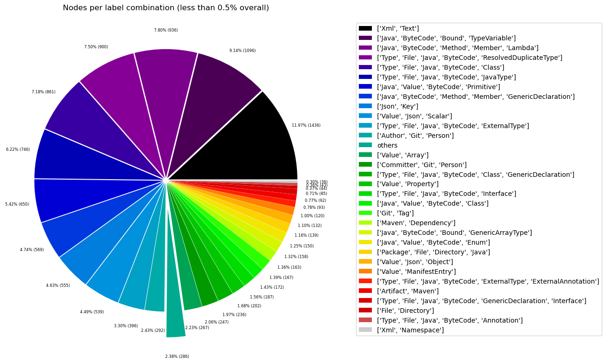
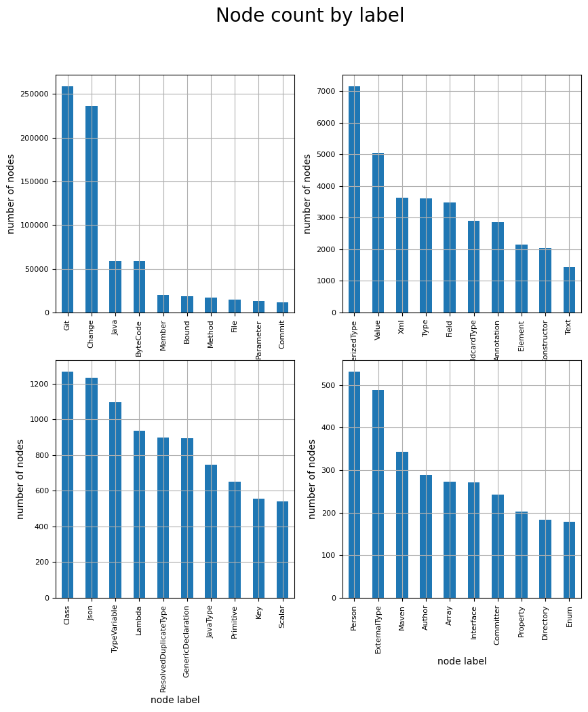
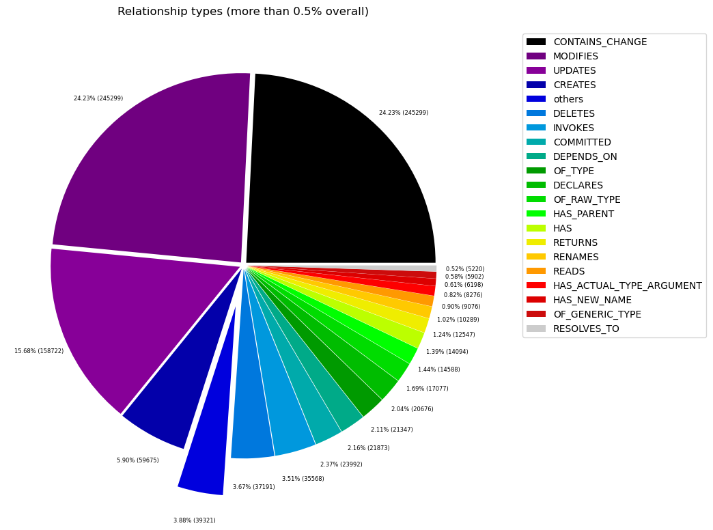
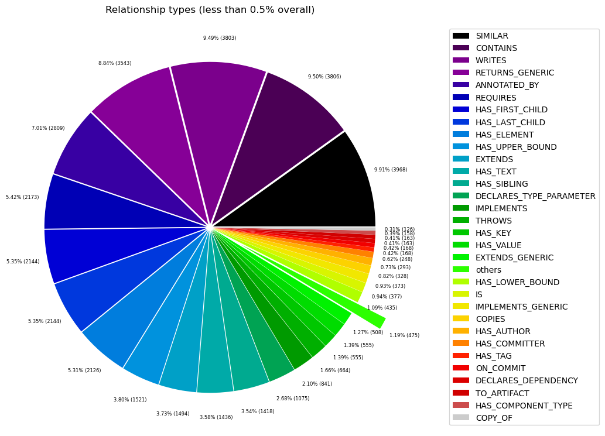

# Overview in General
   

This file contains a general overview of the data in the graph including node labels and relationships types.

### References
- [jqassistant](https://jqassistant.org)
- [Neo4j Python Driver](https://neo4j.com/docs/api/python-driver/current)

## Node Labels

### Table 1a - Highest node count by label combination

Lists the 30 label combinations with the highest number of nodes. The labels with the lowest node count are listed in table 1b.
The total list would sum up to the total number of labels (100%).

The whole table can be found in the CSV report `Node_label_combination_count`.

<table border="1" class="dataframe">
  <thead>
    <tr style="text-align: right;">
      <th></th>
      <th>nodeLabels</th>
      <th>nodesWithThatLabels</th>
      <th>nodesWithThatLabelsPercent</th>
    </tr>
  </thead>
  <tbody>
    <tr>
      <th>0</th>
      <td>[Git, Change]</td>
      <td>245365</td>
      <td>73.477534</td>
    </tr>
    <tr>
      <th>1</th>
      <td>[Java, ByteCode, Method, Member]</td>
      <td>13207</td>
      <td>3.954997</td>
    </tr>
    <tr>
      <th>2</th>
      <td>[Java, ByteCode, Parameter]</td>
      <td>13000</td>
      <td>3.893008</td>
    </tr>
    <tr>
      <th>3</th>
      <td>[Git, Commit]</td>
      <td>12005</td>
      <td>3.595043</td>
    </tr>
    <tr>
      <th>4</th>
      <td>[File, Git]</td>
      <td>10675</td>
      <td>3.196759</td>
    </tr>
    <tr>
      <th>5</th>
      <td>[Java, ByteCode, Bound, ParameterizedType]</td>
      <td>7166</td>
      <td>2.145946</td>
    </tr>
    <tr>
      <th>6</th>
      <td>[Java, ByteCode, Bound]</td>
      <td>7112</td>
      <td>2.129775</td>
    </tr>
    <tr>
      <th>7</th>
      <td>[Java, ByteCode, Member, Field]</td>
      <td>3495</td>
      <td>1.046620</td>
    </tr>
    <tr>
      <th>8</th>
      <td>[Java, ByteCode, Bound, WildcardType]</td>
      <td>2906</td>
      <td>0.870237</td>
    </tr>
    <tr>
      <th>9</th>
      <td>[Java, Value, ByteCode, Annotation]</td>
      <td>2821</td>
      <td>0.844783</td>
    </tr>
    <tr>
      <th>10</th>
      <td>[Xml, Element]</td>
      <td>2144</td>
      <td>0.642047</td>
    </tr>
    <tr>
      <th>11</th>
      <td>[Java, ByteCode, Constructor, Method, Member]</td>
      <td>2041</td>
      <td>0.611202</td>
    </tr>
    <tr>
      <th>12</th>
      <td>[Xml, Text]</td>
      <td>1436</td>
      <td>0.430028</td>
    </tr>
    <tr>
      <th>13</th>
      <td>[Java, ByteCode, Bound, TypeVariable]</td>
      <td>1096</td>
      <td>0.328211</td>
    </tr>
    <tr>
      <th>14</th>
      <td>[Java, ByteCode, Method, Member, Lambda]</td>
      <td>936</td>
      <td>0.280297</td>
    </tr>
    <tr>
      <th>15</th>
      <td>[Type, File, Java, ByteCode, ResolvedDuplicate...</td>
      <td>900</td>
      <td>0.269516</td>
    </tr>
    <tr>
      <th>16</th>
      <td>[Type, File, Java, ByteCode, Class]</td>
      <td>861</td>
      <td>0.257837</td>
    </tr>
    <tr>
      <th>17</th>
      <td>[Type, File, Java, ByteCode, JavaType]</td>
      <td>746</td>
      <td>0.223399</td>
    </tr>
    <tr>
      <th>18</th>
      <td>[Java, Value, ByteCode, Primitive]</td>
      <td>650</td>
      <td>0.194650</td>
    </tr>
    <tr>
      <th>19</th>
      <td>[Java, ByteCode, Method, Member, GenericDeclar...</td>
      <td>569</td>
      <td>0.170394</td>
    </tr>
    <tr>
      <th>20</th>
      <td>[Json, Key]</td>
      <td>555</td>
      <td>0.166202</td>
    </tr>
    <tr>
      <th>21</th>
      <td>[Value, Json, Scalar]</td>
      <td>539</td>
      <td>0.161410</td>
    </tr>
    <tr>
      <th>22</th>
      <td>[Type, File, Java, ByteCode, ExternalType]</td>
      <td>396</td>
      <td>0.118587</td>
    </tr>
    <tr>
      <th>23</th>
      <td>[Author, Git, Person]</td>
      <td>292</td>
      <td>0.087443</td>
    </tr>
    <tr>
      <th>24</th>
      <td>[Value, Array]</td>
      <td>267</td>
      <td>0.079956</td>
    </tr>
    <tr>
      <th>25</th>
      <td>[Committer, Git, Person]</td>
      <td>247</td>
      <td>0.073967</td>
    </tr>
    <tr>
      <th>26</th>
      <td>[Type, File, Java, ByteCode, Class, GenericDec...</td>
      <td>236</td>
      <td>0.070673</td>
    </tr>
    <tr>
      <th>27</th>
      <td>[Value, Property]</td>
      <td>202</td>
      <td>0.060491</td>
    </tr>
    <tr>
      <th>28</th>
      <td>[Type, File, Java, ByteCode, Interface]</td>
      <td>187</td>
      <td>0.055999</td>
    </tr>
    <tr>
      <th>29</th>
      <td>[Java, Value, ByteCode, Class]</td>
      <td>172</td>
      <td>0.051507</td>
    </tr>
  </tbody>
</table>

### Chart 1a - Highest node count by label combination

Values under 0.5% will be grouped into "others" to get a cleaner plot. The group "others" is then broken down in Chart 1b.

    <Figure size 640x480 with 0 Axes>

    

    

### Table 1b - Lowest node count by label combination

Lists the 30 label combinations with the lowest number of nodes until they reach 0.5% of the total node count, which are shown above.

<table border="1" class="dataframe">
  <thead>
    <tr style="text-align: right;">
      <th></th>
      <th>nodeLabels</th>
      <th>nodesWithThatLabels</th>
      <th>nodesWithThatLabelsPercent</th>
    </tr>
  </thead>
  <tbody>
    <tr>
      <th>0</th>
      <td>[Analyze, Task, jQAssistant]</td>
      <td>1</td>
      <td>0.000299</td>
    </tr>
    <tr>
      <th>1</th>
      <td>[File, Json]</td>
      <td>2</td>
      <td>0.000599</td>
    </tr>
    <tr>
      <th>2</th>
      <td>[File]</td>
      <td>3</td>
      <td>0.000898</td>
    </tr>
    <tr>
      <th>3</th>
      <td>[Java, ByteCode, Constructor, Method, Member, ...</td>
      <td>4</td>
      <td>0.001198</td>
    </tr>
    <tr>
      <th>4</th>
      <td>[Maven, Exclusion]</td>
      <td>5</td>
      <td>0.001497</td>
    </tr>
    <tr>
      <th>5</th>
      <td>[Value, Array, Json]</td>
      <td>6</td>
      <td>0.001797</td>
    </tr>
    <tr>
      <th>6</th>
      <td>[File, Maven, Xml, Pom, Document]</td>
      <td>9</td>
      <td>0.002695</td>
    </tr>
    <tr>
      <th>7</th>
      <td>[Type, File, Java, ByteCode, Void]</td>
      <td>9</td>
      <td>0.002695</td>
    </tr>
    <tr>
      <th>8</th>
      <td>[Java, ManifestSection]</td>
      <td>9</td>
      <td>0.002695</td>
    </tr>
    <tr>
      <th>9</th>
      <td>[File, Java, Manifest]</td>
      <td>9</td>
      <td>0.002695</td>
    </tr>
    <tr>
      <th>10</th>
      <td>[Artifact, File, Jar, Archive, Zip, Java]</td>
      <td>9</td>
      <td>0.002695</td>
    </tr>
    <tr>
      <th>11</th>
      <td>[File, Java, ServiceLoader]</td>
      <td>10</td>
      <td>0.002995</td>
    </tr>
    <tr>
      <th>12</th>
      <td>[File, Java, Properties]</td>
      <td>12</td>
      <td>0.003594</td>
    </tr>
    <tr>
      <th>13</th>
      <td>[Maven, ExecutionGoal]</td>
      <td>16</td>
      <td>0.004791</td>
    </tr>
    <tr>
      <th>14</th>
      <td>[Maven, PluginExecution]</td>
      <td>16</td>
      <td>0.004791</td>
    </tr>
    <tr>
      <th>15</th>
      <td>[Xml, Attribute]</td>
      <td>18</td>
      <td>0.005390</td>
    </tr>
    <tr>
      <th>16</th>
      <td>[jQAssistant, Rule, Concept]</td>
      <td>19</td>
      <td>0.005690</td>
    </tr>
    <tr>
      <th>17</th>
      <td>[Maven, Plugin]</td>
      <td>21</td>
      <td>0.006289</td>
    </tr>
    <tr>
      <th>18</th>
      <td>[Maven, Configuration]</td>
      <td>21</td>
      <td>0.006289</td>
    </tr>
    <tr>
      <th>19</th>
      <td>[Type, File, Java, ByteCode, Enum]</td>
      <td>28</td>
      <td>0.008385</td>
    </tr>
    <tr>
      <th>20</th>
      <td>[Type, File, Java, ByteCode, PrimitiveType]</td>
      <td>29</td>
      <td>0.008684</td>
    </tr>
    <tr>
      <th>21</th>
      <td>[Git, Branch]</td>
      <td>30</td>
      <td>0.008984</td>
    </tr>
    <tr>
      <th>22</th>
      <td>[Xml, Namespace]</td>
      <td>36</td>
      <td>0.010781</td>
    </tr>
    <tr>
      <th>23</th>
      <td>[Type, File, Java, ByteCode, Annotation]</td>
      <td>43</td>
      <td>0.012877</td>
    </tr>
    <tr>
      <th>24</th>
      <td>[File, Directory]</td>
      <td>44</td>
      <td>0.013176</td>
    </tr>
    <tr>
      <th>25</th>
      <td>[Type, File, Java, ByteCode, GenericDeclaratio...</td>
      <td>85</td>
      <td>0.025454</td>
    </tr>
    <tr>
      <th>26</th>
      <td>[Artifact, Maven]</td>
      <td>92</td>
      <td>0.027551</td>
    </tr>
    <tr>
      <th>27</th>
      <td>[Type, File, Java, ByteCode, ExternalType, Ext...</td>
      <td>93</td>
      <td>0.027850</td>
    </tr>
    <tr>
      <th>28</th>
      <td>[Value, ManifestEntry]</td>
      <td>120</td>
      <td>0.035935</td>
    </tr>
    <tr>
      <th>29</th>
      <td>[Value, Json, Object]</td>
      <td>132</td>
      <td>0.039529</td>
    </tr>
  </tbody>
</table>

### Chart 1b - Lowest node count by label combination

Shows the lowest (less than 0.5% overall) node count label combinations. Therefore, this plot breaks down the "others" slice of the pie chart above. Values under 0.01% will be grouped into "others" to get a cleaner plot.

    <Figure size 640x480 with 0 Axes>

    

    

### Table 1c - Highest node count by single label

Lists the 40 labels with the highest number of nodes.
Doesn't sum up to the total number of nodes or 100% because one node can have multiple labels.
Helps to identify commonly used labels.

<table border="1" class="dataframe">
  <thead>
    <tr style="text-align: right;">
      <th></th>
      <th>nodeLabel</th>
      <th>nodesWithThatLabel</th>
      <th>nodesWithThatLabelPercent</th>
    </tr>
  </thead>
  <tbody>
    <tr>
      <th>0</th>
      <td>Git</td>
      <td>268781</td>
      <td>80.489740</td>
    </tr>
    <tr>
      <th>1</th>
      <td>Change</td>
      <td>245365</td>
      <td>73.477534</td>
    </tr>
    <tr>
      <th>2</th>
      <td>Java</td>
      <td>59284</td>
      <td>17.753315</td>
    </tr>
    <tr>
      <th>3</th>
      <td>ByteCode</td>
      <td>59096</td>
      <td>17.697016</td>
    </tr>
    <tr>
      <th>4</th>
      <td>Member</td>
      <td>20252</td>
      <td>6.064708</td>
    </tr>
    <tr>
      <th>5</th>
      <td>Bound</td>
      <td>18438</td>
      <td>5.521483</td>
    </tr>
    <tr>
      <th>6</th>
      <td>Method</td>
      <td>16757</td>
      <td>5.018088</td>
    </tr>
    <tr>
      <th>7</th>
      <td>File</td>
      <td>14525</td>
      <td>4.349688</td>
    </tr>
    <tr>
      <th>8</th>
      <td>Parameter</td>
      <td>13000</td>
      <td>3.893008</td>
    </tr>
    <tr>
      <th>9</th>
      <td>Commit</td>
      <td>12005</td>
      <td>3.595043</td>
    </tr>
    <tr>
      <th>10</th>
      <td>ParameterizedType</td>
      <td>7166</td>
      <td>2.145946</td>
    </tr>
    <tr>
      <th>11</th>
      <td>Value</td>
      <td>5059</td>
      <td>1.514979</td>
    </tr>
    <tr>
      <th>12</th>
      <td>Xml</td>
      <td>3643</td>
      <td>1.090941</td>
    </tr>
    <tr>
      <th>13</th>
      <td>Type</td>
      <td>3613</td>
      <td>1.081957</td>
    </tr>
    <tr>
      <th>14</th>
      <td>Field</td>
      <td>3495</td>
      <td>1.046620</td>
    </tr>
    <tr>
      <th>15</th>
      <td>WildcardType</td>
      <td>2906</td>
      <td>0.870237</td>
    </tr>
    <tr>
      <th>16</th>
      <td>Annotation</td>
      <td>2864</td>
      <td>0.857660</td>
    </tr>
    <tr>
      <th>17</th>
      <td>Element</td>
      <td>2144</td>
      <td>0.642047</td>
    </tr>
    <tr>
      <th>18</th>
      <td>Constructor</td>
      <td>2045</td>
      <td>0.612400</td>
    </tr>
    <tr>
      <th>19</th>
      <td>Text</td>
      <td>1436</td>
      <td>0.430028</td>
    </tr>
    <tr>
      <th>20</th>
      <td>Class</td>
      <td>1269</td>
      <td>0.380017</td>
    </tr>
    <tr>
      <th>21</th>
      <td>Json</td>
      <td>1234</td>
      <td>0.369536</td>
    </tr>
    <tr>
      <th>22</th>
      <td>TypeVariable</td>
      <td>1096</td>
      <td>0.328211</td>
    </tr>
    <tr>
      <th>23</th>
      <td>Lambda</td>
      <td>936</td>
      <td>0.280297</td>
    </tr>
    <tr>
      <th>24</th>
      <td>ResolvedDuplicateType</td>
      <td>900</td>
      <td>0.269516</td>
    </tr>
    <tr>
      <th>25</th>
      <td>GenericDeclaration</td>
      <td>894</td>
      <td>0.267719</td>
    </tr>
    <tr>
      <th>26</th>
      <td>JavaType</td>
      <td>746</td>
      <td>0.223399</td>
    </tr>
    <tr>
      <th>27</th>
      <td>Primitive</td>
      <td>650</td>
      <td>0.194650</td>
    </tr>
    <tr>
      <th>28</th>
      <td>Key</td>
      <td>555</td>
      <td>0.166202</td>
    </tr>
    <tr>
      <th>29</th>
      <td>Person</td>
      <td>539</td>
      <td>0.161410</td>
    </tr>
    <tr>
      <th>30</th>
      <td>Scalar</td>
      <td>539</td>
      <td>0.161410</td>
    </tr>
    <tr>
      <th>31</th>
      <td>ExternalType</td>
      <td>489</td>
      <td>0.146437</td>
    </tr>
    <tr>
      <th>32</th>
      <td>Maven</td>
      <td>343</td>
      <td>0.102716</td>
    </tr>
    <tr>
      <th>33</th>
      <td>Author</td>
      <td>292</td>
      <td>0.087443</td>
    </tr>
    <tr>
      <th>34</th>
      <td>Array</td>
      <td>273</td>
      <td>0.081753</td>
    </tr>
    <tr>
      <th>35</th>
      <td>Interface</td>
      <td>272</td>
      <td>0.081454</td>
    </tr>
    <tr>
      <th>36</th>
      <td>Committer</td>
      <td>247</td>
      <td>0.073967</td>
    </tr>
    <tr>
      <th>37</th>
      <td>Property</td>
      <td>202</td>
      <td>0.060491</td>
    </tr>
    <tr>
      <th>38</th>
      <td>Directory</td>
      <td>183</td>
      <td>0.054802</td>
    </tr>
    <tr>
      <th>39</th>
      <td>Enum</td>
      <td>178</td>
      <td>0.053304</td>
    </tr>
  </tbody>
</table>

### Chart 1c - Highest node count by label

Shows the 40 labels with the highest number of nodes.

    <Figure size 640x480 with 0 Axes>

    

    

## Relationship Types

### Table 2a - Highest relationship count by type

Lists the 30 relationship types with the highest number of occurrences.
The whole table can be found in the CSV report `Relationship_type_count`.

    Total number of relationships: 1012493

<table border="1" class="dataframe">
  <thead>
    <tr style="text-align: right;">
      <th></th>
      <th>relationshipType</th>
      <th>nodesWithThatRelationshipType</th>
      <th>nodesWithThatRelationshipTypePercent</th>
    </tr>
  </thead>
  <tbody>
    <tr>
      <th>0</th>
      <td>CONTAINS_CHANGE</td>
      <td>245365</td>
      <td>24.233748</td>
    </tr>
    <tr>
      <th>1</th>
      <td>MODIFIES</td>
      <td>245365</td>
      <td>24.233748</td>
    </tr>
    <tr>
      <th>2</th>
      <td>UPDATES</td>
      <td>158745</td>
      <td>15.678627</td>
    </tr>
    <tr>
      <th>3</th>
      <td>CREATES</td>
      <td>59716</td>
      <td>5.897917</td>
    </tr>
    <tr>
      <th>4</th>
      <td>DELETES</td>
      <td>37193</td>
      <td>3.673408</td>
    </tr>
    <tr>
      <th>5</th>
      <td>INVOKES</td>
      <td>35576</td>
      <td>3.513703</td>
    </tr>
    <tr>
      <th>6</th>
      <td>COMMITTED</td>
      <td>24010</td>
      <td>2.371374</td>
    </tr>
    <tr>
      <th>7</th>
      <td>DEPENDS_ON</td>
      <td>21873</td>
      <td>2.160311</td>
    </tr>
    <tr>
      <th>8</th>
      <td>OF_TYPE</td>
      <td>21347</td>
      <td>2.108360</td>
    </tr>
    <tr>
      <th>9</th>
      <td>DECLARES</td>
      <td>20693</td>
      <td>2.043767</td>
    </tr>
    <tr>
      <th>10</th>
      <td>OF_RAW_TYPE</td>
      <td>17077</td>
      <td>1.686629</td>
    </tr>
    <tr>
      <th>11</th>
      <td>HAS_PARENT</td>
      <td>14598</td>
      <td>1.441788</td>
    </tr>
    <tr>
      <th>12</th>
      <td>HAS</td>
      <td>14094</td>
      <td>1.392010</td>
    </tr>
    <tr>
      <th>13</th>
      <td>RETURNS</td>
      <td>12547</td>
      <td>1.239218</td>
    </tr>
    <tr>
      <th>14</th>
      <td>RENAMES</td>
      <td>10289</td>
      <td>1.016205</td>
    </tr>
    <tr>
      <th>15</th>
      <td>READS</td>
      <td>9078</td>
      <td>0.896599</td>
    </tr>
    <tr>
      <th>16</th>
      <td>HAS_ACTUAL_TYPE_ARGUMENT</td>
      <td>8276</td>
      <td>0.817388</td>
    </tr>
    <tr>
      <th>17</th>
      <td>HAS_NEW_NAME</td>
      <td>6198</td>
      <td>0.612152</td>
    </tr>
    <tr>
      <th>18</th>
      <td>OF_GENERIC_TYPE</td>
      <td>5902</td>
      <td>0.582918</td>
    </tr>
    <tr>
      <th>19</th>
      <td>RESOLVES_TO</td>
      <td>5228</td>
      <td>0.516349</td>
    </tr>
    <tr>
      <th>20</th>
      <td>SIMILAR</td>
      <td>3968</td>
      <td>0.391904</td>
    </tr>
    <tr>
      <th>21</th>
      <td>CONTAINS</td>
      <td>3805</td>
      <td>0.375805</td>
    </tr>
    <tr>
      <th>22</th>
      <td>WRITES</td>
      <td>3803</td>
      <td>0.375608</td>
    </tr>
    <tr>
      <th>23</th>
      <td>RETURNS_GENERIC</td>
      <td>3543</td>
      <td>0.349928</td>
    </tr>
    <tr>
      <th>24</th>
      <td>ANNOTATED_BY</td>
      <td>2809</td>
      <td>0.277434</td>
    </tr>
    <tr>
      <th>25</th>
      <td>REQUIRES</td>
      <td>2173</td>
      <td>0.214619</td>
    </tr>
    <tr>
      <th>26</th>
      <td>HAS_FIRST_CHILD</td>
      <td>2144</td>
      <td>0.211755</td>
    </tr>
    <tr>
      <th>27</th>
      <td>HAS_LAST_CHILD</td>
      <td>2144</td>
      <td>0.211755</td>
    </tr>
    <tr>
      <th>28</th>
      <td>HAS_ELEMENT</td>
      <td>2126</td>
      <td>0.209977</td>
    </tr>
    <tr>
      <th>29</th>
      <td>HAS_UPPER_BOUND</td>
      <td>1521</td>
      <td>0.150223</td>
    </tr>
  </tbody>
</table>

### Chart 2a - Highest relationship count by type

Values under 0.5% will be grouped into "others" to get a cleaner plot. The group "others" is then broken down in the second chart.

    <Figure size 640x480 with 0 Axes>

    

    

### Table 2b - Lowest relationship count by type

Lists the 30 relationships type with the lowest number of occurrences up to 0.5% of the total node count. This is essentially breaking down the "others" slice from the chart above.

<table border="1" class="dataframe">
  <thead>
    <tr style="text-align: right;">
      <th></th>
      <th>relationshipType</th>
      <th>nodesWithThatRelationshipType</th>
      <th>nodesWithThatRelationshipTypePercent</th>
    </tr>
  </thead>
  <tbody>
    <tr>
      <th>0</th>
      <td>HAS_PROPERTY</td>
      <td>1</td>
      <td>0.000099</td>
    </tr>
    <tr>
      <th>1</th>
      <td>THROWS_GENERIC</td>
      <td>5</td>
      <td>0.000494</td>
    </tr>
    <tr>
      <th>2</th>
      <td>EXCLUDES</td>
      <td>5</td>
      <td>0.000494</td>
    </tr>
    <tr>
      <th>3</th>
      <td>DESCRIBES</td>
      <td>9</td>
      <td>0.000889</td>
    </tr>
    <tr>
      <th>4</th>
      <td>HAS_ROOT_ELEMENT</td>
      <td>10</td>
      <td>0.000988</td>
    </tr>
    <tr>
      <th>5</th>
      <td>HAS_GOAL</td>
      <td>16</td>
      <td>0.001580</td>
    </tr>
    <tr>
      <th>6</th>
      <td>HAS_EXECUTION</td>
      <td>16</td>
      <td>0.001580</td>
    </tr>
    <tr>
      <th>7</th>
      <td>OF_NAMESPACE</td>
      <td>18</td>
      <td>0.001778</td>
    </tr>
    <tr>
      <th>8</th>
      <td>HAS_ATTRIBUTE</td>
      <td>18</td>
      <td>0.001778</td>
    </tr>
    <tr>
      <th>9</th>
      <td>INCLUDES_CONCEPT</td>
      <td>19</td>
      <td>0.001877</td>
    </tr>
    <tr>
      <th>10</th>
      <td>USES_PLUGIN</td>
      <td>21</td>
      <td>0.002074</td>
    </tr>
    <tr>
      <th>11</th>
      <td>REQUIRES_TYPE_PARAMETER</td>
      <td>21</td>
      <td>0.002074</td>
    </tr>
    <tr>
      <th>12</th>
      <td>IS_ARTIFACT</td>
      <td>21</td>
      <td>0.002074</td>
    </tr>
    <tr>
      <th>13</th>
      <td>HAS_CONFIGURATION</td>
      <td>21</td>
      <td>0.002074</td>
    </tr>
    <tr>
      <th>14</th>
      <td>REQUIRES_CONCEPT</td>
      <td>28</td>
      <td>0.002765</td>
    </tr>
    <tr>
      <th>15</th>
      <td>HAS_HEAD</td>
      <td>30</td>
      <td>0.002963</td>
    </tr>
    <tr>
      <th>16</th>
      <td>DECLARES_NAMESPACE</td>
      <td>36</td>
      <td>0.003556</td>
    </tr>
    <tr>
      <th>17</th>
      <td>HAS_DEFAULT</td>
      <td>36</td>
      <td>0.003556</td>
    </tr>
    <tr>
      <th>18</th>
      <td>CONTAINS_VALUE</td>
      <td>120</td>
      <td>0.011852</td>
    </tr>
    <tr>
      <th>19</th>
      <td>COPY_OF</td>
      <td>126</td>
      <td>0.012445</td>
    </tr>
    <tr>
      <th>20</th>
      <td>HAS_COMPONENT_TYPE</td>
      <td>158</td>
      <td>0.015605</td>
    </tr>
    <tr>
      <th>21</th>
      <td>TO_ARTIFACT</td>
      <td>163</td>
      <td>0.016099</td>
    </tr>
    <tr>
      <th>22</th>
      <td>DECLARES_DEPENDENCY</td>
      <td>163</td>
      <td>0.016099</td>
    </tr>
    <tr>
      <th>23</th>
      <td>ON_COMMIT</td>
      <td>167</td>
      <td>0.016494</td>
    </tr>
    <tr>
      <th>24</th>
      <td>COPIES</td>
      <td>328</td>
      <td>0.032395</td>
    </tr>
    <tr>
      <th>25</th>
      <td>IMPLEMENTS_GENERIC</td>
      <td>373</td>
      <td>0.036840</td>
    </tr>
    <tr>
      <th>26</th>
      <td>IS</td>
      <td>377</td>
      <td>0.037235</td>
    </tr>
    <tr>
      <th>27</th>
      <td>HAS_LOWER_BOUND</td>
      <td>435</td>
      <td>0.042963</td>
    </tr>
    <tr>
      <th>28</th>
      <td>EXTENDS_GENERIC</td>
      <td>508</td>
      <td>0.050173</td>
    </tr>
    <tr>
      <th>29</th>
      <td>HAS_VALUE</td>
      <td>555</td>
      <td>0.054815</td>
    </tr>
  </tbody>
</table>

### Chart 2b - Lowest relationship count by type

Shows the lowest (less than 0.5% overall) relationship types. This plot breaks down the "others" slice of the pie chart above. Values under 0.01% will be grouped into "others" to get a cleaner plot.

    <Figure size 640x480 with 0 Axes>

    

    

## Node labels with their relationships

### Table 3a - Highest relationship count by node labels and relationship type

Lists the 30 node labels and their relationship types with the highest number of occurrences.

<table border="1" class="dataframe">
  <thead>
    <tr style="text-align: right;">
      <th></th>
      <th>sourceLabels</th>
      <th>relationType</th>
      <th>targetLabels</th>
      <th>numberOfRelationships</th>
      <th>numberOfNodesWithSameLabelsAsSource</th>
      <th>numberOfNodesWithSameLabelsAsTarget</th>
      <th>densityInPercent</th>
    </tr>
  </thead>
  <tbody>
    <tr>
      <th>0</th>
      <td>[Git, Commit]</td>
      <td>CONTAINS_CHANGE</td>
      <td>[Git, Change]</td>
      <td>245365</td>
      <td>12005</td>
      <td>245365</td>
      <td>0.008330</td>
    </tr>
    <tr>
      <th>1</th>
      <td>[Git, Change]</td>
      <td>MODIFIES</td>
      <td>[File, Git]</td>
      <td>245365</td>
      <td>245365</td>
      <td>10675</td>
      <td>0.009368</td>
    </tr>
    <tr>
      <th>2</th>
      <td>[Git, Change]</td>
      <td>UPDATES</td>
      <td>[File, Git]</td>
      <td>158745</td>
      <td>245365</td>
      <td>10675</td>
      <td>0.006061</td>
    </tr>
    <tr>
      <th>3</th>
      <td>[Git, Change]</td>
      <td>CREATES</td>
      <td>[File, Git]</td>
      <td>59716</td>
      <td>245365</td>
      <td>10675</td>
      <td>0.002280</td>
    </tr>
    <tr>
      <th>4</th>
      <td>[Git, Change]</td>
      <td>DELETES</td>
      <td>[File, Git]</td>
      <td>37193</td>
      <td>245365</td>
      <td>10675</td>
      <td>0.001420</td>
    </tr>
    <tr>
      <th>5</th>
      <td>[Java, ByteCode, Method, Member]</td>
      <td>INVOKES</td>
      <td>[Java, ByteCode, Method, Member]</td>
      <td>21523</td>
      <td>13083</td>
      <td>13083</td>
      <td>0.012574</td>
    </tr>
    <tr>
      <th>6</th>
      <td>[Git, Commit]</td>
      <td>HAS_PARENT</td>
      <td>[Git, Commit]</td>
      <td>14589</td>
      <td>12005</td>
      <td>12005</td>
      <td>0.010123</td>
    </tr>
    <tr>
      <th>7</th>
      <td>[Author, Git, Person]</td>
      <td>COMMITTED</td>
      <td>[Git, Commit]</td>
      <td>12005</td>
      <td>292</td>
      <td>12005</td>
      <td>0.342466</td>
    </tr>
    <tr>
      <th>8</th>
      <td>[Committer, Git, Person]</td>
      <td>COMMITTED</td>
      <td>[Git, Commit]</td>
      <td>12005</td>
      <td>247</td>
      <td>12005</td>
      <td>0.404858</td>
    </tr>
    <tr>
      <th>9</th>
      <td>[Git, Change]</td>
      <td>RENAMES</td>
      <td>[File, Git]</td>
      <td>10289</td>
      <td>245365</td>
      <td>10675</td>
      <td>0.000393</td>
    </tr>
    <tr>
      <th>10</th>
      <td>[Java, ByteCode, Method, Member]</td>
      <td>HAS</td>
      <td>[Java, ByteCode, Parameter]</td>
      <td>8297</td>
      <td>13083</td>
      <td>13000</td>
      <td>0.004878</td>
    </tr>
    <tr>
      <th>11</th>
      <td>[Java, ByteCode, Method, Member]</td>
      <td>READS</td>
      <td>[Java, ByteCode, Member, Field]</td>
      <td>8100</td>
      <td>13083</td>
      <td>3495</td>
      <td>0.017715</td>
    </tr>
    <tr>
      <th>12</th>
      <td>[Java, ByteCode, Parameter]</td>
      <td>OF_TYPE</td>
      <td>[Type, File, Java, ByteCode, JavaType]</td>
      <td>6360</td>
      <td>13000</td>
      <td>746</td>
      <td>0.065581</td>
    </tr>
    <tr>
      <th>13</th>
      <td>[File, Git]</td>
      <td>HAS_NEW_NAME</td>
      <td>[File, Git]</td>
      <td>6198</td>
      <td>10675</td>
      <td>10675</td>
      <td>0.005439</td>
    </tr>
    <tr>
      <th>14</th>
      <td>[Java, ByteCode, Bound]</td>
      <td>OF_RAW_TYPE</td>
      <td>[Type, File, Java, ByteCode, JavaType]</td>
      <td>3569</td>
      <td>7112</td>
      <td>746</td>
      <td>0.067269</td>
    </tr>
    <tr>
      <th>15</th>
      <td>[Java, ByteCode, Bound, ParameterizedType]</td>
      <td>OF_RAW_TYPE</td>
      <td>[Type, File, Java, ByteCode, JavaType]</td>
      <td>3043</td>
      <td>7166</td>
      <td>746</td>
      <td>0.056923</td>
    </tr>
    <tr>
      <th>16</th>
      <td>[Java, ByteCode, Bound, ParameterizedType]</td>
      <td>HAS_ACTUAL_TYPE_ARGUMENT</td>
      <td>[Java, ByteCode, Bound, WildcardType]</td>
      <td>2906</td>
      <td>7166</td>
      <td>2906</td>
      <td>0.013955</td>
    </tr>
    <tr>
      <th>17</th>
      <td>[Java, ByteCode, Parameter]</td>
      <td>OF_GENERIC_TYPE</td>
      <td>[Java, ByteCode, Bound, ParameterizedType]</td>
      <td>2655</td>
      <td>13000</td>
      <td>7166</td>
      <td>0.002850</td>
    </tr>
    <tr>
      <th>18</th>
      <td>[Java, ByteCode, Bound, ParameterizedType]</td>
      <td>HAS_ACTUAL_TYPE_ARGUMENT</td>
      <td>[Java, ByteCode, Bound, TypeVariable]</td>
      <td>2454</td>
      <td>7166</td>
      <td>1096</td>
      <td>0.031245</td>
    </tr>
    <tr>
      <th>19</th>
      <td>[Java, ByteCode, Constructor, Method, Member]</td>
      <td>WRITES</td>
      <td>[Java, ByteCode, Member, Field]</td>
      <td>2426</td>
      <td>2041</td>
      <td>3495</td>
      <td>0.034010</td>
    </tr>
    <tr>
      <th>20</th>
      <td>[Java, Value, ByteCode, Annotation]</td>
      <td>OF_TYPE</td>
      <td>[Type, File, Java, ByteCode, ExternalType, Ext...</td>
      <td>2340</td>
      <td>2821</td>
      <td>93</td>
      <td>0.891928</td>
    </tr>
    <tr>
      <th>21</th>
      <td>[Xml, Element]</td>
      <td>HAS_ELEMENT</td>
      <td>[Xml, Element]</td>
      <td>2126</td>
      <td>2144</td>
      <td>2144</td>
      <td>0.046250</td>
    </tr>
    <tr>
      <th>22</th>
      <td>[Java, ByteCode, Constructor, Method, Member]</td>
      <td>INVOKES</td>
      <td>[Java, ByteCode, Constructor, Method, Member]</td>
      <td>2111</td>
      <td>2041</td>
      <td>2041</td>
      <td>0.050676</td>
    </tr>
    <tr>
      <th>23</th>
      <td>[Java, ByteCode, Method, Member]</td>
      <td>RETURNS</td>
      <td>[Type, File, Java, ByteCode, JavaType]</td>
      <td>2088</td>
      <td>13083</td>
      <td>746</td>
      <td>0.021394</td>
    </tr>
    <tr>
      <th>24</th>
      <td>[Java, ByteCode, Constructor, Method, Member]</td>
      <td>HAS</td>
      <td>[Java, ByteCode, Parameter]</td>
      <td>2023</td>
      <td>2041</td>
      <td>13000</td>
      <td>0.007624</td>
    </tr>
    <tr>
      <th>25</th>
      <td>[Java, ByteCode, Parameter]</td>
      <td>OF_GENERIC_TYPE</td>
      <td>[Java, ByteCode, Bound]</td>
      <td>2023</td>
      <td>13000</td>
      <td>7112</td>
      <td>0.002188</td>
    </tr>
    <tr>
      <th>26</th>
      <td>[Java, ByteCode, Method, Member]</td>
      <td>INVOKES</td>
      <td>[Java, ByteCode, Constructor, Method, Member]</td>
      <td>2007</td>
      <td>13083</td>
      <td>2041</td>
      <td>0.007516</td>
    </tr>
    <tr>
      <th>27</th>
      <td>[Java, ByteCode, Method, Member, Lambda]</td>
      <td>INVOKES</td>
      <td>[Java, ByteCode, Method, Member]</td>
      <td>1883</td>
      <td>936</td>
      <td>13083</td>
      <td>0.015377</td>
    </tr>
    <tr>
      <th>28</th>
      <td>[Java, ByteCode, Bound, ParameterizedType]</td>
      <td>HAS_ACTUAL_TYPE_ARGUMENT</td>
      <td>[Java, ByteCode, Bound]</td>
      <td>1802</td>
      <td>7166</td>
      <td>7112</td>
      <td>0.003536</td>
    </tr>
    <tr>
      <th>29</th>
      <td>[Java, ByteCode, Constructor, Method, Member]</td>
      <td>INVOKES</td>
      <td>[Java, ByteCode, Method, Member]</td>
      <td>1796</td>
      <td>2041</td>
      <td>13083</td>
      <td>0.006726</td>
    </tr>
  </tbody>
</table>

## Graph Density

    total_number_of_nodes (vertices): 333932
    total_number_of_relationships (edges): 1012493
    -> total directed graph density: 9.079820285902377e-06
    -> total directed graph density in percent: 0.0009079820285902377

