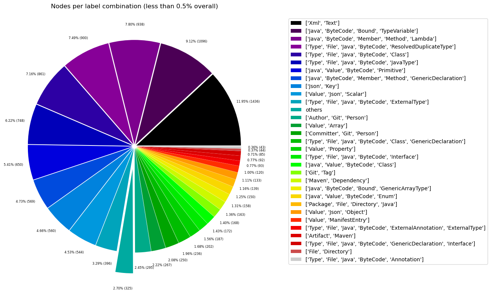
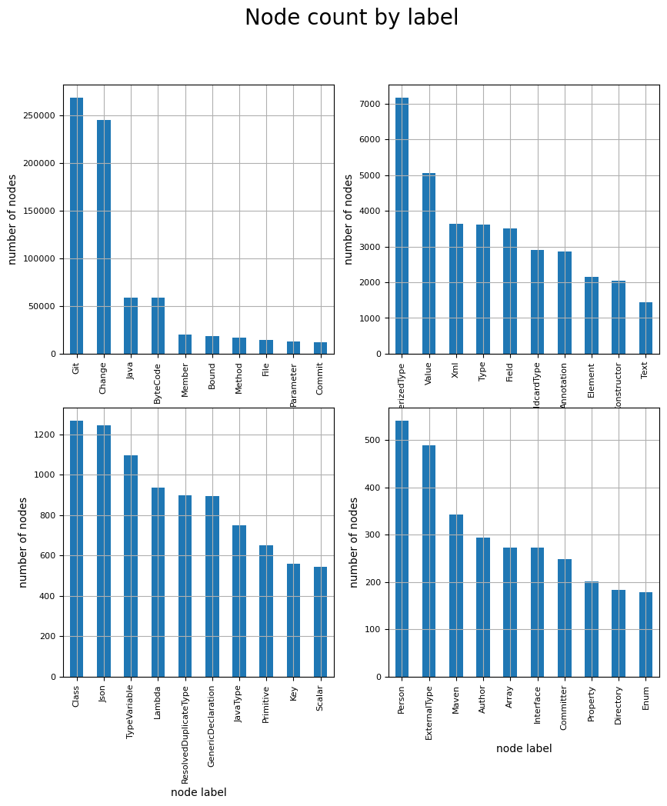
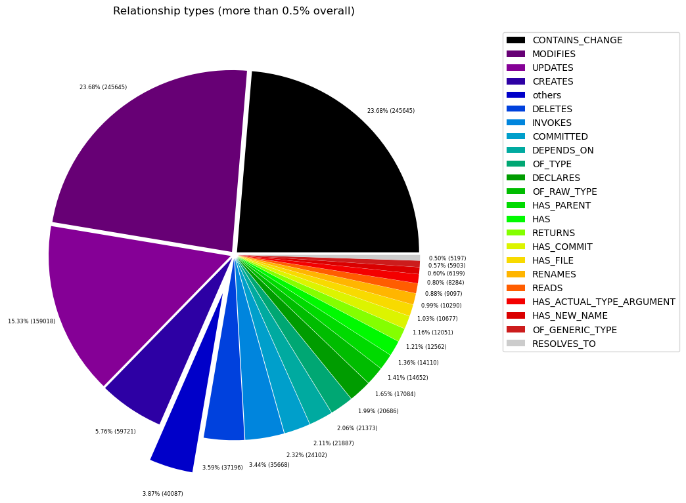
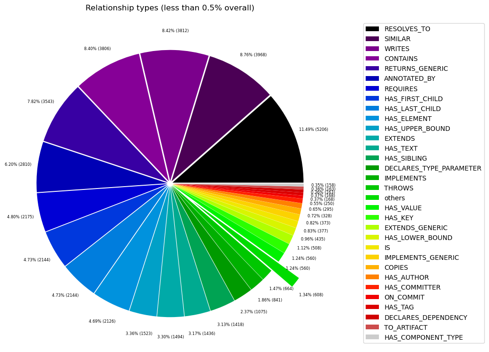

# Overview in General
   

This file contains a general overview of the data in the graph including node labels and relationships types.

### References
- [jqassistant](https://jqassistant.org)
- [Neo4j Python Driver](https://neo4j.com/docs/api/python-driver/current)

## Node Labels

### Table 1a - Highest node count by label combination

Lists the 30 label combinations with the highest number of nodes. The labels with the lowest node count are listed in table 1b.
The total list would sum up to the total number of labels (100%).

The whole table can be found in the CSV report `Node_label_combination_count`.

<table border="1" class="dataframe">
  <thead>
    <tr style="text-align: right;">
      <th></th>
      <th>nodeLabels</th>
      <th>nodesWithThatLabels</th>
      <th>nodesWithThatLabelsPercent</th>
    </tr>
  </thead>
  <tbody>
    <tr>
      <th>0</th>
      <td>[Git, Change]</td>
      <td>245645</td>
      <td>73.481506</td>
    </tr>
    <tr>
      <th>1</th>
      <td>[Java, ByteCode, Member, Method]</td>
      <td>13191</td>
      <td>3.945916</td>
    </tr>
    <tr>
      <th>2</th>
      <td>[Java, ByteCode, Parameter]</td>
      <td>13016</td>
      <td>3.893567</td>
    </tr>
    <tr>
      <th>3</th>
      <td>[Git, Commit]</td>
      <td>12051</td>
      <td>3.604900</td>
    </tr>
    <tr>
      <th>4</th>
      <td>[File, Git]</td>
      <td>10677</td>
      <td>3.193886</td>
    </tr>
    <tr>
      <th>5</th>
      <td>[Java, ByteCode, ParameterizedType, Bound]</td>
      <td>7172</td>
      <td>2.145410</td>
    </tr>
    <tr>
      <th>6</th>
      <td>[Java, ByteCode, Bound]</td>
      <td>7113</td>
      <td>2.127761</td>
    </tr>
    <tr>
      <th>7</th>
      <td>[Java, ByteCode, Member, Field]</td>
      <td>3503</td>
      <td>1.047877</td>
    </tr>
    <tr>
      <th>8</th>
      <td>[Java, ByteCode, Bound, WildcardType]</td>
      <td>2908</td>
      <td>0.869890</td>
    </tr>
    <tr>
      <th>9</th>
      <td>[Java, Value, ByteCode, Annotation]</td>
      <td>2822</td>
      <td>0.844165</td>
    </tr>
    <tr>
      <th>10</th>
      <td>[Xml, Element]</td>
      <td>2144</td>
      <td>0.641350</td>
    </tr>
    <tr>
      <th>11</th>
      <td>[Java, ByteCode, Member, Constructor, Method]</td>
      <td>2040</td>
      <td>0.610239</td>
    </tr>
    <tr>
      <th>12</th>
      <td>[Xml, Text]</td>
      <td>1436</td>
      <td>0.429561</td>
    </tr>
    <tr>
      <th>13</th>
      <td>[Java, ByteCode, Bound, TypeVariable]</td>
      <td>1096</td>
      <td>0.327854</td>
    </tr>
    <tr>
      <th>14</th>
      <td>[Java, ByteCode, Member, Method, Lambda]</td>
      <td>938</td>
      <td>0.280590</td>
    </tr>
    <tr>
      <th>15</th>
      <td>[Type, File, Java, ByteCode, ResolvedDuplicate...</td>
      <td>900</td>
      <td>0.269223</td>
    </tr>
    <tr>
      <th>16</th>
      <td>[Type, File, Java, ByteCode, Class]</td>
      <td>861</td>
      <td>0.257557</td>
    </tr>
    <tr>
      <th>17</th>
      <td>[Type, File, Java, ByteCode, JavaType]</td>
      <td>748</td>
      <td>0.223754</td>
    </tr>
    <tr>
      <th>18</th>
      <td>[Java, Value, ByteCode, Primitive]</td>
      <td>650</td>
      <td>0.194439</td>
    </tr>
    <tr>
      <th>19</th>
      <td>[Java, ByteCode, Member, Method, GenericDeclar...</td>
      <td>569</td>
      <td>0.170209</td>
    </tr>
    <tr>
      <th>20</th>
      <td>[Json, Key]</td>
      <td>560</td>
      <td>0.167517</td>
    </tr>
    <tr>
      <th>21</th>
      <td>[Value, Json, Scalar]</td>
      <td>544</td>
      <td>0.162731</td>
    </tr>
    <tr>
      <th>22</th>
      <td>[Type, File, Java, ByteCode, ExternalType]</td>
      <td>396</td>
      <td>0.118458</td>
    </tr>
    <tr>
      <th>23</th>
      <td>[Author, Git, Person]</td>
      <td>293</td>
      <td>0.087647</td>
    </tr>
    <tr>
      <th>24</th>
      <td>[Value, Array]</td>
      <td>267</td>
      <td>0.079870</td>
    </tr>
    <tr>
      <th>25</th>
      <td>[Committer, Git, Person]</td>
      <td>248</td>
      <td>0.074186</td>
    </tr>
    <tr>
      <th>26</th>
      <td>[Type, File, Java, ByteCode, Class, GenericDec...</td>
      <td>236</td>
      <td>0.070596</td>
    </tr>
    <tr>
      <th>27</th>
      <td>[Value, Property]</td>
      <td>202</td>
      <td>0.060426</td>
    </tr>
    <tr>
      <th>28</th>
      <td>[Type, File, Java, ByteCode, Interface]</td>
      <td>187</td>
      <td>0.055939</td>
    </tr>
    <tr>
      <th>29</th>
      <td>[Java, Value, ByteCode, Class]</td>
      <td>172</td>
      <td>0.051452</td>
    </tr>
  </tbody>
</table>

### Chart 1a - Highest node count by label combination

Values under 0.5% will be grouped into "others" to get a cleaner plot. The group "others" is then broken down in Chart 1b.

    <Figure size 640x480 with 0 Axes>

    

    

### Table 1b - Lowest node count by label combination

Lists the 30 label combinations with the lowest number of nodes until they reach 0.5% of the total node count, which are shown above.

<table border="1" class="dataframe">
  <thead>
    <tr style="text-align: right;">
      <th></th>
      <th>nodeLabels</th>
      <th>nodesWithThatLabels</th>
      <th>nodesWithThatLabelsPercent</th>
    </tr>
  </thead>
  <tbody>
    <tr>
      <th>0</th>
      <td>[Analyze, Task, jQAssistant]</td>
      <td>1</td>
      <td>0.000299</td>
    </tr>
    <tr>
      <th>1</th>
      <td>[Repository, File, Git]</td>
      <td>1</td>
      <td>0.000299</td>
    </tr>
    <tr>
      <th>2</th>
      <td>[File, Json]</td>
      <td>2</td>
      <td>0.000598</td>
    </tr>
    <tr>
      <th>3</th>
      <td>[File]</td>
      <td>3</td>
      <td>0.000897</td>
    </tr>
    <tr>
      <th>4</th>
      <td>[Java, ByteCode, Member, Constructor, Method, ...</td>
      <td>4</td>
      <td>0.001197</td>
    </tr>
    <tr>
      <th>5</th>
      <td>[Maven, Exclusion]</td>
      <td>5</td>
      <td>0.001496</td>
    </tr>
    <tr>
      <th>6</th>
      <td>[Value, Json, Array]</td>
      <td>6</td>
      <td>0.001795</td>
    </tr>
    <tr>
      <th>7</th>
      <td>[File, Maven, Xml, Pom, Document]</td>
      <td>9</td>
      <td>0.002692</td>
    </tr>
    <tr>
      <th>8</th>
      <td>[Type, File, Java, ByteCode, Void]</td>
      <td>9</td>
      <td>0.002692</td>
    </tr>
    <tr>
      <th>9</th>
      <td>[Java, ManifestSection]</td>
      <td>9</td>
      <td>0.002692</td>
    </tr>
    <tr>
      <th>10</th>
      <td>[File, Java, Manifest]</td>
      <td>9</td>
      <td>0.002692</td>
    </tr>
    <tr>
      <th>11</th>
      <td>[Artifact, File, Jar, Archive, Zip, Java]</td>
      <td>9</td>
      <td>0.002692</td>
    </tr>
    <tr>
      <th>12</th>
      <td>[File, Java, ServiceLoader]</td>
      <td>10</td>
      <td>0.002991</td>
    </tr>
    <tr>
      <th>13</th>
      <td>[File, Java, Properties]</td>
      <td>12</td>
      <td>0.003590</td>
    </tr>
    <tr>
      <th>14</th>
      <td>[Maven, ExecutionGoal]</td>
      <td>16</td>
      <td>0.004786</td>
    </tr>
    <tr>
      <th>15</th>
      <td>[Maven, PluginExecution]</td>
      <td>16</td>
      <td>0.004786</td>
    </tr>
    <tr>
      <th>16</th>
      <td>[Xml, Attribute]</td>
      <td>18</td>
      <td>0.005384</td>
    </tr>
    <tr>
      <th>17</th>
      <td>[jQAssistant, Rule, Concept]</td>
      <td>19</td>
      <td>0.005684</td>
    </tr>
    <tr>
      <th>18</th>
      <td>[Maven, Plugin]</td>
      <td>21</td>
      <td>0.006282</td>
    </tr>
    <tr>
      <th>19</th>
      <td>[Maven, Configuration]</td>
      <td>21</td>
      <td>0.006282</td>
    </tr>
    <tr>
      <th>20</th>
      <td>[Type, File, Java, ByteCode, Enum]</td>
      <td>28</td>
      <td>0.008376</td>
    </tr>
    <tr>
      <th>21</th>
      <td>[Git, Branch]</td>
      <td>29</td>
      <td>0.008675</td>
    </tr>
    <tr>
      <th>22</th>
      <td>[Type, File, Java, ByteCode, PrimitiveType]</td>
      <td>29</td>
      <td>0.008675</td>
    </tr>
    <tr>
      <th>23</th>
      <td>[Xml, Namespace]</td>
      <td>36</td>
      <td>0.010769</td>
    </tr>
    <tr>
      <th>24</th>
      <td>[Type, File, Java, ByteCode, Annotation]</td>
      <td>43</td>
      <td>0.012863</td>
    </tr>
    <tr>
      <th>25</th>
      <td>[File, Directory]</td>
      <td>44</td>
      <td>0.013162</td>
    </tr>
    <tr>
      <th>26</th>
      <td>[Type, File, Java, ByteCode, GenericDeclaratio...</td>
      <td>85</td>
      <td>0.025427</td>
    </tr>
    <tr>
      <th>27</th>
      <td>[Artifact, Maven]</td>
      <td>92</td>
      <td>0.027521</td>
    </tr>
    <tr>
      <th>28</th>
      <td>[Type, File, Java, ByteCode, ExternalAnnotatio...</td>
      <td>93</td>
      <td>0.027820</td>
    </tr>
    <tr>
      <th>29</th>
      <td>[Value, ManifestEntry]</td>
      <td>120</td>
      <td>0.035896</td>
    </tr>
  </tbody>
</table>

### Chart 1b - Lowest node count by label combination

Shows the lowest (less than 0.5% overall) node count label combinations. Therefore, this plot breaks down the "others" slice of the pie chart above. Values under 0.01% will be grouped into "others" to get a cleaner plot.

    <Figure size 640x480 with 0 Axes>

    

    

### Table 1c - Highest node count by single label

Lists the 40 labels with the highest number of nodes.
Doesn't sum up to the total number of nodes or 100% because one node can have multiple labels.
Helps to identify commonly used labels.

<table border="1" class="dataframe">
  <thead>
    <tr style="text-align: right;">
      <th></th>
      <th>nodeLabel</th>
      <th>nodesWithThatLabel</th>
      <th>nodesWithThatLabelPercent</th>
    </tr>
  </thead>
  <tbody>
    <tr>
      <th>0</th>
      <td>Git</td>
      <td>269112</td>
      <td>80.501354</td>
    </tr>
    <tr>
      <th>1</th>
      <td>Change</td>
      <td>245645</td>
      <td>73.481506</td>
    </tr>
    <tr>
      <th>2</th>
      <td>Java</td>
      <td>59305</td>
      <td>17.740319</td>
    </tr>
    <tr>
      <th>3</th>
      <td>ByteCode</td>
      <td>59117</td>
      <td>17.684081</td>
    </tr>
    <tr>
      <th>4</th>
      <td>Member</td>
      <td>20245</td>
      <td>6.056028</td>
    </tr>
    <tr>
      <th>5</th>
      <td>Bound</td>
      <td>18447</td>
      <td>5.518180</td>
    </tr>
    <tr>
      <th>6</th>
      <td>Method</td>
      <td>16742</td>
      <td>5.008151</td>
    </tr>
    <tr>
      <th>7</th>
      <td>File</td>
      <td>14530</td>
      <td>4.346460</td>
    </tr>
    <tr>
      <th>8</th>
      <td>Parameter</td>
      <td>13016</td>
      <td>3.893567</td>
    </tr>
    <tr>
      <th>9</th>
      <td>Commit</td>
      <td>12051</td>
      <td>3.604900</td>
    </tr>
    <tr>
      <th>10</th>
      <td>ParameterizedType</td>
      <td>7172</td>
      <td>2.145410</td>
    </tr>
    <tr>
      <th>11</th>
      <td>Value</td>
      <td>5066</td>
      <td>1.515428</td>
    </tr>
    <tr>
      <th>12</th>
      <td>Xml</td>
      <td>3643</td>
      <td>1.089756</td>
    </tr>
    <tr>
      <th>13</th>
      <td>Type</td>
      <td>3615</td>
      <td>1.081380</td>
    </tr>
    <tr>
      <th>14</th>
      <td>Field</td>
      <td>3503</td>
      <td>1.047877</td>
    </tr>
    <tr>
      <th>15</th>
      <td>WildcardType</td>
      <td>2908</td>
      <td>0.869890</td>
    </tr>
    <tr>
      <th>16</th>
      <td>Annotation</td>
      <td>2865</td>
      <td>0.857027</td>
    </tr>
    <tr>
      <th>17</th>
      <td>Element</td>
      <td>2144</td>
      <td>0.641350</td>
    </tr>
    <tr>
      <th>18</th>
      <td>Constructor</td>
      <td>2044</td>
      <td>0.611436</td>
    </tr>
    <tr>
      <th>19</th>
      <td>Text</td>
      <td>1436</td>
      <td>0.429561</td>
    </tr>
    <tr>
      <th>20</th>
      <td>Class</td>
      <td>1269</td>
      <td>0.379605</td>
    </tr>
    <tr>
      <th>21</th>
      <td>Json</td>
      <td>1245</td>
      <td>0.372426</td>
    </tr>
    <tr>
      <th>22</th>
      <td>TypeVariable</td>
      <td>1096</td>
      <td>0.327854</td>
    </tr>
    <tr>
      <th>23</th>
      <td>Lambda</td>
      <td>938</td>
      <td>0.280590</td>
    </tr>
    <tr>
      <th>24</th>
      <td>ResolvedDuplicateType</td>
      <td>900</td>
      <td>0.269223</td>
    </tr>
    <tr>
      <th>25</th>
      <td>GenericDeclaration</td>
      <td>894</td>
      <td>0.267428</td>
    </tr>
    <tr>
      <th>26</th>
      <td>JavaType</td>
      <td>748</td>
      <td>0.223754</td>
    </tr>
    <tr>
      <th>27</th>
      <td>Primitive</td>
      <td>650</td>
      <td>0.194439</td>
    </tr>
    <tr>
      <th>28</th>
      <td>Key</td>
      <td>560</td>
      <td>0.167517</td>
    </tr>
    <tr>
      <th>29</th>
      <td>Scalar</td>
      <td>544</td>
      <td>0.162731</td>
    </tr>
    <tr>
      <th>30</th>
      <td>Person</td>
      <td>541</td>
      <td>0.161833</td>
    </tr>
    <tr>
      <th>31</th>
      <td>ExternalType</td>
      <td>489</td>
      <td>0.146278</td>
    </tr>
    <tr>
      <th>32</th>
      <td>Maven</td>
      <td>343</td>
      <td>0.102604</td>
    </tr>
    <tr>
      <th>33</th>
      <td>Author</td>
      <td>293</td>
      <td>0.087647</td>
    </tr>
    <tr>
      <th>34</th>
      <td>Array</td>
      <td>273</td>
      <td>0.081664</td>
    </tr>
    <tr>
      <th>35</th>
      <td>Interface</td>
      <td>272</td>
      <td>0.081365</td>
    </tr>
    <tr>
      <th>36</th>
      <td>Committer</td>
      <td>248</td>
      <td>0.074186</td>
    </tr>
    <tr>
      <th>37</th>
      <td>Property</td>
      <td>202</td>
      <td>0.060426</td>
    </tr>
    <tr>
      <th>38</th>
      <td>Directory</td>
      <td>183</td>
      <td>0.054742</td>
    </tr>
    <tr>
      <th>39</th>
      <td>Enum</td>
      <td>178</td>
      <td>0.053246</td>
    </tr>
  </tbody>
</table>

### Chart 1c - Highest node count by label

Shows the 40 labels with the highest number of nodes.

    <Figure size 640x480 with 0 Axes>

    

    

## Relationship Types

### Table 2a - Highest relationship count by type

Lists the 30 relationship types with the highest number of occurrences.
The whole table can be found in the CSV report `Relationship_type_count`.

    Total number of relationships: 1037134

<table border="1" class="dataframe">
  <thead>
    <tr style="text-align: right;">
      <th></th>
      <th>relationshipType</th>
      <th>nodesWithThatRelationshipType</th>
      <th>nodesWithThatRelationshipTypePercent</th>
    </tr>
  </thead>
  <tbody>
    <tr>
      <th>0</th>
      <td>CONTAINS_CHANGE</td>
      <td>245645</td>
      <td>23.684982</td>
    </tr>
    <tr>
      <th>1</th>
      <td>MODIFIES</td>
      <td>245645</td>
      <td>23.684982</td>
    </tr>
    <tr>
      <th>2</th>
      <td>UPDATES</td>
      <td>159018</td>
      <td>15.332445</td>
    </tr>
    <tr>
      <th>3</th>
      <td>CREATES</td>
      <td>59721</td>
      <td>5.758272</td>
    </tr>
    <tr>
      <th>4</th>
      <td>DELETES</td>
      <td>37196</td>
      <td>3.586422</td>
    </tr>
    <tr>
      <th>5</th>
      <td>INVOKES</td>
      <td>35668</td>
      <td>3.439093</td>
    </tr>
    <tr>
      <th>6</th>
      <td>COMMITTED</td>
      <td>24102</td>
      <td>2.323904</td>
    </tr>
    <tr>
      <th>7</th>
      <td>DEPENDS_ON</td>
      <td>21887</td>
      <td>2.110335</td>
    </tr>
    <tr>
      <th>8</th>
      <td>OF_TYPE</td>
      <td>21373</td>
      <td>2.060775</td>
    </tr>
    <tr>
      <th>9</th>
      <td>DECLARES</td>
      <td>20686</td>
      <td>1.994535</td>
    </tr>
    <tr>
      <th>10</th>
      <td>OF_RAW_TYPE</td>
      <td>17084</td>
      <td>1.647232</td>
    </tr>
    <tr>
      <th>11</th>
      <td>HAS_PARENT</td>
      <td>14652</td>
      <td>1.412739</td>
    </tr>
    <tr>
      <th>12</th>
      <td>HAS</td>
      <td>14110</td>
      <td>1.360480</td>
    </tr>
    <tr>
      <th>13</th>
      <td>RETURNS</td>
      <td>12562</td>
      <td>1.211222</td>
    </tr>
    <tr>
      <th>14</th>
      <td>HAS_COMMIT</td>
      <td>12051</td>
      <td>1.161952</td>
    </tr>
    <tr>
      <th>15</th>
      <td>HAS_FILE</td>
      <td>10677</td>
      <td>1.029472</td>
    </tr>
    <tr>
      <th>16</th>
      <td>RENAMES</td>
      <td>10290</td>
      <td>0.992157</td>
    </tr>
    <tr>
      <th>17</th>
      <td>READS</td>
      <td>9097</td>
      <td>0.877129</td>
    </tr>
    <tr>
      <th>18</th>
      <td>HAS_ACTUAL_TYPE_ARGUMENT</td>
      <td>8284</td>
      <td>0.798740</td>
    </tr>
    <tr>
      <th>19</th>
      <td>HAS_NEW_NAME</td>
      <td>6199</td>
      <td>0.597705</td>
    </tr>
    <tr>
      <th>20</th>
      <td>OF_GENERIC_TYPE</td>
      <td>5903</td>
      <td>0.569165</td>
    </tr>
    <tr>
      <th>21</th>
      <td>RESOLVES_TO</td>
      <td>5197</td>
      <td>0.501092</td>
    </tr>
    <tr>
      <th>22</th>
      <td>SIMILAR</td>
      <td>3968</td>
      <td>0.382593</td>
    </tr>
    <tr>
      <th>23</th>
      <td>WRITES</td>
      <td>3812</td>
      <td>0.367551</td>
    </tr>
    <tr>
      <th>24</th>
      <td>CONTAINS</td>
      <td>3806</td>
      <td>0.366973</td>
    </tr>
    <tr>
      <th>25</th>
      <td>RETURNS_GENERIC</td>
      <td>3543</td>
      <td>0.341614</td>
    </tr>
    <tr>
      <th>26</th>
      <td>ANNOTATED_BY</td>
      <td>2810</td>
      <td>0.270939</td>
    </tr>
    <tr>
      <th>27</th>
      <td>REQUIRES</td>
      <td>2175</td>
      <td>0.209713</td>
    </tr>
    <tr>
      <th>28</th>
      <td>HAS_FIRST_CHILD</td>
      <td>2144</td>
      <td>0.206724</td>
    </tr>
    <tr>
      <th>29</th>
      <td>HAS_LAST_CHILD</td>
      <td>2144</td>
      <td>0.206724</td>
    </tr>
  </tbody>
</table>

### Chart 2a - Highest relationship count by type

Values under 0.5% will be grouped into "others" to get a cleaner plot. The group "others" is then broken down in the second chart.

    <Figure size 640x480 with 0 Axes>

    

    

### Table 2b - Lowest relationship count by type

Lists the 30 relationships type with the lowest number of occurrences up to 0.5% of the total node count. This is essentially breaking down the "others" slice from the chart above.

<table border="1" class="dataframe">
  <thead>
    <tr style="text-align: right;">
      <th></th>
      <th>relationshipType</th>
      <th>nodesWithThatRelationshipType</th>
      <th>nodesWithThatRelationshipTypePercent</th>
    </tr>
  </thead>
  <tbody>
    <tr>
      <th>0</th>
      <td>HAS_PROPERTY</td>
      <td>1</td>
      <td>0.000096</td>
    </tr>
    <tr>
      <th>1</th>
      <td>THROWS_GENERIC</td>
      <td>5</td>
      <td>0.000482</td>
    </tr>
    <tr>
      <th>2</th>
      <td>EXCLUDES</td>
      <td>5</td>
      <td>0.000482</td>
    </tr>
    <tr>
      <th>3</th>
      <td>HAS_ROOT_ELEMENT</td>
      <td>9</td>
      <td>0.000868</td>
    </tr>
    <tr>
      <th>4</th>
      <td>DESCRIBES</td>
      <td>9</td>
      <td>0.000868</td>
    </tr>
    <tr>
      <th>5</th>
      <td>HAS_GOAL</td>
      <td>16</td>
      <td>0.001543</td>
    </tr>
    <tr>
      <th>6</th>
      <td>HAS_EXECUTION</td>
      <td>16</td>
      <td>0.001543</td>
    </tr>
    <tr>
      <th>7</th>
      <td>OF_NAMESPACE</td>
      <td>18</td>
      <td>0.001736</td>
    </tr>
    <tr>
      <th>8</th>
      <td>HAS_ATTRIBUTE</td>
      <td>18</td>
      <td>0.001736</td>
    </tr>
    <tr>
      <th>9</th>
      <td>INCLUDES_CONCEPT</td>
      <td>19</td>
      <td>0.001832</td>
    </tr>
    <tr>
      <th>10</th>
      <td>USES_PLUGIN</td>
      <td>21</td>
      <td>0.002025</td>
    </tr>
    <tr>
      <th>11</th>
      <td>REQUIRES_TYPE_PARAMETER</td>
      <td>21</td>
      <td>0.002025</td>
    </tr>
    <tr>
      <th>12</th>
      <td>IS_ARTIFACT</td>
      <td>21</td>
      <td>0.002025</td>
    </tr>
    <tr>
      <th>13</th>
      <td>HAS_CONFIGURATION</td>
      <td>21</td>
      <td>0.002025</td>
    </tr>
    <tr>
      <th>14</th>
      <td>REQUIRES_CONCEPT</td>
      <td>28</td>
      <td>0.002700</td>
    </tr>
    <tr>
      <th>15</th>
      <td>HAS_BRANCH</td>
      <td>29</td>
      <td>0.002796</td>
    </tr>
    <tr>
      <th>16</th>
      <td>HAS_HEAD</td>
      <td>30</td>
      <td>0.002893</td>
    </tr>
    <tr>
      <th>17</th>
      <td>DECLARES_NAMESPACE</td>
      <td>36</td>
      <td>0.003471</td>
    </tr>
    <tr>
      <th>18</th>
      <td>HAS_DEFAULT</td>
      <td>36</td>
      <td>0.003471</td>
    </tr>
    <tr>
      <th>19</th>
      <td>CONTAINS_VALUE</td>
      <td>121</td>
      <td>0.011667</td>
    </tr>
    <tr>
      <th>20</th>
      <td>COPY_OF</td>
      <td>126</td>
      <td>0.012149</td>
    </tr>
    <tr>
      <th>21</th>
      <td>HAS_COMPONENT_TYPE</td>
      <td>158</td>
      <td>0.015234</td>
    </tr>
    <tr>
      <th>22</th>
      <td>TO_ARTIFACT</td>
      <td>163</td>
      <td>0.015716</td>
    </tr>
    <tr>
      <th>23</th>
      <td>DECLARES_DEPENDENCY</td>
      <td>163</td>
      <td>0.015716</td>
    </tr>
    <tr>
      <th>24</th>
      <td>ON_COMMIT</td>
      <td>168</td>
      <td>0.016198</td>
    </tr>
    <tr>
      <th>25</th>
      <td>HAS_TAG</td>
      <td>168</td>
      <td>0.016198</td>
    </tr>
    <tr>
      <th>26</th>
      <td>HAS_COMMITTER</td>
      <td>248</td>
      <td>0.023912</td>
    </tr>
    <tr>
      <th>27</th>
      <td>HAS_AUTHOR</td>
      <td>293</td>
      <td>0.028251</td>
    </tr>
    <tr>
      <th>28</th>
      <td>COPIES</td>
      <td>328</td>
      <td>0.031626</td>
    </tr>
    <tr>
      <th>29</th>
      <td>IMPLEMENTS_GENERIC</td>
      <td>373</td>
      <td>0.035964</td>
    </tr>
  </tbody>
</table>

### Chart 2b - Lowest relationship count by type

Shows the lowest (less than 0.5% overall) relationship types. This plot breaks down the "others" slice of the pie chart above. Values under 0.01% will be grouped into "others" to get a cleaner plot.

    <Figure size 640x480 with 0 Axes>

    

    

## Node labels with their relationships

### Table 3a - Highest relationship count by node labels and relationship type

Lists the 30 node labels and their relationship types with the highest number of occurrences.

<table border="1" class="dataframe">
  <thead>
    <tr style="text-align: right;">
      <th></th>
      <th>sourceLabels</th>
      <th>relationType</th>
      <th>targetLabels</th>
      <th>numberOfRelationships</th>
      <th>numberOfNodesWithSameLabelsAsSource</th>
      <th>numberOfNodesWithSameLabelsAsTarget</th>
      <th>densityInPercent</th>
    </tr>
  </thead>
  <tbody>
    <tr>
      <th>0</th>
      <td>[Git, Commit]</td>
      <td>CONTAINS_CHANGE</td>
      <td>[Git, Change]</td>
      <td>245645</td>
      <td>12051</td>
      <td>245645</td>
      <td>0.008298</td>
    </tr>
    <tr>
      <th>1</th>
      <td>[Git, Change]</td>
      <td>MODIFIES</td>
      <td>[File, Git]</td>
      <td>245645</td>
      <td>245645</td>
      <td>10677</td>
      <td>0.009366</td>
    </tr>
    <tr>
      <th>2</th>
      <td>[Git, Change]</td>
      <td>UPDATES</td>
      <td>[File, Git]</td>
      <td>159018</td>
      <td>245645</td>
      <td>10677</td>
      <td>0.006063</td>
    </tr>
    <tr>
      <th>3</th>
      <td>[Git, Change]</td>
      <td>CREATES</td>
      <td>[File, Git]</td>
      <td>59721</td>
      <td>245645</td>
      <td>10677</td>
      <td>0.002277</td>
    </tr>
    <tr>
      <th>4</th>
      <td>[Git, Change]</td>
      <td>DELETES</td>
      <td>[File, Git]</td>
      <td>37196</td>
      <td>245645</td>
      <td>10677</td>
      <td>0.001418</td>
    </tr>
    <tr>
      <th>5</th>
      <td>[Java, ByteCode, Member, Method]</td>
      <td>INVOKES</td>
      <td>[Java, ByteCode, Member, Method]</td>
      <td>21547</td>
      <td>13065</td>
      <td>13065</td>
      <td>0.012623</td>
    </tr>
    <tr>
      <th>6</th>
      <td>[Git, Commit]</td>
      <td>HAS_PARENT</td>
      <td>[Git, Commit]</td>
      <td>14643</td>
      <td>12051</td>
      <td>12051</td>
      <td>0.010083</td>
    </tr>
    <tr>
      <th>7</th>
      <td>[Repository, File, Git]</td>
      <td>HAS_COMMIT</td>
      <td>[Git, Commit]</td>
      <td>12051</td>
      <td>1</td>
      <td>12051</td>
      <td>100.000000</td>
    </tr>
    <tr>
      <th>8</th>
      <td>[Author, Git, Person]</td>
      <td>COMMITTED</td>
      <td>[Git, Commit]</td>
      <td>12051</td>
      <td>293</td>
      <td>12051</td>
      <td>0.341297</td>
    </tr>
    <tr>
      <th>9</th>
      <td>[Committer, Git, Person]</td>
      <td>COMMITTED</td>
      <td>[Git, Commit]</td>
      <td>12051</td>
      <td>248</td>
      <td>12051</td>
      <td>0.403226</td>
    </tr>
    <tr>
      <th>10</th>
      <td>[Repository, File, Git]</td>
      <td>HAS_FILE</td>
      <td>[File, Git]</td>
      <td>10677</td>
      <td>1</td>
      <td>10677</td>
      <td>100.000000</td>
    </tr>
    <tr>
      <th>11</th>
      <td>[Git, Change]</td>
      <td>RENAMES</td>
      <td>[File, Git]</td>
      <td>10290</td>
      <td>245645</td>
      <td>10677</td>
      <td>0.000392</td>
    </tr>
    <tr>
      <th>12</th>
      <td>[Java, ByteCode, Member, Method]</td>
      <td>HAS</td>
      <td>[Java, ByteCode, Parameter]</td>
      <td>8320</td>
      <td>13065</td>
      <td>13016</td>
      <td>0.004893</td>
    </tr>
    <tr>
      <th>13</th>
      <td>[Java, ByteCode, Member, Method]</td>
      <td>READS</td>
      <td>[Java, ByteCode, Member, Field]</td>
      <td>8121</td>
      <td>13065</td>
      <td>3503</td>
      <td>0.017744</td>
    </tr>
    <tr>
      <th>14</th>
      <td>[Java, ByteCode, Parameter]</td>
      <td>OF_TYPE</td>
      <td>[Type, File, Java, ByteCode, JavaType]</td>
      <td>6368</td>
      <td>13016</td>
      <td>748</td>
      <td>0.065407</td>
    </tr>
    <tr>
      <th>15</th>
      <td>[File, Git]</td>
      <td>HAS_NEW_NAME</td>
      <td>[File, Git]</td>
      <td>6199</td>
      <td>10677</td>
      <td>10677</td>
      <td>0.005438</td>
    </tr>
    <tr>
      <th>16</th>
      <td>[Java, ByteCode, Bound]</td>
      <td>OF_RAW_TYPE</td>
      <td>[Type, File, Java, ByteCode, JavaType]</td>
      <td>3570</td>
      <td>7113</td>
      <td>748</td>
      <td>0.067099</td>
    </tr>
    <tr>
      <th>17</th>
      <td>[Java, ByteCode, ParameterizedType, Bound]</td>
      <td>OF_RAW_TYPE</td>
      <td>[Type, File, Java, ByteCode, JavaType]</td>
      <td>3049</td>
      <td>7172</td>
      <td>748</td>
      <td>0.056835</td>
    </tr>
    <tr>
      <th>18</th>
      <td>[Java, ByteCode, ParameterizedType, Bound]</td>
      <td>HAS_ACTUAL_TYPE_ARGUMENT</td>
      <td>[Java, ByteCode, Bound, WildcardType]</td>
      <td>2908</td>
      <td>7172</td>
      <td>2908</td>
      <td>0.013943</td>
    </tr>
    <tr>
      <th>19</th>
      <td>[Java, ByteCode, Parameter]</td>
      <td>OF_GENERIC_TYPE</td>
      <td>[Java, ByteCode, ParameterizedType, Bound]</td>
      <td>2655</td>
      <td>13016</td>
      <td>7172</td>
      <td>0.002844</td>
    </tr>
    <tr>
      <th>20</th>
      <td>[Java, ByteCode, ParameterizedType, Bound]</td>
      <td>HAS_ACTUAL_TYPE_ARGUMENT</td>
      <td>[Java, ByteCode, Bound, TypeVariable]</td>
      <td>2454</td>
      <td>7172</td>
      <td>1096</td>
      <td>0.031219</td>
    </tr>
    <tr>
      <th>21</th>
      <td>[Java, ByteCode, Member, Constructor, Method]</td>
      <td>WRITES</td>
      <td>[Java, ByteCode, Member, Field]</td>
      <td>2432</td>
      <td>2040</td>
      <td>3503</td>
      <td>0.034032</td>
    </tr>
    <tr>
      <th>22</th>
      <td>[Java, Value, ByteCode, Annotation]</td>
      <td>OF_TYPE</td>
      <td>[Type, File, Java, ByteCode, ExternalAnnotatio...</td>
      <td>2341</td>
      <td>2822</td>
      <td>93</td>
      <td>0.891993</td>
    </tr>
    <tr>
      <th>23</th>
      <td>[Xml, Element]</td>
      <td>HAS_ELEMENT</td>
      <td>[Xml, Element]</td>
      <td>2126</td>
      <td>2144</td>
      <td>2144</td>
      <td>0.046250</td>
    </tr>
    <tr>
      <th>24</th>
      <td>[Java, ByteCode, Member, Constructor, Method]</td>
      <td>INVOKES</td>
      <td>[Java, ByteCode, Member, Constructor, Method]</td>
      <td>2113</td>
      <td>2040</td>
      <td>2040</td>
      <td>0.050774</td>
    </tr>
    <tr>
      <th>25</th>
      <td>[Java, ByteCode, Member, Method]</td>
      <td>RETURNS</td>
      <td>[Type, File, Java, ByteCode, JavaType]</td>
      <td>2088</td>
      <td>13065</td>
      <td>748</td>
      <td>0.021366</td>
    </tr>
    <tr>
      <th>26</th>
      <td>[Java, ByteCode, Member, Method]</td>
      <td>INVOKES</td>
      <td>[Java, ByteCode, Member, Constructor, Method]</td>
      <td>2029</td>
      <td>13065</td>
      <td>2040</td>
      <td>0.007613</td>
    </tr>
    <tr>
      <th>27</th>
      <td>[Java, ByteCode, Member, Constructor, Method]</td>
      <td>HAS</td>
      <td>[Java, ByteCode, Parameter]</td>
      <td>2023</td>
      <td>2040</td>
      <td>13016</td>
      <td>0.007619</td>
    </tr>
    <tr>
      <th>28</th>
      <td>[Java, ByteCode, Parameter]</td>
      <td>OF_GENERIC_TYPE</td>
      <td>[Java, ByteCode, Bound]</td>
      <td>2023</td>
      <td>13016</td>
      <td>7113</td>
      <td>0.002185</td>
    </tr>
    <tr>
      <th>29</th>
      <td>[Java, ByteCode, Member, Method, Lambda]</td>
      <td>INVOKES</td>
      <td>[Java, ByteCode, Member, Method]</td>
      <td>1879</td>
      <td>938</td>
      <td>13065</td>
      <td>0.015333</td>
    </tr>
  </tbody>
</table>

## Graph Density

    total_number_of_nodes (vertices): 334295
    total_number_of_relationships (edges): 1037134
    -> total directed graph density: 9.280607571871717e-06
    -> total directed graph density in percent: 0.0009280607571871718

