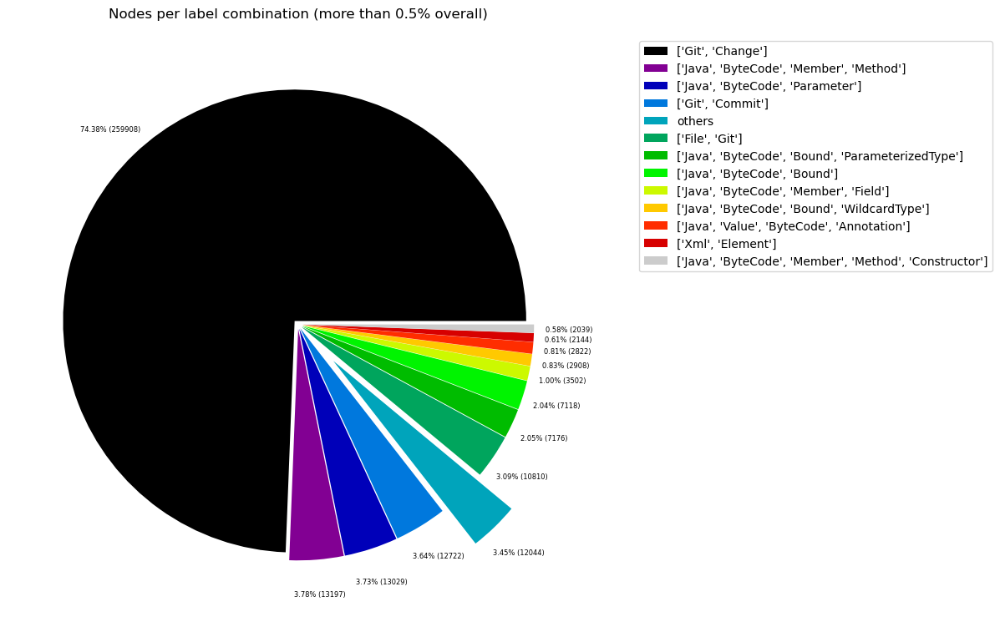
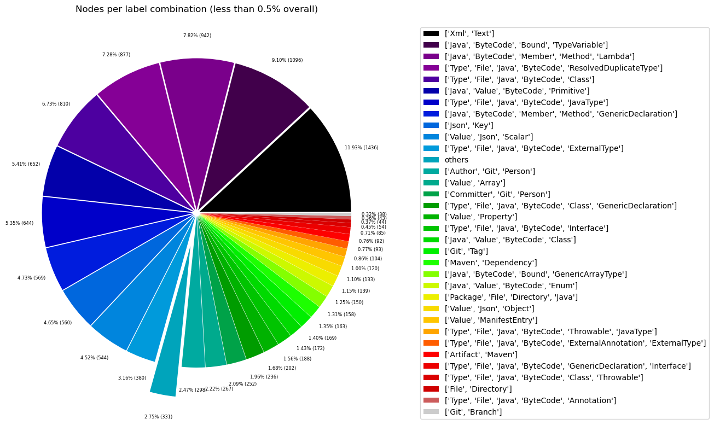
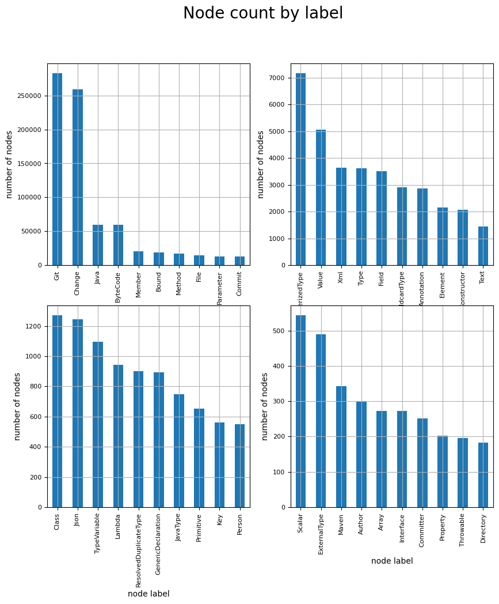
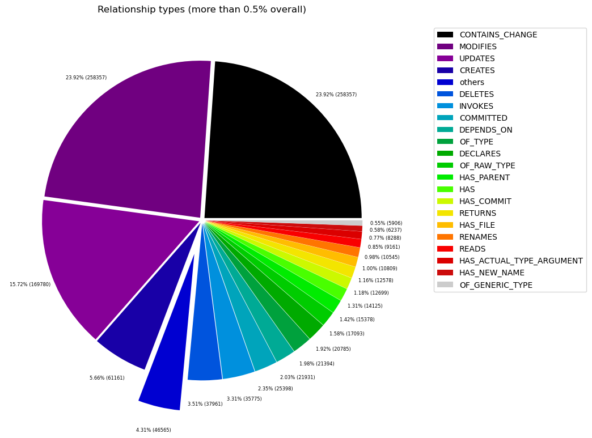
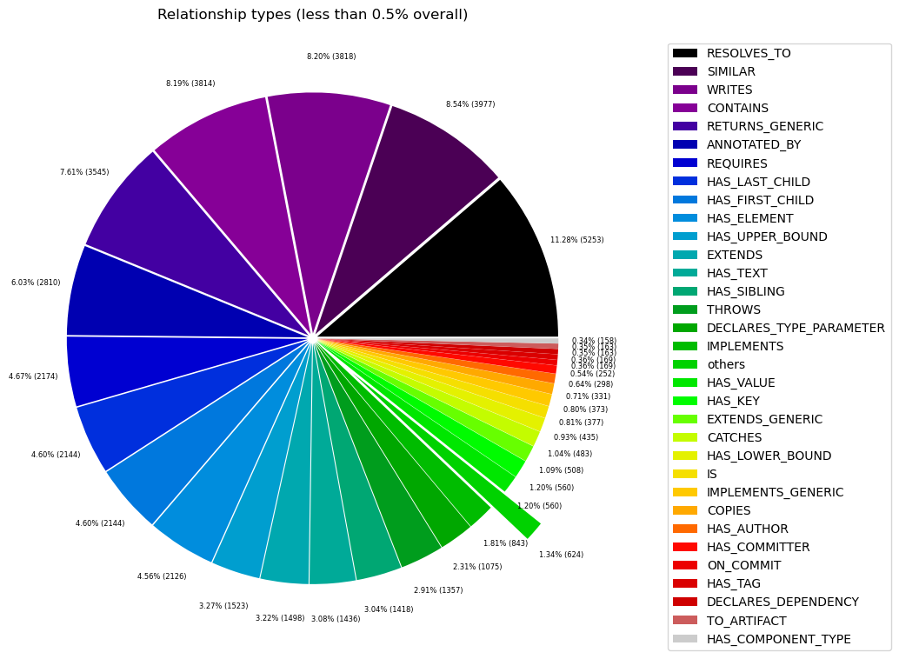

# Overview in General
   

This file contains a general overview of the data in the graph including node labels and relationships types.

### References
- [jqassistant](https://jqassistant.org)
- [Neo4j Python Driver](https://neo4j.com/docs/api/python-driver/current)

## Node Labels

### Table 1a - Highest node count by label combination

Lists the 30 label combinations with the highest number of nodes. The labels with the lowest node count are listed in table 1b.
The total list would sum up to the total number of labels (100%).

The whole table can be found in the CSV report `Node_label_combination_count`.

<table border="1" class="dataframe">
  <thead>
    <tr style="text-align: right;">
      <th></th>
      <th>nodeLabels</th>
      <th>nodesWithThatLabels</th>
      <th>nodesWithThatLabelsPercent</th>
    </tr>
  </thead>
  <tbody>
    <tr>
      <th>0</th>
      <td>[Git, Change]</td>
      <td>249236</td>
      <td>73.704880</td>
    </tr>
    <tr>
      <th>1</th>
      <td>[Java, ByteCode, Member, Method]</td>
      <td>13219</td>
      <td>3.909166</td>
    </tr>
    <tr>
      <th>2</th>
      <td>[Java, ByteCode, Parameter]</td>
      <td>13029</td>
      <td>3.852978</td>
    </tr>
    <tr>
      <th>3</th>
      <td>[Git, Commit]</td>
      <td>12227</td>
      <td>3.615808</td>
    </tr>
    <tr>
      <th>4</th>
      <td>[File, Git]</td>
      <td>10703</td>
      <td>3.165126</td>
    </tr>
    <tr>
      <th>5</th>
      <td>[Java, ByteCode, ParameterizedType, Bound]</td>
      <td>7176</td>
      <td>2.122110</td>
    </tr>
    <tr>
      <th>6</th>
      <td>[Java, ByteCode, Bound]</td>
      <td>7118</td>
      <td>2.104958</td>
    </tr>
    <tr>
      <th>7</th>
      <td>[Java, ByteCode, Member, Field]</td>
      <td>3504</td>
      <td>1.036214</td>
    </tr>
    <tr>
      <th>8</th>
      <td>[Java, ByteCode, Bound, WildcardType]</td>
      <td>2908</td>
      <td>0.859963</td>
    </tr>
    <tr>
      <th>9</th>
      <td>[Java, Value, ByteCode, Annotation]</td>
      <td>2822</td>
      <td>0.834531</td>
    </tr>
    <tr>
      <th>10</th>
      <td>[Xml, Element]</td>
      <td>2144</td>
      <td>0.634031</td>
    </tr>
    <tr>
      <th>11</th>
      <td>[Java, ByteCode, Member, Constructor, Method]</td>
      <td>2040</td>
      <td>0.603275</td>
    </tr>
    <tr>
      <th>12</th>
      <td>[Xml, Text]</td>
      <td>1436</td>
      <td>0.424659</td>
    </tr>
    <tr>
      <th>13</th>
      <td>[Java, ByteCode, Bound, TypeVariable]</td>
      <td>1096</td>
      <td>0.324113</td>
    </tr>
    <tr>
      <th>14</th>
      <td>[Java, ByteCode, Member, Method, Lambda]</td>
      <td>942</td>
      <td>0.278571</td>
    </tr>
    <tr>
      <th>15</th>
      <td>[Type, File, Java, ByteCode, ResolvedDuplicate...</td>
      <td>899</td>
      <td>0.265855</td>
    </tr>
    <tr>
      <th>16</th>
      <td>[Type, File, Java, ByteCode, Class]</td>
      <td>864</td>
      <td>0.255505</td>
    </tr>
    <tr>
      <th>17</th>
      <td>[Type, File, Java, ByteCode, JavaType]</td>
      <td>748</td>
      <td>0.221201</td>
    </tr>
    <tr>
      <th>18</th>
      <td>[Java, Value, ByteCode, Primitive]</td>
      <td>652</td>
      <td>0.192812</td>
    </tr>
    <tr>
      <th>19</th>
      <td>[Java, ByteCode, Member, Method, GenericDeclar...</td>
      <td>569</td>
      <td>0.168267</td>
    </tr>
    <tr>
      <th>20</th>
      <td>[Json, Key]</td>
      <td>560</td>
      <td>0.165605</td>
    </tr>
    <tr>
      <th>21</th>
      <td>[Value, Json, Scalar]</td>
      <td>544</td>
      <td>0.160873</td>
    </tr>
    <tr>
      <th>22</th>
      <td>[Type, File, Java, ByteCode, ExternalType]</td>
      <td>396</td>
      <td>0.117106</td>
    </tr>
    <tr>
      <th>23</th>
      <td>[Author, Git, Person]</td>
      <td>295</td>
      <td>0.087238</td>
    </tr>
    <tr>
      <th>24</th>
      <td>[Value, Array]</td>
      <td>267</td>
      <td>0.078958</td>
    </tr>
    <tr>
      <th>25</th>
      <td>[Committer, Git, Person]</td>
      <td>250</td>
      <td>0.073931</td>
    </tr>
    <tr>
      <th>26</th>
      <td>[Type, File, Java, ByteCode, Class, GenericDec...</td>
      <td>236</td>
      <td>0.069791</td>
    </tr>
    <tr>
      <th>27</th>
      <td>[Value, Property]</td>
      <td>202</td>
      <td>0.059736</td>
    </tr>
    <tr>
      <th>28</th>
      <td>[Type, File, Java, ByteCode, Interface]</td>
      <td>188</td>
      <td>0.055596</td>
    </tr>
    <tr>
      <th>29</th>
      <td>[Java, Value, ByteCode, Class]</td>
      <td>172</td>
      <td>0.050864</td>
    </tr>
  </tbody>
</table>

### Chart 1a - Highest node count by label combination

Values under 0.5% will be grouped into "others" to get a cleaner plot. The group "others" is then broken down in Chart 1b.

    <Figure size 640x480 with 0 Axes>

    

    

### Table 1b - Lowest node count by label combination

Lists the 30 label combinations with the lowest number of nodes until they reach 0.5% of the total node count, which are shown above.

<table border="1" class="dataframe">
  <thead>
    <tr style="text-align: right;">
      <th></th>
      <th>nodeLabels</th>
      <th>nodesWithThatLabels</th>
      <th>nodesWithThatLabelsPercent</th>
    </tr>
  </thead>
  <tbody>
    <tr>
      <th>0</th>
      <td>[Analyze, Task, jQAssistant]</td>
      <td>1</td>
      <td>0.000296</td>
    </tr>
    <tr>
      <th>1</th>
      <td>[Repository, File, Git]</td>
      <td>1</td>
      <td>0.000296</td>
    </tr>
    <tr>
      <th>2</th>
      <td>[File, Json]</td>
      <td>2</td>
      <td>0.000591</td>
    </tr>
    <tr>
      <th>3</th>
      <td>[File]</td>
      <td>3</td>
      <td>0.000887</td>
    </tr>
    <tr>
      <th>4</th>
      <td>[Java, ByteCode, Member, Constructor, Method, ...</td>
      <td>4</td>
      <td>0.001183</td>
    </tr>
    <tr>
      <th>5</th>
      <td>[Maven, Exclusion]</td>
      <td>5</td>
      <td>0.001479</td>
    </tr>
    <tr>
      <th>6</th>
      <td>[Value, Json, Array]</td>
      <td>6</td>
      <td>0.001774</td>
    </tr>
    <tr>
      <th>7</th>
      <td>[File, Maven, Xml, Pom, Document]</td>
      <td>9</td>
      <td>0.002662</td>
    </tr>
    <tr>
      <th>8</th>
      <td>[Type, File, Java, ByteCode, Void]</td>
      <td>9</td>
      <td>0.002662</td>
    </tr>
    <tr>
      <th>9</th>
      <td>[Java, ManifestSection]</td>
      <td>9</td>
      <td>0.002662</td>
    </tr>
    <tr>
      <th>10</th>
      <td>[File, Java, Manifest]</td>
      <td>9</td>
      <td>0.002662</td>
    </tr>
    <tr>
      <th>11</th>
      <td>[Artifact, File, Jar, Archive, Zip, Java]</td>
      <td>9</td>
      <td>0.002662</td>
    </tr>
    <tr>
      <th>12</th>
      <td>[File, Java, ServiceLoader]</td>
      <td>10</td>
      <td>0.002957</td>
    </tr>
    <tr>
      <th>13</th>
      <td>[File, Java, Properties]</td>
      <td>12</td>
      <td>0.003549</td>
    </tr>
    <tr>
      <th>14</th>
      <td>[Maven, ExecutionGoal]</td>
      <td>16</td>
      <td>0.004732</td>
    </tr>
    <tr>
      <th>15</th>
      <td>[Maven, PluginExecution]</td>
      <td>16</td>
      <td>0.004732</td>
    </tr>
    <tr>
      <th>16</th>
      <td>[Xml, Attribute]</td>
      <td>18</td>
      <td>0.005323</td>
    </tr>
    <tr>
      <th>17</th>
      <td>[jQAssistant, Rule, Concept]</td>
      <td>19</td>
      <td>0.005619</td>
    </tr>
    <tr>
      <th>18</th>
      <td>[Maven, Plugin]</td>
      <td>21</td>
      <td>0.006210</td>
    </tr>
    <tr>
      <th>19</th>
      <td>[Maven, Configuration]</td>
      <td>21</td>
      <td>0.006210</td>
    </tr>
    <tr>
      <th>20</th>
      <td>[Type, File, Java, ByteCode, Enum]</td>
      <td>28</td>
      <td>0.008280</td>
    </tr>
    <tr>
      <th>21</th>
      <td>[Type, File, Java, ByteCode, PrimitiveType]</td>
      <td>29</td>
      <td>0.008576</td>
    </tr>
    <tr>
      <th>22</th>
      <td>[Git, Branch]</td>
      <td>30</td>
      <td>0.008872</td>
    </tr>
    <tr>
      <th>23</th>
      <td>[Xml, Namespace]</td>
      <td>36</td>
      <td>0.010646</td>
    </tr>
    <tr>
      <th>24</th>
      <td>[Type, File, Java, ByteCode, Annotation]</td>
      <td>43</td>
      <td>0.012716</td>
    </tr>
    <tr>
      <th>25</th>
      <td>[File, Directory]</td>
      <td>44</td>
      <td>0.013012</td>
    </tr>
    <tr>
      <th>26</th>
      <td>[Type, File, Java, ByteCode, GenericDeclaratio...</td>
      <td>85</td>
      <td>0.025136</td>
    </tr>
    <tr>
      <th>27</th>
      <td>[Artifact, Maven]</td>
      <td>92</td>
      <td>0.027207</td>
    </tr>
    <tr>
      <th>28</th>
      <td>[Type, File, Java, ByteCode, ExternalAnnotatio...</td>
      <td>93</td>
      <td>0.027502</td>
    </tr>
    <tr>
      <th>29</th>
      <td>[Value, ManifestEntry]</td>
      <td>120</td>
      <td>0.035487</td>
    </tr>
  </tbody>
</table>

### Chart 1b - Lowest node count by label combination

Shows the lowest (less than 0.5% overall) node count label combinations. Therefore, this plot breaks down the "others" slice of the pie chart above. Values under 0.01% will be grouped into "others" to get a cleaner plot.

    <Figure size 640x480 with 0 Axes>

    

    

### Table 1c - Highest node count by single label

Lists the 40 labels with the highest number of nodes.
Doesn't sum up to the total number of nodes or 100% because one node can have multiple labels.
Helps to identify commonly used labels.

<table border="1" class="dataframe">
  <thead>
    <tr style="text-align: right;">
      <th></th>
      <th>nodeLabel</th>
      <th>nodesWithThatLabel</th>
      <th>nodesWithThatLabelPercent</th>
    </tr>
  </thead>
  <tbody>
    <tr>
      <th>0</th>
      <td>Git</td>
      <td>272911</td>
      <td>80.706128</td>
    </tr>
    <tr>
      <th>1</th>
      <td>Change</td>
      <td>249236</td>
      <td>73.704880</td>
    </tr>
    <tr>
      <th>2</th>
      <td>Java</td>
      <td>59365</td>
      <td>17.555611</td>
    </tr>
    <tr>
      <th>3</th>
      <td>ByteCode</td>
      <td>59177</td>
      <td>17.500015</td>
    </tr>
    <tr>
      <th>4</th>
      <td>Member</td>
      <td>20278</td>
      <td>5.996676</td>
    </tr>
    <tr>
      <th>5</th>
      <td>Bound</td>
      <td>18456</td>
      <td>5.457868</td>
    </tr>
    <tr>
      <th>6</th>
      <td>Method</td>
      <td>16774</td>
      <td>4.960462</td>
    </tr>
    <tr>
      <th>7</th>
      <td>File</td>
      <td>14559</td>
      <td>4.305435</td>
    </tr>
    <tr>
      <th>8</th>
      <td>Parameter</td>
      <td>13029</td>
      <td>3.852978</td>
    </tr>
    <tr>
      <th>9</th>
      <td>Commit</td>
      <td>12227</td>
      <td>3.615808</td>
    </tr>
    <tr>
      <th>10</th>
      <td>ParameterizedType</td>
      <td>7176</td>
      <td>2.122110</td>
    </tr>
    <tr>
      <th>11</th>
      <td>Value</td>
      <td>5068</td>
      <td>1.498725</td>
    </tr>
    <tr>
      <th>12</th>
      <td>Xml</td>
      <td>3643</td>
      <td>1.077320</td>
    </tr>
    <tr>
      <th>13</th>
      <td>Type</td>
      <td>3618</td>
      <td>1.069927</td>
    </tr>
    <tr>
      <th>14</th>
      <td>Field</td>
      <td>3504</td>
      <td>1.036214</td>
    </tr>
    <tr>
      <th>15</th>
      <td>WildcardType</td>
      <td>2908</td>
      <td>0.859963</td>
    </tr>
    <tr>
      <th>16</th>
      <td>Annotation</td>
      <td>2865</td>
      <td>0.847247</td>
    </tr>
    <tr>
      <th>17</th>
      <td>Element</td>
      <td>2144</td>
      <td>0.634031</td>
    </tr>
    <tr>
      <th>18</th>
      <td>Constructor</td>
      <td>2044</td>
      <td>0.604458</td>
    </tr>
    <tr>
      <th>19</th>
      <td>Text</td>
      <td>1436</td>
      <td>0.424659</td>
    </tr>
    <tr>
      <th>20</th>
      <td>Class</td>
      <td>1272</td>
      <td>0.376160</td>
    </tr>
    <tr>
      <th>21</th>
      <td>Json</td>
      <td>1245</td>
      <td>0.368175</td>
    </tr>
    <tr>
      <th>22</th>
      <td>TypeVariable</td>
      <td>1096</td>
      <td>0.324113</td>
    </tr>
    <tr>
      <th>23</th>
      <td>Lambda</td>
      <td>942</td>
      <td>0.278571</td>
    </tr>
    <tr>
      <th>24</th>
      <td>ResolvedDuplicateType</td>
      <td>899</td>
      <td>0.265855</td>
    </tr>
    <tr>
      <th>25</th>
      <td>GenericDeclaration</td>
      <td>894</td>
      <td>0.264377</td>
    </tr>
    <tr>
      <th>26</th>
      <td>JavaType</td>
      <td>748</td>
      <td>0.221201</td>
    </tr>
    <tr>
      <th>27</th>
      <td>Primitive</td>
      <td>652</td>
      <td>0.192812</td>
    </tr>
    <tr>
      <th>28</th>
      <td>Key</td>
      <td>560</td>
      <td>0.165605</td>
    </tr>
    <tr>
      <th>29</th>
      <td>Person</td>
      <td>545</td>
      <td>0.161169</td>
    </tr>
    <tr>
      <th>30</th>
      <td>Scalar</td>
      <td>544</td>
      <td>0.160873</td>
    </tr>
    <tr>
      <th>31</th>
      <td>ExternalType</td>
      <td>489</td>
      <td>0.144609</td>
    </tr>
    <tr>
      <th>32</th>
      <td>Maven</td>
      <td>343</td>
      <td>0.101433</td>
    </tr>
    <tr>
      <th>33</th>
      <td>Author</td>
      <td>295</td>
      <td>0.087238</td>
    </tr>
    <tr>
      <th>34</th>
      <td>Array</td>
      <td>273</td>
      <td>0.080732</td>
    </tr>
    <tr>
      <th>35</th>
      <td>Interface</td>
      <td>273</td>
      <td>0.080732</td>
    </tr>
    <tr>
      <th>36</th>
      <td>Committer</td>
      <td>250</td>
      <td>0.073931</td>
    </tr>
    <tr>
      <th>37</th>
      <td>Property</td>
      <td>202</td>
      <td>0.059736</td>
    </tr>
    <tr>
      <th>38</th>
      <td>Directory</td>
      <td>183</td>
      <td>0.054117</td>
    </tr>
    <tr>
      <th>39</th>
      <td>Enum</td>
      <td>178</td>
      <td>0.052639</td>
    </tr>
  </tbody>
</table>

### Chart 1c - Highest node count by label

Shows the 40 labels with the highest number of nodes.

    <Figure size 640x480 with 0 Axes>

    

    

## Relationship Types

### Table 2a - Highest relationship count by type

Lists the 30 relationship types with the highest number of occurrences.
The whole table can be found in the CSV report `Relationship_type_count`.

    Total number of relationships: 1049000

<table border="1" class="dataframe">
  <thead>
    <tr style="text-align: right;">
      <th></th>
      <th>relationshipType</th>
      <th>nodesWithThatRelationshipType</th>
      <th>nodesWithThatRelationshipTypePercent</th>
    </tr>
  </thead>
  <tbody>
    <tr>
      <th>0</th>
      <td>CONTAINS_CHANGE</td>
      <td>249236</td>
      <td>23.759390</td>
    </tr>
    <tr>
      <th>1</th>
      <td>MODIFIES</td>
      <td>249236</td>
      <td>23.759390</td>
    </tr>
    <tr>
      <th>2</th>
      <td>UPDATES</td>
      <td>162500</td>
      <td>15.490944</td>
    </tr>
    <tr>
      <th>3</th>
      <td>CREATES</td>
      <td>59791</td>
      <td>5.699809</td>
    </tr>
    <tr>
      <th>4</th>
      <td>DELETES</td>
      <td>37236</td>
      <td>3.549666</td>
    </tr>
    <tr>
      <th>5</th>
      <td>INVOKES</td>
      <td>35731</td>
      <td>3.406196</td>
    </tr>
    <tr>
      <th>6</th>
      <td>COMMITTED</td>
      <td>24454</td>
      <td>2.331173</td>
    </tr>
    <tr>
      <th>7</th>
      <td>DEPENDS_ON</td>
      <td>21931</td>
      <td>2.090658</td>
    </tr>
    <tr>
      <th>8</th>
      <td>OF_TYPE</td>
      <td>21393</td>
      <td>2.039371</td>
    </tr>
    <tr>
      <th>9</th>
      <td>DECLARES</td>
      <td>20723</td>
      <td>1.975500</td>
    </tr>
    <tr>
      <th>10</th>
      <td>OF_RAW_TYPE</td>
      <td>17093</td>
      <td>1.629457</td>
    </tr>
    <tr>
      <th>11</th>
      <td>HAS_PARENT</td>
      <td>14859</td>
      <td>1.416492</td>
    </tr>
    <tr>
      <th>12</th>
      <td>HAS</td>
      <td>14125</td>
      <td>1.346520</td>
    </tr>
    <tr>
      <th>13</th>
      <td>RETURNS</td>
      <td>12577</td>
      <td>1.198951</td>
    </tr>
    <tr>
      <th>14</th>
      <td>HAS_COMMIT</td>
      <td>12227</td>
      <td>1.165586</td>
    </tr>
    <tr>
      <th>15</th>
      <td>HAS_FILE</td>
      <td>10703</td>
      <td>1.020305</td>
    </tr>
    <tr>
      <th>16</th>
      <td>RENAMES</td>
      <td>10291</td>
      <td>0.981030</td>
    </tr>
    <tr>
      <th>17</th>
      <td>READS</td>
      <td>9161</td>
      <td>0.873308</td>
    </tr>
    <tr>
      <th>18</th>
      <td>HAS_ACTUAL_TYPE_ARGUMENT</td>
      <td>8288</td>
      <td>0.790086</td>
    </tr>
    <tr>
      <th>19</th>
      <td>HAS_NEW_NAME</td>
      <td>6200</td>
      <td>0.591039</td>
    </tr>
    <tr>
      <th>20</th>
      <td>OF_GENERIC_TYPE</td>
      <td>5906</td>
      <td>0.563012</td>
    </tr>
    <tr>
      <th>21</th>
      <td>RESOLVES_TO</td>
      <td>5213</td>
      <td>0.496949</td>
    </tr>
    <tr>
      <th>22</th>
      <td>SIMILAR</td>
      <td>3977</td>
      <td>0.379123</td>
    </tr>
    <tr>
      <th>23</th>
      <td>WRITES</td>
      <td>3818</td>
      <td>0.363966</td>
    </tr>
    <tr>
      <th>24</th>
      <td>CONTAINS</td>
      <td>3814</td>
      <td>0.363584</td>
    </tr>
    <tr>
      <th>25</th>
      <td>RETURNS_GENERIC</td>
      <td>3545</td>
      <td>0.337941</td>
    </tr>
    <tr>
      <th>26</th>
      <td>ANNOTATED_BY</td>
      <td>2810</td>
      <td>0.267874</td>
    </tr>
    <tr>
      <th>27</th>
      <td>REQUIRES</td>
      <td>2174</td>
      <td>0.207245</td>
    </tr>
    <tr>
      <th>28</th>
      <td>HAS_FIRST_CHILD</td>
      <td>2144</td>
      <td>0.204385</td>
    </tr>
    <tr>
      <th>29</th>
      <td>HAS_LAST_CHILD</td>
      <td>2144</td>
      <td>0.204385</td>
    </tr>
  </tbody>
</table>

### Chart 2a - Highest relationship count by type

Values under 0.5% will be grouped into "others" to get a cleaner plot. The group "others" is then broken down in the second chart.

    <Figure size 640x480 with 0 Axes>

    

    

### Table 2b - Lowest relationship count by type

Lists the 30 relationships type with the lowest number of occurrences up to 0.5% of the total node count. This is essentially breaking down the "others" slice from the chart above.

<table border="1" class="dataframe">
  <thead>
    <tr style="text-align: right;">
      <th></th>
      <th>relationshipType</th>
      <th>nodesWithThatRelationshipType</th>
      <th>nodesWithThatRelationshipTypePercent</th>
    </tr>
  </thead>
  <tbody>
    <tr>
      <th>0</th>
      <td>HAS_PROPERTY</td>
      <td>1</td>
      <td>0.000095</td>
    </tr>
    <tr>
      <th>1</th>
      <td>THROWS_GENERIC</td>
      <td>5</td>
      <td>0.000477</td>
    </tr>
    <tr>
      <th>2</th>
      <td>EXCLUDES</td>
      <td>5</td>
      <td>0.000477</td>
    </tr>
    <tr>
      <th>3</th>
      <td>DESCRIBES</td>
      <td>9</td>
      <td>0.000858</td>
    </tr>
    <tr>
      <th>4</th>
      <td>HAS_ROOT_ELEMENT</td>
      <td>10</td>
      <td>0.000953</td>
    </tr>
    <tr>
      <th>5</th>
      <td>HAS_GOAL</td>
      <td>16</td>
      <td>0.001525</td>
    </tr>
    <tr>
      <th>6</th>
      <td>HAS_EXECUTION</td>
      <td>16</td>
      <td>0.001525</td>
    </tr>
    <tr>
      <th>7</th>
      <td>OF_NAMESPACE</td>
      <td>18</td>
      <td>0.001716</td>
    </tr>
    <tr>
      <th>8</th>
      <td>HAS_ATTRIBUTE</td>
      <td>18</td>
      <td>0.001716</td>
    </tr>
    <tr>
      <th>9</th>
      <td>INCLUDES_CONCEPT</td>
      <td>19</td>
      <td>0.001811</td>
    </tr>
    <tr>
      <th>10</th>
      <td>USES_PLUGIN</td>
      <td>21</td>
      <td>0.002002</td>
    </tr>
    <tr>
      <th>11</th>
      <td>REQUIRES_TYPE_PARAMETER</td>
      <td>21</td>
      <td>0.002002</td>
    </tr>
    <tr>
      <th>12</th>
      <td>IS_ARTIFACT</td>
      <td>21</td>
      <td>0.002002</td>
    </tr>
    <tr>
      <th>13</th>
      <td>HAS_CONFIGURATION</td>
      <td>21</td>
      <td>0.002002</td>
    </tr>
    <tr>
      <th>14</th>
      <td>REQUIRES_CONCEPT</td>
      <td>28</td>
      <td>0.002669</td>
    </tr>
    <tr>
      <th>15</th>
      <td>HAS_BRANCH</td>
      <td>30</td>
      <td>0.002860</td>
    </tr>
    <tr>
      <th>16</th>
      <td>HAS_HEAD</td>
      <td>31</td>
      <td>0.002955</td>
    </tr>
    <tr>
      <th>17</th>
      <td>DECLARES_NAMESPACE</td>
      <td>36</td>
      <td>0.003432</td>
    </tr>
    <tr>
      <th>18</th>
      <td>HAS_DEFAULT</td>
      <td>36</td>
      <td>0.003432</td>
    </tr>
    <tr>
      <th>19</th>
      <td>CONTAINS_VALUE</td>
      <td>121</td>
      <td>0.011535</td>
    </tr>
    <tr>
      <th>20</th>
      <td>COPY_OF</td>
      <td>126</td>
      <td>0.012011</td>
    </tr>
    <tr>
      <th>21</th>
      <td>HAS_COMPONENT_TYPE</td>
      <td>158</td>
      <td>0.015062</td>
    </tr>
    <tr>
      <th>22</th>
      <td>TO_ARTIFACT</td>
      <td>163</td>
      <td>0.015539</td>
    </tr>
    <tr>
      <th>23</th>
      <td>DECLARES_DEPENDENCY</td>
      <td>163</td>
      <td>0.015539</td>
    </tr>
    <tr>
      <th>24</th>
      <td>ON_COMMIT</td>
      <td>169</td>
      <td>0.016111</td>
    </tr>
    <tr>
      <th>25</th>
      <td>HAS_TAG</td>
      <td>169</td>
      <td>0.016111</td>
    </tr>
    <tr>
      <th>26</th>
      <td>HAS_COMMITTER</td>
      <td>250</td>
      <td>0.023832</td>
    </tr>
    <tr>
      <th>27</th>
      <td>HAS_AUTHOR</td>
      <td>295</td>
      <td>0.028122</td>
    </tr>
    <tr>
      <th>28</th>
      <td>COPIES</td>
      <td>328</td>
      <td>0.031268</td>
    </tr>
    <tr>
      <th>29</th>
      <td>IMPLEMENTS_GENERIC</td>
      <td>373</td>
      <td>0.035558</td>
    </tr>
  </tbody>
</table>

### Chart 2b - Lowest relationship count by type

Shows the lowest (less than 0.5% overall) relationship types. This plot breaks down the "others" slice of the pie chart above. Values under 0.01% will be grouped into "others" to get a cleaner plot.

    <Figure size 640x480 with 0 Axes>

    

    

## Node labels with their relationships

### Table 3a - Highest relationship count by node labels and relationship type

Lists the 30 node labels and their relationship types with the highest number of occurrences.

<table border="1" class="dataframe">
  <thead>
    <tr style="text-align: right;">
      <th></th>
      <th>sourceLabels</th>
      <th>relationType</th>
      <th>targetLabels</th>
      <th>numberOfRelationships</th>
      <th>numberOfNodesWithSameLabelsAsSource</th>
      <th>numberOfNodesWithSameLabelsAsTarget</th>
      <th>densityInPercent</th>
    </tr>
  </thead>
  <tbody>
    <tr>
      <th>0</th>
      <td>[Git, Commit]</td>
      <td>CONTAINS_CHANGE</td>
      <td>[Git, Change]</td>
      <td>249236</td>
      <td>12227</td>
      <td>249236</td>
      <td>0.008179</td>
    </tr>
    <tr>
      <th>1</th>
      <td>[Git, Change]</td>
      <td>MODIFIES</td>
      <td>[File, Git]</td>
      <td>249236</td>
      <td>249236</td>
      <td>10703</td>
      <td>0.009343</td>
    </tr>
    <tr>
      <th>2</th>
      <td>[Git, Change]</td>
      <td>UPDATES</td>
      <td>[File, Git]</td>
      <td>162500</td>
      <td>249236</td>
      <td>10703</td>
      <td>0.006092</td>
    </tr>
    <tr>
      <th>3</th>
      <td>[Git, Change]</td>
      <td>CREATES</td>
      <td>[File, Git]</td>
      <td>59791</td>
      <td>249236</td>
      <td>10703</td>
      <td>0.002241</td>
    </tr>
    <tr>
      <th>4</th>
      <td>[Git, Change]</td>
      <td>DELETES</td>
      <td>[File, Git]</td>
      <td>37236</td>
      <td>249236</td>
      <td>10703</td>
      <td>0.001396</td>
    </tr>
    <tr>
      <th>5</th>
      <td>[Java, ByteCode, Member, Method]</td>
      <td>INVOKES</td>
      <td>[Java, ByteCode, Member, Method]</td>
      <td>21647</td>
      <td>13124</td>
      <td>13124</td>
      <td>0.012568</td>
    </tr>
    <tr>
      <th>6</th>
      <td>[Git, Commit]</td>
      <td>HAS_PARENT</td>
      <td>[Git, Commit]</td>
      <td>14850</td>
      <td>12227</td>
      <td>12227</td>
      <td>0.009933</td>
    </tr>
    <tr>
      <th>7</th>
      <td>[Repository, File, Git]</td>
      <td>HAS_COMMIT</td>
      <td>[Git, Commit]</td>
      <td>12227</td>
      <td>1</td>
      <td>12227</td>
      <td>100.000000</td>
    </tr>
    <tr>
      <th>8</th>
      <td>[Author, Git, Person]</td>
      <td>COMMITTED</td>
      <td>[Git, Commit]</td>
      <td>12227</td>
      <td>295</td>
      <td>12227</td>
      <td>0.338983</td>
    </tr>
    <tr>
      <th>9</th>
      <td>[Committer, Git, Person]</td>
      <td>COMMITTED</td>
      <td>[Git, Commit]</td>
      <td>12227</td>
      <td>250</td>
      <td>12227</td>
      <td>0.400000</td>
    </tr>
    <tr>
      <th>10</th>
      <td>[Repository, File, Git]</td>
      <td>HAS_FILE</td>
      <td>[File, Git]</td>
      <td>10703</td>
      <td>1</td>
      <td>10703</td>
      <td>100.000000</td>
    </tr>
    <tr>
      <th>11</th>
      <td>[Git, Change]</td>
      <td>RENAMES</td>
      <td>[File, Git]</td>
      <td>10291</td>
      <td>249236</td>
      <td>10703</td>
      <td>0.000386</td>
    </tr>
    <tr>
      <th>12</th>
      <td>[Java, ByteCode, Member, Method]</td>
      <td>HAS</td>
      <td>[Java, ByteCode, Parameter]</td>
      <td>8359</td>
      <td>13124</td>
      <td>13029</td>
      <td>0.004889</td>
    </tr>
    <tr>
      <th>13</th>
      <td>[Java, ByteCode, Member, Method]</td>
      <td>READS</td>
      <td>[Java, ByteCode, Member, Field]</td>
      <td>8188</td>
      <td>13124</td>
      <td>3504</td>
      <td>0.017805</td>
    </tr>
    <tr>
      <th>14</th>
      <td>[Java, ByteCode, Parameter]</td>
      <td>OF_TYPE</td>
      <td>[Type, File, Java, ByteCode, JavaType]</td>
      <td>6372</td>
      <td>13029</td>
      <td>748</td>
      <td>0.065383</td>
    </tr>
    <tr>
      <th>15</th>
      <td>[File, Git]</td>
      <td>HAS_NEW_NAME</td>
      <td>[File, Git]</td>
      <td>6200</td>
      <td>10703</td>
      <td>10703</td>
      <td>0.005412</td>
    </tr>
    <tr>
      <th>16</th>
      <td>[Type, File, Java, ByteCode, Class]</td>
      <td>DECLARES</td>
      <td>[Java, ByteCode, Member, Method]</td>
      <td>5090</td>
      <td>816</td>
      <td>13124</td>
      <td>0.047529</td>
    </tr>
    <tr>
      <th>17</th>
      <td>[Type, File, Java, ByteCode, Class]</td>
      <td>DEPENDS_ON</td>
      <td>[Type, File, Java, ByteCode, JavaType]</td>
      <td>4493</td>
      <td>816</td>
      <td>748</td>
      <td>0.736113</td>
    </tr>
    <tr>
      <th>18</th>
      <td>[Java, ByteCode, Bound]</td>
      <td>OF_RAW_TYPE</td>
      <td>[Type, File, Java, ByteCode, JavaType]</td>
      <td>3570</td>
      <td>7118</td>
      <td>748</td>
      <td>0.067052</td>
    </tr>
    <tr>
      <th>19</th>
      <td>[Java, ByteCode, ParameterizedType, Bound]</td>
      <td>OF_RAW_TYPE</td>
      <td>[Type, File, Java, ByteCode, JavaType]</td>
      <td>3053</td>
      <td>7176</td>
      <td>748</td>
      <td>0.056878</td>
    </tr>
    <tr>
      <th>20</th>
      <td>[Java, ByteCode, ParameterizedType, Bound]</td>
      <td>HAS_ACTUAL_TYPE_ARGUMENT</td>
      <td>[Java, ByteCode, Bound, WildcardType]</td>
      <td>2908</td>
      <td>7176</td>
      <td>2908</td>
      <td>0.013935</td>
    </tr>
    <tr>
      <th>21</th>
      <td>[Java, ByteCode, Parameter]</td>
      <td>OF_GENERIC_TYPE</td>
      <td>[Java, ByteCode, ParameterizedType, Bound]</td>
      <td>2657</td>
      <td>13029</td>
      <td>7176</td>
      <td>0.002842</td>
    </tr>
    <tr>
      <th>22</th>
      <td>[Java, ByteCode, ParameterizedType, Bound]</td>
      <td>HAS_ACTUAL_TYPE_ARGUMENT</td>
      <td>[Java, ByteCode, Bound, TypeVariable]</td>
      <td>2454</td>
      <td>7176</td>
      <td>1096</td>
      <td>0.031202</td>
    </tr>
    <tr>
      <th>23</th>
      <td>[Java, ByteCode, Member, Constructor, Method]</td>
      <td>WRITES</td>
      <td>[Java, ByteCode, Member, Field]</td>
      <td>2438</td>
      <td>2040</td>
      <td>3504</td>
      <td>0.034107</td>
    </tr>
    <tr>
      <th>24</th>
      <td>[Java, Value, ByteCode, Annotation]</td>
      <td>OF_TYPE</td>
      <td>[Type, File, Java, ByteCode, ExternalAnnotatio...</td>
      <td>2341</td>
      <td>2822</td>
      <td>93</td>
      <td>0.891993</td>
    </tr>
    <tr>
      <th>25</th>
      <td>[Type, File, Java, ByteCode, Class]</td>
      <td>DECLARES</td>
      <td>[Java, ByteCode, Member, Field]</td>
      <td>2184</td>
      <td>816</td>
      <td>3504</td>
      <td>0.076383</td>
    </tr>
    <tr>
      <th>26</th>
      <td>[Xml, Element]</td>
      <td>HAS_ELEMENT</td>
      <td>[Xml, Element]</td>
      <td>2126</td>
      <td>2144</td>
      <td>2144</td>
      <td>0.046250</td>
    </tr>
    <tr>
      <th>27</th>
      <td>[Type, File, Java, ByteCode, Class, GenericDec...</td>
      <td>DECLARES</td>
      <td>[Java, ByteCode, Member, Method]</td>
      <td>2121</td>
      <td>228</td>
      <td>13124</td>
      <td>0.070883</td>
    </tr>
    <tr>
      <th>28</th>
      <td>[Java, ByteCode, Member, Constructor, Method]</td>
      <td>INVOKES</td>
      <td>[Java, ByteCode, Member, Constructor, Method]</td>
      <td>2120</td>
      <td>2040</td>
      <td>2040</td>
      <td>0.050942</td>
    </tr>
    <tr>
      <th>29</th>
      <td>[Java, ByteCode, Member, Method]</td>
      <td>RETURNS</td>
      <td>[Type, File, Java, ByteCode, JavaType]</td>
      <td>2091</td>
      <td>13124</td>
      <td>748</td>
      <td>0.021300</td>
    </tr>
  </tbody>
</table>

## Graph Density

    total_number_of_nodes (vertices): 338154
    total_number_of_relationships (edges): 1049000
    -> total directed graph density: 9.173767188837756e-06
    -> total directed graph density in percent: 0.0009173767188837756

