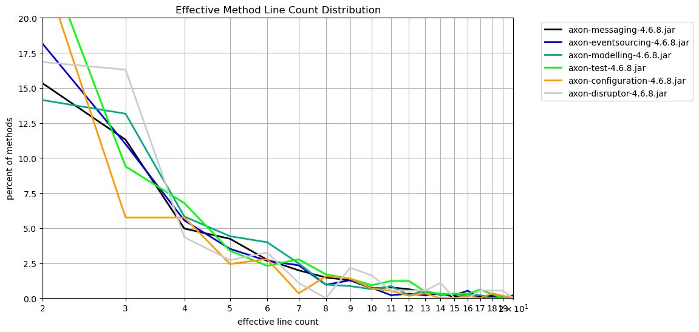
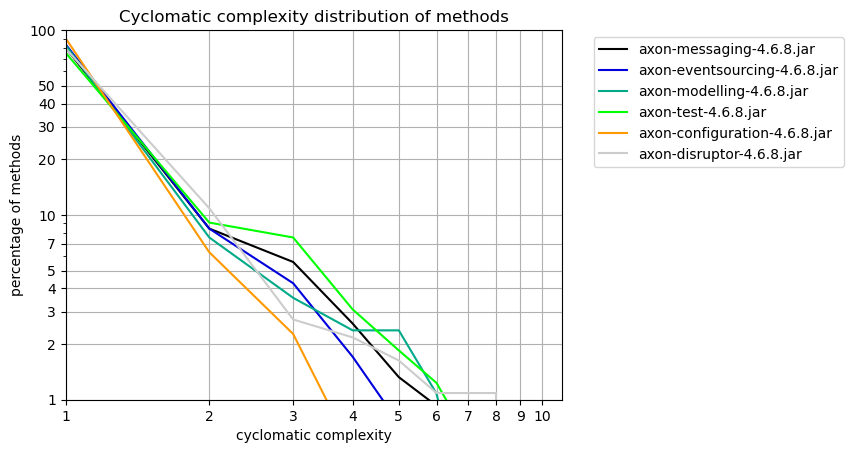

# Method Metrics
   

### References
- [jqassistant](https://jqassistant.org)
- [Neo4j Python Driver](https://neo4j.com/docs/api/python-driver/current)

## Effective Method Line Count

### Table 1a - Effective method line count distribution

This table shows the distribution of the effective method line count per artifact.
For each artifact the number of methods with effective line count = 1,2,3,... is shown to get an overview of how line counts are distributed over methods.

Only the 15 artifacts with the highest method count and their effective method line count distribution (limited by 40)is shown here. The whole table can be found in the CSV report `Effective_Method_Line_Count_Distribution`.

Have a look below to find out which packages and methods have the highest effective lines of code.

<table border="1" class="dataframe">
  <thead>
    <tr style="text-align: right;">
      <th>artifactName</th>
      <th>axon-messaging-4.6.8.jar</th>
      <th>axon-eventsourcing-4.6.8.jar</th>
      <th>axon-modelling-4.6.8.jar</th>
      <th>axon-test-4.6.8.jar</th>
      <th>axon-configuration-4.6.8.jar</th>
      <th>axon-disruptor-4.6.8.jar</th>
    </tr>
    <tr>
      <th>effectiveLineCount</th>
      <th></th>
      <th></th>
      <th></th>
      <th></th>
      <th></th>
      <th></th>
    </tr>
  </thead>
  <tbody>
    <tr>
      <th>1</th>
      <td>2375</td>
      <td>478</td>
      <td>464</td>
      <td>262</td>
      <td>304</td>
      <td>84</td>
    </tr>
    <tr>
      <th>2</th>
      <td>694</td>
      <td>170</td>
      <td>131</td>
      <td>162</td>
      <td>135</td>
      <td>31</td>
    </tr>
    <tr>
      <th>3</th>
      <td>512</td>
      <td>103</td>
      <td>122</td>
      <td>61</td>
      <td>33</td>
      <td>30</td>
    </tr>
    <tr>
      <th>4</th>
      <td>225</td>
      <td>52</td>
      <td>54</td>
      <td>44</td>
      <td>33</td>
      <td>8</td>
    </tr>
    <tr>
      <th>5</th>
      <td>192</td>
      <td>33</td>
      <td>41</td>
      <td>22</td>
      <td>14</td>
      <td>5</td>
    </tr>
    <tr>
      <th>6</th>
      <td>124</td>
      <td>25</td>
      <td>37</td>
      <td>15</td>
      <td>16</td>
      <td>6</td>
    </tr>
    <tr>
      <th>7</th>
      <td>90</td>
      <td>22</td>
      <td>23</td>
      <td>18</td>
      <td>2</td>
      <td>2</td>
    </tr>
    <tr>
      <th>8</th>
      <td>67</td>
      <td>9</td>
      <td>9</td>
      <td>11</td>
      <td>9</td>
      <td>0</td>
    </tr>
    <tr>
      <th>9</th>
      <td>58</td>
      <td>12</td>
      <td>8</td>
      <td>9</td>
      <td>8</td>
      <td>4</td>
    </tr>
    <tr>
      <th>10</th>
      <td>32</td>
      <td>7</td>
      <td>6</td>
      <td>6</td>
      <td>4</td>
      <td>3</td>
    </tr>
    <tr>
      <th>11</th>
      <td>35</td>
      <td>2</td>
      <td>8</td>
      <td>8</td>
      <td>3</td>
      <td>1</td>
    </tr>
    <tr>
      <th>12</th>
      <td>29</td>
      <td>3</td>
      <td>2</td>
      <td>8</td>
      <td>1</td>
      <td>1</td>
    </tr>
    <tr>
      <th>13</th>
      <td>20</td>
      <td>2</td>
      <td>5</td>
      <td>3</td>
      <td>2</td>
      <td>1</td>
    </tr>
    <tr>
      <th>14</th>
      <td>14</td>
      <td>3</td>
      <td>2</td>
      <td>2</td>
      <td>0</td>
      <td>2</td>
    </tr>
    <tr>
      <th>15</th>
      <td>5</td>
      <td>2</td>
      <td>3</td>
      <td>2</td>
      <td>0</td>
      <td>0</td>
    </tr>
    <tr>
      <th>16</th>
      <td>7</td>
      <td>5</td>
      <td>2</td>
      <td>2</td>
      <td>1</td>
      <td>0</td>
    </tr>
    <tr>
      <th>17</th>
      <td>7</td>
      <td>0</td>
      <td>2</td>
      <td>4</td>
      <td>0</td>
      <td>1</td>
    </tr>
    <tr>
      <th>18</th>
      <td>7</td>
      <td>2</td>
      <td>0</td>
      <td>2</td>
      <td>2</td>
      <td>1</td>
    </tr>
    <tr>
      <th>19</th>
      <td>4</td>
      <td>0</td>
      <td>1</td>
      <td>0</td>
      <td>1</td>
      <td>1</td>
    </tr>
    <tr>
      <th>20</th>
      <td>5</td>
      <td>2</td>
      <td>1</td>
      <td>0</td>
      <td>0</td>
      <td>0</td>
    </tr>
    <tr>
      <th>21</th>
      <td>8</td>
      <td>1</td>
      <td>1</td>
      <td>2</td>
      <td>1</td>
      <td>0</td>
    </tr>
    <tr>
      <th>22</th>
      <td>1</td>
      <td>0</td>
      <td>1</td>
      <td>2</td>
      <td>0</td>
      <td>1</td>
    </tr>
    <tr>
      <th>23</th>
      <td>2</td>
      <td>1</td>
      <td>1</td>
      <td>0</td>
      <td>1</td>
      <td>0</td>
    </tr>
    <tr>
      <th>24</th>
      <td>3</td>
      <td>2</td>
      <td>2</td>
      <td>0</td>
      <td>0</td>
      <td>1</td>
    </tr>
    <tr>
      <th>25</th>
      <td>0</td>
      <td>1</td>
      <td>0</td>
      <td>0</td>
      <td>0</td>
      <td>0</td>
    </tr>
    <tr>
      <th>26</th>
      <td>1</td>
      <td>0</td>
      <td>0</td>
      <td>0</td>
      <td>1</td>
      <td>0</td>
    </tr>
    <tr>
      <th>27</th>
      <td>0</td>
      <td>0</td>
      <td>0</td>
      <td>1</td>
      <td>0</td>
      <td>0</td>
    </tr>
    <tr>
      <th>28</th>
      <td>1</td>
      <td>0</td>
      <td>0</td>
      <td>0</td>
      <td>0</td>
      <td>0</td>
    </tr>
    <tr>
      <th>29</th>
      <td>1</td>
      <td>0</td>
      <td>0</td>
      <td>1</td>
      <td>0</td>
      <td>0</td>
    </tr>
    <tr>
      <th>31</th>
      <td>0</td>
      <td>0</td>
      <td>0</td>
      <td>1</td>
      <td>0</td>
      <td>0</td>
    </tr>
    <tr>
      <th>32</th>
      <td>1</td>
      <td>0</td>
      <td>0</td>
      <td>0</td>
      <td>0</td>
      <td>1</td>
    </tr>
    <tr>
      <th>33</th>
      <td>2</td>
      <td>0</td>
      <td>0</td>
      <td>0</td>
      <td>0</td>
      <td>0</td>
    </tr>
    <tr>
      <th>36</th>
      <td>2</td>
      <td>0</td>
      <td>0</td>
      <td>0</td>
      <td>0</td>
      <td>0</td>
    </tr>
    <tr>
      <th>38</th>
      <td>0</td>
      <td>0</td>
      <td>1</td>
      <td>0</td>
      <td>0</td>
      <td>0</td>
    </tr>
    <tr>
      <th>39</th>
      <td>0</td>
      <td>0</td>
      <td>0</td>
      <td>0</td>
      <td>1</td>
      <td>0</td>
    </tr>
    <tr>
      <th>42</th>
      <td>1</td>
      <td>0</td>
      <td>0</td>
      <td>0</td>
      <td>1</td>
      <td>0</td>
    </tr>
    <tr>
      <th>45</th>
      <td>0</td>
      <td>0</td>
      <td>0</td>
      <td>1</td>
      <td>0</td>
      <td>0</td>
    </tr>
    <tr>
      <th>50</th>
      <td>1</td>
      <td>0</td>
      <td>0</td>
      <td>0</td>
      <td>0</td>
      <td>0</td>
    </tr>
    <tr>
      <th>57</th>
      <td>1</td>
      <td>0</td>
      <td>0</td>
      <td>0</td>
      <td>0</td>
      <td>0</td>
    </tr>
    <tr>
      <th>64</th>
      <td>1</td>
      <td>0</td>
      <td>0</td>
      <td>0</td>
      <td>0</td>
      <td>0</td>
    </tr>
  </tbody>
</table>

### Table 1b - Effective method line count distribution (normalized)

The table shown here only includes the first 40 rows which typically represents the most significant entries.
Have a look below to find out which packages and methods have the highest effective lines of code.

<table border="1" class="dataframe">
  <thead>
    <tr style="text-align: right;">
      <th>artifactName</th>
      <th>axon-messaging-4.6.8.jar</th>
      <th>axon-eventsourcing-4.6.8.jar</th>
      <th>axon-modelling-4.6.8.jar</th>
      <th>axon-test-4.6.8.jar</th>
      <th>axon-configuration-4.6.8.jar</th>
      <th>axon-disruptor-4.6.8.jar</th>
    </tr>
    <tr>
      <th>effectiveLineCount</th>
      <th></th>
      <th></th>
      <th></th>
      <th></th>
      <th></th>
      <th></th>
    </tr>
  </thead>
  <tbody>
    <tr>
      <th>1</th>
      <td>52.439832</td>
      <td>51.013874</td>
      <td>50.053937</td>
      <td>40.369800</td>
      <td>53.054101</td>
      <td>45.652174</td>
    </tr>
    <tr>
      <th>2</th>
      <td>15.323471</td>
      <td>18.143010</td>
      <td>14.131607</td>
      <td>24.961479</td>
      <td>23.560209</td>
      <td>16.847826</td>
    </tr>
    <tr>
      <th>3</th>
      <td>11.304924</td>
      <td>10.992529</td>
      <td>13.160734</td>
      <td>9.399076</td>
      <td>5.759162</td>
      <td>16.304348</td>
    </tr>
    <tr>
      <th>4</th>
      <td>4.967984</td>
      <td>5.549626</td>
      <td>5.825243</td>
      <td>6.779661</td>
      <td>5.759162</td>
      <td>4.347826</td>
    </tr>
    <tr>
      <th>5</th>
      <td>4.239346</td>
      <td>3.521878</td>
      <td>4.422869</td>
      <td>3.389831</td>
      <td>2.443281</td>
      <td>2.717391</td>
    </tr>
    <tr>
      <th>6</th>
      <td>2.737911</td>
      <td>2.668090</td>
      <td>3.991370</td>
      <td>2.311248</td>
      <td>2.792321</td>
      <td>3.260870</td>
    </tr>
    <tr>
      <th>7</th>
      <td>1.987194</td>
      <td>2.347919</td>
      <td>2.481122</td>
      <td>2.773498</td>
      <td>0.349040</td>
      <td>1.086957</td>
    </tr>
    <tr>
      <th>8</th>
      <td>1.479355</td>
      <td>0.960512</td>
      <td>0.970874</td>
      <td>1.694915</td>
      <td>1.570681</td>
      <td>0.000000</td>
    </tr>
    <tr>
      <th>9</th>
      <td>1.280636</td>
      <td>1.280683</td>
      <td>0.862999</td>
      <td>1.386749</td>
      <td>1.396161</td>
      <td>2.173913</td>
    </tr>
    <tr>
      <th>10</th>
      <td>0.706558</td>
      <td>0.747065</td>
      <td>0.647249</td>
      <td>0.924499</td>
      <td>0.698080</td>
      <td>1.630435</td>
    </tr>
    <tr>
      <th>11</th>
      <td>0.772798</td>
      <td>0.213447</td>
      <td>0.862999</td>
      <td>1.232666</td>
      <td>0.523560</td>
      <td>0.543478</td>
    </tr>
    <tr>
      <th>12</th>
      <td>0.640318</td>
      <td>0.320171</td>
      <td>0.215750</td>
      <td>1.232666</td>
      <td>0.174520</td>
      <td>0.543478</td>
    </tr>
    <tr>
      <th>13</th>
      <td>0.441599</td>
      <td>0.213447</td>
      <td>0.539374</td>
      <td>0.462250</td>
      <td>0.349040</td>
      <td>0.543478</td>
    </tr>
    <tr>
      <th>14</th>
      <td>0.309119</td>
      <td>0.320171</td>
      <td>0.215750</td>
      <td>0.308166</td>
      <td>0.000000</td>
      <td>1.086957</td>
    </tr>
    <tr>
      <th>15</th>
      <td>0.110400</td>
      <td>0.213447</td>
      <td>0.323625</td>
      <td>0.308166</td>
      <td>0.000000</td>
      <td>0.000000</td>
    </tr>
    <tr>
      <th>16</th>
      <td>0.154560</td>
      <td>0.533618</td>
      <td>0.215750</td>
      <td>0.308166</td>
      <td>0.174520</td>
      <td>0.000000</td>
    </tr>
    <tr>
      <th>17</th>
      <td>0.154560</td>
      <td>0.000000</td>
      <td>0.215750</td>
      <td>0.616333</td>
      <td>0.000000</td>
      <td>0.543478</td>
    </tr>
    <tr>
      <th>18</th>
      <td>0.154560</td>
      <td>0.213447</td>
      <td>0.000000</td>
      <td>0.308166</td>
      <td>0.349040</td>
      <td>0.543478</td>
    </tr>
    <tr>
      <th>19</th>
      <td>0.088320</td>
      <td>0.000000</td>
      <td>0.107875</td>
      <td>0.000000</td>
      <td>0.174520</td>
      <td>0.543478</td>
    </tr>
    <tr>
      <th>20</th>
      <td>0.110400</td>
      <td>0.213447</td>
      <td>0.107875</td>
      <td>0.000000</td>
      <td>0.000000</td>
      <td>0.000000</td>
    </tr>
    <tr>
      <th>21</th>
      <td>0.176639</td>
      <td>0.106724</td>
      <td>0.107875</td>
      <td>0.308166</td>
      <td>0.174520</td>
      <td>0.000000</td>
    </tr>
    <tr>
      <th>22</th>
      <td>0.022080</td>
      <td>0.000000</td>
      <td>0.107875</td>
      <td>0.308166</td>
      <td>0.000000</td>
      <td>0.543478</td>
    </tr>
    <tr>
      <th>23</th>
      <td>0.044160</td>
      <td>0.106724</td>
      <td>0.107875</td>
      <td>0.000000</td>
      <td>0.174520</td>
      <td>0.000000</td>
    </tr>
    <tr>
      <th>24</th>
      <td>0.066240</td>
      <td>0.213447</td>
      <td>0.215750</td>
      <td>0.000000</td>
      <td>0.000000</td>
      <td>0.543478</td>
    </tr>
    <tr>
      <th>25</th>
      <td>0.000000</td>
      <td>0.106724</td>
      <td>0.000000</td>
      <td>0.000000</td>
      <td>0.000000</td>
      <td>0.000000</td>
    </tr>
    <tr>
      <th>26</th>
      <td>0.022080</td>
      <td>0.000000</td>
      <td>0.000000</td>
      <td>0.000000</td>
      <td>0.174520</td>
      <td>0.000000</td>
    </tr>
    <tr>
      <th>27</th>
      <td>0.000000</td>
      <td>0.000000</td>
      <td>0.000000</td>
      <td>0.154083</td>
      <td>0.000000</td>
      <td>0.000000</td>
    </tr>
    <tr>
      <th>28</th>
      <td>0.022080</td>
      <td>0.000000</td>
      <td>0.000000</td>
      <td>0.000000</td>
      <td>0.000000</td>
      <td>0.000000</td>
    </tr>
    <tr>
      <th>29</th>
      <td>0.022080</td>
      <td>0.000000</td>
      <td>0.000000</td>
      <td>0.154083</td>
      <td>0.000000</td>
      <td>0.000000</td>
    </tr>
    <tr>
      <th>31</th>
      <td>0.000000</td>
      <td>0.000000</td>
      <td>0.000000</td>
      <td>0.154083</td>
      <td>0.000000</td>
      <td>0.000000</td>
    </tr>
    <tr>
      <th>32</th>
      <td>0.022080</td>
      <td>0.000000</td>
      <td>0.000000</td>
      <td>0.000000</td>
      <td>0.000000</td>
      <td>0.543478</td>
    </tr>
    <tr>
      <th>33</th>
      <td>0.044160</td>
      <td>0.000000</td>
      <td>0.000000</td>
      <td>0.000000</td>
      <td>0.000000</td>
      <td>0.000000</td>
    </tr>
    <tr>
      <th>36</th>
      <td>0.044160</td>
      <td>0.000000</td>
      <td>0.000000</td>
      <td>0.000000</td>
      <td>0.000000</td>
      <td>0.000000</td>
    </tr>
    <tr>
      <th>38</th>
      <td>0.000000</td>
      <td>0.000000</td>
      <td>0.107875</td>
      <td>0.000000</td>
      <td>0.000000</td>
      <td>0.000000</td>
    </tr>
    <tr>
      <th>39</th>
      <td>0.000000</td>
      <td>0.000000</td>
      <td>0.000000</td>
      <td>0.000000</td>
      <td>0.174520</td>
      <td>0.000000</td>
    </tr>
    <tr>
      <th>42</th>
      <td>0.022080</td>
      <td>0.000000</td>
      <td>0.000000</td>
      <td>0.000000</td>
      <td>0.174520</td>
      <td>0.000000</td>
    </tr>
    <tr>
      <th>45</th>
      <td>0.000000</td>
      <td>0.000000</td>
      <td>0.000000</td>
      <td>0.154083</td>
      <td>0.000000</td>
      <td>0.000000</td>
    </tr>
    <tr>
      <th>50</th>
      <td>0.022080</td>
      <td>0.000000</td>
      <td>0.000000</td>
      <td>0.000000</td>
      <td>0.000000</td>
      <td>0.000000</td>
    </tr>
    <tr>
      <th>57</th>
      <td>0.022080</td>
      <td>0.000000</td>
      <td>0.000000</td>
      <td>0.000000</td>
      <td>0.000000</td>
      <td>0.000000</td>
    </tr>
    <tr>
      <th>64</th>
      <td>0.022080</td>
      <td>0.000000</td>
      <td>0.000000</td>
      <td>0.000000</td>
      <td>0.000000</td>
      <td>0.000000</td>
    </tr>
  </tbody>
</table>

### Table 1b Chart 1 - Effective method line count distribution (normalized)

    <Figure size 640x480 with 0 Axes>

    

    

### Table 1c - Top 30 packages with highest effective line counts

The following table shows the top 30 packages with the highest effective lines of code. The whole table can be found in the CSV report `Effective_lines_of_method_code_per_package`.

<table border="1" class="dataframe">
  <thead>
    <tr style="text-align: right;">
      <th></th>
      <th>artifactName</th>
      <th>fullPackageName</th>
      <th>linesInPackage</th>
      <th>methodCount</th>
      <th>maxLinesMethod</th>
      <th>maxLinesMethodName</th>
    </tr>
  </thead>
  <tbody>
    <tr>
      <th>0</th>
      <td>axon-messaging-4.6.8</td>
      <td>org.axonframework.eventhandling</td>
      <td>2213</td>
      <td>793</td>
      <td>64</td>
      <td>processBatch</td>
    </tr>
    <tr>
      <th>1</th>
      <td>axon-configuration-4.6.8</td>
      <td>org.axonframework.config</td>
      <td>1462</td>
      <td>573</td>
      <td>42</td>
      <td>&lt;init&gt;</td>
    </tr>
    <tr>
      <th>2</th>
      <td>axon-messaging-4.6.8</td>
      <td>org.axonframework.eventhandling.pooled</td>
      <td>935</td>
      <td>308</td>
      <td>70</td>
      <td>run</td>
    </tr>
    <tr>
      <th>3</th>
      <td>axon-test-4.6.8</td>
      <td>org.axonframework.test.aggregate</td>
      <td>877</td>
      <td>240</td>
      <td>45</td>
      <td>appendEventOverview</td>
    </tr>
    <tr>
      <th>4</th>
      <td>axon-messaging-4.6.8</td>
      <td>org.axonframework.queryhandling</td>
      <td>832</td>
      <td>333</td>
      <td>36</td>
      <td>doQuery</td>
    </tr>
    <tr>
      <th>5</th>
      <td>axon-modelling-4.6.8</td>
      <td>org.axonframework.modelling.command</td>
      <td>757</td>
      <td>307</td>
      <td>17</td>
      <td>lambda$initializeHandler$7</td>
    </tr>
    <tr>
      <th>6</th>
      <td>axon-eventsourcing-4.6.8</td>
      <td>org.axonframework.eventsourcing.eventstore</td>
      <td>707</td>
      <td>261</td>
      <td>21</td>
      <td>peekPrivateStream</td>
    </tr>
    <tr>
      <th>7</th>
      <td>axon-messaging-4.6.8</td>
      <td>org.axonframework.messaging.annotation</td>
      <td>665</td>
      <td>233</td>
      <td>23</td>
      <td>&lt;init&gt;</td>
    </tr>
    <tr>
      <th>8</th>
      <td>axon-modelling-4.6.8</td>
      <td>org.axonframework.modelling.command.inspection</td>
      <td>631</td>
      <td>216</td>
      <td>24</td>
      <td>inspectFieldsAndMethods</td>
    </tr>
    <tr>
      <th>9</th>
      <td>axon-disruptor-4.6.8</td>
      <td>org.axonframework.disruptor.commandhandling</td>
      <td>605</td>
      <td>184</td>
      <td>32</td>
      <td>&lt;init&gt;</td>
    </tr>
    <tr>
      <th>10</th>
      <td>axon-eventsourcing-4.6.8</td>
      <td>org.axonframework.eventsourcing</td>
      <td>582</td>
      <td>236</td>
      <td>20</td>
      <td>doScheduleSnapshot</td>
    </tr>
    <tr>
      <th>11</th>
      <td>axon-eventsourcing-4.6.8</td>
      <td>org.axonframework.eventsourcing.eventstore.jdbc</td>
      <td>569</td>
      <td>236</td>
      <td>24</td>
      <td>getTrackedEventData</td>
    </tr>
    <tr>
      <th>12</th>
      <td>axon-messaging-4.6.8</td>
      <td>org.axonframework.eventhandling.deadletter.jpa</td>
      <td>521</td>
      <td>132</td>
      <td>28</td>
      <td>equals</td>
    </tr>
    <tr>
      <th>13</th>
      <td>axon-messaging-4.6.8</td>
      <td>org.axonframework.commandhandling.gateway</td>
      <td>504</td>
      <td>180</td>
      <td>50</td>
      <td>createGateway</td>
    </tr>
    <tr>
      <th>14</th>
      <td>axon-messaging-4.6.8</td>
      <td>org.axonframework.common</td>
      <td>501</td>
      <td>144</td>
      <td>24</td>
      <td>getExactDirectSuperTypesOfParameterizedTypeOrC...</td>
    </tr>
    <tr>
      <th>15</th>
      <td>axon-messaging-4.6.8</td>
      <td>org.axonframework.serialization</td>
      <td>488</td>
      <td>170</td>
      <td>21</td>
      <td>&lt;init&gt;</td>
    </tr>
    <tr>
      <th>16</th>
      <td>axon-test-4.6.8</td>
      <td>org.axonframework.test.saga</td>
      <td>487</td>
      <td>164</td>
      <td>29</td>
      <td>assertDispatchedEqualTo</td>
    </tr>
    <tr>
      <th>17</th>
      <td>axon-messaging-4.6.8</td>
      <td>org.axonframework.commandhandling.distributed</td>
      <td>479</td>
      <td>172</td>
      <td>21</td>
      <td>dispatch</td>
    </tr>
    <tr>
      <th>18</th>
      <td>axon-modelling-4.6.8</td>
      <td>org.axonframework.modelling.saga</td>
      <td>456</td>
      <td>182</td>
      <td>23</td>
      <td>handle</td>
    </tr>
    <tr>
      <th>19</th>
      <td>axon-messaging-4.6.8</td>
      <td>org.axonframework.eventhandling.tokenstore.jdbc</td>
      <td>430</td>
      <td>130</td>
      <td>26</td>
      <td>updateToken</td>
    </tr>
    <tr>
      <th>20</th>
      <td>axon-messaging-4.6.8</td>
      <td>org.axonframework.messaging.unitofwork</td>
      <td>363</td>
      <td>129</td>
      <td>32</td>
      <td>executeWithResult</td>
    </tr>
    <tr>
      <th>21</th>
      <td>axon-test-4.6.8</td>
      <td>org.axonframework.test.matchers</td>
      <td>351</td>
      <td>108</td>
      <td>21</td>
      <td>matchingFields</td>
    </tr>
    <tr>
      <th>22</th>
      <td>axon-messaging-4.6.8</td>
      <td>org.axonframework.messaging</td>
      <td>348</td>
      <td>156</td>
      <td>13</td>
      <td>defaultHeaders</td>
    </tr>
    <tr>
      <th>23</th>
      <td>axon-messaging-4.6.8</td>
      <td>org.axonframework.commandhandling</td>
      <td>341</td>
      <td>151</td>
      <td>13</td>
      <td>&lt;init&gt;</td>
    </tr>
    <tr>
      <th>24</th>
      <td>axon-eventsourcing-4.6.8</td>
      <td>org.axonframework.eventsourcing.eventstore.jpa</td>
      <td>320</td>
      <td>101</td>
      <td>25</td>
      <td>fetchTrackedEvents</td>
    </tr>
    <tr>
      <th>25</th>
      <td>axon-messaging-4.6.8</td>
      <td>org.axonframework.messaging.deadletter</td>
      <td>282</td>
      <td>102</td>
      <td>33</td>
      <td>process</td>
    </tr>
    <tr>
      <th>26</th>
      <td>axon-modelling-4.6.8</td>
      <td>org.axonframework.modelling.saga.repository</td>
      <td>268</td>
      <td>97</td>
      <td>22</td>
      <td>compare</td>
    </tr>
    <tr>
      <th>27</th>
      <td>axon-modelling-4.6.8</td>
      <td>org.axonframework.modelling.saga.repository.jdbc</td>
      <td>263</td>
      <td>56</td>
      <td>38</td>
      <td>updateSaga</td>
    </tr>
    <tr>
      <th>28</th>
      <td>axon-messaging-4.6.8</td>
      <td>org.axonframework.deadline.quartz</td>
      <td>242</td>
      <td>57</td>
      <td>42</td>
      <td>execute</td>
    </tr>
    <tr>
      <th>29</th>
      <td>axon-messaging-4.6.8</td>
      <td>org.axonframework.common.caching</td>
      <td>240</td>
      <td>93</td>
      <td>13</td>
      <td>computeIfAbsent</td>
    </tr>
  </tbody>
</table>

### Table 1d - Top 30 methods with the highest effective line count

The following table shows the top 30 methods with the highest effective lines of code. The whole table can be found in the CSV report `Effective_lines_of_method_code_per_package`.

<table border="1" class="dataframe">
  <thead>
    <tr style="text-align: right;">
      <th></th>
      <th>index</th>
      <th>artifactName</th>
      <th>fullPackageName</th>
      <th>maxLinesMethodType</th>
      <th>maxLinesMethodName</th>
      <th>maxLinesMethod</th>
      <th>linesInPackage</th>
    </tr>
  </thead>
  <tbody>
    <tr>
      <th>0</th>
      <td>2</td>
      <td>axon-messaging-4.6.8</td>
      <td>org.axonframework.eventhandling.pooled</td>
      <td>Coordinator$CoordinationTask</td>
      <td>run</td>
      <td>70</td>
      <td>935</td>
    </tr>
    <tr>
      <th>1</th>
      <td>0</td>
      <td>axon-messaging-4.6.8</td>
      <td>org.axonframework.eventhandling</td>
      <td>TrackingEventProcessor</td>
      <td>processBatch</td>
      <td>64</td>
      <td>2213</td>
    </tr>
    <tr>
      <th>2</th>
      <td>13</td>
      <td>axon-messaging-4.6.8</td>
      <td>org.axonframework.commandhandling.gateway</td>
      <td>CommandGatewayFactory</td>
      <td>createGateway</td>
      <td>50</td>
      <td>504</td>
    </tr>
    <tr>
      <th>3</th>
      <td>3</td>
      <td>axon-test-4.6.8</td>
      <td>org.axonframework.test.aggregate</td>
      <td>Reporter</td>
      <td>appendEventOverview</td>
      <td>45</td>
      <td>877</td>
    </tr>
    <tr>
      <th>4</th>
      <td>28</td>
      <td>axon-messaging-4.6.8</td>
      <td>org.axonframework.deadline.quartz</td>
      <td>DeadlineJob</td>
      <td>execute</td>
      <td>42</td>
      <td>242</td>
    </tr>
    <tr>
      <th>5</th>
      <td>1</td>
      <td>axon-configuration-4.6.8</td>
      <td>org.axonframework.config</td>
      <td>EventProcessingModule</td>
      <td>&lt;init&gt;</td>
      <td>42</td>
      <td>1462</td>
    </tr>
    <tr>
      <th>6</th>
      <td>27</td>
      <td>axon-modelling-4.6.8</td>
      <td>org.axonframework.modelling.saga.repository.jdbc</td>
      <td>JdbcSagaStore</td>
      <td>updateSaga</td>
      <td>38</td>
      <td>263</td>
    </tr>
    <tr>
      <th>7</th>
      <td>4</td>
      <td>axon-messaging-4.6.8</td>
      <td>org.axonframework.queryhandling</td>
      <td>SimpleQueryBus</td>
      <td>doQuery</td>
      <td>36</td>
      <td>832</td>
    </tr>
    <tr>
      <th>8</th>
      <td>25</td>
      <td>axon-messaging-4.6.8</td>
      <td>org.axonframework.messaging.deadletter</td>
      <td>InMemorySequencedDeadLetterQueue</td>
      <td>process</td>
      <td>33</td>
      <td>282</td>
    </tr>
    <tr>
      <th>9</th>
      <td>20</td>
      <td>axon-messaging-4.6.8</td>
      <td>org.axonframework.messaging.unitofwork</td>
      <td>BatchingUnitOfWork</td>
      <td>executeWithResult</td>
      <td>32</td>
      <td>363</td>
    </tr>
    <tr>
      <th>10</th>
      <td>9</td>
      <td>axon-disruptor-4.6.8</td>
      <td>org.axonframework.disruptor.commandhandling</td>
      <td>DisruptorCommandBus</td>
      <td>&lt;init&gt;</td>
      <td>32</td>
      <td>605</td>
    </tr>
    <tr>
      <th>11</th>
      <td>16</td>
      <td>axon-test-4.6.8</td>
      <td>org.axonframework.test.saga</td>
      <td>CommandValidator</td>
      <td>assertDispatchedEqualTo</td>
      <td>29</td>
      <td>487</td>
    </tr>
    <tr>
      <th>12</th>
      <td>12</td>
      <td>axon-messaging-4.6.8</td>
      <td>org.axonframework.eventhandling.deadletter.jpa</td>
      <td>DeadLetterEventEntry</td>
      <td>equals</td>
      <td>28</td>
      <td>521</td>
    </tr>
    <tr>
      <th>13</th>
      <td>19</td>
      <td>axon-messaging-4.6.8</td>
      <td>org.axonframework.eventhandling.tokenstore.jdbc</td>
      <td>JdbcTokenStore</td>
      <td>updateToken</td>
      <td>26</td>
      <td>430</td>
    </tr>
    <tr>
      <th>14</th>
      <td>24</td>
      <td>axon-eventsourcing-4.6.8</td>
      <td>org.axonframework.eventsourcing.eventstore.jpa</td>
      <td>JpaEventStorageEngine</td>
      <td>fetchTrackedEvents</td>
      <td>25</td>
      <td>320</td>
    </tr>
    <tr>
      <th>15</th>
      <td>31</td>
      <td>axon-messaging-4.6.8</td>
      <td>org.axonframework.deadline</td>
      <td>SimpleDeadlineManager$DeadlineTask</td>
      <td>run</td>
      <td>24</td>
      <td>218</td>
    </tr>
    <tr>
      <th>16</th>
      <td>14</td>
      <td>axon-messaging-4.6.8</td>
      <td>org.axonframework.common</td>
      <td>TypeReflectionUtils</td>
      <td>getExactDirectSuperTypesOfParameterizedTypeOrC...</td>
      <td>24</td>
      <td>501</td>
    </tr>
    <tr>
      <th>17</th>
      <td>11</td>
      <td>axon-eventsourcing-4.6.8</td>
      <td>org.axonframework.eventsourcing.eventstore.jdbc</td>
      <td>JdbcEventStorageEngine</td>
      <td>getTrackedEventData</td>
      <td>24</td>
      <td>569</td>
    </tr>
    <tr>
      <th>18</th>
      <td>8</td>
      <td>axon-modelling-4.6.8</td>
      <td>org.axonframework.modelling.command.inspection</td>
      <td>AnnotatedAggregateMetaModelFactory$AnnotatedAg...</td>
      <td>inspectFieldsAndMethods</td>
      <td>24</td>
      <td>631</td>
    </tr>
    <tr>
      <th>19</th>
      <td>7</td>
      <td>axon-messaging-4.6.8</td>
      <td>org.axonframework.messaging.annotation</td>
      <td>AnnotatedMessageHandlingMember</td>
      <td>&lt;init&gt;</td>
      <td>23</td>
      <td>665</td>
    </tr>
    <tr>
      <th>20</th>
      <td>18</td>
      <td>axon-modelling-4.6.8</td>
      <td>org.axonframework.modelling.saga</td>
      <td>AbstractSagaManager</td>
      <td>handle</td>
      <td>23</td>
      <td>456</td>
    </tr>
    <tr>
      <th>21</th>
      <td>26</td>
      <td>axon-modelling-4.6.8</td>
      <td>org.axonframework.modelling.saga.repository</td>
      <td>AssociationValueMap$AssociationValueComparator</td>
      <td>compare</td>
      <td>22</td>
      <td>268</td>
    </tr>
    <tr>
      <th>22</th>
      <td>21</td>
      <td>axon-test-4.6.8</td>
      <td>org.axonframework.test.matchers</td>
      <td>DeepEqualsMatcher</td>
      <td>matchingFields</td>
      <td>21</td>
      <td>351</td>
    </tr>
    <tr>
      <th>23</th>
      <td>43</td>
      <td>axon-messaging-4.6.8</td>
      <td>org.axonframework.serialization.upcasting.event</td>
      <td>InitialEventRepresentation</td>
      <td>&lt;init&gt;</td>
      <td>21</td>
      <td>104</td>
    </tr>
    <tr>
      <th>24</th>
      <td>17</td>
      <td>axon-messaging-4.6.8</td>
      <td>org.axonframework.commandhandling.distributed</td>
      <td>DistributedCommandBus</td>
      <td>dispatch</td>
      <td>21</td>
      <td>479</td>
    </tr>
    <tr>
      <th>25</th>
      <td>15</td>
      <td>axon-messaging-4.6.8</td>
      <td>org.axonframework.serialization</td>
      <td>AbstractXStreamSerializer</td>
      <td>&lt;init&gt;</td>
      <td>21</td>
      <td>488</td>
    </tr>
    <tr>
      <th>26</th>
      <td>6</td>
      <td>axon-eventsourcing-4.6.8</td>
      <td>org.axonframework.eventsourcing.eventstore</td>
      <td>EmbeddedEventStore$EventConsumer</td>
      <td>peekPrivateStream</td>
      <td>21</td>
      <td>707</td>
    </tr>
    <tr>
      <th>27</th>
      <td>36</td>
      <td>axon-messaging-4.6.8</td>
      <td>org.axonframework.eventhandling.scheduling.quartz</td>
      <td>FireEventJob</td>
      <td>execute</td>
      <td>21</td>
      <td>178</td>
    </tr>
    <tr>
      <th>28</th>
      <td>37</td>
      <td>axon-modelling-4.6.8</td>
      <td>org.axonframework.modelling.saga.repository.jpa</td>
      <td>JpaSagaStore</td>
      <td>updateSaga</td>
      <td>20</td>
      <td>174</td>
    </tr>
    <tr>
      <th>29</th>
      <td>10</td>
      <td>axon-eventsourcing-4.6.8</td>
      <td>org.axonframework.eventsourcing</td>
      <td>AbstractSnapshotter</td>
      <td>doScheduleSnapshot</td>
      <td>20</td>
      <td>582</td>
    </tr>
  </tbody>
</table>

## Cyclomatic Complexity

### Table 2a - Cyclomatic method complexity distribution

This table shows the distribution of the cyclomatic complexity of methods per artifact.
For each artifact the number of methods with the cyclomatic complexity = 1,2,3,... is shown to get an overview of how cyclomatic complexity is distributed over methods.

Only the 15 artifacts with the highest method count sum and their cyclomatic method complexity distribution (limited by 40) is shown here. The whole table can be found in the CSV report `Cyclomatic_Method_Complexity_Distribution`.

Have a look below to find out which packages and methods have the highest effective lines of code.

<table border="1" class="dataframe">
  <thead>
    <tr style="text-align: right;">
      <th>artifactName</th>
      <th>axon-messaging-4.6.8.jar</th>
      <th>axon-eventsourcing-4.6.8.jar</th>
      <th>axon-modelling-4.6.8.jar</th>
      <th>axon-test-4.6.8.jar</th>
      <th>axon-configuration-4.6.8.jar</th>
      <th>axon-disruptor-4.6.8.jar</th>
    </tr>
    <tr>
      <th>cyclomaticComplexity</th>
      <th></th>
      <th></th>
      <th></th>
      <th></th>
      <th></th>
      <th></th>
    </tr>
  </thead>
  <tbody>
    <tr>
      <th>1</th>
      <td>3621</td>
      <td>782</td>
      <td>764</td>
      <td>488</td>
      <td>515</td>
      <td>146</td>
    </tr>
    <tr>
      <th>2</th>
      <td>382</td>
      <td>79</td>
      <td>70</td>
      <td>59</td>
      <td>36</td>
      <td>20</td>
    </tr>
    <tr>
      <th>3</th>
      <td>252</td>
      <td>40</td>
      <td>33</td>
      <td>49</td>
      <td>13</td>
      <td>5</td>
    </tr>
    <tr>
      <th>4</th>
      <td>117</td>
      <td>16</td>
      <td>22</td>
      <td>20</td>
      <td>3</td>
      <td>4</td>
    </tr>
    <tr>
      <th>5</th>
      <td>60</td>
      <td>7</td>
      <td>22</td>
      <td>12</td>
      <td>3</td>
      <td>3</td>
    </tr>
    <tr>
      <th>6</th>
      <td>42</td>
      <td>2</td>
      <td>10</td>
      <td>8</td>
      <td>1</td>
      <td>2</td>
    </tr>
    <tr>
      <th>7</th>
      <td>19</td>
      <td>6</td>
      <td>2</td>
      <td>4</td>
      <td>2</td>
      <td>2</td>
    </tr>
    <tr>
      <th>8</th>
      <td>10</td>
      <td>4</td>
      <td>1</td>
      <td>3</td>
      <td>0</td>
      <td>2</td>
    </tr>
    <tr>
      <th>9</th>
      <td>7</td>
      <td>0</td>
      <td>2</td>
      <td>1</td>
      <td>0</td>
      <td>0</td>
    </tr>
    <tr>
      <th>10</th>
      <td>4</td>
      <td>0</td>
      <td>0</td>
      <td>1</td>
      <td>0</td>
      <td>0</td>
    </tr>
    <tr>
      <th>11</th>
      <td>6</td>
      <td>0</td>
      <td>0</td>
      <td>2</td>
      <td>0</td>
      <td>0</td>
    </tr>
    <tr>
      <th>12</th>
      <td>3</td>
      <td>0</td>
      <td>0</td>
      <td>1</td>
      <td>0</td>
      <td>0</td>
    </tr>
    <tr>
      <th>13</th>
      <td>1</td>
      <td>1</td>
      <td>0</td>
      <td>1</td>
      <td>0</td>
      <td>0</td>
    </tr>
    <tr>
      <th>14</th>
      <td>1</td>
      <td>0</td>
      <td>0</td>
      <td>0</td>
      <td>0</td>
      <td>0</td>
    </tr>
    <tr>
      <th>15</th>
      <td>1</td>
      <td>0</td>
      <td>0</td>
      <td>0</td>
      <td>0</td>
      <td>0</td>
    </tr>
    <tr>
      <th>16</th>
      <td>1</td>
      <td>0</td>
      <td>1</td>
      <td>0</td>
      <td>0</td>
      <td>0</td>
    </tr>
    <tr>
      <th>21</th>
      <td>2</td>
      <td>0</td>
      <td>0</td>
      <td>0</td>
      <td>0</td>
      <td>0</td>
    </tr>
  </tbody>
</table>

### Table 2b - Cyclomatic method complexity distribution (normalized)

The table shown here only includes the first 40 rows which typically represents the most significant entries.
Have a look below to find out which packages and methods have the highest effective lines of code.

<table border="1" class="dataframe">
  <thead>
    <tr style="text-align: right;">
      <th>artifactName</th>
      <th>axon-messaging-4.6.8.jar</th>
      <th>axon-eventsourcing-4.6.8.jar</th>
      <th>axon-modelling-4.6.8.jar</th>
      <th>axon-test-4.6.8.jar</th>
      <th>axon-configuration-4.6.8.jar</th>
      <th>axon-disruptor-4.6.8.jar</th>
    </tr>
    <tr>
      <th>cyclomaticComplexity</th>
      <th></th>
      <th></th>
      <th></th>
      <th></th>
      <th></th>
      <th></th>
    </tr>
  </thead>
  <tbody>
    <tr>
      <th>1</th>
      <td>79.951424</td>
      <td>83.457844</td>
      <td>82.416397</td>
      <td>75.192604</td>
      <td>89.877836</td>
      <td>79.347826</td>
    </tr>
    <tr>
      <th>2</th>
      <td>8.434533</td>
      <td>8.431163</td>
      <td>7.551241</td>
      <td>9.090909</td>
      <td>6.282723</td>
      <td>10.869565</td>
    </tr>
    <tr>
      <th>3</th>
      <td>5.564142</td>
      <td>4.268943</td>
      <td>3.559871</td>
      <td>7.550077</td>
      <td>2.268761</td>
      <td>2.717391</td>
    </tr>
    <tr>
      <th>4</th>
      <td>2.583352</td>
      <td>1.707577</td>
      <td>2.373247</td>
      <td>3.081664</td>
      <td>0.523560</td>
      <td>2.173913</td>
    </tr>
    <tr>
      <th>5</th>
      <td>1.324796</td>
      <td>0.747065</td>
      <td>2.373247</td>
      <td>1.848998</td>
      <td>0.523560</td>
      <td>1.630435</td>
    </tr>
    <tr>
      <th>6</th>
      <td>0.927357</td>
      <td>0.213447</td>
      <td>1.078749</td>
      <td>1.232666</td>
      <td>0.174520</td>
      <td>1.086957</td>
    </tr>
    <tr>
      <th>7</th>
      <td>0.419519</td>
      <td>0.640342</td>
      <td>0.215750</td>
      <td>0.616333</td>
      <td>0.349040</td>
      <td>1.086957</td>
    </tr>
    <tr>
      <th>8</th>
      <td>0.220799</td>
      <td>0.426894</td>
      <td>0.107875</td>
      <td>0.462250</td>
      <td>0.000000</td>
      <td>1.086957</td>
    </tr>
    <tr>
      <th>9</th>
      <td>0.154560</td>
      <td>0.000000</td>
      <td>0.215750</td>
      <td>0.154083</td>
      <td>0.000000</td>
      <td>0.000000</td>
    </tr>
    <tr>
      <th>10</th>
      <td>0.088320</td>
      <td>0.000000</td>
      <td>0.000000</td>
      <td>0.154083</td>
      <td>0.000000</td>
      <td>0.000000</td>
    </tr>
    <tr>
      <th>11</th>
      <td>0.132480</td>
      <td>0.000000</td>
      <td>0.000000</td>
      <td>0.308166</td>
      <td>0.000000</td>
      <td>0.000000</td>
    </tr>
    <tr>
      <th>12</th>
      <td>0.066240</td>
      <td>0.000000</td>
      <td>0.000000</td>
      <td>0.154083</td>
      <td>0.000000</td>
      <td>0.000000</td>
    </tr>
    <tr>
      <th>13</th>
      <td>0.022080</td>
      <td>0.106724</td>
      <td>0.000000</td>
      <td>0.154083</td>
      <td>0.000000</td>
      <td>0.000000</td>
    </tr>
    <tr>
      <th>14</th>
      <td>0.022080</td>
      <td>0.000000</td>
      <td>0.000000</td>
      <td>0.000000</td>
      <td>0.000000</td>
      <td>0.000000</td>
    </tr>
    <tr>
      <th>15</th>
      <td>0.022080</td>
      <td>0.000000</td>
      <td>0.000000</td>
      <td>0.000000</td>
      <td>0.000000</td>
      <td>0.000000</td>
    </tr>
    <tr>
      <th>16</th>
      <td>0.022080</td>
      <td>0.000000</td>
      <td>0.107875</td>
      <td>0.000000</td>
      <td>0.000000</td>
      <td>0.000000</td>
    </tr>
    <tr>
      <th>21</th>
      <td>0.044160</td>
      <td>0.000000</td>
      <td>0.000000</td>
      <td>0.000000</td>
      <td>0.000000</td>
      <td>0.000000</td>
    </tr>
  </tbody>
</table>

### Table 2b Chart 1 - Cyclomatic method complexity distribution (normalized)

    <Figure size 640x480 with 0 Axes>

    

    

### Table 2c - Top 30 packages with highest cyclomatic complexity

The following table shows the top 30 packages with the highest cyclomatic complexity. The whole table can be found in the CSV report `Effective_lines_of_method_code_per_package`.

<table border="1" class="dataframe">
  <thead>
    <tr style="text-align: right;">
      <th></th>
      <th>artifactName</th>
      <th>fullPackageName</th>
      <th>complexityInPackage</th>
      <th>methodCount</th>
      <th>maxComplexity</th>
      <th>maxComplexityMethod</th>
    </tr>
  </thead>
  <tbody>
    <tr>
      <th>0</th>
      <td>axon-messaging-4.6.8</td>
      <td>org.axonframework.eventhandling</td>
      <td>1214</td>
      <td>793</td>
      <td>21</td>
      <td>processBatch</td>
    </tr>
    <tr>
      <th>1</th>
      <td>axon-configuration-4.6.8</td>
      <td>org.axonframework.config</td>
      <td>673</td>
      <td>573</td>
      <td>7</td>
      <td>getFactoryForType</td>
    </tr>
    <tr>
      <th>4</th>
      <td>axon-messaging-4.6.8</td>
      <td>org.axonframework.queryhandling</td>
      <td>419</td>
      <td>333</td>
      <td>11</td>
      <td>doQuery</td>
    </tr>
    <tr>
      <th>2</th>
      <td>axon-messaging-4.6.8</td>
      <td>org.axonframework.eventhandling.pooled</td>
      <td>415</td>
      <td>308</td>
      <td>21</td>
      <td>run</td>
    </tr>
    <tr>
      <th>5</th>
      <td>axon-modelling-4.6.8</td>
      <td>org.axonframework.modelling.command</td>
      <td>411</td>
      <td>307</td>
      <td>9</td>
      <td>resolveTarget</td>
    </tr>
    <tr>
      <th>3</th>
      <td>axon-test-4.6.8</td>
      <td>org.axonframework.test.aggregate</td>
      <td>410</td>
      <td>240</td>
      <td>13</td>
      <td>ensureValuesEqual</td>
    </tr>
    <tr>
      <th>6</th>
      <td>axon-eventsourcing-4.6.8</td>
      <td>org.axonframework.eventsourcing.eventstore</td>
      <td>394</td>
      <td>261</td>
      <td>13</td>
      <td>hasNext</td>
    </tr>
    <tr>
      <th>7</th>
      <td>axon-messaging-4.6.8</td>
      <td>org.axonframework.messaging.annotation</td>
      <td>380</td>
      <td>233</td>
      <td>14</td>
      <td>handle</td>
    </tr>
    <tr>
      <th>8</th>
      <td>axon-modelling-4.6.8</td>
      <td>org.axonframework.modelling.command.inspection</td>
      <td>338</td>
      <td>216</td>
      <td>9</td>
      <td>prepareHandlers</td>
    </tr>
    <tr>
      <th>10</th>
      <td>axon-eventsourcing-4.6.8</td>
      <td>org.axonframework.eventsourcing</td>
      <td>305</td>
      <td>236</td>
      <td>8</td>
      <td>doScheduleSnapshot</td>
    </tr>
    <tr>
      <th>14</th>
      <td>axon-messaging-4.6.8</td>
      <td>org.axonframework.common</td>
      <td>301</td>
      <td>144</td>
      <td>9</td>
      <td>getExactDirectSuperTypesOfParameterizedTypeOrC...</td>
    </tr>
    <tr>
      <th>9</th>
      <td>axon-disruptor-4.6.8</td>
      <td>org.axonframework.disruptor.commandhandling</td>
      <td>274</td>
      <td>184</td>
      <td>8</td>
      <td>onResult</td>
    </tr>
    <tr>
      <th>11</th>
      <td>axon-eventsourcing-4.6.8</td>
      <td>org.axonframework.eventsourcing.eventstore.jdbc</td>
      <td>273</td>
      <td>236</td>
      <td>7</td>
      <td>lambda$cleanGaps$37</td>
    </tr>
    <tr>
      <th>18</th>
      <td>axon-modelling-4.6.8</td>
      <td>org.axonframework.modelling.saga</td>
      <td>262</td>
      <td>182</td>
      <td>6</td>
      <td>instantiateAssociationResolver</td>
    </tr>
    <tr>
      <th>15</th>
      <td>axon-messaging-4.6.8</td>
      <td>org.axonframework.serialization</td>
      <td>260</td>
      <td>170</td>
      <td>7</td>
      <td>calculateRoute</td>
    </tr>
    <tr>
      <th>13</th>
      <td>axon-messaging-4.6.8</td>
      <td>org.axonframework.commandhandling.gateway</td>
      <td>257</td>
      <td>180</td>
      <td>12</td>
      <td>createGateway</td>
    </tr>
    <tr>
      <th>17</th>
      <td>axon-messaging-4.6.8</td>
      <td>org.axonframework.commandhandling.distributed</td>
      <td>240</td>
      <td>172</td>
      <td>12</td>
      <td>equals</td>
    </tr>
    <tr>
      <th>16</th>
      <td>axon-test-4.6.8</td>
      <td>org.axonframework.test.saga</td>
      <td>230</td>
      <td>164</td>
      <td>9</td>
      <td>assertDispatchedEqualTo</td>
    </tr>
    <tr>
      <th>12</th>
      <td>axon-messaging-4.6.8</td>
      <td>org.axonframework.eventhandling.deadletter.jpa</td>
      <td>212</td>
      <td>132</td>
      <td>15</td>
      <td>equals</td>
    </tr>
    <tr>
      <th>22</th>
      <td>axon-messaging-4.6.8</td>
      <td>org.axonframework.messaging</td>
      <td>209</td>
      <td>156</td>
      <td>4</td>
      <td>from</td>
    </tr>
    <tr>
      <th>20</th>
      <td>axon-messaging-4.6.8</td>
      <td>org.axonframework.messaging.unitofwork</td>
      <td>206</td>
      <td>129</td>
      <td>11</td>
      <td>executeWithResult</td>
    </tr>
    <tr>
      <th>21</th>
      <td>axon-test-4.6.8</td>
      <td>org.axonframework.test.matchers</td>
      <td>191</td>
      <td>108</td>
      <td>8</td>
      <td>matchingFields</td>
    </tr>
    <tr>
      <th>23</th>
      <td>axon-messaging-4.6.8</td>
      <td>org.axonframework.commandhandling</td>
      <td>180</td>
      <td>151</td>
      <td>10</td>
      <td>&lt;init&gt;</td>
    </tr>
    <tr>
      <th>19</th>
      <td>axon-messaging-4.6.8</td>
      <td>org.axonframework.eventhandling.tokenstore.jdbc</td>
      <td>173</td>
      <td>130</td>
      <td>9</td>
      <td>updateToken</td>
    </tr>
    <tr>
      <th>25</th>
      <td>axon-messaging-4.6.8</td>
      <td>org.axonframework.messaging.deadletter</td>
      <td>156</td>
      <td>102</td>
      <td>10</td>
      <td>equals</td>
    </tr>
    <tr>
      <th>24</th>
      <td>axon-eventsourcing-4.6.8</td>
      <td>org.axonframework.eventsourcing.eventstore.jpa</td>
      <td>155</td>
      <td>101</td>
      <td>8</td>
      <td>loadKeyViolationCodes</td>
    </tr>
    <tr>
      <th>34</th>
      <td>axon-messaging-4.6.8</td>
      <td>org.axonframework.messaging.responsetypes</td>
      <td>148</td>
      <td>76</td>
      <td>10</td>
      <td>convert</td>
    </tr>
    <tr>
      <th>29</th>
      <td>axon-messaging-4.6.8</td>
      <td>org.axonframework.common.caching</td>
      <td>146</td>
      <td>93</td>
      <td>6</td>
      <td>put</td>
    </tr>
    <tr>
      <th>26</th>
      <td>axon-modelling-4.6.8</td>
      <td>org.axonframework.modelling.saga.repository</td>
      <td>133</td>
      <td>97</td>
      <td>16</td>
      <td>compare</td>
    </tr>
    <tr>
      <th>30</th>
      <td>axon-messaging-4.6.8</td>
      <td>org.axonframework.tracing</td>
      <td>127</td>
      <td>101</td>
      <td>7</td>
      <td>determineMessageName</td>
    </tr>
  </tbody>
</table>

### Table 2d - Top 30 methods with highest cyclomatic complexity

The following table shows the top 30 packages containing the methods with the highest cyclomatic complexity. The whole table can be found in the CSV report `Effective_lines_of_method_code_per_package`.

<table border="1" class="dataframe">
  <thead>
    <tr style="text-align: right;">
      <th></th>
      <th>index</th>
      <th>artifactName</th>
      <th>fullPackageName</th>
      <th>maxComplexityType</th>
      <th>maxComplexityMethod</th>
      <th>maxComplexity</th>
    </tr>
  </thead>
  <tbody>
    <tr>
      <th>0</th>
      <td>0</td>
      <td>axon-messaging-4.6.8</td>
      <td>org.axonframework.eventhandling</td>
      <td>TrackingEventProcessor</td>
      <td>processBatch</td>
      <td>21</td>
    </tr>
    <tr>
      <th>1</th>
      <td>2</td>
      <td>axon-messaging-4.6.8</td>
      <td>org.axonframework.eventhandling.pooled</td>
      <td>Coordinator$CoordinationTask</td>
      <td>run</td>
      <td>21</td>
    </tr>
    <tr>
      <th>2</th>
      <td>26</td>
      <td>axon-modelling-4.6.8</td>
      <td>org.axonframework.modelling.saga.repository</td>
      <td>AssociationValueMap$AssociationValueComparator</td>
      <td>compare</td>
      <td>16</td>
    </tr>
    <tr>
      <th>3</th>
      <td>12</td>
      <td>axon-messaging-4.6.8</td>
      <td>org.axonframework.eventhandling.deadletter.jpa</td>
      <td>DeadLetterEventEntry</td>
      <td>equals</td>
      <td>15</td>
    </tr>
    <tr>
      <th>4</th>
      <td>7</td>
      <td>axon-messaging-4.6.8</td>
      <td>org.axonframework.messaging.annotation</td>
      <td>AnnotatedMessageHandlingMember</td>
      <td>handle</td>
      <td>14</td>
    </tr>
    <tr>
      <th>5</th>
      <td>3</td>
      <td>axon-test-4.6.8</td>
      <td>org.axonframework.test.aggregate</td>
      <td>AggregateTestFixture</td>
      <td>ensureValuesEqual</td>
      <td>13</td>
    </tr>
    <tr>
      <th>6</th>
      <td>6</td>
      <td>axon-eventsourcing-4.6.8</td>
      <td>org.axonframework.eventsourcing.eventstore</td>
      <td>ConcatenatingDomainEventStream</td>
      <td>hasNext</td>
      <td>13</td>
    </tr>
    <tr>
      <th>7</th>
      <td>41</td>
      <td>axon-messaging-4.6.8</td>
      <td>org.axonframework.commandhandling.distributed....</td>
      <td>CommandNameFilter</td>
      <td>$deserializeLambda$</td>
      <td>13</td>
    </tr>
    <tr>
      <th>8</th>
      <td>17</td>
      <td>axon-messaging-4.6.8</td>
      <td>org.axonframework.commandhandling.distributed</td>
      <td>ReplyMessage</td>
      <td>equals</td>
      <td>12</td>
    </tr>
    <tr>
      <th>9</th>
      <td>32</td>
      <td>axon-messaging-4.6.8</td>
      <td>org.axonframework.common.jdbc</td>
      <td>ConnectionWrapperFactory</td>
      <td>lambda$wrap$0</td>
      <td>12</td>
    </tr>
    <tr>
      <th>10</th>
      <td>13</td>
      <td>axon-messaging-4.6.8</td>
      <td>org.axonframework.commandhandling.gateway</td>
      <td>CommandGatewayFactory</td>
      <td>createGateway</td>
      <td>12</td>
    </tr>
    <tr>
      <th>11</th>
      <td>4</td>
      <td>axon-messaging-4.6.8</td>
      <td>org.axonframework.queryhandling</td>
      <td>SimpleQueryBus</td>
      <td>doQuery</td>
      <td>11</td>
    </tr>
    <tr>
      <th>12</th>
      <td>48</td>
      <td>axon-test-4.6.8</td>
      <td>org.axonframework.test.server</td>
      <td>AxonServerEEContainer</td>
      <td>equals</td>
      <td>11</td>
    </tr>
    <tr>
      <th>13</th>
      <td>20</td>
      <td>axon-messaging-4.6.8</td>
      <td>org.axonframework.messaging.unitofwork</td>
      <td>BatchingUnitOfWork</td>
      <td>executeWithResult</td>
      <td>11</td>
    </tr>
    <tr>
      <th>14</th>
      <td>28</td>
      <td>axon-messaging-4.6.8</td>
      <td>org.axonframework.deadline.quartz</td>
      <td>DeadlineJob</td>
      <td>execute</td>
      <td>11</td>
    </tr>
    <tr>
      <th>15</th>
      <td>25</td>
      <td>axon-messaging-4.6.8</td>
      <td>org.axonframework.messaging.deadletter</td>
      <td>GenericDeadLetter</td>
      <td>equals</td>
      <td>10</td>
    </tr>
    <tr>
      <th>16</th>
      <td>39</td>
      <td>axon-messaging-4.6.8</td>
      <td>org.axonframework.common.lock</td>
      <td>PessimisticLockFactory$DisposableLock</td>
      <td>lock</td>
      <td>10</td>
    </tr>
    <tr>
      <th>17</th>
      <td>34</td>
      <td>axon-messaging-4.6.8</td>
      <td>org.axonframework.messaging.responsetypes</td>
      <td>MultipleInstancesResponseType</td>
      <td>convert</td>
      <td>10</td>
    </tr>
    <tr>
      <th>18</th>
      <td>23</td>
      <td>axon-messaging-4.6.8</td>
      <td>org.axonframework.commandhandling</td>
      <td>MethodCommandHandlerDefinition$MethodCommandMe...</td>
      <td>&lt;init&gt;</td>
      <td>10</td>
    </tr>
    <tr>
      <th>19</th>
      <td>40</td>
      <td>axon-messaging-4.6.8</td>
      <td>org.axonframework.serialization.json</td>
      <td>JacksonSerializer</td>
      <td>deserialize</td>
      <td>9</td>
    </tr>
    <tr>
      <th>20</th>
      <td>19</td>
      <td>axon-messaging-4.6.8</td>
      <td>org.axonframework.eventhandling.tokenstore.jdbc</td>
      <td>JdbcTokenStore</td>
      <td>updateToken</td>
      <td>9</td>
    </tr>
    <tr>
      <th>21</th>
      <td>14</td>
      <td>axon-messaging-4.6.8</td>
      <td>org.axonframework.common</td>
      <td>TypeReflectionUtils</td>
      <td>getExactDirectSuperTypesOfParameterizedTypeOrC...</td>
      <td>9</td>
    </tr>
    <tr>
      <th>22</th>
      <td>8</td>
      <td>axon-modelling-4.6.8</td>
      <td>org.axonframework.modelling.command.inspection</td>
      <td>AnnotatedAggregateMetaModelFactory$AnnotatedAg...</td>
      <td>prepareHandlers</td>
      <td>9</td>
    </tr>
    <tr>
      <th>23</th>
      <td>16</td>
      <td>axon-test-4.6.8</td>
      <td>org.axonframework.test.saga</td>
      <td>CommandValidator</td>
      <td>assertDispatchedEqualTo</td>
      <td>9</td>
    </tr>
    <tr>
      <th>24</th>
      <td>5</td>
      <td>axon-modelling-4.6.8</td>
      <td>org.axonframework.modelling.command</td>
      <td>AnnotationCommandTargetResolver</td>
      <td>resolveTarget</td>
      <td>9</td>
    </tr>
    <tr>
      <th>25</th>
      <td>44</td>
      <td>axon-messaging-4.6.8</td>
      <td>org.axonframework.eventhandling.deadletter</td>
      <td>DeadLetteringEventHandlerInvoker</td>
      <td>handle</td>
      <td>8</td>
    </tr>
    <tr>
      <th>26</th>
      <td>10</td>
      <td>axon-eventsourcing-4.6.8</td>
      <td>org.axonframework.eventsourcing</td>
      <td>AbstractSnapshotter</td>
      <td>doScheduleSnapshot</td>
      <td>8</td>
    </tr>
    <tr>
      <th>27</th>
      <td>9</td>
      <td>axon-disruptor-4.6.8</td>
      <td>org.axonframework.disruptor.commandhandling</td>
      <td>BlacklistDetectingCallback</td>
      <td>onResult</td>
      <td>8</td>
    </tr>
    <tr>
      <th>28</th>
      <td>27</td>
      <td>axon-modelling-4.6.8</td>
      <td>org.axonframework.modelling.saga.repository.jdbc</td>
      <td>JdbcSagaStore</td>
      <td>updateSaga</td>
      <td>8</td>
    </tr>
    <tr>
      <th>29</th>
      <td>24</td>
      <td>axon-eventsourcing-4.6.8</td>
      <td>org.axonframework.eventsourcing.eventstore.jpa</td>
      <td>SQLErrorCodesResolver</td>
      <td>loadKeyViolationCodes</td>
      <td>8</td>
    </tr>
  </tbody>
</table>

