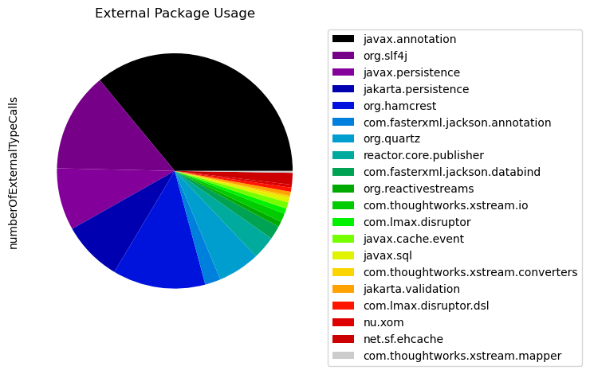
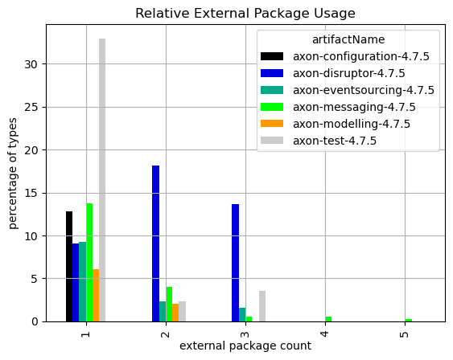

# External Dependencies of Java Artifacts with Neo4j
   

### References
- [jqassistant](https://jqassistant.org)
- [py2neo](https://py2neo.org/2021.1/)

## External Package Usage

### Table 1 - Top 20 most used external packages overall

<table border="1" class="dataframe">
  <thead>
    <tr style="text-align: right;">
      <th></th>
      <th>externalPackageName</th>
      <th>numberOfExternalTypeCaller</th>
      <th>numberOfExternalTypeCalls</th>
      <th>allTypes</th>
      <th>externalTypeNames</th>
    </tr>
  </thead>
  <tbody>
    <tr>
      <th>0</th>
      <td>javax.annotation</td>
      <td>324</td>
      <td>1406</td>
      <td>2503</td>
      <td>[Nonnull, Nullable, PreDestroy]</td>
    </tr>
    <tr>
      <th>1</th>
      <td>org.slf4j</td>
      <td>190</td>
      <td>534</td>
      <td>2503</td>
      <td>[Logger, LoggerFactory]</td>
    </tr>
    <tr>
      <th>2</th>
      <td>javax.persistence</td>
      <td>75</td>
      <td>334</td>
      <td>2503</td>
      <td>[Index, Table, Entity, EntityExistsException, ...</td>
    </tr>
    <tr>
      <th>3</th>
      <td>jakarta.persistence</td>
      <td>66</td>
      <td>322</td>
      <td>2503</td>
      <td>[Index, Table, Entity, EntityExistsException, ...</td>
    </tr>
    <tr>
      <th>4</th>
      <td>org.hamcrest</td>
      <td>61</td>
      <td>498</td>
      <td>2503</td>
      <td>[CoreMatchers, Matcher, Description, StringDes...</td>
    </tr>
    <tr>
      <th>5</th>
      <td>com.fasterxml.jackson.annotation</td>
      <td>54</td>
      <td>84</td>
      <td>2503</td>
      <td>[JsonProperty, JsonGetter, JsonTypeInfo, JsonT...</td>
    </tr>
    <tr>
      <th>6</th>
      <td>org.quartz</td>
      <td>37</td>
      <td>226</td>
      <td>2503</td>
      <td>[JobDataMap, Job, SchedulerContext, JobExecuti...</td>
    </tr>
    <tr>
      <th>7</th>
      <td>reactor.core.publisher</td>
      <td>31</td>
      <td>124</td>
      <td>2503</td>
      <td>[Mono, Flux, FluxSink$OverflowStrategy, FluxSi...</td>
    </tr>
    <tr>
      <th>8</th>
      <td>com.fasterxml.jackson.databind</td>
      <td>15</td>
      <td>73</td>
      <td>2503</td>
      <td>[DeserializationContext, JsonDeserializer, Jso...</td>
    </tr>
    <tr>
      <th>9</th>
      <td>org.reactivestreams</td>
      <td>12</td>
      <td>29</td>
      <td>2503</td>
      <td>[Publisher]</td>
    </tr>
    <tr>
      <th>10</th>
      <td>com.thoughtworks.xstream.io</td>
      <td>9</td>
      <td>46</td>
      <td>2503</td>
      <td>[HierarchicalStreamReader, HierarchicalStreamW...</td>
    </tr>
    <tr>
      <th>11</th>
      <td>com.lmax.disruptor</td>
      <td>9</td>
      <td>29</td>
      <td>2503</td>
      <td>[RingBuffer, LifecycleAware, EventHandler, Blo...</td>
    </tr>
    <tr>
      <th>12</th>
      <td>javax.cache.event</td>
      <td>8</td>
      <td>34</td>
      <td>2503</td>
      <td>[CacheEntryListener, CacheEntryExpiredListener...</td>
    </tr>
    <tr>
      <th>13</th>
      <td>javax.sql</td>
      <td>6</td>
      <td>24</td>
      <td>2503</td>
      <td>[DataSource]</td>
    </tr>
    <tr>
      <th>14</th>
      <td>com.thoughtworks.xstream.converters</td>
      <td>6</td>
      <td>12</td>
      <td>2503</td>
      <td>[MarshallingContext, UnmarshallingContext]</td>
    </tr>
    <tr>
      <th>15</th>
      <td>jakarta.validation</td>
      <td>5</td>
      <td>22</td>
      <td>2503</td>
      <td>[ConstraintViolation, Validator, ValidatorFact...</td>
    </tr>
    <tr>
      <th>16</th>
      <td>com.lmax.disruptor.dsl</td>
      <td>5</td>
      <td>22</td>
      <td>2503</td>
      <td>[Disruptor, EventHandlerGroup, ProducerType]</td>
    </tr>
    <tr>
      <th>17</th>
      <td>nu.xom</td>
      <td>5</td>
      <td>16</td>
      <td>2503</td>
      <td>[Document, Builder, ParsingException]</td>
    </tr>
    <tr>
      <th>18</th>
      <td>net.sf.ehcache</td>
      <td>5</td>
      <td>63</td>
      <td>2503</td>
      <td>[Ehcache, Element, CacheException]</td>
    </tr>
    <tr>
      <th>19</th>
      <td>com.thoughtworks.xstream.mapper</td>
      <td>5</td>
      <td>10</td>
      <td>2503</td>
      <td>[Mapper, CannotResolveClassException]</td>
    </tr>
  </tbody>
</table>

    <Figure size 640x480 with 0 Axes>

    

    

### Table 2 - Top 20 least used external packages overall

<table border="1" class="dataframe">
  <thead>
    <tr style="text-align: right;">
      <th></th>
      <th>externalPackageName</th>
      <th>numberOfExternalTypeCalls</th>
    </tr>
  </thead>
  <tbody>
    <tr>
      <th>0</th>
      <td>org.junit.rules</td>
      <td>1</td>
    </tr>
    <tr>
      <th>1</th>
      <td>org.junit.jupiter.api</td>
      <td>1</td>
    </tr>
    <tr>
      <th>2</th>
      <td>javax.xml.stream</td>
      <td>2</td>
    </tr>
    <tr>
      <th>3</th>
      <td>org.testcontainers.containers.wait.strategy</td>
      <td>2</td>
    </tr>
    <tr>
      <th>4</th>
      <td>com.fasterxml.jackson.datatype.jsr310</td>
      <td>2</td>
    </tr>
    <tr>
      <th>5</th>
      <td>org.quartz.impl.matchers</td>
      <td>2</td>
    </tr>
    <tr>
      <th>6</th>
      <td>reactor.core</td>
      <td>2</td>
    </tr>
    <tr>
      <th>7</th>
      <td>org.junit.runner</td>
      <td>2</td>
    </tr>
    <tr>
      <th>8</th>
      <td>com.fasterxml.jackson.databind.type</td>
      <td>3</td>
    </tr>
    <tr>
      <th>9</th>
      <td>reactor.util.concurrent</td>
      <td>3</td>
    </tr>
    <tr>
      <th>10</th>
      <td>com.fasterxml.jackson.databind.module</td>
      <td>3</td>
    </tr>
    <tr>
      <th>11</th>
      <td>org.dom4j.io</td>
      <td>3</td>
    </tr>
    <tr>
      <th>12</th>
      <td>com.fasterxml.jackson.databind.jsontype</td>
      <td>3</td>
    </tr>
    <tr>
      <th>13</th>
      <td>org.junit.jupiter.api.extension</td>
      <td>6</td>
    </tr>
    <tr>
      <th>14</th>
      <td>reactor.util.context</td>
      <td>7</td>
    </tr>
    <tr>
      <th>15</th>
      <td>com.thoughtworks.xstream.converters.collections</td>
      <td>7</td>
    </tr>
    <tr>
      <th>16</th>
      <td>org.junit.runners.model</td>
      <td>8</td>
    </tr>
    <tr>
      <th>17</th>
      <td>org.testcontainers.containers</td>
      <td>8</td>
    </tr>
    <tr>
      <th>18</th>
      <td>net.sf.ehcache.event</td>
      <td>9</td>
    </tr>
    <tr>
      <th>19</th>
      <td>com.thoughtworks.xstream.mapper</td>
      <td>10</td>
    </tr>
  </tbody>
</table>

### Table 3 - External usage per artifact

<table border="1" class="dataframe">
  <thead>
    <tr style="text-align: right;">
      <th></th>
      <th>artifactName</th>
      <th>externalPackageName</th>
      <th>numberOfExternalTypeCaller</th>
      <th>numberOfExternalTypeCalls</th>
      <th>numberOfTypesInArtifact</th>
      <th>externalTypeNames</th>
    </tr>
  </thead>
  <tbody>
    <tr>
      <th>0</th>
      <td>axon-configuration-4.7.5</td>
      <td>javax.annotation</td>
      <td>12</td>
      <td>104</td>
      <td>39</td>
      <td>[Nonnull]</td>
    </tr>
    <tr>
      <th>1</th>
      <td>axon-configuration-4.7.5</td>
      <td>org.slf4j</td>
      <td>9</td>
      <td>28</td>
      <td>39</td>
      <td>[Logger, LoggerFactory]</td>
    </tr>
    <tr>
      <th>2</th>
      <td>axon-disruptor-4.7.5</td>
      <td>org.slf4j</td>
      <td>12</td>
      <td>22</td>
      <td>22</td>
      <td>[Logger, LoggerFactory]</td>
    </tr>
    <tr>
      <th>3</th>
      <td>axon-disruptor-4.7.5</td>
      <td>com.lmax.disruptor</td>
      <td>9</td>
      <td>29</td>
      <td>22</td>
      <td>[LifecycleAware, EventHandler, BlockingWaitStr...</td>
    </tr>
    <tr>
      <th>4</th>
      <td>axon-disruptor-4.7.5</td>
      <td>javax.annotation</td>
      <td>6</td>
      <td>23</td>
      <td>22</td>
      <td>[Nonnull]</td>
    </tr>
    <tr>
      <th>...</th>
      <td>...</td>
      <td>...</td>
      <td>...</td>
      <td>...</td>
      <td>...</td>
      <td>...</td>
    </tr>
    <tr>
      <th>61</th>
      <td>axon-test-4.7.5</td>
      <td>org.testcontainers.containers.wait.strategy</td>
      <td>2</td>
      <td>2</td>
      <td>85</td>
      <td>[Wait]</td>
    </tr>
    <tr>
      <th>62</th>
      <td>axon-test-4.7.5</td>
      <td>org.testcontainers.containers</td>
      <td>2</td>
      <td>8</td>
      <td>85</td>
      <td>[GenericContainer]</td>
    </tr>
    <tr>
      <th>63</th>
      <td>axon-test-4.7.5</td>
      <td>org.junit.rules</td>
      <td>1</td>
      <td>1</td>
      <td>85</td>
      <td>[TestRule]</td>
    </tr>
    <tr>
      <th>64</th>
      <td>axon-test-4.7.5</td>
      <td>org.junit.runner</td>
      <td>1</td>
      <td>2</td>
      <td>85</td>
      <td>[Description]</td>
    </tr>
    <tr>
      <th>65</th>
      <td>axon-test-4.7.5</td>
      <td>org.junit.jupiter.api</td>
      <td>1</td>
      <td>1</td>
      <td>85</td>
      <td>[Assertions]</td>
    </tr>
  </tbody>
</table>

66 rows × 6 columns

### Table 4 - External usage per artifact and package

<table border="1" class="dataframe">
  <thead>
    <tr style="text-align: right;">
      <th></th>
      <th>artifactName</th>
      <th>fullPackageName</th>
      <th>externalPackageName</th>
      <th>numberOfExternalTypeCaller</th>
      <th>numberOfExternalTypeCalls</th>
      <th>numberOfTypesInPackage</th>
      <th>externalTypeNames</th>
      <th>packageName</th>
    </tr>
  </thead>
  <tbody>
    <tr>
      <th>0</th>
      <td>axon-test-4.7.5</td>
      <td>org.axonframework.test.matchers</td>
      <td>org.hamcrest</td>
      <td>38</td>
      <td>188</td>
      <td>24</td>
      <td>[Matcher, BaseMatcher, Description, TypeSafeMa...</td>
      <td>matchers</td>
    </tr>
    <tr>
      <th>1</th>
      <td>axon-messaging-4.7.5</td>
      <td>org.axonframework.queryhandling</td>
      <td>reactor.core.publisher</td>
      <td>24</td>
      <td>90</td>
      <td>40</td>
      <td>[Mono, Flux, FluxSink, FluxSink$OverflowStrate...</td>
      <td>queryhandling</td>
    </tr>
    <tr>
      <th>2</th>
      <td>axon-messaging-4.7.5</td>
      <td>org.axonframework.eventhandling.scheduling.quartz</td>
      <td>org.quartz</td>
      <td>19</td>
      <td>95</td>
      <td>6</td>
      <td>[JobExecutionContext, SchedulerContext, JobDet...</td>
      <td>quartz</td>
    </tr>
    <tr>
      <th>3</th>
      <td>axon-messaging-4.7.5</td>
      <td>org.axonframework.deadline.quartz</td>
      <td>org.quartz</td>
      <td>18</td>
      <td>131</td>
      <td>4</td>
      <td>[JobDataMap, Job, SchedulerContext, JobExecuti...</td>
      <td>quartz</td>
    </tr>
    <tr>
      <th>4</th>
      <td>axon-messaging-4.7.5</td>
      <td>org.axonframework.eventhandling</td>
      <td>org.slf4j</td>
      <td>15</td>
      <td>55</td>
      <td>93</td>
      <td>[Logger, LoggerFactory]</td>
      <td>eventhandling</td>
    </tr>
    <tr>
      <th>...</th>
      <td>...</td>
      <td>...</td>
      <td>...</td>
      <td>...</td>
      <td>...</td>
      <td>...</td>
      <td>...</td>
      <td>...</td>
    </tr>
    <tr>
      <th>119</th>
      <td>axon-modelling-4.7.5</td>
      <td>org.axonframework.modelling.saga.repository.jdbc</td>
      <td>javax.sql</td>
      <td>1</td>
      <td>2</td>
      <td>9</td>
      <td>[DataSource]</td>
      <td>jdbc</td>
    </tr>
    <tr>
      <th>120</th>
      <td>axon-modelling-4.7.5</td>
      <td>org.axonframework.modelling.saga.repository.jpa</td>
      <td>javax.persistence</td>
      <td>1</td>
      <td>2</td>
      <td>7</td>
      <td>[Index]</td>
      <td>jpa</td>
    </tr>
    <tr>
      <th>121</th>
      <td>axon-test-4.7.5</td>
      <td>org.axonframework.test.aggregate</td>
      <td>org.junit.rules</td>
      <td>1</td>
      <td>1</td>
      <td>19</td>
      <td>[TestRule]</td>
      <td>aggregate</td>
    </tr>
    <tr>
      <th>122</th>
      <td>axon-test-4.7.5</td>
      <td>org.axonframework.test.aggregate</td>
      <td>org.junit.runner</td>
      <td>1</td>
      <td>2</td>
      <td>19</td>
      <td>[Description]</td>
      <td>aggregate</td>
    </tr>
    <tr>
      <th>123</th>
      <td>axon-test-4.7.5</td>
      <td>org.axonframework.test.saga</td>
      <td>org.junit.jupiter.api</td>
      <td>1</td>
      <td>1</td>
      <td>21</td>
      <td>[Assertions]</td>
      <td>saga</td>
    </tr>
  </tbody>
</table>

124 rows × 8 columns

### Table 5 - Top 20 external package usage per type

<table border="1" class="dataframe">
  <thead>
    <tr style="text-align: right;">
      <th></th>
      <th>artifactName</th>
      <th>fullPackageName</th>
      <th>typeName</th>
      <th>numberOfExternalTypeCaller</th>
      <th>numberOfExternalTypeCalls</th>
      <th>numberOfExternalPackages</th>
      <th>numberOfExternalTypes</th>
      <th>externalPackageNames</th>
      <th>externalTypeNames</th>
      <th>packageName</th>
      <th>fullTypeName</th>
    </tr>
  </thead>
  <tbody>
    <tr>
      <th>0</th>
      <td>axon-messaging-4.7.5</td>
      <td>org.axonframework.serialization.json</td>
      <td>JacksonSerializer</td>
      <td>9</td>
      <td>29</td>
      <td>6</td>
      <td>9</td>
      <td>[com.fasterxml.jackson.databind, com.fasterxml...</td>
      <td>[com.fasterxml.jackson.databind.ObjectWriter, ...</td>
      <td>json</td>
      <td>org.axonframework.serialization.json.JacksonSe...</td>
    </tr>
    <tr>
      <th>1</th>
      <td>axon-messaging-4.7.5</td>
      <td>org.axonframework.serialization.xml</td>
      <td>XStreamSerializer</td>
      <td>7</td>
      <td>22</td>
      <td>5</td>
      <td>7</td>
      <td>[org.dom4j, com.thoughtworks.xstream, com.thou...</td>
      <td>[org.dom4j.Document, com.thoughtworks.xstream....</td>
      <td>xml</td>
      <td>org.axonframework.serialization.xml.XStreamSer...</td>
    </tr>
    <tr>
      <th>2</th>
      <td>axon-disruptor-4.7.5</td>
      <td>org.axonframework.disruptor.commandhandling</td>
      <td>DisruptorCommandBus$DisruptorRepository</td>
      <td>4</td>
      <td>14</td>
      <td>4</td>
      <td>4</td>
      <td>[javax.annotation, com.lmax.disruptor.dsl, com...</td>
      <td>[javax.annotation.Nonnull, com.lmax.disruptor....</td>
      <td>commandhandling</td>
      <td>org.axonframework.disruptor.commandhandling.Di...</td>
    </tr>
    <tr>
      <th>3</th>
      <td>axon-disruptor-4.7.5</td>
      <td>org.axonframework.disruptor.commandhandling</td>
      <td>DisruptorCommandBus</td>
      <td>6</td>
      <td>34</td>
      <td>4</td>
      <td>6</td>
      <td>[com.lmax.disruptor.dsl, org.slf4j, javax.anno...</td>
      <td>[com.lmax.disruptor.dsl.Disruptor, org.slf4j.L...</td>
      <td>commandhandling</td>
      <td>org.axonframework.disruptor.commandhandling.Di...</td>
    </tr>
    <tr>
      <th>4</th>
      <td>axon-messaging-4.7.5</td>
      <td>org.axonframework.deadline.quartz</td>
      <td>QuartzDeadlineManager</td>
      <td>13</td>
      <td>78</td>
      <td>4</td>
      <td>13</td>
      <td>[org.quartz, org.quartz.impl.matchers, org.slf...</td>
      <td>[org.quartz.SchedulerException, org.quartz.Sch...</td>
      <td>quartz</td>
      <td>org.axonframework.deadline.quartz.QuartzDeadli...</td>
    </tr>
    <tr>
      <th>5</th>
      <td>axon-messaging-4.7.5</td>
      <td>org.axonframework.messaging.responsetypes</td>
      <td>MultipleInstancesResponseType</td>
      <td>7</td>
      <td>17</td>
      <td>4</td>
      <td>7</td>
      <td>[org.slf4j, com.fasterxml.jackson.annotation, ...</td>
      <td>[org.slf4j.LoggerFactory, org.slf4j.Logger, co...</td>
      <td>responsetypes</td>
      <td>org.axonframework.messaging.responsetypes.Mult...</td>
    </tr>
    <tr>
      <th>6</th>
      <td>axon-messaging-4.7.5</td>
      <td>org.axonframework.queryhandling</td>
      <td>SimpleQueryUpdateEmitter</td>
      <td>13</td>
      <td>33</td>
      <td>4</td>
      <td>13</td>
      <td>[org.reactivestreams, reactor.core.publisher, ...</td>
      <td>[org.reactivestreams.Publisher, reactor.core.p...</td>
      <td>queryhandling</td>
      <td>org.axonframework.queryhandling.SimpleQueryUpd...</td>
    </tr>
    <tr>
      <th>7</th>
      <td>axon-messaging-4.7.5</td>
      <td>org.axonframework.serialization</td>
      <td>AbstractXStreamSerializer$MetaDataConverter</td>
      <td>6</td>
      <td>14</td>
      <td>4</td>
      <td>6</td>
      <td>[com.thoughtworks.xstream.converters, com.thou...</td>
      <td>[com.thoughtworks.xstream.converters.Marshalli...</td>
      <td>serialization</td>
      <td>org.axonframework.serialization.AbstractXStrea...</td>
    </tr>
    <tr>
      <th>8</th>
      <td>axon-messaging-4.7.5</td>
      <td>org.axonframework.serialization</td>
      <td>GapAwareTrackingTokenConverter$ReflectivelyCon...</td>
      <td>6</td>
      <td>25</td>
      <td>4</td>
      <td>6</td>
      <td>[com.thoughtworks.xstream.converters, com.thou...</td>
      <td>[com.thoughtworks.xstream.converters.Marshalli...</td>
      <td>serialization</td>
      <td>org.axonframework.serialization.GapAwareTracki...</td>
    </tr>
    <tr>
      <th>9</th>
      <td>axon-messaging-4.7.5</td>
      <td>org.axonframework.serialization</td>
      <td>GapAwareTrackingTokenConverter</td>
      <td>6</td>
      <td>25</td>
      <td>4</td>
      <td>6</td>
      <td>[com.thoughtworks.xstream.mapper, com.thoughtw...</td>
      <td>[com.thoughtworks.xstream.mapper.Mapper, com.t...</td>
      <td>serialization</td>
      <td>org.axonframework.serialization.GapAwareTracki...</td>
    </tr>
    <tr>
      <th>10</th>
      <td>axon-messaging-4.7.5</td>
      <td>org.axonframework.serialization.json</td>
      <td>MetaDataDeserializer</td>
      <td>6</td>
      <td>21</td>
      <td>4</td>
      <td>6</td>
      <td>[com.fasterxml.jackson.databind, com.fasterxml...</td>
      <td>[com.fasterxml.jackson.databind.Deserializatio...</td>
      <td>json</td>
      <td>org.axonframework.serialization.json.MetaDataD...</td>
    </tr>
    <tr>
      <th>11</th>
      <td>axon-disruptor-4.7.5</td>
      <td>org.axonframework.disruptor.commandhandling</td>
      <td>DisruptorCommandBus$ExceptionHandler</td>
      <td>3</td>
      <td>5</td>
      <td>3</td>
      <td>3</td>
      <td>[org.slf4j, com.lmax.disruptor, com.lmax.disru...</td>
      <td>[org.slf4j.Logger, com.lmax.disruptor.Exceptio...</td>
      <td>commandhandling</td>
      <td>org.axonframework.disruptor.commandhandling.Di...</td>
    </tr>
    <tr>
      <th>12</th>
      <td>axon-disruptor-4.7.5</td>
      <td>org.axonframework.disruptor.commandhandling</td>
      <td>BlacklistDetectingCallback</td>
      <td>4</td>
      <td>11</td>
      <td>3</td>
      <td>4</td>
      <td>[javax.annotation, org.slf4j, com.lmax.disruptor]</td>
      <td>[javax.annotation.Nonnull, org.slf4j.LoggerFac...</td>
      <td>commandhandling</td>
      <td>org.axonframework.disruptor.commandhandling.Bl...</td>
    </tr>
    <tr>
      <th>13</th>
      <td>axon-eventsourcing-4.7.5</td>
      <td>org.axonframework.eventsourcing.eventstore.jpa</td>
      <td>JpaEventStorageEngine</td>
      <td>6</td>
      <td>47</td>
      <td>3</td>
      <td>6</td>
      <td>[org.slf4j, javax.annotation, jakarta.persiste...</td>
      <td>[org.slf4j.LoggerFactory, javax.annotation.Non...</td>
      <td>jpa</td>
      <td>org.axonframework.eventsourcing.eventstore.jpa...</td>
    </tr>
    <tr>
      <th>14</th>
      <td>axon-eventsourcing-4.7.5</td>
      <td>org.axonframework.eventsourcing.eventstore.jpa</td>
      <td>SQLErrorCodesResolver</td>
      <td>4</td>
      <td>12</td>
      <td>3</td>
      <td>4</td>
      <td>[javax.sql, jakarta.persistence, org.slf4j]</td>
      <td>[javax.sql.DataSource, jakarta.persistence.Ent...</td>
      <td>jpa</td>
      <td>org.axonframework.eventsourcing.eventstore.jpa...</td>
    </tr>
    <tr>
      <th>15</th>
      <td>axon-eventsourcing-4.7.5</td>
      <td>org.axonframework.eventsourcing.eventstore.leg...</td>
      <td>JpaEventStorageEngine</td>
      <td>6</td>
      <td>47</td>
      <td>3</td>
      <td>6</td>
      <td>[javax.persistence, javax.annotation, org.slf4j]</td>
      <td>[javax.persistence.Query, javax.annotation.Non...</td>
      <td>legacyjpa</td>
      <td>org.axonframework.eventsourcing.eventstore.leg...</td>
    </tr>
    <tr>
      <th>16</th>
      <td>axon-eventsourcing-4.7.5</td>
      <td>org.axonframework.eventsourcing.eventstore.leg...</td>
      <td>SQLErrorCodesResolver</td>
      <td>4</td>
      <td>12</td>
      <td>3</td>
      <td>4</td>
      <td>[org.slf4j, javax.sql, javax.persistence]</td>
      <td>[org.slf4j.Logger, org.slf4j.LoggerFactory, ja...</td>
      <td>legacyjpa</td>
      <td>org.axonframework.eventsourcing.eventstore.leg...</td>
    </tr>
    <tr>
      <th>17</th>
      <td>axon-messaging-4.7.5</td>
      <td>org.axonframework.deadline.jobrunr</td>
      <td>JobRunrDeadlineManager</td>
      <td>5</td>
      <td>18</td>
      <td>3</td>
      <td>5</td>
      <td>[org.slf4j, javax.annotation, org.jobrunr.sche...</td>
      <td>[org.slf4j.Logger, javax.annotation.Nullable, ...</td>
      <td>jobrunr</td>
      <td>org.axonframework.deadline.jobrunr.JobRunrDead...</td>
    </tr>
    <tr>
      <th>18</th>
      <td>axon-messaging-4.7.5</td>
      <td>org.axonframework.eventhandling.deadletter.jpa</td>
      <td>JpaSequencedDeadLetterQueue</td>
      <td>7</td>
      <td>74</td>
      <td>3</td>
      <td>7</td>
      <td>[org.slf4j, jakarta.persistence, javax.annotat...</td>
      <td>[org.slf4j.LoggerFactory, org.slf4j.Logger, ja...</td>
      <td>jpa</td>
      <td>org.axonframework.eventhandling.deadletter.jpa...</td>
    </tr>
    <tr>
      <th>19</th>
      <td>axon-messaging-4.7.5</td>
      <td>org.axonframework.eventhandling.deadletter.leg...</td>
      <td>JpaSequencedDeadLetterQueue</td>
      <td>7</td>
      <td>74</td>
      <td>3</td>
      <td>7</td>
      <td>[javax.persistence, org.slf4j, javax.annotation]</td>
      <td>[javax.persistence.EntityManager, org.slf4j.Lo...</td>
      <td>legacyjpa</td>
      <td>org.axonframework.eventhandling.deadletter.leg...</td>
    </tr>
  </tbody>
</table>

### Table 6 - External package usage distribution per type

The table shown here only includes the first 20 rows at most which typically represents the most significant entries.
Have a look above to find out which types have the highest external package dependency usage.

<table border="1" class="dataframe">
  <thead>
    <tr style="text-align: right;">
      <th></th>
      <th>artifactName</th>
      <th>artifactTypes</th>
      <th>numberOfExternalPackages</th>
      <th>numberOfTypes</th>
      <th>numberOfTypesPercentage</th>
    </tr>
  </thead>
  <tbody>
    <tr>
      <th>0</th>
      <td>axon-configuration-4.7.5</td>
      <td>39</td>
      <td>1</td>
      <td>5</td>
      <td>12.820513</td>
    </tr>
    <tr>
      <th>1</th>
      <td>axon-disruptor-4.7.5</td>
      <td>22</td>
      <td>1</td>
      <td>2</td>
      <td>9.090909</td>
    </tr>
    <tr>
      <th>2</th>
      <td>axon-disruptor-4.7.5</td>
      <td>22</td>
      <td>2</td>
      <td>4</td>
      <td>18.181818</td>
    </tr>
    <tr>
      <th>3</th>
      <td>axon-disruptor-4.7.5</td>
      <td>22</td>
      <td>3</td>
      <td>3</td>
      <td>13.636364</td>
    </tr>
    <tr>
      <th>4</th>
      <td>axon-eventsourcing-4.7.5</td>
      <td>130</td>
      <td>1</td>
      <td>12</td>
      <td>9.230769</td>
    </tr>
    <tr>
      <th>5</th>
      <td>axon-eventsourcing-4.7.5</td>
      <td>130</td>
      <td>2</td>
      <td>3</td>
      <td>2.307692</td>
    </tr>
    <tr>
      <th>6</th>
      <td>axon-eventsourcing-4.7.5</td>
      <td>130</td>
      <td>3</td>
      <td>2</td>
      <td>1.538462</td>
    </tr>
    <tr>
      <th>7</th>
      <td>axon-messaging-4.7.5</td>
      <td>729</td>
      <td>1</td>
      <td>100</td>
      <td>13.717421</td>
    </tr>
    <tr>
      <th>8</th>
      <td>axon-messaging-4.7.5</td>
      <td>729</td>
      <td>2</td>
      <td>29</td>
      <td>3.978052</td>
    </tr>
    <tr>
      <th>9</th>
      <td>axon-messaging-4.7.5</td>
      <td>729</td>
      <td>3</td>
      <td>4</td>
      <td>0.548697</td>
    </tr>
    <tr>
      <th>10</th>
      <td>axon-messaging-4.7.5</td>
      <td>729</td>
      <td>4</td>
      <td>4</td>
      <td>0.548697</td>
    </tr>
    <tr>
      <th>11</th>
      <td>axon-messaging-4.7.5</td>
      <td>729</td>
      <td>5</td>
      <td>2</td>
      <td>0.274348</td>
    </tr>
    <tr>
      <th>12</th>
      <td>axon-modelling-4.7.5</td>
      <td>149</td>
      <td>1</td>
      <td>9</td>
      <td>6.040268</td>
    </tr>
    <tr>
      <th>13</th>
      <td>axon-modelling-4.7.5</td>
      <td>149</td>
      <td>2</td>
      <td>3</td>
      <td>2.013423</td>
    </tr>
    <tr>
      <th>14</th>
      <td>axon-test-4.7.5</td>
      <td>85</td>
      <td>1</td>
      <td>28</td>
      <td>32.941176</td>
    </tr>
    <tr>
      <th>15</th>
      <td>axon-test-4.7.5</td>
      <td>85</td>
      <td>2</td>
      <td>2</td>
      <td>2.352941</td>
    </tr>
    <tr>
      <th>16</th>
      <td>axon-test-4.7.5</td>
      <td>85</td>
      <td>3</td>
      <td>3</td>
      <td>3.529412</td>
    </tr>
  </tbody>
</table>

<table border="1" class="dataframe">
  <thead>
    <tr style="text-align: right;">
      <th>artifactName</th>
      <th>axon-configuration-4.7.5</th>
      <th>axon-disruptor-4.7.5</th>
      <th>axon-eventsourcing-4.7.5</th>
      <th>axon-messaging-4.7.5</th>
      <th>axon-modelling-4.7.5</th>
      <th>axon-test-4.7.5</th>
    </tr>
    <tr>
      <th>numberOfExternalPackages</th>
      <th></th>
      <th></th>
      <th></th>
      <th></th>
      <th></th>
      <th></th>
    </tr>
  </thead>
  <tbody>
    <tr>
      <th>1</th>
      <td>12.820513</td>
      <td>9.090909</td>
      <td>9.230769</td>
      <td>13.717421</td>
      <td>6.040268</td>
      <td>32.941176</td>
    </tr>
    <tr>
      <th>2</th>
      <td>0.000000</td>
      <td>18.181818</td>
      <td>2.307692</td>
      <td>3.978052</td>
      <td>2.013423</td>
      <td>2.352941</td>
    </tr>
    <tr>
      <th>3</th>
      <td>0.000000</td>
      <td>13.636364</td>
      <td>1.538462</td>
      <td>0.548697</td>
      <td>0.000000</td>
      <td>3.529412</td>
    </tr>
    <tr>
      <th>4</th>
      <td>0.000000</td>
      <td>0.000000</td>
      <td>0.000000</td>
      <td>0.548697</td>
      <td>0.000000</td>
      <td>0.000000</td>
    </tr>
    <tr>
      <th>5</th>
      <td>0.000000</td>
      <td>0.000000</td>
      <td>0.000000</td>
      <td>0.274348</td>
      <td>0.000000</td>
      <td>0.000000</td>
    </tr>
  </tbody>
</table>

    <Figure size 640x480 with 0 Axes>

    

    

## Maven POMs

### Table 7 - Maven POMs and their declared dependencies

<table border="1" class="dataframe">
  <thead>
    <tr style="text-align: right;">
      <th></th>
      <th>pom.artifactId</th>
      <th>pom.name</th>
      <th>scope</th>
      <th>dependency.optional</th>
      <th>dependentArtifact.group</th>
      <th>dependentArtifact.name</th>
    </tr>
  </thead>
  <tbody>
    <tr>
      <th>0</th>
      <td>axon-configuration</td>
      <td>Axon Framework - Configuration</td>
      <td>test</td>
      <td>False</td>
      <td>javax.inject</td>
      <td>javax.inject</td>
    </tr>
    <tr>
      <th>1</th>
      <td>axon-configuration</td>
      <td>Axon Framework - Configuration</td>
      <td>provided</td>
      <td>False</td>
      <td>com.google.code.findbugs</td>
      <td>jsr305</td>
    </tr>
    <tr>
      <th>2</th>
      <td>axon-configuration</td>
      <td>Axon Framework - Configuration</td>
      <td>test</td>
      <td>False</td>
      <td>org.quartz-scheduler</td>
      <td>quartz</td>
    </tr>
    <tr>
      <th>3</th>
      <td>axon-configuration</td>
      <td>Axon Framework - Configuration</td>
      <td>default</td>
      <td>True</td>
      <td>jakarta.annotation</td>
      <td>jakarta.annotation-api</td>
    </tr>
    <tr>
      <th>4</th>
      <td>axon-configuration</td>
      <td>Axon Framework - Configuration</td>
      <td>default</td>
      <td>False</td>
      <td>${project.groupId}</td>
      <td>axon-eventsourcing</td>
    </tr>
    <tr>
      <th>...</th>
      <td>...</td>
      <td>...</td>
      <td>...</td>
      <td>...</td>
      <td>...</td>
      <td>...</td>
    </tr>
    <tr>
      <th>104</th>
      <td>axon-test</td>
      <td>Axon Framework - Test Fixtures</td>
      <td>default</td>
      <td>True</td>
      <td>org.testcontainers</td>
      <td>testcontainers</td>
    </tr>
    <tr>
      <th>105</th>
      <td>axon-test</td>
      <td>Axon Framework - Test Fixtures</td>
      <td>default</td>
      <td>True</td>
      <td>org.hamcrest</td>
      <td>hamcrest-library</td>
    </tr>
    <tr>
      <th>106</th>
      <td>axon-test</td>
      <td>Axon Framework - Test Fixtures</td>
      <td>test</td>
      <td>False</td>
      <td>jakarta.persistence</td>
      <td>jakarta.persistence-api</td>
    </tr>
    <tr>
      <th>107</th>
      <td>axon-test</td>
      <td>Axon Framework - Test Fixtures</td>
      <td>default</td>
      <td>True</td>
      <td>org.hamcrest</td>
      <td>hamcrest</td>
    </tr>
    <tr>
      <th>108</th>
      <td>axon-test</td>
      <td>Axon Framework - Test Fixtures</td>
      <td>test</td>
      <td>False</td>
      <td>org.springframework</td>
      <td>spring-beans</td>
    </tr>
  </tbody>
</table>

109 rows × 6 columns

