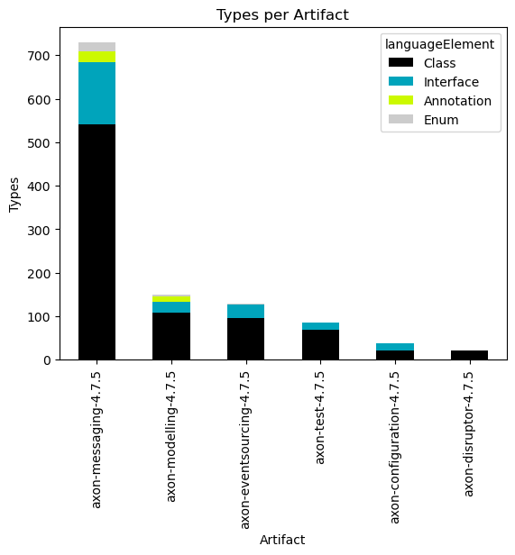
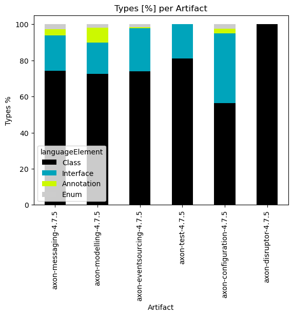
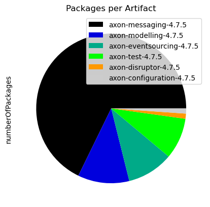
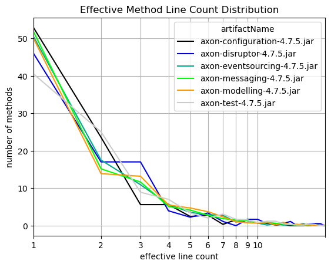
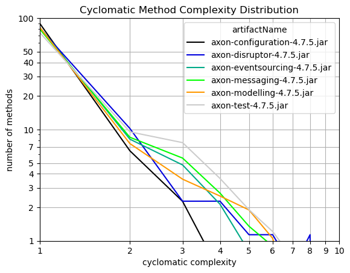

# Overview of Java Artifacts with Neo4j
   

### References
- [jqassistant](https://jqassistant.org)
- [py2neo](https://py2neo.org/2021.1/)

## Artifacts

### Table 1 - Types per artifact

<table border="1" class="dataframe">
  <thead>
    <tr style="text-align: right;">
      <th></th>
      <th>artifactName</th>
      <th>languageElement</th>
      <th>numberOfTypes</th>
    </tr>
  </thead>
  <tbody>
    <tr>
      <th>0</th>
      <td>axon-disruptor-4.7.5</td>
      <td>Class</td>
      <td>22</td>
    </tr>
    <tr>
      <th>1</th>
      <td>axon-eventsourcing-4.7.5</td>
      <td>Class</td>
      <td>96</td>
    </tr>
    <tr>
      <th>2</th>
      <td>axon-eventsourcing-4.7.5</td>
      <td>Interface</td>
      <td>31</td>
    </tr>
    <tr>
      <th>3</th>
      <td>axon-eventsourcing-4.7.5</td>
      <td>Annotation</td>
      <td>1</td>
    </tr>
    <tr>
      <th>4</th>
      <td>axon-eventsourcing-4.7.5</td>
      <td>Enum</td>
      <td>2</td>
    </tr>
    <tr>
      <th>5</th>
      <td>axon-test-4.7.5</td>
      <td>Class</td>
      <td>69</td>
    </tr>
    <tr>
      <th>6</th>
      <td>axon-test-4.7.5</td>
      <td>Interface</td>
      <td>16</td>
    </tr>
    <tr>
      <th>7</th>
      <td>axon-messaging-4.7.5</td>
      <td>Class</td>
      <td>541</td>
    </tr>
    <tr>
      <th>8</th>
      <td>axon-messaging-4.7.5</td>
      <td>Enum</td>
      <td>19</td>
    </tr>
    <tr>
      <th>9</th>
      <td>axon-messaging-4.7.5</td>
      <td>Interface</td>
      <td>143</td>
    </tr>
    <tr>
      <th>10</th>
      <td>axon-messaging-4.7.5</td>
      <td>Annotation</td>
      <td>26</td>
    </tr>
    <tr>
      <th>11</th>
      <td>axon-modelling-4.7.5</td>
      <td>Class</td>
      <td>108</td>
    </tr>
    <tr>
      <th>12</th>
      <td>axon-modelling-4.7.5</td>
      <td>Interface</td>
      <td>26</td>
    </tr>
    <tr>
      <th>13</th>
      <td>axon-modelling-4.7.5</td>
      <td>Annotation</td>
      <td>12</td>
    </tr>
    <tr>
      <th>14</th>
      <td>axon-modelling-4.7.5</td>
      <td>Enum</td>
      <td>3</td>
    </tr>
    <tr>
      <th>15</th>
      <td>axon-configuration-4.7.5</td>
      <td>Class</td>
      <td>22</td>
    </tr>
    <tr>
      <th>16</th>
      <td>axon-configuration-4.7.5</td>
      <td>Interface</td>
      <td>15</td>
    </tr>
    <tr>
      <th>17</th>
      <td>axon-configuration-4.7.5</td>
      <td>Enum</td>
      <td>1</td>
    </tr>
    <tr>
      <th>18</th>
      <td>axon-configuration-4.7.5</td>
      <td>Annotation</td>
      <td>1</td>
    </tr>
  </tbody>
</table>

### Table 2 - Types per artifact (grouped)

<table border="1" class="dataframe">
  <thead>
    <tr style="text-align: right;">
      <th>languageElement</th>
      <th>Class</th>
      <th>Interface</th>
      <th>Annotation</th>
      <th>Enum</th>
    </tr>
    <tr>
      <th>artifactName</th>
      <th></th>
      <th></th>
      <th></th>
      <th></th>
    </tr>
  </thead>
  <tbody>
    <tr>
      <th>axon-messaging-4.7.5</th>
      <td>541</td>
      <td>143</td>
      <td>26</td>
      <td>19</td>
    </tr>
    <tr>
      <th>axon-modelling-4.7.5</th>
      <td>108</td>
      <td>26</td>
      <td>12</td>
      <td>3</td>
    </tr>
    <tr>
      <th>axon-eventsourcing-4.7.5</th>
      <td>96</td>
      <td>31</td>
      <td>1</td>
      <td>2</td>
    </tr>
    <tr>
      <th>axon-test-4.7.5</th>
      <td>69</td>
      <td>16</td>
      <td>0</td>
      <td>0</td>
    </tr>
    <tr>
      <th>axon-configuration-4.7.5</th>
      <td>22</td>
      <td>15</td>
      <td>1</td>
      <td>1</td>
    </tr>
    <tr>
      <th>axon-disruptor-4.7.5</th>
      <td>22</td>
      <td>0</td>
      <td>0</td>
      <td>0</td>
    </tr>
  </tbody>
</table>

    <Figure size 640x480 with 0 Axes>

    

    

### Table 3 - Types per artifact (grouped and normalized in %)

<table border="1" class="dataframe">
  <thead>
    <tr style="text-align: right;">
      <th>languageElement</th>
      <th>Class</th>
      <th>Interface</th>
      <th>Annotation</th>
      <th>Enum</th>
    </tr>
    <tr>
      <th>artifactName</th>
      <th></th>
      <th></th>
      <th></th>
      <th></th>
    </tr>
  </thead>
  <tbody>
    <tr>
      <th>axon-messaging-4.7.5</th>
      <td>74.211248</td>
      <td>19.615912</td>
      <td>3.566529</td>
      <td>2.606310</td>
    </tr>
    <tr>
      <th>axon-modelling-4.7.5</th>
      <td>72.483221</td>
      <td>17.449664</td>
      <td>8.053691</td>
      <td>2.013423</td>
    </tr>
    <tr>
      <th>axon-eventsourcing-4.7.5</th>
      <td>73.846154</td>
      <td>23.846154</td>
      <td>0.769231</td>
      <td>1.538462</td>
    </tr>
    <tr>
      <th>axon-test-4.7.5</th>
      <td>81.176471</td>
      <td>18.823529</td>
      <td>0.000000</td>
      <td>0.000000</td>
    </tr>
    <tr>
      <th>axon-configuration-4.7.5</th>
      <td>56.410256</td>
      <td>38.461538</td>
      <td>2.564103</td>
      <td>2.564103</td>
    </tr>
    <tr>
      <th>axon-disruptor-4.7.5</th>
      <td>100.000000</td>
      <td>0.000000</td>
      <td>0.000000</td>
      <td>0.000000</td>
    </tr>
  </tbody>
</table>

    <Figure size 640x480 with 0 Axes>

    

    

### Table 4 - Number of packages per artifact

<table border="1" class="dataframe">
  <thead>
    <tr style="text-align: right;">
      <th></th>
      <th>numberOfPackages</th>
    </tr>
    <tr>
      <th>artifactName</th>
      <th></th>
    </tr>
  </thead>
  <tbody>
    <tr>
      <th>axon-messaging-4.7.5</th>
      <td>61</td>
    </tr>
    <tr>
      <th>axon-modelling-4.7.5</th>
      <td>10</td>
    </tr>
    <tr>
      <th>axon-eventsourcing-4.7.5</th>
      <td>9</td>
    </tr>
    <tr>
      <th>axon-test-4.7.5</th>
      <td>8</td>
    </tr>
    <tr>
      <th>axon-disruptor-4.7.5</th>
      <td>1</td>
    </tr>
    <tr>
      <th>axon-configuration-4.7.5</th>
      <td>1</td>
    </tr>
  </tbody>
</table>

    <Figure size 640x480 with 0 Axes>

    

    

## Effective Method Line Count

### Table 5 - Effective method line count distribution

The table shown here only includes the first 10 rows which typically represents the most significant entries.
Have a look below to find out which packages and methods have the highest effective lines of code.

<table border="1" class="dataframe">
  <thead>
    <tr style="text-align: right;">
      <th>artifactName</th>
      <th>axon-configuration-4.7.5.jar</th>
      <th>axon-disruptor-4.7.5.jar</th>
      <th>axon-eventsourcing-4.7.5.jar</th>
      <th>axon-messaging-4.7.5.jar</th>
      <th>axon-modelling-4.7.5.jar</th>
      <th>axon-test-4.7.5.jar</th>
    </tr>
    <tr>
      <th>effectiveLineCount</th>
      <th></th>
      <th></th>
      <th></th>
      <th></th>
      <th></th>
      <th></th>
    </tr>
  </thead>
  <tbody>
    <tr>
      <th>1</th>
      <td>300</td>
      <td>81</td>
      <td>567</td>
      <td>2442</td>
      <td>507</td>
      <td>236</td>
    </tr>
    <tr>
      <th>2</th>
      <td>134</td>
      <td>30</td>
      <td>197</td>
      <td>716</td>
      <td>141</td>
      <td>146</td>
    </tr>
    <tr>
      <th>3</th>
      <td>32</td>
      <td>30</td>
      <td>123</td>
      <td>550</td>
      <td>134</td>
      <td>52</td>
    </tr>
    <tr>
      <th>4</th>
      <td>32</td>
      <td>7</td>
      <td>64</td>
      <td>241</td>
      <td>56</td>
      <td>41</td>
    </tr>
    <tr>
      <th>5</th>
      <td>14</td>
      <td>4</td>
      <td>40</td>
      <td>197</td>
      <td>48</td>
      <td>20</td>
    </tr>
    <tr>
      <th>6</th>
      <td>16</td>
      <td>6</td>
      <td>33</td>
      <td>132</td>
      <td>38</td>
      <td>12</td>
    </tr>
    <tr>
      <th>7</th>
      <td>2</td>
      <td>2</td>
      <td>31</td>
      <td>89</td>
      <td>24</td>
      <td>18</td>
    </tr>
    <tr>
      <th>8</th>
      <td>9</td>
      <td>0</td>
      <td>11</td>
      <td>70</td>
      <td>11</td>
      <td>10</td>
    </tr>
    <tr>
      <th>9</th>
      <td>8</td>
      <td>3</td>
      <td>17</td>
      <td>65</td>
      <td>8</td>
      <td>9</td>
    </tr>
    <tr>
      <th>10</th>
      <td>4</td>
      <td>3</td>
      <td>8</td>
      <td>35</td>
      <td>7</td>
      <td>5</td>
    </tr>
  </tbody>
</table>

### Table 6 - Effective method line count distribution (normalized)

The table shown here only includes the first 10 rows which typically represents the most significant entries.
Have a look below to find out which packages and methods have the highest effective lines of code.

<table border="1" class="dataframe">
  <thead>
    <tr style="text-align: right;">
      <th>artifactName</th>
      <th>axon-configuration-4.7.5.jar</th>
      <th>axon-disruptor-4.7.5.jar</th>
      <th>axon-eventsourcing-4.7.5.jar</th>
      <th>axon-messaging-4.7.5.jar</th>
      <th>axon-modelling-4.7.5.jar</th>
      <th>axon-test-4.7.5.jar</th>
    </tr>
    <tr>
      <th>effectiveLineCount</th>
      <th></th>
      <th></th>
      <th></th>
      <th></th>
      <th></th>
      <th></th>
    </tr>
  </thead>
  <tbody>
    <tr>
      <th>1</th>
      <td>52.910053</td>
      <td>46.022727</td>
      <td>50.489760</td>
      <td>51.825127</td>
      <td>50.000000</td>
      <td>40.549828</td>
    </tr>
    <tr>
      <th>2</th>
      <td>23.633157</td>
      <td>17.045455</td>
      <td>17.542297</td>
      <td>15.195246</td>
      <td>13.905325</td>
      <td>25.085911</td>
    </tr>
    <tr>
      <th>3</th>
      <td>5.643739</td>
      <td>17.045455</td>
      <td>10.952805</td>
      <td>11.672326</td>
      <td>13.214990</td>
      <td>8.934708</td>
    </tr>
    <tr>
      <th>4</th>
      <td>5.643739</td>
      <td>3.977273</td>
      <td>5.699020</td>
      <td>5.114601</td>
      <td>5.522682</td>
      <td>7.044674</td>
    </tr>
    <tr>
      <th>5</th>
      <td>2.469136</td>
      <td>2.272727</td>
      <td>3.561888</td>
      <td>4.180815</td>
      <td>4.733728</td>
      <td>3.436426</td>
    </tr>
    <tr>
      <th>6</th>
      <td>2.821869</td>
      <td>3.409091</td>
      <td>2.938557</td>
      <td>2.801358</td>
      <td>3.747535</td>
      <td>2.061856</td>
    </tr>
    <tr>
      <th>7</th>
      <td>0.352734</td>
      <td>1.136364</td>
      <td>2.760463</td>
      <td>1.888795</td>
      <td>2.366864</td>
      <td>3.092784</td>
    </tr>
    <tr>
      <th>8</th>
      <td>1.587302</td>
      <td>0.000000</td>
      <td>0.979519</td>
      <td>1.485569</td>
      <td>1.084813</td>
      <td>1.718213</td>
    </tr>
    <tr>
      <th>9</th>
      <td>1.410935</td>
      <td>1.704545</td>
      <td>1.513802</td>
      <td>1.379457</td>
      <td>0.788955</td>
      <td>1.546392</td>
    </tr>
    <tr>
      <th>10</th>
      <td>0.705467</td>
      <td>1.704545</td>
      <td>0.712378</td>
      <td>0.742784</td>
      <td>0.690335</td>
      <td>0.859107</td>
    </tr>
  </tbody>
</table>

    <Figure size 640x480 with 0 Axes>

    

    

### Table 7 - Cyclomatic method complexity distribution

The table shown here only includes the first 10 rows which typically represents the most significant entries.
Have a look below to find out which packages and methods have the highest effective lines of code.

<table border="1" class="dataframe">
  <thead>
    <tr style="text-align: right;">
      <th>artifactName</th>
      <th>axon-configuration-4.7.5.jar</th>
      <th>axon-disruptor-4.7.5.jar</th>
      <th>axon-eventsourcing-4.7.5.jar</th>
      <th>axon-messaging-4.7.5.jar</th>
      <th>axon-modelling-4.7.5.jar</th>
      <th>axon-test-4.7.5.jar</th>
    </tr>
    <tr>
      <th>cyclomaticComplexity</th>
      <th></th>
      <th></th>
      <th></th>
      <th></th>
      <th></th>
      <th></th>
    </tr>
  </thead>
  <tbody>
    <tr>
      <th>1</th>
      <td>509</td>
      <td>143</td>
      <td>926</td>
      <td>3762</td>
      <td>835</td>
      <td>432</td>
    </tr>
    <tr>
      <th>2</th>
      <td>36</td>
      <td>18</td>
      <td>92</td>
      <td>402</td>
      <td>75</td>
      <td>55</td>
    </tr>
    <tr>
      <th>3</th>
      <td>13</td>
      <td>4</td>
      <td>54</td>
      <td>256</td>
      <td>37</td>
      <td>44</td>
    </tr>
    <tr>
      <th>4</th>
      <td>3</td>
      <td>4</td>
      <td>24</td>
      <td>127</td>
      <td>28</td>
      <td>21</td>
    </tr>
    <tr>
      <th>5</th>
      <td>3</td>
      <td>2</td>
      <td>9</td>
      <td>65</td>
      <td>22</td>
      <td>12</td>
    </tr>
    <tr>
      <th>6</th>
      <td>1</td>
      <td>2</td>
      <td>3</td>
      <td>43</td>
      <td>11</td>
      <td>7</td>
    </tr>
    <tr>
      <th>7</th>
      <td>2</td>
      <td>1</td>
      <td>7</td>
      <td>19</td>
      <td>2</td>
      <td>4</td>
    </tr>
    <tr>
      <th>8</th>
      <td>0</td>
      <td>2</td>
      <td>7</td>
      <td>10</td>
      <td>1</td>
      <td>3</td>
    </tr>
    <tr>
      <th>9</th>
      <td>0</td>
      <td>0</td>
      <td>0</td>
      <td>7</td>
      <td>2</td>
      <td>1</td>
    </tr>
    <tr>
      <th>10</th>
      <td>0</td>
      <td>0</td>
      <td>0</td>
      <td>4</td>
      <td>0</td>
      <td>1</td>
    </tr>
  </tbody>
</table>

### Table 8 - Cyclomatic method complexity distribution (normalized)

The table shown here only includes the first 10 rows which typically represents the most significant entries.
Have a look below to find out which packages and methods have the highest effective lines of code.

<table border="1" class="dataframe">
  <thead>
    <tr style="text-align: right;">
      <th>artifactName</th>
      <th>axon-configuration-4.7.5.jar</th>
      <th>axon-disruptor-4.7.5.jar</th>
      <th>axon-eventsourcing-4.7.5.jar</th>
      <th>axon-messaging-4.7.5.jar</th>
      <th>axon-modelling-4.7.5.jar</th>
      <th>axon-test-4.7.5.jar</th>
    </tr>
    <tr>
      <th>cyclomaticComplexity</th>
      <th></th>
      <th></th>
      <th></th>
      <th></th>
      <th></th>
      <th></th>
    </tr>
  </thead>
  <tbody>
    <tr>
      <th>1</th>
      <td>89.770723</td>
      <td>81.250000</td>
      <td>82.457703</td>
      <td>79.838710</td>
      <td>82.347140</td>
      <td>74.226804</td>
    </tr>
    <tr>
      <th>2</th>
      <td>6.349206</td>
      <td>10.227273</td>
      <td>8.192342</td>
      <td>8.531409</td>
      <td>7.396450</td>
      <td>9.450172</td>
    </tr>
    <tr>
      <th>3</th>
      <td>2.292769</td>
      <td>2.272727</td>
      <td>4.808549</td>
      <td>5.432937</td>
      <td>3.648915</td>
      <td>7.560137</td>
    </tr>
    <tr>
      <th>4</th>
      <td>0.529101</td>
      <td>2.272727</td>
      <td>2.137133</td>
      <td>2.695246</td>
      <td>2.761341</td>
      <td>3.608247</td>
    </tr>
    <tr>
      <th>5</th>
      <td>0.529101</td>
      <td>1.136364</td>
      <td>0.801425</td>
      <td>1.379457</td>
      <td>2.169625</td>
      <td>2.061856</td>
    </tr>
    <tr>
      <th>6</th>
      <td>0.176367</td>
      <td>1.136364</td>
      <td>0.267142</td>
      <td>0.912564</td>
      <td>1.084813</td>
      <td>1.202749</td>
    </tr>
    <tr>
      <th>7</th>
      <td>0.352734</td>
      <td>0.568182</td>
      <td>0.623330</td>
      <td>0.403226</td>
      <td>0.197239</td>
      <td>0.687285</td>
    </tr>
    <tr>
      <th>8</th>
      <td>0.000000</td>
      <td>1.136364</td>
      <td>0.623330</td>
      <td>0.212224</td>
      <td>0.098619</td>
      <td>0.515464</td>
    </tr>
    <tr>
      <th>9</th>
      <td>0.000000</td>
      <td>0.000000</td>
      <td>0.000000</td>
      <td>0.148557</td>
      <td>0.197239</td>
      <td>0.171821</td>
    </tr>
    <tr>
      <th>10</th>
      <td>0.000000</td>
      <td>0.000000</td>
      <td>0.000000</td>
      <td>0.084890</td>
      <td>0.000000</td>
      <td>0.171821</td>
    </tr>
  </tbody>
</table>

    <Figure size 640x480 with 0 Axes>

    

    

### Table 9 - Top 10 packages with highest effective line counts

<table border="1" class="dataframe">
  <thead>
    <tr style="text-align: right;">
      <th></th>
      <th>artifactName</th>
      <th>fullPackageName</th>
      <th>linesInPackage</th>
      <th>methodCount</th>
      <th>maxLinesMethod</th>
      <th>maxLinesMethodName</th>
    </tr>
  </thead>
  <tbody>
    <tr>
      <th>0</th>
      <td>axon-messaging-4.7.5</td>
      <td>org.axonframework.eventhandling</td>
      <td>2162</td>
      <td>774</td>
      <td>64</td>
      <td>processBatch</td>
    </tr>
    <tr>
      <th>1</th>
      <td>axon-configuration-4.7.5</td>
      <td>org.axonframework.config</td>
      <td>1461</td>
      <td>567</td>
      <td>42</td>
      <td>&lt;init&gt;</td>
    </tr>
    <tr>
      <th>2</th>
      <td>axon-messaging-4.7.5</td>
      <td>org.axonframework.eventhandling.pooled</td>
      <td>939</td>
      <td>308</td>
      <td>70</td>
      <td>run</td>
    </tr>
    <tr>
      <th>3</th>
      <td>axon-modelling-4.7.5</td>
      <td>org.axonframework.modelling.command</td>
      <td>782</td>
      <td>313</td>
      <td>17</td>
      <td>lambda$initializeHandler$7</td>
    </tr>
    <tr>
      <th>4</th>
      <td>axon-eventsourcing-4.7.5</td>
      <td>org.axonframework.eventsourcing.eventstore</td>
      <td>709</td>
      <td>262</td>
      <td>21</td>
      <td>peekPrivateStream</td>
    </tr>
    <tr>
      <th>5</th>
      <td>axon-messaging-4.7.5</td>
      <td>org.axonframework.messaging.annotation</td>
      <td>673</td>
      <td>239</td>
      <td>23</td>
      <td>&lt;init&gt;</td>
    </tr>
    <tr>
      <th>6</th>
      <td>axon-modelling-4.7.5</td>
      <td>org.axonframework.modelling.command.inspection</td>
      <td>637</td>
      <td>218</td>
      <td>26</td>
      <td>inspectFieldsAndMethods</td>
    </tr>
    <tr>
      <th>7</th>
      <td>axon-test-4.7.5</td>
      <td>org.axonframework.test.aggregate</td>
      <td>633</td>
      <td>170</td>
      <td>45</td>
      <td>appendEventOverview</td>
    </tr>
    <tr>
      <th>8</th>
      <td>axon-messaging-4.7.5</td>
      <td>org.axonframework.queryhandling</td>
      <td>628</td>
      <td>274</td>
      <td>14</td>
      <td>subscribe</td>
    </tr>
    <tr>
      <th>9</th>
      <td>axon-eventsourcing-4.7.5</td>
      <td>org.axonframework.eventsourcing</td>
      <td>582</td>
      <td>236</td>
      <td>20</td>
      <td>doScheduleSnapshot</td>
    </tr>
  </tbody>
</table>

### Table 10 - Top 10 methods with highest effective line counts

<table border="1" class="dataframe">
  <thead>
    <tr style="text-align: right;">
      <th></th>
      <th>artifactName</th>
      <th>fullPackageName</th>
      <th>maxLinesMethodType</th>
      <th>maxLinesMethodName</th>
      <th>maxLinesMethod</th>
    </tr>
  </thead>
  <tbody>
    <tr>
      <th>0</th>
      <td>axon-messaging-4.7.5</td>
      <td>org.axonframework.eventhandling.pooled</td>
      <td>Coordinator$CoordinationTask</td>
      <td>run</td>
      <td>70</td>
    </tr>
    <tr>
      <th>1</th>
      <td>axon-messaging-4.7.5</td>
      <td>org.axonframework.eventhandling</td>
      <td>TrackingEventProcessor</td>
      <td>processBatch</td>
      <td>64</td>
    </tr>
    <tr>
      <th>2</th>
      <td>axon-messaging-4.7.5</td>
      <td>org.axonframework.commandhandling.gateway</td>
      <td>CommandGatewayFactory</td>
      <td>createGateway</td>
      <td>50</td>
    </tr>
    <tr>
      <th>3</th>
      <td>axon-test-4.7.5</td>
      <td>org.axonframework.test.aggregate</td>
      <td>Reporter</td>
      <td>appendEventOverview</td>
      <td>45</td>
    </tr>
    <tr>
      <th>4</th>
      <td>axon-messaging-4.7.5</td>
      <td>org.axonframework.deadline.quartz</td>
      <td>DeadlineJob</td>
      <td>execute</td>
      <td>42</td>
    </tr>
    <tr>
      <th>5</th>
      <td>axon-configuration-4.7.5</td>
      <td>org.axonframework.config</td>
      <td>EventProcessingModule</td>
      <td>&lt;init&gt;</td>
      <td>42</td>
    </tr>
    <tr>
      <th>6</th>
      <td>axon-modelling-4.7.5</td>
      <td>org.axonframework.modelling.saga.repository.jdbc</td>
      <td>JdbcSagaStore</td>
      <td>updateSaga</td>
      <td>38</td>
    </tr>
    <tr>
      <th>7</th>
      <td>axon-messaging-4.7.5</td>
      <td>org.axonframework.messaging.deadletter</td>
      <td>InMemorySequencedDeadLetterQueue</td>
      <td>process</td>
      <td>33</td>
    </tr>
    <tr>
      <th>8</th>
      <td>axon-messaging-4.7.5</td>
      <td>org.axonframework.messaging.unitofwork</td>
      <td>BatchingUnitOfWork</td>
      <td>executeWithResult</td>
      <td>32</td>
    </tr>
    <tr>
      <th>9</th>
      <td>axon-disruptor-4.7.5</td>
      <td>org.axonframework.disruptor.commandhandling</td>
      <td>DisruptorCommandBus</td>
      <td>&lt;init&gt;</td>
      <td>32</td>
    </tr>
  </tbody>
</table>

### Table 11 - Top 10 methods with highest cyclomatic complexity

<table border="1" class="dataframe">
  <thead>
    <tr style="text-align: right;">
      <th></th>
      <th>artifactName</th>
      <th>fullPackageName</th>
      <th>maxComplexityType</th>
      <th>maxComplexityMethod</th>
      <th>maxComplexity</th>
    </tr>
  </thead>
  <tbody>
    <tr>
      <th>0</th>
      <td>axon-messaging-4.7.5</td>
      <td>org.axonframework.eventhandling.scheduling.job...</td>
      <td>JobRunrEventScheduler</td>
      <td>$deserializeLambda$</td>
      <td>40</td>
    </tr>
    <tr>
      <th>1</th>
      <td>axon-messaging-4.7.5</td>
      <td>org.axonframework.eventhandling</td>
      <td>TrackingEventProcessor</td>
      <td>processBatch</td>
      <td>21</td>
    </tr>
    <tr>
      <th>2</th>
      <td>axon-messaging-4.7.5</td>
      <td>org.axonframework.eventhandling.pooled</td>
      <td>Coordinator$CoordinationTask</td>
      <td>run</td>
      <td>21</td>
    </tr>
    <tr>
      <th>3</th>
      <td>axon-modelling-4.7.5</td>
      <td>org.axonframework.modelling.saga.repository</td>
      <td>AssociationValueMap$AssociationValueComparator</td>
      <td>compare</td>
      <td>16</td>
    </tr>
    <tr>
      <th>4</th>
      <td>axon-messaging-4.7.5</td>
      <td>org.axonframework.eventhandling.deadletter.jpa</td>
      <td>DeadLetterEventEntry</td>
      <td>equals</td>
      <td>15</td>
    </tr>
    <tr>
      <th>5</th>
      <td>axon-messaging-4.7.5</td>
      <td>org.axonframework.messaging.annotation</td>
      <td>AnnotatedMessageHandlingMember</td>
      <td>handle</td>
      <td>14</td>
    </tr>
    <tr>
      <th>6</th>
      <td>axon-messaging-4.7.5</td>
      <td>org.axonframework.commandhandling.distributed....</td>
      <td>CommandNameFilter</td>
      <td>$deserializeLambda$</td>
      <td>13</td>
    </tr>
    <tr>
      <th>7</th>
      <td>axon-messaging-4.7.5</td>
      <td>org.axonframework.deadline.jobrunr</td>
      <td>JobRunrDeadlineManager</td>
      <td>$deserializeLambda$</td>
      <td>13</td>
    </tr>
    <tr>
      <th>8</th>
      <td>axon-eventsourcing-4.7.5</td>
      <td>org.axonframework.eventsourcing.eventstore</td>
      <td>ConcatenatingDomainEventStream</td>
      <td>hasNext</td>
      <td>13</td>
    </tr>
    <tr>
      <th>9</th>
      <td>axon-messaging-4.7.5</td>
      <td>org.axonframework.common.jdbc</td>
      <td>ConnectionWrapperFactory</td>
      <td>lambda$wrap$0</td>
      <td>12</td>
    </tr>
  </tbody>
</table>

