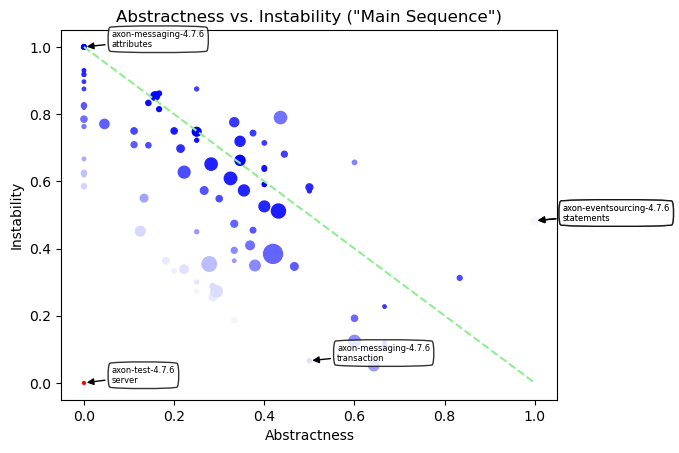

# Object Oriented Design Quality Metrics
   

### References
- [Analyze java package metrics in a graph database](https://joht.github.io/johtizen/data/2023/04/21/java-package-metrics-analysis.html)
- [Calculate metrics](https://101.jqassistant.org/calculate-metrics/index.html)
- [jqassistant](https://jqassistant.org)
- [notebook walks through examples for integrating various packages with Neo4j](https://nicolewhite.github.io/neo4j-jupyter/hello-world.html)
- [OO Design Quality Metrics](https://api.semanticscholar.org/CorpusID:18246616)
- [Neo4j Python Driver](https://neo4j.com/docs/api/python-driver/current)

## Incoming Dependencies

Incoming dependencies are also denoted as "Fan-in", "Afferent Couplings" or "in-degree".
These are the ones that use the listed package. 
   
If these packages get changed, the incoming dependencies might be affected by the change. The more incoming dependencies, the harder it gets to change the code without the need to adapt the dependent code (“rigid code”). Even worse, it might affect the behavior of the dependent code in an unwanted way (“fragile code”).
     
#### Table 2
- Show the top 20 packages with the most incoming dependencies
- Set the "incomingDependencies" properties on Package nodes.

<table border="1" class="dataframe">
  <thead>
    <tr style="text-align: right;">
      <th></th>
      <th>packageName</th>
      <th>incomingDependencies</th>
      <th>incomingDependenciesWeight</th>
      <th>incomingDependentTypes</th>
      <th>incomingDependentInterfaces</th>
      <th>incomingDependentPackages</th>
      <th>incomingDependentArtifacts</th>
    </tr>
  </thead>
  <tbody>
    <tr>
      <th>0</th>
      <td>org.axonframework.commandhandling.callbacks</td>
      <td>8</td>
      <td>27</td>
      <td>7</td>
      <td>0</td>
      <td>4</td>
      <td>2</td>
    </tr>
    <tr>
      <th>1</th>
      <td>org.axonframework.commandhandling.distributed</td>
      <td>50</td>
      <td>289</td>
      <td>24</td>
      <td>0</td>
      <td>2</td>
      <td>1</td>
    </tr>
    <tr>
      <th>2</th>
      <td>org.axonframework.commandhandling.distributed....</td>
      <td>12</td>
      <td>22</td>
      <td>6</td>
      <td>0</td>
      <td>2</td>
      <td>1</td>
    </tr>
    <tr>
      <th>3</th>
      <td>org.axonframework.commandhandling.gateway</td>
      <td>101</td>
      <td>409</td>
      <td>35</td>
      <td>0</td>
      <td>3</td>
      <td>3</td>
    </tr>
    <tr>
      <th>4</th>
      <td>org.axonframework.common</td>
      <td>423</td>
      <td>1070</td>
      <td>314</td>
      <td>0</td>
      <td>74</td>
      <td>6</td>
    </tr>
    <tr>
      <th>5</th>
      <td>org.axonframework.common.annotation</td>
      <td>22</td>
      <td>39</td>
      <td>22</td>
      <td>0</td>
      <td>10</td>
      <td>3</td>
    </tr>
    <tr>
      <th>6</th>
      <td>org.axonframework.common.caching</td>
      <td>30</td>
      <td>174</td>
      <td>19</td>
      <td>0</td>
      <td>5</td>
      <td>5</td>
    </tr>
    <tr>
      <th>7</th>
      <td>org.axonframework.common.digest</td>
      <td>1</td>
      <td>1</td>
      <td>1</td>
      <td>0</td>
      <td>1</td>
      <td>1</td>
    </tr>
    <tr>
      <th>8</th>
      <td>org.axonframework.common.io</td>
      <td>10</td>
      <td>21</td>
      <td>10</td>
      <td>0</td>
      <td>8</td>
      <td>2</td>
    </tr>
    <tr>
      <th>9</th>
      <td>org.axonframework.common.jdbc</td>
      <td>49</td>
      <td>269</td>
      <td>25</td>
      <td>0</td>
      <td>8</td>
      <td>4</td>
    </tr>
    <tr>
      <th>10</th>
      <td>org.axonframework.common.jpa</td>
      <td>16</td>
      <td>92</td>
      <td>15</td>
      <td>0</td>
      <td>7</td>
      <td>4</td>
    </tr>
    <tr>
      <th>11</th>
      <td>org.axonframework.common.legacyjpa</td>
      <td>14</td>
      <td>70</td>
      <td>13</td>
      <td>0</td>
      <td>6</td>
      <td>3</td>
    </tr>
    <tr>
      <th>12</th>
      <td>org.axonframework.common.lock</td>
      <td>42</td>
      <td>178</td>
      <td>21</td>
      <td>0</td>
      <td>7</td>
      <td>4</td>
    </tr>
    <tr>
      <th>13</th>
      <td>org.axonframework.common.property</td>
      <td>23</td>
      <td>50</td>
      <td>13</td>
      <td>0</td>
      <td>5</td>
      <td>2</td>
    </tr>
    <tr>
      <th>14</th>
      <td>org.axonframework.common.stream</td>
      <td>17</td>
      <td>77</td>
      <td>15</td>
      <td>0</td>
      <td>7</td>
      <td>3</td>
    </tr>
    <tr>
      <th>15</th>
      <td>org.axonframework.common.transaction</td>
      <td>85</td>
      <td>296</td>
      <td>67</td>
      <td>0</td>
      <td>24</td>
      <td>4</td>
    </tr>
    <tr>
      <th>16</th>
      <td>org.axonframework.deadline</td>
      <td>56</td>
      <td>360</td>
      <td>33</td>
      <td>0</td>
      <td>11</td>
      <td>4</td>
    </tr>
    <tr>
      <th>17</th>
      <td>org.axonframework.deadline.annotation</td>
      <td>6</td>
      <td>10</td>
      <td>3</td>
      <td>0</td>
      <td>1</td>
      <td>1</td>
    </tr>
    <tr>
      <th>18</th>
      <td>org.axonframework.deadline.quartz</td>
      <td>5</td>
      <td>28</td>
      <td>3</td>
      <td>0</td>
      <td>1</td>
      <td>1</td>
    </tr>
    <tr>
      <th>19</th>
      <td>org.axonframework.deadline.jobrunr</td>
      <td>3</td>
      <td>24</td>
      <td>2</td>
      <td>0</td>
      <td>1</td>
      <td>1</td>
    </tr>
  </tbody>
</table>

## Outgoing Dependencies

Outcoming dependencies are also denoted as "Fan-out", "Efferent Couplings" or "out-degree".
These are the ones that are used by the listed package. 

Code from other packages and libraries you’re depending on (outgoing) might change over time. The more outgoing changes, the more likely and frequently code changes are needed. This involves time and effort which can be reduced by automation of tests and version updates. Automated tests are crucial to reveal updates, that change the behavior of the code unexpectedly (“fragile code”). As soon as more effort is required, keeping up becomes difficult (“rigid code”). Not being able to use a newer version might not only restrict features, it can get problematic if there are security issues. This might force you to take “fast but ugly” solutions into account which further increases technical dept.
  
#### Table 3

- Show the top 20 packages with the most outgoing dependencies
- Set the "outgoingDependencies" properties on Package nodes.

<table border="1" class="dataframe">
  <thead>
    <tr style="text-align: right;">
      <th></th>
      <th>packageName</th>
      <th>outgoingDependencies</th>
      <th>outgoingDependenciesWeight</th>
      <th>outgoingDependentTypes</th>
      <th>outgoingDependentInterfaces</th>
      <th>outgoingDependentPackages</th>
      <th>outgoingDependentArtifacts</th>
    </tr>
  </thead>
  <tbody>
    <tr>
      <th>0</th>
      <td>org.axonframework.commandhandling.callbacks</td>
      <td>13</td>
      <td>47</td>
      <td>4</td>
      <td>0</td>
      <td>1</td>
      <td>1</td>
    </tr>
    <tr>
      <th>1</th>
      <td>org.axonframework.commandhandling.distributed</td>
      <td>128</td>
      <td>518</td>
      <td>67</td>
      <td>0</td>
      <td>11</td>
      <td>1</td>
    </tr>
    <tr>
      <th>2</th>
      <td>org.axonframework.commandhandling.distributed....</td>
      <td>20</td>
      <td>91</td>
      <td>7</td>
      <td>0</td>
      <td>3</td>
      <td>1</td>
    </tr>
    <tr>
      <th>3</th>
      <td>org.axonframework.commandhandling.gateway</td>
      <td>170</td>
      <td>645</td>
      <td>58</td>
      <td>0</td>
      <td>10</td>
      <td>1</td>
    </tr>
    <tr>
      <th>4</th>
      <td>org.axonframework.common</td>
      <td>23</td>
      <td>53</td>
      <td>15</td>
      <td>0</td>
      <td>1</td>
      <td>1</td>
    </tr>
    <tr>
      <th>5</th>
      <td>org.axonframework.common.annotation</td>
      <td>3</td>
      <td>4</td>
      <td>3</td>
      <td>0</td>
      <td>2</td>
      <td>1</td>
    </tr>
    <tr>
      <th>6</th>
      <td>org.axonframework.common.caching</td>
      <td>27</td>
      <td>131</td>
      <td>11</td>
      <td>0</td>
      <td>2</td>
      <td>1</td>
    </tr>
    <tr>
      <th>7</th>
      <td>org.axonframework.common.digest</td>
      <td>1</td>
      <td>4</td>
      <td>1</td>
      <td>0</td>
      <td>1</td>
      <td>1</td>
    </tr>
    <tr>
      <th>8</th>
      <td>org.axonframework.common.io</td>
      <td>0</td>
      <td>0</td>
      <td>0</td>
      <td>0</td>
      <td>0</td>
      <td>0</td>
    </tr>
    <tr>
      <th>9</th>
      <td>org.axonframework.common.jdbc</td>
      <td>26</td>
      <td>120</td>
      <td>18</td>
      <td>0</td>
      <td>4</td>
      <td>1</td>
    </tr>
    <tr>
      <th>10</th>
      <td>org.axonframework.common.jpa</td>
      <td>6</td>
      <td>18</td>
      <td>5</td>
      <td>0</td>
      <td>3</td>
      <td>1</td>
    </tr>
    <tr>
      <th>11</th>
      <td>org.axonframework.common.legacyjpa</td>
      <td>6</td>
      <td>18</td>
      <td>5</td>
      <td>0</td>
      <td>3</td>
      <td>1</td>
    </tr>
    <tr>
      <th>12</th>
      <td>org.axonframework.common.lock</td>
      <td>24</td>
      <td>92</td>
      <td>12</td>
      <td>0</td>
      <td>2</td>
      <td>1</td>
    </tr>
    <tr>
      <th>13</th>
      <td>org.axonframework.common.property</td>
      <td>15</td>
      <td>28</td>
      <td>8</td>
      <td>0</td>
      <td>2</td>
      <td>1</td>
    </tr>
    <tr>
      <th>14</th>
      <td>org.axonframework.common.stream</td>
      <td>5</td>
      <td>11</td>
      <td>3</td>
      <td>0</td>
      <td>1</td>
      <td>1</td>
    </tr>
    <tr>
      <th>15</th>
      <td>org.axonframework.common.transaction</td>
      <td>6</td>
      <td>16</td>
      <td>4</td>
      <td>0</td>
      <td>1</td>
      <td>1</td>
    </tr>
    <tr>
      <th>16</th>
      <td>org.axonframework.deadline</td>
      <td>68</td>
      <td>287</td>
      <td>43</td>
      <td>0</td>
      <td>8</td>
      <td>1</td>
    </tr>
    <tr>
      <th>17</th>
      <td>org.axonframework.deadline.annotation</td>
      <td>15</td>
      <td>38</td>
      <td>11</td>
      <td>0</td>
      <td>4</td>
      <td>1</td>
    </tr>
    <tr>
      <th>18</th>
      <td>org.axonframework.deadline.quartz</td>
      <td>56</td>
      <td>264</td>
      <td>38</td>
      <td>0</td>
      <td>10</td>
      <td>1</td>
    </tr>
    <tr>
      <th>19</th>
      <td>org.axonframework.deadline.jobrunr</td>
      <td>40</td>
      <td>198</td>
      <td>31</td>
      <td>0</td>
      <td>8</td>
      <td>1</td>
    </tr>
  </tbody>
</table>

## Instability

$$ Instability = \frac{Outgoing\:Dependencies}{Outgoing\:Dependencies + Incoming\:Dependencies} $$

*Instability* is expressed as the ratio of the number of outgoing dependencies of a module (i.e., the number of packages that depend on it) to the total number of dependencies (i.e., the sum of incoming and outgoing dependencies).

Small values near zero indicate low *Instability*. With no outgoing but some incoming dependencies the Instability is zero which is denoted as maximally stable. Such code units are more rigid and difficult to change without impacting other parts of the system. If they are changed less because of that, they are considered stable.

Conversely, high values approaching one indicate high *Instability*. With some outgoing dependencies but no incoming ones the *Instability* is denoted as maximally unstable. Such code units are easier to change without affecting other modules, making them more flexible and less prone to cascading changes throughout the system. If they are changed more often because of that, they are considered unstable.

#### Table 4

- Show the top 20 packages with the lowest *Instability*

<table border="1" class="dataframe">
  <thead>
    <tr style="text-align: right;">
      <th></th>
      <th>p.fqn</th>
      <th>p.name</th>
      <th>instability</th>
      <th>instabilityTypes</th>
      <th>instabilityInterfaces</th>
      <th>instabilityPackages</th>
      <th>instabilityArtifacts</th>
      <th>p.outgoingDependencies</th>
      <th>p.incomingDependencies</th>
      <th>p.outgoingDependentTypes</th>
      <th>p.incomingDependentTypes</th>
      <th>p.outgoingDependentInterfaces</th>
      <th>p.incomingDependentInterfaces</th>
      <th>p.outgoingDependentPackages</th>
      <th>p.incomingDependentPackages</th>
      <th>p.outgoingDependentArtifacts</th>
      <th>p.incomingDependentArtifacts</th>
    </tr>
  </thead>
  <tbody>
    <tr>
      <th>0</th>
      <td>org.axonframework.common</td>
      <td>common</td>
      <td>0.051570</td>
      <td>0.045593</td>
      <td>0.0</td>
      <td>0.013333</td>
      <td>0.142857</td>
      <td>23</td>
      <td>423</td>
      <td>15</td>
      <td>314</td>
      <td>0</td>
      <td>0</td>
      <td>1</td>
      <td>74</td>
      <td>1</td>
      <td>6</td>
    </tr>
    <tr>
      <th>1</th>
      <td>org.axonframework.common.transaction</td>
      <td>transaction</td>
      <td>0.065934</td>
      <td>0.056338</td>
      <td>0.0</td>
      <td>0.040000</td>
      <td>0.200000</td>
      <td>6</td>
      <td>85</td>
      <td>4</td>
      <td>67</td>
      <td>0</td>
      <td>0</td>
      <td>1</td>
      <td>24</td>
      <td>1</td>
      <td>4</td>
    </tr>
    <tr>
      <th>2</th>
      <td>org.axonframework.eventhandling.scheduling</td>
      <td>scheduling</td>
      <td>0.111111</td>
      <td>0.166667</td>
      <td>0.0</td>
      <td>0.250000</td>
      <td>0.250000</td>
      <td>2</td>
      <td>16</td>
      <td>2</td>
      <td>10</td>
      <td>0</td>
      <td>0</td>
      <td>2</td>
      <td>6</td>
      <td>1</td>
      <td>3</td>
    </tr>
    <tr>
      <th>3</th>
      <td>org.axonframework.common.annotation</td>
      <td>annotation</td>
      <td>0.120000</td>
      <td>0.120000</td>
      <td>0.0</td>
      <td>0.166667</td>
      <td>0.250000</td>
      <td>3</td>
      <td>22</td>
      <td>3</td>
      <td>22</td>
      <td>0</td>
      <td>0</td>
      <td>2</td>
      <td>10</td>
      <td>1</td>
      <td>3</td>
    </tr>
    <tr>
      <th>4</th>
      <td>org.axonframework.messaging</td>
      <td>messaging</td>
      <td>0.124194</td>
      <td>0.101449</td>
      <td>0.0</td>
      <td>0.107143</td>
      <td>0.142857</td>
      <td>77</td>
      <td>543</td>
      <td>35</td>
      <td>310</td>
      <td>0</td>
      <td>0</td>
      <td>6</td>
      <td>50</td>
      <td>1</td>
      <td>6</td>
    </tr>
    <tr>
      <th>5</th>
      <td>org.axonframework.monitoring</td>
      <td>monitoring</td>
      <td>0.186667</td>
      <td>0.152174</td>
      <td>0.0</td>
      <td>0.230769</td>
      <td>0.200000</td>
      <td>14</td>
      <td>61</td>
      <td>7</td>
      <td>39</td>
      <td>0</td>
      <td>0</td>
      <td>3</td>
      <td>10</td>
      <td>1</td>
      <td>4</td>
    </tr>
    <tr>
      <th>6</th>
      <td>org.axonframework.lifecycle</td>
      <td>lifecycle</td>
      <td>0.192308</td>
      <td>0.259259</td>
      <td>0.0</td>
      <td>0.214286</td>
      <td>0.250000</td>
      <td>10</td>
      <td>42</td>
      <td>7</td>
      <td>20</td>
      <td>0</td>
      <td>0</td>
      <td>3</td>
      <td>11</td>
      <td>1</td>
      <td>3</td>
    </tr>
    <tr>
      <th>7</th>
      <td>org.axonframework.common.stream</td>
      <td>stream</td>
      <td>0.227273</td>
      <td>0.166667</td>
      <td>0.0</td>
      <td>0.125000</td>
      <td>0.250000</td>
      <td>5</td>
      <td>17</td>
      <td>3</td>
      <td>15</td>
      <td>0</td>
      <td>0</td>
      <td>1</td>
      <td>7</td>
      <td>1</td>
      <td>3</td>
    </tr>
    <tr>
      <th>8</th>
      <td>org.axonframework.messaging.unitofwork</td>
      <td>unitofwork</td>
      <td>0.255411</td>
      <td>0.198020</td>
      <td>0.0</td>
      <td>0.128205</td>
      <td>0.142857</td>
      <td>59</td>
      <td>172</td>
      <td>20</td>
      <td>81</td>
      <td>0</td>
      <td>0</td>
      <td>5</td>
      <td>34</td>
      <td>1</td>
      <td>6</td>
    </tr>
    <tr>
      <th>9</th>
      <td>org.axonframework.common.jpa</td>
      <td>jpa</td>
      <td>0.272727</td>
      <td>0.250000</td>
      <td>0.0</td>
      <td>0.300000</td>
      <td>0.200000</td>
      <td>6</td>
      <td>16</td>
      <td>5</td>
      <td>15</td>
      <td>0</td>
      <td>0</td>
      <td>3</td>
      <td>7</td>
      <td>1</td>
      <td>4</td>
    </tr>
    <tr>
      <th>10</th>
      <td>org.axonframework.serialization</td>
      <td>serialization</td>
      <td>0.272727</td>
      <td>0.267442</td>
      <td>0.0</td>
      <td>0.230769</td>
      <td>0.200000</td>
      <td>111</td>
      <td>296</td>
      <td>46</td>
      <td>126</td>
      <td>0</td>
      <td>0</td>
      <td>9</td>
      <td>30</td>
      <td>1</td>
      <td>4</td>
    </tr>
    <tr>
      <th>11</th>
      <td>org.axonframework.eventhandling.tokenstore</td>
      <td>tokenstore</td>
      <td>0.287879</td>
      <td>0.342105</td>
      <td>0.0</td>
      <td>0.333333</td>
      <td>0.333333</td>
      <td>19</td>
      <td>47</td>
      <td>13</td>
      <td>25</td>
      <td>0</td>
      <td>0</td>
      <td>4</td>
      <td>8</td>
      <td>1</td>
      <td>2</td>
    </tr>
    <tr>
      <th>12</th>
      <td>org.axonframework.common.legacyjpa</td>
      <td>legacyjpa</td>
      <td>0.300000</td>
      <td>0.277778</td>
      <td>0.0</td>
      <td>0.333333</td>
      <td>0.250000</td>
      <td>6</td>
      <td>14</td>
      <td>5</td>
      <td>13</td>
      <td>0</td>
      <td>0</td>
      <td>3</td>
      <td>6</td>
      <td>1</td>
      <td>3</td>
    </tr>
    <tr>
      <th>13</th>
      <td>org.axonframework.serialization.upcasting</td>
      <td>upcasting</td>
      <td>0.312500</td>
      <td>0.083333</td>
      <td>0.0</td>
      <td>0.333333</td>
      <td>0.500000</td>
      <td>5</td>
      <td>11</td>
      <td>1</td>
      <td>11</td>
      <td>0</td>
      <td>0</td>
      <td>1</td>
      <td>2</td>
      <td>1</td>
      <td>1</td>
    </tr>
    <tr>
      <th>14</th>
      <td>org.axonframework.test</td>
      <td>test</td>
      <td>0.333333</td>
      <td>0.318182</td>
      <td>0.0</td>
      <td>0.400000</td>
      <td>0.666667</td>
      <td>8</td>
      <td>16</td>
      <td>7</td>
      <td>15</td>
      <td>0</td>
      <td>0</td>
      <td>4</td>
      <td>6</td>
      <td>2</td>
      <td>1</td>
    </tr>
    <tr>
      <th>15</th>
      <td>org.axonframework.tracing</td>
      <td>tracing</td>
      <td>0.338462</td>
      <td>0.293478</td>
      <td>0.0</td>
      <td>0.360000</td>
      <td>0.200000</td>
      <td>66</td>
      <td>129</td>
      <td>27</td>
      <td>65</td>
      <td>0</td>
      <td>0</td>
      <td>9</td>
      <td>16</td>
      <td>1</td>
      <td>4</td>
    </tr>
    <tr>
      <th>16</th>
      <td>org.axonframework.common.jdbc</td>
      <td>jdbc</td>
      <td>0.346667</td>
      <td>0.418605</td>
      <td>0.0</td>
      <td>0.333333</td>
      <td>0.200000</td>
      <td>26</td>
      <td>49</td>
      <td>18</td>
      <td>25</td>
      <td>0</td>
      <td>0</td>
      <td>4</td>
      <td>8</td>
      <td>1</td>
      <td>4</td>
    </tr>
    <tr>
      <th>17</th>
      <td>org.axonframework.commandhandling</td>
      <td>commandhandling</td>
      <td>0.349515</td>
      <td>0.362694</td>
      <td>0.0</td>
      <td>0.333333</td>
      <td>0.142857</td>
      <td>144</td>
      <td>268</td>
      <td>70</td>
      <td>123</td>
      <td>0</td>
      <td>0</td>
      <td>9</td>
      <td>18</td>
      <td>1</td>
      <td>6</td>
    </tr>
    <tr>
      <th>18</th>
      <td>org.axonframework.messaging.annotation</td>
      <td>annotation</td>
      <td>0.353846</td>
      <td>0.310185</td>
      <td>0.0</td>
      <td>0.218750</td>
      <td>0.142857</td>
      <td>184</td>
      <td>336</td>
      <td>67</td>
      <td>149</td>
      <td>0</td>
      <td>0</td>
      <td>7</td>
      <td>25</td>
      <td>1</td>
      <td>6</td>
    </tr>
    <tr>
      <th>19</th>
      <td>org.axonframework.common.lock</td>
      <td>lock</td>
      <td>0.363636</td>
      <td>0.363636</td>
      <td>0.0</td>
      <td>0.222222</td>
      <td>0.200000</td>
      <td>24</td>
      <td>42</td>
      <td>12</td>
      <td>21</td>
      <td>0</td>
      <td>0</td>
      <td>2</td>
      <td>7</td>
      <td>1</td>
      <td>4</td>
    </tr>
  </tbody>
</table>

## Abstractness

$$ Abstractness = \frac{abstract\:classes\:in\:category}{total\:number\:of\:classes\:in\:category} $$

Package *Abstractness* is expressed as the ratio of the number of abstract classes and interfaces to the total number of classes of a package.

Zero *Abstractness* means that there are no abstract types or interfaces in the package. On the other hand, a value of one means that there are only abstract types.

#### Table 5

- Show the top 30 packages with the lowest *Abstractness*

<table border="1" class="dataframe">
  <thead>
    <tr style="text-align: right;">
      <th></th>
      <th>fullQualifiedPackageName</th>
      <th>packageName</th>
      <th>abstractness</th>
      <th>numberAbstractTypes</th>
      <th>numberTypes</th>
    </tr>
  </thead>
  <tbody>
    <tr>
      <th>0</th>
      <td>org.axonframework.eventsourcing.eventstore.leg...</td>
      <td>legacyjpa</td>
      <td>0.000000</td>
      <td>0</td>
      <td>10</td>
    </tr>
    <tr>
      <th>1</th>
      <td>org.axonframework.commandhandling.distributed....</td>
      <td>commandfilter</td>
      <td>0.000000</td>
      <td>0</td>
      <td>7</td>
    </tr>
    <tr>
      <th>2</th>
      <td>org.axonframework.serialization.json</td>
      <td>json</td>
      <td>0.000000</td>
      <td>0</td>
      <td>7</td>
    </tr>
    <tr>
      <th>3</th>
      <td>org.axonframework.serialization.xml</td>
      <td>xml</td>
      <td>0.000000</td>
      <td>0</td>
      <td>7</td>
    </tr>
    <tr>
      <th>4</th>
      <td>org.axonframework.tracing.attributes</td>
      <td>attributes</td>
      <td>0.000000</td>
      <td>0</td>
      <td>6</td>
    </tr>
    <tr>
      <th>5</th>
      <td>org.axonframework.serialization.converters</td>
      <td>converters</td>
      <td>0.000000</td>
      <td>0</td>
      <td>5</td>
    </tr>
    <tr>
      <th>6</th>
      <td>org.axonframework.commandhandling.callbacks</td>
      <td>callbacks</td>
      <td>0.000000</td>
      <td>0</td>
      <td>4</td>
    </tr>
    <tr>
      <th>7</th>
      <td>org.axonframework.deadline.quartz</td>
      <td>quartz</td>
      <td>0.000000</td>
      <td>0</td>
      <td>4</td>
    </tr>
    <tr>
      <th>8</th>
      <td>org.axonframework.eventhandling.deadletter</td>
      <td>deadletter</td>
      <td>0.000000</td>
      <td>0</td>
      <td>4</td>
    </tr>
    <tr>
      <th>9</th>
      <td>org.axonframework.eventhandling.scheduling.java</td>
      <td>java</td>
      <td>0.000000</td>
      <td>0</td>
      <td>4</td>
    </tr>
    <tr>
      <th>10</th>
      <td>org.axonframework.eventhandling.tokenstore.jpa</td>
      <td>jpa</td>
      <td>0.000000</td>
      <td>0</td>
      <td>4</td>
    </tr>
    <tr>
      <th>11</th>
      <td>org.axonframework.deadline.jobrunr</td>
      <td>jobrunr</td>
      <td>0.000000</td>
      <td>0</td>
      <td>3</td>
    </tr>
    <tr>
      <th>12</th>
      <td>org.axonframework.eventhandling.scheduling.job...</td>
      <td>jobrunr</td>
      <td>0.000000</td>
      <td>0</td>
      <td>3</td>
    </tr>
    <tr>
      <th>13</th>
      <td>org.axonframework.util</td>
      <td>util</td>
      <td>0.000000</td>
      <td>0</td>
      <td>3</td>
    </tr>
    <tr>
      <th>14</th>
      <td>org.axonframework.modelling.saga.repository.le...</td>
      <td>legacyjpa</td>
      <td>0.000000</td>
      <td>0</td>
      <td>3</td>
    </tr>
    <tr>
      <th>15</th>
      <td>org.axonframework.eventhandling.tokenstore.inm...</td>
      <td>inmemory</td>
      <td>0.000000</td>
      <td>0</td>
      <td>2</td>
    </tr>
    <tr>
      <th>16</th>
      <td>org.axonframework.eventhandling.tokenstore.leg...</td>
      <td>legacyjpa</td>
      <td>0.000000</td>
      <td>0</td>
      <td>2</td>
    </tr>
    <tr>
      <th>17</th>
      <td>org.axonframework.messaging.interceptors.legac...</td>
      <td>legacyvalidation</td>
      <td>0.000000</td>
      <td>0</td>
      <td>2</td>
    </tr>
    <tr>
      <th>18</th>
      <td>org.axonframework.modelling.command.legacyjpa</td>
      <td>legacyjpa</td>
      <td>0.000000</td>
      <td>0</td>
      <td>2</td>
    </tr>
    <tr>
      <th>19</th>
      <td>org.axonframework.modelling.saga.repository.in...</td>
      <td>inmemory</td>
      <td>0.000000</td>
      <td>0</td>
      <td>2</td>
    </tr>
    <tr>
      <th>20</th>
      <td>org.axonframework.eventsourcing.eventstore.inm...</td>
      <td>inmemory</td>
      <td>0.000000</td>
      <td>0</td>
      <td>2</td>
    </tr>
    <tr>
      <th>21</th>
      <td>org.axonframework.test.server</td>
      <td>server</td>
      <td>0.000000</td>
      <td>0</td>
      <td>2</td>
    </tr>
    <tr>
      <th>22</th>
      <td>org.axonframework.common.digest</td>
      <td>digest</td>
      <td>0.000000</td>
      <td>0</td>
      <td>1</td>
    </tr>
    <tr>
      <th>23</th>
      <td>org.axonframework.common.io</td>
      <td>io</td>
      <td>0.000000</td>
      <td>0</td>
      <td>1</td>
    </tr>
    <tr>
      <th>24</th>
      <td>org.axonframework.eventhandling.interceptors</td>
      <td>interceptors</td>
      <td>0.000000</td>
      <td>0</td>
      <td>1</td>
    </tr>
    <tr>
      <th>25</th>
      <td>org.axonframework.disruptor.commandhandling</td>
      <td>commandhandling</td>
      <td>0.045455</td>
      <td>1</td>
      <td>22</td>
    </tr>
    <tr>
      <th>26</th>
      <td>org.axonframework.eventhandling.deadletter.jpa</td>
      <td>jpa</td>
      <td>0.111111</td>
      <td>1</td>
      <td>9</td>
    </tr>
    <tr>
      <th>27</th>
      <td>org.axonframework.eventhandling.tokenstore.jdbc</td>
      <td>jdbc</td>
      <td>0.111111</td>
      <td>1</td>
      <td>9</td>
    </tr>
    <tr>
      <th>28</th>
      <td>org.axonframework.modelling.saga.repository.jdbc</td>
      <td>jdbc</td>
      <td>0.111111</td>
      <td>1</td>
      <td>9</td>
    </tr>
    <tr>
      <th>29</th>
      <td>org.axonframework.test.matchers</td>
      <td>matchers</td>
      <td>0.125000</td>
      <td>3</td>
      <td>24</td>
    </tr>
  </tbody>
</table>

## Distance from the main sequence

The *main sequence* is a imaginary line that represents a good compromise between *Abstractness* and *Instability*. A high distance to this line may indicate problems. For example is very *stable* (rigid) code with low abstractness hard to change.

Read more details on that in [OO Design Quality Metrics](https://api.semanticscholar.org/CorpusID:18246616) and [Calculate metrics](https://101.jqassistant.org/calculate-metrics/index.html).

#### Table 6

- Show the top 30 packages with the highest distance from the "main sequence"

<table border="1" class="dataframe">
  <thead>
    <tr style="text-align: right;">
      <th></th>
      <th>artifactName</th>
      <th>fullQualifiedPackageName</th>
      <th>packageName</th>
      <th>distance</th>
      <th>abstractness</th>
      <th>instability</th>
      <th>typesInPackage</th>
    </tr>
  </thead>
  <tbody>
    <tr>
      <th>0</th>
      <td>axon-test-4.7.6</td>
      <td>org.axonframework.test.server</td>
      <td>server</td>
      <td>1.000000</td>
      <td>0.000000</td>
      <td>0.000000</td>
      <td>2</td>
    </tr>
    <tr>
      <th>1</th>
      <td>axon-messaging-4.7.6</td>
      <td>org.axonframework.common.io</td>
      <td>io</td>
      <td>1.000000</td>
      <td>0.000000</td>
      <td>0.000000</td>
      <td>1</td>
    </tr>
    <tr>
      <th>2</th>
      <td>axon-messaging-4.7.6</td>
      <td>org.axonframework.common.digest</td>
      <td>digest</td>
      <td>0.500000</td>
      <td>0.000000</td>
      <td>0.500000</td>
      <td>1</td>
    </tr>
    <tr>
      <th>3</th>
      <td>axon-eventsourcing-4.7.6</td>
      <td>org.axonframework.eventsourcing.eventstore.jdb...</td>
      <td>statements</td>
      <td>0.482759</td>
      <td>1.000000</td>
      <td>0.482759</td>
      <td>15</td>
    </tr>
    <tr>
      <th>4</th>
      <td>axon-messaging-4.7.6</td>
      <td>org.axonframework.monitoring</td>
      <td>monitoring</td>
      <td>0.480000</td>
      <td>0.333333</td>
      <td>0.186667</td>
      <td>6</td>
    </tr>
    <tr>
      <th>5</th>
      <td>axon-messaging-4.7.6</td>
      <td>org.axonframework.common.jpa</td>
      <td>jpa</td>
      <td>0.477273</td>
      <td>0.250000</td>
      <td>0.272727</td>
      <td>4</td>
    </tr>
    <tr>
      <th>6</th>
      <td>axon-test-4.7.6</td>
      <td>org.axonframework.test</td>
      <td>test</td>
      <td>0.466667</td>
      <td>0.200000</td>
      <td>0.333333</td>
      <td>5</td>
    </tr>
    <tr>
      <th>7</th>
      <td>axon-messaging-4.7.6</td>
      <td>org.axonframework.messaging.unitofwork</td>
      <td>unitofwork</td>
      <td>0.458874</td>
      <td>0.285714</td>
      <td>0.255411</td>
      <td>14</td>
    </tr>
    <tr>
      <th>8</th>
      <td>axon-messaging-4.7.6</td>
      <td>org.axonframework.common.lock</td>
      <td>lock</td>
      <td>0.454545</td>
      <td>0.181818</td>
      <td>0.363636</td>
      <td>11</td>
    </tr>
    <tr>
      <th>9</th>
      <td>axon-messaging-4.7.6</td>
      <td>org.axonframework.common.legacyjpa</td>
      <td>legacyjpa</td>
      <td>0.450000</td>
      <td>0.250000</td>
      <td>0.300000</td>
      <td>4</td>
    </tr>
    <tr>
      <th>10</th>
      <td>axon-messaging-4.7.6</td>
      <td>org.axonframework.tracing</td>
      <td>tracing</td>
      <td>0.439316</td>
      <td>0.222222</td>
      <td>0.338462</td>
      <td>18</td>
    </tr>
    <tr>
      <th>11</th>
      <td>axon-messaging-4.7.6</td>
      <td>org.axonframework.common.transaction</td>
      <td>transaction</td>
      <td>0.434066</td>
      <td>0.500000</td>
      <td>0.065934</td>
      <td>4</td>
    </tr>
    <tr>
      <th>12</th>
      <td>axon-messaging-4.7.6</td>
      <td>org.axonframework.serialization</td>
      <td>serialization</td>
      <td>0.433155</td>
      <td>0.294118</td>
      <td>0.272727</td>
      <td>34</td>
    </tr>
    <tr>
      <th>13</th>
      <td>axon-messaging-4.7.6</td>
      <td>org.axonframework.eventhandling.tokenstore</td>
      <td>tokenstore</td>
      <td>0.426407</td>
      <td>0.285714</td>
      <td>0.287879</td>
      <td>7</td>
    </tr>
    <tr>
      <th>14</th>
      <td>axon-test-4.7.6</td>
      <td>org.axonframework.test.matchers</td>
      <td>matchers</td>
      <td>0.423387</td>
      <td>0.125000</td>
      <td>0.451613</td>
      <td>24</td>
    </tr>
    <tr>
      <th>15</th>
      <td>axon-modelling-4.7.6</td>
      <td>org.axonframework.modelling.saga.repository.in...</td>
      <td>inmemory</td>
      <td>0.416667</td>
      <td>0.000000</td>
      <td>0.583333</td>
      <td>2</td>
    </tr>
    <tr>
      <th>16</th>
      <td>axon-messaging-4.7.6</td>
      <td>org.axonframework.serialization.xml</td>
      <td>xml</td>
      <td>0.414634</td>
      <td>0.000000</td>
      <td>0.585366</td>
      <td>7</td>
    </tr>
    <tr>
      <th>17</th>
      <td>axon-messaging-4.7.6</td>
      <td>org.axonframework.commandhandling.callbacks</td>
      <td>callbacks</td>
      <td>0.380952</td>
      <td>0.000000</td>
      <td>0.619048</td>
      <td>4</td>
    </tr>
    <tr>
      <th>18</th>
      <td>axon-messaging-4.7.6</td>
      <td>org.axonframework.commandhandling.distributed....</td>
      <td>commandfilter</td>
      <td>0.375000</td>
      <td>0.000000</td>
      <td>0.625000</td>
      <td>7</td>
    </tr>
    <tr>
      <th>19</th>
      <td>axon-messaging-4.7.6</td>
      <td>org.axonframework.messaging.annotation</td>
      <td>annotation</td>
      <td>0.368376</td>
      <td>0.277778</td>
      <td>0.353846</td>
      <td>54</td>
    </tr>
    <tr>
      <th>20</th>
      <td>axon-messaging-4.7.6</td>
      <td>org.axonframework.util</td>
      <td>util</td>
      <td>0.333333</td>
      <td>0.000000</td>
      <td>0.666667</td>
      <td>3</td>
    </tr>
    <tr>
      <th>21</th>
      <td>axon-messaging-4.7.6</td>
      <td>org.axonframework.eventhandling.async</td>
      <td>async</td>
      <td>0.316667</td>
      <td>0.133333</td>
      <td>0.550000</td>
      <td>15</td>
    </tr>
    <tr>
      <th>22</th>
      <td>axon-messaging-4.7.6</td>
      <td>org.axonframework.common</td>
      <td>common</td>
      <td>0.305573</td>
      <td>0.642857</td>
      <td>0.051570</td>
      <td>28</td>
    </tr>
    <tr>
      <th>23</th>
      <td>axon-eventsourcing-4.7.6</td>
      <td>org.axonframework.eventsourcing.snapshotting</td>
      <td>snapshotting</td>
      <td>0.303030</td>
      <td>0.333333</td>
      <td>0.363636</td>
      <td>3</td>
    </tr>
    <tr>
      <th>24</th>
      <td>axon-messaging-4.7.6</td>
      <td>org.axonframework.messaging.correlation</td>
      <td>correlation</td>
      <td>0.300000</td>
      <td>0.250000</td>
      <td>0.450000</td>
      <td>4</td>
    </tr>
    <tr>
      <th>25</th>
      <td>axon-messaging-4.7.6</td>
      <td>org.axonframework.messaging</td>
      <td>messaging</td>
      <td>0.275806</td>
      <td>0.600000</td>
      <td>0.124194</td>
      <td>35</td>
    </tr>
    <tr>
      <th>26</th>
      <td>axon-messaging-4.7.6</td>
      <td>org.axonframework.common.property</td>
      <td>property</td>
      <td>0.271930</td>
      <td>0.333333</td>
      <td>0.394737</td>
      <td>9</td>
    </tr>
    <tr>
      <th>27</th>
      <td>axon-messaging-4.7.6</td>
      <td>org.axonframework.commandhandling</td>
      <td>commandhandling</td>
      <td>0.271175</td>
      <td>0.379310</td>
      <td>0.349515</td>
      <td>29</td>
    </tr>
    <tr>
      <th>28</th>
      <td>axon-messaging-4.7.6</td>
      <td>org.axonframework.eventhandling.gateway</td>
      <td>gateway</td>
      <td>0.256250</td>
      <td>0.600000</td>
      <td>0.656250</td>
      <td>5</td>
    </tr>
    <tr>
      <th>29</th>
      <td>axon-messaging-4.7.6</td>
      <td>org.axonframework.eventhandling.tokenstore.jpa</td>
      <td>jpa</td>
      <td>0.236842</td>
      <td>0.000000</td>
      <td>0.763158</td>
      <td>4</td>
    </tr>
  </tbody>
</table>

### *Abstractness* vs. *Instability* Plot with "Main Sequence" line as reference

#### Figure 1
- Plot *Abstractness* vs. *Instability* of all packages
- Draw the "main sequence" as dashed green line 
- Scale the packages by the number of types they contain
- Color the packages by their distance to the "main sequence" (blue=near, red=far)

    'server'

    

    

