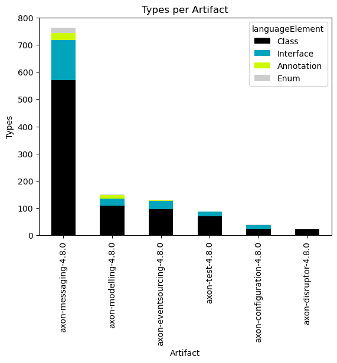
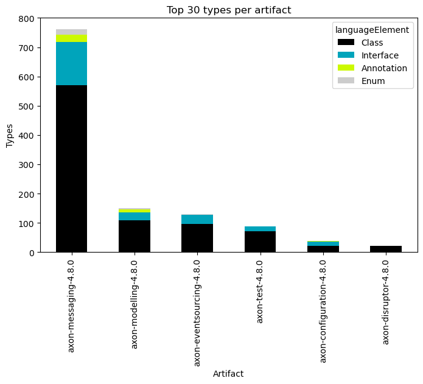
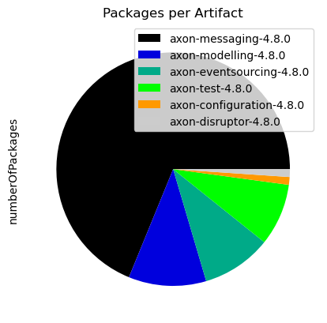
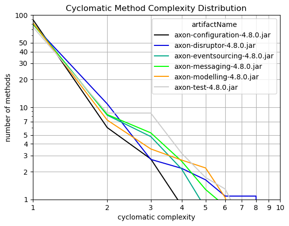

# Overview
   

### References
- [jqassistant](https://jqassistant.org)
- [py2neo](https://py2neo.org/2021.1/)

## Artifacts

### Table 1 - Types per artifact

<table border="1" class="dataframe">
  <thead>
    <tr style="text-align: right;">
      <th></th>
      <th>artifactName</th>
      <th>languageElement</th>
      <th>numberOfTypes</th>
    </tr>
  </thead>
  <tbody>
    <tr>
      <th>0</th>
      <td>axon-eventsourcing-4.8.0</td>
      <td>Interface</td>
      <td>31</td>
    </tr>
    <tr>
      <th>1</th>
      <td>axon-eventsourcing-4.8.0</td>
      <td>Class</td>
      <td>96</td>
    </tr>
    <tr>
      <th>2</th>
      <td>axon-eventsourcing-4.8.0</td>
      <td>Annotation</td>
      <td>1</td>
    </tr>
    <tr>
      <th>3</th>
      <td>axon-eventsourcing-4.8.0</td>
      <td>Enum</td>
      <td>2</td>
    </tr>
    <tr>
      <th>4</th>
      <td>axon-disruptor-4.8.0</td>
      <td>Class</td>
      <td>22</td>
    </tr>
    <tr>
      <th>5</th>
      <td>axon-messaging-4.8.0</td>
      <td>Class</td>
      <td>570</td>
    </tr>
    <tr>
      <th>6</th>
      <td>axon-messaging-4.8.0</td>
      <td>Annotation</td>
      <td>26</td>
    </tr>
    <tr>
      <th>7</th>
      <td>axon-messaging-4.8.0</td>
      <td>Interface</td>
      <td>147</td>
    </tr>
    <tr>
      <th>8</th>
      <td>axon-messaging-4.8.0</td>
      <td>Enum</td>
      <td>19</td>
    </tr>
    <tr>
      <th>9</th>
      <td>axon-configuration-4.8.0</td>
      <td>Class</td>
      <td>22</td>
    </tr>
    <tr>
      <th>10</th>
      <td>axon-configuration-4.8.0</td>
      <td>Interface</td>
      <td>15</td>
    </tr>
    <tr>
      <th>11</th>
      <td>axon-configuration-4.8.0</td>
      <td>Enum</td>
      <td>1</td>
    </tr>
    <tr>
      <th>12</th>
      <td>axon-configuration-4.8.0</td>
      <td>Annotation</td>
      <td>1</td>
    </tr>
    <tr>
      <th>13</th>
      <td>axon-test-4.8.0</td>
      <td>Class</td>
      <td>71</td>
    </tr>
    <tr>
      <th>14</th>
      <td>axon-test-4.8.0</td>
      <td>Interface</td>
      <td>16</td>
    </tr>
    <tr>
      <th>15</th>
      <td>axon-modelling-4.8.0</td>
      <td>Class</td>
      <td>109</td>
    </tr>
    <tr>
      <th>16</th>
      <td>axon-modelling-4.8.0</td>
      <td>Enum</td>
      <td>3</td>
    </tr>
    <tr>
      <th>17</th>
      <td>axon-modelling-4.8.0</td>
      <td>Annotation</td>
      <td>12</td>
    </tr>
    <tr>
      <th>18</th>
      <td>axon-modelling-4.8.0</td>
      <td>Interface</td>
      <td>26</td>
    </tr>
  </tbody>
</table>

### Table 2 - Types per artifact (grouped)

<table border="1" class="dataframe">
  <thead>
    <tr style="text-align: right;">
      <th>languageElement</th>
      <th>Class</th>
      <th>Interface</th>
      <th>Annotation</th>
      <th>Enum</th>
    </tr>
    <tr>
      <th>artifactName</th>
      <th></th>
      <th></th>
      <th></th>
      <th></th>
    </tr>
  </thead>
  <tbody>
    <tr>
      <th>axon-messaging-4.8.0</th>
      <td>570</td>
      <td>147</td>
      <td>26</td>
      <td>19</td>
    </tr>
    <tr>
      <th>axon-modelling-4.8.0</th>
      <td>109</td>
      <td>26</td>
      <td>12</td>
      <td>3</td>
    </tr>
    <tr>
      <th>axon-eventsourcing-4.8.0</th>
      <td>96</td>
      <td>31</td>
      <td>1</td>
      <td>2</td>
    </tr>
    <tr>
      <th>axon-test-4.8.0</th>
      <td>71</td>
      <td>16</td>
      <td>0</td>
      <td>0</td>
    </tr>
    <tr>
      <th>axon-configuration-4.8.0</th>
      <td>22</td>
      <td>15</td>
      <td>1</td>
      <td>1</td>
    </tr>
    <tr>
      <th>axon-disruptor-4.8.0</th>
      <td>22</td>
      <td>0</td>
      <td>0</td>
      <td>0</td>
    </tr>
  </tbody>
</table>

    <Figure size 640x480 with 0 Axes>

    

    

### Table 3 - Types per artifact (grouped and normalized in %)

<table border="1" class="dataframe">
  <thead>
    <tr style="text-align: right;">
      <th>languageElement</th>
      <th>Class</th>
      <th>Interface</th>
      <th>Annotation</th>
      <th>Enum</th>
    </tr>
    <tr>
      <th>artifactName</th>
      <th></th>
      <th></th>
      <th></th>
      <th></th>
    </tr>
  </thead>
  <tbody>
    <tr>
      <th>axon-messaging-4.8.0</th>
      <td>74.803150</td>
      <td>19.291339</td>
      <td>3.412073</td>
      <td>2.493438</td>
    </tr>
    <tr>
      <th>axon-modelling-4.8.0</th>
      <td>72.666667</td>
      <td>17.333333</td>
      <td>8.000000</td>
      <td>2.000000</td>
    </tr>
    <tr>
      <th>axon-eventsourcing-4.8.0</th>
      <td>73.846154</td>
      <td>23.846154</td>
      <td>0.769231</td>
      <td>1.538462</td>
    </tr>
    <tr>
      <th>axon-test-4.8.0</th>
      <td>81.609195</td>
      <td>18.390805</td>
      <td>0.000000</td>
      <td>0.000000</td>
    </tr>
    <tr>
      <th>axon-configuration-4.8.0</th>
      <td>56.410256</td>
      <td>38.461538</td>
      <td>2.564103</td>
      <td>2.564103</td>
    </tr>
    <tr>
      <th>axon-disruptor-4.8.0</th>
      <td>100.000000</td>
      <td>0.000000</td>
      <td>0.000000</td>
      <td>0.000000</td>
    </tr>
  </tbody>
</table>

    <Figure size 640x480 with 0 Axes>

    

    

### Table 4 - Number of packages per artifact

<table border="1" class="dataframe">
  <thead>
    <tr style="text-align: right;">
      <th></th>
      <th>numberOfPackages</th>
    </tr>
    <tr>
      <th>artifactName</th>
      <th></th>
    </tr>
  </thead>
  <tbody>
    <tr>
      <th>axon-messaging-4.8.0</th>
      <td>64</td>
    </tr>
    <tr>
      <th>axon-modelling-4.8.0</th>
      <td>10</td>
    </tr>
    <tr>
      <th>axon-eventsourcing-4.8.0</th>
      <td>9</td>
    </tr>
    <tr>
      <th>axon-test-4.8.0</th>
      <td>8</td>
    </tr>
    <tr>
      <th>axon-disruptor-4.8.0</th>
      <td>1</td>
    </tr>
    <tr>
      <th>axon-configuration-4.8.0</th>
      <td>1</td>
    </tr>
  </tbody>
</table>

    <Figure size 640x480 with 0 Axes>

    

    

## Effective Method Line Count

### Table 5 - Effective method line count distribution

The table shown here only includes the first 10 rows which typically represents the most significant entries.
Have a look below to find out which packages and methods have the highest effective lines of code.

<table border="1" class="dataframe">
  <thead>
    <tr style="text-align: right;">
      <th>artifactName</th>
      <th>axon-configuration-4.8.0.jar</th>
      <th>axon-disruptor-4.8.0.jar</th>
      <th>axon-eventsourcing-4.8.0.jar</th>
      <th>axon-messaging-4.8.0.jar</th>
      <th>axon-modelling-4.8.0.jar</th>
      <th>axon-test-4.8.0.jar</th>
    </tr>
    <tr>
      <th>effectiveLineCount</th>
      <th></th>
      <th></th>
      <th></th>
      <th></th>
      <th></th>
      <th></th>
    </tr>
  </thead>
  <tbody>
    <tr>
      <th>1</th>
      <td>308</td>
      <td>84</td>
      <td>567</td>
      <td>2736</td>
      <td>524</td>
      <td>279</td>
    </tr>
    <tr>
      <th>2</th>
      <td>135</td>
      <td>31</td>
      <td>197</td>
      <td>788</td>
      <td>146</td>
      <td>168</td>
    </tr>
    <tr>
      <th>3</th>
      <td>35</td>
      <td>30</td>
      <td>123</td>
      <td>642</td>
      <td>136</td>
      <td>64</td>
    </tr>
    <tr>
      <th>4</th>
      <td>32</td>
      <td>8</td>
      <td>64</td>
      <td>271</td>
      <td>56</td>
      <td>49</td>
    </tr>
    <tr>
      <th>5</th>
      <td>16</td>
      <td>5</td>
      <td>40</td>
      <td>216</td>
      <td>45</td>
      <td>24</td>
    </tr>
    <tr>
      <th>6</th>
      <td>16</td>
      <td>6</td>
      <td>33</td>
      <td>150</td>
      <td>44</td>
      <td>18</td>
    </tr>
    <tr>
      <th>7</th>
      <td>2</td>
      <td>2</td>
      <td>31</td>
      <td>98</td>
      <td>22</td>
      <td>20</td>
    </tr>
    <tr>
      <th>8</th>
      <td>7</td>
      <td>0</td>
      <td>11</td>
      <td>81</td>
      <td>10</td>
      <td>11</td>
    </tr>
    <tr>
      <th>9</th>
      <td>8</td>
      <td>4</td>
      <td>17</td>
      <td>72</td>
      <td>17</td>
      <td>11</td>
    </tr>
    <tr>
      <th>10</th>
      <td>6</td>
      <td>3</td>
      <td>8</td>
      <td>47</td>
      <td>8</td>
      <td>3</td>
    </tr>
  </tbody>
</table>

### Table 6 - Effective method line count distribution (normalized)

The table shown here only includes the first 10 rows which typically represents the most significant entries.
Have a look below to find out which packages and methods have the highest effective lines of code.

<table border="1" class="dataframe">
  <thead>
    <tr style="text-align: right;">
      <th>artifactName</th>
      <th>axon-configuration-4.8.0.jar</th>
      <th>axon-disruptor-4.8.0.jar</th>
      <th>axon-eventsourcing-4.8.0.jar</th>
      <th>axon-messaging-4.8.0.jar</th>
      <th>axon-modelling-4.8.0.jar</th>
      <th>axon-test-4.8.0.jar</th>
    </tr>
    <tr>
      <th>effectiveLineCount</th>
      <th></th>
      <th></th>
      <th></th>
      <th></th>
      <th></th>
      <th></th>
    </tr>
  </thead>
  <tbody>
    <tr>
      <th>1</th>
      <td>52.920962</td>
      <td>45.652174</td>
      <td>50.489760</td>
      <td>51.554551</td>
      <td>50.000000</td>
      <td>40.201729</td>
    </tr>
    <tr>
      <th>2</th>
      <td>23.195876</td>
      <td>16.847826</td>
      <td>17.542297</td>
      <td>14.848314</td>
      <td>13.931298</td>
      <td>24.207493</td>
    </tr>
    <tr>
      <th>3</th>
      <td>6.013746</td>
      <td>16.304348</td>
      <td>10.952805</td>
      <td>12.097230</td>
      <td>12.977099</td>
      <td>9.221902</td>
    </tr>
    <tr>
      <th>4</th>
      <td>5.498282</td>
      <td>4.347826</td>
      <td>5.699020</td>
      <td>5.106463</td>
      <td>5.343511</td>
      <td>7.060519</td>
    </tr>
    <tr>
      <th>5</th>
      <td>2.749141</td>
      <td>2.717391</td>
      <td>3.561888</td>
      <td>4.070096</td>
      <td>4.293893</td>
      <td>3.458213</td>
    </tr>
    <tr>
      <th>6</th>
      <td>2.749141</td>
      <td>3.260870</td>
      <td>2.938557</td>
      <td>2.826456</td>
      <td>4.198473</td>
      <td>2.593660</td>
    </tr>
    <tr>
      <th>7</th>
      <td>0.343643</td>
      <td>1.086957</td>
      <td>2.760463</td>
      <td>1.846618</td>
      <td>2.099237</td>
      <td>2.881844</td>
    </tr>
    <tr>
      <th>8</th>
      <td>1.202749</td>
      <td>0.000000</td>
      <td>0.979519</td>
      <td>1.526286</td>
      <td>0.954198</td>
      <td>1.585014</td>
    </tr>
    <tr>
      <th>9</th>
      <td>1.374570</td>
      <td>2.173913</td>
      <td>1.513802</td>
      <td>1.356699</td>
      <td>1.622137</td>
      <td>1.585014</td>
    </tr>
    <tr>
      <th>10</th>
      <td>1.030928</td>
      <td>1.630435</td>
      <td>0.712378</td>
      <td>0.885623</td>
      <td>0.763359</td>
      <td>0.432277</td>
    </tr>
  </tbody>
</table>

    <Figure size 640x480 with 0 Axes>

    

    

### Table 7 - Cyclomatic method complexity distribution

The table shown here only includes the first 10 rows which typically represents the most significant entries.
Have a look below to find out which packages and methods have the highest effective lines of code.

<table border="1" class="dataframe">
  <thead>
    <tr style="text-align: right;">
      <th>artifactName</th>
      <th>axon-configuration-4.8.0.jar</th>
      <th>axon-disruptor-4.8.0.jar</th>
      <th>axon-eventsourcing-4.8.0.jar</th>
      <th>axon-messaging-4.8.0.jar</th>
      <th>axon-modelling-4.8.0.jar</th>
      <th>axon-test-4.8.0.jar</th>
    </tr>
    <tr>
      <th>cyclomaticComplexity</th>
      <th></th>
      <th></th>
      <th></th>
      <th></th>
      <th></th>
      <th></th>
    </tr>
  </thead>
  <tbody>
    <tr>
      <th>1</th>
      <td>521</td>
      <td>146</td>
      <td>926</td>
      <td>4269</td>
      <td>867</td>
      <td>517</td>
    </tr>
    <tr>
      <th>2</th>
      <td>35</td>
      <td>20</td>
      <td>92</td>
      <td>442</td>
      <td>76</td>
      <td>60</td>
    </tr>
    <tr>
      <th>3</th>
      <td>16</td>
      <td>5</td>
      <td>54</td>
      <td>280</td>
      <td>37</td>
      <td>60</td>
    </tr>
    <tr>
      <th>4</th>
      <td>5</td>
      <td>4</td>
      <td>24</td>
      <td>138</td>
      <td>28</td>
      <td>22</td>
    </tr>
    <tr>
      <th>5</th>
      <td>3</td>
      <td>3</td>
      <td>9</td>
      <td>68</td>
      <td>23</td>
      <td>12</td>
    </tr>
    <tr>
      <th>6</th>
      <td>0</td>
      <td>2</td>
      <td>3</td>
      <td>45</td>
      <td>11</td>
      <td>9</td>
    </tr>
    <tr>
      <th>7</th>
      <td>2</td>
      <td>2</td>
      <td>7</td>
      <td>20</td>
      <td>2</td>
      <td>4</td>
    </tr>
    <tr>
      <th>8</th>
      <td>0</td>
      <td>2</td>
      <td>7</td>
      <td>13</td>
      <td>1</td>
      <td>3</td>
    </tr>
    <tr>
      <th>9</th>
      <td>0</td>
      <td>0</td>
      <td>0</td>
      <td>7</td>
      <td>2</td>
      <td>1</td>
    </tr>
    <tr>
      <th>10</th>
      <td>0</td>
      <td>0</td>
      <td>0</td>
      <td>4</td>
      <td>0</td>
      <td>1</td>
    </tr>
  </tbody>
</table>

### Table 8 - Cyclomatic method complexity distribution (normalized)

The table shown here only includes the first 10 rows which typically represents the most significant entries.
Have a look below to find out which packages and methods have the highest effective lines of code.

<table border="1" class="dataframe">
  <thead>
    <tr style="text-align: right;">
      <th>artifactName</th>
      <th>axon-configuration-4.8.0.jar</th>
      <th>axon-disruptor-4.8.0.jar</th>
      <th>axon-eventsourcing-4.8.0.jar</th>
      <th>axon-messaging-4.8.0.jar</th>
      <th>axon-modelling-4.8.0.jar</th>
      <th>axon-test-4.8.0.jar</th>
    </tr>
    <tr>
      <th>cyclomaticComplexity</th>
      <th></th>
      <th></th>
      <th></th>
      <th></th>
      <th></th>
      <th></th>
    </tr>
  </thead>
  <tbody>
    <tr>
      <th>1</th>
      <td>89.518900</td>
      <td>79.347826</td>
      <td>82.457703</td>
      <td>80.440927</td>
      <td>82.729008</td>
      <td>74.495677</td>
    </tr>
    <tr>
      <th>2</th>
      <td>6.013746</td>
      <td>10.869565</td>
      <td>8.192342</td>
      <td>8.328623</td>
      <td>7.251908</td>
      <td>8.645533</td>
    </tr>
    <tr>
      <th>3</th>
      <td>2.749141</td>
      <td>2.717391</td>
      <td>4.808549</td>
      <td>5.276050</td>
      <td>3.530534</td>
      <td>8.645533</td>
    </tr>
    <tr>
      <th>4</th>
      <td>0.859107</td>
      <td>2.173913</td>
      <td>2.137133</td>
      <td>2.600339</td>
      <td>2.671756</td>
      <td>3.170029</td>
    </tr>
    <tr>
      <th>5</th>
      <td>0.515464</td>
      <td>1.630435</td>
      <td>0.801425</td>
      <td>1.281327</td>
      <td>2.194656</td>
      <td>1.729107</td>
    </tr>
    <tr>
      <th>6</th>
      <td>0.000000</td>
      <td>1.086957</td>
      <td>0.267142</td>
      <td>0.847937</td>
      <td>1.049618</td>
      <td>1.296830</td>
    </tr>
    <tr>
      <th>7</th>
      <td>0.343643</td>
      <td>1.086957</td>
      <td>0.623330</td>
      <td>0.376861</td>
      <td>0.190840</td>
      <td>0.576369</td>
    </tr>
    <tr>
      <th>8</th>
      <td>0.000000</td>
      <td>1.086957</td>
      <td>0.623330</td>
      <td>0.244959</td>
      <td>0.095420</td>
      <td>0.432277</td>
    </tr>
    <tr>
      <th>9</th>
      <td>0.000000</td>
      <td>0.000000</td>
      <td>0.000000</td>
      <td>0.131901</td>
      <td>0.190840</td>
      <td>0.144092</td>
    </tr>
    <tr>
      <th>10</th>
      <td>0.000000</td>
      <td>0.000000</td>
      <td>0.000000</td>
      <td>0.075372</td>
      <td>0.000000</td>
      <td>0.144092</td>
    </tr>
  </tbody>
</table>

    <Figure size 640x480 with 0 Axes>

    

    

### Table 9 - Top 10 packages with highest effective line counts

<table border="1" class="dataframe">
  <thead>
    <tr style="text-align: right;">
      <th></th>
      <th>artifactName</th>
      <th>fullPackageName</th>
      <th>linesInPackage</th>
      <th>methodCount</th>
      <th>maxLinesMethod</th>
      <th>maxLinesMethodName</th>
    </tr>
  </thead>
  <tbody>
    <tr>
      <th>0</th>
      <td>axon-messaging-4.8.0</td>
      <td>org.axonframework.eventhandling</td>
      <td>2213</td>
      <td>793</td>
      <td>64</td>
      <td>processBatch</td>
    </tr>
    <tr>
      <th>1</th>
      <td>axon-configuration-4.8.0</td>
      <td>org.axonframework.config</td>
      <td>1503</td>
      <td>582</td>
      <td>43</td>
      <td>&lt;init&gt;</td>
    </tr>
    <tr>
      <th>2</th>
      <td>axon-test-4.8.0</td>
      <td>org.axonframework.test.aggregate</td>
      <td>951</td>
      <td>249</td>
      <td>45</td>
      <td>appendEventOverview</td>
    </tr>
    <tr>
      <th>3</th>
      <td>axon-messaging-4.8.0</td>
      <td>org.axonframework.eventhandling.pooled</td>
      <td>939</td>
      <td>308</td>
      <td>70</td>
      <td>run</td>
    </tr>
    <tr>
      <th>4</th>
      <td>axon-messaging-4.8.0</td>
      <td>org.axonframework.queryhandling</td>
      <td>855</td>
      <td>342</td>
      <td>36</td>
      <td>doQuery</td>
    </tr>
    <tr>
      <th>5</th>
      <td>axon-messaging-4.8.0</td>
      <td>org.axonframework.eventhandling.deadletter.jdbc</td>
      <td>848</td>
      <td>249</td>
      <td>31</td>
      <td>convertToLetter</td>
    </tr>
    <tr>
      <th>6</th>
      <td>axon-modelling-4.8.0</td>
      <td>org.axonframework.modelling.command</td>
      <td>784</td>
      <td>315</td>
      <td>17</td>
      <td>lambda$initializeHandler$7</td>
    </tr>
    <tr>
      <th>7</th>
      <td>axon-eventsourcing-4.8.0</td>
      <td>org.axonframework.eventsourcing.eventstore</td>
      <td>709</td>
      <td>262</td>
      <td>21</td>
      <td>peekPrivateStream</td>
    </tr>
    <tr>
      <th>8</th>
      <td>axon-messaging-4.8.0</td>
      <td>org.axonframework.messaging.annotation</td>
      <td>673</td>
      <td>239</td>
      <td>23</td>
      <td>&lt;init&gt;</td>
    </tr>
    <tr>
      <th>9</th>
      <td>axon-modelling-4.8.0</td>
      <td>org.axonframework.modelling.command.inspection</td>
      <td>637</td>
      <td>218</td>
      <td>26</td>
      <td>inspectFieldsAndMethods</td>
    </tr>
  </tbody>
</table>

### Table 10 - Top 10 methods with highest effective line counts

<table border="1" class="dataframe">
  <thead>
    <tr style="text-align: right;">
      <th></th>
      <th>artifactName</th>
      <th>fullPackageName</th>
      <th>maxLinesMethodType</th>
      <th>maxLinesMethodName</th>
      <th>maxLinesMethod</th>
    </tr>
  </thead>
  <tbody>
    <tr>
      <th>0</th>
      <td>axon-messaging-4.8.0</td>
      <td>org.axonframework.eventhandling.pooled</td>
      <td>Coordinator$CoordinationTask</td>
      <td>run</td>
      <td>70</td>
    </tr>
    <tr>
      <th>1</th>
      <td>axon-messaging-4.8.0</td>
      <td>org.axonframework.eventhandling</td>
      <td>TrackingEventProcessor</td>
      <td>processBatch</td>
      <td>64</td>
    </tr>
    <tr>
      <th>2</th>
      <td>axon-messaging-4.8.0</td>
      <td>org.axonframework.commandhandling.gateway</td>
      <td>CommandGatewayFactory</td>
      <td>createGateway</td>
      <td>50</td>
    </tr>
    <tr>
      <th>3</th>
      <td>axon-test-4.8.0</td>
      <td>org.axonframework.test.aggregate</td>
      <td>Reporter</td>
      <td>appendEventOverview</td>
      <td>45</td>
    </tr>
    <tr>
      <th>4</th>
      <td>axon-configuration-4.8.0</td>
      <td>org.axonframework.config</td>
      <td>EventProcessingModule</td>
      <td>&lt;init&gt;</td>
      <td>43</td>
    </tr>
    <tr>
      <th>5</th>
      <td>axon-messaging-4.8.0</td>
      <td>org.axonframework.deadline.quartz</td>
      <td>DeadlineJob</td>
      <td>execute</td>
      <td>42</td>
    </tr>
    <tr>
      <th>6</th>
      <td>axon-modelling-4.8.0</td>
      <td>org.axonframework.modelling.saga.repository.jdbc</td>
      <td>JdbcSagaStore</td>
      <td>updateSaga</td>
      <td>38</td>
    </tr>
    <tr>
      <th>7</th>
      <td>axon-messaging-4.8.0</td>
      <td>org.axonframework.queryhandling</td>
      <td>SimpleQueryBus</td>
      <td>doQuery</td>
      <td>36</td>
    </tr>
    <tr>
      <th>8</th>
      <td>axon-messaging-4.8.0</td>
      <td>org.axonframework.messaging.deadletter</td>
      <td>InMemorySequencedDeadLetterQueue</td>
      <td>process</td>
      <td>33</td>
    </tr>
    <tr>
      <th>9</th>
      <td>axon-messaging-4.8.0</td>
      <td>org.axonframework.messaging.unitofwork</td>
      <td>BatchingUnitOfWork</td>
      <td>executeWithResult</td>
      <td>32</td>
    </tr>
  </tbody>
</table>

### Table 11 - Top 10 methods with highest cyclomatic complexity

<table border="1" class="dataframe">
  <thead>
    <tr style="text-align: right;">
      <th></th>
      <th>artifactName</th>
      <th>fullPackageName</th>
      <th>maxComplexityType</th>
      <th>maxComplexityMethod</th>
      <th>maxComplexity</th>
    </tr>
  </thead>
  <tbody>
    <tr>
      <th>0</th>
      <td>axon-messaging-4.8.0</td>
      <td>org.axonframework.eventhandling.scheduling.job...</td>
      <td>JobRunrEventScheduler</td>
      <td>$deserializeLambda$</td>
      <td>40</td>
    </tr>
    <tr>
      <th>1</th>
      <td>axon-messaging-4.8.0</td>
      <td>org.axonframework.eventhandling</td>
      <td>TrackingEventProcessor</td>
      <td>processBatch</td>
      <td>21</td>
    </tr>
    <tr>
      <th>2</th>
      <td>axon-messaging-4.8.0</td>
      <td>org.axonframework.eventhandling.pooled</td>
      <td>Coordinator$CoordinationTask</td>
      <td>run</td>
      <td>21</td>
    </tr>
    <tr>
      <th>3</th>
      <td>axon-modelling-4.8.0</td>
      <td>org.axonframework.modelling.saga.repository</td>
      <td>AssociationValueMap$AssociationValueComparator</td>
      <td>compare</td>
      <td>16</td>
    </tr>
    <tr>
      <th>4</th>
      <td>axon-messaging-4.8.0</td>
      <td>org.axonframework.eventhandling.deadletter.jpa</td>
      <td>DeadLetterEventEntry</td>
      <td>equals</td>
      <td>15</td>
    </tr>
    <tr>
      <th>5</th>
      <td>axon-messaging-4.8.0</td>
      <td>org.axonframework.messaging.annotation</td>
      <td>AnnotatedMessageHandlingMember</td>
      <td>handle</td>
      <td>14</td>
    </tr>
    <tr>
      <th>6</th>
      <td>axon-messaging-4.8.0</td>
      <td>org.axonframework.commandhandling.distributed....</td>
      <td>CommandNameFilter</td>
      <td>$deserializeLambda$</td>
      <td>13</td>
    </tr>
    <tr>
      <th>7</th>
      <td>axon-messaging-4.8.0</td>
      <td>org.axonframework.deadline.jobrunr</td>
      <td>JobRunrDeadlineManager</td>
      <td>$deserializeLambda$</td>
      <td>13</td>
    </tr>
    <tr>
      <th>8</th>
      <td>axon-eventsourcing-4.8.0</td>
      <td>org.axonframework.eventsourcing.eventstore</td>
      <td>ConcatenatingDomainEventStream</td>
      <td>hasNext</td>
      <td>13</td>
    </tr>
    <tr>
      <th>9</th>
      <td>axon-test-4.8.0</td>
      <td>org.axonframework.test.aggregate</td>
      <td>AggregateTestFixture</td>
      <td>ensureValuesEqual</td>
      <td>13</td>
    </tr>
  </tbody>
</table>

