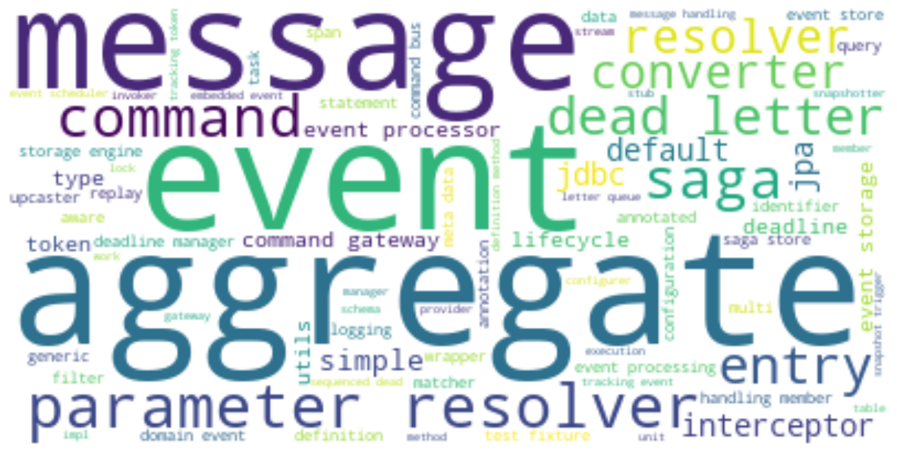

# Wordcloud
   

### References
- [jqassistant](https://jqassistant.org)
- [py2neo](https://py2neo.org/2021.1/)

## Word Cloud

<table border="1" class="dataframe">
  <thead>
    <tr style="text-align: right;">
      <th></th>
      <th>word</th>
    </tr>
  </thead>
  <tbody>
    <tr>
      <th>0</th>
      <td>org</td>
    </tr>
    <tr>
      <th>1</th>
      <td>axonframework</td>
    </tr>
    <tr>
      <th>2</th>
      <td>commandhandling</td>
    </tr>
    <tr>
      <th>3</th>
      <td>callbacks</td>
    </tr>
    <tr>
      <th>4</th>
      <td>distributed</td>
    </tr>
    <tr>
      <th>5</th>
      <td>commandfilter</td>
    </tr>
    <tr>
      <th>6</th>
      <td>gateway</td>
    </tr>
    <tr>
      <th>7</th>
      <td>common</td>
    </tr>
    <tr>
      <th>8</th>
      <td>annotation</td>
    </tr>
    <tr>
      <th>9</th>
      <td>caching</td>
    </tr>
    <tr>
      <th>10</th>
      <td>digest</td>
    </tr>
    <tr>
      <th>11</th>
      <td>io</td>
    </tr>
    <tr>
      <th>12</th>
      <td>jdbc</td>
    </tr>
    <tr>
      <th>13</th>
      <td>jpa</td>
    </tr>
    <tr>
      <th>14</th>
      <td>legacyjpa</td>
    </tr>
    <tr>
      <th>15</th>
      <td>property</td>
    </tr>
    <tr>
      <th>16</th>
      <td>lock</td>
    </tr>
    <tr>
      <th>17</th>
      <td>stream</td>
    </tr>
    <tr>
      <th>18</th>
      <td>transaction</td>
    </tr>
    <tr>
      <th>19</th>
      <td>deadline</td>
    </tr>
  </tbody>
</table>

    There are 4618 words in the dataset.

    

    

