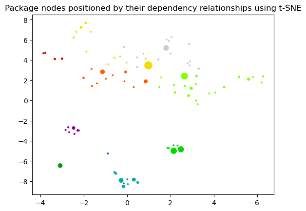

# Node Embeddings

Here we will have a look at node embeddings and how to further reduce their dimensionality to be able to visualize them in a 2D plot. 

### Note about data dependencies

PageRank centrality and Leiden community are also fetched from the Graph and need to be calculated first.
This makes it easier to see in the visualization if the embeddings approximate the structural information of the graph.
If these properties are missing you will only see black dots all of the same size without community coloring.
In future it might make sense to also run a community detection algorithm co-located in here to not depend on the order of execution.

   

### References
- [jqassistant](https://jqassistant.org)
- [Neo4j Python Driver](https://neo4j.com/docs/api/python-driver/current)
- [Tutorial: Applied Graph Embeddings](https://neo4j.com/developer/graph-data-science/applied-graph-embeddings)
- [Visualizing the embeddings in 2D](https://github.com/openai/openai-cookbook/blob/main/examples/Visualizing_embeddings_in_2D.ipynb)
- [Fast Random Projection](https://neo4j.com/docs/graph-data-science/current/machine-learning/node-embeddings/fastrp)
- [scikit-learn TSNE](https://scikit-learn.org/stable/modules/generated/sklearn.manifold.TSNE.html#sklearn.manifold.TSNE)
- [AttributeError: 'list' object has no attribute 'shape'](https://bobbyhadz.com/blog/python-attributeerror-list-object-has-no-attribute-shape)

    The scikit-learn version is 1.3.0.
    The pandas version is 1.5.1.

## Preparation

### Create Graph Projection

Create an in-memory undirected graph projection containing Package nodes (vertices) and their dependencies (edges).

<table border="1" class="dataframe">
  <thead>
    <tr style="text-align: right;">
      <th></th>
      <th>graphName</th>
      <th>fromGraphName</th>
      <th>nodeCount</th>
      <th>relationshipCount</th>
      <th>nodeFilter</th>
    </tr>
  </thead>
  <tbody>
    <tr>
      <th>0</th>
      <td>package-embeddings-notebook-cleaned</td>
      <td>package-embeddings-notebook</td>
      <td>93</td>
      <td>1130</td>
      <td>n.outgoingDependencies &gt; 0 OR n.incomingDepend...</td>
    </tr>
  </tbody>
</table>

### Generate Node Embeddings using Fast Random Projection (Fast RP)

[Fast Random Projection](https://neo4j.com/docs/graph-data-science/current/machine-learning/node-embeddings/fastrp) calculates an array of floats (length = embedding dimension) for every node in the graph. These numbers approximate the relationship and similarity information of each node and are called node embeddings. Random Projections is used to reduce the dimensionality of the node feature space while preserving pairwise distances.

The result can be used in machine learning as features approximating the graph structure. It can also be used to further reduce the dimensionality to visualize the graph in a 2D plot, as we will be doing here.

<table border="1" class="dataframe">
  <thead>
    <tr style="text-align: right;">
      <th></th>
      <th>codeUnitName</th>
      <th>communityId</th>
      <th>centrality</th>
      <th>artifactName</th>
      <th>embedding</th>
    </tr>
  </thead>
  <tbody>
    <tr>
      <th>0</th>
      <td>org.axonframework.disruptor.commandhandling</td>
      <td>0</td>
      <td>0.013999</td>
      <td>axon-disruptor-4.8.2</td>
      <td>[-0.1822344809770584, 0.1299275904893875, -0.1...</td>
    </tr>
    <tr>
      <th>1</th>
      <td>org.axonframework.test</td>
      <td>1</td>
      <td>0.028744</td>
      <td>axon-test-4.8.2</td>
      <td>[0.00023671239614486694, 0.11516499519348145, ...</td>
    </tr>
    <tr>
      <th>2</th>
      <td>org.axonframework.test.aggregate</td>
      <td>1</td>
      <td>0.013868</td>
      <td>axon-test-4.8.2</td>
      <td>[-0.019603952765464783, 0.1267286092042923, -0...</td>
    </tr>
    <tr>
      <th>3</th>
      <td>org.axonframework.test.matchers</td>
      <td>1</td>
      <td>0.020120</td>
      <td>axon-test-4.8.2</td>
      <td>[-0.009701468050479889, 0.10321725159883499, -...</td>
    </tr>
    <tr>
      <th>4</th>
      <td>org.axonframework.test.saga</td>
      <td>1</td>
      <td>0.013868</td>
      <td>axon-test-4.8.2</td>
      <td>[0.036567725241184235, 0.11346830427646637, -0...</td>
    </tr>
  </tbody>
</table>

### Dimensionality reduction with t-distributed stochastic neighbor embedding (t-SNE)

This step takes the original node embeddings with a higher dimensionality (e.g. list of 32 floats) and
reduces them to a 2 dimensional array for visualization. 

> It converts similarities between data points to joint probabilities and tries to minimize the Kullback-Leibler divergence between the joint probabilities of the low-dimensional embedding and the high-dimensional data.

(see https://scikit-learn.org/stable/modules/generated/sklearn.manifold.TSNE.html#sklearn.manifold.TSNE)

    [t-SNE] Computing 91 nearest neighbors...
    [t-SNE] Indexed 93 samples in 0.000s...
    [t-SNE] Computed neighbors for 93 samples in 0.069s...
    [t-SNE] Computed conditional probabilities for sample 93 / 93
    [t-SNE] Mean sigma: 0.504033
    [t-SNE] KL divergence after 250 iterations with early exaggeration: 48.547836
    [t-SNE] KL divergence after 900 iterations: 0.124734

    (93, 2)

<table border="1" class="dataframe">
  <thead>
    <tr style="text-align: right;">
      <th></th>
      <th>codeUnit</th>
      <th>artifact</th>
      <th>communityId</th>
      <th>centrality</th>
      <th>x</th>
      <th>y</th>
    </tr>
  </thead>
  <tbody>
    <tr>
      <th>0</th>
      <td>org.axonframework.disruptor.commandhandling</td>
      <td>axon-disruptor-4.8.2</td>
      <td>0</td>
      <td>0.013999</td>
      <td>2.721016</td>
      <td>5.445649</td>
    </tr>
    <tr>
      <th>1</th>
      <td>org.axonframework.test</td>
      <td>axon-test-4.8.2</td>
      <td>1</td>
      <td>0.028744</td>
      <td>5.497223</td>
      <td>1.652973</td>
    </tr>
    <tr>
      <th>2</th>
      <td>org.axonframework.test.aggregate</td>
      <td>axon-test-4.8.2</td>
      <td>1</td>
      <td>0.013868</td>
      <td>4.537615</td>
      <td>2.596540</td>
    </tr>
    <tr>
      <th>3</th>
      <td>org.axonframework.test.matchers</td>
      <td>axon-test-4.8.2</td>
      <td>1</td>
      <td>0.020120</td>
      <td>5.418225</td>
      <td>1.627366</td>
    </tr>
    <tr>
      <th>4</th>
      <td>org.axonframework.test.saga</td>
      <td>axon-test-4.8.2</td>
      <td>1</td>
      <td>0.013868</td>
      <td>4.923881</td>
      <td>1.159050</td>
    </tr>
  </tbody>
</table>

    

    

