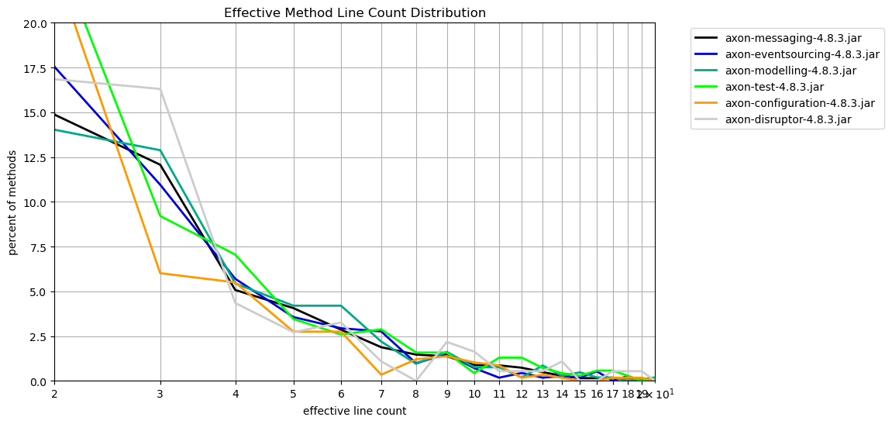
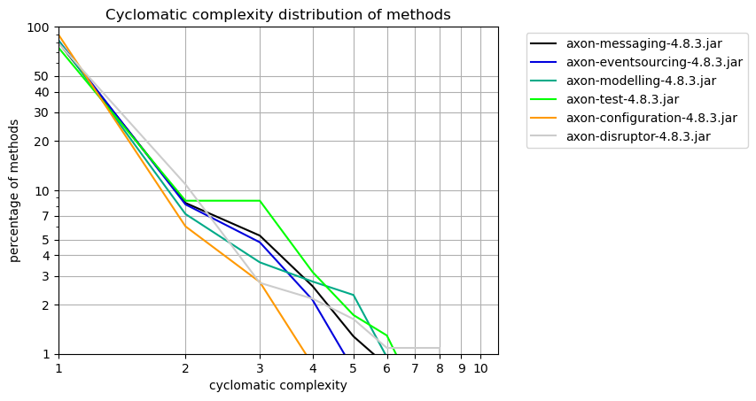

# Method Metrics
   

### References
- [jqassistant](https://jqassistant.org)
- [Neo4j Python Driver](https://neo4j.com/docs/api/python-driver/current)

## Effective Method Line Count

### Table 1a - Effective method line count distribution

This table shows the distribution of the effective method line count per artifact.
For each artifact the number of methods with effective line count = 1,2,3,... is shown to get an overview of how line counts are distributed over methods.

Only the 15 artifacts with the highest method count and their effective method line count distribution (limited by 40)is shown here. The whole table can be found in the CSV report `Effective_Method_Line_Count_Distribution`.

Have a look below to find out which packages and methods have the highest effective lines of code.

<table border="1" class="dataframe">
  <thead>
    <tr style="text-align: right;">
      <th>artifactName</th>
      <th>axon-messaging-4.8.3.jar</th>
      <th>axon-eventsourcing-4.8.3.jar</th>
      <th>axon-modelling-4.8.3.jar</th>
      <th>axon-test-4.8.3.jar</th>
      <th>axon-configuration-4.8.3.jar</th>
      <th>axon-disruptor-4.8.3.jar</th>
    </tr>
    <tr>
      <th>effectiveLineCount</th>
      <th></th>
      <th></th>
      <th></th>
      <th></th>
      <th></th>
      <th></th>
    </tr>
  </thead>
  <tbody>
    <tr>
      <th>1</th>
      <td>2743</td>
      <td>567</td>
      <td>523</td>
      <td>279</td>
      <td>308</td>
      <td>84</td>
    </tr>
    <tr>
      <th>2</th>
      <td>791</td>
      <td>197</td>
      <td>147</td>
      <td>169</td>
      <td>135</td>
      <td>31</td>
    </tr>
    <tr>
      <th>3</th>
      <td>642</td>
      <td>123</td>
      <td>135</td>
      <td>64</td>
      <td>35</td>
      <td>30</td>
    </tr>
    <tr>
      <th>4</th>
      <td>270</td>
      <td>64</td>
      <td>57</td>
      <td>49</td>
      <td>32</td>
      <td>8</td>
    </tr>
    <tr>
      <th>5</th>
      <td>216</td>
      <td>40</td>
      <td>44</td>
      <td>24</td>
      <td>16</td>
      <td>5</td>
    </tr>
    <tr>
      <th>6</th>
      <td>152</td>
      <td>33</td>
      <td>44</td>
      <td>18</td>
      <td>16</td>
      <td>6</td>
    </tr>
    <tr>
      <th>7</th>
      <td>100</td>
      <td>31</td>
      <td>23</td>
      <td>20</td>
      <td>2</td>
      <td>2</td>
    </tr>
    <tr>
      <th>8</th>
      <td>78</td>
      <td>11</td>
      <td>10</td>
      <td>11</td>
      <td>7</td>
      <td>0</td>
    </tr>
    <tr>
      <th>9</th>
      <td>73</td>
      <td>17</td>
      <td>17</td>
      <td>11</td>
      <td>8</td>
      <td>4</td>
    </tr>
    <tr>
      <th>10</th>
      <td>47</td>
      <td>8</td>
      <td>8</td>
      <td>3</td>
      <td>6</td>
      <td>3</td>
    </tr>
    <tr>
      <th>11</th>
      <td>46</td>
      <td>2</td>
      <td>8</td>
      <td>9</td>
      <td>5</td>
      <td>1</td>
    </tr>
    <tr>
      <th>12</th>
      <td>39</td>
      <td>5</td>
      <td>2</td>
      <td>9</td>
      <td>1</td>
      <td>1</td>
    </tr>
    <tr>
      <th>13</th>
      <td>26</td>
      <td>2</td>
      <td>9</td>
      <td>5</td>
      <td>2</td>
      <td>1</td>
    </tr>
    <tr>
      <th>14</th>
      <td>15</td>
      <td>3</td>
      <td>3</td>
      <td>3</td>
      <td>1</td>
      <td>2</td>
    </tr>
    <tr>
      <th>15</th>
      <td>8</td>
      <td>2</td>
      <td>5</td>
      <td>2</td>
      <td>0</td>
      <td>0</td>
    </tr>
    <tr>
      <th>16</th>
      <td>8</td>
      <td>6</td>
      <td>2</td>
      <td>4</td>
      <td>0</td>
      <td>0</td>
    </tr>
    <tr>
      <th>17</th>
      <td>9</td>
      <td>0</td>
      <td>2</td>
      <td>4</td>
      <td>1</td>
      <td>1</td>
    </tr>
    <tr>
      <th>18</th>
      <td>8</td>
      <td>3</td>
      <td>0</td>
      <td>2</td>
      <td>1</td>
      <td>1</td>
    </tr>
    <tr>
      <th>19</th>
      <td>7</td>
      <td>0</td>
      <td>1</td>
      <td>0</td>
      <td>1</td>
      <td>1</td>
    </tr>
    <tr>
      <th>20</th>
      <td>4</td>
      <td>2</td>
      <td>2</td>
      <td>1</td>
      <td>0</td>
      <td>0</td>
    </tr>
    <tr>
      <th>21</th>
      <td>7</td>
      <td>2</td>
      <td>1</td>
      <td>1</td>
      <td>1</td>
      <td>0</td>
    </tr>
    <tr>
      <th>22</th>
      <td>4</td>
      <td>0</td>
      <td>1</td>
      <td>1</td>
      <td>0</td>
      <td>1</td>
    </tr>
    <tr>
      <th>23</th>
      <td>4</td>
      <td>1</td>
      <td>1</td>
      <td>1</td>
      <td>1</td>
      <td>0</td>
    </tr>
    <tr>
      <th>24</th>
      <td>6</td>
      <td>2</td>
      <td>1</td>
      <td>1</td>
      <td>0</td>
      <td>1</td>
    </tr>
    <tr>
      <th>25</th>
      <td>0</td>
      <td>2</td>
      <td>0</td>
      <td>0</td>
      <td>0</td>
      <td>0</td>
    </tr>
    <tr>
      <th>26</th>
      <td>2</td>
      <td>0</td>
      <td>1</td>
      <td>1</td>
      <td>1</td>
      <td>0</td>
    </tr>
    <tr>
      <th>28</th>
      <td>2</td>
      <td>0</td>
      <td>0</td>
      <td>1</td>
      <td>0</td>
      <td>0</td>
    </tr>
    <tr>
      <th>29</th>
      <td>1</td>
      <td>0</td>
      <td>0</td>
      <td>0</td>
      <td>0</td>
      <td>0</td>
    </tr>
    <tr>
      <th>31</th>
      <td>1</td>
      <td>0</td>
      <td>0</td>
      <td>1</td>
      <td>0</td>
      <td>0</td>
    </tr>
    <tr>
      <th>32</th>
      <td>1</td>
      <td>0</td>
      <td>0</td>
      <td>0</td>
      <td>0</td>
      <td>1</td>
    </tr>
    <tr>
      <th>33</th>
      <td>1</td>
      <td>0</td>
      <td>0</td>
      <td>0</td>
      <td>0</td>
      <td>0</td>
    </tr>
    <tr>
      <th>34</th>
      <td>1</td>
      <td>0</td>
      <td>0</td>
      <td>0</td>
      <td>0</td>
      <td>0</td>
    </tr>
    <tr>
      <th>36</th>
      <td>2</td>
      <td>0</td>
      <td>0</td>
      <td>0</td>
      <td>0</td>
      <td>0</td>
    </tr>
    <tr>
      <th>38</th>
      <td>0</td>
      <td>0</td>
      <td>1</td>
      <td>0</td>
      <td>0</td>
      <td>0</td>
    </tr>
    <tr>
      <th>40</th>
      <td>0</td>
      <td>0</td>
      <td>0</td>
      <td>0</td>
      <td>1</td>
      <td>0</td>
    </tr>
    <tr>
      <th>42</th>
      <td>1</td>
      <td>0</td>
      <td>0</td>
      <td>0</td>
      <td>0</td>
      <td>0</td>
    </tr>
    <tr>
      <th>43</th>
      <td>0</td>
      <td>0</td>
      <td>0</td>
      <td>0</td>
      <td>1</td>
      <td>0</td>
    </tr>
    <tr>
      <th>45</th>
      <td>0</td>
      <td>0</td>
      <td>0</td>
      <td>1</td>
      <td>0</td>
      <td>0</td>
    </tr>
    <tr>
      <th>50</th>
      <td>1</td>
      <td>0</td>
      <td>0</td>
      <td>0</td>
      <td>0</td>
      <td>0</td>
    </tr>
    <tr>
      <th>57</th>
      <td>1</td>
      <td>0</td>
      <td>0</td>
      <td>0</td>
      <td>0</td>
      <td>0</td>
    </tr>
  </tbody>
</table>

### Table 1b - Effective method line count distribution (normalized)

The table shown here only includes the first 40 rows which typically represents the most significant entries.
Have a look below to find out which packages and methods have the highest effective lines of code.

<table border="1" class="dataframe">
  <thead>
    <tr style="text-align: right;">
      <th>artifactName</th>
      <th>axon-messaging-4.8.3.jar</th>
      <th>axon-eventsourcing-4.8.3.jar</th>
      <th>axon-modelling-4.8.3.jar</th>
      <th>axon-test-4.8.3.jar</th>
      <th>axon-configuration-4.8.3.jar</th>
      <th>axon-disruptor-4.8.3.jar</th>
    </tr>
    <tr>
      <th>effectiveLineCount</th>
      <th></th>
      <th></th>
      <th></th>
      <th></th>
      <th></th>
      <th></th>
    </tr>
  </thead>
  <tbody>
    <tr>
      <th>1</th>
      <td>51.569844</td>
      <td>50.489760</td>
      <td>49.904580</td>
      <td>40.143885</td>
      <td>52.920962</td>
      <td>45.652174</td>
    </tr>
    <tr>
      <th>2</th>
      <td>14.871216</td>
      <td>17.542297</td>
      <td>14.026718</td>
      <td>24.316547</td>
      <td>23.195876</td>
      <td>16.847826</td>
    </tr>
    <tr>
      <th>3</th>
      <td>12.069938</td>
      <td>10.952805</td>
      <td>12.881679</td>
      <td>9.208633</td>
      <td>6.013746</td>
      <td>16.304348</td>
    </tr>
    <tr>
      <th>4</th>
      <td>5.076142</td>
      <td>5.699020</td>
      <td>5.438931</td>
      <td>7.050360</td>
      <td>5.498282</td>
      <td>4.347826</td>
    </tr>
    <tr>
      <th>5</th>
      <td>4.060914</td>
      <td>3.561888</td>
      <td>4.198473</td>
      <td>3.453237</td>
      <td>2.749141</td>
      <td>2.717391</td>
    </tr>
    <tr>
      <th>6</th>
      <td>2.857680</td>
      <td>2.938557</td>
      <td>4.198473</td>
      <td>2.589928</td>
      <td>2.749141</td>
      <td>3.260870</td>
    </tr>
    <tr>
      <th>7</th>
      <td>1.880053</td>
      <td>2.760463</td>
      <td>2.194656</td>
      <td>2.877698</td>
      <td>0.343643</td>
      <td>1.086957</td>
    </tr>
    <tr>
      <th>8</th>
      <td>1.466441</td>
      <td>0.979519</td>
      <td>0.954198</td>
      <td>1.582734</td>
      <td>1.202749</td>
      <td>0.000000</td>
    </tr>
    <tr>
      <th>9</th>
      <td>1.372438</td>
      <td>1.513802</td>
      <td>1.622137</td>
      <td>1.582734</td>
      <td>1.374570</td>
      <td>2.173913</td>
    </tr>
    <tr>
      <th>10</th>
      <td>0.883625</td>
      <td>0.712378</td>
      <td>0.763359</td>
      <td>0.431655</td>
      <td>1.030928</td>
      <td>1.630435</td>
    </tr>
    <tr>
      <th>11</th>
      <td>0.864824</td>
      <td>0.178094</td>
      <td>0.763359</td>
      <td>1.294964</td>
      <td>0.859107</td>
      <td>0.543478</td>
    </tr>
    <tr>
      <th>12</th>
      <td>0.733221</td>
      <td>0.445236</td>
      <td>0.190840</td>
      <td>1.294964</td>
      <td>0.171821</td>
      <td>0.543478</td>
    </tr>
    <tr>
      <th>13</th>
      <td>0.488814</td>
      <td>0.178094</td>
      <td>0.858779</td>
      <td>0.719424</td>
      <td>0.343643</td>
      <td>0.543478</td>
    </tr>
    <tr>
      <th>14</th>
      <td>0.282008</td>
      <td>0.267142</td>
      <td>0.286260</td>
      <td>0.431655</td>
      <td>0.171821</td>
      <td>1.086957</td>
    </tr>
    <tr>
      <th>15</th>
      <td>0.150404</td>
      <td>0.178094</td>
      <td>0.477099</td>
      <td>0.287770</td>
      <td>0.000000</td>
      <td>0.000000</td>
    </tr>
    <tr>
      <th>16</th>
      <td>0.150404</td>
      <td>0.534283</td>
      <td>0.190840</td>
      <td>0.575540</td>
      <td>0.000000</td>
      <td>0.000000</td>
    </tr>
    <tr>
      <th>17</th>
      <td>0.169205</td>
      <td>0.000000</td>
      <td>0.190840</td>
      <td>0.575540</td>
      <td>0.171821</td>
      <td>0.543478</td>
    </tr>
    <tr>
      <th>18</th>
      <td>0.150404</td>
      <td>0.267142</td>
      <td>0.000000</td>
      <td>0.287770</td>
      <td>0.171821</td>
      <td>0.543478</td>
    </tr>
    <tr>
      <th>19</th>
      <td>0.131604</td>
      <td>0.000000</td>
      <td>0.095420</td>
      <td>0.000000</td>
      <td>0.171821</td>
      <td>0.543478</td>
    </tr>
    <tr>
      <th>20</th>
      <td>0.075202</td>
      <td>0.178094</td>
      <td>0.190840</td>
      <td>0.143885</td>
      <td>0.000000</td>
      <td>0.000000</td>
    </tr>
    <tr>
      <th>21</th>
      <td>0.131604</td>
      <td>0.178094</td>
      <td>0.095420</td>
      <td>0.143885</td>
      <td>0.171821</td>
      <td>0.000000</td>
    </tr>
    <tr>
      <th>22</th>
      <td>0.075202</td>
      <td>0.000000</td>
      <td>0.095420</td>
      <td>0.143885</td>
      <td>0.000000</td>
      <td>0.543478</td>
    </tr>
    <tr>
      <th>23</th>
      <td>0.075202</td>
      <td>0.089047</td>
      <td>0.095420</td>
      <td>0.143885</td>
      <td>0.171821</td>
      <td>0.000000</td>
    </tr>
    <tr>
      <th>24</th>
      <td>0.112803</td>
      <td>0.178094</td>
      <td>0.095420</td>
      <td>0.143885</td>
      <td>0.000000</td>
      <td>0.543478</td>
    </tr>
    <tr>
      <th>25</th>
      <td>0.000000</td>
      <td>0.178094</td>
      <td>0.000000</td>
      <td>0.000000</td>
      <td>0.000000</td>
      <td>0.000000</td>
    </tr>
    <tr>
      <th>26</th>
      <td>0.037601</td>
      <td>0.000000</td>
      <td>0.095420</td>
      <td>0.143885</td>
      <td>0.171821</td>
      <td>0.000000</td>
    </tr>
    <tr>
      <th>28</th>
      <td>0.037601</td>
      <td>0.000000</td>
      <td>0.000000</td>
      <td>0.143885</td>
      <td>0.000000</td>
      <td>0.000000</td>
    </tr>
    <tr>
      <th>29</th>
      <td>0.018801</td>
      <td>0.000000</td>
      <td>0.000000</td>
      <td>0.000000</td>
      <td>0.000000</td>
      <td>0.000000</td>
    </tr>
    <tr>
      <th>31</th>
      <td>0.018801</td>
      <td>0.000000</td>
      <td>0.000000</td>
      <td>0.143885</td>
      <td>0.000000</td>
      <td>0.000000</td>
    </tr>
    <tr>
      <th>32</th>
      <td>0.018801</td>
      <td>0.000000</td>
      <td>0.000000</td>
      <td>0.000000</td>
      <td>0.000000</td>
      <td>0.543478</td>
    </tr>
    <tr>
      <th>33</th>
      <td>0.018801</td>
      <td>0.000000</td>
      <td>0.000000</td>
      <td>0.000000</td>
      <td>0.000000</td>
      <td>0.000000</td>
    </tr>
    <tr>
      <th>34</th>
      <td>0.018801</td>
      <td>0.000000</td>
      <td>0.000000</td>
      <td>0.000000</td>
      <td>0.000000</td>
      <td>0.000000</td>
    </tr>
    <tr>
      <th>36</th>
      <td>0.037601</td>
      <td>0.000000</td>
      <td>0.000000</td>
      <td>0.000000</td>
      <td>0.000000</td>
      <td>0.000000</td>
    </tr>
    <tr>
      <th>38</th>
      <td>0.000000</td>
      <td>0.000000</td>
      <td>0.095420</td>
      <td>0.000000</td>
      <td>0.000000</td>
      <td>0.000000</td>
    </tr>
    <tr>
      <th>40</th>
      <td>0.000000</td>
      <td>0.000000</td>
      <td>0.000000</td>
      <td>0.000000</td>
      <td>0.171821</td>
      <td>0.000000</td>
    </tr>
    <tr>
      <th>42</th>
      <td>0.018801</td>
      <td>0.000000</td>
      <td>0.000000</td>
      <td>0.000000</td>
      <td>0.000000</td>
      <td>0.000000</td>
    </tr>
    <tr>
      <th>43</th>
      <td>0.000000</td>
      <td>0.000000</td>
      <td>0.000000</td>
      <td>0.000000</td>
      <td>0.171821</td>
      <td>0.000000</td>
    </tr>
    <tr>
      <th>45</th>
      <td>0.000000</td>
      <td>0.000000</td>
      <td>0.000000</td>
      <td>0.143885</td>
      <td>0.000000</td>
      <td>0.000000</td>
    </tr>
    <tr>
      <th>50</th>
      <td>0.018801</td>
      <td>0.000000</td>
      <td>0.000000</td>
      <td>0.000000</td>
      <td>0.000000</td>
      <td>0.000000</td>
    </tr>
    <tr>
      <th>57</th>
      <td>0.018801</td>
      <td>0.000000</td>
      <td>0.000000</td>
      <td>0.000000</td>
      <td>0.000000</td>
      <td>0.000000</td>
    </tr>
  </tbody>
</table>

### Table 1b Chart 1 - Effective method line count distribution (normalized)

    <Figure size 640x480 with 0 Axes>

    

    

### Table 1c - Top 30 packages with highest effective line counts

The following table shows the top 30 packages with the highest effective lines of code. The whole table can be found in the CSV report `Effective_lines_of_method_code_per_package`.

<table border="1" class="dataframe">
  <thead>
    <tr style="text-align: right;">
      <th></th>
      <th>artifactName</th>
      <th>fullPackageName</th>
      <th>linesInPackage</th>
      <th>methodCount</th>
      <th>maxLinesMethod</th>
      <th>maxLinesMethodName</th>
    </tr>
  </thead>
  <tbody>
    <tr>
      <th>0</th>
      <td>axon-messaging-4.8.3</td>
      <td>org.axonframework.eventhandling</td>
      <td>2213</td>
      <td>793</td>
      <td>64</td>
      <td>processBatch</td>
    </tr>
    <tr>
      <th>1</th>
      <td>axon-configuration-4.8.3</td>
      <td>org.axonframework.config</td>
      <td>1503</td>
      <td>582</td>
      <td>43</td>
      <td>&lt;init&gt;</td>
    </tr>
    <tr>
      <th>2</th>
      <td>axon-messaging-4.8.3</td>
      <td>org.axonframework.eventhandling.pooled</td>
      <td>978</td>
      <td>318</td>
      <td>78</td>
      <td>run</td>
    </tr>
    <tr>
      <th>3</th>
      <td>axon-test-4.8.3</td>
      <td>org.axonframework.test.aggregate</td>
      <td>951</td>
      <td>249</td>
      <td>45</td>
      <td>appendEventOverview</td>
    </tr>
    <tr>
      <th>4</th>
      <td>axon-messaging-4.8.3</td>
      <td>org.axonframework.queryhandling</td>
      <td>855</td>
      <td>342</td>
      <td>36</td>
      <td>doQuery</td>
    </tr>
    <tr>
      <th>5</th>
      <td>axon-messaging-4.8.3</td>
      <td>org.axonframework.eventhandling.deadletter.jdbc</td>
      <td>849</td>
      <td>249</td>
      <td>31</td>
      <td>convertToLetter</td>
    </tr>
    <tr>
      <th>6</th>
      <td>axon-modelling-4.8.3</td>
      <td>org.axonframework.modelling.command</td>
      <td>792</td>
      <td>315</td>
      <td>17</td>
      <td>lambda$initializeHandler$7</td>
    </tr>
    <tr>
      <th>7</th>
      <td>axon-eventsourcing-4.8.3</td>
      <td>org.axonframework.eventsourcing.eventstore</td>
      <td>709</td>
      <td>262</td>
      <td>21</td>
      <td>peekPrivateStream</td>
    </tr>
    <tr>
      <th>8</th>
      <td>axon-messaging-4.8.3</td>
      <td>org.axonframework.messaging.annotation</td>
      <td>673</td>
      <td>239</td>
      <td>23</td>
      <td>&lt;init&gt;</td>
    </tr>
    <tr>
      <th>9</th>
      <td>axon-modelling-4.8.3</td>
      <td>org.axonframework.modelling.command.inspection</td>
      <td>637</td>
      <td>218</td>
      <td>26</td>
      <td>inspectFieldsAndMethods</td>
    </tr>
    <tr>
      <th>10</th>
      <td>axon-disruptor-4.8.3</td>
      <td>org.axonframework.disruptor.commandhandling</td>
      <td>605</td>
      <td>184</td>
      <td>32</td>
      <td>&lt;init&gt;</td>
    </tr>
    <tr>
      <th>11</th>
      <td>axon-eventsourcing-4.8.3</td>
      <td>org.axonframework.eventsourcing</td>
      <td>582</td>
      <td>236</td>
      <td>20</td>
      <td>doScheduleSnapshot</td>
    </tr>
    <tr>
      <th>12</th>
      <td>axon-eventsourcing-4.8.3</td>
      <td>org.axonframework.eventsourcing.eventstore.leg...</td>
      <td>570</td>
      <td>185</td>
      <td>25</td>
      <td>fetchTrackedEvents</td>
    </tr>
    <tr>
      <th>13</th>
      <td>axon-eventsourcing-4.8.3</td>
      <td>org.axonframework.eventsourcing.eventstore.jdbc</td>
      <td>569</td>
      <td>236</td>
      <td>24</td>
      <td>getTrackedEventData</td>
    </tr>
    <tr>
      <th>14</th>
      <td>axon-messaging-4.8.3</td>
      <td>org.axonframework.serialization</td>
      <td>537</td>
      <td>181</td>
      <td>22</td>
      <td>&lt;init&gt;</td>
    </tr>
    <tr>
      <th>15</th>
      <td>axon-messaging-4.8.3</td>
      <td>org.axonframework.eventhandling.deadletter.jpa</td>
      <td>522</td>
      <td>132</td>
      <td>28</td>
      <td>equals</td>
    </tr>
    <tr>
      <th>16</th>
      <td>axon-messaging-4.8.3</td>
      <td>org.axonframework.common</td>
      <td>501</td>
      <td>144</td>
      <td>24</td>
      <td>getExactDirectSuperTypesOfParameterizedTypeOrC...</td>
    </tr>
    <tr>
      <th>17</th>
      <td>axon-messaging-4.8.3</td>
      <td>org.axonframework.commandhandling.gateway</td>
      <td>488</td>
      <td>174</td>
      <td>50</td>
      <td>createGateway</td>
    </tr>
    <tr>
      <th>18</th>
      <td>axon-test-4.8.3</td>
      <td>org.axonframework.test.saga</td>
      <td>487</td>
      <td>167</td>
      <td>28</td>
      <td>&lt;init&gt;</td>
    </tr>
    <tr>
      <th>19</th>
      <td>axon-messaging-4.8.3</td>
      <td>org.axonframework.commandhandling.distributed</td>
      <td>474</td>
      <td>175</td>
      <td>23</td>
      <td>dispatch</td>
    </tr>
    <tr>
      <th>20</th>
      <td>axon-modelling-4.8.3</td>
      <td>org.axonframework.modelling.saga</td>
      <td>459</td>
      <td>181</td>
      <td>23</td>
      <td>handle</td>
    </tr>
    <tr>
      <th>21</th>
      <td>axon-messaging-4.8.3</td>
      <td>org.axonframework.eventhandling.tokenstore.jdbc</td>
      <td>430</td>
      <td>130</td>
      <td>26</td>
      <td>updateToken</td>
    </tr>
    <tr>
      <th>22</th>
      <td>axon-messaging-4.8.3</td>
      <td>org.axonframework.eventhandling.deadletter.leg...</td>
      <td>401</td>
      <td>97</td>
      <td>21</td>
      <td>convert</td>
    </tr>
    <tr>
      <th>23</th>
      <td>axon-modelling-4.8.3</td>
      <td>org.axonframework.modelling.saga.repository.jdbc</td>
      <td>374</td>
      <td>84</td>
      <td>38</td>
      <td>updateSaga</td>
    </tr>
    <tr>
      <th>24</th>
      <td>axon-messaging-4.8.3</td>
      <td>org.axonframework.messaging.unitofwork</td>
      <td>363</td>
      <td>129</td>
      <td>32</td>
      <td>executeWithResult</td>
    </tr>
    <tr>
      <th>25</th>
      <td>axon-test-4.8.3</td>
      <td>org.axonframework.test.matchers</td>
      <td>351</td>
      <td>108</td>
      <td>21</td>
      <td>matchingFields</td>
    </tr>
    <tr>
      <th>26</th>
      <td>axon-messaging-4.8.3</td>
      <td>org.axonframework.messaging</td>
      <td>348</td>
      <td>156</td>
      <td>13</td>
      <td>describeTo</td>
    </tr>
    <tr>
      <th>27</th>
      <td>axon-messaging-4.8.3</td>
      <td>org.axonframework.commandhandling</td>
      <td>340</td>
      <td>151</td>
      <td>13</td>
      <td>&lt;init&gt;</td>
    </tr>
    <tr>
      <th>28</th>
      <td>axon-eventsourcing-4.8.3</td>
      <td>org.axonframework.eventsourcing.eventstore.jpa</td>
      <td>320</td>
      <td>101</td>
      <td>25</td>
      <td>fetchTrackedEvents</td>
    </tr>
    <tr>
      <th>29</th>
      <td>axon-messaging-4.8.3</td>
      <td>org.axonframework.deadline.dbscheduler</td>
      <td>318</td>
      <td>103</td>
      <td>17</td>
      <td>execute</td>
    </tr>
  </tbody>
</table>

### Table 1d - Top 30 methods with the highest effective line count

The following table shows the top 30 methods with the highest effective lines of code. The whole table can be found in the CSV report `Effective_lines_of_method_code_per_package`.

<table border="1" class="dataframe">
  <thead>
    <tr style="text-align: right;">
      <th></th>
      <th>index</th>
      <th>artifactName</th>
      <th>fullPackageName</th>
      <th>maxLinesMethodType</th>
      <th>maxLinesMethodName</th>
      <th>maxLinesMethod</th>
      <th>linesInPackage</th>
    </tr>
  </thead>
  <tbody>
    <tr>
      <th>0</th>
      <td>2</td>
      <td>axon-messaging-4.8.3</td>
      <td>org.axonframework.eventhandling.pooled</td>
      <td>Coordinator$CoordinationTask</td>
      <td>run</td>
      <td>78</td>
      <td>978</td>
    </tr>
    <tr>
      <th>1</th>
      <td>0</td>
      <td>axon-messaging-4.8.3</td>
      <td>org.axonframework.eventhandling</td>
      <td>TrackingEventProcessor</td>
      <td>processBatch</td>
      <td>64</td>
      <td>2213</td>
    </tr>
    <tr>
      <th>2</th>
      <td>17</td>
      <td>axon-messaging-4.8.3</td>
      <td>org.axonframework.commandhandling.gateway</td>
      <td>CommandGatewayFactory</td>
      <td>createGateway</td>
      <td>50</td>
      <td>488</td>
    </tr>
    <tr>
      <th>3</th>
      <td>3</td>
      <td>axon-test-4.8.3</td>
      <td>org.axonframework.test.aggregate</td>
      <td>Reporter</td>
      <td>appendEventOverview</td>
      <td>45</td>
      <td>951</td>
    </tr>
    <tr>
      <th>4</th>
      <td>1</td>
      <td>axon-configuration-4.8.3</td>
      <td>org.axonframework.config</td>
      <td>EventProcessingModule</td>
      <td>&lt;init&gt;</td>
      <td>43</td>
      <td>1503</td>
    </tr>
    <tr>
      <th>5</th>
      <td>34</td>
      <td>axon-messaging-4.8.3</td>
      <td>org.axonframework.deadline.quartz</td>
      <td>DeadlineJob</td>
      <td>execute</td>
      <td>42</td>
      <td>242</td>
    </tr>
    <tr>
      <th>6</th>
      <td>23</td>
      <td>axon-modelling-4.8.3</td>
      <td>org.axonframework.modelling.saga.repository.jdbc</td>
      <td>JdbcSagaStore</td>
      <td>updateSaga</td>
      <td>38</td>
      <td>374</td>
    </tr>
    <tr>
      <th>7</th>
      <td>4</td>
      <td>axon-messaging-4.8.3</td>
      <td>org.axonframework.queryhandling</td>
      <td>SimpleQueryBus</td>
      <td>doQuery</td>
      <td>36</td>
      <td>855</td>
    </tr>
    <tr>
      <th>8</th>
      <td>30</td>
      <td>axon-messaging-4.8.3</td>
      <td>org.axonframework.messaging.deadletter</td>
      <td>InMemorySequencedDeadLetterQueue</td>
      <td>process</td>
      <td>33</td>
      <td>297</td>
    </tr>
    <tr>
      <th>9</th>
      <td>24</td>
      <td>axon-messaging-4.8.3</td>
      <td>org.axonframework.messaging.unitofwork</td>
      <td>BatchingUnitOfWork</td>
      <td>executeWithResult</td>
      <td>32</td>
      <td>363</td>
    </tr>
    <tr>
      <th>10</th>
      <td>10</td>
      <td>axon-disruptor-4.8.3</td>
      <td>org.axonframework.disruptor.commandhandling</td>
      <td>DisruptorCommandBus</td>
      <td>&lt;init&gt;</td>
      <td>32</td>
      <td>605</td>
    </tr>
    <tr>
      <th>11</th>
      <td>5</td>
      <td>axon-messaging-4.8.3</td>
      <td>org.axonframework.eventhandling.deadletter.jdbc</td>
      <td>DefaultDeadLetterJdbcConverter</td>
      <td>convertToLetter</td>
      <td>31</td>
      <td>849</td>
    </tr>
    <tr>
      <th>12</th>
      <td>18</td>
      <td>axon-test-4.8.3</td>
      <td>org.axonframework.test.saga</td>
      <td>SagaTestFixture</td>
      <td>&lt;init&gt;</td>
      <td>28</td>
      <td>487</td>
    </tr>
    <tr>
      <th>13</th>
      <td>15</td>
      <td>axon-messaging-4.8.3</td>
      <td>org.axonframework.eventhandling.deadletter.jpa</td>
      <td>DeadLetterEventEntry</td>
      <td>equals</td>
      <td>28</td>
      <td>522</td>
    </tr>
    <tr>
      <th>14</th>
      <td>9</td>
      <td>axon-modelling-4.8.3</td>
      <td>org.axonframework.modelling.command.inspection</td>
      <td>AnnotatedAggregateMetaModelFactory$AnnotatedAg...</td>
      <td>inspectFieldsAndMethods</td>
      <td>26</td>
      <td>637</td>
    </tr>
    <tr>
      <th>15</th>
      <td>21</td>
      <td>axon-messaging-4.8.3</td>
      <td>org.axonframework.eventhandling.tokenstore.jdbc</td>
      <td>JdbcTokenStore</td>
      <td>updateToken</td>
      <td>26</td>
      <td>430</td>
    </tr>
    <tr>
      <th>16</th>
      <td>12</td>
      <td>axon-eventsourcing-4.8.3</td>
      <td>org.axonframework.eventsourcing.eventstore.leg...</td>
      <td>JpaEventStorageEngine</td>
      <td>fetchTrackedEvents</td>
      <td>25</td>
      <td>570</td>
    </tr>
    <tr>
      <th>17</th>
      <td>28</td>
      <td>axon-eventsourcing-4.8.3</td>
      <td>org.axonframework.eventsourcing.eventstore.jpa</td>
      <td>JpaEventStorageEngine</td>
      <td>fetchTrackedEvents</td>
      <td>25</td>
      <td>320</td>
    </tr>
    <tr>
      <th>18</th>
      <td>13</td>
      <td>axon-eventsourcing-4.8.3</td>
      <td>org.axonframework.eventsourcing.eventstore.jdbc</td>
      <td>JdbcEventStorageEngine</td>
      <td>getTrackedEventData</td>
      <td>24</td>
      <td>569</td>
    </tr>
    <tr>
      <th>19</th>
      <td>16</td>
      <td>axon-messaging-4.8.3</td>
      <td>org.axonframework.common</td>
      <td>TypeReflectionUtils</td>
      <td>getExactDirectSuperTypesOfParameterizedTypeOrC...</td>
      <td>24</td>
      <td>501</td>
    </tr>
    <tr>
      <th>20</th>
      <td>37</td>
      <td>axon-messaging-4.8.3</td>
      <td>org.axonframework.deadline</td>
      <td>SimpleDeadlineManager$DeadlineTask</td>
      <td>run</td>
      <td>24</td>
      <td>220</td>
    </tr>
    <tr>
      <th>21</th>
      <td>19</td>
      <td>axon-messaging-4.8.3</td>
      <td>org.axonframework.commandhandling.distributed</td>
      <td>DistributedCommandBus</td>
      <td>dispatch</td>
      <td>23</td>
      <td>474</td>
    </tr>
    <tr>
      <th>22</th>
      <td>20</td>
      <td>axon-modelling-4.8.3</td>
      <td>org.axonframework.modelling.saga</td>
      <td>AbstractSagaManager</td>
      <td>handle</td>
      <td>23</td>
      <td>459</td>
    </tr>
    <tr>
      <th>23</th>
      <td>8</td>
      <td>axon-messaging-4.8.3</td>
      <td>org.axonframework.messaging.annotation</td>
      <td>AnnotatedMessageHandlingMember</td>
      <td>&lt;init&gt;</td>
      <td>23</td>
      <td>673</td>
    </tr>
    <tr>
      <th>24</th>
      <td>32</td>
      <td>axon-modelling-4.8.3</td>
      <td>org.axonframework.modelling.saga.repository</td>
      <td>AssociationValueMap$AssociationValueComparator</td>
      <td>compare</td>
      <td>22</td>
      <td>281</td>
    </tr>
    <tr>
      <th>25</th>
      <td>52</td>
      <td>axon-messaging-4.8.3</td>
      <td>org.axonframework.eventhandling.deadletter</td>
      <td>DeadLetteringEventHandlerInvoker</td>
      <td>handle</td>
      <td>22</td>
      <td>115</td>
    </tr>
    <tr>
      <th>26</th>
      <td>46</td>
      <td>axon-messaging-4.8.3</td>
      <td>org.axonframework.deadline.jobrunr</td>
      <td>JobRunrDeadlineManager</td>
      <td>execute</td>
      <td>22</td>
      <td>160</td>
    </tr>
    <tr>
      <th>27</th>
      <td>14</td>
      <td>axon-messaging-4.8.3</td>
      <td>org.axonframework.serialization</td>
      <td>AbstractXStreamSerializer</td>
      <td>&lt;init&gt;</td>
      <td>22</td>
      <td>537</td>
    </tr>
    <tr>
      <th>28</th>
      <td>54</td>
      <td>axon-messaging-4.8.3</td>
      <td>org.axonframework.serialization.upcasting.event</td>
      <td>InitialEventRepresentation</td>
      <td>&lt;init&gt;</td>
      <td>21</td>
      <td>104</td>
    </tr>
    <tr>
      <th>29</th>
      <td>25</td>
      <td>axon-test-4.8.3</td>
      <td>org.axonframework.test.matchers</td>
      <td>DeepEqualsMatcher</td>
      <td>matchingFields</td>
      <td>21</td>
      <td>351</td>
    </tr>
  </tbody>
</table>

## Cyclomatic Complexity

### Table 2a - Cyclomatic method complexity distribution

This table shows the distribution of the cyclomatic complexity of methods per artifact.
For each artifact the number of methods with the cyclomatic complexity = 1,2,3,... is shown to get an overview of how cyclomatic complexity is distributed over methods.

Only the 15 artifacts with the highest method count sum and their cyclomatic method complexity distribution (limited by 40) is shown here. The whole table can be found in the CSV report `Cyclomatic_Method_Complexity_Distribution`.

Have a look below to find out which packages and methods have the highest effective lines of code.

<table border="1" class="dataframe">
  <thead>
    <tr style="text-align: right;">
      <th>artifactName</th>
      <th>axon-messaging-4.8.3.jar</th>
      <th>axon-eventsourcing-4.8.3.jar</th>
      <th>axon-modelling-4.8.3.jar</th>
      <th>axon-test-4.8.3.jar</th>
      <th>axon-configuration-4.8.3.jar</th>
      <th>axon-disruptor-4.8.3.jar</th>
    </tr>
    <tr>
      <th>cyclomaticComplexity</th>
      <th></th>
      <th></th>
      <th></th>
      <th></th>
      <th></th>
      <th></th>
    </tr>
  </thead>
  <tbody>
    <tr>
      <th>1</th>
      <td>4277</td>
      <td>926</td>
      <td>866</td>
      <td>518</td>
      <td>521</td>
      <td>146</td>
    </tr>
    <tr>
      <th>2</th>
      <td>445</td>
      <td>92</td>
      <td>75</td>
      <td>60</td>
      <td>35</td>
      <td>20</td>
    </tr>
    <tr>
      <th>3</th>
      <td>281</td>
      <td>54</td>
      <td>38</td>
      <td>60</td>
      <td>16</td>
      <td>5</td>
    </tr>
    <tr>
      <th>4</th>
      <td>138</td>
      <td>24</td>
      <td>29</td>
      <td>22</td>
      <td>5</td>
      <td>4</td>
    </tr>
    <tr>
      <th>5</th>
      <td>68</td>
      <td>9</td>
      <td>24</td>
      <td>12</td>
      <td>3</td>
      <td>3</td>
    </tr>
    <tr>
      <th>6</th>
      <td>45</td>
      <td>3</td>
      <td>10</td>
      <td>9</td>
      <td>0</td>
      <td>2</td>
    </tr>
    <tr>
      <th>7</th>
      <td>20</td>
      <td>7</td>
      <td>2</td>
      <td>4</td>
      <td>2</td>
      <td>2</td>
    </tr>
    <tr>
      <th>8</th>
      <td>13</td>
      <td>7</td>
      <td>1</td>
      <td>3</td>
      <td>0</td>
      <td>2</td>
    </tr>
    <tr>
      <th>9</th>
      <td>7</td>
      <td>0</td>
      <td>2</td>
      <td>1</td>
      <td>0</td>
      <td>0</td>
    </tr>
    <tr>
      <th>10</th>
      <td>4</td>
      <td>0</td>
      <td>0</td>
      <td>1</td>
      <td>0</td>
      <td>0</td>
    </tr>
    <tr>
      <th>11</th>
      <td>9</td>
      <td>0</td>
      <td>0</td>
      <td>2</td>
      <td>0</td>
      <td>0</td>
    </tr>
    <tr>
      <th>12</th>
      <td>4</td>
      <td>0</td>
      <td>0</td>
      <td>2</td>
      <td>0</td>
      <td>0</td>
    </tr>
    <tr>
      <th>13</th>
      <td>2</td>
      <td>1</td>
      <td>0</td>
      <td>1</td>
      <td>0</td>
      <td>0</td>
    </tr>
    <tr>
      <th>14</th>
      <td>1</td>
      <td>0</td>
      <td>0</td>
      <td>0</td>
      <td>0</td>
      <td>0</td>
    </tr>
    <tr>
      <th>15</th>
      <td>1</td>
      <td>0</td>
      <td>0</td>
      <td>0</td>
      <td>0</td>
      <td>0</td>
    </tr>
    <tr>
      <th>16</th>
      <td>1</td>
      <td>0</td>
      <td>1</td>
      <td>0</td>
      <td>0</td>
      <td>0</td>
    </tr>
    <tr>
      <th>21</th>
      <td>1</td>
      <td>0</td>
      <td>0</td>
      <td>0</td>
      <td>0</td>
      <td>0</td>
    </tr>
    <tr>
      <th>22</th>
      <td>1</td>
      <td>0</td>
      <td>0</td>
      <td>0</td>
      <td>0</td>
      <td>0</td>
    </tr>
    <tr>
      <th>40</th>
      <td>1</td>
      <td>0</td>
      <td>0</td>
      <td>0</td>
      <td>0</td>
      <td>0</td>
    </tr>
  </tbody>
</table>

### Table 2b - Cyclomatic method complexity distribution (normalized)

The table shown here only includes the first 40 rows which typically represents the most significant entries.
Have a look below to find out which packages and methods have the highest effective lines of code.

<table border="1" class="dataframe">
  <thead>
    <tr style="text-align: right;">
      <th>artifactName</th>
      <th>axon-messaging-4.8.3.jar</th>
      <th>axon-eventsourcing-4.8.3.jar</th>
      <th>axon-modelling-4.8.3.jar</th>
      <th>axon-test-4.8.3.jar</th>
      <th>axon-configuration-4.8.3.jar</th>
      <th>axon-disruptor-4.8.3.jar</th>
    </tr>
    <tr>
      <th>cyclomaticComplexity</th>
      <th></th>
      <th></th>
      <th></th>
      <th></th>
      <th></th>
      <th></th>
    </tr>
  </thead>
  <tbody>
    <tr>
      <th>1</th>
      <td>80.409851</td>
      <td>82.457703</td>
      <td>82.633588</td>
      <td>74.532374</td>
      <td>89.518900</td>
      <td>79.347826</td>
    </tr>
    <tr>
      <th>2</th>
      <td>8.366234</td>
      <td>8.192342</td>
      <td>7.156489</td>
      <td>8.633094</td>
      <td>6.013746</td>
      <td>10.869565</td>
    </tr>
    <tr>
      <th>3</th>
      <td>5.282948</td>
      <td>4.808549</td>
      <td>3.625954</td>
      <td>8.633094</td>
      <td>2.749141</td>
      <td>2.717391</td>
    </tr>
    <tr>
      <th>4</th>
      <td>2.594473</td>
      <td>2.137133</td>
      <td>2.767176</td>
      <td>3.165468</td>
      <td>0.859107</td>
      <td>2.173913</td>
    </tr>
    <tr>
      <th>5</th>
      <td>1.278436</td>
      <td>0.801425</td>
      <td>2.290076</td>
      <td>1.726619</td>
      <td>0.515464</td>
      <td>1.630435</td>
    </tr>
    <tr>
      <th>6</th>
      <td>0.846024</td>
      <td>0.267142</td>
      <td>0.954198</td>
      <td>1.294964</td>
      <td>0.000000</td>
      <td>1.086957</td>
    </tr>
    <tr>
      <th>7</th>
      <td>0.376011</td>
      <td>0.623330</td>
      <td>0.190840</td>
      <td>0.575540</td>
      <td>0.343643</td>
      <td>1.086957</td>
    </tr>
    <tr>
      <th>8</th>
      <td>0.244407</td>
      <td>0.623330</td>
      <td>0.095420</td>
      <td>0.431655</td>
      <td>0.000000</td>
      <td>1.086957</td>
    </tr>
    <tr>
      <th>9</th>
      <td>0.131604</td>
      <td>0.000000</td>
      <td>0.190840</td>
      <td>0.143885</td>
      <td>0.000000</td>
      <td>0.000000</td>
    </tr>
    <tr>
      <th>10</th>
      <td>0.075202</td>
      <td>0.000000</td>
      <td>0.000000</td>
      <td>0.143885</td>
      <td>0.000000</td>
      <td>0.000000</td>
    </tr>
    <tr>
      <th>11</th>
      <td>0.169205</td>
      <td>0.000000</td>
      <td>0.000000</td>
      <td>0.287770</td>
      <td>0.000000</td>
      <td>0.000000</td>
    </tr>
    <tr>
      <th>12</th>
      <td>0.075202</td>
      <td>0.000000</td>
      <td>0.000000</td>
      <td>0.287770</td>
      <td>0.000000</td>
      <td>0.000000</td>
    </tr>
    <tr>
      <th>13</th>
      <td>0.037601</td>
      <td>0.089047</td>
      <td>0.000000</td>
      <td>0.143885</td>
      <td>0.000000</td>
      <td>0.000000</td>
    </tr>
    <tr>
      <th>14</th>
      <td>0.018801</td>
      <td>0.000000</td>
      <td>0.000000</td>
      <td>0.000000</td>
      <td>0.000000</td>
      <td>0.000000</td>
    </tr>
    <tr>
      <th>15</th>
      <td>0.018801</td>
      <td>0.000000</td>
      <td>0.000000</td>
      <td>0.000000</td>
      <td>0.000000</td>
      <td>0.000000</td>
    </tr>
    <tr>
      <th>16</th>
      <td>0.018801</td>
      <td>0.000000</td>
      <td>0.095420</td>
      <td>0.000000</td>
      <td>0.000000</td>
      <td>0.000000</td>
    </tr>
    <tr>
      <th>21</th>
      <td>0.018801</td>
      <td>0.000000</td>
      <td>0.000000</td>
      <td>0.000000</td>
      <td>0.000000</td>
      <td>0.000000</td>
    </tr>
    <tr>
      <th>22</th>
      <td>0.018801</td>
      <td>0.000000</td>
      <td>0.000000</td>
      <td>0.000000</td>
      <td>0.000000</td>
      <td>0.000000</td>
    </tr>
    <tr>
      <th>40</th>
      <td>0.018801</td>
      <td>0.000000</td>
      <td>0.000000</td>
      <td>0.000000</td>
      <td>0.000000</td>
      <td>0.000000</td>
    </tr>
  </tbody>
</table>

### Table 2b Chart 1 - Cyclomatic method complexity distribution (normalized)

    <Figure size 640x480 with 0 Axes>

    

    

### Table 2c - Top 30 packages with highest cyclomatic complexity

The following table shows the top 30 packages with the highest cyclomatic complexity. The whole table can be found in the CSV report `Effective_lines_of_method_code_per_package`.

<table border="1" class="dataframe">
  <thead>
    <tr style="text-align: right;">
      <th></th>
      <th>artifactName</th>
      <th>fullPackageName</th>
      <th>complexityInPackage</th>
      <th>methodCount</th>
      <th>maxComplexity</th>
      <th>maxComplexityMethod</th>
    </tr>
  </thead>
  <tbody>
    <tr>
      <th>0</th>
      <td>axon-messaging-4.8.3</td>
      <td>org.axonframework.eventhandling</td>
      <td>1214</td>
      <td>793</td>
      <td>21</td>
      <td>processBatch</td>
    </tr>
    <tr>
      <th>1</th>
      <td>axon-configuration-4.8.3</td>
      <td>org.axonframework.config</td>
      <td>688</td>
      <td>582</td>
      <td>7</td>
      <td>getFactoryForType</td>
    </tr>
    <tr>
      <th>3</th>
      <td>axon-test-4.8.3</td>
      <td>org.axonframework.test.aggregate</td>
      <td>434</td>
      <td>249</td>
      <td>13</td>
      <td>ensureValuesEqual</td>
    </tr>
    <tr>
      <th>4</th>
      <td>axon-messaging-4.8.3</td>
      <td>org.axonframework.queryhandling</td>
      <td>433</td>
      <td>342</td>
      <td>11</td>
      <td>doQuery</td>
    </tr>
    <tr>
      <th>6</th>
      <td>axon-modelling-4.8.3</td>
      <td>org.axonframework.modelling.command</td>
      <td>431</td>
      <td>315</td>
      <td>9</td>
      <td>resolveTarget</td>
    </tr>
    <tr>
      <th>2</th>
      <td>axon-messaging-4.8.3</td>
      <td>org.axonframework.eventhandling.pooled</td>
      <td>429</td>
      <td>318</td>
      <td>22</td>
      <td>run</td>
    </tr>
    <tr>
      <th>7</th>
      <td>axon-eventsourcing-4.8.3</td>
      <td>org.axonframework.eventsourcing.eventstore</td>
      <td>395</td>
      <td>262</td>
      <td>13</td>
      <td>hasNext</td>
    </tr>
    <tr>
      <th>8</th>
      <td>axon-messaging-4.8.3</td>
      <td>org.axonframework.messaging.annotation</td>
      <td>386</td>
      <td>239</td>
      <td>14</td>
      <td>handle</td>
    </tr>
    <tr>
      <th>9</th>
      <td>axon-modelling-4.8.3</td>
      <td>org.axonframework.modelling.command.inspection</td>
      <td>339</td>
      <td>218</td>
      <td>9</td>
      <td>prepareHandlers</td>
    </tr>
    <tr>
      <th>11</th>
      <td>axon-eventsourcing-4.8.3</td>
      <td>org.axonframework.eventsourcing</td>
      <td>305</td>
      <td>236</td>
      <td>8</td>
      <td>doScheduleSnapshot</td>
    </tr>
    <tr>
      <th>5</th>
      <td>axon-messaging-4.8.3</td>
      <td>org.axonframework.eventhandling.deadletter.jdbc</td>
      <td>304</td>
      <td>249</td>
      <td>12</td>
      <td>equals</td>
    </tr>
    <tr>
      <th>16</th>
      <td>axon-messaging-4.8.3</td>
      <td>org.axonframework.common</td>
      <td>301</td>
      <td>144</td>
      <td>9</td>
      <td>getExactDirectSuperTypesOfParameterizedTypeOrC...</td>
    </tr>
    <tr>
      <th>12</th>
      <td>axon-eventsourcing-4.8.3</td>
      <td>org.axonframework.eventsourcing.eventstore.leg...</td>
      <td>290</td>
      <td>185</td>
      <td>8</td>
      <td>loadKeyViolationCodes</td>
    </tr>
    <tr>
      <th>14</th>
      <td>axon-messaging-4.8.3</td>
      <td>org.axonframework.serialization</td>
      <td>285</td>
      <td>181</td>
      <td>7</td>
      <td>calculateRoute</td>
    </tr>
    <tr>
      <th>10</th>
      <td>axon-disruptor-4.8.3</td>
      <td>org.axonframework.disruptor.commandhandling</td>
      <td>274</td>
      <td>184</td>
      <td>8</td>
      <td>onResult</td>
    </tr>
    <tr>
      <th>13</th>
      <td>axon-eventsourcing-4.8.3</td>
      <td>org.axonframework.eventsourcing.eventstore.jdbc</td>
      <td>273</td>
      <td>236</td>
      <td>7</td>
      <td>lambda$fetchTrackedEvents$32</td>
    </tr>
    <tr>
      <th>20</th>
      <td>axon-modelling-4.8.3</td>
      <td>org.axonframework.modelling.saga</td>
      <td>264</td>
      <td>181</td>
      <td>6</td>
      <td>equals</td>
    </tr>
    <tr>
      <th>17</th>
      <td>axon-messaging-4.8.3</td>
      <td>org.axonframework.commandhandling.gateway</td>
      <td>249</td>
      <td>174</td>
      <td>12</td>
      <td>createGateway</td>
    </tr>
    <tr>
      <th>19</th>
      <td>axon-messaging-4.8.3</td>
      <td>org.axonframework.commandhandling.distributed</td>
      <td>243</td>
      <td>175</td>
      <td>12</td>
      <td>equals</td>
    </tr>
    <tr>
      <th>18</th>
      <td>axon-test-4.8.3</td>
      <td>org.axonframework.test.saga</td>
      <td>234</td>
      <td>167</td>
      <td>9</td>
      <td>assertDispatchedEqualTo</td>
    </tr>
    <tr>
      <th>15</th>
      <td>axon-messaging-4.8.3</td>
      <td>org.axonframework.eventhandling.deadletter.jpa</td>
      <td>212</td>
      <td>132</td>
      <td>15</td>
      <td>equals</td>
    </tr>
    <tr>
      <th>26</th>
      <td>axon-messaging-4.8.3</td>
      <td>org.axonframework.messaging</td>
      <td>209</td>
      <td>156</td>
      <td>4</td>
      <td>equals</td>
    </tr>
    <tr>
      <th>24</th>
      <td>axon-messaging-4.8.3</td>
      <td>org.axonframework.messaging.unitofwork</td>
      <td>206</td>
      <td>129</td>
      <td>11</td>
      <td>executeWithResult</td>
    </tr>
    <tr>
      <th>25</th>
      <td>axon-test-4.8.3</td>
      <td>org.axonframework.test.matchers</td>
      <td>191</td>
      <td>108</td>
      <td>8</td>
      <td>matchingFields</td>
    </tr>
    <tr>
      <th>31</th>
      <td>axon-messaging-4.8.3</td>
      <td>org.axonframework.common.caching</td>
      <td>182</td>
      <td>110</td>
      <td>8</td>
      <td>onEvent</td>
    </tr>
    <tr>
      <th>27</th>
      <td>axon-messaging-4.8.3</td>
      <td>org.axonframework.commandhandling</td>
      <td>180</td>
      <td>151</td>
      <td>10</td>
      <td>&lt;init&gt;</td>
    </tr>
    <tr>
      <th>21</th>
      <td>axon-messaging-4.8.3</td>
      <td>org.axonframework.eventhandling.tokenstore.jdbc</td>
      <td>173</td>
      <td>130</td>
      <td>9</td>
      <td>updateToken</td>
    </tr>
    <tr>
      <th>30</th>
      <td>axon-messaging-4.8.3</td>
      <td>org.axonframework.messaging.deadletter</td>
      <td>169</td>
      <td>112</td>
      <td>10</td>
      <td>equals</td>
    </tr>
    <tr>
      <th>28</th>
      <td>axon-eventsourcing-4.8.3</td>
      <td>org.axonframework.eventsourcing.eventstore.jpa</td>
      <td>155</td>
      <td>101</td>
      <td>8</td>
      <td>loadKeyViolationCodes</td>
    </tr>
    <tr>
      <th>29</th>
      <td>axon-messaging-4.8.3</td>
      <td>org.axonframework.deadline.dbscheduler</td>
      <td>150</td>
      <td>103</td>
      <td>11</td>
      <td>equals</td>
    </tr>
  </tbody>
</table>

### Table 2d - Top 30 methods with highest cyclomatic complexity

The following table shows the top 30 packages containing the methods with the highest cyclomatic complexity. The whole table can be found in the CSV report `Effective_lines_of_method_code_per_package`.

<table border="1" class="dataframe">
  <thead>
    <tr style="text-align: right;">
      <th></th>
      <th>index</th>
      <th>artifactName</th>
      <th>fullPackageName</th>
      <th>maxComplexityType</th>
      <th>maxComplexityMethod</th>
      <th>maxComplexity</th>
    </tr>
  </thead>
  <tbody>
    <tr>
      <th>0</th>
      <td>50</td>
      <td>axon-messaging-4.8.3</td>
      <td>org.axonframework.eventhandling.scheduling.job...</td>
      <td>JobRunrEventScheduler</td>
      <td>$deserializeLambda$</td>
      <td>40</td>
    </tr>
    <tr>
      <th>1</th>
      <td>2</td>
      <td>axon-messaging-4.8.3</td>
      <td>org.axonframework.eventhandling.pooled</td>
      <td>Coordinator$CoordinationTask</td>
      <td>run</td>
      <td>22</td>
    </tr>
    <tr>
      <th>2</th>
      <td>0</td>
      <td>axon-messaging-4.8.3</td>
      <td>org.axonframework.eventhandling</td>
      <td>TrackingEventProcessor</td>
      <td>processBatch</td>
      <td>21</td>
    </tr>
    <tr>
      <th>3</th>
      <td>32</td>
      <td>axon-modelling-4.8.3</td>
      <td>org.axonframework.modelling.saga.repository</td>
      <td>AssociationValueMap$AssociationValueComparator</td>
      <td>compare</td>
      <td>16</td>
    </tr>
    <tr>
      <th>4</th>
      <td>15</td>
      <td>axon-messaging-4.8.3</td>
      <td>org.axonframework.eventhandling.deadletter.jpa</td>
      <td>DeadLetterEventEntry</td>
      <td>equals</td>
      <td>15</td>
    </tr>
    <tr>
      <th>5</th>
      <td>8</td>
      <td>axon-messaging-4.8.3</td>
      <td>org.axonframework.messaging.annotation</td>
      <td>AnnotatedMessageHandlingMember</td>
      <td>handle</td>
      <td>14</td>
    </tr>
    <tr>
      <th>6</th>
      <td>51</td>
      <td>axon-messaging-4.8.3</td>
      <td>org.axonframework.commandhandling.distributed....</td>
      <td>CommandNameFilter</td>
      <td>$deserializeLambda$</td>
      <td>13</td>
    </tr>
    <tr>
      <th>7</th>
      <td>46</td>
      <td>axon-messaging-4.8.3</td>
      <td>org.axonframework.deadline.jobrunr</td>
      <td>JobRunrDeadlineManager</td>
      <td>$deserializeLambda$</td>
      <td>13</td>
    </tr>
    <tr>
      <th>8</th>
      <td>7</td>
      <td>axon-eventsourcing-4.8.3</td>
      <td>org.axonframework.eventsourcing.eventstore</td>
      <td>ConcatenatingDomainEventStream</td>
      <td>hasNext</td>
      <td>13</td>
    </tr>
    <tr>
      <th>9</th>
      <td>3</td>
      <td>axon-test-4.8.3</td>
      <td>org.axonframework.test.aggregate</td>
      <td>AggregateTestFixture</td>
      <td>ensureValuesEqual</td>
      <td>13</td>
    </tr>
    <tr>
      <th>10</th>
      <td>19</td>
      <td>axon-messaging-4.8.3</td>
      <td>org.axonframework.commandhandling.distributed</td>
      <td>ReplyMessage</td>
      <td>equals</td>
      <td>12</td>
    </tr>
    <tr>
      <th>11</th>
      <td>39</td>
      <td>axon-test-4.8.3</td>
      <td>org.axonframework.test.server</td>
      <td>AxonServerContainer</td>
      <td>equals</td>
      <td>12</td>
    </tr>
    <tr>
      <th>12</th>
      <td>36</td>
      <td>axon-messaging-4.8.3</td>
      <td>org.axonframework.common.jdbc</td>
      <td>ConnectionWrapperFactory</td>
      <td>lambda$wrap$0</td>
      <td>12</td>
    </tr>
    <tr>
      <th>13</th>
      <td>5</td>
      <td>axon-messaging-4.8.3</td>
      <td>org.axonframework.eventhandling.deadletter.jdbc</td>
      <td>JdbcDeadLetter</td>
      <td>equals</td>
      <td>12</td>
    </tr>
    <tr>
      <th>14</th>
      <td>17</td>
      <td>axon-messaging-4.8.3</td>
      <td>org.axonframework.commandhandling.gateway</td>
      <td>CommandGatewayFactory</td>
      <td>createGateway</td>
      <td>12</td>
    </tr>
    <tr>
      <th>15</th>
      <td>34</td>
      <td>axon-messaging-4.8.3</td>
      <td>org.axonframework.deadline.quartz</td>
      <td>DeadlineJob</td>
      <td>execute</td>
      <td>11</td>
    </tr>
    <tr>
      <th>16</th>
      <td>29</td>
      <td>axon-messaging-4.8.3</td>
      <td>org.axonframework.deadline.dbscheduler</td>
      <td>DbSchedulerHumanReadableDeadlineDetails</td>
      <td>equals</td>
      <td>11</td>
    </tr>
    <tr>
      <th>17</th>
      <td>24</td>
      <td>axon-messaging-4.8.3</td>
      <td>org.axonframework.messaging.unitofwork</td>
      <td>BatchingUnitOfWork</td>
      <td>executeWithResult</td>
      <td>11</td>
    </tr>
    <tr>
      <th>18</th>
      <td>22</td>
      <td>axon-messaging-4.8.3</td>
      <td>org.axonframework.eventhandling.deadletter.leg...</td>
      <td>JpaDeadLetter</td>
      <td>equals</td>
      <td>11</td>
    </tr>
    <tr>
      <th>19</th>
      <td>4</td>
      <td>axon-messaging-4.8.3</td>
      <td>org.axonframework.queryhandling</td>
      <td>SimpleQueryBus</td>
      <td>doQuery</td>
      <td>11</td>
    </tr>
    <tr>
      <th>20</th>
      <td>30</td>
      <td>axon-messaging-4.8.3</td>
      <td>org.axonframework.messaging.deadletter</td>
      <td>GenericDeadLetter</td>
      <td>equals</td>
      <td>10</td>
    </tr>
    <tr>
      <th>21</th>
      <td>27</td>
      <td>axon-messaging-4.8.3</td>
      <td>org.axonframework.commandhandling</td>
      <td>MethodCommandHandlerDefinition$MethodCommandMe...</td>
      <td>&lt;init&gt;</td>
      <td>10</td>
    </tr>
    <tr>
      <th>22</th>
      <td>48</td>
      <td>axon-messaging-4.8.3</td>
      <td>org.axonframework.common.lock</td>
      <td>PessimisticLockFactory$DisposableLock</td>
      <td>lock</td>
      <td>10</td>
    </tr>
    <tr>
      <th>23</th>
      <td>40</td>
      <td>axon-messaging-4.8.3</td>
      <td>org.axonframework.messaging.responsetypes</td>
      <td>MultipleInstancesResponseType</td>
      <td>convert</td>
      <td>10</td>
    </tr>
    <tr>
      <th>24</th>
      <td>16</td>
      <td>axon-messaging-4.8.3</td>
      <td>org.axonframework.common</td>
      <td>TypeReflectionUtils</td>
      <td>getExactDirectSuperTypesOfParameterizedTypeOrC...</td>
      <td>9</td>
    </tr>
    <tr>
      <th>25</th>
      <td>6</td>
      <td>axon-modelling-4.8.3</td>
      <td>org.axonframework.modelling.command</td>
      <td>AnnotationCommandTargetResolver</td>
      <td>resolveTarget</td>
      <td>9</td>
    </tr>
    <tr>
      <th>26</th>
      <td>21</td>
      <td>axon-messaging-4.8.3</td>
      <td>org.axonframework.eventhandling.tokenstore.jdbc</td>
      <td>JdbcTokenStore</td>
      <td>updateToken</td>
      <td>9</td>
    </tr>
    <tr>
      <th>27</th>
      <td>18</td>
      <td>axon-test-4.8.3</td>
      <td>org.axonframework.test.saga</td>
      <td>CommandValidator</td>
      <td>assertDispatchedEqualTo</td>
      <td>9</td>
    </tr>
    <tr>
      <th>28</th>
      <td>9</td>
      <td>axon-modelling-4.8.3</td>
      <td>org.axonframework.modelling.command.inspection</td>
      <td>AnnotatedAggregateMetaModelFactory$AnnotatedAg...</td>
      <td>prepareHandlers</td>
      <td>9</td>
    </tr>
    <tr>
      <th>29</th>
      <td>49</td>
      <td>axon-messaging-4.8.3</td>
      <td>org.axonframework.serialization.json</td>
      <td>JacksonSerializer</td>
      <td>deserialize</td>
      <td>9</td>
    </tr>
  </tbody>
</table>

