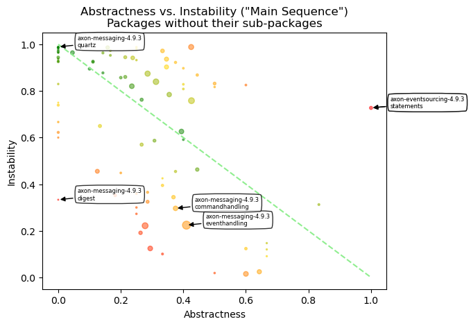
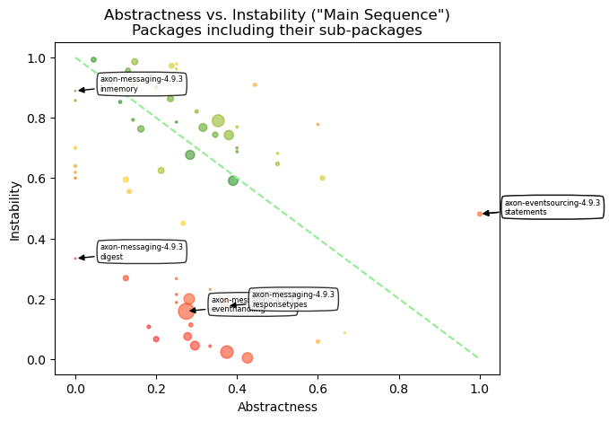

# Object Oriented Design Quality Metrics
   

### References
- [Analyze java package metrics in a graph database](https://joht.github.io/johtizen/data/2023/04/21/java-package-metrics-analysis.html)
- [Calculate metrics](https://101.jqassistant.org/calculate-metrics/index.html)
- [jqassistant](https://jqassistant.org)
- [notebook walks through examples for integrating various packages with Neo4j](https://nicolewhite.github.io/neo4j-jupyter/hello-world.html)
- [OO Design Quality Metrics](https://api.semanticscholar.org/CorpusID:18246616)
- [A Validation of Martin's Metric](https://www.researchgate.net/publication/31598248_A_Validation_of_Martin's_Metric)
- [Neo4j Python Driver](https://neo4j.com/docs/api/python-driver/current)

## Incoming Dependencies

Incoming dependencies are also denoted as "Fan-in", "Afferent Coupling" or "in-degree".
These are the ones that use the listed package. 
   
If these packages get changed, the incoming dependencies might be affected by the change. The more incoming dependencies, the harder it gets to change the code without the need to adapt the dependent code (“rigid code”). Even worse, it might affect the behavior of the dependent code in an unwanted way (“fragile code”).

Since Java Packages are organized hierarchically, incoming dependencies can be count for every package in isolation or by including all of its sub-packages. The latter one is done without top level packages like for example "org" or "org.company" by assuring that only packages are considered that have other packages or types in the same hierarchy level ("siblings").

#### Table 1a
- Show the top 20 Java Packages with the most incoming dependencies
- Set the "incomingDependencies" properties on Package nodes.

<table border="1" class="dataframe">
  <thead>
    <tr style="text-align: right;">
      <th></th>
      <th>artifactName</th>
      <th>fullQualifiedPackageName</th>
      <th>packageName</th>
      <th>incomingDependencies</th>
      <th>incomingDependenciesWeight</th>
      <th>incomingDependentTypes</th>
      <th>incomingDependentInterfaces</th>
      <th>incomingDependentPackages</th>
      <th>incomingDependentArtifacts</th>
    </tr>
  </thead>
  <tbody>
    <tr>
      <th>0</th>
      <td>axon-messaging-4.9.3</td>
      <td>org.axonframework.messaging</td>
      <td>messaging</td>
      <td>8706</td>
      <td>25535</td>
      <td>329</td>
      <td>66</td>
      <td>53</td>
      <td>5</td>
    </tr>
    <tr>
      <th>1</th>
      <td>axon-messaging-4.9.3</td>
      <td>org.axonframework.eventhandling</td>
      <td>eventhandling</td>
      <td>5363</td>
      <td>23731</td>
      <td>301</td>
      <td>57</td>
      <td>46</td>
      <td>4</td>
    </tr>
    <tr>
      <th>2</th>
      <td>axon-messaging-4.9.3</td>
      <td>org.axonframework.commandhandling</td>
      <td>commandhandling</td>
      <td>1641</td>
      <td>5354</td>
      <td>126</td>
      <td>19</td>
      <td>18</td>
      <td>5</td>
    </tr>
    <tr>
      <th>3</th>
      <td>axon-messaging-4.9.3</td>
      <td>org.axonframework.serialization</td>
      <td>serialization</td>
      <td>1233</td>
      <td>5088</td>
      <td>138</td>
      <td>15</td>
      <td>33</td>
      <td>3</td>
    </tr>
    <tr>
      <th>4</th>
      <td>axon-messaging-4.9.3</td>
      <td>org.axonframework.messaging.annotation</td>
      <td>annotation</td>
      <td>1057</td>
      <td>4012</td>
      <td>151</td>
      <td>19</td>
      <td>25</td>
      <td>5</td>
    </tr>
    <tr>
      <th>5</th>
      <td>axon-messaging-4.9.3</td>
      <td>org.axonframework.common</td>
      <td>common</td>
      <td>926</td>
      <td>2126</td>
      <td>338</td>
      <td>12</td>
      <td>78</td>
      <td>5</td>
    </tr>
    <tr>
      <th>6</th>
      <td>axon-messaging-4.9.3</td>
      <td>org.axonframework.tracing</td>
      <td>tracing</td>
      <td>516</td>
      <td>2293</td>
      <td>93</td>
      <td>13</td>
      <td>18</td>
      <td>3</td>
    </tr>
    <tr>
      <th>7</th>
      <td>axon-messaging-4.9.3</td>
      <td>org.axonframework.common.transaction</td>
      <td>transaction</td>
      <td>314</td>
      <td>988</td>
      <td>76</td>
      <td>5</td>
      <td>28</td>
      <td>3</td>
    </tr>
    <tr>
      <th>8</th>
      <td>axon-modelling-4.9.3</td>
      <td>org.axonframework.modelling.command</td>
      <td>command</td>
      <td>269</td>
      <td>927</td>
      <td>79</td>
      <td>8</td>
      <td>10</td>
      <td>4</td>
    </tr>
    <tr>
      <th>9</th>
      <td>axon-modelling-4.9.3</td>
      <td>org.axonframework.modelling.saga</td>
      <td>saga</td>
      <td>257</td>
      <td>1132</td>
      <td>60</td>
      <td>12</td>
      <td>10</td>
      <td>2</td>
    </tr>
    <tr>
      <th>10</th>
      <td>axon-messaging-4.9.3</td>
      <td>org.axonframework.messaging.unitofwork</td>
      <td>unitofwork</td>
      <td>256</td>
      <td>1064</td>
      <td>82</td>
      <td>5</td>
      <td>36</td>
      <td>5</td>
    </tr>
    <tr>
      <th>11</th>
      <td>axon-messaging-4.9.3</td>
      <td>org.axonframework.deadline</td>
      <td>deadline</td>
      <td>238</td>
      <td>1229</td>
      <td>42</td>
      <td>9</td>
      <td>12</td>
      <td>3</td>
    </tr>
    <tr>
      <th>12</th>
      <td>axon-eventsourcing-4.9.3</td>
      <td>org.axonframework.eventsourcing.eventstore.jdbc</td>
      <td>jdbc</td>
      <td>218</td>
      <td>1205</td>
      <td>26</td>
      <td>14</td>
      <td>2</td>
      <td>0</td>
    </tr>
    <tr>
      <th>13</th>
      <td>axon-messaging-4.9.3</td>
      <td>org.axonframework.queryhandling</td>
      <td>queryhandling</td>
      <td>214</td>
      <td>858</td>
      <td>55</td>
      <td>11</td>
      <td>9</td>
      <td>1</td>
    </tr>
    <tr>
      <th>14</th>
      <td>axon-messaging-4.9.3</td>
      <td>org.axonframework.messaging.deadletter</td>
      <td>deadletter</td>
      <td>197</td>
      <td>1140</td>
      <td>35</td>
      <td>8</td>
      <td>6</td>
      <td>1</td>
    </tr>
    <tr>
      <th>15</th>
      <td>axon-messaging-4.9.3</td>
      <td>org.axonframework.monitoring</td>
      <td>monitoring</td>
      <td>188</td>
      <td>500</td>
      <td>39</td>
      <td>6</td>
      <td>10</td>
      <td>3</td>
    </tr>
    <tr>
      <th>16</th>
      <td>axon-eventsourcing-4.9.3</td>
      <td>org.axonframework.eventsourcing.eventstore</td>
      <td>eventstore</td>
      <td>169</td>
      <td>689</td>
      <td>60</td>
      <td>5</td>
      <td>10</td>
      <td>3</td>
    </tr>
    <tr>
      <th>17</th>
      <td>axon-eventsourcing-4.9.3</td>
      <td>org.axonframework.eventsourcing</td>
      <td>eventsourcing</td>
      <td>141</td>
      <td>568</td>
      <td>44</td>
      <td>5</td>
      <td>5</td>
      <td>3</td>
    </tr>
    <tr>
      <th>18</th>
      <td>axon-configuration-4.9.3</td>
      <td>org.axonframework.config</td>
      <td>config</td>
      <td>118</td>
      <td>1224</td>
      <td>35</td>
      <td>0</td>
      <td>1</td>
      <td>0</td>
    </tr>
    <tr>
      <th>19</th>
      <td>axon-messaging-4.9.3</td>
      <td>org.axonframework.commandhandling.gateway</td>
      <td>gateway</td>
      <td>97</td>
      <td>341</td>
      <td>33</td>
      <td>1</td>
      <td>3</td>
      <td>2</td>
    </tr>
  </tbody>
</table>

#### Table 1b
- Show the top 20 Java Packages including their sub-packages with the most incoming dependencies
- Set the property "incomingDependenciesIncludingSubpackages" on Package nodes.

<table border="1" class="dataframe">
  <thead>
    <tr style="text-align: right;">
      <th></th>
      <th>artifactName</th>
      <th>fullQualifiedPackageName</th>
      <th>packageName</th>
      <th>incomingDependencies</th>
      <th>incomingDependenciesWeight</th>
      <th>incomingDependentTypes</th>
      <th>incomingDependentInterfaces</th>
      <th>incomingDependentPackages</th>
      <th>incomingDependentArtifacts</th>
    </tr>
  </thead>
  <tbody>
    <tr>
      <th>0</th>
      <td>axon-messaging-4.9.3</td>
      <td>org.axonframework.messaging</td>
      <td>messaging</td>
      <td>7690</td>
      <td>24528</td>
      <td>328</td>
      <td>81</td>
      <td>52</td>
      <td>5</td>
    </tr>
    <tr>
      <th>1</th>
      <td>axon-messaging-4.9.3</td>
      <td>org.axonframework.eventhandling</td>
      <td>eventhandling</td>
      <td>3109</td>
      <td>12117</td>
      <td>142</td>
      <td>59</td>
      <td>27</td>
      <td>4</td>
    </tr>
    <tr>
      <th>2</th>
      <td>axon-messaging-4.9.3</td>
      <td>org.axonframework.common</td>
      <td>common</td>
      <td>1269</td>
      <td>3565</td>
      <td>360</td>
      <td>19</td>
      <td>70</td>
      <td>5</td>
    </tr>
    <tr>
      <th>3</th>
      <td>axon-messaging-4.9.3</td>
      <td>org.axonframework.serialization</td>
      <td>serialization</td>
      <td>1069</td>
      <td>4438</td>
      <td>92</td>
      <td>16</td>
      <td>28</td>
      <td>3</td>
    </tr>
    <tr>
      <th>4</th>
      <td>axon-messaging-4.9.3</td>
      <td>org.axonframework.messaging.annotation</td>
      <td>annotation</td>
      <td>938</td>
      <td>3665</td>
      <td>106</td>
      <td>19</td>
      <td>24</td>
      <td>5</td>
    </tr>
    <tr>
      <th>5</th>
      <td>axon-messaging-4.9.3</td>
      <td>org.axonframework.commandhandling</td>
      <td>commandhandling</td>
      <td>784</td>
      <td>3114</td>
      <td>57</td>
      <td>19</td>
      <td>13</td>
      <td>5</td>
    </tr>
    <tr>
      <th>6</th>
      <td>axon-messaging-4.9.3</td>
      <td>org.axonframework.tracing</td>
      <td>tracing</td>
      <td>466</td>
      <td>2085</td>
      <td>72</td>
      <td>13</td>
      <td>16</td>
      <td>3</td>
    </tr>
    <tr>
      <th>7</th>
      <td>axon-messaging-4.9.3</td>
      <td>org.axonframework.common.transaction</td>
      <td>transaction</td>
      <td>308</td>
      <td>974</td>
      <td>73</td>
      <td>5</td>
      <td>27</td>
      <td>3</td>
    </tr>
    <tr>
      <th>8</th>
      <td>axon-messaging-4.9.3</td>
      <td>org.axonframework.messaging.unitofwork</td>
      <td>unitofwork</td>
      <td>219</td>
      <td>847</td>
      <td>71</td>
      <td>5</td>
      <td>35</td>
      <td>5</td>
    </tr>
    <tr>
      <th>9</th>
      <td>axon-messaging-4.9.3</td>
      <td>org.axonframework.monitoring</td>
      <td>monitoring</td>
      <td>178</td>
      <td>470</td>
      <td>34</td>
      <td>6</td>
      <td>9</td>
      <td>3</td>
    </tr>
    <tr>
      <th>10</th>
      <td>axon-messaging-4.9.3</td>
      <td>org.axonframework.messaging.deadletter</td>
      <td>deadletter</td>
      <td>165</td>
      <td>1008</td>
      <td>20</td>
      <td>8</td>
      <td>5</td>
      <td>1</td>
    </tr>
    <tr>
      <th>11</th>
      <td>axon-modelling-4.9.3</td>
      <td>org.axonframework.modelling.command</td>
      <td>command</td>
      <td>159</td>
      <td>526</td>
      <td>37</td>
      <td>8</td>
      <td>7</td>
      <td>3</td>
    </tr>
    <tr>
      <th>12</th>
      <td>axon-messaging-4.9.3</td>
      <td>org.axonframework.deadline</td>
      <td>deadline</td>
      <td>114</td>
      <td>727</td>
      <td>19</td>
      <td>9</td>
      <td>8</td>
      <td>3</td>
    </tr>
    <tr>
      <th>13</th>
      <td>axon-eventsourcing-4.9.3</td>
      <td>org.axonframework.eventsourcing</td>
      <td>eventsourcing</td>
      <td>101</td>
      <td>385</td>
      <td>14</td>
      <td>6</td>
      <td>3</td>
      <td>2</td>
    </tr>
    <tr>
      <th>14</th>
      <td>axon-eventsourcing-4.9.3</td>
      <td>org.axonframework.eventsourcing.eventstore</td>
      <td>eventstore</td>
      <td>85</td>
      <td>230</td>
      <td>23</td>
      <td>5</td>
      <td>5</td>
      <td>3</td>
    </tr>
    <tr>
      <th>15</th>
      <td>axon-modelling-4.9.3</td>
      <td>org.axonframework.modelling.saga</td>
      <td>saga</td>
      <td>74</td>
      <td>225</td>
      <td>18</td>
      <td>12</td>
      <td>3</td>
      <td>1</td>
    </tr>
    <tr>
      <th>16</th>
      <td>axon-messaging-4.9.3</td>
      <td>org.axonframework.lifecycle</td>
      <td>lifecycle</td>
      <td>65</td>
      <td>161</td>
      <td>19</td>
      <td>3</td>
      <td>13</td>
      <td>2</td>
    </tr>
    <tr>
      <th>17</th>
      <td>axon-messaging-4.9.3</td>
      <td>org.axonframework.messaging.responsetypes</td>
      <td>responsetypes</td>
      <td>61</td>
      <td>280</td>
      <td>14</td>
      <td>4</td>
      <td>3</td>
      <td>0</td>
    </tr>
    <tr>
      <th>18</th>
      <td>axon-messaging-4.9.3</td>
      <td>org.axonframework.queryhandling</td>
      <td>queryhandling</td>
      <td>53</td>
      <td>178</td>
      <td>8</td>
      <td>10</td>
      <td>6</td>
      <td>1</td>
    </tr>
    <tr>
      <th>19</th>
      <td>axon-messaging-4.9.3</td>
      <td>org.axonframework.eventhandling.tokenstore</td>
      <td>tokenstore</td>
      <td>47</td>
      <td>186</td>
      <td>21</td>
      <td>3</td>
      <td>3</td>
      <td>1</td>
    </tr>
  </tbody>
</table>

## Outgoing Dependencies

Outgoing dependencies are also denoted as "Fan-out", "Efferent Coupling" or "out-degree".
These are the ones that are used by the listed package. 

Code from other packages and libraries you’re depending on (outgoing) might change over time. The more outgoing changes, the more likely and frequently code changes are needed. This involves time and effort which can be reduced by automation of tests and version updates. Automated tests are crucial to reveal updates, that change the behavior of the code unexpectedly (“fragile code”). As soon as more effort is required, keeping up becomes difficult (“rigid code”). Not being able to use a newer version might not only restrict features, it can get problematic if there are security issues. This might force you to take “fast but ugly” solutions into account which further increases technical dept.

Since Java Packages are organized hierarchically, outgoing dependencies can be count for every package in isolation or by including all of its sub-packages. The latter one is done without top level packages like for example "org" or "org.company" by assuring that only packages are considered that have other packages or types in the same hierarchy level ("siblings").

#### Table 2a

- Show the top 20 Java Packages with the most outgoing dependencies
- Set the "outgoingDependencies" properties on Package nodes.

<table border="1" class="dataframe">
  <thead>
    <tr style="text-align: right;">
      <th></th>
      <th>artifactName</th>
      <th>fullQualifiedPackageName</th>
      <th>packageName</th>
      <th>outgoingDependencies</th>
      <th>outgoingDependenciesWeight</th>
      <th>outgoingDependentTypes</th>
      <th>outgoingDependentInterfaces</th>
      <th>outgoingDependentPackages</th>
      <th>outgoingDependentArtifacts</th>
    </tr>
  </thead>
  <tbody>
    <tr>
      <th>0</th>
      <td>axon-configuration-4.9.3</td>
      <td>org.axonframework.config</td>
      <td>config</td>
      <td>9863</td>
      <td>37635</td>
      <td>241</td>
      <td>92</td>
      <td>46</td>
      <td>4</td>
    </tr>
    <tr>
      <th>1</th>
      <td>axon-test-4.9.3</td>
      <td>org.axonframework.test.aggregate</td>
      <td>aggregate</td>
      <td>2210</td>
      <td>7943</td>
      <td>92</td>
      <td>34</td>
      <td>16</td>
      <td>3</td>
    </tr>
    <tr>
      <th>2</th>
      <td>axon-messaging-4.9.3</td>
      <td>org.axonframework.eventhandling</td>
      <td>eventhandling</td>
      <td>1563</td>
      <td>6457</td>
      <td>160</td>
      <td>57</td>
      <td>16</td>
      <td>0</td>
    </tr>
    <tr>
      <th>3</th>
      <td>axon-disruptor-4.9.3</td>
      <td>org.axonframework.disruptor.commandhandling</td>
      <td>commandhandling</td>
      <td>1453</td>
      <td>5180</td>
      <td>84</td>
      <td>30</td>
      <td>14</td>
      <td>3</td>
    </tr>
    <tr>
      <th>4</th>
      <td>axon-test-4.9.3</td>
      <td>org.axonframework.test.saga</td>
      <td>saga</td>
      <td>1419</td>
      <td>4096</td>
      <td>81</td>
      <td>26</td>
      <td>17</td>
      <td>2</td>
    </tr>
    <tr>
      <th>5</th>
      <td>axon-eventsourcing-4.9.3</td>
      <td>org.axonframework.eventsourcing.eventstore.jdbc</td>
      <td>jdbc</td>
      <td>1340</td>
      <td>6712</td>
      <td>51</td>
      <td>27</td>
      <td>11</td>
      <td>2</td>
    </tr>
    <tr>
      <th>6</th>
      <td>axon-messaging-4.9.3</td>
      <td>org.axonframework.queryhandling</td>
      <td>queryhandling</td>
      <td>1141</td>
      <td>5254</td>
      <td>86</td>
      <td>30</td>
      <td>11</td>
      <td>0</td>
    </tr>
    <tr>
      <th>7</th>
      <td>axon-eventsourcing-4.9.3</td>
      <td>org.axonframework.eventsourcing</td>
      <td>eventsourcing</td>
      <td>1009</td>
      <td>3348</td>
      <td>95</td>
      <td>33</td>
      <td>16</td>
      <td>2</td>
    </tr>
    <tr>
      <th>8</th>
      <td>axon-messaging-4.9.3</td>
      <td>org.axonframework.eventhandling.pooled</td>
      <td>pooled</td>
      <td>885</td>
      <td>4117</td>
      <td>56</td>
      <td>24</td>
      <td>12</td>
      <td>0</td>
    </tr>
    <tr>
      <th>9</th>
      <td>axon-modelling-4.9.3</td>
      <td>org.axonframework.modelling.command</td>
      <td>command</td>
      <td>842</td>
      <td>3161</td>
      <td>94</td>
      <td>34</td>
      <td>15</td>
      <td>1</td>
    </tr>
    <tr>
      <th>10</th>
      <td>axon-modelling-4.9.3</td>
      <td>org.axonframework.modelling.command.inspection</td>
      <td>inspection</td>
      <td>781</td>
      <td>3026</td>
      <td>73</td>
      <td>28</td>
      <td>10</td>
      <td>1</td>
    </tr>
    <tr>
      <th>11</th>
      <td>axon-messaging-4.9.3</td>
      <td>org.axonframework.commandhandling.distributed</td>
      <td>distributed</td>
      <td>738</td>
      <td>2227</td>
      <td>74</td>
      <td>27</td>
      <td>12</td>
      <td>0</td>
    </tr>
    <tr>
      <th>12</th>
      <td>axon-messaging-4.9.3</td>
      <td>org.axonframework.commandhandling</td>
      <td>commandhandling</td>
      <td>691</td>
      <td>1832</td>
      <td>74</td>
      <td>30</td>
      <td>9</td>
      <td>0</td>
    </tr>
    <tr>
      <th>13</th>
      <td>axon-eventsourcing-4.9.3</td>
      <td>org.axonframework.eventsourcing.eventstore</td>
      <td>eventstore</td>
      <td>613</td>
      <td>1981</td>
      <td>65</td>
      <td>26</td>
      <td>16</td>
      <td>2</td>
    </tr>
    <tr>
      <th>14</th>
      <td>axon-messaging-4.9.3</td>
      <td>org.axonframework.eventhandling.deadletter.jdbc</td>
      <td>jdbc</td>
      <td>560</td>
      <td>3512</td>
      <td>49</td>
      <td>20</td>
      <td>8</td>
      <td>0</td>
    </tr>
    <tr>
      <th>15</th>
      <td>axon-messaging-4.9.3</td>
      <td>org.axonframework.deadline.dbscheduler</td>
      <td>dbscheduler</td>
      <td>488</td>
      <td>1845</td>
      <td>40</td>
      <td>17</td>
      <td>9</td>
      <td>0</td>
    </tr>
    <tr>
      <th>16</th>
      <td>axon-messaging-4.9.3</td>
      <td>org.axonframework.deadline.quartz</td>
      <td>quartz</td>
      <td>453</td>
      <td>1492</td>
      <td>40</td>
      <td>18</td>
      <td>10</td>
      <td>0</td>
    </tr>
    <tr>
      <th>17</th>
      <td>axon-messaging-4.9.3</td>
      <td>org.axonframework.commandhandling.gateway</td>
      <td>gateway</td>
      <td>443</td>
      <td>1199</td>
      <td>56</td>
      <td>11</td>
      <td>10</td>
      <td>0</td>
    </tr>
    <tr>
      <th>18</th>
      <td>axon-modelling-4.9.3</td>
      <td>org.axonframework.modelling.saga</td>
      <td>saga</td>
      <td>432</td>
      <td>1464</td>
      <td>62</td>
      <td>23</td>
      <td>9</td>
      <td>1</td>
    </tr>
    <tr>
      <th>19</th>
      <td>axon-messaging-4.9.3</td>
      <td>org.axonframework.deadline.jobrunr</td>
      <td>jobrunr</td>
      <td>419</td>
      <td>1315</td>
      <td>37</td>
      <td>17</td>
      <td>10</td>
      <td>0</td>
    </tr>
  </tbody>
</table>

#### Table 2b

- Show the top 20 Java Packages including their sub-packages with the most outgoing dependencies
- Set the property "outgoingDependenciesIncludingSubpackages" on Package nodes.

<table border="1" class="dataframe">
  <thead>
    <tr style="text-align: right;">
      <th></th>
      <th>artifactName</th>
      <th>fullQualifiedPackageName</th>
      <th>packageName</th>
      <th>outgoingDependencies</th>
      <th>outgoingDependenciesWeight</th>
      <th>outgoingDependentTypes</th>
      <th>outgoingDependentInterfaces</th>
      <th>outgoingDependentPackages</th>
      <th>outgoingDependentArtifacts</th>
    </tr>
  </thead>
  <tbody>
    <tr>
      <th>0</th>
      <td>axon-messaging-4.9.3</td>
      <td>org.axonframework.eventhandling</td>
      <td>eventhandling</td>
      <td>585</td>
      <td>2115</td>
      <td>106</td>
      <td>51</td>
      <td>20</td>
      <td>0</td>
    </tr>
    <tr>
      <th>1</th>
      <td>axon-configuration-4.9.3</td>
      <td>org.axonframework.config</td>
      <td>config</td>
      <td>539</td>
      <td>1689</td>
      <td>201</td>
      <td>11</td>
      <td>45</td>
      <td>3</td>
    </tr>
    <tr>
      <th>2</th>
      <td>axon-eventsourcing-4.9.3</td>
      <td>org.axonframework.eventsourcing</td>
      <td>eventsourcing</td>
      <td>380</td>
      <td>1319</td>
      <td>95</td>
      <td>10</td>
      <td>22</td>
      <td>1</td>
    </tr>
    <tr>
      <th>3</th>
      <td>axon-test-4.9.3</td>
      <td>org.axonframework.test</td>
      <td>test</td>
      <td>273</td>
      <td>791</td>
      <td>99</td>
      <td>4</td>
      <td>17</td>
      <td>2</td>
    </tr>
    <tr>
      <th>4</th>
      <td>axon-eventsourcing-4.9.3</td>
      <td>org.axonframework.eventsourcing.eventstore</td>
      <td>eventstore</td>
      <td>245</td>
      <td>914</td>
      <td>58</td>
      <td>6</td>
      <td>19</td>
      <td>2</td>
    </tr>
    <tr>
      <th>5</th>
      <td>axon-modelling-4.9.3</td>
      <td>org.axonframework.modelling.command</td>
      <td>command</td>
      <td>230</td>
      <td>759</td>
      <td>63</td>
      <td>9</td>
      <td>14</td>
      <td>0</td>
    </tr>
    <tr>
      <th>6</th>
      <td>axon-messaging-4.9.3</td>
      <td>org.axonframework.eventhandling.deadletter</td>
      <td>deadletter</td>
      <td>207</td>
      <td>993</td>
      <td>57</td>
      <td>4</td>
      <td>10</td>
      <td>0</td>
    </tr>
    <tr>
      <th>7</th>
      <td>axon-messaging-4.9.3</td>
      <td>org.axonframework.commandhandling</td>
      <td>commandhandling</td>
      <td>195</td>
      <td>482</td>
      <td>67</td>
      <td>20</td>
      <td>13</td>
      <td>0</td>
    </tr>
    <tr>
      <th>8</th>
      <td>axon-messaging-4.9.3</td>
      <td>org.axonframework.deadline</td>
      <td>deadline</td>
      <td>190</td>
      <td>608</td>
      <td>48</td>
      <td>9</td>
      <td>11</td>
      <td>0</td>
    </tr>
    <tr>
      <th>9</th>
      <td>axon-messaging-4.9.3</td>
      <td>org.axonframework.messaging</td>
      <td>messaging</td>
      <td>183</td>
      <td>480</td>
      <td>27</td>
      <td>54</td>
      <td>8</td>
      <td>0</td>
    </tr>
    <tr>
      <th>10</th>
      <td>axon-messaging-4.9.3</td>
      <td>org.axonframework.queryhandling</td>
      <td>queryhandling</td>
      <td>175</td>
      <td>607</td>
      <td>51</td>
      <td>12</td>
      <td>9</td>
      <td>0</td>
    </tr>
    <tr>
      <th>11</th>
      <td>axon-modelling-4.9.3</td>
      <td>org.axonframework.modelling.saga</td>
      <td>saga</td>
      <td>155</td>
      <td>474</td>
      <td>58</td>
      <td>9</td>
      <td>15</td>
      <td>0</td>
    </tr>
    <tr>
      <th>12</th>
      <td>axon-test-4.9.3</td>
      <td>org.axonframework.test.aggregate</td>
      <td>aggregate</td>
      <td>149</td>
      <td>548</td>
      <td>74</td>
      <td>1</td>
      <td>15</td>
      <td>3</td>
    </tr>
    <tr>
      <th>13</th>
      <td>axon-disruptor-4.9.3</td>
      <td>org.axonframework.disruptor.commandhandling</td>
      <td>commandhandling</td>
      <td>130</td>
      <td>436</td>
      <td>62</td>
      <td>0</td>
      <td>13</td>
      <td>2</td>
    </tr>
    <tr>
      <th>14</th>
      <td>axon-modelling-4.9.3</td>
      <td>org.axonframework.modelling.command.inspection</td>
      <td>inspection</td>
      <td>119</td>
      <td>416</td>
      <td>51</td>
      <td>3</td>
      <td>9</td>
      <td>1</td>
    </tr>
    <tr>
      <th>15</th>
      <td>axon-test-4.9.3</td>
      <td>org.axonframework.test.saga</td>
      <td>saga</td>
      <td>111</td>
      <td>387</td>
      <td>60</td>
      <td>2</td>
      <td>16</td>
      <td>2</td>
    </tr>
    <tr>
      <th>16</th>
      <td>axon-messaging-4.9.3</td>
      <td>org.axonframework.eventhandling.pooled</td>
      <td>pooled</td>
      <td>105</td>
      <td>453</td>
      <td>35</td>
      <td>1</td>
      <td>11</td>
      <td>0</td>
    </tr>
    <tr>
      <th>17</th>
      <td>axon-modelling-4.9.3</td>
      <td>org.axonframework.modelling.saga.repository</td>
      <td>repository</td>
      <td>103</td>
      <td>441</td>
      <td>34</td>
      <td>5</td>
      <td>12</td>
      <td>1</td>
    </tr>
    <tr>
      <th>18</th>
      <td>axon-messaging-4.9.3</td>
      <td>org.axonframework.commandhandling.distributed</td>
      <td>distributed</td>
      <td>93</td>
      <td>248</td>
      <td>48</td>
      <td>3</td>
      <td>10</td>
      <td>0</td>
    </tr>
    <tr>
      <th>19</th>
      <td>axon-messaging-4.9.3</td>
      <td>org.axonframework.eventhandling.scheduling</td>
      <td>scheduling</td>
      <td>88</td>
      <td>291</td>
      <td>22</td>
      <td>0</td>
      <td>9</td>
      <td>0</td>
    </tr>
  </tbody>
</table>

## Instability

$$ Instability = \frac{Outgoing\:Dependencies}{Outgoing\:Dependencies + Incoming\:Dependencies} $$

*Instability* is expressed as the ratio of the number of outgoing dependencies of a module (i.e., the number of packages that depend on it) to the total number of dependencies (i.e., the sum of incoming and outgoing dependencies).

Small values near zero indicate low *Instability*. With no outgoing but some incoming dependencies the Instability is zero which is denoted as maximally stable. Such code units are more rigid and difficult to change without impacting other parts of the system. If they are changed less because of that, they are considered stable.

Conversely, high values approaching one indicate high *Instability*. With some outgoing dependencies but no incoming ones the *Instability* is denoted as maximally unstable. Such code units are easier to change without affecting other modules, making them more flexible and less prone to cascading changes throughout the system. If they are changed more often because of that, they are considered unstable.

Since Java Packages are organized hierarchically, *Instability* can be calculated for every package in isolation or by including all of its sub-packages. 

#### Table 3a

- Show the top 20 Java Packages with the lowest *Instability*
- Set the property "instability" on Package nodes. 

<table border="1" class="dataframe">
  <thead>
    <tr style="text-align: right;">
      <th></th>
      <th>artifactName</th>
      <th>fullQualifiedPackageName</th>
      <th>packageName</th>
      <th>instability</th>
      <th>instabilityTypes</th>
      <th>instabilityInterfaces</th>
      <th>instabilityPackages</th>
      <th>instabilityArtifacts</th>
      <th>p.outgoingDependencies</th>
      <th>p.incomingDependencies</th>
      <th>p.outgoingDependentTypes</th>
      <th>p.incomingDependentTypes</th>
      <th>p.outgoingDependentInterfaces</th>
      <th>p.incomingDependentInterfaces</th>
      <th>p.outgoingDependentPackages</th>
      <th>p.incomingDependentPackages</th>
      <th>p.outgoingDependentArtifacts</th>
      <th>p.incomingDependentArtifacts</th>
    </tr>
  </thead>
  <tbody>
    <tr>
      <th>0</th>
      <td>axon-messaging-4.9.3</td>
      <td>org.axonframework.messaging</td>
      <td>messaging</td>
      <td>0.015047</td>
      <td>0.096154</td>
      <td>0.185185</td>
      <td>0.101695</td>
      <td>0.0</td>
      <td>133</td>
      <td>8706</td>
      <td>35</td>
      <td>329</td>
      <td>15</td>
      <td>66</td>
      <td>6</td>
      <td>53</td>
      <td>0</td>
      <td>5</td>
    </tr>
    <tr>
      <th>1</th>
      <td>axon-messaging-4.9.3</td>
      <td>org.axonframework.common.transaction</td>
      <td>transaction</td>
      <td>0.018750</td>
      <td>0.050000</td>
      <td>0.000000</td>
      <td>0.034483</td>
      <td>0.0</td>
      <td>6</td>
      <td>314</td>
      <td>4</td>
      <td>76</td>
      <td>0</td>
      <td>5</td>
      <td>1</td>
      <td>28</td>
      <td>0</td>
      <td>3</td>
    </tr>
    <tr>
      <th>2</th>
      <td>axon-messaging-4.9.3</td>
      <td>org.axonframework.common</td>
      <td>common</td>
      <td>0.024236</td>
      <td>0.042493</td>
      <td>0.000000</td>
      <td>0.012658</td>
      <td>0.0</td>
      <td>23</td>
      <td>926</td>
      <td>15</td>
      <td>338</td>
      <td>0</td>
      <td>12</td>
      <td>1</td>
      <td>78</td>
      <td>0</td>
      <td>5</td>
    </tr>
    <tr>
      <th>3</th>
      <td>axon-messaging-4.9.3</td>
      <td>org.axonframework.eventhandling.scheduling</td>
      <td>scheduling</td>
      <td>0.090909</td>
      <td>0.142857</td>
      <td>0.000000</td>
      <td>0.222222</td>
      <td>0.0</td>
      <td>2</td>
      <td>20</td>
      <td>2</td>
      <td>12</td>
      <td>0</td>
      <td>2</td>
      <td>2</td>
      <td>7</td>
      <td>0</td>
      <td>2</td>
    </tr>
    <tr>
      <th>4</th>
      <td>axon-messaging-4.9.3</td>
      <td>org.axonframework.monitoring</td>
      <td>monitoring</td>
      <td>0.100478</td>
      <td>0.152174</td>
      <td>0.333333</td>
      <td>0.230769</td>
      <td>0.0</td>
      <td>21</td>
      <td>188</td>
      <td>7</td>
      <td>39</td>
      <td>3</td>
      <td>6</td>
      <td>3</td>
      <td>10</td>
      <td>0</td>
      <td>3</td>
    </tr>
    <tr>
      <th>5</th>
      <td>axon-messaging-4.9.3</td>
      <td>org.axonframework.common.annotation</td>
      <td>annotation</td>
      <td>0.120000</td>
      <td>0.120000</td>
      <td>0.000000</td>
      <td>0.166667</td>
      <td>0.0</td>
      <td>3</td>
      <td>22</td>
      <td>3</td>
      <td>22</td>
      <td>0</td>
      <td>0</td>
      <td>2</td>
      <td>10</td>
      <td>0</td>
      <td>2</td>
    </tr>
    <tr>
      <th>6</th>
      <td>axon-messaging-4.9.3</td>
      <td>org.axonframework.lifecycle</td>
      <td>lifecycle</td>
      <td>0.123457</td>
      <td>0.233333</td>
      <td>0.000000</td>
      <td>0.176471</td>
      <td>0.0</td>
      <td>10</td>
      <td>71</td>
      <td>7</td>
      <td>23</td>
      <td>0</td>
      <td>3</td>
      <td>3</td>
      <td>14</td>
      <td>0</td>
      <td>2</td>
    </tr>
    <tr>
      <th>7</th>
      <td>axon-messaging-4.9.3</td>
      <td>org.axonframework.serialization</td>
      <td>serialization</td>
      <td>0.124911</td>
      <td>0.250000</td>
      <td>0.318182</td>
      <td>0.214286</td>
      <td>0.0</td>
      <td>176</td>
      <td>1233</td>
      <td>46</td>
      <td>138</td>
      <td>7</td>
      <td>15</td>
      <td>9</td>
      <td>33</td>
      <td>0</td>
      <td>3</td>
    </tr>
    <tr>
      <th>8</th>
      <td>axon-messaging-4.9.3</td>
      <td>org.axonframework.common.stream</td>
      <td>stream</td>
      <td>0.147059</td>
      <td>0.166667</td>
      <td>0.000000</td>
      <td>0.125000</td>
      <td>0.0</td>
      <td>5</td>
      <td>29</td>
      <td>3</td>
      <td>15</td>
      <td>0</td>
      <td>2</td>
      <td>1</td>
      <td>7</td>
      <td>0</td>
      <td>2</td>
    </tr>
    <tr>
      <th>9</th>
      <td>axon-messaging-4.9.3</td>
      <td>org.axonframework.tracing</td>
      <td>tracing</td>
      <td>0.191223</td>
      <td>0.225000</td>
      <td>0.480000</td>
      <td>0.333333</td>
      <td>0.0</td>
      <td>122</td>
      <td>516</td>
      <td>27</td>
      <td>93</td>
      <td>12</td>
      <td>13</td>
      <td>9</td>
      <td>18</td>
      <td>0</td>
      <td>3</td>
    </tr>
    <tr>
      <th>10</th>
      <td>axon-messaging-4.9.3</td>
      <td>org.axonframework.messaging.annotation</td>
      <td>annotation</td>
      <td>0.221649</td>
      <td>0.307339</td>
      <td>0.406250</td>
      <td>0.218750</td>
      <td>0.0</td>
      <td>301</td>
      <td>1057</td>
      <td>67</td>
      <td>151</td>
      <td>13</td>
      <td>19</td>
      <td>7</td>
      <td>25</td>
      <td>0</td>
      <td>5</td>
    </tr>
    <tr>
      <th>11</th>
      <td>axon-messaging-4.9.3</td>
      <td>org.axonframework.eventhandling</td>
      <td>eventhandling</td>
      <td>0.225671</td>
      <td>0.347072</td>
      <td>0.500000</td>
      <td>0.258065</td>
      <td>0.0</td>
      <td>1563</td>
      <td>5363</td>
      <td>160</td>
      <td>301</td>
      <td>57</td>
      <td>57</td>
      <td>16</td>
      <td>46</td>
      <td>0</td>
      <td>4</td>
    </tr>
    <tr>
      <th>12</th>
      <td>axon-messaging-4.9.3</td>
      <td>org.axonframework.common.jpa</td>
      <td>jpa</td>
      <td>0.272727</td>
      <td>0.250000</td>
      <td>1.000000</td>
      <td>0.300000</td>
      <td>0.0</td>
      <td>6</td>
      <td>16</td>
      <td>5</td>
      <td>15</td>
      <td>2</td>
      <td>0</td>
      <td>3</td>
      <td>7</td>
      <td>0</td>
      <td>3</td>
    </tr>
    <tr>
      <th>13</th>
      <td>axon-messaging-4.9.3</td>
      <td>org.axonframework.commandhandling</td>
      <td>commandhandling</td>
      <td>0.296312</td>
      <td>0.370000</td>
      <td>0.612245</td>
      <td>0.333333</td>
      <td>0.0</td>
      <td>691</td>
      <td>1641</td>
      <td>74</td>
      <td>126</td>
      <td>30</td>
      <td>19</td>
      <td>9</td>
      <td>18</td>
      <td>0</td>
      <td>5</td>
    </tr>
    <tr>
      <th>14</th>
      <td>axon-messaging-4.9.3</td>
      <td>org.axonframework.common.legacyjpa</td>
      <td>legacyjpa</td>
      <td>0.300000</td>
      <td>0.277778</td>
      <td>1.000000</td>
      <td>0.333333</td>
      <td>0.0</td>
      <td>6</td>
      <td>14</td>
      <td>5</td>
      <td>13</td>
      <td>2</td>
      <td>0</td>
      <td>3</td>
      <td>6</td>
      <td>0</td>
      <td>2</td>
    </tr>
    <tr>
      <th>15</th>
      <td>axon-messaging-4.9.3</td>
      <td>org.axonframework.serialization.upcasting</td>
      <td>upcasting</td>
      <td>0.312500</td>
      <td>0.083333</td>
      <td>0.000000</td>
      <td>0.333333</td>
      <td>0.0</td>
      <td>5</td>
      <td>11</td>
      <td>1</td>
      <td>11</td>
      <td>0</td>
      <td>1</td>
      <td>1</td>
      <td>2</td>
      <td>0</td>
      <td>0</td>
    </tr>
    <tr>
      <th>16</th>
      <td>axon-messaging-4.9.3</td>
      <td>org.axonframework.messaging.unitofwork</td>
      <td>unitofwork</td>
      <td>0.324538</td>
      <td>0.196078</td>
      <td>0.583333</td>
      <td>0.121951</td>
      <td>0.0</td>
      <td>123</td>
      <td>256</td>
      <td>20</td>
      <td>82</td>
      <td>7</td>
      <td>5</td>
      <td>5</td>
      <td>36</td>
      <td>0</td>
      <td>5</td>
    </tr>
    <tr>
      <th>17</th>
      <td>axon-messaging-4.9.3</td>
      <td>org.axonframework.common.digest</td>
      <td>digest</td>
      <td>0.333333</td>
      <td>0.333333</td>
      <td>0.000000</td>
      <td>0.333333</td>
      <td>0.0</td>
      <td>1</td>
      <td>2</td>
      <td>1</td>
      <td>2</td>
      <td>0</td>
      <td>0</td>
      <td>1</td>
      <td>2</td>
      <td>0</td>
      <td>0</td>
    </tr>
    <tr>
      <th>18</th>
      <td>axon-messaging-4.9.3</td>
      <td>org.axonframework.messaging.deadletter</td>
      <td>deadletter</td>
      <td>0.341137</td>
      <td>0.396552</td>
      <td>0.500000</td>
      <td>0.454545</td>
      <td>0.0</td>
      <td>102</td>
      <td>197</td>
      <td>23</td>
      <td>35</td>
      <td>8</td>
      <td>8</td>
      <td>5</td>
      <td>6</td>
      <td>0</td>
      <td>1</td>
    </tr>
    <tr>
      <th>19</th>
      <td>axon-messaging-4.9.3</td>
      <td>org.axonframework.common.lock</td>
      <td>lock</td>
      <td>0.352113</td>
      <td>0.363636</td>
      <td>0.500000</td>
      <td>0.222222</td>
      <td>0.0</td>
      <td>25</td>
      <td>46</td>
      <td>12</td>
      <td>21</td>
      <td>2</td>
      <td>2</td>
      <td>2</td>
      <td>7</td>
      <td>0</td>
      <td>3</td>
    </tr>
  </tbody>
</table>

#### Table 3b

- Show the top 20 Java Packages including their sub-packages with the lowest *Instability*
- Set the property "instabilityIncludingSubpackages" on Package nodes. 

<table border="1" class="dataframe">
  <thead>
    <tr style="text-align: right;">
      <th></th>
      <th>artifactName</th>
      <th>fullQualifiedPackageName</th>
      <th>packageName</th>
      <th>instability</th>
      <th>instabilityTypes</th>
      <th>instabilityInterfaces</th>
      <th>instabilityPackages</th>
      <th>instabilityArtifacts</th>
      <th>p.outgoingDependenciesIncludingSubpackages</th>
      <th>p.incomingDependenciesIncludingSubpackages</th>
      <th>p.outgoingDependentTypesIncludingSubpackages</th>
      <th>p.incomingDependentTypesIncludingSubpackages</th>
      <th>p.outgoingDependentInterfacesIncludingSubpackages</th>
      <th>p.incomingDependentInterfacesIncludingSubpackages</th>
      <th>p.outgoingDependentPackagesIncludingSubpackages</th>
      <th>p.incomingDependentPackagesIncludingSubpackages</th>
      <th>p.outgoingDependentArtifactsIncludingSubpackages</th>
      <th>p.incomingDependentArtifactsIncludingSubpackages</th>
    </tr>
  </thead>
  <tbody>
    <tr>
      <th>0</th>
      <td>axon-messaging-4.9.3</td>
      <td>org.axonframework.common</td>
      <td>common</td>
      <td>0.003925</td>
      <td>0.013699</td>
      <td>0.000000</td>
      <td>0.027778</td>
      <td>0.0</td>
      <td>5</td>
      <td>1269</td>
      <td>5</td>
      <td>360</td>
      <td>0</td>
      <td>19</td>
      <td>2</td>
      <td>70</td>
      <td>0</td>
      <td>5</td>
    </tr>
    <tr>
      <th>1</th>
      <td>axon-messaging-4.9.3</td>
      <td>org.axonframework.messaging</td>
      <td>messaging</td>
      <td>0.023244</td>
      <td>0.076056</td>
      <td>0.400000</td>
      <td>0.133333</td>
      <td>0.0</td>
      <td>183</td>
      <td>7690</td>
      <td>27</td>
      <td>328</td>
      <td>54</td>
      <td>81</td>
      <td>8</td>
      <td>52</td>
      <td>0</td>
      <td>5</td>
    </tr>
    <tr>
      <th>2</th>
      <td>axon-messaging-4.9.3</td>
      <td>org.axonframework.monitoring</td>
      <td>monitoring</td>
      <td>0.043011</td>
      <td>0.055556</td>
      <td>0.454545</td>
      <td>0.181818</td>
      <td>0.0</td>
      <td>8</td>
      <td>178</td>
      <td>2</td>
      <td>34</td>
      <td>5</td>
      <td>6</td>
      <td>2</td>
      <td>9</td>
      <td>0</td>
      <td>3</td>
    </tr>
    <tr>
      <th>3</th>
      <td>axon-messaging-4.9.3</td>
      <td>org.axonframework.serialization</td>
      <td>serialization</td>
      <td>0.044683</td>
      <td>0.206897</td>
      <td>0.200000</td>
      <td>0.222222</td>
      <td>0.0</td>
      <td>50</td>
      <td>1069</td>
      <td>24</td>
      <td>92</td>
      <td>4</td>
      <td>16</td>
      <td>8</td>
      <td>28</td>
      <td>0</td>
      <td>3</td>
    </tr>
    <tr>
      <th>4</th>
      <td>axon-messaging-4.9.3</td>
      <td>org.axonframework.lifecycle</td>
      <td>lifecycle</td>
      <td>0.057971</td>
      <td>0.095238</td>
      <td>0.000000</td>
      <td>0.133333</td>
      <td>0.0</td>
      <td>4</td>
      <td>65</td>
      <td>2</td>
      <td>19</td>
      <td>0</td>
      <td>3</td>
      <td>2</td>
      <td>13</td>
      <td>0</td>
      <td>2</td>
    </tr>
    <tr>
      <th>5</th>
      <td>axon-messaging-4.9.3</td>
      <td>org.axonframework.tracing</td>
      <td>tracing</td>
      <td>0.066132</td>
      <td>0.162791</td>
      <td>0.187500</td>
      <td>0.333333</td>
      <td>0.0</td>
      <td>33</td>
      <td>466</td>
      <td>14</td>
      <td>72</td>
      <td>3</td>
      <td>13</td>
      <td>8</td>
      <td>16</td>
      <td>0</td>
      <td>3</td>
    </tr>
    <tr>
      <th>6</th>
      <td>axon-messaging-4.9.3</td>
      <td>org.axonframework.messaging.annotation</td>
      <td>annotation</td>
      <td>0.074951</td>
      <td>0.158730</td>
      <td>0.424242</td>
      <td>0.200000</td>
      <td>0.0</td>
      <td>76</td>
      <td>938</td>
      <td>20</td>
      <td>106</td>
      <td>14</td>
      <td>19</td>
      <td>6</td>
      <td>24</td>
      <td>0</td>
      <td>5</td>
    </tr>
    <tr>
      <th>7</th>
      <td>axon-messaging-4.9.3</td>
      <td>org.axonframework.common.annotation</td>
      <td>annotation</td>
      <td>0.086957</td>
      <td>0.086957</td>
      <td>0.000000</td>
      <td>0.100000</td>
      <td>0.0</td>
      <td>2</td>
      <td>21</td>
      <td>2</td>
      <td>21</td>
      <td>0</td>
      <td>0</td>
      <td>1</td>
      <td>9</td>
      <td>0</td>
      <td>2</td>
    </tr>
    <tr>
      <th>8</th>
      <td>axon-messaging-4.9.3</td>
      <td>org.axonframework.common.lock</td>
      <td>lock</td>
      <td>0.107143</td>
      <td>0.142857</td>
      <td>0.000000</td>
      <td>0.142857</td>
      <td>0.0</td>
      <td>3</td>
      <td>25</td>
      <td>2</td>
      <td>12</td>
      <td>0</td>
      <td>2</td>
      <td>1</td>
      <td>6</td>
      <td>0</td>
      <td>3</td>
    </tr>
    <tr>
      <th>9</th>
      <td>axon-messaging-4.9.3</td>
      <td>org.axonframework.messaging.unitofwork</td>
      <td>unitofwork</td>
      <td>0.113360</td>
      <td>0.101266</td>
      <td>0.375000</td>
      <td>0.102564</td>
      <td>0.0</td>
      <td>28</td>
      <td>219</td>
      <td>8</td>
      <td>71</td>
      <td>3</td>
      <td>5</td>
      <td>4</td>
      <td>35</td>
      <td>0</td>
      <td>5</td>
    </tr>
    <tr>
      <th>10</th>
      <td>axon-messaging-4.9.3</td>
      <td>org.axonframework.eventhandling</td>
      <td>eventhandling</td>
      <td>0.158365</td>
      <td>0.427419</td>
      <td>0.463636</td>
      <td>0.425532</td>
      <td>0.0</td>
      <td>585</td>
      <td>3109</td>
      <td>106</td>
      <td>142</td>
      <td>51</td>
      <td>59</td>
      <td>20</td>
      <td>27</td>
      <td>0</td>
      <td>4</td>
    </tr>
    <tr>
      <th>11</th>
      <td>axon-messaging-4.9.3</td>
      <td>org.axonframework.common.property</td>
      <td>property</td>
      <td>0.166667</td>
      <td>0.250000</td>
      <td>0.000000</td>
      <td>0.200000</td>
      <td>0.0</td>
      <td>2</td>
      <td>10</td>
      <td>2</td>
      <td>6</td>
      <td>0</td>
      <td>0</td>
      <td>1</td>
      <td>4</td>
      <td>0</td>
      <td>1</td>
    </tr>
    <tr>
      <th>12</th>
      <td>axon-messaging-4.9.3</td>
      <td>org.axonframework.messaging.responsetypes</td>
      <td>responsetypes</td>
      <td>0.175676</td>
      <td>0.416667</td>
      <td>0.000000</td>
      <td>0.625000</td>
      <td>0.0</td>
      <td>13</td>
      <td>61</td>
      <td>10</td>
      <td>14</td>
      <td>0</td>
      <td>4</td>
      <td>5</td>
      <td>3</td>
      <td>0</td>
      <td>0</td>
    </tr>
    <tr>
      <th>13</th>
      <td>axon-messaging-4.9.3</td>
      <td>org.axonframework.common.jdbc</td>
      <td>jdbc</td>
      <td>0.177778</td>
      <td>0.259259</td>
      <td>0.000000</td>
      <td>0.333333</td>
      <td>0.0</td>
      <td>8</td>
      <td>37</td>
      <td>7</td>
      <td>20</td>
      <td>0</td>
      <td>0</td>
      <td>4</td>
      <td>8</td>
      <td>0</td>
      <td>3</td>
    </tr>
    <tr>
      <th>14</th>
      <td>axon-messaging-4.9.3</td>
      <td>org.axonframework.common.jpa</td>
      <td>jpa</td>
      <td>0.187500</td>
      <td>0.142857</td>
      <td>0.000000</td>
      <td>0.250000</td>
      <td>0.0</td>
      <td>3</td>
      <td>13</td>
      <td>2</td>
      <td>12</td>
      <td>0</td>
      <td>0</td>
      <td>2</td>
      <td>6</td>
      <td>0</td>
      <td>3</td>
    </tr>
    <tr>
      <th>15</th>
      <td>axon-messaging-4.9.3</td>
      <td>org.axonframework.messaging.deadletter</td>
      <td>deadletter</td>
      <td>0.191176</td>
      <td>0.310345</td>
      <td>0.466667</td>
      <td>0.444444</td>
      <td>0.0</td>
      <td>39</td>
      <td>165</td>
      <td>9</td>
      <td>20</td>
      <td>7</td>
      <td>8</td>
      <td>4</td>
      <td>5</td>
      <td>0</td>
      <td>1</td>
    </tr>
    <tr>
      <th>16</th>
      <td>axon-messaging-4.9.3</td>
      <td>org.axonframework.commandhandling</td>
      <td>commandhandling</td>
      <td>0.199183</td>
      <td>0.540323</td>
      <td>0.512821</td>
      <td>0.500000</td>
      <td>0.0</td>
      <td>195</td>
      <td>784</td>
      <td>67</td>
      <td>57</td>
      <td>20</td>
      <td>19</td>
      <td>13</td>
      <td>13</td>
      <td>0</td>
      <td>5</td>
    </tr>
    <tr>
      <th>17</th>
      <td>axon-messaging-4.9.3</td>
      <td>org.axonframework.common.legacyjpa</td>
      <td>legacyjpa</td>
      <td>0.214286</td>
      <td>0.166667</td>
      <td>0.000000</td>
      <td>0.285714</td>
      <td>0.0</td>
      <td>3</td>
      <td>11</td>
      <td>2</td>
      <td>10</td>
      <td>0</td>
      <td>0</td>
      <td>2</td>
      <td>5</td>
      <td>0</td>
      <td>2</td>
    </tr>
    <tr>
      <th>18</th>
      <td>axon-eventsourcing-4.9.3</td>
      <td>org.axonframework.eventsourcing.snapshotting</td>
      <td>snapshotting</td>
      <td>0.230769</td>
      <td>0.307692</td>
      <td>0.500000</td>
      <td>0.375000</td>
      <td>0.0</td>
      <td>6</td>
      <td>20</td>
      <td>4</td>
      <td>9</td>
      <td>2</td>
      <td>2</td>
      <td>3</td>
      <td>5</td>
      <td>0</td>
      <td>1</td>
    </tr>
    <tr>
      <th>19</th>
      <td>axon-messaging-4.9.3</td>
      <td>org.axonframework.messaging.correlation</td>
      <td>correlation</td>
      <td>0.266667</td>
      <td>0.222222</td>
      <td>0.500000</td>
      <td>0.250000</td>
      <td>0.0</td>
      <td>8</td>
      <td>22</td>
      <td>2</td>
      <td>7</td>
      <td>3</td>
      <td>3</td>
      <td>1</td>
      <td>3</td>
      <td>0</td>
      <td>1</td>
    </tr>
  </tbody>
</table>

## Abstractness

$$ Abstractness = \frac{abstract\:classes\:in\:category}{total\:number\:of\:classes\:in\:category} $$

Package *Abstractness* is expressed as the ratio of the number of abstract classes and interfaces to the total number of classes of a package.

Zero *Abstractness* means that there are no abstract types or interfaces in the package. On the other hand, a value of one means that there are only abstract types.

Since Java Packages are organized hierarchically, *Abstractness* can be calculated for every package in isolation or by including all of its sub-packages. 

#### Table 4a

- Show the top 30 packages with the lowest *Abstractness*
- Set the property "abstractness" on Package nodes. 

<table border="1" class="dataframe">
  <thead>
    <tr style="text-align: right;">
      <th></th>
      <th>artifactName</th>
      <th>fullQualifiedPackageName</th>
      <th>packageName</th>
      <th>abstractness</th>
      <th>numberAbstractTypes</th>
      <th>numberTypes</th>
    </tr>
  </thead>
  <tbody>
    <tr>
      <th>0</th>
      <td>axon-eventsourcing-4.9.3</td>
      <td>org.axonframework.eventsourcing.eventstore.leg...</td>
      <td>legacyjpa</td>
      <td>0.0</td>
      <td>0</td>
      <td>10</td>
    </tr>
    <tr>
      <th>1</th>
      <td>axon-messaging-4.9.3</td>
      <td>org.axonframework.commandhandling.distributed....</td>
      <td>commandfilter</td>
      <td>0.0</td>
      <td>0</td>
      <td>7</td>
    </tr>
    <tr>
      <th>2</th>
      <td>axon-messaging-4.9.3</td>
      <td>org.axonframework.deadline.dbscheduler</td>
      <td>dbscheduler</td>
      <td>0.0</td>
      <td>0</td>
      <td>7</td>
    </tr>
    <tr>
      <th>3</th>
      <td>axon-messaging-4.9.3</td>
      <td>org.axonframework.eventhandling.scheduling.dbs...</td>
      <td>dbscheduler</td>
      <td>0.0</td>
      <td>0</td>
      <td>7</td>
    </tr>
    <tr>
      <th>4</th>
      <td>axon-messaging-4.9.3</td>
      <td>org.axonframework.serialization.json</td>
      <td>json</td>
      <td>0.0</td>
      <td>0</td>
      <td>7</td>
    </tr>
    <tr>
      <th>5</th>
      <td>axon-messaging-4.9.3</td>
      <td>org.axonframework.serialization.xml</td>
      <td>xml</td>
      <td>0.0</td>
      <td>0</td>
      <td>7</td>
    </tr>
    <tr>
      <th>6</th>
      <td>axon-messaging-4.9.3</td>
      <td>org.axonframework.tracing.attributes</td>
      <td>attributes</td>
      <td>0.0</td>
      <td>0</td>
      <td>6</td>
    </tr>
    <tr>
      <th>7</th>
      <td>axon-messaging-4.9.3</td>
      <td>org.axonframework.eventhandling.deadletter</td>
      <td>deadletter</td>
      <td>0.0</td>
      <td>0</td>
      <td>5</td>
    </tr>
    <tr>
      <th>8</th>
      <td>axon-messaging-4.9.3</td>
      <td>org.axonframework.serialization.converters</td>
      <td>converters</td>
      <td>0.0</td>
      <td>0</td>
      <td>5</td>
    </tr>
    <tr>
      <th>9</th>
      <td>axon-test-4.9.3</td>
      <td>org.axonframework.test.server</td>
      <td>server</td>
      <td>0.0</td>
      <td>0</td>
      <td>4</td>
    </tr>
    <tr>
      <th>10</th>
      <td>axon-messaging-4.9.3</td>
      <td>org.axonframework.commandhandling.callbacks</td>
      <td>callbacks</td>
      <td>0.0</td>
      <td>0</td>
      <td>4</td>
    </tr>
    <tr>
      <th>11</th>
      <td>axon-messaging-4.9.3</td>
      <td>org.axonframework.deadline.quartz</td>
      <td>quartz</td>
      <td>0.0</td>
      <td>0</td>
      <td>4</td>
    </tr>
    <tr>
      <th>12</th>
      <td>axon-messaging-4.9.3</td>
      <td>org.axonframework.eventhandling.scheduling.java</td>
      <td>java</td>
      <td>0.0</td>
      <td>0</td>
      <td>4</td>
    </tr>
    <tr>
      <th>13</th>
      <td>axon-messaging-4.9.3</td>
      <td>org.axonframework.eventhandling.tokenstore.jpa</td>
      <td>jpa</td>
      <td>0.0</td>
      <td>0</td>
      <td>4</td>
    </tr>
    <tr>
      <th>14</th>
      <td>axon-modelling-4.9.3</td>
      <td>org.axonframework.modelling.saga.repository.le...</td>
      <td>legacyjpa</td>
      <td>0.0</td>
      <td>0</td>
      <td>3</td>
    </tr>
    <tr>
      <th>15</th>
      <td>axon-messaging-4.9.3</td>
      <td>org.axonframework.eventhandling.scheduling.job...</td>
      <td>jobrunr</td>
      <td>0.0</td>
      <td>0</td>
      <td>3</td>
    </tr>
    <tr>
      <th>16</th>
      <td>axon-messaging-4.9.3</td>
      <td>org.axonframework.util</td>
      <td>util</td>
      <td>0.0</td>
      <td>0</td>
      <td>3</td>
    </tr>
    <tr>
      <th>17</th>
      <td>axon-eventsourcing-4.9.3</td>
      <td>org.axonframework.eventsourcing.eventstore.inm...</td>
      <td>inmemory</td>
      <td>0.0</td>
      <td>0</td>
      <td>2</td>
    </tr>
    <tr>
      <th>18</th>
      <td>axon-modelling-4.9.3</td>
      <td>org.axonframework.modelling.command.legacyjpa</td>
      <td>legacyjpa</td>
      <td>0.0</td>
      <td>0</td>
      <td>2</td>
    </tr>
    <tr>
      <th>19</th>
      <td>axon-modelling-4.9.3</td>
      <td>org.axonframework.modelling.saga.repository.in...</td>
      <td>inmemory</td>
      <td>0.0</td>
      <td>0</td>
      <td>2</td>
    </tr>
    <tr>
      <th>20</th>
      <td>axon-messaging-4.9.3</td>
      <td>org.axonframework.eventhandling.tokenstore.inm...</td>
      <td>inmemory</td>
      <td>0.0</td>
      <td>0</td>
      <td>2</td>
    </tr>
    <tr>
      <th>21</th>
      <td>axon-messaging-4.9.3</td>
      <td>org.axonframework.eventhandling.tokenstore.leg...</td>
      <td>legacyjpa</td>
      <td>0.0</td>
      <td>0</td>
      <td>2</td>
    </tr>
    <tr>
      <th>22</th>
      <td>axon-messaging-4.9.3</td>
      <td>org.axonframework.messaging.interceptors.legac...</td>
      <td>legacyvalidation</td>
      <td>0.0</td>
      <td>0</td>
      <td>2</td>
    </tr>
    <tr>
      <th>23</th>
      <td>axon-messaging-4.9.3</td>
      <td>org.axonframework.common.digest</td>
      <td>digest</td>
      <td>0.0</td>
      <td>0</td>
      <td>1</td>
    </tr>
    <tr>
      <th>24</th>
      <td>axon-messaging-4.9.3</td>
      <td>org.axonframework.common.io</td>
      <td>io</td>
      <td>0.0</td>
      <td>0</td>
      <td>1</td>
    </tr>
    <tr>
      <th>25</th>
      <td>axon-messaging-4.9.3</td>
      <td>org.axonframework.eventhandling.interceptors</td>
      <td>interceptors</td>
      <td>0.0</td>
      <td>0</td>
      <td>1</td>
    </tr>
    <tr>
      <th>26</th>
      <td>axon-eventsourcing-4.9.3</td>
      <td>org</td>
      <td>org</td>
      <td>0.0</td>
      <td>0</td>
      <td>0</td>
    </tr>
    <tr>
      <th>27</th>
      <td>axon-eventsourcing-4.9.3</td>
      <td>org.axonframework</td>
      <td>axonframework</td>
      <td>0.0</td>
      <td>0</td>
      <td>0</td>
    </tr>
    <tr>
      <th>28</th>
      <td>axon-test-4.9.3</td>
      <td>org</td>
      <td>org</td>
      <td>0.0</td>
      <td>0</td>
      <td>0</td>
    </tr>
    <tr>
      <th>29</th>
      <td>axon-test-4.9.3</td>
      <td>org.axonframework</td>
      <td>axonframework</td>
      <td>0.0</td>
      <td>0</td>
      <td>0</td>
    </tr>
  </tbody>
</table>

#### Table 4b

- Show the top 30 packages with the highest *Abstractness* and number of Java Types

<table border="1" class="dataframe">
  <thead>
    <tr style="text-align: right;">
      <th></th>
      <th>artifactName</th>
      <th>fullQualifiedPackageName</th>
      <th>packageName</th>
      <th>abstractness</th>
      <th>numberAbstractTypes</th>
      <th>numberTypes</th>
    </tr>
  </thead>
  <tbody>
    <tr>
      <th>106</th>
      <td>axon-eventsourcing-4.9.3</td>
      <td>org.axonframework.eventsourcing.eventstore.jdb...</td>
      <td>statements</td>
      <td>1.000000</td>
      <td>15</td>
      <td>15</td>
    </tr>
    <tr>
      <th>105</th>
      <td>axon-messaging-4.9.3</td>
      <td>org.axonframework.serialization.upcasting</td>
      <td>upcasting</td>
      <td>0.833333</td>
      <td>5</td>
      <td>6</td>
    </tr>
    <tr>
      <th>102</th>
      <td>axon-messaging-4.9.3</td>
      <td>org.axonframework.common.annotation</td>
      <td>annotation</td>
      <td>0.666667</td>
      <td>2</td>
      <td>3</td>
    </tr>
    <tr>
      <th>103</th>
      <td>axon-messaging-4.9.3</td>
      <td>org.axonframework.common.stream</td>
      <td>stream</td>
      <td>0.666667</td>
      <td>2</td>
      <td>3</td>
    </tr>
    <tr>
      <th>104</th>
      <td>axon-messaging-4.9.3</td>
      <td>org.axonframework.eventhandling.scheduling</td>
      <td>scheduling</td>
      <td>0.666667</td>
      <td>2</td>
      <td>3</td>
    </tr>
    <tr>
      <th>101</th>
      <td>axon-messaging-4.9.3</td>
      <td>org.axonframework.common</td>
      <td>common</td>
      <td>0.642857</td>
      <td>18</td>
      <td>28</td>
    </tr>
    <tr>
      <th>98</th>
      <td>axon-messaging-4.9.3</td>
      <td>org.axonframework.messaging</td>
      <td>messaging</td>
      <td>0.600000</td>
      <td>21</td>
      <td>35</td>
    </tr>
    <tr>
      <th>99</th>
      <td>axon-messaging-4.9.3</td>
      <td>org.axonframework.lifecycle</td>
      <td>lifecycle</td>
      <td>0.600000</td>
      <td>6</td>
      <td>10</td>
    </tr>
    <tr>
      <th>100</th>
      <td>axon-messaging-4.9.3</td>
      <td>org.axonframework.eventhandling.gateway</td>
      <td>gateway</td>
      <td>0.600000</td>
      <td>3</td>
      <td>5</td>
    </tr>
    <tr>
      <th>95</th>
      <td>axon-messaging-4.9.3</td>
      <td>org.axonframework.serialization.upcasting.event</td>
      <td>event</td>
      <td>0.500000</td>
      <td>6</td>
      <td>12</td>
    </tr>
    <tr>
      <th>96</th>
      <td>axon-modelling-4.9.3</td>
      <td>org.axonframework.modelling.saga.metamodel</td>
      <td>metamodel</td>
      <td>0.500000</td>
      <td>2</td>
      <td>4</td>
    </tr>
    <tr>
      <th>97</th>
      <td>axon-messaging-4.9.3</td>
      <td>org.axonframework.common.transaction</td>
      <td>transaction</td>
      <td>0.500000</td>
      <td>2</td>
      <td>4</td>
    </tr>
    <tr>
      <th>93</th>
      <td>axon-messaging-4.9.3</td>
      <td>org.axonframework.common.jdbc</td>
      <td>jdbc</td>
      <td>0.444444</td>
      <td>8</td>
      <td>18</td>
    </tr>
    <tr>
      <th>94</th>
      <td>axon-eventsourcing-4.9.3</td>
      <td>org.axonframework.eventsourcing.conflictresolu...</td>
      <td>conflictresolution</td>
      <td>0.444444</td>
      <td>4</td>
      <td>9</td>
    </tr>
    <tr>
      <th>92</th>
      <td>axon-modelling-4.9.3</td>
      <td>org.axonframework.modelling.command</td>
      <td>command</td>
      <td>0.425926</td>
      <td>23</td>
      <td>54</td>
    </tr>
    <tr>
      <th>91</th>
      <td>axon-configuration-4.9.3</td>
      <td>org.axonframework.config</td>
      <td>config</td>
      <td>0.425000</td>
      <td>17</td>
      <td>40</td>
    </tr>
    <tr>
      <th>90</th>
      <td>axon-messaging-4.9.3</td>
      <td>org.axonframework.eventhandling</td>
      <td>eventhandling</td>
      <td>0.410000</td>
      <td>41</td>
      <td>100</td>
    </tr>
    <tr>
      <th>86</th>
      <td>axon-test-4.9.3</td>
      <td>org.axonframework.test.utils</td>
      <td>utils</td>
      <td>0.400000</td>
      <td>2</td>
      <td>5</td>
    </tr>
    <tr>
      <th>87</th>
      <td>axon-test-4.9.3</td>
      <td>org.axonframework.test.eventscheduler</td>
      <td>eventscheduler</td>
      <td>0.400000</td>
      <td>2</td>
      <td>5</td>
    </tr>
    <tr>
      <th>88</th>
      <td>axon-messaging-4.9.3</td>
      <td>org.axonframework.deadline.annotation</td>
      <td>annotation</td>
      <td>0.400000</td>
      <td>2</td>
      <td>5</td>
    </tr>
    <tr>
      <th>89</th>
      <td>axon-messaging-4.9.3</td>
      <td>org.axonframework.queryhandling.registration</td>
      <td>registration</td>
      <td>0.400000</td>
      <td>2</td>
      <td>5</td>
    </tr>
    <tr>
      <th>85</th>
      <td>axon-modelling-4.9.3</td>
      <td>org.axonframework.modelling.saga</td>
      <td>saga</td>
      <td>0.393939</td>
      <td>13</td>
      <td>33</td>
    </tr>
    <tr>
      <th>82</th>
      <td>axon-messaging-4.9.3</td>
      <td>org.axonframework.commandhandling</td>
      <td>commandhandling</td>
      <td>0.375000</td>
      <td>12</td>
      <td>32</td>
    </tr>
    <tr>
      <th>83</th>
      <td>axon-messaging-4.9.3</td>
      <td>org.axonframework.messaging.interceptors</td>
      <td>interceptors</td>
      <td>0.375000</td>
      <td>3</td>
      <td>8</td>
    </tr>
    <tr>
      <th>84</th>
      <td>axon-messaging-4.9.3</td>
      <td>org.axonframework.messaging.responsetypes</td>
      <td>responsetypes</td>
      <td>0.375000</td>
      <td>3</td>
      <td>8</td>
    </tr>
    <tr>
      <th>81</th>
      <td>axon-messaging-4.9.3</td>
      <td>org.axonframework.messaging.deadletter</td>
      <td>deadletter</td>
      <td>0.368421</td>
      <td>7</td>
      <td>19</td>
    </tr>
    <tr>
      <th>80</th>
      <td>axon-eventsourcing-4.9.3</td>
      <td>org.axonframework.eventsourcing.eventstore</td>
      <td>eventstore</td>
      <td>0.354839</td>
      <td>11</td>
      <td>31</td>
    </tr>
    <tr>
      <th>78</th>
      <td>axon-modelling-4.9.3</td>
      <td>org.axonframework.modelling.command.inspection</td>
      <td>inspection</td>
      <td>0.346154</td>
      <td>9</td>
      <td>26</td>
    </tr>
    <tr>
      <th>79</th>
      <td>axon-messaging-4.9.3</td>
      <td>org.axonframework.commandhandling.distributed</td>
      <td>distributed</td>
      <td>0.346154</td>
      <td>9</td>
      <td>26</td>
    </tr>
    <tr>
      <th>74</th>
      <td>axon-test-4.9.3</td>
      <td>org.axonframework.test.saga</td>
      <td>saga</td>
      <td>0.333333</td>
      <td>7</td>
      <td>21</td>
    </tr>
  </tbody>
</table>

#### Table 4c

- Show the top 30 packages including their sub-packages with the highest package depth and lowest *Abstractness*
- Set the property "abstractnessIncludingSubpackages" on Package nodes. 

<table border="1" class="dataframe">
  <thead>
    <tr style="text-align: right;">
      <th></th>
      <th>artifactName</th>
      <th>fullQualifiedPackageName</th>
      <th>packageName</th>
      <th>abstractness</th>
      <th>numberAbstractTypes</th>
      <th>numberTypes</th>
      <th>maxSubpackageDepth</th>
    </tr>
  </thead>
  <tbody>
    <tr>
      <th>0</th>
      <td>axon-eventsourcing-4.9.3</td>
      <td>org.axonframework.eventsourcing.eventstore.leg...</td>
      <td>legacyjpa</td>
      <td>0.000000</td>
      <td>0</td>
      <td>10</td>
      <td>0</td>
    </tr>
    <tr>
      <th>1</th>
      <td>axon-messaging-4.9.3</td>
      <td>org.axonframework.commandhandling.distributed....</td>
      <td>commandfilter</td>
      <td>0.000000</td>
      <td>0</td>
      <td>7</td>
      <td>0</td>
    </tr>
    <tr>
      <th>2</th>
      <td>axon-messaging-4.9.3</td>
      <td>org.axonframework.deadline.dbscheduler</td>
      <td>dbscheduler</td>
      <td>0.000000</td>
      <td>0</td>
      <td>7</td>
      <td>0</td>
    </tr>
    <tr>
      <th>3</th>
      <td>axon-messaging-4.9.3</td>
      <td>org.axonframework.eventhandling.scheduling.dbs...</td>
      <td>dbscheduler</td>
      <td>0.000000</td>
      <td>0</td>
      <td>7</td>
      <td>0</td>
    </tr>
    <tr>
      <th>4</th>
      <td>axon-messaging-4.9.3</td>
      <td>org.axonframework.serialization.json</td>
      <td>json</td>
      <td>0.000000</td>
      <td>0</td>
      <td>7</td>
      <td>0</td>
    </tr>
    <tr>
      <th>5</th>
      <td>axon-messaging-4.9.3</td>
      <td>org.axonframework.serialization.xml</td>
      <td>xml</td>
      <td>0.000000</td>
      <td>0</td>
      <td>7</td>
      <td>0</td>
    </tr>
    <tr>
      <th>6</th>
      <td>axon-messaging-4.9.3</td>
      <td>org.axonframework.tracing.attributes</td>
      <td>attributes</td>
      <td>0.000000</td>
      <td>0</td>
      <td>6</td>
      <td>0</td>
    </tr>
    <tr>
      <th>7</th>
      <td>axon-messaging-4.9.3</td>
      <td>org.axonframework.serialization.converters</td>
      <td>converters</td>
      <td>0.000000</td>
      <td>0</td>
      <td>5</td>
      <td>0</td>
    </tr>
    <tr>
      <th>8</th>
      <td>axon-test-4.9.3</td>
      <td>org.axonframework.test.server</td>
      <td>server</td>
      <td>0.000000</td>
      <td>0</td>
      <td>4</td>
      <td>0</td>
    </tr>
    <tr>
      <th>9</th>
      <td>axon-messaging-4.9.3</td>
      <td>org.axonframework.commandhandling.callbacks</td>
      <td>callbacks</td>
      <td>0.000000</td>
      <td>0</td>
      <td>4</td>
      <td>0</td>
    </tr>
    <tr>
      <th>10</th>
      <td>axon-messaging-4.9.3</td>
      <td>org.axonframework.deadline.quartz</td>
      <td>quartz</td>
      <td>0.000000</td>
      <td>0</td>
      <td>4</td>
      <td>0</td>
    </tr>
    <tr>
      <th>11</th>
      <td>axon-messaging-4.9.3</td>
      <td>org.axonframework.eventhandling.scheduling.java</td>
      <td>java</td>
      <td>0.000000</td>
      <td>0</td>
      <td>4</td>
      <td>0</td>
    </tr>
    <tr>
      <th>12</th>
      <td>axon-messaging-4.9.3</td>
      <td>org.axonframework.eventhandling.tokenstore.jpa</td>
      <td>jpa</td>
      <td>0.000000</td>
      <td>0</td>
      <td>4</td>
      <td>0</td>
    </tr>
    <tr>
      <th>13</th>
      <td>axon-modelling-4.9.3</td>
      <td>org.axonframework.modelling.saga.repository.le...</td>
      <td>legacyjpa</td>
      <td>0.000000</td>
      <td>0</td>
      <td>3</td>
      <td>0</td>
    </tr>
    <tr>
      <th>14</th>
      <td>axon-messaging-4.9.3</td>
      <td>org.axonframework.eventhandling.scheduling.job...</td>
      <td>jobrunr</td>
      <td>0.000000</td>
      <td>0</td>
      <td>3</td>
      <td>0</td>
    </tr>
    <tr>
      <th>15</th>
      <td>axon-messaging-4.9.3</td>
      <td>org.axonframework.util</td>
      <td>util</td>
      <td>0.000000</td>
      <td>0</td>
      <td>3</td>
      <td>0</td>
    </tr>
    <tr>
      <th>16</th>
      <td>axon-eventsourcing-4.9.3</td>
      <td>org.axonframework.eventsourcing.eventstore.inm...</td>
      <td>inmemory</td>
      <td>0.000000</td>
      <td>0</td>
      <td>2</td>
      <td>0</td>
    </tr>
    <tr>
      <th>17</th>
      <td>axon-modelling-4.9.3</td>
      <td>org.axonframework.modelling.command.legacyjpa</td>
      <td>legacyjpa</td>
      <td>0.000000</td>
      <td>0</td>
      <td>2</td>
      <td>0</td>
    </tr>
    <tr>
      <th>18</th>
      <td>axon-modelling-4.9.3</td>
      <td>org.axonframework.modelling.saga.repository.in...</td>
      <td>inmemory</td>
      <td>0.000000</td>
      <td>0</td>
      <td>2</td>
      <td>0</td>
    </tr>
    <tr>
      <th>19</th>
      <td>axon-messaging-4.9.3</td>
      <td>org.axonframework.eventhandling.tokenstore.inm...</td>
      <td>inmemory</td>
      <td>0.000000</td>
      <td>0</td>
      <td>2</td>
      <td>0</td>
    </tr>
    <tr>
      <th>20</th>
      <td>axon-messaging-4.9.3</td>
      <td>org.axonframework.eventhandling.tokenstore.leg...</td>
      <td>legacyjpa</td>
      <td>0.000000</td>
      <td>0</td>
      <td>2</td>
      <td>0</td>
    </tr>
    <tr>
      <th>21</th>
      <td>axon-messaging-4.9.3</td>
      <td>org.axonframework.messaging.interceptors.legac...</td>
      <td>legacyvalidation</td>
      <td>0.000000</td>
      <td>0</td>
      <td>2</td>
      <td>0</td>
    </tr>
    <tr>
      <th>22</th>
      <td>axon-messaging-4.9.3</td>
      <td>org.axonframework.common.digest</td>
      <td>digest</td>
      <td>0.000000</td>
      <td>0</td>
      <td>1</td>
      <td>0</td>
    </tr>
    <tr>
      <th>23</th>
      <td>axon-messaging-4.9.3</td>
      <td>org.axonframework.common.io</td>
      <td>io</td>
      <td>0.000000</td>
      <td>0</td>
      <td>1</td>
      <td>0</td>
    </tr>
    <tr>
      <th>24</th>
      <td>axon-messaging-4.9.3</td>
      <td>org.axonframework.eventhandling.interceptors</td>
      <td>interceptors</td>
      <td>0.000000</td>
      <td>0</td>
      <td>1</td>
      <td>0</td>
    </tr>
    <tr>
      <th>25</th>
      <td>axon-disruptor-4.9.3</td>
      <td>org.axonframework.disruptor.commandhandling</td>
      <td>commandhandling</td>
      <td>0.045455</td>
      <td>1</td>
      <td>22</td>
      <td>0</td>
    </tr>
    <tr>
      <th>26</th>
      <td>axon-modelling-4.9.3</td>
      <td>org.axonframework.modelling.saga.repository.jdbc</td>
      <td>jdbc</td>
      <td>0.100000</td>
      <td>1</td>
      <td>10</td>
      <td>0</td>
    </tr>
    <tr>
      <th>27</th>
      <td>axon-messaging-4.9.3</td>
      <td>org.axonframework.eventhandling.deadletter.jpa</td>
      <td>jpa</td>
      <td>0.111111</td>
      <td>1</td>
      <td>9</td>
      <td>0</td>
    </tr>
    <tr>
      <th>28</th>
      <td>axon-messaging-4.9.3</td>
      <td>org.axonframework.eventhandling.tokenstore.jdbc</td>
      <td>jdbc</td>
      <td>0.111111</td>
      <td>1</td>
      <td>9</td>
      <td>0</td>
    </tr>
    <tr>
      <th>29</th>
      <td>axon-messaging-4.9.3</td>
      <td>org.axonframework.eventhandling.tokenstore</td>
      <td>tokenstore</td>
      <td>0.125000</td>
      <td>3</td>
      <td>24</td>
      <td>1</td>
    </tr>
  </tbody>
</table>

#### Table 4d

- Show the top 30 packages including their sub-packages with the highest package depth and highest *Abstractness*

<table border="1" class="dataframe">
  <thead>
    <tr style="text-align: right;">
      <th></th>
      <th>artifactName</th>
      <th>fullQualifiedPackageName</th>
      <th>packageName</th>
      <th>abstractness</th>
      <th>numberAbstractTypes</th>
      <th>numberTypes</th>
      <th>maxSubpackageDepth</th>
    </tr>
  </thead>
  <tbody>
    <tr>
      <th>92</th>
      <td>axon-eventsourcing-4.9.3</td>
      <td>org.axonframework.eventsourcing.eventstore.jdb...</td>
      <td>statements</td>
      <td>1.000000</td>
      <td>15</td>
      <td>15</td>
      <td>0</td>
    </tr>
    <tr>
      <th>90</th>
      <td>axon-messaging-4.9.3</td>
      <td>org.axonframework.common.annotation</td>
      <td>annotation</td>
      <td>0.666667</td>
      <td>2</td>
      <td>3</td>
      <td>0</td>
    </tr>
    <tr>
      <th>91</th>
      <td>axon-messaging-4.9.3</td>
      <td>org.axonframework.common.stream</td>
      <td>stream</td>
      <td>0.666667</td>
      <td>2</td>
      <td>3</td>
      <td>0</td>
    </tr>
    <tr>
      <th>89</th>
      <td>axon-eventsourcing-4.9.3</td>
      <td>org.axonframework.eventsourcing.eventstore.jdbc</td>
      <td>jdbc</td>
      <td>0.620690</td>
      <td>18</td>
      <td>29</td>
      <td>1</td>
    </tr>
    <tr>
      <th>88</th>
      <td>axon-messaging-4.9.3</td>
      <td>org.axonframework.serialization.upcasting</td>
      <td>upcasting</td>
      <td>0.611111</td>
      <td>11</td>
      <td>18</td>
      <td>1</td>
    </tr>
    <tr>
      <th>86</th>
      <td>axon-messaging-4.9.3</td>
      <td>org.axonframework.lifecycle</td>
      <td>lifecycle</td>
      <td>0.600000</td>
      <td>6</td>
      <td>10</td>
      <td>0</td>
    </tr>
    <tr>
      <th>87</th>
      <td>axon-messaging-4.9.3</td>
      <td>org.axonframework.eventhandling.gateway</td>
      <td>gateway</td>
      <td>0.600000</td>
      <td>3</td>
      <td>5</td>
      <td>0</td>
    </tr>
    <tr>
      <th>83</th>
      <td>axon-messaging-4.9.3</td>
      <td>org.axonframework.serialization.upcasting.event</td>
      <td>event</td>
      <td>0.500000</td>
      <td>6</td>
      <td>12</td>
      <td>0</td>
    </tr>
    <tr>
      <th>84</th>
      <td>axon-modelling-4.9.3</td>
      <td>org.axonframework.modelling.saga.metamodel</td>
      <td>metamodel</td>
      <td>0.500000</td>
      <td>2</td>
      <td>4</td>
      <td>0</td>
    </tr>
    <tr>
      <th>85</th>
      <td>axon-messaging-4.9.3</td>
      <td>org.axonframework.common.transaction</td>
      <td>transaction</td>
      <td>0.500000</td>
      <td>2</td>
      <td>4</td>
      <td>0</td>
    </tr>
    <tr>
      <th>81</th>
      <td>axon-messaging-4.9.3</td>
      <td>org.axonframework.common.jdbc</td>
      <td>jdbc</td>
      <td>0.444444</td>
      <td>8</td>
      <td>18</td>
      <td>0</td>
    </tr>
    <tr>
      <th>82</th>
      <td>axon-eventsourcing-4.9.3</td>
      <td>org.axonframework.eventsourcing.conflictresolu...</td>
      <td>conflictresolution</td>
      <td>0.444444</td>
      <td>4</td>
      <td>9</td>
      <td>0</td>
    </tr>
    <tr>
      <th>80</th>
      <td>axon-messaging-4.9.3</td>
      <td>org.axonframework.common</td>
      <td>common</td>
      <td>0.425743</td>
      <td>43</td>
      <td>101</td>
      <td>1</td>
    </tr>
    <tr>
      <th>79</th>
      <td>axon-configuration-4.9.3</td>
      <td>org.axonframework.config</td>
      <td>config</td>
      <td>0.425000</td>
      <td>17</td>
      <td>40</td>
      <td>0</td>
    </tr>
    <tr>
      <th>75</th>
      <td>axon-test-4.9.3</td>
      <td>org.axonframework.test.utils</td>
      <td>utils</td>
      <td>0.400000</td>
      <td>2</td>
      <td>5</td>
      <td>0</td>
    </tr>
    <tr>
      <th>76</th>
      <td>axon-test-4.9.3</td>
      <td>org.axonframework.test.eventscheduler</td>
      <td>eventscheduler</td>
      <td>0.400000</td>
      <td>2</td>
      <td>5</td>
      <td>0</td>
    </tr>
    <tr>
      <th>77</th>
      <td>axon-messaging-4.9.3</td>
      <td>org.axonframework.deadline.annotation</td>
      <td>annotation</td>
      <td>0.400000</td>
      <td>2</td>
      <td>5</td>
      <td>0</td>
    </tr>
    <tr>
      <th>78</th>
      <td>axon-messaging-4.9.3</td>
      <td>org.axonframework.queryhandling.registration</td>
      <td>registration</td>
      <td>0.400000</td>
      <td>2</td>
      <td>5</td>
      <td>0</td>
    </tr>
    <tr>
      <th>74</th>
      <td>axon-modelling-4.9.3</td>
      <td>org.axonframework.modelling.command</td>
      <td>command</td>
      <td>0.390244</td>
      <td>32</td>
      <td>82</td>
      <td>1</td>
    </tr>
    <tr>
      <th>73</th>
      <td>axon-eventsourcing-4.9.3</td>
      <td>org.axonframework.eventsourcing.eventstore</td>
      <td>eventstore</td>
      <td>0.379747</td>
      <td>30</td>
      <td>79</td>
      <td>2</td>
    </tr>
    <tr>
      <th>71</th>
      <td>axon-messaging-4.9.3</td>
      <td>org.axonframework.messaging</td>
      <td>messaging</td>
      <td>0.375000</td>
      <td>54</td>
      <td>144</td>
      <td>2</td>
    </tr>
    <tr>
      <th>72</th>
      <td>axon-messaging-4.9.3</td>
      <td>org.axonframework.messaging.responsetypes</td>
      <td>responsetypes</td>
      <td>0.375000</td>
      <td>3</td>
      <td>8</td>
      <td>0</td>
    </tr>
    <tr>
      <th>70</th>
      <td>axon-messaging-4.9.3</td>
      <td>org.axonframework.messaging.deadletter</td>
      <td>deadletter</td>
      <td>0.368421</td>
      <td>7</td>
      <td>19</td>
      <td>0</td>
    </tr>
    <tr>
      <th>69</th>
      <td>axon-eventsourcing-4.9.3</td>
      <td>org.axonframework.eventsourcing</td>
      <td>eventsourcing</td>
      <td>0.353383</td>
      <td>47</td>
      <td>133</td>
      <td>3</td>
    </tr>
    <tr>
      <th>68</th>
      <td>axon-modelling-4.9.3</td>
      <td>org.axonframework.modelling.command.inspection</td>
      <td>inspection</td>
      <td>0.346154</td>
      <td>9</td>
      <td>26</td>
      <td>0</td>
    </tr>
    <tr>
      <th>64</th>
      <td>axon-test-4.9.3</td>
      <td>org.axonframework.test.saga</td>
      <td>saga</td>
      <td>0.333333</td>
      <td>7</td>
      <td>21</td>
      <td>0</td>
    </tr>
    <tr>
      <th>65</th>
      <td>axon-messaging-4.9.3</td>
      <td>org.axonframework.common.property</td>
      <td>property</td>
      <td>0.333333</td>
      <td>3</td>
      <td>9</td>
      <td>0</td>
    </tr>
    <tr>
      <th>66</th>
      <td>axon-messaging-4.9.3</td>
      <td>org.axonframework.monitoring</td>
      <td>monitoring</td>
      <td>0.333333</td>
      <td>2</td>
      <td>6</td>
      <td>0</td>
    </tr>
    <tr>
      <th>67</th>
      <td>axon-eventsourcing-4.9.3</td>
      <td>org.axonframework.eventsourcing.snapshotting</td>
      <td>snapshotting</td>
      <td>0.333333</td>
      <td>1</td>
      <td>3</td>
      <td>0</td>
    </tr>
    <tr>
      <th>63</th>
      <td>axon-messaging-4.9.3</td>
      <td>org.axonframework.queryhandling</td>
      <td>queryhandling</td>
      <td>0.315789</td>
      <td>18</td>
      <td>57</td>
      <td>1</td>
    </tr>
  </tbody>
</table>

## Distance from the main sequence

The *main sequence* is a imaginary line that represents a good compromise between *Abstractness* and *Instability*. A high distance to this line may indicate problems. For example is very *stable* (rigid) code with low abstractness hard to change.

Read more details on that in [OO Design Quality Metrics](https://api.semanticscholar.org/CorpusID:18246616) and [Calculate metrics](https://101.jqassistant.org/calculate-metrics/index.html).

#### Table 5a

- Show the top 30 packages with the highest distance from the "main sequence"

<table border="1" class="dataframe">
  <thead>
    <tr style="text-align: right;">
      <th></th>
      <th>artifactName</th>
      <th>fullQualifiedName</th>
      <th>name</th>
      <th>distance</th>
      <th>abstractness</th>
      <th>instability</th>
      <th>elementsCount</th>
    </tr>
  </thead>
  <tbody>
    <tr>
      <th>0</th>
      <td>axon-messaging-4.9.3</td>
      <td>org.axonframework.tracing.attributes</td>
      <td>attributes</td>
      <td>NaN</td>
      <td>0.000000</td>
      <td>NaN</td>
      <td>6</td>
    </tr>
    <tr>
      <th>1</th>
      <td>axon-messaging-4.9.3</td>
      <td>org.axonframework.serialization.converters</td>
      <td>converters</td>
      <td>NaN</td>
      <td>0.000000</td>
      <td>NaN</td>
      <td>5</td>
    </tr>
    <tr>
      <th>2</th>
      <td>axon-messaging-4.9.3</td>
      <td>org.axonframework.common.io</td>
      <td>io</td>
      <td>NaN</td>
      <td>0.000000</td>
      <td>NaN</td>
      <td>1</td>
    </tr>
    <tr>
      <th>3</th>
      <td>axon-messaging-4.9.3</td>
      <td>org.axonframework.eventhandling.interceptors</td>
      <td>interceptors</td>
      <td>NaN</td>
      <td>0.000000</td>
      <td>NaN</td>
      <td>1</td>
    </tr>
    <tr>
      <th>4</th>
      <td>axon-eventsourcing-4.9.3</td>
      <td>org</td>
      <td>org</td>
      <td>NaN</td>
      <td>0.000000</td>
      <td>NaN</td>
      <td>0</td>
    </tr>
    <tr>
      <th>5</th>
      <td>axon-eventsourcing-4.9.3</td>
      <td>org.axonframework</td>
      <td>axonframework</td>
      <td>NaN</td>
      <td>0.000000</td>
      <td>NaN</td>
      <td>0</td>
    </tr>
    <tr>
      <th>6</th>
      <td>axon-test-4.9.3</td>
      <td>org</td>
      <td>org</td>
      <td>NaN</td>
      <td>0.000000</td>
      <td>NaN</td>
      <td>0</td>
    </tr>
    <tr>
      <th>7</th>
      <td>axon-test-4.9.3</td>
      <td>org.axonframework</td>
      <td>axonframework</td>
      <td>NaN</td>
      <td>0.000000</td>
      <td>NaN</td>
      <td>0</td>
    </tr>
    <tr>
      <th>8</th>
      <td>axon-modelling-4.9.3</td>
      <td>org</td>
      <td>org</td>
      <td>NaN</td>
      <td>0.000000</td>
      <td>NaN</td>
      <td>0</td>
    </tr>
    <tr>
      <th>9</th>
      <td>axon-modelling-4.9.3</td>
      <td>org.axonframework</td>
      <td>axonframework</td>
      <td>NaN</td>
      <td>0.000000</td>
      <td>NaN</td>
      <td>0</td>
    </tr>
    <tr>
      <th>10</th>
      <td>axon-modelling-4.9.3</td>
      <td>org.axonframework.modelling</td>
      <td>modelling</td>
      <td>NaN</td>
      <td>0.000000</td>
      <td>NaN</td>
      <td>0</td>
    </tr>
    <tr>
      <th>11</th>
      <td>axon-disruptor-4.9.3</td>
      <td>org</td>
      <td>org</td>
      <td>NaN</td>
      <td>0.000000</td>
      <td>NaN</td>
      <td>0</td>
    </tr>
    <tr>
      <th>12</th>
      <td>axon-disruptor-4.9.3</td>
      <td>org.axonframework</td>
      <td>axonframework</td>
      <td>NaN</td>
      <td>0.000000</td>
      <td>NaN</td>
      <td>0</td>
    </tr>
    <tr>
      <th>13</th>
      <td>axon-disruptor-4.9.3</td>
      <td>org.axonframework.disruptor</td>
      <td>disruptor</td>
      <td>NaN</td>
      <td>0.000000</td>
      <td>NaN</td>
      <td>0</td>
    </tr>
    <tr>
      <th>14</th>
      <td>axon-configuration-4.9.3</td>
      <td>org</td>
      <td>org</td>
      <td>NaN</td>
      <td>0.000000</td>
      <td>NaN</td>
      <td>0</td>
    </tr>
    <tr>
      <th>15</th>
      <td>axon-configuration-4.9.3</td>
      <td>org.axonframework</td>
      <td>axonframework</td>
      <td>NaN</td>
      <td>0.000000</td>
      <td>NaN</td>
      <td>0</td>
    </tr>
    <tr>
      <th>16</th>
      <td>axon-messaging-4.9.3</td>
      <td>org</td>
      <td>org</td>
      <td>NaN</td>
      <td>0.000000</td>
      <td>NaN</td>
      <td>0</td>
    </tr>
    <tr>
      <th>17</th>
      <td>axon-messaging-4.9.3</td>
      <td>org.axonframework</td>
      <td>axonframework</td>
      <td>NaN</td>
      <td>0.000000</td>
      <td>NaN</td>
      <td>0</td>
    </tr>
    <tr>
      <th>18</th>
      <td>axon-eventsourcing-4.9.3</td>
      <td>org.axonframework.eventsourcing.eventstore.jdb...</td>
      <td>statements</td>
      <td>0.727273</td>
      <td>1.000000</td>
      <td>0.727273</td>
      <td>15</td>
    </tr>
    <tr>
      <th>19</th>
      <td>axon-messaging-4.9.3</td>
      <td>org.axonframework.common.digest</td>
      <td>digest</td>
      <td>0.666667</td>
      <td>0.000000</td>
      <td>0.333333</td>
      <td>1</td>
    </tr>
    <tr>
      <th>20</th>
      <td>axon-messaging-4.9.3</td>
      <td>org.axonframework.serialization</td>
      <td>serialization</td>
      <td>0.580971</td>
      <td>0.294118</td>
      <td>0.124911</td>
      <td>34</td>
    </tr>
    <tr>
      <th>21</th>
      <td>axon-messaging-4.9.3</td>
      <td>org.axonframework.monitoring</td>
      <td>monitoring</td>
      <td>0.566188</td>
      <td>0.333333</td>
      <td>0.100478</td>
      <td>6</td>
    </tr>
    <tr>
      <th>22</th>
      <td>axon-messaging-4.9.3</td>
      <td>org.axonframework.tracing</td>
      <td>tracing</td>
      <td>0.545620</td>
      <td>0.263158</td>
      <td>0.191223</td>
      <td>19</td>
    </tr>
    <tr>
      <th>23</th>
      <td>axon-messaging-4.9.3</td>
      <td>org.axonframework.messaging.annotation</td>
      <td>annotation</td>
      <td>0.500573</td>
      <td>0.277778</td>
      <td>0.221649</td>
      <td>54</td>
    </tr>
    <tr>
      <th>24</th>
      <td>axon-messaging-4.9.3</td>
      <td>org.axonframework.common.transaction</td>
      <td>transaction</td>
      <td>0.481250</td>
      <td>0.500000</td>
      <td>0.018750</td>
      <td>4</td>
    </tr>
    <tr>
      <th>25</th>
      <td>axon-messaging-4.9.3</td>
      <td>org.axonframework.common.jpa</td>
      <td>jpa</td>
      <td>0.477273</td>
      <td>0.250000</td>
      <td>0.272727</td>
      <td>4</td>
    </tr>
    <tr>
      <th>26</th>
      <td>axon-messaging-4.9.3</td>
      <td>org.axonframework.common.lock</td>
      <td>lock</td>
      <td>0.466069</td>
      <td>0.181818</td>
      <td>0.352113</td>
      <td>11</td>
    </tr>
    <tr>
      <th>27</th>
      <td>axon-messaging-4.9.3</td>
      <td>org.axonframework.common.legacyjpa</td>
      <td>legacyjpa</td>
      <td>0.450000</td>
      <td>0.250000</td>
      <td>0.300000</td>
      <td>4</td>
    </tr>
    <tr>
      <th>28</th>
      <td>axon-messaging-4.9.3</td>
      <td>org.axonframework.eventhandling.gateway</td>
      <td>gateway</td>
      <td>0.425397</td>
      <td>0.600000</td>
      <td>0.825397</td>
      <td>5</td>
    </tr>
    <tr>
      <th>29</th>
      <td>axon-test-4.9.3</td>
      <td>org.axonframework.test.matchers</td>
      <td>matchers</td>
      <td>0.419643</td>
      <td>0.125000</td>
      <td>0.455357</td>
      <td>24</td>
    </tr>
  </tbody>
</table>

#### Table 5b

- Show the top 30 packages including their sub-packages with the highest distance from the "main sequence"

<table border="1" class="dataframe">
  <thead>
    <tr style="text-align: right;">
      <th></th>
      <th>artifactName</th>
      <th>fullQualifiedName</th>
      <th>name</th>
      <th>distance</th>
      <th>abstractness</th>
      <th>instability</th>
      <th>elementsCount</th>
    </tr>
  </thead>
  <tbody>
    <tr>
      <th>0</th>
      <td>axon-messaging-4.9.3</td>
      <td>org.axonframework.tracing</td>
      <td>tracing</td>
      <td>0.733868</td>
      <td>0.200000</td>
      <td>0.066132</td>
      <td>25</td>
    </tr>
    <tr>
      <th>1</th>
      <td>axon-messaging-4.9.3</td>
      <td>org.axonframework.common.lock</td>
      <td>lock</td>
      <td>0.711039</td>
      <td>0.181818</td>
      <td>0.107143</td>
      <td>11</td>
    </tr>
    <tr>
      <th>2</th>
      <td>axon-messaging-4.9.3</td>
      <td>org.axonframework.common.digest</td>
      <td>digest</td>
      <td>0.666667</td>
      <td>0.000000</td>
      <td>0.333333</td>
      <td>1</td>
    </tr>
    <tr>
      <th>3</th>
      <td>axon-messaging-4.9.3</td>
      <td>org.axonframework.serialization</td>
      <td>serialization</td>
      <td>0.659543</td>
      <td>0.295775</td>
      <td>0.044683</td>
      <td>71</td>
    </tr>
    <tr>
      <th>4</th>
      <td>axon-messaging-4.9.3</td>
      <td>org.axonframework.messaging.annotation</td>
      <td>annotation</td>
      <td>0.647272</td>
      <td>0.277778</td>
      <td>0.074951</td>
      <td>54</td>
    </tr>
    <tr>
      <th>5</th>
      <td>axon-messaging-4.9.3</td>
      <td>org.axonframework.monitoring</td>
      <td>monitoring</td>
      <td>0.623656</td>
      <td>0.333333</td>
      <td>0.043011</td>
      <td>6</td>
    </tr>
    <tr>
      <th>6</th>
      <td>axon-test-4.9.3</td>
      <td>org.axonframework.test.matchers</td>
      <td>matchers</td>
      <td>0.606707</td>
      <td>0.125000</td>
      <td>0.268293</td>
      <td>24</td>
    </tr>
    <tr>
      <th>7</th>
      <td>axon-messaging-4.9.3</td>
      <td>org.axonframework.messaging</td>
      <td>messaging</td>
      <td>0.601756</td>
      <td>0.375000</td>
      <td>0.023244</td>
      <td>144</td>
    </tr>
    <tr>
      <th>8</th>
      <td>axon-messaging-4.9.3</td>
      <td>org.axonframework.messaging.unitofwork</td>
      <td>unitofwork</td>
      <td>0.600925</td>
      <td>0.285714</td>
      <td>0.113360</td>
      <td>14</td>
    </tr>
    <tr>
      <th>9</th>
      <td>axon-messaging-4.9.3</td>
      <td>org.axonframework.common</td>
      <td>common</td>
      <td>0.570333</td>
      <td>0.425743</td>
      <td>0.003925</td>
      <td>101</td>
    </tr>
    <tr>
      <th>10</th>
      <td>axon-messaging-4.9.3</td>
      <td>org.axonframework.eventhandling</td>
      <td>eventhandling</td>
      <td>0.566957</td>
      <td>0.274678</td>
      <td>0.158365</td>
      <td>233</td>
    </tr>
    <tr>
      <th>11</th>
      <td>axon-messaging-4.9.3</td>
      <td>org.axonframework.common.jpa</td>
      <td>jpa</td>
      <td>0.562500</td>
      <td>0.250000</td>
      <td>0.187500</td>
      <td>4</td>
    </tr>
    <tr>
      <th>12</th>
      <td>axon-messaging-4.9.3</td>
      <td>org.axonframework.common.legacyjpa</td>
      <td>legacyjpa</td>
      <td>0.535714</td>
      <td>0.250000</td>
      <td>0.214286</td>
      <td>4</td>
    </tr>
    <tr>
      <th>13</th>
      <td>axon-messaging-4.9.3</td>
      <td>org.axonframework.commandhandling</td>
      <td>commandhandling</td>
      <td>0.519264</td>
      <td>0.281553</td>
      <td>0.199183</td>
      <td>103</td>
    </tr>
    <tr>
      <th>14</th>
      <td>axon-messaging-4.9.3</td>
      <td>org.axonframework.common.property</td>
      <td>property</td>
      <td>0.500000</td>
      <td>0.333333</td>
      <td>0.166667</td>
      <td>9</td>
    </tr>
    <tr>
      <th>15</th>
      <td>axon-messaging-4.9.3</td>
      <td>org.axonframework.messaging.correlation</td>
      <td>correlation</td>
      <td>0.483333</td>
      <td>0.250000</td>
      <td>0.266667</td>
      <td>4</td>
    </tr>
    <tr>
      <th>16</th>
      <td>axon-eventsourcing-4.9.3</td>
      <td>org.axonframework.eventsourcing.eventstore.jdb...</td>
      <td>statements</td>
      <td>0.480769</td>
      <td>1.000000</td>
      <td>0.480769</td>
      <td>15</td>
    </tr>
    <tr>
      <th>17</th>
      <td>axon-messaging-4.9.3</td>
      <td>org.axonframework.messaging.responsetypes</td>
      <td>responsetypes</td>
      <td>0.449324</td>
      <td>0.375000</td>
      <td>0.175676</td>
      <td>8</td>
    </tr>
    <tr>
      <th>18</th>
      <td>axon-messaging-4.9.3</td>
      <td>org.axonframework.messaging.deadletter</td>
      <td>deadletter</td>
      <td>0.440402</td>
      <td>0.368421</td>
      <td>0.191176</td>
      <td>19</td>
    </tr>
    <tr>
      <th>19</th>
      <td>axon-eventsourcing-4.9.3</td>
      <td>org.axonframework.eventsourcing.snapshotting</td>
      <td>snapshotting</td>
      <td>0.435897</td>
      <td>0.333333</td>
      <td>0.230769</td>
      <td>3</td>
    </tr>
    <tr>
      <th>20</th>
      <td>axon-messaging-4.9.3</td>
      <td>org.axonframework.util</td>
      <td>util</td>
      <td>0.400000</td>
      <td>0.000000</td>
      <td>0.600000</td>
      <td>3</td>
    </tr>
    <tr>
      <th>21</th>
      <td>axon-modelling-4.9.3</td>
      <td>org.axonframework.modelling.saga.repository.in...</td>
      <td>inmemory</td>
      <td>0.400000</td>
      <td>0.000000</td>
      <td>0.600000</td>
      <td>2</td>
    </tr>
    <tr>
      <th>22</th>
      <td>axon-messaging-4.9.3</td>
      <td>org.axonframework.commandhandling.callbacks</td>
      <td>callbacks</td>
      <td>0.380952</td>
      <td>0.000000</td>
      <td>0.619048</td>
      <td>4</td>
    </tr>
    <tr>
      <th>23</th>
      <td>axon-messaging-4.9.3</td>
      <td>org.axonframework.common.jdbc</td>
      <td>jdbc</td>
      <td>0.377778</td>
      <td>0.444444</td>
      <td>0.177778</td>
      <td>18</td>
    </tr>
    <tr>
      <th>24</th>
      <td>axon-messaging-4.9.3</td>
      <td>org.axonframework.eventhandling.gateway</td>
      <td>gateway</td>
      <td>0.377778</td>
      <td>0.600000</td>
      <td>0.777778</td>
      <td>5</td>
    </tr>
    <tr>
      <th>25</th>
      <td>axon-messaging-4.9.3</td>
      <td>org.axonframework.serialization.xml</td>
      <td>xml</td>
      <td>0.360000</td>
      <td>0.000000</td>
      <td>0.640000</td>
      <td>7</td>
    </tr>
    <tr>
      <th>26</th>
      <td>axon-eventsourcing-4.9.3</td>
      <td>org.axonframework.eventsourcing.conflictresolu...</td>
      <td>conflictresolution</td>
      <td>0.353535</td>
      <td>0.444444</td>
      <td>0.909091</td>
      <td>9</td>
    </tr>
    <tr>
      <th>27</th>
      <td>axon-messaging-4.9.3</td>
      <td>org.axonframework.lifecycle</td>
      <td>lifecycle</td>
      <td>0.342029</td>
      <td>0.600000</td>
      <td>0.057971</td>
      <td>10</td>
    </tr>
    <tr>
      <th>28</th>
      <td>axon-messaging-4.9.3</td>
      <td>org.axonframework.eventhandling.async</td>
      <td>async</td>
      <td>0.311111</td>
      <td>0.133333</td>
      <td>0.555556</td>
      <td>15</td>
    </tr>
    <tr>
      <th>29</th>
      <td>axon-messaging-4.9.3</td>
      <td>org.axonframework.commandhandling.distributed....</td>
      <td>commandfilter</td>
      <td>0.300000</td>
      <td>0.000000</td>
      <td>0.700000</td>
      <td>7</td>
    </tr>
  </tbody>
</table>

### *Abstractness* vs. *Instability* Plot with "Main Sequence" line as reference

- Plot *Abstractness* vs. *Instability* of all packages
- Draw the "main sequence" as dashed green diagonal line 
- Scale the packages by the number of types they contain
- Color the packages by their distance to the "main sequence" (blue=near, red=far)

#### Figure 5a - Packages without their sub-packages

    

    

#### Figure 5b - Packages including their sub-packages

    

    

