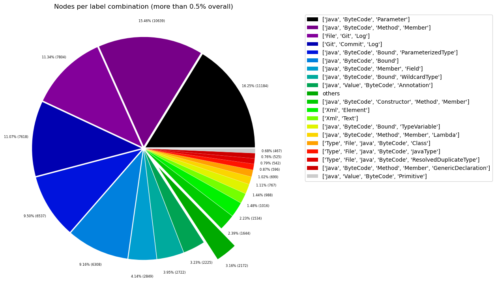
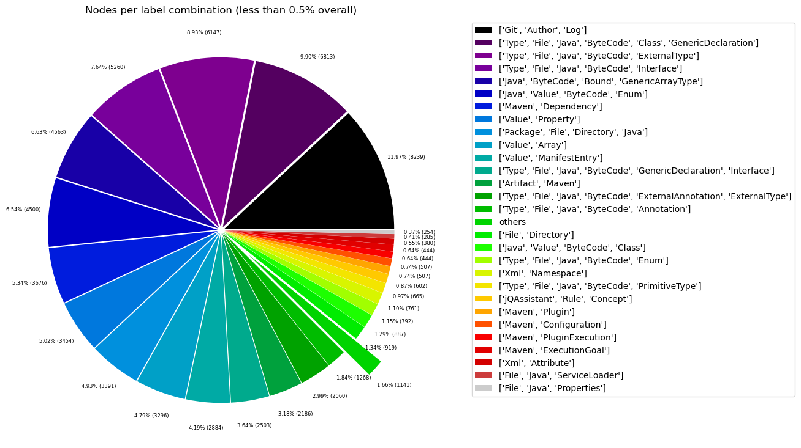
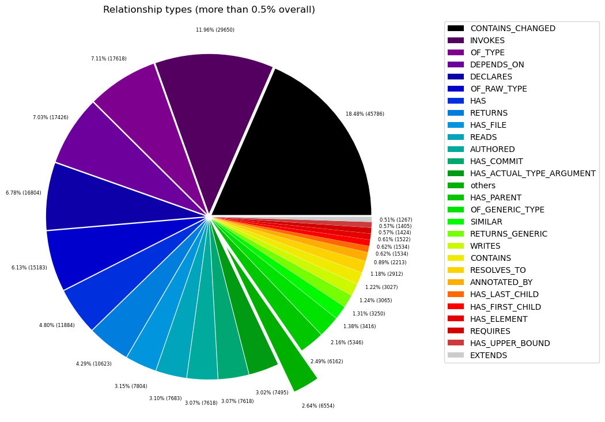
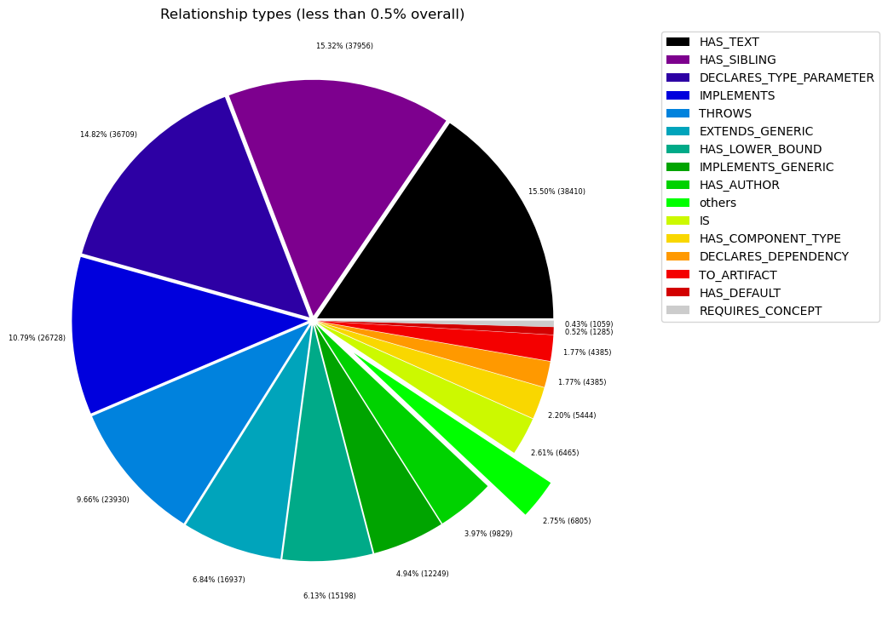

# Overview in General
   

This file contains a general overview of the data in the graph including node labels and relationships types.

### References
- [jqassistant](https://jqassistant.org)
- [Neo4j Python Driver](https://neo4j.com/docs/api/python-driver/current)

## Node Labels

### Table 1a - Highest node count by label combination

Lists the 30 label combinations with the highest number of nodes. The labels with the lowest node count are listed in table 1b.
The total list would sum up to the total number of labels (100%).

The whole table can be found in the CSV report `Node_label_combination_count`.

    Total number of nodes: 68836

<table border="1" class="dataframe">
  <thead>
    <tr style="text-align: right;">
      <th></th>
      <th>nodeLabels</th>
      <th>nodesWithThatLabels</th>
      <th>nodesWithThatLabelsPercent</th>
    </tr>
  </thead>
  <tbody>
    <tr>
      <th>0</th>
      <td>[Java, ByteCode, Parameter]</td>
      <td>11184</td>
      <td>16.247312</td>
    </tr>
    <tr>
      <th>1</th>
      <td>[Java, ByteCode, Method, Member]</td>
      <td>10639</td>
      <td>15.455576</td>
    </tr>
    <tr>
      <th>2</th>
      <td>[File, Git, Log]</td>
      <td>7804</td>
      <td>11.337091</td>
    </tr>
    <tr>
      <th>3</th>
      <td>[Git, Commit, Log]</td>
      <td>7618</td>
      <td>11.066884</td>
    </tr>
    <tr>
      <th>4</th>
      <td>[Java, ByteCode, Bound, ParameterizedType]</td>
      <td>6537</td>
      <td>9.496484</td>
    </tr>
    <tr>
      <th>5</th>
      <td>[Java, ByteCode, Bound]</td>
      <td>6308</td>
      <td>9.163810</td>
    </tr>
    <tr>
      <th>6</th>
      <td>[Java, ByteCode, Member, Field]</td>
      <td>2849</td>
      <td>4.138823</td>
    </tr>
    <tr>
      <th>7</th>
      <td>[Java, ByteCode, Bound, WildcardType]</td>
      <td>2722</td>
      <td>3.954326</td>
    </tr>
    <tr>
      <th>8</th>
      <td>[Java, Value, ByteCode, Annotation]</td>
      <td>2225</td>
      <td>3.232320</td>
    </tr>
    <tr>
      <th>9</th>
      <td>[Java, ByteCode, Constructor, Method, Member]</td>
      <td>1644</td>
      <td>2.388285</td>
    </tr>
    <tr>
      <th>10</th>
      <td>[Xml, Element]</td>
      <td>1534</td>
      <td>2.228485</td>
    </tr>
    <tr>
      <th>11</th>
      <td>[Xml, Text]</td>
      <td>1016</td>
      <td>1.475972</td>
    </tr>
    <tr>
      <th>12</th>
      <td>[Java, ByteCode, Bound, TypeVariable]</td>
      <td>988</td>
      <td>1.435295</td>
    </tr>
    <tr>
      <th>13</th>
      <td>[Java, ByteCode, Method, Member, Lambda]</td>
      <td>767</td>
      <td>1.114243</td>
    </tr>
    <tr>
      <th>14</th>
      <td>[Type, File, Java, ByteCode, Class]</td>
      <td>699</td>
      <td>1.015457</td>
    </tr>
    <tr>
      <th>15</th>
      <td>[Type, File, Java, ByteCode, JavaType]</td>
      <td>596</td>
      <td>0.865826</td>
    </tr>
    <tr>
      <th>16</th>
      <td>[Type, File, Java, ByteCode, ResolvedDuplicate...</td>
      <td>542</td>
      <td>0.787379</td>
    </tr>
    <tr>
      <th>17</th>
      <td>[Java, ByteCode, Method, Member, GenericDeclar...</td>
      <td>525</td>
      <td>0.762682</td>
    </tr>
    <tr>
      <th>18</th>
      <td>[Java, Value, ByteCode, Primitive]</td>
      <td>467</td>
      <td>0.678424</td>
    </tr>
    <tr>
      <th>19</th>
      <td>[Git, Author, Log]</td>
      <td>260</td>
      <td>0.377709</td>
    </tr>
    <tr>
      <th>20</th>
      <td>[Type, File, Java, ByteCode, Class, GenericDec...</td>
      <td>215</td>
      <td>0.312337</td>
    </tr>
    <tr>
      <th>21</th>
      <td>[Type, File, Java, ByteCode, ExternalType]</td>
      <td>194</td>
      <td>0.281829</td>
    </tr>
    <tr>
      <th>22</th>
      <td>[Type, File, Java, ByteCode, Interface]</td>
      <td>166</td>
      <td>0.241153</td>
    </tr>
    <tr>
      <th>23</th>
      <td>[Java, ByteCode, Bound, GenericArrayType]</td>
      <td>144</td>
      <td>0.209193</td>
    </tr>
    <tr>
      <th>24</th>
      <td>[Java, Value, ByteCode, Enum]</td>
      <td>142</td>
      <td>0.206287</td>
    </tr>
    <tr>
      <th>25</th>
      <td>[Maven, Dependency]</td>
      <td>116</td>
      <td>0.168516</td>
    </tr>
    <tr>
      <th>26</th>
      <td>[Value, Property]</td>
      <td>109</td>
      <td>0.158347</td>
    </tr>
    <tr>
      <th>27</th>
      <td>[Package, File, Directory, Java]</td>
      <td>107</td>
      <td>0.155442</td>
    </tr>
    <tr>
      <th>28</th>
      <td>[Value, Array]</td>
      <td>104</td>
      <td>0.151084</td>
    </tr>
    <tr>
      <th>29</th>
      <td>[Value, ManifestEntry]</td>
      <td>91</td>
      <td>0.132198</td>
    </tr>
  </tbody>
</table>

### Chart 1a - Highest node count by label combination

Values under 0.5% will be grouped into "others" to get a cleaner plot. The group "others" is then broken down in Chart 1b.

    <Figure size 640x480 with 0 Axes>

    

    

### Table 1b - Lowest node count by label combination

Lists the 30 label combinations with the lowest number of nodes until they reach 0.5% of the total node count, which are shown above.

<table border="1" class="dataframe">
  <thead>
    <tr style="text-align: right;">
      <th></th>
      <th>nodeLabels</th>
      <th>nodesWithThatLabels</th>
      <th>nodesWithThatLabelsPercent</th>
    </tr>
  </thead>
  <tbody>
    <tr>
      <th>0</th>
      <td>[Repository, Git]</td>
      <td>1</td>
      <td>0.001453</td>
    </tr>
    <tr>
      <th>1</th>
      <td>[Analyze, Task, jQAssistant]</td>
      <td>1</td>
      <td>0.001453</td>
    </tr>
    <tr>
      <th>2</th>
      <td>[Maven, Exclusion]</td>
      <td>1</td>
      <td>0.001453</td>
    </tr>
    <tr>
      <th>3</th>
      <td>[Java, ByteCode, Constructor, Method, Member, ...</td>
      <td>3</td>
      <td>0.004358</td>
    </tr>
    <tr>
      <th>4</th>
      <td>[File, Maven, Xml, Pom, Document]</td>
      <td>6</td>
      <td>0.008716</td>
    </tr>
    <tr>
      <th>5</th>
      <td>[Type, File, Java, ByteCode, Void]</td>
      <td>6</td>
      <td>0.008716</td>
    </tr>
    <tr>
      <th>6</th>
      <td>[Java, ManifestSection]</td>
      <td>6</td>
      <td>0.008716</td>
    </tr>
    <tr>
      <th>7</th>
      <td>[File, Java, Manifest]</td>
      <td>6</td>
      <td>0.008716</td>
    </tr>
    <tr>
      <th>8</th>
      <td>[Artifact, File, Jar, Archive, Zip, Java]</td>
      <td>6</td>
      <td>0.008716</td>
    </tr>
    <tr>
      <th>9</th>
      <td>[File, Java, Properties]</td>
      <td>8</td>
      <td>0.011622</td>
    </tr>
    <tr>
      <th>10</th>
      <td>[File, Java, ServiceLoader]</td>
      <td>9</td>
      <td>0.013075</td>
    </tr>
    <tr>
      <th>11</th>
      <td>[Xml, Attribute]</td>
      <td>12</td>
      <td>0.017433</td>
    </tr>
    <tr>
      <th>12</th>
      <td>[Maven, ExecutionGoal]</td>
      <td>14</td>
      <td>0.020338</td>
    </tr>
    <tr>
      <th>13</th>
      <td>[Maven, PluginExecution]</td>
      <td>14</td>
      <td>0.020338</td>
    </tr>
    <tr>
      <th>14</th>
      <td>[Maven, Plugin]</td>
      <td>16</td>
      <td>0.023244</td>
    </tr>
    <tr>
      <th>15</th>
      <td>[Maven, Configuration]</td>
      <td>16</td>
      <td>0.023244</td>
    </tr>
    <tr>
      <th>16</th>
      <td>[jQAssistant, Rule, Concept]</td>
      <td>19</td>
      <td>0.027602</td>
    </tr>
    <tr>
      <th>17</th>
      <td>[Type, File, Java, ByteCode, PrimitiveType]</td>
      <td>21</td>
      <td>0.030507</td>
    </tr>
    <tr>
      <th>18</th>
      <td>[Xml, Namespace]</td>
      <td>24</td>
      <td>0.034865</td>
    </tr>
    <tr>
      <th>19</th>
      <td>[Type, File, Java, ByteCode, Enum]</td>
      <td>25</td>
      <td>0.036318</td>
    </tr>
    <tr>
      <th>20</th>
      <td>[Java, Value, ByteCode, Class]</td>
      <td>28</td>
      <td>0.040676</td>
    </tr>
    <tr>
      <th>21</th>
      <td>[File, Directory]</td>
      <td>29</td>
      <td>0.042129</td>
    </tr>
    <tr>
      <th>22</th>
      <td>[Type, File, Java, ByteCode, Annotation]</td>
      <td>40</td>
      <td>0.058109</td>
    </tr>
    <tr>
      <th>23</th>
      <td>[Type, File, Java, ByteCode, ExternalType, Ext...</td>
      <td>65</td>
      <td>0.094427</td>
    </tr>
    <tr>
      <th>24</th>
      <td>[Artifact, Maven]</td>
      <td>69</td>
      <td>0.100238</td>
    </tr>
    <tr>
      <th>25</th>
      <td>[Type, File, Java, ByteCode, GenericDeclaratio...</td>
      <td>79</td>
      <td>0.114766</td>
    </tr>
    <tr>
      <th>26</th>
      <td>[Value, ManifestEntry]</td>
      <td>91</td>
      <td>0.132198</td>
    </tr>
    <tr>
      <th>27</th>
      <td>[Value, Array]</td>
      <td>104</td>
      <td>0.151084</td>
    </tr>
    <tr>
      <th>28</th>
      <td>[Package, File, Directory, Java]</td>
      <td>107</td>
      <td>0.155442</td>
    </tr>
    <tr>
      <th>29</th>
      <td>[Value, Property]</td>
      <td>109</td>
      <td>0.158347</td>
    </tr>
  </tbody>
</table>

### Chart 1b - Lowest node count by label combination

Shows the lowest (less than 0.5% overall) node count label combinations. Therefore, this plot breaks down the "others" slice of the pie chart above. Values under 0.01% will be grouped into "others" to get a cleaner plot.

    <Figure size 640x480 with 0 Axes>

    

    

### Table 1c - Highest node count by single label

Lists the 40 labels with the highest number of nodes.
Doesn't sum up to the total number of nodes or 100% because one node can have multiple labels.
Helps to identify commonly used labels.

<table border="1" class="dataframe">
  <thead>
    <tr style="text-align: right;">
      <th></th>
      <th>nodeLabel</th>
      <th>nodesWithThatLabel</th>
      <th>nodesWithThatLabelPercent</th>
    </tr>
  </thead>
  <tbody>
    <tr>
      <th>0</th>
      <td>Java</td>
      <td>49962</td>
      <td>72.581208</td>
    </tr>
    <tr>
      <th>1</th>
      <td>ByteCode</td>
      <td>49820</td>
      <td>72.374920</td>
    </tr>
    <tr>
      <th>2</th>
      <td>Bound</td>
      <td>16699</td>
      <td>24.259109</td>
    </tr>
    <tr>
      <th>3</th>
      <td>Member</td>
      <td>16427</td>
      <td>23.863967</td>
    </tr>
    <tr>
      <th>4</th>
      <td>Git</td>
      <td>15683</td>
      <td>22.783137</td>
    </tr>
    <tr>
      <th>5</th>
      <td>Log</td>
      <td>15682</td>
      <td>22.781684</td>
    </tr>
    <tr>
      <th>6</th>
      <td>Method</td>
      <td>13578</td>
      <td>19.725144</td>
    </tr>
    <tr>
      <th>7</th>
      <td>Parameter</td>
      <td>11184</td>
      <td>16.247312</td>
    </tr>
    <tr>
      <th>8</th>
      <td>File</td>
      <td>10623</td>
      <td>15.432332</td>
    </tr>
    <tr>
      <th>9</th>
      <td>Commit</td>
      <td>7618</td>
      <td>11.066884</td>
    </tr>
    <tr>
      <th>10</th>
      <td>ParameterizedType</td>
      <td>6537</td>
      <td>9.496484</td>
    </tr>
    <tr>
      <th>11</th>
      <td>Value</td>
      <td>3166</td>
      <td>4.599338</td>
    </tr>
    <tr>
      <th>12</th>
      <td>Field</td>
      <td>2849</td>
      <td>4.138823</td>
    </tr>
    <tr>
      <th>13</th>
      <td>WildcardType</td>
      <td>2722</td>
      <td>3.954326</td>
    </tr>
    <tr>
      <th>14</th>
      <td>Type</td>
      <td>2648</td>
      <td>3.846824</td>
    </tr>
    <tr>
      <th>15</th>
      <td>Xml</td>
      <td>2592</td>
      <td>3.765472</td>
    </tr>
    <tr>
      <th>16</th>
      <td>Annotation</td>
      <td>2265</td>
      <td>3.290429</td>
    </tr>
    <tr>
      <th>17</th>
      <td>Constructor</td>
      <td>1647</td>
      <td>2.392643</td>
    </tr>
    <tr>
      <th>18</th>
      <td>Element</td>
      <td>1534</td>
      <td>2.228485</td>
    </tr>
    <tr>
      <th>19</th>
      <td>Text</td>
      <td>1016</td>
      <td>1.475972</td>
    </tr>
    <tr>
      <th>20</th>
      <td>TypeVariable</td>
      <td>988</td>
      <td>1.435295</td>
    </tr>
    <tr>
      <th>21</th>
      <td>Class</td>
      <td>942</td>
      <td>1.368470</td>
    </tr>
    <tr>
      <th>22</th>
      <td>GenericDeclaration</td>
      <td>822</td>
      <td>1.194143</td>
    </tr>
    <tr>
      <th>23</th>
      <td>Lambda</td>
      <td>767</td>
      <td>1.114243</td>
    </tr>
    <tr>
      <th>24</th>
      <td>JavaType</td>
      <td>596</td>
      <td>0.865826</td>
    </tr>
    <tr>
      <th>25</th>
      <td>ResolvedDuplicateType</td>
      <td>542</td>
      <td>0.787379</td>
    </tr>
    <tr>
      <th>26</th>
      <td>Primitive</td>
      <td>467</td>
      <td>0.678424</td>
    </tr>
    <tr>
      <th>27</th>
      <td>Author</td>
      <td>260</td>
      <td>0.377709</td>
    </tr>
    <tr>
      <th>28</th>
      <td>ExternalType</td>
      <td>259</td>
      <td>0.376257</td>
    </tr>
    <tr>
      <th>29</th>
      <td>Maven</td>
      <td>252</td>
      <td>0.366088</td>
    </tr>
    <tr>
      <th>30</th>
      <td>Interface</td>
      <td>245</td>
      <td>0.355918</td>
    </tr>
    <tr>
      <th>31</th>
      <td>Enum</td>
      <td>167</td>
      <td>0.242606</td>
    </tr>
    <tr>
      <th>32</th>
      <td>GenericArrayType</td>
      <td>144</td>
      <td>0.209193</td>
    </tr>
    <tr>
      <th>33</th>
      <td>Directory</td>
      <td>136</td>
      <td>0.197571</td>
    </tr>
    <tr>
      <th>34</th>
      <td>Dependency</td>
      <td>116</td>
      <td>0.168516</td>
    </tr>
    <tr>
      <th>35</th>
      <td>Property</td>
      <td>109</td>
      <td>0.158347</td>
    </tr>
    <tr>
      <th>36</th>
      <td>Package</td>
      <td>107</td>
      <td>0.155442</td>
    </tr>
    <tr>
      <th>37</th>
      <td>Array</td>
      <td>104</td>
      <td>0.151084</td>
    </tr>
    <tr>
      <th>38</th>
      <td>ManifestEntry</td>
      <td>91</td>
      <td>0.132198</td>
    </tr>
    <tr>
      <th>39</th>
      <td>Artifact</td>
      <td>75</td>
      <td>0.108955</td>
    </tr>
  </tbody>
</table>

### Chart 1c - Highest node count by label

Shows the 40 labels with the highest number of nodes.

    <Figure size 640x480 with 0 Axes>

    

    

## Relationship Types

### Table 2a - Highest relationship count by type

Lists the 30 relationship types with the highest number of occurrences.
The whole table can be found in the CSV report `Relationship_type_count`.

    Total number of relationships: 247788

<table border="1" class="dataframe">
  <thead>
    <tr style="text-align: right;">
      <th></th>
      <th>relationshipType</th>
      <th>nodesWithThatRelationshipType</th>
      <th>nodesWithThatRelationshipTypePercent</th>
    </tr>
  </thead>
  <tbody>
    <tr>
      <th>0</th>
      <td>CONTAINS_CHANGED</td>
      <td>45786</td>
      <td>18.477892</td>
    </tr>
    <tr>
      <th>1</th>
      <td>INVOKES</td>
      <td>29638</td>
      <td>11.961031</td>
    </tr>
    <tr>
      <th>2</th>
      <td>OF_TYPE</td>
      <td>17618</td>
      <td>7.110110</td>
    </tr>
    <tr>
      <th>3</th>
      <td>DEPENDS_ON</td>
      <td>17426</td>
      <td>7.032625</td>
    </tr>
    <tr>
      <th>4</th>
      <td>DECLARES</td>
      <td>16789</td>
      <td>6.775550</td>
    </tr>
    <tr>
      <th>5</th>
      <td>OF_RAW_TYPE</td>
      <td>15183</td>
      <td>6.127415</td>
    </tr>
    <tr>
      <th>6</th>
      <td>HAS</td>
      <td>11884</td>
      <td>4.796035</td>
    </tr>
    <tr>
      <th>7</th>
      <td>RETURNS</td>
      <td>10623</td>
      <td>4.287133</td>
    </tr>
    <tr>
      <th>8</th>
      <td>HAS_FILE</td>
      <td>7804</td>
      <td>3.149466</td>
    </tr>
    <tr>
      <th>9</th>
      <td>READS</td>
      <td>7683</td>
      <td>3.100634</td>
    </tr>
    <tr>
      <th>10</th>
      <td>AUTHORED</td>
      <td>7618</td>
      <td>3.074402</td>
    </tr>
    <tr>
      <th>11</th>
      <td>HAS_COMMIT</td>
      <td>7618</td>
      <td>3.074402</td>
    </tr>
    <tr>
      <th>12</th>
      <td>HAS_ACTUAL_TYPE_ARGUMENT</td>
      <td>7495</td>
      <td>3.024763</td>
    </tr>
    <tr>
      <th>13</th>
      <td>HAS_PARENT</td>
      <td>6162</td>
      <td>2.486803</td>
    </tr>
    <tr>
      <th>14</th>
      <td>OF_GENERIC_TYPE</td>
      <td>5346</td>
      <td>2.157489</td>
    </tr>
    <tr>
      <th>15</th>
      <td>SIMILAR</td>
      <td>3416</td>
      <td>1.378598</td>
    </tr>
    <tr>
      <th>16</th>
      <td>RETURNS_GENERIC</td>
      <td>3250</td>
      <td>1.311605</td>
    </tr>
    <tr>
      <th>17</th>
      <td>WRITES</td>
      <td>3065</td>
      <td>1.236944</td>
    </tr>
    <tr>
      <th>18</th>
      <td>CONTAINS</td>
      <td>3027</td>
      <td>1.221609</td>
    </tr>
    <tr>
      <th>19</th>
      <td>RESOLVES_TO</td>
      <td>2904</td>
      <td>1.171970</td>
    </tr>
    <tr>
      <th>20</th>
      <td>ANNOTATED_BY</td>
      <td>2213</td>
      <td>0.893102</td>
    </tr>
    <tr>
      <th>21</th>
      <td>HAS_FIRST_CHILD</td>
      <td>1534</td>
      <td>0.619078</td>
    </tr>
    <tr>
      <th>22</th>
      <td>HAS_LAST_CHILD</td>
      <td>1534</td>
      <td>0.619078</td>
    </tr>
    <tr>
      <th>23</th>
      <td>HAS_ELEMENT</td>
      <td>1522</td>
      <td>0.614235</td>
    </tr>
    <tr>
      <th>24</th>
      <td>REQUIRES</td>
      <td>1424</td>
      <td>0.574685</td>
    </tr>
    <tr>
      <th>25</th>
      <td>HAS_UPPER_BOUND</td>
      <td>1405</td>
      <td>0.567017</td>
    </tr>
    <tr>
      <th>26</th>
      <td>EXTENDS</td>
      <td>1267</td>
      <td>0.511324</td>
    </tr>
    <tr>
      <th>27</th>
      <td>HAS_TEXT</td>
      <td>1016</td>
      <td>0.410028</td>
    </tr>
    <tr>
      <th>28</th>
      <td>HAS_SIBLING</td>
      <td>1004</td>
      <td>0.405185</td>
    </tr>
    <tr>
      <th>29</th>
      <td>DECLARES_TYPE_PARAMETER</td>
      <td>971</td>
      <td>0.391867</td>
    </tr>
  </tbody>
</table>

### Chart 2a - Highest relationship count by type

Values under 0.5% will be grouped into "others" to get a cleaner plot. The group "others" is then broken down in the second chart.

    <Figure size 640x480 with 0 Axes>

    

    

### Table 2b - Lowest relationship count by type

Lists the 30 relationships type with the lowest number of occurrences up to 0.5% of the total node count. This is essentially breaking down the "others" slice from the chart above.

<table border="1" class="dataframe">
  <thead>
    <tr style="text-align: right;">
      <th></th>
      <th>relationshipType</th>
      <th>nodesWithThatRelationshipType</th>
      <th>nodesWithThatRelationshipTypePercent</th>
    </tr>
  </thead>
  <tbody>
    <tr>
      <th>0</th>
      <td>EXCLUDES</td>
      <td>1</td>
      <td>0.000404</td>
    </tr>
    <tr>
      <th>1</th>
      <td>THROWS_GENERIC</td>
      <td>5</td>
      <td>0.002018</td>
    </tr>
    <tr>
      <th>2</th>
      <td>DESCRIBES</td>
      <td>6</td>
      <td>0.002421</td>
    </tr>
    <tr>
      <th>3</th>
      <td>HAS_ROOT_ELEMENT</td>
      <td>8</td>
      <td>0.003229</td>
    </tr>
    <tr>
      <th>4</th>
      <td>OF_NAMESPACE</td>
      <td>12</td>
      <td>0.004843</td>
    </tr>
    <tr>
      <th>5</th>
      <td>HAS_ATTRIBUTE</td>
      <td>12</td>
      <td>0.004843</td>
    </tr>
    <tr>
      <th>6</th>
      <td>HAS_GOAL</td>
      <td>14</td>
      <td>0.005650</td>
    </tr>
    <tr>
      <th>7</th>
      <td>HAS_EXECUTION</td>
      <td>14</td>
      <td>0.005650</td>
    </tr>
    <tr>
      <th>8</th>
      <td>USES_PLUGIN</td>
      <td>16</td>
      <td>0.006457</td>
    </tr>
    <tr>
      <th>9</th>
      <td>IS_ARTIFACT</td>
      <td>16</td>
      <td>0.006457</td>
    </tr>
    <tr>
      <th>10</th>
      <td>HAS_CONFIGURATION</td>
      <td>16</td>
      <td>0.006457</td>
    </tr>
    <tr>
      <th>11</th>
      <td>REQUIRES_TYPE_PARAMETER</td>
      <td>17</td>
      <td>0.006861</td>
    </tr>
    <tr>
      <th>12</th>
      <td>INCLUDES_CONCEPT</td>
      <td>19</td>
      <td>0.007668</td>
    </tr>
    <tr>
      <th>13</th>
      <td>DECLARES_NAMESPACE</td>
      <td>24</td>
      <td>0.009686</td>
    </tr>
    <tr>
      <th>14</th>
      <td>REQUIRES_CONCEPT</td>
      <td>28</td>
      <td>0.011300</td>
    </tr>
    <tr>
      <th>15</th>
      <td>HAS_DEFAULT</td>
      <td>34</td>
      <td>0.013721</td>
    </tr>
    <tr>
      <th>16</th>
      <td>TO_ARTIFACT</td>
      <td>116</td>
      <td>0.046814</td>
    </tr>
    <tr>
      <th>17</th>
      <td>DECLARES_DEPENDENCY</td>
      <td>116</td>
      <td>0.046814</td>
    </tr>
    <tr>
      <th>18</th>
      <td>HAS_COMPONENT_TYPE</td>
      <td>144</td>
      <td>0.058114</td>
    </tr>
    <tr>
      <th>19</th>
      <td>IS</td>
      <td>171</td>
      <td>0.069011</td>
    </tr>
    <tr>
      <th>20</th>
      <td>HAS_AUTHOR</td>
      <td>260</td>
      <td>0.104928</td>
    </tr>
    <tr>
      <th>21</th>
      <td>IMPLEMENTS_GENERIC</td>
      <td>324</td>
      <td>0.130757</td>
    </tr>
    <tr>
      <th>22</th>
      <td>HAS_LOWER_BOUND</td>
      <td>402</td>
      <td>0.162235</td>
    </tr>
    <tr>
      <th>23</th>
      <td>EXTENDS_GENERIC</td>
      <td>448</td>
      <td>0.180800</td>
    </tr>
    <tr>
      <th>24</th>
      <td>THROWS</td>
      <td>633</td>
      <td>0.255460</td>
    </tr>
    <tr>
      <th>25</th>
      <td>IMPLEMENTS</td>
      <td>707</td>
      <td>0.285325</td>
    </tr>
    <tr>
      <th>26</th>
      <td>DECLARES_TYPE_PARAMETER</td>
      <td>971</td>
      <td>0.391867</td>
    </tr>
    <tr>
      <th>27</th>
      <td>HAS_SIBLING</td>
      <td>1004</td>
      <td>0.405185</td>
    </tr>
    <tr>
      <th>28</th>
      <td>HAS_TEXT</td>
      <td>1016</td>
      <td>0.410028</td>
    </tr>
  </tbody>
</table>

### Chart 2b - Lowest relationship count by type

Shows the lowest (less than 0.5% overall) relationship types. This plot breaks down the "others" slice of the pie chart above. Values under 0.01% will be grouped into "others" to get a cleaner plot.

    <Figure size 640x480 with 0 Axes>

    

    

## Node labels with their relationships

### Table 3a - Highest relationship count by node labels and relationship type

Lists the 30 node labels and their relationship types with the highest number of occurrences.

<table border="1" class="dataframe">
  <thead>
    <tr style="text-align: right;">
      <th></th>
      <th>sourceLabels</th>
      <th>relationType</th>
      <th>targetLabels</th>
      <th>numberOfRelationships</th>
      <th>numberOfNodesWithSameLabelsAsSource</th>
      <th>numberOfNodesWithSameLabelsAsTarget</th>
      <th>densityInPercent</th>
    </tr>
  </thead>
  <tbody>
    <tr>
      <th>0</th>
      <td>[Git, Commit, Log]</td>
      <td>CONTAINS_CHANGED</td>
      <td>[File, Git, Log]</td>
      <td>45786</td>
      <td>7618</td>
      <td>7804</td>
      <td>0.077015</td>
    </tr>
    <tr>
      <th>1</th>
      <td>[Java, ByteCode, Method, Member]</td>
      <td>INVOKES</td>
      <td>[Java, ByteCode, Method, Member]</td>
      <td>18132</td>
      <td>10551</td>
      <td>10551</td>
      <td>0.016288</td>
    </tr>
    <tr>
      <th>2</th>
      <td>[Repository, Git]</td>
      <td>HAS_FILE</td>
      <td>[File, Git, Log]</td>
      <td>7804</td>
      <td>1</td>
      <td>7804</td>
      <td>100.000000</td>
    </tr>
    <tr>
      <th>3</th>
      <td>[Repository, Git]</td>
      <td>HAS_COMMIT</td>
      <td>[Git, Commit, Log]</td>
      <td>7618</td>
      <td>1</td>
      <td>7618</td>
      <td>100.000000</td>
    </tr>
    <tr>
      <th>4</th>
      <td>[Git, Author, Log]</td>
      <td>AUTHORED</td>
      <td>[Git, Commit, Log]</td>
      <td>7618</td>
      <td>260</td>
      <td>7618</td>
      <td>0.384615</td>
    </tr>
    <tr>
      <th>5</th>
      <td>[Java, ByteCode, Method, Member]</td>
      <td>HAS</td>
      <td>[Java, ByteCode, Parameter]</td>
      <td>7290</td>
      <td>10551</td>
      <td>11184</td>
      <td>0.006178</td>
    </tr>
    <tr>
      <th>6</th>
      <td>[Java, ByteCode, Method, Member]</td>
      <td>READS</td>
      <td>[Java, ByteCode, Member, Field]</td>
      <td>6906</td>
      <td>10551</td>
      <td>2849</td>
      <td>0.022974</td>
    </tr>
    <tr>
      <th>7</th>
      <td>[Git, Commit, Log]</td>
      <td>HAS_PARENT</td>
      <td>[Git, Commit, Log]</td>
      <td>6156</td>
      <td>7618</td>
      <td>7618</td>
      <td>0.010608</td>
    </tr>
    <tr>
      <th>8</th>
      <td>[Java, ByteCode, Parameter]</td>
      <td>OF_TYPE</td>
      <td>[Type, File, Java, ByteCode, JavaType]</td>
      <td>5720</td>
      <td>11184</td>
      <td>596</td>
      <td>0.085813</td>
    </tr>
    <tr>
      <th>9</th>
      <td>[Java, ByteCode, Bound]</td>
      <td>OF_RAW_TYPE</td>
      <td>[Type, File, Java, ByteCode, JavaType]</td>
      <td>3213</td>
      <td>6308</td>
      <td>596</td>
      <td>0.085462</td>
    </tr>
    <tr>
      <th>10</th>
      <td>[Java, ByteCode, Bound, ParameterizedType]</td>
      <td>OF_RAW_TYPE</td>
      <td>[Type, File, Java, ByteCode, JavaType]</td>
      <td>2777</td>
      <td>6537</td>
      <td>596</td>
      <td>0.071277</td>
    </tr>
    <tr>
      <th>11</th>
      <td>[Java, ByteCode, Bound, ParameterizedType]</td>
      <td>HAS_ACTUAL_TYPE_ARGUMENT</td>
      <td>[Java, ByteCode, Bound, WildcardType]</td>
      <td>2722</td>
      <td>6537</td>
      <td>2722</td>
      <td>0.015298</td>
    </tr>
    <tr>
      <th>12</th>
      <td>[Java, ByteCode, Parameter]</td>
      <td>OF_GENERIC_TYPE</td>
      <td>[Java, ByteCode, Bound, ParameterizedType]</td>
      <td>2434</td>
      <td>11184</td>
      <td>6537</td>
      <td>0.003329</td>
    </tr>
    <tr>
      <th>13</th>
      <td>[Java, ByteCode, Bound, ParameterizedType]</td>
      <td>HAS_ACTUAL_TYPE_ARGUMENT</td>
      <td>[Java, ByteCode, Bound, TypeVariable]</td>
      <td>2228</td>
      <td>6537</td>
      <td>988</td>
      <td>0.034497</td>
    </tr>
    <tr>
      <th>14</th>
      <td>[Java, ByteCode, Constructor, Method, Member]</td>
      <td>WRITES</td>
      <td>[Java, ByteCode, Member, Field]</td>
      <td>1971</td>
      <td>1644</td>
      <td>2849</td>
      <td>0.042082</td>
    </tr>
    <tr>
      <th>15</th>
      <td>[Java, ByteCode, Method, Member]</td>
      <td>RETURNS</td>
      <td>[Type, File, Java, ByteCode, JavaType]</td>
      <td>1890</td>
      <td>10551</td>
      <td>596</td>
      <td>0.030055</td>
    </tr>
    <tr>
      <th>16</th>
      <td>[Java, Value, ByteCode, Annotation]</td>
      <td>OF_TYPE</td>
      <td>[Type, File, Java, ByteCode, ExternalType, Ext...</td>
      <td>1842</td>
      <td>2225</td>
      <td>65</td>
      <td>1.273639</td>
    </tr>
    <tr>
      <th>17</th>
      <td>[Java, ByteCode, Parameter]</td>
      <td>OF_GENERIC_TYPE</td>
      <td>[Java, ByteCode, Bound]</td>
      <td>1818</td>
      <td>11184</td>
      <td>6308</td>
      <td>0.002577</td>
    </tr>
    <tr>
      <th>18</th>
      <td>[Java, ByteCode, Constructor, Method, Member]</td>
      <td>INVOKES</td>
      <td>[Java, ByteCode, Constructor, Method, Member]</td>
      <td>1736</td>
      <td>1644</td>
      <td>1644</td>
      <td>0.064231</td>
    </tr>
    <tr>
      <th>19</th>
      <td>[Java, ByteCode, Constructor, Method, Member]</td>
      <td>HAS</td>
      <td>[Java, ByteCode, Parameter]</td>
      <td>1710</td>
      <td>1644</td>
      <td>11184</td>
      <td>0.009300</td>
    </tr>
    <tr>
      <th>20</th>
      <td>[Java, ByteCode, Method, Member]</td>
      <td>INVOKES</td>
      <td>[Java, ByteCode, Constructor, Method, Member]</td>
      <td>1706</td>
      <td>10551</td>
      <td>1644</td>
      <td>0.009835</td>
    </tr>
    <tr>
      <th>21</th>
      <td>[Java, ByteCode, Parameter]</td>
      <td>ANNOTATED_BY</td>
      <td>[Java, Value, ByteCode, Annotation]</td>
      <td>1594</td>
      <td>11184</td>
      <td>2225</td>
      <td>0.006406</td>
    </tr>
    <tr>
      <th>22</th>
      <td>[Java, ByteCode, Constructor, Method, Member]</td>
      <td>INVOKES</td>
      <td>[Java, ByteCode, Method, Member]</td>
      <td>1535</td>
      <td>1644</td>
      <td>10551</td>
      <td>0.008849</td>
    </tr>
    <tr>
      <th>23</th>
      <td>[Java, ByteCode, Method, Member, Lambda]</td>
      <td>INVOKES</td>
      <td>[Java, ByteCode, Method, Member]</td>
      <td>1532</td>
      <td>767</td>
      <td>10551</td>
      <td>0.018931</td>
    </tr>
    <tr>
      <th>24</th>
      <td>[Java, ByteCode, Bound, ParameterizedType]</td>
      <td>HAS_ACTUAL_TYPE_ARGUMENT</td>
      <td>[Java, ByteCode, Bound]</td>
      <td>1527</td>
      <td>6537</td>
      <td>6308</td>
      <td>0.003703</td>
    </tr>
    <tr>
      <th>25</th>
      <td>[Xml, Element]</td>
      <td>HAS_ELEMENT</td>
      <td>[Xml, Element]</td>
      <td>1522</td>
      <td>1534</td>
      <td>1534</td>
      <td>0.064679</td>
    </tr>
    <tr>
      <th>26</th>
      <td>[Java, ByteCode, Method, Member]</td>
      <td>RETURNS</td>
      <td>[Type, File, Java, ByteCode, Void]</td>
      <td>1465</td>
      <td>10551</td>
      <td>6</td>
      <td>2.314157</td>
    </tr>
    <tr>
      <th>27</th>
      <td>[Java, ByteCode, Method, Member, GenericDeclar...</td>
      <td>INVOKES</td>
      <td>[Java, ByteCode, Method, Member]</td>
      <td>1280</td>
      <td>511</td>
      <td>10551</td>
      <td>0.023741</td>
    </tr>
    <tr>
      <th>28</th>
      <td>[Type, File, Java, ByteCode, JavaType]</td>
      <td>DECLARES</td>
      <td>[Java, ByteCode, Method, Member]</td>
      <td>1277</td>
      <td>596</td>
      <td>10551</td>
      <td>0.020307</td>
    </tr>
    <tr>
      <th>29</th>
      <td>[Java, ByteCode, Constructor, Method, Member]</td>
      <td>RETURNS</td>
      <td>[Type, File, Java, ByteCode, Void]</td>
      <td>1221</td>
      <td>1644</td>
      <td>6</td>
      <td>12.378345</td>
    </tr>
  </tbody>
</table>

## Graph Density

    total_number_of_nodes (vertices): 68836
    total_number_of_relationships (edges): 247788
    -> total directed graph density: 5.229441723983005e-05
    -> total directed graph density in percent: 0.005229441723983005

