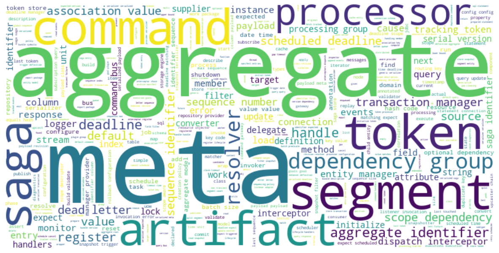

# Wordcloud
   

### References
- [jqassistant](https://jqassistant.org)
- [py2neo](https://py2neo.org/2021.1/)

## Word Cloud

<table border="1" class="dataframe">
  <thead>
    <tr style="text-align: right;">
      <th></th>
      <th>word</th>
    </tr>
  </thead>
  <tbody>
    <tr>
      <th>0</th>
      <td>main</td>
    </tr>
    <tr>
      <th>1</th>
      <td>manifest</td>
    </tr>
    <tr>
      <th>2</th>
      <td>version</td>
    </tr>
    <tr>
      <th>3</th>
      <td>automatic</td>
    </tr>
    <tr>
      <th>4</th>
      <td>module</td>
    </tr>
    <tr>
      <th>5</th>
      <td>name</td>
    </tr>
    <tr>
      <th>6</th>
      <td>bnd</td>
    </tr>
    <tr>
      <th>7</th>
      <td>last</td>
    </tr>
    <tr>
      <th>8</th>
      <td>modified</td>
    </tr>
    <tr>
      <th>9</th>
      <td>build</td>
    </tr>
    <tr>
      <th>10</th>
      <td>jdk</td>
    </tr>
    <tr>
      <th>11</th>
      <td>spec</td>
    </tr>
    <tr>
      <th>12</th>
      <td>bundle</td>
    </tr>
    <tr>
      <th>13</th>
      <td>description</td>
    </tr>
    <tr>
      <th>14</th>
      <td>bundle</td>
    </tr>
    <tr>
      <th>15</th>
      <td>license</td>
    </tr>
    <tr>
      <th>16</th>
      <td>bundle</td>
    </tr>
    <tr>
      <th>17</th>
      <td>manifest</td>
    </tr>
    <tr>
      <th>18</th>
      <td>version</td>
    </tr>
    <tr>
      <th>19</th>
      <td>bundle</td>
    </tr>
    <tr>
      <th>20</th>
      <td>name</td>
    </tr>
    <tr>
      <th>21</th>
      <td>bundle</td>
    </tr>
    <tr>
      <th>22</th>
      <td>symbolic</td>
    </tr>
    <tr>
      <th>23</th>
      <td>name</td>
    </tr>
    <tr>
      <th>24</th>
      <td>bundle</td>
    </tr>
    <tr>
      <th>25</th>
      <td>version</td>
    </tr>
    <tr>
      <th>26</th>
      <td>created</td>
    </tr>
    <tr>
      <th>27</th>
      <td>by</td>
    </tr>
    <tr>
      <th>28</th>
      <td>export</td>
    </tr>
    <tr>
      <th>29</th>
      <td>package</td>
    </tr>
  </tbody>
</table>

    There are 51582 words in the dataset.

    

    

