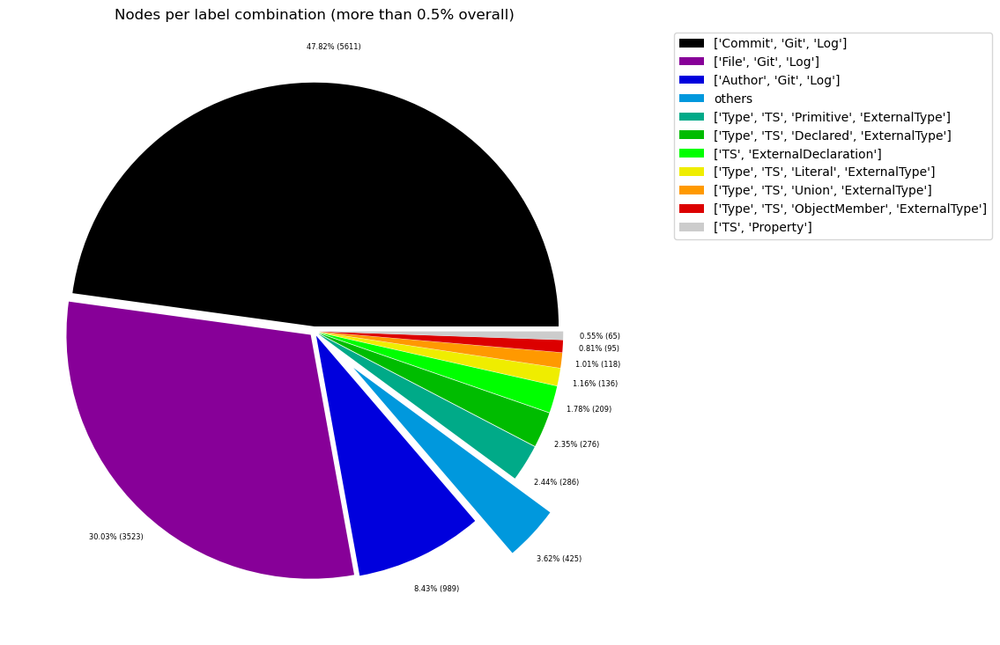
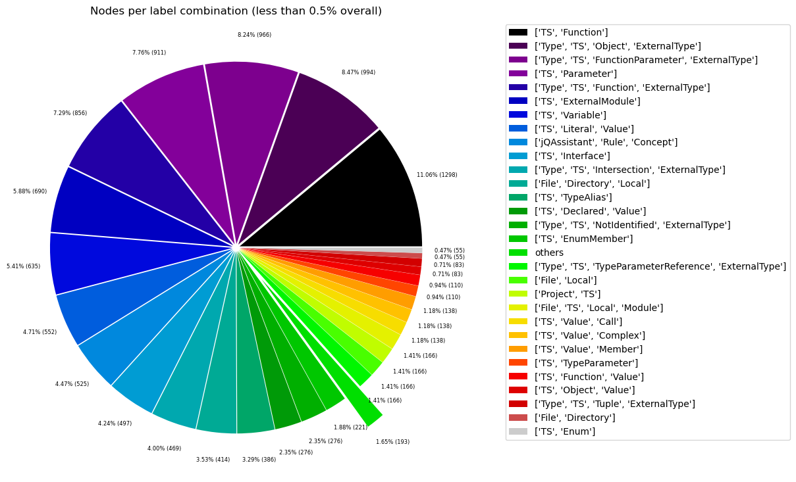
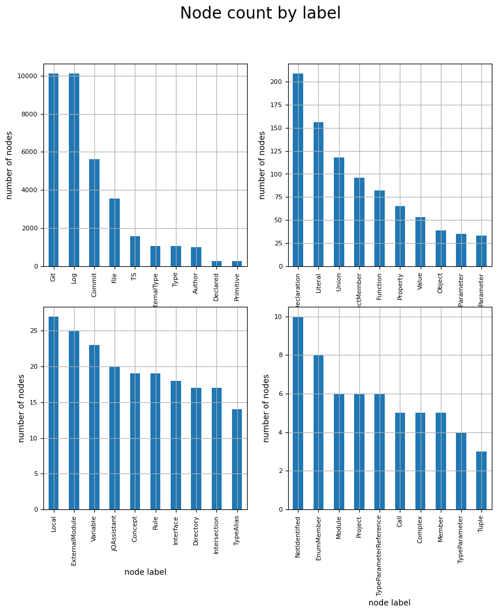
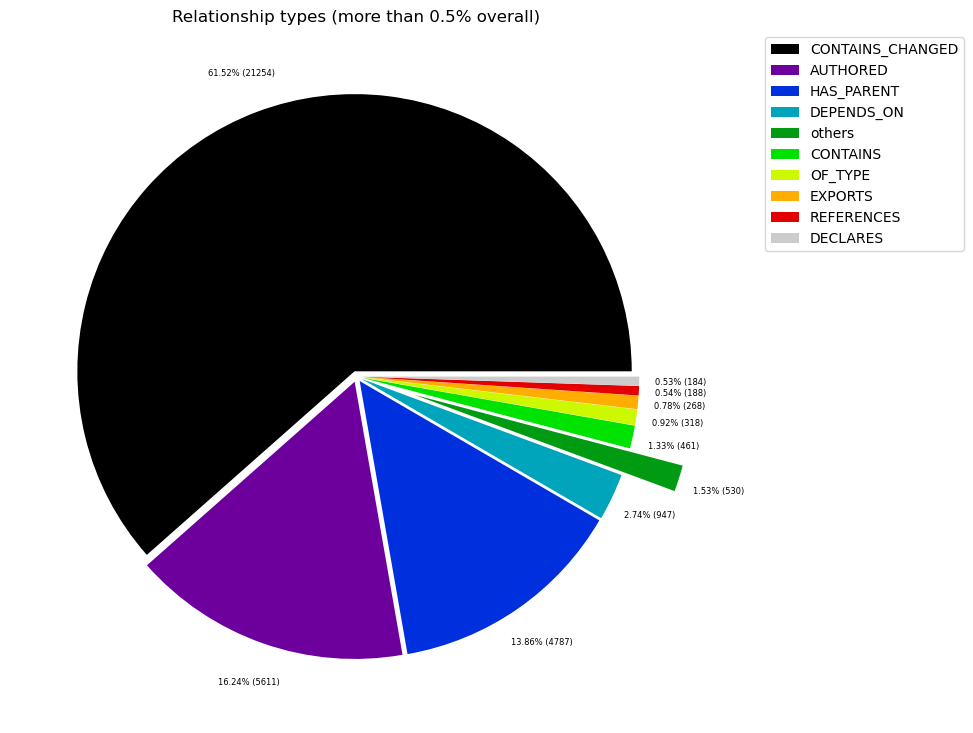
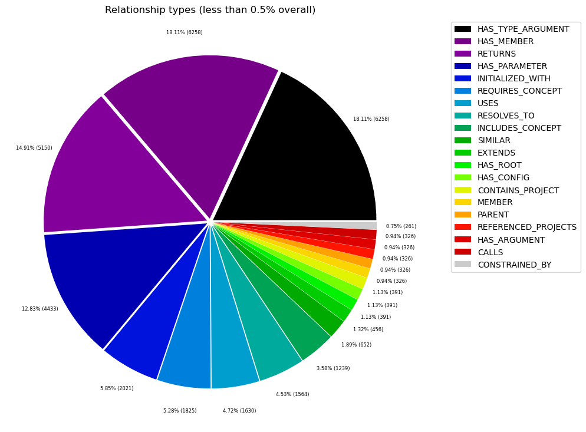

# Overview in General
   

This file contains a general overview of the data in the graph including node labels and relationships types.

### References
- [jqassistant](https://jqassistant.org)
- [Neo4j Python Driver](https://neo4j.com/docs/api/python-driver/current)

## Node Labels

### Table 1a - Highest node count by label combination

Lists the 30 label combinations with the highest number of nodes. The labels with the lowest node count are listed in table 1b.
The total list would sum up to the total number of labels (100%).

The whole table can be found in the CSV report `Node_label_combination_count`.

    Total number of nodes: 11733

<table border="1" class="dataframe">
  <thead>
    <tr style="text-align: right;">
      <th></th>
      <th>nodeLabels</th>
      <th>nodesWithThatLabels</th>
      <th>nodesWithThatLabelsPercent</th>
    </tr>
  </thead>
  <tbody>
    <tr>
      <th>0</th>
      <td>[Commit, Git, Log]</td>
      <td>5611</td>
      <td>47.822381</td>
    </tr>
    <tr>
      <th>1</th>
      <td>[File, Git, Log]</td>
      <td>3523</td>
      <td>30.026421</td>
    </tr>
    <tr>
      <th>2</th>
      <td>[Author, Git, Log]</td>
      <td>989</td>
      <td>8.429217</td>
    </tr>
    <tr>
      <th>3</th>
      <td>[Type, TS, Primitive, ExternalType]</td>
      <td>286</td>
      <td>2.437569</td>
    </tr>
    <tr>
      <th>4</th>
      <td>[Type, TS, Declared, ExternalType]</td>
      <td>276</td>
      <td>2.352340</td>
    </tr>
    <tr>
      <th>5</th>
      <td>[TS, ExternalDeclaration]</td>
      <td>209</td>
      <td>1.781301</td>
    </tr>
    <tr>
      <th>6</th>
      <td>[Type, TS, Literal, ExternalType]</td>
      <td>136</td>
      <td>1.159124</td>
    </tr>
    <tr>
      <th>7</th>
      <td>[Type, TS, Union, ExternalType]</td>
      <td>118</td>
      <td>1.005710</td>
    </tr>
    <tr>
      <th>8</th>
      <td>[Type, TS, ObjectMember, ExternalType]</td>
      <td>95</td>
      <td>0.809682</td>
    </tr>
    <tr>
      <th>9</th>
      <td>[TS, Property]</td>
      <td>65</td>
      <td>0.553993</td>
    </tr>
    <tr>
      <th>10</th>
      <td>[TS, Function]</td>
      <td>47</td>
      <td>0.400580</td>
    </tr>
    <tr>
      <th>11</th>
      <td>[Type, TS, Object, ExternalType]</td>
      <td>36</td>
      <td>0.306827</td>
    </tr>
    <tr>
      <th>12</th>
      <td>[Type, TS, FunctionParameter, ExternalType]</td>
      <td>35</td>
      <td>0.298304</td>
    </tr>
    <tr>
      <th>13</th>
      <td>[TS, Parameter]</td>
      <td>33</td>
      <td>0.281258</td>
    </tr>
    <tr>
      <th>14</th>
      <td>[Type, TS, Function, ExternalType]</td>
      <td>31</td>
      <td>0.264212</td>
    </tr>
    <tr>
      <th>15</th>
      <td>[TS, ExternalModule]</td>
      <td>25</td>
      <td>0.213074</td>
    </tr>
    <tr>
      <th>16</th>
      <td>[TS, Variable]</td>
      <td>23</td>
      <td>0.196028</td>
    </tr>
    <tr>
      <th>17</th>
      <td>[TS, Literal, Value]</td>
      <td>20</td>
      <td>0.170459</td>
    </tr>
    <tr>
      <th>18</th>
      <td>[jQAssistant, Rule, Concept]</td>
      <td>19</td>
      <td>0.161936</td>
    </tr>
    <tr>
      <th>19</th>
      <td>[TS, Interface]</td>
      <td>18</td>
      <td>0.153413</td>
    </tr>
    <tr>
      <th>20</th>
      <td>[Type, TS, Intersection, ExternalType]</td>
      <td>17</td>
      <td>0.144890</td>
    </tr>
    <tr>
      <th>21</th>
      <td>[File, Directory, Local]</td>
      <td>15</td>
      <td>0.127845</td>
    </tr>
    <tr>
      <th>22</th>
      <td>[TS, TypeAlias]</td>
      <td>14</td>
      <td>0.119322</td>
    </tr>
    <tr>
      <th>23</th>
      <td>[TS, Declared, Value]</td>
      <td>10</td>
      <td>0.085230</td>
    </tr>
    <tr>
      <th>24</th>
      <td>[Type, TS, NotIdentified, ExternalType]</td>
      <td>10</td>
      <td>0.085230</td>
    </tr>
    <tr>
      <th>25</th>
      <td>[TS, EnumMember]</td>
      <td>8</td>
      <td>0.068184</td>
    </tr>
    <tr>
      <th>26</th>
      <td>[Project, TS]</td>
      <td>6</td>
      <td>0.051138</td>
    </tr>
    <tr>
      <th>27</th>
      <td>[File, Local]</td>
      <td>6</td>
      <td>0.051138</td>
    </tr>
    <tr>
      <th>28</th>
      <td>[File, TS, Local, Module]</td>
      <td>6</td>
      <td>0.051138</td>
    </tr>
    <tr>
      <th>29</th>
      <td>[Type, TS, TypeParameterReference, ExternalType]</td>
      <td>6</td>
      <td>0.051138</td>
    </tr>
  </tbody>
</table>

### Chart 1a - Highest node count by label combination

Values under 0.5% will be grouped into "others" to get a cleaner plot. The group "others" is then broken down in Chart 1b.

    <Figure size 640x480 with 0 Axes>

    

    

### Table 1b - Lowest node count by label combination

Lists the 30 label combinations with the lowest number of nodes until they reach 0.5% of the total node count, which are shown above.

<table border="1" class="dataframe">
  <thead>
    <tr style="text-align: right;">
      <th></th>
      <th>nodeLabels</th>
      <th>nodesWithThatLabels</th>
      <th>nodesWithThatLabelsPercent</th>
    </tr>
  </thead>
  <tbody>
    <tr>
      <th>0</th>
      <td>[Analyze, Task, jQAssistant]</td>
      <td>1</td>
      <td>0.008523</td>
    </tr>
    <tr>
      <th>1</th>
      <td>[File]</td>
      <td>1</td>
      <td>0.008523</td>
    </tr>
    <tr>
      <th>2</th>
      <td>[File, TS, Scan]</td>
      <td>1</td>
      <td>0.008523</td>
    </tr>
    <tr>
      <th>3</th>
      <td>[TS, ObjectMember, Value]</td>
      <td>1</td>
      <td>0.008523</td>
    </tr>
    <tr>
      <th>4</th>
      <td>[TS, Constructor]</td>
      <td>1</td>
      <td>0.008523</td>
    </tr>
    <tr>
      <th>5</th>
      <td>[TS, Method]</td>
      <td>1</td>
      <td>0.008523</td>
    </tr>
    <tr>
      <th>6</th>
      <td>[TS, Class]</td>
      <td>1</td>
      <td>0.008523</td>
    </tr>
    <tr>
      <th>7</th>
      <td>[TS, Enum]</td>
      <td>2</td>
      <td>0.017046</td>
    </tr>
    <tr>
      <th>8</th>
      <td>[File, Directory]</td>
      <td>2</td>
      <td>0.017046</td>
    </tr>
    <tr>
      <th>9</th>
      <td>[TS, Object, Value]</td>
      <td>3</td>
      <td>0.025569</td>
    </tr>
    <tr>
      <th>10</th>
      <td>[Type, TS, Tuple, ExternalType]</td>
      <td>3</td>
      <td>0.025569</td>
    </tr>
    <tr>
      <th>11</th>
      <td>[TS, TypeParameter]</td>
      <td>4</td>
      <td>0.034092</td>
    </tr>
    <tr>
      <th>12</th>
      <td>[TS, Function, Value]</td>
      <td>4</td>
      <td>0.034092</td>
    </tr>
    <tr>
      <th>13</th>
      <td>[TS, Value, Complex]</td>
      <td>5</td>
      <td>0.042615</td>
    </tr>
    <tr>
      <th>14</th>
      <td>[TS, Value, Call]</td>
      <td>5</td>
      <td>0.042615</td>
    </tr>
    <tr>
      <th>15</th>
      <td>[TS, Value, Member]</td>
      <td>5</td>
      <td>0.042615</td>
    </tr>
    <tr>
      <th>16</th>
      <td>[Type, TS, TypeParameterReference, ExternalType]</td>
      <td>6</td>
      <td>0.051138</td>
    </tr>
    <tr>
      <th>17</th>
      <td>[File, TS, Local, Module]</td>
      <td>6</td>
      <td>0.051138</td>
    </tr>
    <tr>
      <th>18</th>
      <td>[File, Local]</td>
      <td>6</td>
      <td>0.051138</td>
    </tr>
    <tr>
      <th>19</th>
      <td>[Project, TS]</td>
      <td>6</td>
      <td>0.051138</td>
    </tr>
    <tr>
      <th>20</th>
      <td>[TS, EnumMember]</td>
      <td>8</td>
      <td>0.068184</td>
    </tr>
    <tr>
      <th>21</th>
      <td>[Type, TS, NotIdentified, ExternalType]</td>
      <td>10</td>
      <td>0.085230</td>
    </tr>
    <tr>
      <th>22</th>
      <td>[TS, Declared, Value]</td>
      <td>10</td>
      <td>0.085230</td>
    </tr>
    <tr>
      <th>23</th>
      <td>[TS, TypeAlias]</td>
      <td>14</td>
      <td>0.119322</td>
    </tr>
    <tr>
      <th>24</th>
      <td>[File, Directory, Local]</td>
      <td>15</td>
      <td>0.127845</td>
    </tr>
    <tr>
      <th>25</th>
      <td>[Type, TS, Intersection, ExternalType]</td>
      <td>17</td>
      <td>0.144890</td>
    </tr>
    <tr>
      <th>26</th>
      <td>[TS, Interface]</td>
      <td>18</td>
      <td>0.153413</td>
    </tr>
    <tr>
      <th>27</th>
      <td>[jQAssistant, Rule, Concept]</td>
      <td>19</td>
      <td>0.161936</td>
    </tr>
    <tr>
      <th>28</th>
      <td>[TS, Literal, Value]</td>
      <td>20</td>
      <td>0.170459</td>
    </tr>
    <tr>
      <th>29</th>
      <td>[TS, Variable]</td>
      <td>23</td>
      <td>0.196028</td>
    </tr>
  </tbody>
</table>

### Chart 1b - Lowest node count by label combination

Shows the lowest (less than 0.5% overall) node count label combinations. Therefore, this plot breaks down the "others" slice of the pie chart above. Values under 0.01% will be grouped into "others" to get a cleaner plot.

    <Figure size 640x480 with 0 Axes>

    

    

### Table 1c - Highest node count by single label

Lists the 40 labels with the highest number of nodes.
Doesn't sum up to the total number of nodes or 100% because one node can have multiple labels.
Helps to identify commonly used labels.

<table border="1" class="dataframe">
  <thead>
    <tr style="text-align: right;">
      <th></th>
      <th>nodeLabel</th>
      <th>nodesWithThatLabel</th>
      <th>nodesWithThatLabelPercent</th>
    </tr>
  </thead>
  <tbody>
    <tr>
      <th>0</th>
      <td>Git</td>
      <td>10123</td>
      <td>86.278019</td>
    </tr>
    <tr>
      <th>1</th>
      <td>Log</td>
      <td>10123</td>
      <td>86.278019</td>
    </tr>
    <tr>
      <th>2</th>
      <td>Commit</td>
      <td>5611</td>
      <td>47.822381</td>
    </tr>
    <tr>
      <th>3</th>
      <td>File</td>
      <td>3554</td>
      <td>30.290633</td>
    </tr>
    <tr>
      <th>4</th>
      <td>TS</td>
      <td>1566</td>
      <td>13.346970</td>
    </tr>
    <tr>
      <th>5</th>
      <td>ExternalType</td>
      <td>1049</td>
      <td>8.940595</td>
    </tr>
    <tr>
      <th>6</th>
      <td>Type</td>
      <td>1049</td>
      <td>8.940595</td>
    </tr>
    <tr>
      <th>7</th>
      <td>Author</td>
      <td>989</td>
      <td>8.429217</td>
    </tr>
    <tr>
      <th>8</th>
      <td>Declared</td>
      <td>286</td>
      <td>2.437569</td>
    </tr>
    <tr>
      <th>9</th>
      <td>Primitive</td>
      <td>286</td>
      <td>2.437569</td>
    </tr>
    <tr>
      <th>10</th>
      <td>ExternalDeclaration</td>
      <td>209</td>
      <td>1.781301</td>
    </tr>
    <tr>
      <th>11</th>
      <td>Literal</td>
      <td>156</td>
      <td>1.329583</td>
    </tr>
    <tr>
      <th>12</th>
      <td>Union</td>
      <td>118</td>
      <td>1.005710</td>
    </tr>
    <tr>
      <th>13</th>
      <td>ObjectMember</td>
      <td>96</td>
      <td>0.818205</td>
    </tr>
    <tr>
      <th>14</th>
      <td>Function</td>
      <td>82</td>
      <td>0.698883</td>
    </tr>
    <tr>
      <th>15</th>
      <td>Property</td>
      <td>65</td>
      <td>0.553993</td>
    </tr>
    <tr>
      <th>16</th>
      <td>Value</td>
      <td>53</td>
      <td>0.451717</td>
    </tr>
    <tr>
      <th>17</th>
      <td>Object</td>
      <td>39</td>
      <td>0.332396</td>
    </tr>
    <tr>
      <th>18</th>
      <td>FunctionParameter</td>
      <td>35</td>
      <td>0.298304</td>
    </tr>
    <tr>
      <th>19</th>
      <td>Parameter</td>
      <td>33</td>
      <td>0.281258</td>
    </tr>
    <tr>
      <th>20</th>
      <td>Local</td>
      <td>27</td>
      <td>0.230120</td>
    </tr>
    <tr>
      <th>21</th>
      <td>ExternalModule</td>
      <td>25</td>
      <td>0.213074</td>
    </tr>
    <tr>
      <th>22</th>
      <td>Variable</td>
      <td>23</td>
      <td>0.196028</td>
    </tr>
    <tr>
      <th>23</th>
      <td>jQAssistant</td>
      <td>20</td>
      <td>0.170459</td>
    </tr>
    <tr>
      <th>24</th>
      <td>Concept</td>
      <td>19</td>
      <td>0.161936</td>
    </tr>
    <tr>
      <th>25</th>
      <td>Rule</td>
      <td>19</td>
      <td>0.161936</td>
    </tr>
    <tr>
      <th>26</th>
      <td>Interface</td>
      <td>18</td>
      <td>0.153413</td>
    </tr>
    <tr>
      <th>27</th>
      <td>Directory</td>
      <td>17</td>
      <td>0.144890</td>
    </tr>
    <tr>
      <th>28</th>
      <td>Intersection</td>
      <td>17</td>
      <td>0.144890</td>
    </tr>
    <tr>
      <th>29</th>
      <td>TypeAlias</td>
      <td>14</td>
      <td>0.119322</td>
    </tr>
    <tr>
      <th>30</th>
      <td>NotIdentified</td>
      <td>10</td>
      <td>0.085230</td>
    </tr>
    <tr>
      <th>31</th>
      <td>EnumMember</td>
      <td>8</td>
      <td>0.068184</td>
    </tr>
    <tr>
      <th>32</th>
      <td>Module</td>
      <td>6</td>
      <td>0.051138</td>
    </tr>
    <tr>
      <th>33</th>
      <td>Project</td>
      <td>6</td>
      <td>0.051138</td>
    </tr>
    <tr>
      <th>34</th>
      <td>TypeParameterReference</td>
      <td>6</td>
      <td>0.051138</td>
    </tr>
    <tr>
      <th>35</th>
      <td>Call</td>
      <td>5</td>
      <td>0.042615</td>
    </tr>
    <tr>
      <th>36</th>
      <td>Complex</td>
      <td>5</td>
      <td>0.042615</td>
    </tr>
    <tr>
      <th>37</th>
      <td>Member</td>
      <td>5</td>
      <td>0.042615</td>
    </tr>
    <tr>
      <th>38</th>
      <td>TypeParameter</td>
      <td>4</td>
      <td>0.034092</td>
    </tr>
    <tr>
      <th>39</th>
      <td>Tuple</td>
      <td>3</td>
      <td>0.025569</td>
    </tr>
  </tbody>
</table>

### Chart 1c - Highest node count by label

Shows the 40 labels with the highest number of nodes.

    <Figure size 640x480 with 0 Axes>

    

    

## Relationship Types

### Table 2a - Highest relationship count by type

Lists the 30 relationship types with the highest number of occurrences.
The whole table can be found in the CSV report `Relationship_type_count`.

    Total number of relationships: 34548

<table border="1" class="dataframe">
  <thead>
    <tr style="text-align: right;">
      <th></th>
      <th>relationshipType</th>
      <th>nodesWithThatRelationshipType</th>
      <th>nodesWithThatRelationshipTypePercent</th>
    </tr>
  </thead>
  <tbody>
    <tr>
      <th>0</th>
      <td>CONTAINS_CHANGED</td>
      <td>21254</td>
      <td>61.520204</td>
    </tr>
    <tr>
      <th>1</th>
      <td>AUTHORED</td>
      <td>5611</td>
      <td>16.241172</td>
    </tr>
    <tr>
      <th>2</th>
      <td>HAS_PARENT</td>
      <td>4787</td>
      <td>13.856084</td>
    </tr>
    <tr>
      <th>3</th>
      <td>DEPENDS_ON</td>
      <td>947</td>
      <td>2.741114</td>
    </tr>
    <tr>
      <th>4</th>
      <td>CONTAINS</td>
      <td>461</td>
      <td>1.334375</td>
    </tr>
    <tr>
      <th>5</th>
      <td>OF_TYPE</td>
      <td>318</td>
      <td>0.920458</td>
    </tr>
    <tr>
      <th>6</th>
      <td>EXPORTS</td>
      <td>268</td>
      <td>0.775732</td>
    </tr>
    <tr>
      <th>7</th>
      <td>REFERENCES</td>
      <td>188</td>
      <td>0.544170</td>
    </tr>
    <tr>
      <th>8</th>
      <td>DECLARES</td>
      <td>184</td>
      <td>0.532592</td>
    </tr>
    <tr>
      <th>9</th>
      <td>HAS_MEMBER</td>
      <td>96</td>
      <td>0.277874</td>
    </tr>
    <tr>
      <th>10</th>
      <td>HAS_TYPE_ARGUMENT</td>
      <td>96</td>
      <td>0.277874</td>
    </tr>
    <tr>
      <th>11</th>
      <td>RETURNS</td>
      <td>79</td>
      <td>0.228667</td>
    </tr>
    <tr>
      <th>12</th>
      <td>HAS_PARAMETER</td>
      <td>68</td>
      <td>0.196828</td>
    </tr>
    <tr>
      <th>13</th>
      <td>INITIALIZED_WITH</td>
      <td>31</td>
      <td>0.089730</td>
    </tr>
    <tr>
      <th>14</th>
      <td>REQUIRES_CONCEPT</td>
      <td>28</td>
      <td>0.081047</td>
    </tr>
    <tr>
      <th>15</th>
      <td>USES</td>
      <td>25</td>
      <td>0.072363</td>
    </tr>
    <tr>
      <th>16</th>
      <td>RESOLVES_TO</td>
      <td>24</td>
      <td>0.069469</td>
    </tr>
    <tr>
      <th>17</th>
      <td>INCLUDES_CONCEPT</td>
      <td>19</td>
      <td>0.054996</td>
    </tr>
    <tr>
      <th>18</th>
      <td>SIMILAR</td>
      <td>10</td>
      <td>0.028945</td>
    </tr>
    <tr>
      <th>19</th>
      <td>EXTENDS</td>
      <td>7</td>
      <td>0.020262</td>
    </tr>
    <tr>
      <th>20</th>
      <td>CONTAINS_PROJECT</td>
      <td>6</td>
      <td>0.017367</td>
    </tr>
    <tr>
      <th>21</th>
      <td>HAS_CONFIG</td>
      <td>6</td>
      <td>0.017367</td>
    </tr>
    <tr>
      <th>22</th>
      <td>HAS_ROOT</td>
      <td>6</td>
      <td>0.017367</td>
    </tr>
    <tr>
      <th>23</th>
      <td>CALLS</td>
      <td>5</td>
      <td>0.014473</td>
    </tr>
    <tr>
      <th>24</th>
      <td>HAS_ARGUMENT</td>
      <td>5</td>
      <td>0.014473</td>
    </tr>
    <tr>
      <th>25</th>
      <td>MEMBER</td>
      <td>5</td>
      <td>0.014473</td>
    </tr>
    <tr>
      <th>26</th>
      <td>PARENT</td>
      <td>5</td>
      <td>0.014473</td>
    </tr>
    <tr>
      <th>27</th>
      <td>REFERENCED_PROJECTS</td>
      <td>5</td>
      <td>0.014473</td>
    </tr>
    <tr>
      <th>28</th>
      <td>CONSTRAINED_BY</td>
      <td>4</td>
      <td>0.011578</td>
    </tr>
  </tbody>
</table>

### Chart 2a - Highest relationship count by type

Values under 0.5% will be grouped into "others" to get a cleaner plot. The group "others" is then broken down in the second chart.

    <Figure size 640x480 with 0 Axes>

    

    

### Table 2b - Lowest relationship count by type

Lists the 30 relationships type with the lowest number of occurrences up to 0.5% of the total node count. This is essentially breaking down the "others" slice from the chart above.

<table border="1" class="dataframe">
  <thead>
    <tr style="text-align: right;">
      <th></th>
      <th>relationshipType</th>
      <th>nodesWithThatRelationshipType</th>
      <th>nodesWithThatRelationshipTypePercent</th>
    </tr>
  </thead>
  <tbody>
    <tr>
      <th>0</th>
      <td>CONSTRAINED_BY</td>
      <td>4</td>
      <td>0.011578</td>
    </tr>
    <tr>
      <th>1</th>
      <td>PARENT</td>
      <td>5</td>
      <td>0.014473</td>
    </tr>
    <tr>
      <th>2</th>
      <td>MEMBER</td>
      <td>5</td>
      <td>0.014473</td>
    </tr>
    <tr>
      <th>3</th>
      <td>HAS_ARGUMENT</td>
      <td>5</td>
      <td>0.014473</td>
    </tr>
    <tr>
      <th>4</th>
      <td>CALLS</td>
      <td>5</td>
      <td>0.014473</td>
    </tr>
    <tr>
      <th>5</th>
      <td>REFERENCED_PROJECTS</td>
      <td>5</td>
      <td>0.014473</td>
    </tr>
    <tr>
      <th>6</th>
      <td>HAS_ROOT</td>
      <td>6</td>
      <td>0.017367</td>
    </tr>
    <tr>
      <th>7</th>
      <td>HAS_CONFIG</td>
      <td>6</td>
      <td>0.017367</td>
    </tr>
    <tr>
      <th>8</th>
      <td>CONTAINS_PROJECT</td>
      <td>6</td>
      <td>0.017367</td>
    </tr>
    <tr>
      <th>9</th>
      <td>EXTENDS</td>
      <td>7</td>
      <td>0.020262</td>
    </tr>
    <tr>
      <th>10</th>
      <td>SIMILAR</td>
      <td>10</td>
      <td>0.028945</td>
    </tr>
    <tr>
      <th>11</th>
      <td>INCLUDES_CONCEPT</td>
      <td>19</td>
      <td>0.054996</td>
    </tr>
    <tr>
      <th>12</th>
      <td>RESOLVES_TO</td>
      <td>24</td>
      <td>0.069469</td>
    </tr>
    <tr>
      <th>13</th>
      <td>USES</td>
      <td>25</td>
      <td>0.072363</td>
    </tr>
    <tr>
      <th>14</th>
      <td>REQUIRES_CONCEPT</td>
      <td>28</td>
      <td>0.081047</td>
    </tr>
    <tr>
      <th>15</th>
      <td>INITIALIZED_WITH</td>
      <td>31</td>
      <td>0.089730</td>
    </tr>
    <tr>
      <th>16</th>
      <td>HAS_PARAMETER</td>
      <td>68</td>
      <td>0.196828</td>
    </tr>
    <tr>
      <th>17</th>
      <td>RETURNS</td>
      <td>79</td>
      <td>0.228667</td>
    </tr>
    <tr>
      <th>18</th>
      <td>HAS_TYPE_ARGUMENT</td>
      <td>96</td>
      <td>0.277874</td>
    </tr>
    <tr>
      <th>19</th>
      <td>HAS_MEMBER</td>
      <td>96</td>
      <td>0.277874</td>
    </tr>
  </tbody>
</table>

### Chart 2b - Lowest relationship count by type

Shows the lowest (less than 0.5% overall) relationship types. This plot breaks down the "others" slice of the pie chart above. Values under 0.01% will be grouped into "others" to get a cleaner plot.

    <Figure size 640x480 with 0 Axes>

    

    

## Node labels with their relationships

### Table 3a - Highest relationship count by node labels and relationship type

Lists the 30 node labels and their relationship types with the highest number of occurrences.

<table border="1" class="dataframe">
  <thead>
    <tr style="text-align: right;">
      <th></th>
      <th>sourceLabels</th>
      <th>relationType</th>
      <th>targetLabels</th>
      <th>numberOfRelationships</th>
      <th>numberOfNodesWithSameLabelsAsSource</th>
      <th>numberOfNodesWithSameLabelsAsTarget</th>
      <th>densityInPercent</th>
    </tr>
  </thead>
  <tbody>
    <tr>
      <th>0</th>
      <td>[Commit, Git, Log]</td>
      <td>CONTAINS_CHANGED</td>
      <td>[File, Git, Log]</td>
      <td>21254</td>
      <td>5611</td>
      <td>3523</td>
      <td>0.107520</td>
    </tr>
    <tr>
      <th>1</th>
      <td>[Author, Git, Log]</td>
      <td>AUTHORED</td>
      <td>[Commit, Git, Log]</td>
      <td>5611</td>
      <td>989</td>
      <td>5611</td>
      <td>0.101112</td>
    </tr>
    <tr>
      <th>2</th>
      <td>[Commit, Git, Log]</td>
      <td>HAS_PARENT</td>
      <td>[Commit, Git, Log]</td>
      <td>4787</td>
      <td>5611</td>
      <td>5611</td>
      <td>0.015205</td>
    </tr>
    <tr>
      <th>3</th>
      <td>[TS, Function]</td>
      <td>DEPENDS_ON</td>
      <td>[TS, ExternalDeclaration]</td>
      <td>280</td>
      <td>47</td>
      <td>209</td>
      <td>2.850453</td>
    </tr>
    <tr>
      <th>4</th>
      <td>[TS, ExternalModule]</td>
      <td>EXPORTS</td>
      <td>[TS, ExternalDeclaration]</td>
      <td>209</td>
      <td>25</td>
      <td>209</td>
      <td>4.000000</td>
    </tr>
    <tr>
      <th>5</th>
      <td>[Type, TS, Union, ExternalType]</td>
      <td>CONTAINS</td>
      <td>[Type, TS, Primitive, ExternalType]</td>
      <td>147</td>
      <td>118</td>
      <td>286</td>
      <td>0.435581</td>
    </tr>
    <tr>
      <th>6</th>
      <td>[File, TS, Local, Module, Mark4ModuleWeaklyCon...</td>
      <td>DEPENDS_ON</td>
      <td>[TS, ExternalDeclaration]</td>
      <td>146</td>
      <td>1</td>
      <td>209</td>
      <td>69.856459</td>
    </tr>
    <tr>
      <th>7</th>
      <td>[Type, TS, Declared, ExternalType]</td>
      <td>REFERENCES</td>
      <td>[TS, ExternalDeclaration]</td>
      <td>130</td>
      <td>276</td>
      <td>209</td>
      <td>0.225366</td>
    </tr>
    <tr>
      <th>8</th>
      <td>[TS, Function]</td>
      <td>DEPENDS_ON</td>
      <td>[TS, ExternalModule]</td>
      <td>129</td>
      <td>47</td>
      <td>25</td>
      <td>10.978723</td>
    </tr>
    <tr>
      <th>9</th>
      <td>[Type, TS, Union, ExternalType]</td>
      <td>CONTAINS</td>
      <td>[Type, TS, Literal, ExternalType]</td>
      <td>119</td>
      <td>118</td>
      <td>136</td>
      <td>0.741525</td>
    </tr>
    <tr>
      <th>10</th>
      <td>[Type, TS, Object, ExternalType]</td>
      <td>HAS_MEMBER</td>
      <td>[Type, TS, ObjectMember, ExternalType]</td>
      <td>95</td>
      <td>36</td>
      <td>95</td>
      <td>2.777778</td>
    </tr>
    <tr>
      <th>11</th>
      <td>[Type, TS, Union, ExternalType]</td>
      <td>CONTAINS</td>
      <td>[Type, TS, Declared, ExternalType]</td>
      <td>77</td>
      <td>118</td>
      <td>276</td>
      <td>0.236428</td>
    </tr>
    <tr>
      <th>12</th>
      <td>[TS, Interface]</td>
      <td>DECLARES</td>
      <td>[TS, Property]</td>
      <td>61</td>
      <td>18</td>
      <td>65</td>
      <td>5.213675</td>
    </tr>
    <tr>
      <th>13</th>
      <td>[TS, Property]</td>
      <td>OF_TYPE</td>
      <td>[Type, TS, Union, ExternalType]</td>
      <td>46</td>
      <td>65</td>
      <td>118</td>
      <td>0.599739</td>
    </tr>
    <tr>
      <th>14</th>
      <td>[Type, TS, Declared, ExternalType]</td>
      <td>HAS_TYPE_ARGUMENT</td>
      <td>[Type, TS, Declared, ExternalType]</td>
      <td>42</td>
      <td>276</td>
      <td>276</td>
      <td>0.055135</td>
    </tr>
    <tr>
      <th>15</th>
      <td>[TS, Variable]</td>
      <td>DEPENDS_ON</td>
      <td>[TS, ExternalDeclaration]</td>
      <td>42</td>
      <td>23</td>
      <td>209</td>
      <td>0.873726</td>
    </tr>
    <tr>
      <th>16</th>
      <td>[File, TS, Local, Module, Mark4ModuleWeaklyCon...</td>
      <td>DEPENDS_ON</td>
      <td>[TS, ExternalDeclaration]</td>
      <td>40</td>
      <td>2</td>
      <td>209</td>
      <td>9.569378</td>
    </tr>
    <tr>
      <th>17</th>
      <td>[Type, TS, ObjectMember, ExternalType]</td>
      <td>OF_TYPE</td>
      <td>[Type, TS, Union, ExternalType]</td>
      <td>35</td>
      <td>95</td>
      <td>118</td>
      <td>0.312221</td>
    </tr>
    <tr>
      <th>18</th>
      <td>[Type, TS, Function, ExternalType]</td>
      <td>HAS_PARAMETER</td>
      <td>[Type, TS, FunctionParameter, ExternalType]</td>
      <td>35</td>
      <td>31</td>
      <td>35</td>
      <td>3.225806</td>
    </tr>
    <tr>
      <th>19</th>
      <td>[TS, Function]</td>
      <td>HAS_PARAMETER</td>
      <td>[TS, Parameter]</td>
      <td>33</td>
      <td>47</td>
      <td>33</td>
      <td>2.127660</td>
    </tr>
    <tr>
      <th>20</th>
      <td>[Type, TS, ObjectMember, ExternalType]</td>
      <td>OF_TYPE</td>
      <td>[Type, TS, Primitive, ExternalType]</td>
      <td>31</td>
      <td>95</td>
      <td>286</td>
      <td>0.114096</td>
    </tr>
    <tr>
      <th>21</th>
      <td>[TS, Function]</td>
      <td>DEPENDS_ON</td>
      <td>[TS, Function]</td>
      <td>30</td>
      <td>47</td>
      <td>47</td>
      <td>1.358081</td>
    </tr>
    <tr>
      <th>22</th>
      <td>[Type, TS, Declared, ExternalType]</td>
      <td>HAS_TYPE_ARGUMENT</td>
      <td>[Type, TS, Primitive, ExternalType]</td>
      <td>28</td>
      <td>276</td>
      <td>286</td>
      <td>0.035472</td>
    </tr>
    <tr>
      <th>23</th>
      <td>[jQAssistant, Rule, Concept]</td>
      <td>REQUIRES_CONCEPT</td>
      <td>[jQAssistant, Rule, Concept]</td>
      <td>28</td>
      <td>19</td>
      <td>19</td>
      <td>7.756233</td>
    </tr>
    <tr>
      <th>24</th>
      <td>[File, TS, Local, Module, Mark4ModuleWeaklyCon...</td>
      <td>DECLARES</td>
      <td>[TS, Function]</td>
      <td>27</td>
      <td>1</td>
      <td>47</td>
      <td>57.446809</td>
    </tr>
    <tr>
      <th>25</th>
      <td>[TS, Interface]</td>
      <td>DEPENDS_ON</td>
      <td>[TS, ExternalDeclaration]</td>
      <td>26</td>
      <td>18</td>
      <td>209</td>
      <td>0.691122</td>
    </tr>
    <tr>
      <th>26</th>
      <td>[Project, TS]</td>
      <td>USES</td>
      <td>[TS, ExternalModule]</td>
      <td>25</td>
      <td>6</td>
      <td>25</td>
      <td>16.666667</td>
    </tr>
    <tr>
      <th>27</th>
      <td>[Type, TS, Declared, ExternalType]</td>
      <td>REFERENCES</td>
      <td>[TS, Interface]</td>
      <td>25</td>
      <td>276</td>
      <td>18</td>
      <td>0.503221</td>
    </tr>
    <tr>
      <th>28</th>
      <td>[File, Directory, Local]</td>
      <td>CONTAINS</td>
      <td>[File, Directory, Local]</td>
      <td>24</td>
      <td>15</td>
      <td>15</td>
      <td>10.666667</td>
    </tr>
    <tr>
      <th>29</th>
      <td>[File, TS, Local, Module, Mark4ModuleWeaklyCon...</td>
      <td>DEPENDS_ON</td>
      <td>[TS, ExternalDeclaration]</td>
      <td>24</td>
      <td>1</td>
      <td>209</td>
      <td>11.483254</td>
    </tr>
  </tbody>
</table>

## Graph Density

    total_number_of_nodes (vertices): 11733
    total_number_of_relationships (edges): 34548
    -> total directed graph density: 0.0002509815435722354
    -> total directed graph density in percent: 0.02509815435722354

