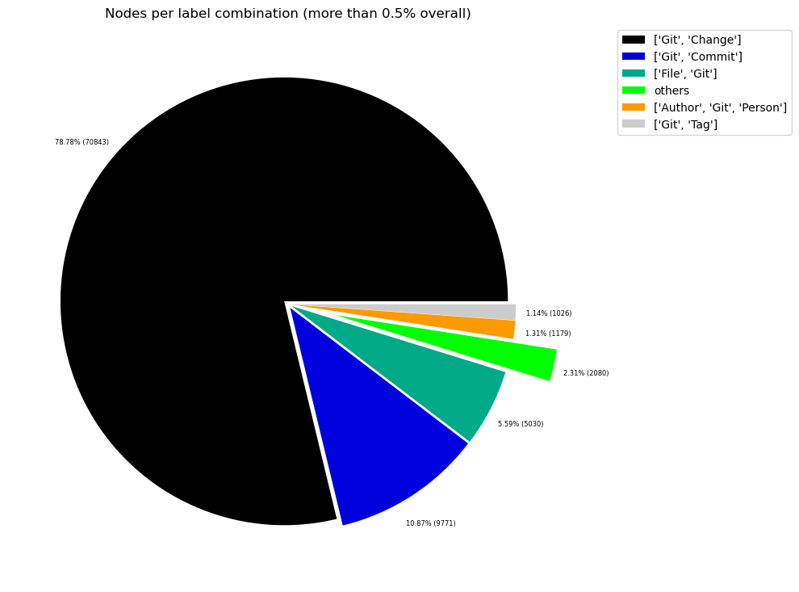
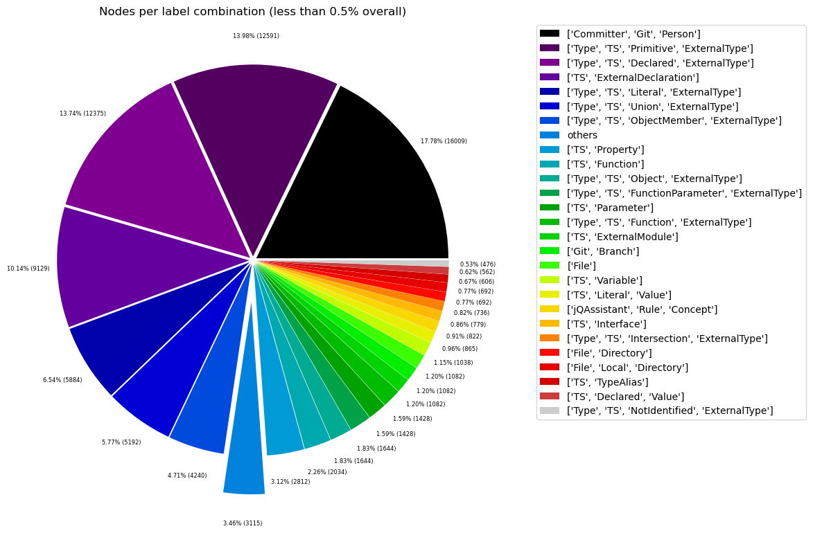
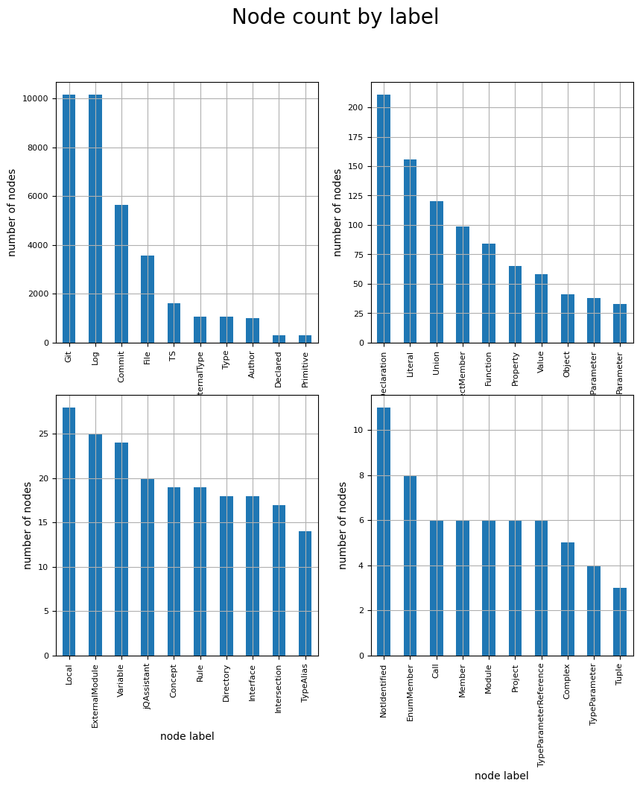
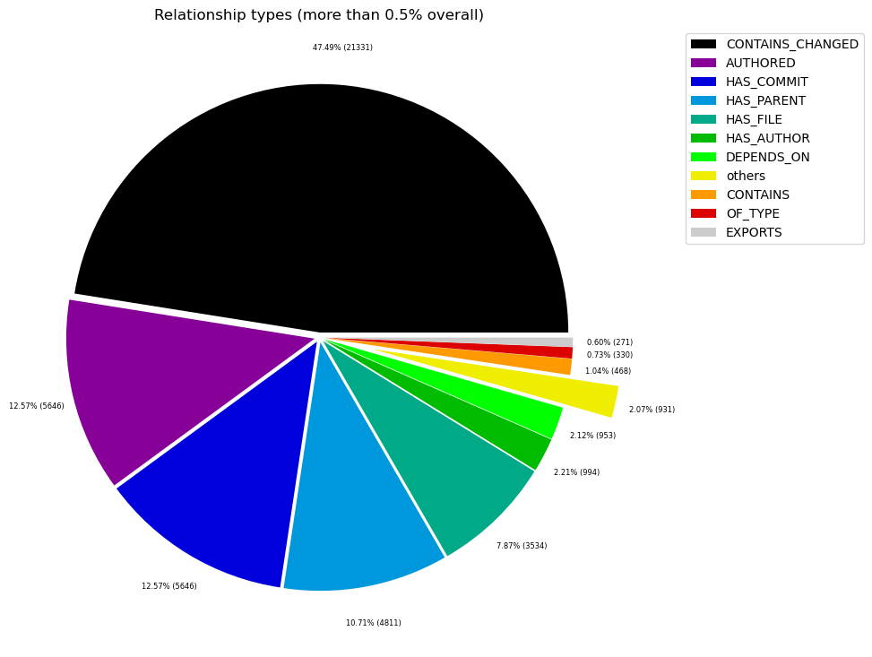
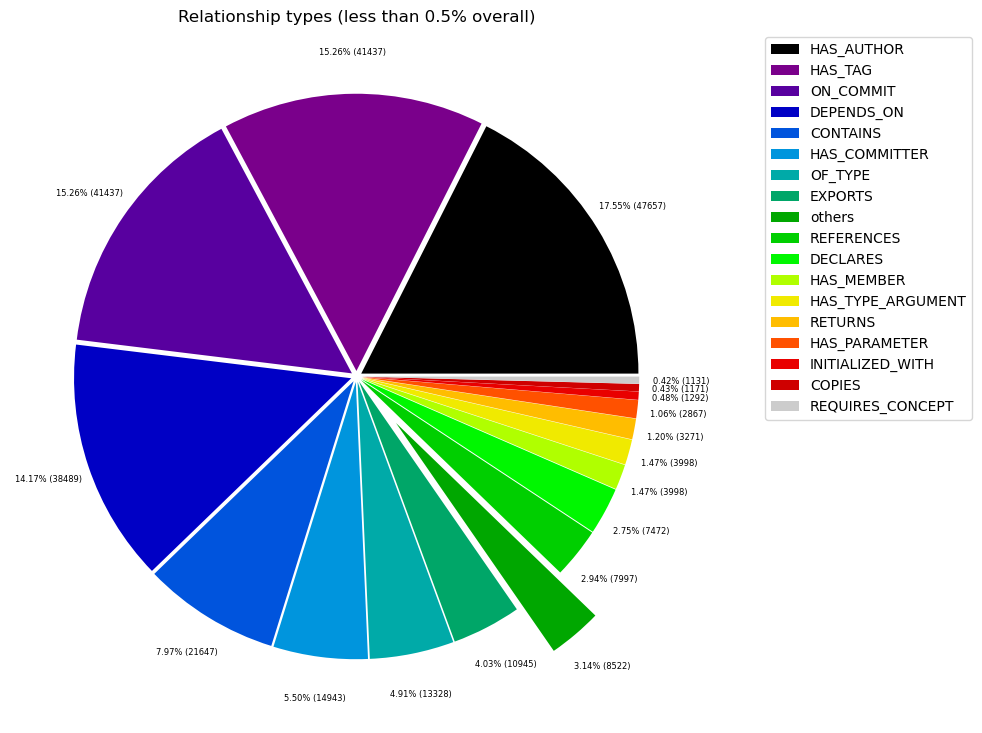

# Overview in General
   

This file contains a general overview of the data in the graph including node labels and relationships types.

### References
- [jqassistant](https://jqassistant.org)
- [Neo4j Python Driver](https://neo4j.com/docs/api/python-driver/current)

## Node Labels

### Table 1a - Highest node count by label combination

Lists the 30 label combinations with the highest number of nodes. The labels with the lowest node count are listed in table 1b.
The total list would sum up to the total number of labels (100%).

The whole table can be found in the CSV report `Node_label_combination_count`.

    Total number of nodes: 11822

<table border="1" class="dataframe">
  <thead>
    <tr style="text-align: right;">
      <th></th>
      <th>nodeLabels</th>
      <th>nodesWithThatLabels</th>
      <th>nodesWithThatLabelsPercent</th>
    </tr>
  </thead>
  <tbody>
    <tr>
      <th>0</th>
      <td>[Git, Commit, Log]</td>
      <td>5646</td>
      <td>47.758417</td>
    </tr>
    <tr>
      <th>1</th>
      <td>[File, Git, Log]</td>
      <td>3534</td>
      <td>29.893419</td>
    </tr>
    <tr>
      <th>2</th>
      <td>[Git, Author, Log]</td>
      <td>994</td>
      <td>8.408053</td>
    </tr>
    <tr>
      <th>3</th>
      <td>[Type, TS, Primitive, ExternalType]</td>
      <td>291</td>
      <td>2.461512</td>
    </tr>
    <tr>
      <th>4</th>
      <td>[Type, TS, Declared, ExternalType]</td>
      <td>286</td>
      <td>2.419218</td>
    </tr>
    <tr>
      <th>5</th>
      <td>[TS, ExternalDeclaration]</td>
      <td>211</td>
      <td>1.784808</td>
    </tr>
    <tr>
      <th>6</th>
      <td>[Type, TS, Literal, ExternalType]</td>
      <td>136</td>
      <td>1.150398</td>
    </tr>
    <tr>
      <th>7</th>
      <td>[Type, TS, Union, ExternalType]</td>
      <td>120</td>
      <td>1.015057</td>
    </tr>
    <tr>
      <th>8</th>
      <td>[Type, TS, ObjectMember, ExternalType]</td>
      <td>98</td>
      <td>0.828963</td>
    </tr>
    <tr>
      <th>9</th>
      <td>[TS, Property]</td>
      <td>65</td>
      <td>0.549822</td>
    </tr>
    <tr>
      <th>10</th>
      <td>[TS, Function]</td>
      <td>47</td>
      <td>0.397564</td>
    </tr>
    <tr>
      <th>11</th>
      <td>[Type, TS, Object, ExternalType]</td>
      <td>38</td>
      <td>0.321435</td>
    </tr>
    <tr>
      <th>12</th>
      <td>[Type, TS, FunctionParameter, ExternalType]</td>
      <td>38</td>
      <td>0.321435</td>
    </tr>
    <tr>
      <th>13</th>
      <td>[TS, Parameter]</td>
      <td>33</td>
      <td>0.279141</td>
    </tr>
    <tr>
      <th>14</th>
      <td>[Type, TS, Function, ExternalType]</td>
      <td>33</td>
      <td>0.279141</td>
    </tr>
    <tr>
      <th>15</th>
      <td>[TS, ExternalModule]</td>
      <td>25</td>
      <td>0.211470</td>
    </tr>
    <tr>
      <th>16</th>
      <td>[TS, Variable]</td>
      <td>24</td>
      <td>0.203011</td>
    </tr>
    <tr>
      <th>17</th>
      <td>[TS, Literal, Value]</td>
      <td>20</td>
      <td>0.169176</td>
    </tr>
    <tr>
      <th>18</th>
      <td>[jQAssistant, Rule, Concept]</td>
      <td>19</td>
      <td>0.160717</td>
    </tr>
    <tr>
      <th>19</th>
      <td>[TS, Interface]</td>
      <td>18</td>
      <td>0.152259</td>
    </tr>
    <tr>
      <th>20</th>
      <td>[Type, TS, Intersection, ExternalType]</td>
      <td>17</td>
      <td>0.143800</td>
    </tr>
    <tr>
      <th>21</th>
      <td>[File, Directory, Local]</td>
      <td>16</td>
      <td>0.135341</td>
    </tr>
    <tr>
      <th>22</th>
      <td>[TS, TypeAlias]</td>
      <td>14</td>
      <td>0.118423</td>
    </tr>
    <tr>
      <th>23</th>
      <td>[TS, Declared, Value]</td>
      <td>13</td>
      <td>0.109964</td>
    </tr>
    <tr>
      <th>24</th>
      <td>[Type, TS, NotIdentified, ExternalType]</td>
      <td>11</td>
      <td>0.093047</td>
    </tr>
    <tr>
      <th>25</th>
      <td>[TS, EnumMember]</td>
      <td>8</td>
      <td>0.067670</td>
    </tr>
    <tr>
      <th>26</th>
      <td>[Project, TS]</td>
      <td>6</td>
      <td>0.050753</td>
    </tr>
    <tr>
      <th>27</th>
      <td>[File, Local]</td>
      <td>6</td>
      <td>0.050753</td>
    </tr>
    <tr>
      <th>28</th>
      <td>[File, TS, Local, Module]</td>
      <td>6</td>
      <td>0.050753</td>
    </tr>
    <tr>
      <th>29</th>
      <td>[Type, TS, TypeParameterReference, ExternalType]</td>
      <td>6</td>
      <td>0.050753</td>
    </tr>
  </tbody>
</table>

### Chart 1a - Highest node count by label combination

Values under 0.5% will be grouped into "others" to get a cleaner plot. The group "others" is then broken down in Chart 1b.

    <Figure size 640x480 with 0 Axes>

    

    

### Table 1b - Lowest node count by label combination

Lists the 30 label combinations with the lowest number of nodes until they reach 0.5% of the total node count, which are shown above.

<table border="1" class="dataframe">
  <thead>
    <tr style="text-align: right;">
      <th></th>
      <th>nodeLabels</th>
      <th>nodesWithThatLabels</th>
      <th>nodesWithThatLabelsPercent</th>
    </tr>
  </thead>
  <tbody>
    <tr>
      <th>0</th>
      <td>[Repository, Git]</td>
      <td>1</td>
      <td>0.008459</td>
    </tr>
    <tr>
      <th>1</th>
      <td>[File]</td>
      <td>1</td>
      <td>0.008459</td>
    </tr>
    <tr>
      <th>2</th>
      <td>[File, TS, Scan]</td>
      <td>1</td>
      <td>0.008459</td>
    </tr>
    <tr>
      <th>3</th>
      <td>[TS, Class]</td>
      <td>1</td>
      <td>0.008459</td>
    </tr>
    <tr>
      <th>4</th>
      <td>[Analyze, Task, jQAssistant]</td>
      <td>1</td>
      <td>0.008459</td>
    </tr>
    <tr>
      <th>5</th>
      <td>[TS, Method]</td>
      <td>1</td>
      <td>0.008459</td>
    </tr>
    <tr>
      <th>6</th>
      <td>[TS, ObjectMember, Value]</td>
      <td>1</td>
      <td>0.008459</td>
    </tr>
    <tr>
      <th>7</th>
      <td>[TS, Constructor]</td>
      <td>1</td>
      <td>0.008459</td>
    </tr>
    <tr>
      <th>8</th>
      <td>[TS, Enum]</td>
      <td>2</td>
      <td>0.016918</td>
    </tr>
    <tr>
      <th>9</th>
      <td>[File, Directory]</td>
      <td>2</td>
      <td>0.016918</td>
    </tr>
    <tr>
      <th>10</th>
      <td>[TS, Object, Value]</td>
      <td>3</td>
      <td>0.025376</td>
    </tr>
    <tr>
      <th>11</th>
      <td>[Type, TS, Tuple, ExternalType]</td>
      <td>3</td>
      <td>0.025376</td>
    </tr>
    <tr>
      <th>12</th>
      <td>[TS, Function, Value]</td>
      <td>4</td>
      <td>0.033835</td>
    </tr>
    <tr>
      <th>13</th>
      <td>[TS, TypeParameter]</td>
      <td>4</td>
      <td>0.033835</td>
    </tr>
    <tr>
      <th>14</th>
      <td>[TS, Value, Complex]</td>
      <td>5</td>
      <td>0.042294</td>
    </tr>
    <tr>
      <th>15</th>
      <td>[TS, Value, Member]</td>
      <td>6</td>
      <td>0.050753</td>
    </tr>
    <tr>
      <th>16</th>
      <td>[TS, Value, Call]</td>
      <td>6</td>
      <td>0.050753</td>
    </tr>
    <tr>
      <th>17</th>
      <td>[Type, TS, TypeParameterReference, ExternalType]</td>
      <td>6</td>
      <td>0.050753</td>
    </tr>
    <tr>
      <th>18</th>
      <td>[File, TS, Local, Module]</td>
      <td>6</td>
      <td>0.050753</td>
    </tr>
    <tr>
      <th>19</th>
      <td>[File, Local]</td>
      <td>6</td>
      <td>0.050753</td>
    </tr>
    <tr>
      <th>20</th>
      <td>[Project, TS]</td>
      <td>6</td>
      <td>0.050753</td>
    </tr>
    <tr>
      <th>21</th>
      <td>[TS, EnumMember]</td>
      <td>8</td>
      <td>0.067670</td>
    </tr>
    <tr>
      <th>22</th>
      <td>[Type, TS, NotIdentified, ExternalType]</td>
      <td>11</td>
      <td>0.093047</td>
    </tr>
    <tr>
      <th>23</th>
      <td>[TS, Declared, Value]</td>
      <td>13</td>
      <td>0.109964</td>
    </tr>
    <tr>
      <th>24</th>
      <td>[TS, TypeAlias]</td>
      <td>14</td>
      <td>0.118423</td>
    </tr>
    <tr>
      <th>25</th>
      <td>[File, Directory, Local]</td>
      <td>16</td>
      <td>0.135341</td>
    </tr>
    <tr>
      <th>26</th>
      <td>[Type, TS, Intersection, ExternalType]</td>
      <td>17</td>
      <td>0.143800</td>
    </tr>
    <tr>
      <th>27</th>
      <td>[TS, Interface]</td>
      <td>18</td>
      <td>0.152259</td>
    </tr>
    <tr>
      <th>28</th>
      <td>[jQAssistant, Rule, Concept]</td>
      <td>19</td>
      <td>0.160717</td>
    </tr>
    <tr>
      <th>29</th>
      <td>[TS, Literal, Value]</td>
      <td>20</td>
      <td>0.169176</td>
    </tr>
  </tbody>
</table>

### Chart 1b - Lowest node count by label combination

Shows the lowest (less than 0.5% overall) node count label combinations. Therefore, this plot breaks down the "others" slice of the pie chart above. Values under 0.01% will be grouped into "others" to get a cleaner plot.

    <Figure size 640x480 with 0 Axes>

    

    

### Table 1c - Highest node count by single label

Lists the 40 labels with the highest number of nodes.
Doesn't sum up to the total number of nodes or 100% because one node can have multiple labels.
Helps to identify commonly used labels.

<table border="1" class="dataframe">
  <thead>
    <tr style="text-align: right;">
      <th></th>
      <th>nodeLabel</th>
      <th>nodesWithThatLabel</th>
      <th>nodesWithThatLabelPercent</th>
    </tr>
  </thead>
  <tbody>
    <tr>
      <th>0</th>
      <td>Git</td>
      <td>10175</td>
      <td>86.068347</td>
    </tr>
    <tr>
      <th>1</th>
      <td>Log</td>
      <td>10174</td>
      <td>86.059888</td>
    </tr>
    <tr>
      <th>2</th>
      <td>Commit</td>
      <td>5646</td>
      <td>47.758417</td>
    </tr>
    <tr>
      <th>3</th>
      <td>File</td>
      <td>3566</td>
      <td>30.164101</td>
    </tr>
    <tr>
      <th>4</th>
      <td>TS</td>
      <td>1602</td>
      <td>13.551007</td>
    </tr>
    <tr>
      <th>5</th>
      <td>ExternalType</td>
      <td>1077</td>
      <td>9.110134</td>
    </tr>
    <tr>
      <th>6</th>
      <td>Type</td>
      <td>1077</td>
      <td>9.110134</td>
    </tr>
    <tr>
      <th>7</th>
      <td>Author</td>
      <td>994</td>
      <td>8.408053</td>
    </tr>
    <tr>
      <th>8</th>
      <td>Declared</td>
      <td>299</td>
      <td>2.529183</td>
    </tr>
    <tr>
      <th>9</th>
      <td>Primitive</td>
      <td>291</td>
      <td>2.461512</td>
    </tr>
    <tr>
      <th>10</th>
      <td>ExternalDeclaration</td>
      <td>211</td>
      <td>1.784808</td>
    </tr>
    <tr>
      <th>11</th>
      <td>Literal</td>
      <td>156</td>
      <td>1.319574</td>
    </tr>
    <tr>
      <th>12</th>
      <td>Union</td>
      <td>120</td>
      <td>1.015057</td>
    </tr>
    <tr>
      <th>13</th>
      <td>ObjectMember</td>
      <td>99</td>
      <td>0.837422</td>
    </tr>
    <tr>
      <th>14</th>
      <td>Function</td>
      <td>84</td>
      <td>0.710540</td>
    </tr>
    <tr>
      <th>15</th>
      <td>Property</td>
      <td>65</td>
      <td>0.549822</td>
    </tr>
    <tr>
      <th>16</th>
      <td>Value</td>
      <td>58</td>
      <td>0.490611</td>
    </tr>
    <tr>
      <th>17</th>
      <td>Object</td>
      <td>41</td>
      <td>0.346811</td>
    </tr>
    <tr>
      <th>18</th>
      <td>FunctionParameter</td>
      <td>38</td>
      <td>0.321435</td>
    </tr>
    <tr>
      <th>19</th>
      <td>Parameter</td>
      <td>33</td>
      <td>0.279141</td>
    </tr>
    <tr>
      <th>20</th>
      <td>Local</td>
      <td>28</td>
      <td>0.236847</td>
    </tr>
    <tr>
      <th>21</th>
      <td>ExternalModule</td>
      <td>25</td>
      <td>0.211470</td>
    </tr>
    <tr>
      <th>22</th>
      <td>Variable</td>
      <td>24</td>
      <td>0.203011</td>
    </tr>
    <tr>
      <th>23</th>
      <td>jQAssistant</td>
      <td>20</td>
      <td>0.169176</td>
    </tr>
    <tr>
      <th>24</th>
      <td>Concept</td>
      <td>19</td>
      <td>0.160717</td>
    </tr>
    <tr>
      <th>25</th>
      <td>Rule</td>
      <td>19</td>
      <td>0.160717</td>
    </tr>
    <tr>
      <th>26</th>
      <td>Directory</td>
      <td>18</td>
      <td>0.152259</td>
    </tr>
    <tr>
      <th>27</th>
      <td>Interface</td>
      <td>18</td>
      <td>0.152259</td>
    </tr>
    <tr>
      <th>28</th>
      <td>Intersection</td>
      <td>17</td>
      <td>0.143800</td>
    </tr>
    <tr>
      <th>29</th>
      <td>TypeAlias</td>
      <td>14</td>
      <td>0.118423</td>
    </tr>
    <tr>
      <th>30</th>
      <td>NotIdentified</td>
      <td>11</td>
      <td>0.093047</td>
    </tr>
    <tr>
      <th>31</th>
      <td>EnumMember</td>
      <td>8</td>
      <td>0.067670</td>
    </tr>
    <tr>
      <th>32</th>
      <td>Call</td>
      <td>6</td>
      <td>0.050753</td>
    </tr>
    <tr>
      <th>33</th>
      <td>Member</td>
      <td>6</td>
      <td>0.050753</td>
    </tr>
    <tr>
      <th>34</th>
      <td>Module</td>
      <td>6</td>
      <td>0.050753</td>
    </tr>
    <tr>
      <th>35</th>
      <td>Project</td>
      <td>6</td>
      <td>0.050753</td>
    </tr>
    <tr>
      <th>36</th>
      <td>TypeParameterReference</td>
      <td>6</td>
      <td>0.050753</td>
    </tr>
    <tr>
      <th>37</th>
      <td>Complex</td>
      <td>5</td>
      <td>0.042294</td>
    </tr>
    <tr>
      <th>38</th>
      <td>TypeParameter</td>
      <td>4</td>
      <td>0.033835</td>
    </tr>
    <tr>
      <th>39</th>
      <td>Tuple</td>
      <td>3</td>
      <td>0.025376</td>
    </tr>
  </tbody>
</table>

### Chart 1c - Highest node count by label

Shows the 40 labels with the highest number of nodes.

    <Figure size 640x480 with 0 Axes>

    

    

## Relationship Types

### Table 2a - Highest relationship count by type

Lists the 30 relationship types with the highest number of occurrences.
The whole table can be found in the CSV report `Relationship_type_count`.

    Total number of relationships: 44913

<table border="1" class="dataframe">
  <thead>
    <tr style="text-align: right;">
      <th></th>
      <th>relationshipType</th>
      <th>nodesWithThatRelationshipType</th>
      <th>nodesWithThatRelationshipTypePercent</th>
    </tr>
  </thead>
  <tbody>
    <tr>
      <th>0</th>
      <td>CONTAINS_CHANGED</td>
      <td>21331</td>
      <td>47.494044</td>
    </tr>
    <tr>
      <th>1</th>
      <td>AUTHORED</td>
      <td>5646</td>
      <td>12.570971</td>
    </tr>
    <tr>
      <th>2</th>
      <td>HAS_COMMIT</td>
      <td>5646</td>
      <td>12.570971</td>
    </tr>
    <tr>
      <th>3</th>
      <td>HAS_PARENT</td>
      <td>4811</td>
      <td>10.711821</td>
    </tr>
    <tr>
      <th>4</th>
      <td>HAS_FILE</td>
      <td>3534</td>
      <td>7.868546</td>
    </tr>
    <tr>
      <th>5</th>
      <td>HAS_AUTHOR</td>
      <td>994</td>
      <td>2.213168</td>
    </tr>
    <tr>
      <th>6</th>
      <td>DEPENDS_ON</td>
      <td>953</td>
      <td>2.121880</td>
    </tr>
    <tr>
      <th>7</th>
      <td>CONTAINS</td>
      <td>468</td>
      <td>1.042015</td>
    </tr>
    <tr>
      <th>8</th>
      <td>OF_TYPE</td>
      <td>330</td>
      <td>0.734754</td>
    </tr>
    <tr>
      <th>9</th>
      <td>EXPORTS</td>
      <td>271</td>
      <td>0.603389</td>
    </tr>
    <tr>
      <th>10</th>
      <td>REFERENCES</td>
      <td>198</td>
      <td>0.440852</td>
    </tr>
    <tr>
      <th>11</th>
      <td>DECLARES</td>
      <td>185</td>
      <td>0.411907</td>
    </tr>
    <tr>
      <th>12</th>
      <td>HAS_MEMBER</td>
      <td>99</td>
      <td>0.220426</td>
    </tr>
    <tr>
      <th>13</th>
      <td>HAS_TYPE_ARGUMENT</td>
      <td>99</td>
      <td>0.220426</td>
    </tr>
    <tr>
      <th>14</th>
      <td>RETURNS</td>
      <td>81</td>
      <td>0.180349</td>
    </tr>
    <tr>
      <th>15</th>
      <td>HAS_PARAMETER</td>
      <td>71</td>
      <td>0.158083</td>
    </tr>
    <tr>
      <th>16</th>
      <td>INITIALIZED_WITH</td>
      <td>32</td>
      <td>0.071249</td>
    </tr>
    <tr>
      <th>17</th>
      <td>REQUIRES_CONCEPT</td>
      <td>28</td>
      <td>0.062343</td>
    </tr>
    <tr>
      <th>18</th>
      <td>USES</td>
      <td>25</td>
      <td>0.055663</td>
    </tr>
    <tr>
      <th>19</th>
      <td>RESOLVES_TO</td>
      <td>24</td>
      <td>0.053437</td>
    </tr>
    <tr>
      <th>20</th>
      <td>INCLUDES_CONCEPT</td>
      <td>19</td>
      <td>0.042304</td>
    </tr>
    <tr>
      <th>21</th>
      <td>SIMILAR</td>
      <td>10</td>
      <td>0.022265</td>
    </tr>
    <tr>
      <th>22</th>
      <td>EXTENDS</td>
      <td>7</td>
      <td>0.015586</td>
    </tr>
    <tr>
      <th>23</th>
      <td>CALLS</td>
      <td>6</td>
      <td>0.013359</td>
    </tr>
    <tr>
      <th>24</th>
      <td>CONTAINS_PROJECT</td>
      <td>6</td>
      <td>0.013359</td>
    </tr>
    <tr>
      <th>25</th>
      <td>HAS_ARGUMENT</td>
      <td>6</td>
      <td>0.013359</td>
    </tr>
    <tr>
      <th>26</th>
      <td>HAS_CONFIG</td>
      <td>6</td>
      <td>0.013359</td>
    </tr>
    <tr>
      <th>27</th>
      <td>HAS_ROOT</td>
      <td>6</td>
      <td>0.013359</td>
    </tr>
    <tr>
      <th>28</th>
      <td>MEMBER</td>
      <td>6</td>
      <td>0.013359</td>
    </tr>
    <tr>
      <th>29</th>
      <td>PARENT</td>
      <td>6</td>
      <td>0.013359</td>
    </tr>
  </tbody>
</table>

### Chart 2a - Highest relationship count by type

Values under 0.5% will be grouped into "others" to get a cleaner plot. The group "others" is then broken down in the second chart.

    <Figure size 640x480 with 0 Axes>

    

    

### Table 2b - Lowest relationship count by type

Lists the 30 relationships type with the lowest number of occurrences up to 0.5% of the total node count. This is essentially breaking down the "others" slice from the chart above.

<table border="1" class="dataframe">
  <thead>
    <tr style="text-align: right;">
      <th></th>
      <th>relationshipType</th>
      <th>nodesWithThatRelationshipType</th>
      <th>nodesWithThatRelationshipTypePercent</th>
    </tr>
  </thead>
  <tbody>
    <tr>
      <th>0</th>
      <td>CONSTRAINED_BY</td>
      <td>4</td>
      <td>0.008906</td>
    </tr>
    <tr>
      <th>1</th>
      <td>REFERENCED_PROJECTS</td>
      <td>5</td>
      <td>0.011133</td>
    </tr>
    <tr>
      <th>2</th>
      <td>PARENT</td>
      <td>6</td>
      <td>0.013359</td>
    </tr>
    <tr>
      <th>3</th>
      <td>MEMBER</td>
      <td>6</td>
      <td>0.013359</td>
    </tr>
    <tr>
      <th>4</th>
      <td>HAS_ROOT</td>
      <td>6</td>
      <td>0.013359</td>
    </tr>
    <tr>
      <th>5</th>
      <td>HAS_CONFIG</td>
      <td>6</td>
      <td>0.013359</td>
    </tr>
    <tr>
      <th>6</th>
      <td>HAS_ARGUMENT</td>
      <td>6</td>
      <td>0.013359</td>
    </tr>
    <tr>
      <th>7</th>
      <td>CONTAINS_PROJECT</td>
      <td>6</td>
      <td>0.013359</td>
    </tr>
    <tr>
      <th>8</th>
      <td>CALLS</td>
      <td>6</td>
      <td>0.013359</td>
    </tr>
    <tr>
      <th>9</th>
      <td>EXTENDS</td>
      <td>7</td>
      <td>0.015586</td>
    </tr>
    <tr>
      <th>10</th>
      <td>SIMILAR</td>
      <td>10</td>
      <td>0.022265</td>
    </tr>
    <tr>
      <th>11</th>
      <td>INCLUDES_CONCEPT</td>
      <td>19</td>
      <td>0.042304</td>
    </tr>
    <tr>
      <th>12</th>
      <td>RESOLVES_TO</td>
      <td>24</td>
      <td>0.053437</td>
    </tr>
    <tr>
      <th>13</th>
      <td>USES</td>
      <td>25</td>
      <td>0.055663</td>
    </tr>
    <tr>
      <th>14</th>
      <td>REQUIRES_CONCEPT</td>
      <td>28</td>
      <td>0.062343</td>
    </tr>
    <tr>
      <th>15</th>
      <td>INITIALIZED_WITH</td>
      <td>32</td>
      <td>0.071249</td>
    </tr>
    <tr>
      <th>16</th>
      <td>HAS_PARAMETER</td>
      <td>71</td>
      <td>0.158083</td>
    </tr>
    <tr>
      <th>17</th>
      <td>RETURNS</td>
      <td>81</td>
      <td>0.180349</td>
    </tr>
    <tr>
      <th>18</th>
      <td>HAS_TYPE_ARGUMENT</td>
      <td>99</td>
      <td>0.220426</td>
    </tr>
    <tr>
      <th>19</th>
      <td>HAS_MEMBER</td>
      <td>99</td>
      <td>0.220426</td>
    </tr>
    <tr>
      <th>20</th>
      <td>DECLARES</td>
      <td>185</td>
      <td>0.411907</td>
    </tr>
    <tr>
      <th>21</th>
      <td>REFERENCES</td>
      <td>198</td>
      <td>0.440852</td>
    </tr>
  </tbody>
</table>

### Chart 2b - Lowest relationship count by type

Shows the lowest (less than 0.5% overall) relationship types. This plot breaks down the "others" slice of the pie chart above. Values under 0.01% will be grouped into "others" to get a cleaner plot.

    <Figure size 640x480 with 0 Axes>

    

    

## Node labels with their relationships

### Table 3a - Highest relationship count by node labels and relationship type

Lists the 30 node labels and their relationship types with the highest number of occurrences.

<table border="1" class="dataframe">
  <thead>
    <tr style="text-align: right;">
      <th></th>
      <th>sourceLabels</th>
      <th>relationType</th>
      <th>targetLabels</th>
      <th>numberOfRelationships</th>
      <th>numberOfNodesWithSameLabelsAsSource</th>
      <th>numberOfNodesWithSameLabelsAsTarget</th>
      <th>densityInPercent</th>
    </tr>
  </thead>
  <tbody>
    <tr>
      <th>0</th>
      <td>[Git, Commit, Log]</td>
      <td>CONTAINS_CHANGED</td>
      <td>[File, Git, Log]</td>
      <td>21331</td>
      <td>5646</td>
      <td>3534</td>
      <td>0.106906</td>
    </tr>
    <tr>
      <th>1</th>
      <td>[Repository, Git]</td>
      <td>HAS_COMMIT</td>
      <td>[Git, Commit, Log]</td>
      <td>5646</td>
      <td>1</td>
      <td>5646</td>
      <td>100.000000</td>
    </tr>
    <tr>
      <th>2</th>
      <td>[Git, Author, Log]</td>
      <td>AUTHORED</td>
      <td>[Git, Commit, Log]</td>
      <td>5646</td>
      <td>994</td>
      <td>5646</td>
      <td>0.100604</td>
    </tr>
    <tr>
      <th>3</th>
      <td>[Git, Commit, Log]</td>
      <td>HAS_PARENT</td>
      <td>[Git, Commit, Log]</td>
      <td>4811</td>
      <td>5646</td>
      <td>5646</td>
      <td>0.015092</td>
    </tr>
    <tr>
      <th>4</th>
      <td>[Repository, Git]</td>
      <td>HAS_FILE</td>
      <td>[File, Git, Log]</td>
      <td>3534</td>
      <td>1</td>
      <td>3534</td>
      <td>100.000000</td>
    </tr>
    <tr>
      <th>5</th>
      <td>[Repository, Git]</td>
      <td>HAS_AUTHOR</td>
      <td>[Git, Author, Log]</td>
      <td>994</td>
      <td>1</td>
      <td>994</td>
      <td>100.000000</td>
    </tr>
    <tr>
      <th>6</th>
      <td>[TS, Function]</td>
      <td>DEPENDS_ON</td>
      <td>[TS, ExternalDeclaration]</td>
      <td>280</td>
      <td>47</td>
      <td>211</td>
      <td>2.823435</td>
    </tr>
    <tr>
      <th>7</th>
      <td>[TS, ExternalModule]</td>
      <td>EXPORTS</td>
      <td>[TS, ExternalDeclaration]</td>
      <td>211</td>
      <td>25</td>
      <td>211</td>
      <td>4.000000</td>
    </tr>
    <tr>
      <th>8</th>
      <td>[Type, TS, Union, ExternalType]</td>
      <td>CONTAINS</td>
      <td>[Type, TS, Primitive, ExternalType]</td>
      <td>149</td>
      <td>120</td>
      <td>291</td>
      <td>0.426690</td>
    </tr>
    <tr>
      <th>9</th>
      <td>[File, TS, Local, Module, Mark4ModuleWeaklyCon...</td>
      <td>DEPENDS_ON</td>
      <td>[TS, ExternalDeclaration]</td>
      <td>148</td>
      <td>1</td>
      <td>211</td>
      <td>70.142180</td>
    </tr>
    <tr>
      <th>10</th>
      <td>[Type, TS, Declared, ExternalType]</td>
      <td>REFERENCES</td>
      <td>[TS, ExternalDeclaration]</td>
      <td>139</td>
      <td>286</td>
      <td>211</td>
      <td>0.230338</td>
    </tr>
    <tr>
      <th>11</th>
      <td>[TS, Function]</td>
      <td>DEPENDS_ON</td>
      <td>[TS, ExternalModule]</td>
      <td>129</td>
      <td>47</td>
      <td>25</td>
      <td>10.978723</td>
    </tr>
    <tr>
      <th>12</th>
      <td>[Type, TS, Union, ExternalType]</td>
      <td>CONTAINS</td>
      <td>[Type, TS, Literal, ExternalType]</td>
      <td>119</td>
      <td>120</td>
      <td>136</td>
      <td>0.729167</td>
    </tr>
    <tr>
      <th>13</th>
      <td>[Type, TS, Object, ExternalType]</td>
      <td>HAS_MEMBER</td>
      <td>[Type, TS, ObjectMember, ExternalType]</td>
      <td>98</td>
      <td>38</td>
      <td>98</td>
      <td>2.631579</td>
    </tr>
    <tr>
      <th>14</th>
      <td>[Type, TS, Union, ExternalType]</td>
      <td>CONTAINS</td>
      <td>[Type, TS, Declared, ExternalType]</td>
      <td>78</td>
      <td>120</td>
      <td>286</td>
      <td>0.227273</td>
    </tr>
    <tr>
      <th>15</th>
      <td>[TS, Interface]</td>
      <td>DECLARES</td>
      <td>[TS, Property]</td>
      <td>61</td>
      <td>18</td>
      <td>65</td>
      <td>5.213675</td>
    </tr>
    <tr>
      <th>16</th>
      <td>[TS, Property]</td>
      <td>OF_TYPE</td>
      <td>[Type, TS, Union, ExternalType]</td>
      <td>46</td>
      <td>65</td>
      <td>120</td>
      <td>0.589744</td>
    </tr>
    <tr>
      <th>17</th>
      <td>[TS, Variable]</td>
      <td>DEPENDS_ON</td>
      <td>[TS, ExternalDeclaration]</td>
      <td>44</td>
      <td>24</td>
      <td>211</td>
      <td>0.868878</td>
    </tr>
    <tr>
      <th>18</th>
      <td>[Type, TS, Declared, ExternalType]</td>
      <td>HAS_TYPE_ARGUMENT</td>
      <td>[Type, TS, Declared, ExternalType]</td>
      <td>43</td>
      <td>286</td>
      <td>286</td>
      <td>0.052570</td>
    </tr>
    <tr>
      <th>19</th>
      <td>[File, TS, Local, Module, Mark4ModuleWeaklyCon...</td>
      <td>DEPENDS_ON</td>
      <td>[TS, ExternalDeclaration]</td>
      <td>40</td>
      <td>2</td>
      <td>211</td>
      <td>9.478673</td>
    </tr>
    <tr>
      <th>20</th>
      <td>[Type, TS, Function, ExternalType]</td>
      <td>HAS_PARAMETER</td>
      <td>[Type, TS, FunctionParameter, ExternalType]</td>
      <td>38</td>
      <td>33</td>
      <td>38</td>
      <td>3.030303</td>
    </tr>
    <tr>
      <th>21</th>
      <td>[Type, TS, ObjectMember, ExternalType]</td>
      <td>OF_TYPE</td>
      <td>[Type, TS, Union, ExternalType]</td>
      <td>35</td>
      <td>98</td>
      <td>120</td>
      <td>0.297619</td>
    </tr>
    <tr>
      <th>22</th>
      <td>[TS, Function]</td>
      <td>HAS_PARAMETER</td>
      <td>[TS, Parameter]</td>
      <td>33</td>
      <td>47</td>
      <td>33</td>
      <td>2.127660</td>
    </tr>
    <tr>
      <th>23</th>
      <td>[Type, TS, ObjectMember, ExternalType]</td>
      <td>OF_TYPE</td>
      <td>[Type, TS, Primitive, ExternalType]</td>
      <td>31</td>
      <td>98</td>
      <td>291</td>
      <td>0.108703</td>
    </tr>
    <tr>
      <th>24</th>
      <td>[TS, Function]</td>
      <td>DEPENDS_ON</td>
      <td>[TS, Function]</td>
      <td>30</td>
      <td>47</td>
      <td>47</td>
      <td>1.358081</td>
    </tr>
    <tr>
      <th>25</th>
      <td>[Type, TS, Declared, ExternalType]</td>
      <td>HAS_TYPE_ARGUMENT</td>
      <td>[Type, TS, Primitive, ExternalType]</td>
      <td>29</td>
      <td>286</td>
      <td>291</td>
      <td>0.034845</td>
    </tr>
    <tr>
      <th>26</th>
      <td>[jQAssistant, Rule, Concept]</td>
      <td>REQUIRES_CONCEPT</td>
      <td>[jQAssistant, Rule, Concept]</td>
      <td>28</td>
      <td>19</td>
      <td>19</td>
      <td>7.756233</td>
    </tr>
    <tr>
      <th>27</th>
      <td>[File, TS, Local, Module, Mark4ModuleWeaklyCon...</td>
      <td>DECLARES</td>
      <td>[TS, Function]</td>
      <td>27</td>
      <td>1</td>
      <td>47</td>
      <td>57.446809</td>
    </tr>
    <tr>
      <th>28</th>
      <td>[File, Directory, Local]</td>
      <td>CONTAINS</td>
      <td>[File, Directory, Local]</td>
      <td>26</td>
      <td>16</td>
      <td>16</td>
      <td>10.156250</td>
    </tr>
    <tr>
      <th>29</th>
      <td>[TS, Interface]</td>
      <td>DEPENDS_ON</td>
      <td>[TS, ExternalDeclaration]</td>
      <td>26</td>
      <td>18</td>
      <td>211</td>
      <td>0.684571</td>
    </tr>
  </tbody>
</table>

## Graph Density

    total_number_of_nodes (vertices): 11822
    total_number_of_relationships (edges): 44913
    -> total directed graph density: 0.0003213859543697348
    -> total directed graph density in percent: 0.032138595436973484

