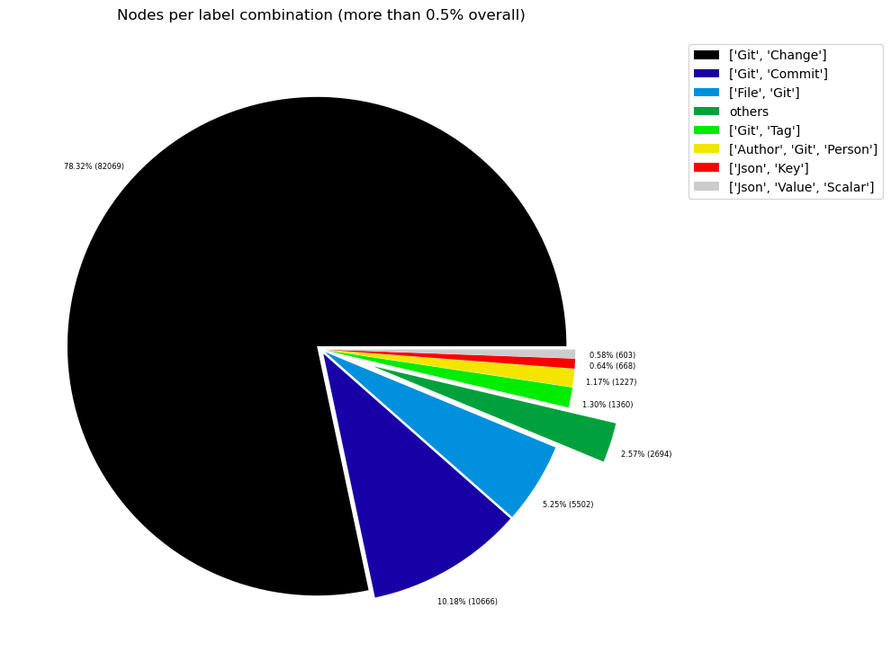
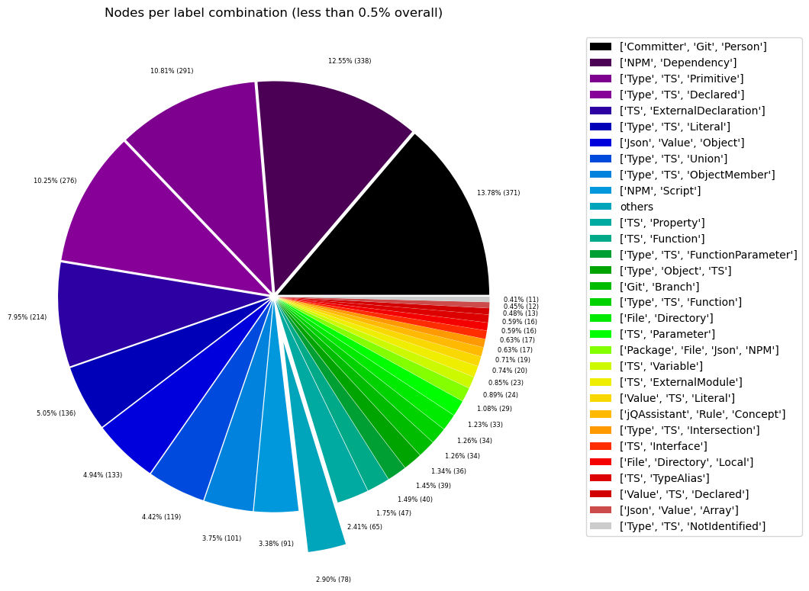
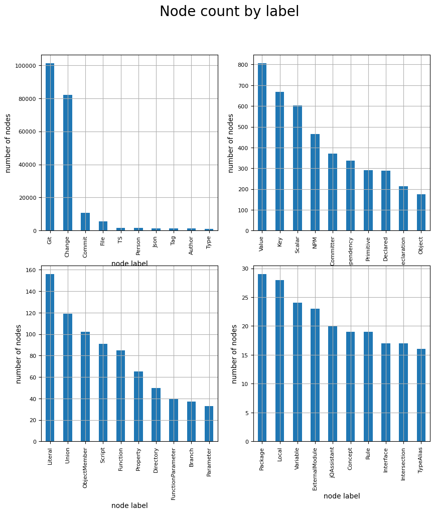
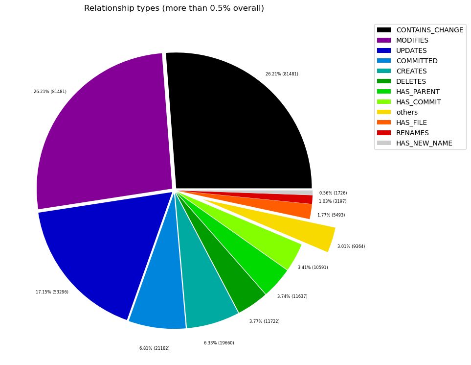

# Overview in General
   

This file contains a general overview of the data in the graph including node labels and relationships types.

### References
- [jqassistant](https://jqassistant.org)
- [Neo4j Python Driver](https://neo4j.com/docs/api/python-driver/current)

## Node Labels

### Table 1a - Highest node count by label combination

Lists the 30 label combinations with the highest number of nodes. The labels with the lowest node count are listed in table 1b.
The total list would sum up to the total number of labels (100%).

The whole table can be found in the CSV report `Node_label_combination_count`.

<table border="1" class="dataframe">
  <thead>
    <tr style="text-align: right;">
      <th></th>
      <th>nodeLabels</th>
      <th>nodesWithThatLabels</th>
      <th>nodesWithThatLabelsPercent</th>
    </tr>
  </thead>
  <tbody>
    <tr>
      <th>0</th>
      <td>[Git, Change]</td>
      <td>81564</td>
      <td>78.292922</td>
    </tr>
    <tr>
      <th>1</th>
      <td>[Git, Commit]</td>
      <td>10618</td>
      <td>10.192171</td>
    </tr>
    <tr>
      <th>2</th>
      <td>[File, Git]</td>
      <td>5497</td>
      <td>5.276546</td>
    </tr>
    <tr>
      <th>3</th>
      <td>[Git, Tag]</td>
      <td>1315</td>
      <td>1.262263</td>
    </tr>
    <tr>
      <th>4</th>
      <td>[Author, Git, Person]</td>
      <td>1221</td>
      <td>1.172032</td>
    </tr>
    <tr>
      <th>5</th>
      <td>[Json, Key]</td>
      <td>668</td>
      <td>0.641210</td>
    </tr>
    <tr>
      <th>6</th>
      <td>[Json, Value, Scalar]</td>
      <td>603</td>
      <td>0.578817</td>
    </tr>
    <tr>
      <th>7</th>
      <td>[Committer, Git, Person]</td>
      <td>371</td>
      <td>0.356121</td>
    </tr>
    <tr>
      <th>8</th>
      <td>[NPM, Dependency]</td>
      <td>338</td>
      <td>0.324445</td>
    </tr>
    <tr>
      <th>9</th>
      <td>[Type, TS, Primitive]</td>
      <td>291</td>
      <td>0.279330</td>
    </tr>
    <tr>
      <th>10</th>
      <td>[Type, TS, Declared]</td>
      <td>276</td>
      <td>0.264931</td>
    </tr>
    <tr>
      <th>11</th>
      <td>[TS, ExternalDeclaration]</td>
      <td>214</td>
      <td>0.205418</td>
    </tr>
    <tr>
      <th>12</th>
      <td>[Type, TS, Literal]</td>
      <td>136</td>
      <td>0.130546</td>
    </tr>
    <tr>
      <th>13</th>
      <td>[Json, Value, Object]</td>
      <td>133</td>
      <td>0.127666</td>
    </tr>
    <tr>
      <th>14</th>
      <td>[Type, TS, Union]</td>
      <td>119</td>
      <td>0.114228</td>
    </tr>
    <tr>
      <th>15</th>
      <td>[Type, TS, ObjectMember]</td>
      <td>101</td>
      <td>0.096949</td>
    </tr>
    <tr>
      <th>16</th>
      <td>[NPM, Script]</td>
      <td>91</td>
      <td>0.087350</td>
    </tr>
    <tr>
      <th>17</th>
      <td>[TS, Property]</td>
      <td>65</td>
      <td>0.062393</td>
    </tr>
    <tr>
      <th>18</th>
      <td>[TS, Function]</td>
      <td>47</td>
      <td>0.045115</td>
    </tr>
    <tr>
      <th>19</th>
      <td>[Type, TS, FunctionParameter]</td>
      <td>40</td>
      <td>0.038396</td>
    </tr>
    <tr>
      <th>20</th>
      <td>[Type, Object, TS]</td>
      <td>39</td>
      <td>0.037436</td>
    </tr>
    <tr>
      <th>21</th>
      <td>[Git, Branch]</td>
      <td>35</td>
      <td>0.033596</td>
    </tr>
    <tr>
      <th>22</th>
      <td>[File, Directory]</td>
      <td>34</td>
      <td>0.032636</td>
    </tr>
    <tr>
      <th>23</th>
      <td>[Type, TS, Function]</td>
      <td>34</td>
      <td>0.032636</td>
    </tr>
    <tr>
      <th>24</th>
      <td>[TS, Parameter]</td>
      <td>33</td>
      <td>0.031677</td>
    </tr>
    <tr>
      <th>25</th>
      <td>[Package, File, Json, NPM]</td>
      <td>29</td>
      <td>0.027837</td>
    </tr>
    <tr>
      <th>26</th>
      <td>[TS, Variable]</td>
      <td>24</td>
      <td>0.023037</td>
    </tr>
    <tr>
      <th>27</th>
      <td>[TS, ExternalModule]</td>
      <td>23</td>
      <td>0.022078</td>
    </tr>
    <tr>
      <th>28</th>
      <td>[Value, TS, Literal]</td>
      <td>20</td>
      <td>0.019198</td>
    </tr>
    <tr>
      <th>29</th>
      <td>[jQAssistant, Rule, Concept]</td>
      <td>19</td>
      <td>0.018238</td>
    </tr>
  </tbody>
</table>

### Chart 1a - Highest node count by label combination

Values under 0.5% will be grouped into "others" to get a cleaner plot. The group "others" is then broken down in Chart 1b.

    <Figure size 640x480 with 0 Axes>

    

    

### Table 1b - Lowest node count by label combination

Lists the 30 label combinations with the lowest number of nodes until they reach 0.5% of the total node count, which are shown above.

<table border="1" class="dataframe">
  <thead>
    <tr style="text-align: right;">
      <th></th>
      <th>nodeLabels</th>
      <th>nodesWithThatLabels</th>
      <th>nodesWithThatLabelsPercent</th>
    </tr>
  </thead>
  <tbody>
    <tr>
      <th>0</th>
      <td>[Analyze, Task, jQAssistant]</td>
      <td>1</td>
      <td>0.000960</td>
    </tr>
    <tr>
      <th>1</th>
      <td>[File, TS, Scan]</td>
      <td>1</td>
      <td>0.000960</td>
    </tr>
    <tr>
      <th>2</th>
      <td>[TS, Method]</td>
      <td>1</td>
      <td>0.000960</td>
    </tr>
    <tr>
      <th>3</th>
      <td>[Repository, File, Git]</td>
      <td>1</td>
      <td>0.000960</td>
    </tr>
    <tr>
      <th>4</th>
      <td>[TS, Constructor]</td>
      <td>1</td>
      <td>0.000960</td>
    </tr>
    <tr>
      <th>5</th>
      <td>[Value, TS, ObjectMember]</td>
      <td>1</td>
      <td>0.000960</td>
    </tr>
    <tr>
      <th>6</th>
      <td>[TS, Class]</td>
      <td>1</td>
      <td>0.000960</td>
    </tr>
    <tr>
      <th>7</th>
      <td>[TS, Enum]</td>
      <td>2</td>
      <td>0.001920</td>
    </tr>
    <tr>
      <th>8</th>
      <td>[Value, Object, TS]</td>
      <td>3</td>
      <td>0.002880</td>
    </tr>
    <tr>
      <th>9</th>
      <td>[Type, TS, Tuple]</td>
      <td>3</td>
      <td>0.002880</td>
    </tr>
    <tr>
      <th>10</th>
      <td>[Value, TS, Function]</td>
      <td>4</td>
      <td>0.003840</td>
    </tr>
    <tr>
      <th>11</th>
      <td>[TS, TypeParameter]</td>
      <td>4</td>
      <td>0.003840</td>
    </tr>
    <tr>
      <th>12</th>
      <td>[Value, TS, Complex]</td>
      <td>5</td>
      <td>0.004799</td>
    </tr>
    <tr>
      <th>13</th>
      <td>[NPM, Engine]</td>
      <td>6</td>
      <td>0.005759</td>
    </tr>
    <tr>
      <th>14</th>
      <td>[Project, TS]</td>
      <td>6</td>
      <td>0.005759</td>
    </tr>
    <tr>
      <th>15</th>
      <td>[File, Local]</td>
      <td>6</td>
      <td>0.005759</td>
    </tr>
    <tr>
      <th>16</th>
      <td>[Value, TS, Call]</td>
      <td>6</td>
      <td>0.005759</td>
    </tr>
    <tr>
      <th>17</th>
      <td>[Value, TS, Member]</td>
      <td>6</td>
      <td>0.005759</td>
    </tr>
    <tr>
      <th>18</th>
      <td>[File, TS, Local, Module]</td>
      <td>6</td>
      <td>0.005759</td>
    </tr>
    <tr>
      <th>19</th>
      <td>[Type, TS, TypeParameterReference]</td>
      <td>6</td>
      <td>0.005759</td>
    </tr>
    <tr>
      <th>20</th>
      <td>[TS, EnumMember]</td>
      <td>8</td>
      <td>0.007679</td>
    </tr>
    <tr>
      <th>21</th>
      <td>[Type, TS, NotIdentified]</td>
      <td>11</td>
      <td>0.010559</td>
    </tr>
    <tr>
      <th>22</th>
      <td>[Json, Value, Array]</td>
      <td>12</td>
      <td>0.011519</td>
    </tr>
    <tr>
      <th>23</th>
      <td>[Value, TS, Declared]</td>
      <td>13</td>
      <td>0.012479</td>
    </tr>
    <tr>
      <th>24</th>
      <td>[TS, TypeAlias]</td>
      <td>16</td>
      <td>0.015358</td>
    </tr>
    <tr>
      <th>25</th>
      <td>[File, Directory, Local]</td>
      <td>16</td>
      <td>0.015358</td>
    </tr>
    <tr>
      <th>26</th>
      <td>[TS, Interface]</td>
      <td>17</td>
      <td>0.016318</td>
    </tr>
    <tr>
      <th>27</th>
      <td>[Type, TS, Intersection]</td>
      <td>17</td>
      <td>0.016318</td>
    </tr>
    <tr>
      <th>28</th>
      <td>[jQAssistant, Rule, Concept]</td>
      <td>19</td>
      <td>0.018238</td>
    </tr>
    <tr>
      <th>29</th>
      <td>[Value, TS, Literal]</td>
      <td>20</td>
      <td>0.019198</td>
    </tr>
  </tbody>
</table>

### Chart 1b - Lowest node count by label combination

Shows the lowest (less than 0.5% overall) node count label combinations. Therefore, this plot breaks down the "others" slice of the pie chart above. Values under 0.01% will be grouped into "others" to get a cleaner plot.

    <Figure size 640x480 with 0 Axes>

    

    

### Table 1c - Highest node count by single label

Lists the 40 labels with the highest number of nodes.
Doesn't sum up to the total number of nodes or 100% because one node can have multiple labels.
Helps to identify commonly used labels.

<table border="1" class="dataframe">
  <thead>
    <tr style="text-align: right;">
      <th></th>
      <th>nodeLabel</th>
      <th>nodesWithThatLabel</th>
      <th>nodesWithThatLabelPercent</th>
    </tr>
  </thead>
  <tbody>
    <tr>
      <th>0</th>
      <td>Git</td>
      <td>100622</td>
      <td>96.586611</td>
    </tr>
    <tr>
      <th>1</th>
      <td>Change</td>
      <td>81564</td>
      <td>78.292922</td>
    </tr>
    <tr>
      <th>2</th>
      <td>Commit</td>
      <td>10618</td>
      <td>10.192171</td>
    </tr>
    <tr>
      <th>3</th>
      <td>File</td>
      <td>5590</td>
      <td>5.365816</td>
    </tr>
    <tr>
      <th>4</th>
      <td>TS</td>
      <td>1600</td>
      <td>1.535833</td>
    </tr>
    <tr>
      <th>5</th>
      <td>Person</td>
      <td>1592</td>
      <td>1.528154</td>
    </tr>
    <tr>
      <th>6</th>
      <td>Json</td>
      <td>1445</td>
      <td>1.387049</td>
    </tr>
    <tr>
      <th>7</th>
      <td>Tag</td>
      <td>1315</td>
      <td>1.262263</td>
    </tr>
    <tr>
      <th>8</th>
      <td>Author</td>
      <td>1221</td>
      <td>1.172032</td>
    </tr>
    <tr>
      <th>9</th>
      <td>Type</td>
      <td>1073</td>
      <td>1.029968</td>
    </tr>
    <tr>
      <th>10</th>
      <td>Value</td>
      <td>806</td>
      <td>0.773676</td>
    </tr>
    <tr>
      <th>11</th>
      <td>Key</td>
      <td>668</td>
      <td>0.641210</td>
    </tr>
    <tr>
      <th>12</th>
      <td>Scalar</td>
      <td>603</td>
      <td>0.578817</td>
    </tr>
    <tr>
      <th>13</th>
      <td>NPM</td>
      <td>464</td>
      <td>0.445392</td>
    </tr>
    <tr>
      <th>14</th>
      <td>Committer</td>
      <td>371</td>
      <td>0.356121</td>
    </tr>
    <tr>
      <th>15</th>
      <td>Dependency</td>
      <td>338</td>
      <td>0.324445</td>
    </tr>
    <tr>
      <th>16</th>
      <td>Primitive</td>
      <td>291</td>
      <td>0.279330</td>
    </tr>
    <tr>
      <th>17</th>
      <td>Declared</td>
      <td>289</td>
      <td>0.277410</td>
    </tr>
    <tr>
      <th>18</th>
      <td>ExternalDeclaration</td>
      <td>214</td>
      <td>0.205418</td>
    </tr>
    <tr>
      <th>19</th>
      <td>Object</td>
      <td>175</td>
      <td>0.167982</td>
    </tr>
    <tr>
      <th>20</th>
      <td>Literal</td>
      <td>156</td>
      <td>0.149744</td>
    </tr>
    <tr>
      <th>21</th>
      <td>Union</td>
      <td>119</td>
      <td>0.114228</td>
    </tr>
    <tr>
      <th>22</th>
      <td>ObjectMember</td>
      <td>102</td>
      <td>0.097909</td>
    </tr>
    <tr>
      <th>23</th>
      <td>Script</td>
      <td>91</td>
      <td>0.087350</td>
    </tr>
    <tr>
      <th>24</th>
      <td>Function</td>
      <td>85</td>
      <td>0.081591</td>
    </tr>
    <tr>
      <th>25</th>
      <td>Property</td>
      <td>65</td>
      <td>0.062393</td>
    </tr>
    <tr>
      <th>26</th>
      <td>Directory</td>
      <td>50</td>
      <td>0.047995</td>
    </tr>
    <tr>
      <th>27</th>
      <td>FunctionParameter</td>
      <td>40</td>
      <td>0.038396</td>
    </tr>
    <tr>
      <th>28</th>
      <td>Branch</td>
      <td>35</td>
      <td>0.033596</td>
    </tr>
    <tr>
      <th>29</th>
      <td>Parameter</td>
      <td>33</td>
      <td>0.031677</td>
    </tr>
    <tr>
      <th>30</th>
      <td>Package</td>
      <td>29</td>
      <td>0.027837</td>
    </tr>
    <tr>
      <th>31</th>
      <td>Local</td>
      <td>28</td>
      <td>0.026877</td>
    </tr>
    <tr>
      <th>32</th>
      <td>Variable</td>
      <td>24</td>
      <td>0.023037</td>
    </tr>
    <tr>
      <th>33</th>
      <td>ExternalModule</td>
      <td>23</td>
      <td>0.022078</td>
    </tr>
    <tr>
      <th>34</th>
      <td>jQAssistant</td>
      <td>20</td>
      <td>0.019198</td>
    </tr>
    <tr>
      <th>35</th>
      <td>Concept</td>
      <td>19</td>
      <td>0.018238</td>
    </tr>
    <tr>
      <th>36</th>
      <td>Rule</td>
      <td>19</td>
      <td>0.018238</td>
    </tr>
    <tr>
      <th>37</th>
      <td>Interface</td>
      <td>17</td>
      <td>0.016318</td>
    </tr>
    <tr>
      <th>38</th>
      <td>Intersection</td>
      <td>17</td>
      <td>0.016318</td>
    </tr>
    <tr>
      <th>39</th>
      <td>TypeAlias</td>
      <td>16</td>
      <td>0.015358</td>
    </tr>
  </tbody>
</table>

### Chart 1c - Highest node count by label

Shows the 40 labels with the highest number of nodes.

    <Figure size 640x480 with 0 Axes>

    

    

## Relationship Types

### Table 2a - Highest relationship count by type

Lists the 30 relationship types with the highest number of occurrences.
The whole table can be found in the CSV report `Relationship_type_count`.

    Total number of relationships: 311202

<table border="1" class="dataframe">
  <thead>
    <tr style="text-align: right;">
      <th></th>
      <th>relationshipType</th>
      <th>nodesWithThatRelationshipType</th>
      <th>nodesWithThatRelationshipTypePercent</th>
    </tr>
  </thead>
  <tbody>
    <tr>
      <th>0</th>
      <td>CONTAINS_CHANGE</td>
      <td>81564</td>
      <td>26.209343</td>
    </tr>
    <tr>
      <th>1</th>
      <td>MODIFIES</td>
      <td>81564</td>
      <td>26.209343</td>
    </tr>
    <tr>
      <th>2</th>
      <td>UPDATES</td>
      <td>53374</td>
      <td>17.150918</td>
    </tr>
    <tr>
      <th>3</th>
      <td>COMMITTED</td>
      <td>21236</td>
      <td>6.823864</td>
    </tr>
    <tr>
      <th>4</th>
      <td>CREATES</td>
      <td>19664</td>
      <td>6.318725</td>
    </tr>
    <tr>
      <th>5</th>
      <td>DELETES</td>
      <td>11723</td>
      <td>3.767007</td>
    </tr>
    <tr>
      <th>6</th>
      <td>HAS_PARENT</td>
      <td>11664</td>
      <td>3.748048</td>
    </tr>
    <tr>
      <th>7</th>
      <td>HAS_COMMIT</td>
      <td>10618</td>
      <td>3.411932</td>
    </tr>
    <tr>
      <th>8</th>
      <td>HAS_FILE</td>
      <td>5497</td>
      <td>1.766377</td>
    </tr>
    <tr>
      <th>9</th>
      <td>RENAMES</td>
      <td>3197</td>
      <td>1.027307</td>
    </tr>
    <tr>
      <th>10</th>
      <td>HAS_NEW_NAME</td>
      <td>1726</td>
      <td>0.554624</td>
    </tr>
    <tr>
      <th>11</th>
      <td>HAS_TAG</td>
      <td>1315</td>
      <td>0.422555</td>
    </tr>
    <tr>
      <th>12</th>
      <td>ON_COMMIT</td>
      <td>1315</td>
      <td>0.422555</td>
    </tr>
    <tr>
      <th>13</th>
      <td>HAS_AUTHOR</td>
      <td>1221</td>
      <td>0.392350</td>
    </tr>
    <tr>
      <th>14</th>
      <td>DEPENDS_ON</td>
      <td>961</td>
      <td>0.308803</td>
    </tr>
    <tr>
      <th>15</th>
      <td>HAS_KEY</td>
      <td>668</td>
      <td>0.214652</td>
    </tr>
    <tr>
      <th>16</th>
      <td>HAS_VALUE</td>
      <td>668</td>
      <td>0.214652</td>
    </tr>
    <tr>
      <th>17</th>
      <td>CONTAINS</td>
      <td>594</td>
      <td>0.190873</td>
    </tr>
    <tr>
      <th>18</th>
      <td>HAS_COMMITTER</td>
      <td>371</td>
      <td>0.119215</td>
    </tr>
    <tr>
      <th>19</th>
      <td>OF_TYPE</td>
      <td>337</td>
      <td>0.108290</td>
    </tr>
    <tr>
      <th>20</th>
      <td>EXPORTS</td>
      <td>283</td>
      <td>0.090938</td>
    </tr>
    <tr>
      <th>21</th>
      <td>REFERENCES</td>
      <td>197</td>
      <td>0.063303</td>
    </tr>
    <tr>
      <th>22</th>
      <td>DECLARES</td>
      <td>186</td>
      <td>0.059768</td>
    </tr>
    <tr>
      <th>23</th>
      <td>DECLARES_DEV_DEPENDENCY</td>
      <td>169</td>
      <td>0.054306</td>
    </tr>
    <tr>
      <th>24</th>
      <td>DECLARES_DEPENDENCY</td>
      <td>161</td>
      <td>0.051735</td>
    </tr>
    <tr>
      <th>25</th>
      <td>HAS_MEMBER</td>
      <td>102</td>
      <td>0.032776</td>
    </tr>
    <tr>
      <th>26</th>
      <td>HAS_TYPE_ARGUMENT</td>
      <td>94</td>
      <td>0.030205</td>
    </tr>
    <tr>
      <th>27</th>
      <td>DECLARES_SCRIPT</td>
      <td>91</td>
      <td>0.029241</td>
    </tr>
    <tr>
      <th>28</th>
      <td>RETURNS</td>
      <td>82</td>
      <td>0.026349</td>
    </tr>
    <tr>
      <th>29</th>
      <td>HAS_PARAMETER</td>
      <td>73</td>
      <td>0.023457</td>
    </tr>
  </tbody>
</table>

### Chart 2a - Highest relationship count by type

Values under 0.5% will be grouped into "others" to get a cleaner plot. The group "others" is then broken down in the second chart.

    <Figure size 640x480 with 0 Axes>

    

    

### Table 2b - Lowest relationship count by type

Lists the 30 relationships type with the lowest number of occurrences up to 0.5% of the total node count. This is essentially breaking down the "others" slice from the chart above.

<table border="1" class="dataframe">
  <thead>
    <tr style="text-align: right;">
      <th></th>
      <th>relationshipType</th>
      <th>nodesWithThatRelationshipType</th>
      <th>nodesWithThatRelationshipTypePercent</th>
    </tr>
  </thead>
  <tbody>
    <tr>
      <th>0</th>
      <td>PROVIDED_BY_NPM_DEPENDENCY</td>
      <td>1</td>
      <td>0.000321</td>
    </tr>
    <tr>
      <th>1</th>
      <td>IS_IMPLEMENTED_IN</td>
      <td>2</td>
      <td>0.000643</td>
    </tr>
    <tr>
      <th>2</th>
      <td>CONSTRAINED_BY</td>
      <td>4</td>
      <td>0.001285</td>
    </tr>
    <tr>
      <th>3</th>
      <td>REFERENCED_PROJECTS</td>
      <td>5</td>
      <td>0.001607</td>
    </tr>
    <tr>
      <th>4</th>
      <td>CONTAINS_PROJECT</td>
      <td>6</td>
      <td>0.001928</td>
    </tr>
    <tr>
      <th>5</th>
      <td>DECLARES_ENGINE</td>
      <td>6</td>
      <td>0.001928</td>
    </tr>
    <tr>
      <th>6</th>
      <td>EXTENDS</td>
      <td>6</td>
      <td>0.001928</td>
    </tr>
    <tr>
      <th>7</th>
      <td>HAS_ARGUMENT</td>
      <td>6</td>
      <td>0.001928</td>
    </tr>
    <tr>
      <th>8</th>
      <td>CALLS</td>
      <td>6</td>
      <td>0.001928</td>
    </tr>
    <tr>
      <th>9</th>
      <td>HAS_NPM_PACKAGE</td>
      <td>6</td>
      <td>0.001928</td>
    </tr>
    <tr>
      <th>10</th>
      <td>HAS_ROOT</td>
      <td>6</td>
      <td>0.001928</td>
    </tr>
    <tr>
      <th>11</th>
      <td>MEMBER</td>
      <td>6</td>
      <td>0.001928</td>
    </tr>
    <tr>
      <th>12</th>
      <td>PARENT</td>
      <td>6</td>
      <td>0.001928</td>
    </tr>
    <tr>
      <th>13</th>
      <td>HAS_CONFIG</td>
      <td>6</td>
      <td>0.001928</td>
    </tr>
    <tr>
      <th>14</th>
      <td>SIMILAR</td>
      <td>6</td>
      <td>0.001928</td>
    </tr>
    <tr>
      <th>15</th>
      <td>DECLARES_PEER_DEPENDENCY</td>
      <td>8</td>
      <td>0.002571</td>
    </tr>
    <tr>
      <th>16</th>
      <td>INCLUDES_CONCEPT</td>
      <td>19</td>
      <td>0.006105</td>
    </tr>
    <tr>
      <th>17</th>
      <td>USES</td>
      <td>23</td>
      <td>0.007391</td>
    </tr>
    <tr>
      <th>18</th>
      <td>REQUIRES_CONCEPT</td>
      <td>28</td>
      <td>0.008997</td>
    </tr>
    <tr>
      <th>19</th>
      <td>INITIALIZED_WITH</td>
      <td>32</td>
      <td>0.010283</td>
    </tr>
    <tr>
      <th>20</th>
      <td>IS_DESCRIBED_IN_NPM_PACKAGE</td>
      <td>33</td>
      <td>0.010604</td>
    </tr>
    <tr>
      <th>21</th>
      <td>HAS_BRANCH</td>
      <td>35</td>
      <td>0.011247</td>
    </tr>
    <tr>
      <th>22</th>
      <td>HAS_HEAD</td>
      <td>36</td>
      <td>0.011568</td>
    </tr>
    <tr>
      <th>23</th>
      <td>COPY_OF</td>
      <td>37</td>
      <td>0.011889</td>
    </tr>
    <tr>
      <th>24</th>
      <td>RESOLVES_TO</td>
      <td>41</td>
      <td>0.013175</td>
    </tr>
    <tr>
      <th>25</th>
      <td>CONTAINS_VALUE</td>
      <td>51</td>
      <td>0.016388</td>
    </tr>
    <tr>
      <th>26</th>
      <td>COPIES</td>
      <td>66</td>
      <td>0.021208</td>
    </tr>
    <tr>
      <th>27</th>
      <td>HAS_PARAMETER</td>
      <td>73</td>
      <td>0.023457</td>
    </tr>
    <tr>
      <th>28</th>
      <td>RETURNS</td>
      <td>82</td>
      <td>0.026349</td>
    </tr>
    <tr>
      <th>29</th>
      <td>DECLARES_SCRIPT</td>
      <td>91</td>
      <td>0.029241</td>
    </tr>
  </tbody>
</table>

### Chart 2b - Lowest relationship count by type

Shows the lowest (less than 0.5% overall) relationship types. This plot breaks down the "others" slice of the pie chart above. Values under 0.01% will be grouped into "others" to get a cleaner plot.

    <Figure size 640x480 with 0 Axes>

    

    

## Node labels with their relationships

### Table 3a - Highest relationship count by node labels and relationship type

Lists the 30 node labels and their relationship types with the highest number of occurrences.

<table border="1" class="dataframe">
  <thead>
    <tr style="text-align: right;">
      <th></th>
      <th>sourceLabels</th>
      <th>relationType</th>
      <th>targetLabels</th>
      <th>numberOfRelationships</th>
      <th>numberOfNodesWithSameLabelsAsSource</th>
      <th>numberOfNodesWithSameLabelsAsTarget</th>
      <th>densityInPercent</th>
    </tr>
  </thead>
  <tbody>
    <tr>
      <th>0</th>
      <td>[Git, Change]</td>
      <td>MODIFIES</td>
      <td>[File, Git]</td>
      <td>81564</td>
      <td>81564</td>
      <td>5497</td>
      <td>0.018192</td>
    </tr>
    <tr>
      <th>1</th>
      <td>[Git, Commit]</td>
      <td>CONTAINS_CHANGE</td>
      <td>[Git, Change]</td>
      <td>81564</td>
      <td>10618</td>
      <td>81564</td>
      <td>0.009418</td>
    </tr>
    <tr>
      <th>2</th>
      <td>[Git, Change]</td>
      <td>UPDATES</td>
      <td>[File, Git]</td>
      <td>53374</td>
      <td>81564</td>
      <td>5497</td>
      <td>0.011904</td>
    </tr>
    <tr>
      <th>3</th>
      <td>[Git, Change]</td>
      <td>CREATES</td>
      <td>[File, Git]</td>
      <td>19664</td>
      <td>81564</td>
      <td>5497</td>
      <td>0.004386</td>
    </tr>
    <tr>
      <th>4</th>
      <td>[Git, Change]</td>
      <td>DELETES</td>
      <td>[File, Git]</td>
      <td>11723</td>
      <td>81564</td>
      <td>5497</td>
      <td>0.002615</td>
    </tr>
    <tr>
      <th>5</th>
      <td>[Git, Commit]</td>
      <td>HAS_PARENT</td>
      <td>[Git, Commit]</td>
      <td>11664</td>
      <td>10618</td>
      <td>10618</td>
      <td>0.010346</td>
    </tr>
    <tr>
      <th>6</th>
      <td>[Repository, File, Git]</td>
      <td>HAS_COMMIT</td>
      <td>[Git, Commit]</td>
      <td>10618</td>
      <td>1</td>
      <td>10618</td>
      <td>100.000000</td>
    </tr>
    <tr>
      <th>7</th>
      <td>[Author, Git, Person]</td>
      <td>COMMITTED</td>
      <td>[Git, Commit]</td>
      <td>10618</td>
      <td>1221</td>
      <td>10618</td>
      <td>0.081900</td>
    </tr>
    <tr>
      <th>8</th>
      <td>[Committer, Git, Person]</td>
      <td>COMMITTED</td>
      <td>[Git, Commit]</td>
      <td>10618</td>
      <td>371</td>
      <td>10618</td>
      <td>0.269542</td>
    </tr>
    <tr>
      <th>9</th>
      <td>[Repository, File, Git]</td>
      <td>HAS_FILE</td>
      <td>[File, Git]</td>
      <td>5497</td>
      <td>1</td>
      <td>5497</td>
      <td>100.000000</td>
    </tr>
    <tr>
      <th>10</th>
      <td>[Git, Change]</td>
      <td>RENAMES</td>
      <td>[File, Git]</td>
      <td>3197</td>
      <td>81564</td>
      <td>5497</td>
      <td>0.000713</td>
    </tr>
    <tr>
      <th>11</th>
      <td>[File, Git]</td>
      <td>HAS_NEW_NAME</td>
      <td>[File, Git]</td>
      <td>1726</td>
      <td>5497</td>
      <td>5497</td>
      <td>0.005712</td>
    </tr>
    <tr>
      <th>12</th>
      <td>[Repository, File, Git]</td>
      <td>HAS_TAG</td>
      <td>[Git, Tag]</td>
      <td>1315</td>
      <td>1</td>
      <td>1315</td>
      <td>100.000000</td>
    </tr>
    <tr>
      <th>13</th>
      <td>[Git, Tag]</td>
      <td>ON_COMMIT</td>
      <td>[Git, Commit]</td>
      <td>1315</td>
      <td>1315</td>
      <td>10618</td>
      <td>0.009418</td>
    </tr>
    <tr>
      <th>14</th>
      <td>[Repository, File, Git]</td>
      <td>HAS_AUTHOR</td>
      <td>[Author, Git, Person]</td>
      <td>1221</td>
      <td>1</td>
      <td>1221</td>
      <td>100.000000</td>
    </tr>
    <tr>
      <th>15</th>
      <td>[Json, Value, Object]</td>
      <td>HAS_KEY</td>
      <td>[Json, Key]</td>
      <td>668</td>
      <td>133</td>
      <td>668</td>
      <td>0.751880</td>
    </tr>
    <tr>
      <th>16</th>
      <td>[Json, Key]</td>
      <td>HAS_VALUE</td>
      <td>[Json, Value, Scalar]</td>
      <td>552</td>
      <td>668</td>
      <td>603</td>
      <td>0.137039</td>
    </tr>
    <tr>
      <th>17</th>
      <td>[Repository, File, Git]</td>
      <td>HAS_COMMITTER</td>
      <td>[Committer, Git, Person]</td>
      <td>371</td>
      <td>1</td>
      <td>371</td>
      <td>100.000000</td>
    </tr>
    <tr>
      <th>18</th>
      <td>[TS, Function]</td>
      <td>DEPENDS_ON</td>
      <td>[TS, ExternalDeclaration]</td>
      <td>289</td>
      <td>47</td>
      <td>214</td>
      <td>2.873335</td>
    </tr>
    <tr>
      <th>19</th>
      <td>[File, TS, Local, Module, Mark4ModuleWeaklyCon...</td>
      <td>DEPENDS_ON</td>
      <td>[TS, ExternalDeclaration]</td>
      <td>232</td>
      <td>4</td>
      <td>214</td>
      <td>27.102804</td>
    </tr>
    <tr>
      <th>20</th>
      <td>[TS, ExternalModule]</td>
      <td>EXPORTS</td>
      <td>[TS, ExternalDeclaration]</td>
      <td>214</td>
      <td>23</td>
      <td>214</td>
      <td>4.347826</td>
    </tr>
    <tr>
      <th>21</th>
      <td>[Package, File, Json, NPM]</td>
      <td>DECLARES_DEV_DEPENDENCY</td>
      <td>[NPM, Dependency]</td>
      <td>169</td>
      <td>29</td>
      <td>338</td>
      <td>1.724138</td>
    </tr>
    <tr>
      <th>22</th>
      <td>[Package, File, Json, NPM]</td>
      <td>DECLARES_DEPENDENCY</td>
      <td>[NPM, Dependency]</td>
      <td>161</td>
      <td>29</td>
      <td>338</td>
      <td>1.642522</td>
    </tr>
    <tr>
      <th>23</th>
      <td>[Type, TS, Union]</td>
      <td>CONTAINS</td>
      <td>[Type, TS, Primitive]</td>
      <td>147</td>
      <td>119</td>
      <td>291</td>
      <td>0.424500</td>
    </tr>
    <tr>
      <th>24</th>
      <td>[Type, TS, Declared]</td>
      <td>REFERENCES</td>
      <td>[TS, ExternalDeclaration]</td>
      <td>142</td>
      <td>276</td>
      <td>214</td>
      <td>0.240417</td>
    </tr>
    <tr>
      <th>25</th>
      <td>[TS, Function]</td>
      <td>DEPENDS_ON</td>
      <td>[TS, ExternalModule]</td>
      <td>132</td>
      <td>47</td>
      <td>23</td>
      <td>12.210916</td>
    </tr>
    <tr>
      <th>26</th>
      <td>[Type, TS, Union]</td>
      <td>CONTAINS</td>
      <td>[Type, TS, Literal]</td>
      <td>119</td>
      <td>119</td>
      <td>136</td>
      <td>0.735294</td>
    </tr>
    <tr>
      <th>27</th>
      <td>[Json, Key]</td>
      <td>HAS_VALUE</td>
      <td>[Json, Value, Object]</td>
      <td>104</td>
      <td>668</td>
      <td>133</td>
      <td>0.117059</td>
    </tr>
    <tr>
      <th>28</th>
      <td>[Type, Object, TS]</td>
      <td>HAS_MEMBER</td>
      <td>[Type, TS, ObjectMember]</td>
      <td>101</td>
      <td>39</td>
      <td>101</td>
      <td>2.564103</td>
    </tr>
    <tr>
      <th>29</th>
      <td>[Package, File, Json, NPM]</td>
      <td>DECLARES_SCRIPT</td>
      <td>[NPM, Script]</td>
      <td>91</td>
      <td>29</td>
      <td>91</td>
      <td>3.448276</td>
    </tr>
  </tbody>
</table>

## Graph Density

    total_number_of_nodes (vertices): 104178
    total_number_of_relationships (edges): 311202
    -> total directed graph density: 2.8674411732877783e-05
    -> total directed graph density in percent: 0.0028674411732877783

