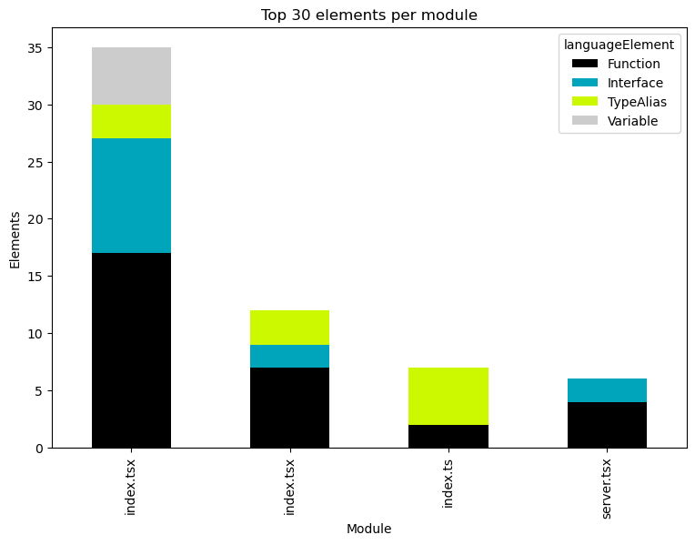
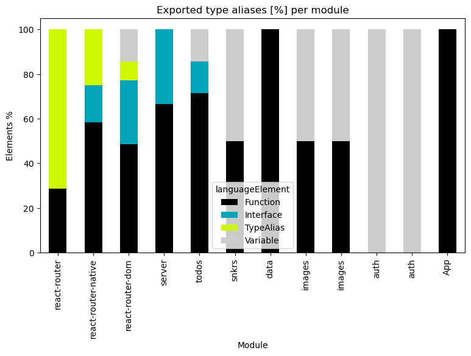
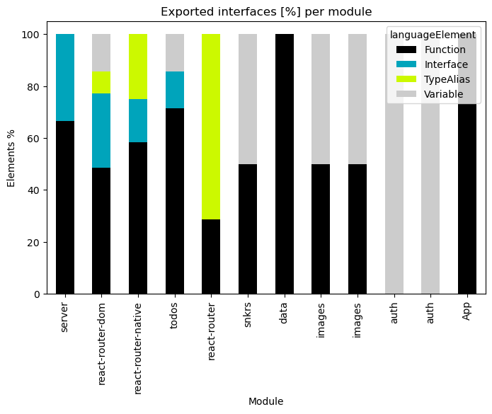
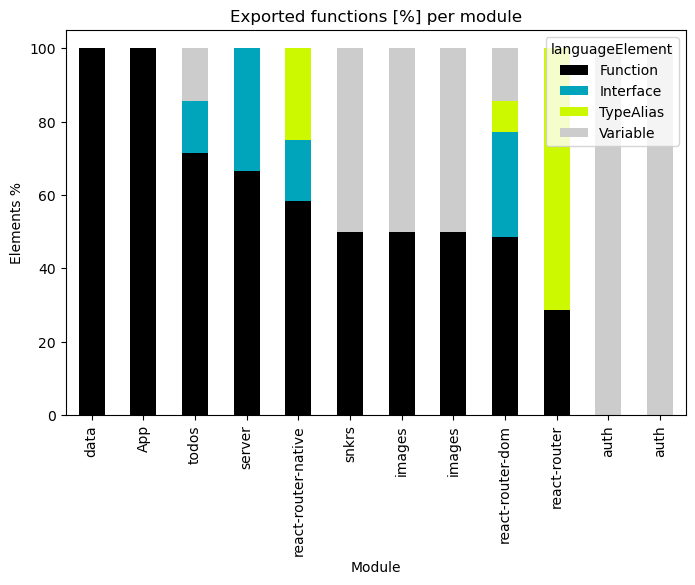

# Overview for Typescript

   

### References
- [jqassistant](https://jqassistant.org)
- [Neo4j Python Driver](https://neo4j.com/docs/api/python-driver/current)

## Overview

### Table 1 - Size

<table border="1" class="dataframe">
  <thead>
    <tr style="text-align: right;">
      <th></th>
      <th>nodeCount</th>
      <th>relationshipCount</th>
      <th>projectCount</th>
      <th>moduleCount</th>
      <th>functionCount</th>
      <th>objectCount</th>
      <th>typeAliasCount</th>
      <th>interfaceCount</th>
      <th>classCount</th>
      <th>methodCount</th>
    </tr>
  </thead>
  <tbody>
    <tr>
      <th>0</th>
      <td>6006</td>
      <td>8796</td>
      <td>33</td>
      <td>46</td>
      <td>192</td>
      <td>137</td>
      <td>32</td>
      <td>37</td>
      <td>2</td>
      <td>4</td>
    </tr>
  </tbody>
</table>

## Modules

### Table 2a - Largest 30 elements per module

This table shows the largest (number of elements) modules and their kind of elements (Interface, TypeAlias, Variable).
The whole table can be found in the CSV report `Number_of_elements_per_module_for_Typescript`.

<table border="1" class="dataframe">
  <thead>
    <tr style="text-align: right;">
      <th></th>
      <th>moduleName</th>
      <th>modulePath</th>
      <th>numberOfModuleElements</th>
      <th>languageElement</th>
      <th>numberOfElements</th>
    </tr>
  </thead>
  <tbody>
    <tr>
      <th>0</th>
      <td>react-router-dom</td>
      <td>index.tsx</td>
      <td>124</td>
      <td>Variable</td>
      <td>10</td>
    </tr>
    <tr>
      <th>1</th>
      <td>react-router-dom</td>
      <td>index.tsx</td>
      <td>124</td>
      <td>Interface</td>
      <td>20</td>
    </tr>
    <tr>
      <th>2</th>
      <td>react-router-dom</td>
      <td>index.tsx</td>
      <td>124</td>
      <td>Function</td>
      <td>34</td>
    </tr>
    <tr>
      <th>3</th>
      <td>react-router-dom</td>
      <td>index.tsx</td>
      <td>124</td>
      <td>TypeAlias</td>
      <td>6</td>
    </tr>
    <tr>
      <th>4</th>
      <td>react-router-native</td>
      <td>index.tsx</td>
      <td>34</td>
      <td>Interface</td>
      <td>4</td>
    </tr>
    <tr>
      <th>5</th>
      <td>react-router-native</td>
      <td>index.tsx</td>
      <td>34</td>
      <td>Function</td>
      <td>14</td>
    </tr>
    <tr>
      <th>6</th>
      <td>react-router-native</td>
      <td>index.tsx</td>
      <td>34</td>
      <td>TypeAlias</td>
      <td>6</td>
    </tr>
    <tr>
      <th>7</th>
      <td>react-router</td>
      <td>index.ts</td>
      <td>14</td>
      <td>Function</td>
      <td>4</td>
    </tr>
    <tr>
      <th>8</th>
      <td>react-router</td>
      <td>index.ts</td>
      <td>14</td>
      <td>TypeAlias</td>
      <td>10</td>
    </tr>
    <tr>
      <th>9</th>
      <td>server</td>
      <td>server.tsx</td>
      <td>12</td>
      <td>Function</td>
      <td>8</td>
    </tr>
    <tr>
      <th>10</th>
      <td>server</td>
      <td>server.tsx</td>
      <td>12</td>
      <td>Interface</td>
      <td>4</td>
    </tr>
    <tr>
      <th>11</th>
      <td>todos</td>
      <td>src/todos.ts</td>
      <td>7</td>
      <td>Function</td>
      <td>5</td>
    </tr>
    <tr>
      <th>12</th>
      <td>todos</td>
      <td>src/todos.ts</td>
      <td>7</td>
      <td>Variable</td>
      <td>1</td>
    </tr>
    <tr>
      <th>13</th>
      <td>todos</td>
      <td>src/todos.ts</td>
      <td>7</td>
      <td>Interface</td>
      <td>1</td>
    </tr>
    <tr>
      <th>14</th>
      <td>snkrs</td>
      <td>src/snkrs.ts</td>
      <td>4</td>
      <td>Variable</td>
      <td>2</td>
    </tr>
    <tr>
      <th>15</th>
      <td>snkrs</td>
      <td>src/snkrs.ts</td>
      <td>4</td>
      <td>Function</td>
      <td>2</td>
    </tr>
    <tr>
      <th>16</th>
      <td>data</td>
      <td>src/data.js</td>
      <td>3</td>
      <td>Function</td>
      <td>3</td>
    </tr>
    <tr>
      <th>17</th>
      <td>images</td>
      <td>src/images.ts</td>
      <td>2</td>
      <td>Function</td>
      <td>1</td>
    </tr>
    <tr>
      <th>18</th>
      <td>images</td>
      <td>src/images.ts</td>
      <td>2</td>
      <td>Variable</td>
      <td>1</td>
    </tr>
    <tr>
      <th>19</th>
      <td>images</td>
      <td>src/images.ts</td>
      <td>2</td>
      <td>Function</td>
      <td>1</td>
    </tr>
    <tr>
      <th>20</th>
      <td>images</td>
      <td>src/images.ts</td>
      <td>2</td>
      <td>Variable</td>
      <td>1</td>
    </tr>
    <tr>
      <th>21</th>
      <td>App</td>
      <td>src/App.jsx</td>
      <td>1</td>
      <td>Function</td>
      <td>1</td>
    </tr>
    <tr>
      <th>22</th>
      <td>auth</td>
      <td>src/auth.ts</td>
      <td>1</td>
      <td>Variable</td>
      <td>1</td>
    </tr>
    <tr>
      <th>23</th>
      <td>auth</td>
      <td>src/auth.ts</td>
      <td>1</td>
      <td>Variable</td>
      <td>1</td>
    </tr>
  </tbody>
</table>

### Table 2b - Largest 30 elements per module grouped

This table shows the largest (number of elements) modules each in one row, their kind of elements in columns and the count of them as values.

The source data for this aggregated table can be found in the CSV report `Number_of_elements_per_module_for_Typescript`.

<table border="1" class="dataframe">
  <thead>
    <tr style="text-align: right;">
      <th>languageElement</th>
      <th>modulePath</th>
      <th>moduleName</th>
      <th>Function</th>
      <th>Interface</th>
      <th>TypeAlias</th>
      <th>Variable</th>
    </tr>
  </thead>
  <tbody>
    <tr>
      <th>0</th>
      <td>index.tsx</td>
      <td>react-router-dom</td>
      <td>34</td>
      <td>20</td>
      <td>6</td>
      <td>10</td>
    </tr>
    <tr>
      <th>1</th>
      <td>index.tsx</td>
      <td>react-router-native</td>
      <td>14</td>
      <td>4</td>
      <td>6</td>
      <td>0</td>
    </tr>
    <tr>
      <th>2</th>
      <td>index.ts</td>
      <td>react-router</td>
      <td>4</td>
      <td>0</td>
      <td>10</td>
      <td>0</td>
    </tr>
    <tr>
      <th>3</th>
      <td>server.tsx</td>
      <td>server</td>
      <td>8</td>
      <td>4</td>
      <td>0</td>
      <td>0</td>
    </tr>
    <tr>
      <th>4</th>
      <td>src/todos.ts</td>
      <td>todos</td>
      <td>5</td>
      <td>1</td>
      <td>0</td>
      <td>1</td>
    </tr>
    <tr>
      <th>5</th>
      <td>src/snkrs.ts</td>
      <td>snkrs</td>
      <td>2</td>
      <td>0</td>
      <td>0</td>
      <td>2</td>
    </tr>
    <tr>
      <th>6</th>
      <td>src/data.js</td>
      <td>data</td>
      <td>3</td>
      <td>0</td>
      <td>0</td>
      <td>0</td>
    </tr>
    <tr>
      <th>7</th>
      <td>src/images.ts</td>
      <td>images</td>
      <td>1</td>
      <td>0</td>
      <td>0</td>
      <td>1</td>
    </tr>
    <tr>
      <th>8</th>
      <td>src/images.ts</td>
      <td>images</td>
      <td>1</td>
      <td>0</td>
      <td>0</td>
      <td>1</td>
    </tr>
    <tr>
      <th>9</th>
      <td>src/auth.ts</td>
      <td>auth</td>
      <td>0</td>
      <td>0</td>
      <td>0</td>
      <td>1</td>
    </tr>
    <tr>
      <th>10</th>
      <td>src/auth.ts</td>
      <td>auth</td>
      <td>0</td>
      <td>0</td>
      <td>0</td>
      <td>1</td>
    </tr>
    <tr>
      <th>11</th>
      <td>src/App.jsx</td>
      <td>App</td>
      <td>1</td>
      <td>0</td>
      <td>0</td>
      <td>0</td>
    </tr>
  </tbody>
</table>

### Table 2b Chart 1 - 30 largest modules and their elements stacked

    <Figure size 640x480 with 0 Axes>

    

    

### Table 2c - 30 highest element count per module (grouped and normalized in %)

<table border="1" class="dataframe">
  <thead>
    <tr style="text-align: right;">
      <th>languageElement</th>
      <th>modulePath</th>
      <th>moduleName</th>
      <th>Function</th>
      <th>Interface</th>
      <th>TypeAlias</th>
      <th>Variable</th>
    </tr>
  </thead>
  <tbody>
    <tr>
      <th>0</th>
      <td>index.tsx</td>
      <td>react-router-dom</td>
      <td>48.571429</td>
      <td>28.571429</td>
      <td>8.571429</td>
      <td>14.285714</td>
    </tr>
    <tr>
      <th>1</th>
      <td>index.tsx</td>
      <td>react-router-native</td>
      <td>58.333333</td>
      <td>16.666667</td>
      <td>25.000000</td>
      <td>0.000000</td>
    </tr>
    <tr>
      <th>2</th>
      <td>index.ts</td>
      <td>react-router</td>
      <td>28.571429</td>
      <td>0.000000</td>
      <td>71.428571</td>
      <td>0.000000</td>
    </tr>
    <tr>
      <th>3</th>
      <td>server.tsx</td>
      <td>server</td>
      <td>66.666667</td>
      <td>33.333333</td>
      <td>0.000000</td>
      <td>0.000000</td>
    </tr>
    <tr>
      <th>4</th>
      <td>src/todos.ts</td>
      <td>todos</td>
      <td>71.428571</td>
      <td>14.285714</td>
      <td>0.000000</td>
      <td>14.285714</td>
    </tr>
    <tr>
      <th>5</th>
      <td>src/snkrs.ts</td>
      <td>snkrs</td>
      <td>50.000000</td>
      <td>0.000000</td>
      <td>0.000000</td>
      <td>50.000000</td>
    </tr>
    <tr>
      <th>6</th>
      <td>src/data.js</td>
      <td>data</td>
      <td>100.000000</td>
      <td>0.000000</td>
      <td>0.000000</td>
      <td>0.000000</td>
    </tr>
    <tr>
      <th>7</th>
      <td>src/images.ts</td>
      <td>images</td>
      <td>50.000000</td>
      <td>0.000000</td>
      <td>0.000000</td>
      <td>50.000000</td>
    </tr>
    <tr>
      <th>8</th>
      <td>src/images.ts</td>
      <td>images</td>
      <td>50.000000</td>
      <td>0.000000</td>
      <td>0.000000</td>
      <td>50.000000</td>
    </tr>
    <tr>
      <th>9</th>
      <td>src/auth.ts</td>
      <td>auth</td>
      <td>0.000000</td>
      <td>0.000000</td>
      <td>0.000000</td>
      <td>100.000000</td>
    </tr>
    <tr>
      <th>10</th>
      <td>src/auth.ts</td>
      <td>auth</td>
      <td>0.000000</td>
      <td>0.000000</td>
      <td>0.000000</td>
      <td>100.000000</td>
    </tr>
    <tr>
      <th>11</th>
      <td>src/App.jsx</td>
      <td>App</td>
      <td>100.000000</td>
      <td>0.000000</td>
      <td>0.000000</td>
      <td>0.000000</td>
    </tr>
  </tbody>
</table>

### Table 2c Chart 1 - Top 30 modules with the highest relative amount of type aliases in %

    <Figure size 640x480 with 0 Axes>

    

    

### Table 2c Chart 2 - Top 30 module with the highest relative amount of interfaces in %

    <Figure size 640x480 with 0 Axes>

    

    

### Table 2c Chart 3 - Top 30 modules with the highest relative amount of variables in %

    <Figure size 640x480 with 0 Axes>

    

    

### Table 2c Chart 4 - Top 30 modules with the highest relative amount of functions in %

    <Figure size 640x480 with 0 Axes>

    

    

