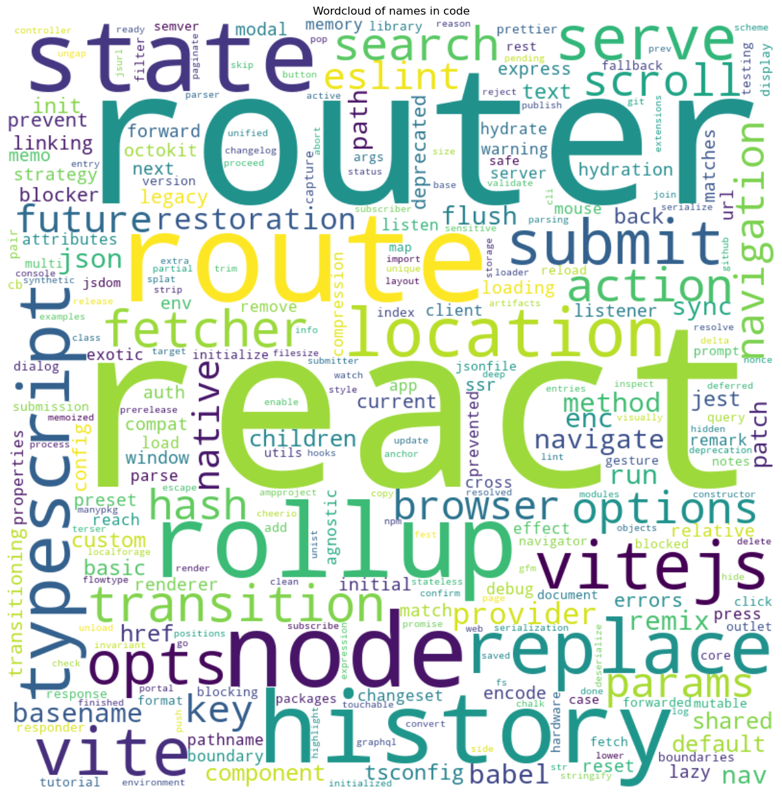
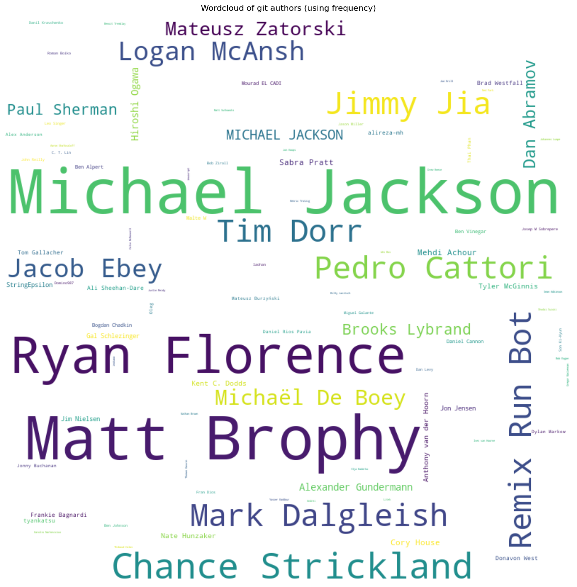

# Wordcloud
   

### References
- [jqassistant](https://jqassistant.org)
- [py2neo](https://py2neo.org/2021.1/)

## Word Cloud

## WordCloud of names in code

<table border="1" class="dataframe">
  <thead>
    <tr style="text-align: right;">
      <th></th>
      <th>word</th>
    </tr>
  </thead>
  <tbody>
    <tr>
      <th>0</th>
      <td>artifacts</td>
    </tr>
    <tr>
      <th>1</th>
      <td>npm</td>
    </tr>
    <tr>
      <th>2</th>
      <td>package</td>
    </tr>
    <tr>
      <th>3</th>
      <td>json</td>
    </tr>
    <tr>
      <th>4</th>
      <td>react</td>
    </tr>
    <tr>
      <th>5</th>
      <td>router</td>
    </tr>
    <tr>
      <th>6</th>
      <td>packages</td>
    </tr>
    <tr>
      <th>7</th>
      <td>router</td>
    </tr>
    <tr>
      <th>8</th>
      <td>react</td>
    </tr>
    <tr>
      <th>9</th>
      <td>router</td>
    </tr>
  </tbody>
</table>

    There are 2483 words in the dataset for the plot titled 'Wordcloud of names in code'.

    

    

## WordCloud of git authors

<table border="1" class="dataframe">
  <thead>
    <tr style="text-align: right;">
      <th></th>
      <th>word</th>
      <th>frequency</th>
    </tr>
  </thead>
  <tbody>
    <tr>
      <th>0</th>
      <td>Matija Marohnić</td>
      <td>1</td>
    </tr>
    <tr>
      <th>1</th>
      <td>Matt Brophy</td>
      <td>1852</td>
    </tr>
    <tr>
      <th>2</th>
      <td>Remix Run Bot</td>
      <td>383</td>
    </tr>
    <tr>
      <th>3</th>
      <td>Mark Dalgleish</td>
      <td>362</td>
    </tr>
    <tr>
      <th>4</th>
      <td>Victor El Hajj</td>
      <td>1</td>
    </tr>
    <tr>
      <th>5</th>
      <td>Brian Boatright</td>
      <td>1</td>
    </tr>
    <tr>
      <th>6</th>
      <td>yoshida</td>
      <td>1</td>
    </tr>
    <tr>
      <th>7</th>
      <td>Jacob Ebey</td>
      <td>239</td>
    </tr>
    <tr>
      <th>8</th>
      <td>bravo-kernel</td>
      <td>1</td>
    </tr>
    <tr>
      <th>9</th>
      <td>Tim Dorr</td>
      <td>385</td>
    </tr>
  </tbody>
</table>

    

    

