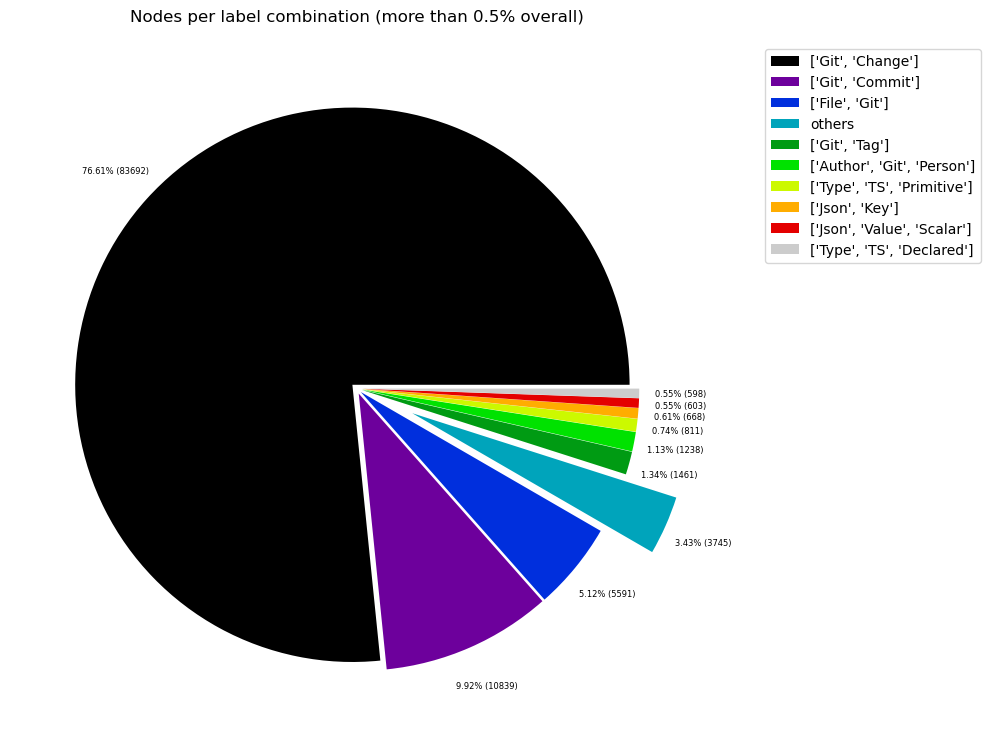
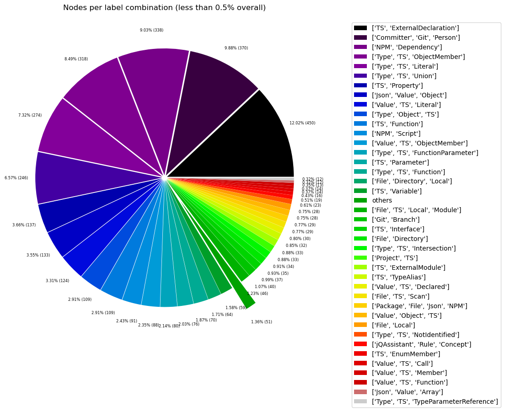
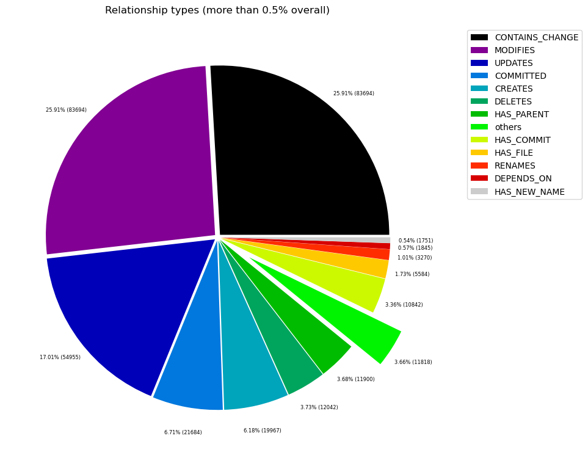
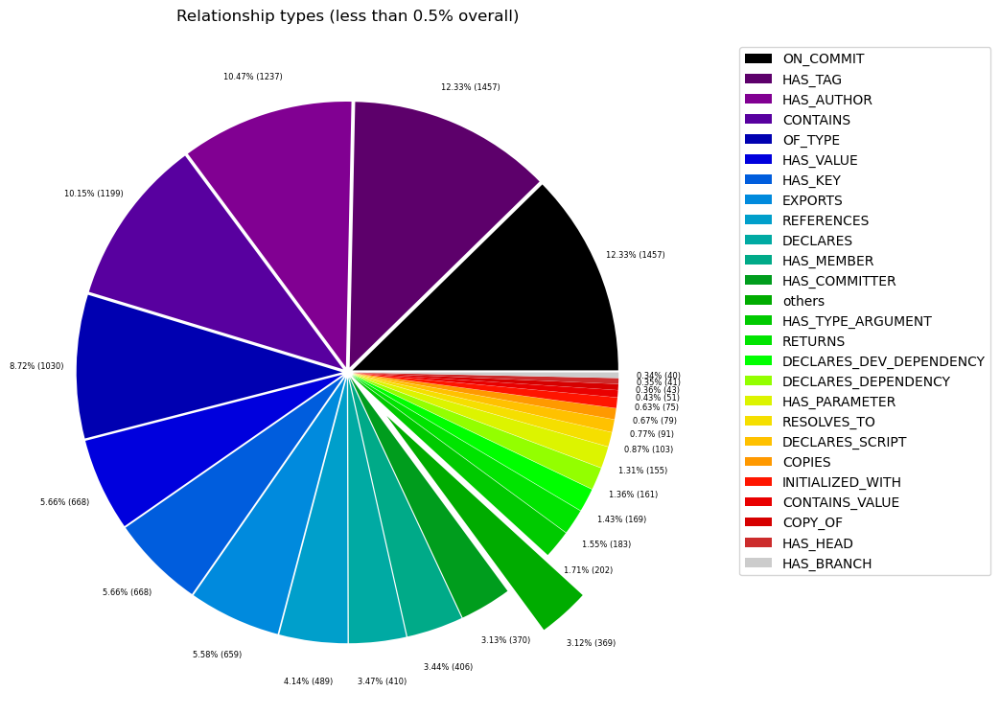

# Overview in General
   

This file contains a general overview of the data in the graph including node labels and relationships types.

### References
- [jqassistant](https://jqassistant.org)
- [Neo4j Python Driver](https://neo4j.com/docs/api/python-driver/current)

## Node Labels

### Table 1a - Highest node count by label combination

Lists the 30 label combinations with the highest number of nodes. The labels with the lowest node count are listed in table 1b.
The total list would sum up to the total number of labels (100%).

The whole table can be found in the CSV report `Node_label_combination_count`.

<table border="1" class="dataframe">
  <thead>
    <tr style="text-align: right;">
      <th></th>
      <th>nodeLabels</th>
      <th>nodesWithThatLabels</th>
      <th>nodesWithThatLabelsPercent</th>
    </tr>
  </thead>
  <tbody>
    <tr>
      <th>0</th>
      <td>[Git, Change]</td>
      <td>84159</td>
      <td>76.706223</td>
    </tr>
    <tr>
      <th>1</th>
      <td>[Git, Commit]</td>
      <td>10850</td>
      <td>9.889168</td>
    </tr>
    <tr>
      <th>2</th>
      <td>[File, Git]</td>
      <td>5589</td>
      <td>5.094061</td>
    </tr>
    <tr>
      <th>3</th>
      <td>[Git, Tag]</td>
      <td>1457</td>
      <td>1.327974</td>
    </tr>
    <tr>
      <th>4</th>
      <td>[Author, Git, Person]</td>
      <td>1236</td>
      <td>1.126545</td>
    </tr>
    <tr>
      <th>5</th>
      <td>[Type, TS, Primitive]</td>
      <td>811</td>
      <td>0.739181</td>
    </tr>
    <tr>
      <th>6</th>
      <td>[Json, Key]</td>
      <td>668</td>
      <td>0.608845</td>
    </tr>
    <tr>
      <th>7</th>
      <td>[Json, Value, Scalar]</td>
      <td>603</td>
      <td>0.549601</td>
    </tr>
    <tr>
      <th>8</th>
      <td>[Type, TS, Declared]</td>
      <td>598</td>
      <td>0.545044</td>
    </tr>
    <tr>
      <th>9</th>
      <td>[TS, ExternalDeclaration]</td>
      <td>444</td>
      <td>0.404681</td>
    </tr>
    <tr>
      <th>10</th>
      <td>[Committer, Git, Person]</td>
      <td>371</td>
      <td>0.338146</td>
    </tr>
    <tr>
      <th>11</th>
      <td>[NPM, Dependency]</td>
      <td>338</td>
      <td>0.308068</td>
    </tr>
    <tr>
      <th>12</th>
      <td>[Type, TS, ObjectMember]</td>
      <td>318</td>
      <td>0.289839</td>
    </tr>
    <tr>
      <th>13</th>
      <td>[Type, TS, Literal]</td>
      <td>274</td>
      <td>0.249736</td>
    </tr>
    <tr>
      <th>14</th>
      <td>[Type, TS, Union]</td>
      <td>246</td>
      <td>0.224215</td>
    </tr>
    <tr>
      <th>15</th>
      <td>[TS, Property]</td>
      <td>137</td>
      <td>0.124868</td>
    </tr>
    <tr>
      <th>16</th>
      <td>[Json, Value, Object]</td>
      <td>133</td>
      <td>0.121222</td>
    </tr>
    <tr>
      <th>17</th>
      <td>[Value, TS, Literal]</td>
      <td>124</td>
      <td>0.113019</td>
    </tr>
    <tr>
      <th>18</th>
      <td>[Type, Object, TS]</td>
      <td>109</td>
      <td>0.099347</td>
    </tr>
    <tr>
      <th>19</th>
      <td>[TS, Function]</td>
      <td>109</td>
      <td>0.099347</td>
    </tr>
    <tr>
      <th>20</th>
      <td>[NPM, Script]</td>
      <td>91</td>
      <td>0.082941</td>
    </tr>
    <tr>
      <th>21</th>
      <td>[Value, TS, ObjectMember]</td>
      <td>88</td>
      <td>0.080207</td>
    </tr>
    <tr>
      <th>22</th>
      <td>[Type, TS, FunctionParameter]</td>
      <td>80</td>
      <td>0.072916</td>
    </tr>
    <tr>
      <th>23</th>
      <td>[TS, Parameter]</td>
      <td>76</td>
      <td>0.069270</td>
    </tr>
    <tr>
      <th>24</th>
      <td>[Type, TS, Function]</td>
      <td>70</td>
      <td>0.063801</td>
    </tr>
    <tr>
      <th>25</th>
      <td>[File, Directory, Local]</td>
      <td>64</td>
      <td>0.058332</td>
    </tr>
    <tr>
      <th>26</th>
      <td>[TS, Variable]</td>
      <td>59</td>
      <td>0.053775</td>
    </tr>
    <tr>
      <th>27</th>
      <td>[File, TS, Local, Module]</td>
      <td>46</td>
      <td>0.041926</td>
    </tr>
    <tr>
      <th>28</th>
      <td>[Git, Branch]</td>
      <td>46</td>
      <td>0.041926</td>
    </tr>
    <tr>
      <th>29</th>
      <td>[TS, Interface]</td>
      <td>37</td>
      <td>0.033723</td>
    </tr>
  </tbody>
</table>

### Chart 1a - Highest node count by label combination

Values under 0.5% will be grouped into "others" to get a cleaner plot. The group "others" is then broken down in Chart 1b.

    <Figure size 640x480 with 0 Axes>

    

    

### Table 1b - Lowest node count by label combination

Lists the 30 label combinations with the lowest number of nodes until they reach 0.5% of the total node count, which are shown above.

<table border="1" class="dataframe">
  <thead>
    <tr style="text-align: right;">
      <th></th>
      <th>nodeLabels</th>
      <th>nodesWithThatLabels</th>
      <th>nodesWithThatLabelsPercent</th>
    </tr>
  </thead>
  <tbody>
    <tr>
      <th>0</th>
      <td>[Analyze, Task, jQAssistant]</td>
      <td>1</td>
      <td>0.000911</td>
    </tr>
    <tr>
      <th>1</th>
      <td>[Repository, File, Git]</td>
      <td>1</td>
      <td>0.000911</td>
    </tr>
    <tr>
      <th>2</th>
      <td>[Value, TS, Null]</td>
      <td>1</td>
      <td>0.000911</td>
    </tr>
    <tr>
      <th>3</th>
      <td>[TS, Constructor]</td>
      <td>2</td>
      <td>0.001823</td>
    </tr>
    <tr>
      <th>4</th>
      <td>[TS, Class]</td>
      <td>2</td>
      <td>0.001823</td>
    </tr>
    <tr>
      <th>5</th>
      <td>[TS, Enum]</td>
      <td>4</td>
      <td>0.003646</td>
    </tr>
    <tr>
      <th>6</th>
      <td>[TS, Method]</td>
      <td>4</td>
      <td>0.003646</td>
    </tr>
    <tr>
      <th>7</th>
      <td>[Value, Array, TS]</td>
      <td>5</td>
      <td>0.004557</td>
    </tr>
    <tr>
      <th>8</th>
      <td>[Type, TS, Tuple]</td>
      <td>6</td>
      <td>0.005469</td>
    </tr>
    <tr>
      <th>9</th>
      <td>[NPM, Engine]</td>
      <td>6</td>
      <td>0.005469</td>
    </tr>
    <tr>
      <th>10</th>
      <td>[TS, TypeParameter]</td>
      <td>8</td>
      <td>0.007292</td>
    </tr>
    <tr>
      <th>11</th>
      <td>[Value, TS, Complex]</td>
      <td>11</td>
      <td>0.010026</td>
    </tr>
    <tr>
      <th>12</th>
      <td>[Type, TS, TypeParameterReference]</td>
      <td>12</td>
      <td>0.010937</td>
    </tr>
    <tr>
      <th>13</th>
      <td>[Json, Value, Array]</td>
      <td>12</td>
      <td>0.010937</td>
    </tr>
    <tr>
      <th>14</th>
      <td>[Value, TS, Function]</td>
      <td>13</td>
      <td>0.011849</td>
    </tr>
    <tr>
      <th>15</th>
      <td>[Value, TS, Call]</td>
      <td>14</td>
      <td>0.012760</td>
    </tr>
    <tr>
      <th>16</th>
      <td>[Value, TS, Member]</td>
      <td>14</td>
      <td>0.012760</td>
    </tr>
    <tr>
      <th>17</th>
      <td>[TS, EnumMember]</td>
      <td>16</td>
      <td>0.014583</td>
    </tr>
    <tr>
      <th>18</th>
      <td>[jQAssistant, Rule, Concept]</td>
      <td>19</td>
      <td>0.017317</td>
    </tr>
    <tr>
      <th>19</th>
      <td>[Type, TS, NotIdentified]</td>
      <td>23</td>
      <td>0.020963</td>
    </tr>
    <tr>
      <th>20</th>
      <td>[Value, Object, TS]</td>
      <td>28</td>
      <td>0.025520</td>
    </tr>
    <tr>
      <th>21</th>
      <td>[File, Local]</td>
      <td>28</td>
      <td>0.025520</td>
    </tr>
    <tr>
      <th>22</th>
      <td>[File, TS, Scan]</td>
      <td>29</td>
      <td>0.026432</td>
    </tr>
    <tr>
      <th>23</th>
      <td>[Package, File, Json, NPM]</td>
      <td>29</td>
      <td>0.026432</td>
    </tr>
    <tr>
      <th>24</th>
      <td>[Value, TS, Declared]</td>
      <td>30</td>
      <td>0.027343</td>
    </tr>
    <tr>
      <th>25</th>
      <td>[TS, TypeAlias]</td>
      <td>32</td>
      <td>0.029166</td>
    </tr>
    <tr>
      <th>26</th>
      <td>[TS, ExternalModule]</td>
      <td>33</td>
      <td>0.030078</td>
    </tr>
    <tr>
      <th>27</th>
      <td>[Project, TS]</td>
      <td>33</td>
      <td>0.030078</td>
    </tr>
    <tr>
      <th>28</th>
      <td>[Type, TS, Intersection]</td>
      <td>34</td>
      <td>0.030989</td>
    </tr>
    <tr>
      <th>29</th>
      <td>[File, Directory]</td>
      <td>35</td>
      <td>0.031901</td>
    </tr>
  </tbody>
</table>

### Chart 1b - Lowest node count by label combination

Shows the lowest (less than 0.5% overall) node count label combinations. Therefore, this plot breaks down the "others" slice of the pie chart above. Values under 0.01% will be grouped into "others" to get a cleaner plot.

    <Figure size 640x480 with 0 Axes>

    

    

### Table 1c - Highest node count by single label

Lists the 40 labels with the highest number of nodes.
Doesn't sum up to the total number of nodes or 100% because one node can have multiple labels.
Helps to identify commonly used labels.

<table border="1" class="dataframe">
  <thead>
    <tr style="text-align: right;">
      <th></th>
      <th>nodeLabel</th>
      <th>nodesWithThatLabel</th>
      <th>nodesWithThatLabelPercent</th>
    </tr>
  </thead>
  <tbody>
    <tr>
      <th>0</th>
      <td>Git</td>
      <td>103709</td>
      <td>94.524955</td>
    </tr>
    <tr>
      <th>1</th>
      <td>Change</td>
      <td>84159</td>
      <td>76.706223</td>
    </tr>
    <tr>
      <th>2</th>
      <td>Commit</td>
      <td>10850</td>
      <td>9.889168</td>
    </tr>
    <tr>
      <th>3</th>
      <td>File</td>
      <td>5821</td>
      <td>5.305516</td>
    </tr>
    <tr>
      <th>4</th>
      <td>TS</td>
      <td>3980</td>
      <td>3.627547</td>
    </tr>
    <tr>
      <th>5</th>
      <td>Type</td>
      <td>2581</td>
      <td>2.352437</td>
    </tr>
    <tr>
      <th>6</th>
      <td>Person</td>
      <td>1607</td>
      <td>1.464691</td>
    </tr>
    <tr>
      <th>7</th>
      <td>Tag</td>
      <td>1457</td>
      <td>1.327974</td>
    </tr>
    <tr>
      <th>8</th>
      <td>Json</td>
      <td>1445</td>
      <td>1.317037</td>
    </tr>
    <tr>
      <th>9</th>
      <td>Author</td>
      <td>1236</td>
      <td>1.126545</td>
    </tr>
    <tr>
      <th>10</th>
      <td>Value</td>
      <td>1076</td>
      <td>0.980714</td>
    </tr>
    <tr>
      <th>11</th>
      <td>Primitive</td>
      <td>811</td>
      <td>0.739181</td>
    </tr>
    <tr>
      <th>12</th>
      <td>Key</td>
      <td>668</td>
      <td>0.608845</td>
    </tr>
    <tr>
      <th>13</th>
      <td>Declared</td>
      <td>628</td>
      <td>0.572387</td>
    </tr>
    <tr>
      <th>14</th>
      <td>Scalar</td>
      <td>603</td>
      <td>0.549601</td>
    </tr>
    <tr>
      <th>15</th>
      <td>NPM</td>
      <td>464</td>
      <td>0.422910</td>
    </tr>
    <tr>
      <th>16</th>
      <td>ExternalDeclaration</td>
      <td>444</td>
      <td>0.404681</td>
    </tr>
    <tr>
      <th>17</th>
      <td>ObjectMember</td>
      <td>406</td>
      <td>0.370046</td>
    </tr>
    <tr>
      <th>18</th>
      <td>Literal</td>
      <td>398</td>
      <td>0.362755</td>
    </tr>
    <tr>
      <th>19</th>
      <td>Committer</td>
      <td>371</td>
      <td>0.338146</td>
    </tr>
    <tr>
      <th>20</th>
      <td>Dependency</td>
      <td>338</td>
      <td>0.308068</td>
    </tr>
    <tr>
      <th>21</th>
      <td>Object</td>
      <td>270</td>
      <td>0.246090</td>
    </tr>
    <tr>
      <th>22</th>
      <td>Union</td>
      <td>246</td>
      <td>0.224215</td>
    </tr>
    <tr>
      <th>23</th>
      <td>Function</td>
      <td>192</td>
      <td>0.174997</td>
    </tr>
    <tr>
      <th>24</th>
      <td>Local</td>
      <td>138</td>
      <td>0.125779</td>
    </tr>
    <tr>
      <th>25</th>
      <td>Property</td>
      <td>137</td>
      <td>0.124868</td>
    </tr>
    <tr>
      <th>26</th>
      <td>Directory</td>
      <td>99</td>
      <td>0.090233</td>
    </tr>
    <tr>
      <th>27</th>
      <td>Script</td>
      <td>91</td>
      <td>0.082941</td>
    </tr>
    <tr>
      <th>28</th>
      <td>FunctionParameter</td>
      <td>80</td>
      <td>0.072916</td>
    </tr>
    <tr>
      <th>29</th>
      <td>Parameter</td>
      <td>76</td>
      <td>0.069270</td>
    </tr>
    <tr>
      <th>30</th>
      <td>Variable</td>
      <td>59</td>
      <td>0.053775</td>
    </tr>
    <tr>
      <th>31</th>
      <td>Branch</td>
      <td>46</td>
      <td>0.041926</td>
    </tr>
    <tr>
      <th>32</th>
      <td>Module</td>
      <td>46</td>
      <td>0.041926</td>
    </tr>
    <tr>
      <th>33</th>
      <td>Interface</td>
      <td>37</td>
      <td>0.033723</td>
    </tr>
    <tr>
      <th>34</th>
      <td>Intersection</td>
      <td>34</td>
      <td>0.030989</td>
    </tr>
    <tr>
      <th>35</th>
      <td>ExternalModule</td>
      <td>33</td>
      <td>0.030078</td>
    </tr>
    <tr>
      <th>36</th>
      <td>Project</td>
      <td>33</td>
      <td>0.030078</td>
    </tr>
    <tr>
      <th>37</th>
      <td>TypeAlias</td>
      <td>32</td>
      <td>0.029166</td>
    </tr>
    <tr>
      <th>38</th>
      <td>Package</td>
      <td>29</td>
      <td>0.026432</td>
    </tr>
    <tr>
      <th>39</th>
      <td>Scan</td>
      <td>29</td>
      <td>0.026432</td>
    </tr>
  </tbody>
</table>

### Chart 1c - Highest node count by label

Shows the 40 labels with the highest number of nodes.

    <Figure size 640x480 with 0 Axes>

    

    

## Relationship Types

### Table 2a - Highest relationship count by type

Lists the 30 relationship types with the highest number of occurrences.
The whole table can be found in the CSV report `Relationship_type_count`.

    Total number of relationships: 324519

<table border="1" class="dataframe">
  <thead>
    <tr style="text-align: right;">
      <th></th>
      <th>relationshipType</th>
      <th>nodesWithThatRelationshipType</th>
      <th>nodesWithThatRelationshipTypePercent</th>
    </tr>
  </thead>
  <tbody>
    <tr>
      <th>0</th>
      <td>CONTAINS_CHANGE</td>
      <td>84159</td>
      <td>25.933458</td>
    </tr>
    <tr>
      <th>1</th>
      <td>MODIFIES</td>
      <td>84159</td>
      <td>25.933458</td>
    </tr>
    <tr>
      <th>2</th>
      <td>UPDATES</td>
      <td>55223</td>
      <td>17.016877</td>
    </tr>
    <tr>
      <th>3</th>
      <td>COMMITTED</td>
      <td>21700</td>
      <td>6.686820</td>
    </tr>
    <tr>
      <th>4</th>
      <td>CREATES</td>
      <td>20144</td>
      <td>6.207341</td>
    </tr>
    <tr>
      <th>5</th>
      <td>DELETES</td>
      <td>12089</td>
      <td>3.725206</td>
    </tr>
    <tr>
      <th>6</th>
      <td>HAS_PARENT</td>
      <td>11914</td>
      <td>3.671280</td>
    </tr>
    <tr>
      <th>7</th>
      <td>HAS_COMMIT</td>
      <td>10850</td>
      <td>3.343410</td>
    </tr>
    <tr>
      <th>8</th>
      <td>HAS_FILE</td>
      <td>5589</td>
      <td>1.722241</td>
    </tr>
    <tr>
      <th>9</th>
      <td>RENAMES</td>
      <td>3297</td>
      <td>1.015965</td>
    </tr>
    <tr>
      <th>10</th>
      <td>DEPENDS_ON</td>
      <td>1823</td>
      <td>0.561754</td>
    </tr>
    <tr>
      <th>11</th>
      <td>HAS_NEW_NAME</td>
      <td>1756</td>
      <td>0.541109</td>
    </tr>
    <tr>
      <th>12</th>
      <td>HAS_TAG</td>
      <td>1457</td>
      <td>0.448972</td>
    </tr>
    <tr>
      <th>13</th>
      <td>ON_COMMIT</td>
      <td>1457</td>
      <td>0.448972</td>
    </tr>
    <tr>
      <th>14</th>
      <td>HAS_AUTHOR</td>
      <td>1236</td>
      <td>0.380871</td>
    </tr>
    <tr>
      <th>15</th>
      <td>CONTAINS</td>
      <td>1199</td>
      <td>0.369470</td>
    </tr>
    <tr>
      <th>16</th>
      <td>OF_TYPE</td>
      <td>1030</td>
      <td>0.317393</td>
    </tr>
    <tr>
      <th>17</th>
      <td>HAS_KEY</td>
      <td>668</td>
      <td>0.205843</td>
    </tr>
    <tr>
      <th>18</th>
      <td>HAS_VALUE</td>
      <td>668</td>
      <td>0.205843</td>
    </tr>
    <tr>
      <th>19</th>
      <td>EXPORTS</td>
      <td>651</td>
      <td>0.200605</td>
    </tr>
    <tr>
      <th>20</th>
      <td>REFERENCES</td>
      <td>489</td>
      <td>0.150685</td>
    </tr>
    <tr>
      <th>21</th>
      <td>DECLARES</td>
      <td>410</td>
      <td>0.126341</td>
    </tr>
    <tr>
      <th>22</th>
      <td>HAS_MEMBER</td>
      <td>406</td>
      <td>0.125108</td>
    </tr>
    <tr>
      <th>23</th>
      <td>HAS_COMMITTER</td>
      <td>371</td>
      <td>0.114323</td>
    </tr>
    <tr>
      <th>24</th>
      <td>HAS_TYPE_ARGUMENT</td>
      <td>202</td>
      <td>0.062246</td>
    </tr>
    <tr>
      <th>25</th>
      <td>RETURNS</td>
      <td>183</td>
      <td>0.056391</td>
    </tr>
    <tr>
      <th>26</th>
      <td>DECLARES_DEV_DEPENDENCY</td>
      <td>169</td>
      <td>0.052077</td>
    </tr>
    <tr>
      <th>27</th>
      <td>DECLARES_DEPENDENCY</td>
      <td>161</td>
      <td>0.049612</td>
    </tr>
    <tr>
      <th>28</th>
      <td>HAS_PARAMETER</td>
      <td>155</td>
      <td>0.047763</td>
    </tr>
    <tr>
      <th>29</th>
      <td>RESOLVES_TO</td>
      <td>103</td>
      <td>0.031739</td>
    </tr>
  </tbody>
</table>

### Chart 2a - Highest relationship count by type

Values under 0.5% will be grouped into "others" to get a cleaner plot. The group "others" is then broken down in the second chart.

    <Figure size 640x480 with 0 Axes>

    

    

### Table 2b - Lowest relationship count by type

Lists the 30 relationships type with the lowest number of occurrences up to 0.5% of the total node count. This is essentially breaking down the "others" slice from the chart above.

<table border="1" class="dataframe">
  <thead>
    <tr style="text-align: right;">
      <th></th>
      <th>relationshipType</th>
      <th>nodesWithThatRelationshipType</th>
      <th>nodesWithThatRelationshipTypePercent</th>
    </tr>
  </thead>
  <tbody>
    <tr>
      <th>0</th>
      <td>HAS</td>
      <td>1</td>
      <td>0.000308</td>
    </tr>
    <tr>
      <th>1</th>
      <td>REFERENCED_PROJECTS</td>
      <td>5</td>
      <td>0.001541</td>
    </tr>
    <tr>
      <th>2</th>
      <td>DECLARES_ENGINE</td>
      <td>6</td>
      <td>0.001849</td>
    </tr>
    <tr>
      <th>3</th>
      <td>SIMILAR</td>
      <td>8</td>
      <td>0.002465</td>
    </tr>
    <tr>
      <th>4</th>
      <td>DECLARES_PEER_DEPENDENCY</td>
      <td>8</td>
      <td>0.002465</td>
    </tr>
    <tr>
      <th>5</th>
      <td>CONSTRAINED_BY</td>
      <td>8</td>
      <td>0.002465</td>
    </tr>
    <tr>
      <th>6</th>
      <td>EXTENDS</td>
      <td>12</td>
      <td>0.003698</td>
    </tr>
    <tr>
      <th>7</th>
      <td>PARENT</td>
      <td>14</td>
      <td>0.004314</td>
    </tr>
    <tr>
      <th>8</th>
      <td>MEMBER</td>
      <td>14</td>
      <td>0.004314</td>
    </tr>
    <tr>
      <th>9</th>
      <td>HAS_ARGUMENT</td>
      <td>14</td>
      <td>0.004314</td>
    </tr>
    <tr>
      <th>10</th>
      <td>CALLS</td>
      <td>14</td>
      <td>0.004314</td>
    </tr>
    <tr>
      <th>11</th>
      <td>INCLUDES_CONCEPT</td>
      <td>19</td>
      <td>0.005855</td>
    </tr>
    <tr>
      <th>12</th>
      <td>PROVIDED_BY_NPM_DEPENDENCY</td>
      <td>20</td>
      <td>0.006163</td>
    </tr>
    <tr>
      <th>13</th>
      <td>REQUIRES_CONCEPT</td>
      <td>28</td>
      <td>0.008628</td>
    </tr>
    <tr>
      <th>14</th>
      <td>CONTAINS_PROJECT</td>
      <td>33</td>
      <td>0.010169</td>
    </tr>
    <tr>
      <th>15</th>
      <td>HAS_CONFIG</td>
      <td>33</td>
      <td>0.010169</td>
    </tr>
    <tr>
      <th>16</th>
      <td>IS_DESCRIBED_IN_NPM_PACKAGE</td>
      <td>33</td>
      <td>0.010169</td>
    </tr>
    <tr>
      <th>17</th>
      <td>HAS_ROOT</td>
      <td>33</td>
      <td>0.010169</td>
    </tr>
    <tr>
      <th>18</th>
      <td>HAS_NPM_PACKAGE</td>
      <td>33</td>
      <td>0.010169</td>
    </tr>
    <tr>
      <th>19</th>
      <td>USES</td>
      <td>33</td>
      <td>0.010169</td>
    </tr>
    <tr>
      <th>20</th>
      <td>COPY_OF</td>
      <td>43</td>
      <td>0.013250</td>
    </tr>
    <tr>
      <th>21</th>
      <td>HAS_BRANCH</td>
      <td>46</td>
      <td>0.014175</td>
    </tr>
    <tr>
      <th>22</th>
      <td>HAS_HEAD</td>
      <td>47</td>
      <td>0.014483</td>
    </tr>
    <tr>
      <th>23</th>
      <td>CONTAINS_VALUE</td>
      <td>51</td>
      <td>0.015716</td>
    </tr>
    <tr>
      <th>24</th>
      <td>INITIALIZED_WITH</td>
      <td>75</td>
      <td>0.023111</td>
    </tr>
    <tr>
      <th>25</th>
      <td>COPIES</td>
      <td>79</td>
      <td>0.024344</td>
    </tr>
    <tr>
      <th>26</th>
      <td>DECLARES_SCRIPT</td>
      <td>91</td>
      <td>0.028042</td>
    </tr>
    <tr>
      <th>27</th>
      <td>RESOLVES_TO</td>
      <td>103</td>
      <td>0.031739</td>
    </tr>
    <tr>
      <th>28</th>
      <td>HAS_PARAMETER</td>
      <td>155</td>
      <td>0.047763</td>
    </tr>
    <tr>
      <th>29</th>
      <td>DECLARES_DEPENDENCY</td>
      <td>161</td>
      <td>0.049612</td>
    </tr>
  </tbody>
</table>

### Chart 2b - Lowest relationship count by type

Shows the lowest (less than 0.5% overall) relationship types. This plot breaks down the "others" slice of the pie chart above. Values under 0.01% will be grouped into "others" to get a cleaner plot.

    <Figure size 640x480 with 0 Axes>

    

    

## Node labels with their relationships

### Table 3a - Highest relationship count by node labels and relationship type

Lists the 30 node labels and their relationship types with the highest number of occurrences.

<table border="1" class="dataframe">
  <thead>
    <tr style="text-align: right;">
      <th></th>
      <th>sourceLabels</th>
      <th>relationType</th>
      <th>targetLabels</th>
      <th>numberOfRelationships</th>
      <th>numberOfNodesWithSameLabelsAsSource</th>
      <th>numberOfNodesWithSameLabelsAsTarget</th>
      <th>densityInPercent</th>
    </tr>
  </thead>
  <tbody>
    <tr>
      <th>0</th>
      <td>[Git, Commit]</td>
      <td>CONTAINS_CHANGE</td>
      <td>[Git, Change]</td>
      <td>84159</td>
      <td>10850</td>
      <td>84159</td>
      <td>0.009217</td>
    </tr>
    <tr>
      <th>1</th>
      <td>[Git, Change]</td>
      <td>MODIFIES</td>
      <td>[File, Git]</td>
      <td>84159</td>
      <td>84159</td>
      <td>5589</td>
      <td>0.017892</td>
    </tr>
    <tr>
      <th>2</th>
      <td>[Git, Change]</td>
      <td>UPDATES</td>
      <td>[File, Git]</td>
      <td>55223</td>
      <td>84159</td>
      <td>5589</td>
      <td>0.011740</td>
    </tr>
    <tr>
      <th>3</th>
      <td>[Git, Change]</td>
      <td>CREATES</td>
      <td>[File, Git]</td>
      <td>20144</td>
      <td>84159</td>
      <td>5589</td>
      <td>0.004283</td>
    </tr>
    <tr>
      <th>4</th>
      <td>[Git, Change]</td>
      <td>DELETES</td>
      <td>[File, Git]</td>
      <td>12089</td>
      <td>84159</td>
      <td>5589</td>
      <td>0.002570</td>
    </tr>
    <tr>
      <th>5</th>
      <td>[Git, Commit]</td>
      <td>HAS_PARENT</td>
      <td>[Git, Commit]</td>
      <td>11914</td>
      <td>10850</td>
      <td>10850</td>
      <td>0.010120</td>
    </tr>
    <tr>
      <th>6</th>
      <td>[Repository, File, Git]</td>
      <td>HAS_COMMIT</td>
      <td>[Git, Commit]</td>
      <td>10850</td>
      <td>1</td>
      <td>10850</td>
      <td>100.000000</td>
    </tr>
    <tr>
      <th>7</th>
      <td>[Author, Git, Person]</td>
      <td>COMMITTED</td>
      <td>[Git, Commit]</td>
      <td>10850</td>
      <td>1236</td>
      <td>10850</td>
      <td>0.080906</td>
    </tr>
    <tr>
      <th>8</th>
      <td>[Committer, Git, Person]</td>
      <td>COMMITTED</td>
      <td>[Git, Commit]</td>
      <td>10850</td>
      <td>371</td>
      <td>10850</td>
      <td>0.269542</td>
    </tr>
    <tr>
      <th>9</th>
      <td>[Repository, File, Git]</td>
      <td>HAS_FILE</td>
      <td>[File, Git]</td>
      <td>5589</td>
      <td>1</td>
      <td>5589</td>
      <td>100.000000</td>
    </tr>
    <tr>
      <th>10</th>
      <td>[Git, Change]</td>
      <td>RENAMES</td>
      <td>[File, Git]</td>
      <td>3297</td>
      <td>84159</td>
      <td>5589</td>
      <td>0.000701</td>
    </tr>
    <tr>
      <th>11</th>
      <td>[File, Git]</td>
      <td>HAS_NEW_NAME</td>
      <td>[File, Git]</td>
      <td>1756</td>
      <td>5589</td>
      <td>5589</td>
      <td>0.005622</td>
    </tr>
    <tr>
      <th>12</th>
      <td>[Repository, File, Git]</td>
      <td>HAS_TAG</td>
      <td>[Git, Tag]</td>
      <td>1457</td>
      <td>1</td>
      <td>1457</td>
      <td>100.000000</td>
    </tr>
    <tr>
      <th>13</th>
      <td>[Git, Tag]</td>
      <td>ON_COMMIT</td>
      <td>[Git, Commit]</td>
      <td>1457</td>
      <td>1457</td>
      <td>10850</td>
      <td>0.009217</td>
    </tr>
    <tr>
      <th>14</th>
      <td>[Repository, File, Git]</td>
      <td>HAS_AUTHOR</td>
      <td>[Author, Git, Person]</td>
      <td>1236</td>
      <td>1</td>
      <td>1236</td>
      <td>100.000000</td>
    </tr>
    <tr>
      <th>15</th>
      <td>[Json, Value, Object]</td>
      <td>HAS_KEY</td>
      <td>[Json, Key]</td>
      <td>668</td>
      <td>133</td>
      <td>668</td>
      <td>0.751880</td>
    </tr>
    <tr>
      <th>16</th>
      <td>[TS, Function]</td>
      <td>DEPENDS_ON</td>
      <td>[TS, ExternalDeclaration]</td>
      <td>580</td>
      <td>109</td>
      <td>444</td>
      <td>1.198446</td>
    </tr>
    <tr>
      <th>17</th>
      <td>[Json, Key]</td>
      <td>HAS_VALUE</td>
      <td>[Json, Value, Scalar]</td>
      <td>552</td>
      <td>668</td>
      <td>603</td>
      <td>0.137039</td>
    </tr>
    <tr>
      <th>18</th>
      <td>[TS, ExternalModule]</td>
      <td>EXPORTS</td>
      <td>[TS, ExternalDeclaration]</td>
      <td>444</td>
      <td>33</td>
      <td>444</td>
      <td>3.030303</td>
    </tr>
    <tr>
      <th>19</th>
      <td>[Repository, File, Git]</td>
      <td>HAS_COMMITTER</td>
      <td>[Committer, Git, Person]</td>
      <td>371</td>
      <td>1</td>
      <td>371</td>
      <td>100.000000</td>
    </tr>
    <tr>
      <th>20</th>
      <td>[Type, Object, TS]</td>
      <td>HAS_MEMBER</td>
      <td>[Type, TS, ObjectMember]</td>
      <td>318</td>
      <td>109</td>
      <td>318</td>
      <td>0.917431</td>
    </tr>
    <tr>
      <th>21</th>
      <td>[File, TS, Local, Module, Mark4ModuleWeaklyCon...</td>
      <td>DEPENDS_ON</td>
      <td>[TS, ExternalDeclaration]</td>
      <td>308</td>
      <td>1</td>
      <td>444</td>
      <td>69.369369</td>
    </tr>
    <tr>
      <th>22</th>
      <td>[Type, TS, Union]</td>
      <td>CONTAINS</td>
      <td>[Type, TS, Primitive]</td>
      <td>303</td>
      <td>246</td>
      <td>811</td>
      <td>0.151875</td>
    </tr>
    <tr>
      <th>23</th>
      <td>[Type, TS, Declared]</td>
      <td>REFERENCES</td>
      <td>[TS, ExternalDeclaration]</td>
      <td>288</td>
      <td>598</td>
      <td>444</td>
      <td>0.108470</td>
    </tr>
    <tr>
      <th>24</th>
      <td>[Type, TS, Union]</td>
      <td>CONTAINS</td>
      <td>[Type, TS, Literal]</td>
      <td>238</td>
      <td>246</td>
      <td>274</td>
      <td>0.353095</td>
    </tr>
    <tr>
      <th>25</th>
      <td>[Type, TS, ObjectMember]</td>
      <td>OF_TYPE</td>
      <td>[Type, TS, Primitive]</td>
      <td>173</td>
      <td>318</td>
      <td>811</td>
      <td>0.067081</td>
    </tr>
    <tr>
      <th>26</th>
      <td>[Package, File, Json, NPM]</td>
      <td>DECLARES_DEV_DEPENDENCY</td>
      <td>[NPM, Dependency]</td>
      <td>169</td>
      <td>29</td>
      <td>338</td>
      <td>1.724138</td>
    </tr>
    <tr>
      <th>27</th>
      <td>[Package, File, Json, NPM]</td>
      <td>DECLARES_DEPENDENCY</td>
      <td>[NPM, Dependency]</td>
      <td>161</td>
      <td>29</td>
      <td>338</td>
      <td>1.642522</td>
    </tr>
    <tr>
      <th>28</th>
      <td>[TS, Function]</td>
      <td>DEPENDS_ON</td>
      <td>[TS, ExternalModule]</td>
      <td>148</td>
      <td>109</td>
      <td>33</td>
      <td>4.114540</td>
    </tr>
    <tr>
      <th>29</th>
      <td>[Type, TS, Union]</td>
      <td>CONTAINS</td>
      <td>[Type, TS, Declared]</td>
      <td>145</td>
      <td>246</td>
      <td>598</td>
      <td>0.098567</td>
    </tr>
  </tbody>
</table>

## Graph Density

    total_number_of_nodes (vertices): 109716
    total_number_of_relationships (edges): 324519
    -> total directed graph density: 2.6959023405919175e-05
    -> total directed graph density in percent: 0.0026959023405919175

